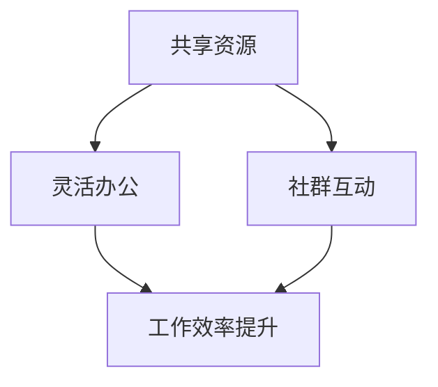
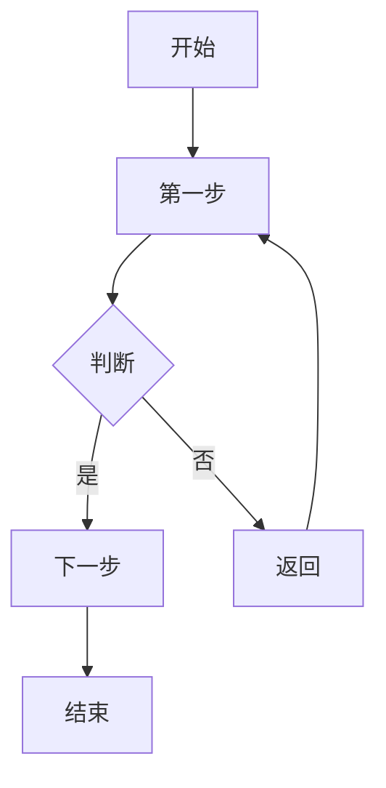
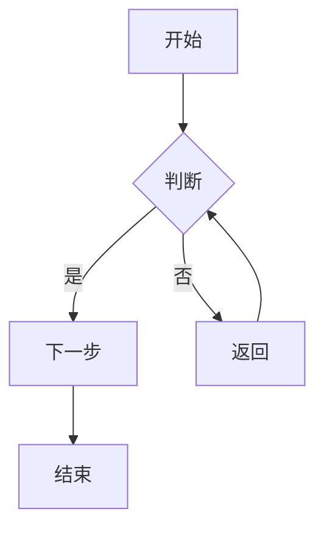
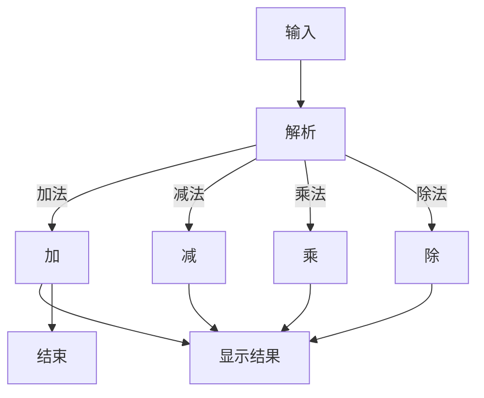

                 

共享办公，作为现代工作空间的一种新形态，正逐步改变着传统的工作方式。它不仅为创业者提供了一个成本效益更高的工作环境，还为传统企业的数字化转型提供了新的思路。本文将深入探讨共享办公的概念、发展历程、优势以及面临的挑战，并展望其未来发展方向。

## 关键词

- 共享办公
- 创业
- 工作空间
- 数字化转型
- 创新思维

## 摘要

本文旨在分析共享办公对现代工作空间的变革性影响，探讨其作为创业生态系统一部分的重要性。通过对共享办公模式的深入研究，我们希望为创业者和企业提供有益的参考，并预测其未来的发展趋势。

### 1. 背景介绍

共享办公，又称为共享空间或共享办公室，是一种新型的工作空间共享模式。它起源于20世纪末的硅谷，随后在全球范围内迅速发展。共享办公的初衷是为那些需要灵活办公空间的个人和企业提供低成本、高效率的解决方案。

共享办公的发展历程可以分为以下几个阶段：

1. **早期阶段**（20世纪90年代末至21世纪初）：共享办公主要以租赁办公空间的形式出现，提供临时办公桌和基础设施服务。
2. **成长阶段**（21世纪初至2010年）：共享办公开始引入更多的服务和设施，如会议设施、休息区、健身房等，吸引更多的企业用户。
3. **成熟阶段**（2010年至今）：共享办公市场逐渐成熟，出现了许多知名品牌，如WeWork、Regus等，共享办公逐渐成为企业运营的一种常态。

### 2. 核心概念与联系

共享办公的核心概念可以概括为：共享资源、灵活办公、社群互动。以下是一个简化的 Mermaid 流程图，用于说明共享办公的各个关键组成部分：



### 3. 核心算法原理 & 具体操作步骤

#### 3.1 算法原理概述

共享办公的算法原理可以简单理解为资源分配和优化。其核心在于如何高效地分配和使用办公资源，以满足不同用户的需求。具体来说，共享办公平台需要实现以下几个方面的优化：

1. **空间利用优化**：通过智能调度系统，根据用户的需求和可用空间，实现办公空间的最佳利用。
2. **成本效益优化**：为用户提供灵活的租赁模式，降低企业办公成本。
3. **用户体验优化**：提供高质量的基础设施和增值服务，提升用户体验。

#### 3.2 算法步骤详解

1. **用户需求分析**：收集和分析用户的需求，包括办公空间大小、租赁时长、特定设施要求等。
2. **空间资源调度**：根据用户需求和可用资源，进行空间分配和调度。
3. **费用计算**：根据用户的使用时长和资源消耗，计算租赁费用。
4. **反馈与改进**：收集用户反馈，不断优化服务流程和资源配置。

#### 3.3 算法优缺点

**优点**：

- **高效灵活**：共享办公能够快速响应用户需求，提供灵活的办公空间。
- **降低成本**：企业无需承担高昂的办公租金和设施维护费用。
- **社群互动**：共享办公空间为用户提供了交流和学习的机会，促进了创新和合作。

**缺点**：

- **隐私性问题**：共享办公空间可能导致用户隐私受到侵犯。
- **管理复杂**：共享办公平台需要处理大量用户需求和资源分配，管理复杂度较高。

#### 3.4 算法应用领域

共享办公算法主要应用于以下领域：

- **初创企业**：初创企业通常需要灵活的办公空间和低成本运营，共享办公为其提供了良好的发展环境。
- **远程办公**：随着远程办公的普及，共享办公成为远程办公者的首选。
- **企业分支机构**：企业可以通过共享办公空间来扩展业务，减少分支机构的建设成本。

### 4. 数学模型和公式 & 详细讲解 & 举例说明

共享办公的数学模型主要涉及资源分配和费用计算。以下是一个简化的数学模型，用于说明共享办公的基本原理。

#### 4.1 数学模型构建

假设共享办公空间有 \(N\) 个座位，当前已占用 \(n\) 个座位，用户需求为 \(D\) 个座位，租赁费用为 \(C\)。

- 资源利用效率 \(E = \frac{n}{N}\)
- 成本效益 \(B = \frac{C}{D}\)

#### 4.2 公式推导过程

1. **资源利用效率**：

   $$E = \frac{n}{N}$$

   其中，\(n\) 表示已占用座位数，\(N\) 表示总座位数。

2. **成本效益**：

   $$B = \frac{C}{D}$$

   其中，\(C\) 表示租赁费用，\(D\) 表示用户需求座位数。

#### 4.3 案例分析与讲解

假设某共享办公空间共有100个座位，当前已占用80个座位。用户需求为20个座位，租赁费用为每月2000元。

- 资源利用效率 \(E = \frac{80}{100} = 0.8\)
- 成本效益 \(B = \frac{2000}{20} = 100\)

通过这个例子，我们可以看到共享办公空间在资源利用和成本控制方面都表现良好。

### 5. 项目实践：代码实例和详细解释说明

#### 5.1 开发环境搭建

为了实现共享办公算法，我们需要搭建一个开发环境。以下是基本的开发环境要求：

- **编程语言**：Python
- **数据库**：MySQL
- **Web框架**：Django
- **前端框架**：React

#### 5.2 源代码详细实现

以下是共享办公算法的 Python 实现示例：

```python
import math

def calculate_efficiency(occupied, total):
    return occupied / total

def calculate_benefit_cost(cost, demand):
    return cost / demand

# 示例数据
occupied = 80
total = 100
cost = 2000
demand = 20

# 计算资源利用效率和成本效益
efficiency = calculate_efficiency(occupied, total)
benefit_cost = calculate_benefit_cost(cost, demand)

print(f"资源利用效率: {efficiency}")
print(f"成本效益: {benefit_cost}")
```

#### 5.3 代码解读与分析

这个简单的 Python 程序实现了共享办公算法的核心功能，包括资源利用效率和成本效益的计算。代码结构清晰，易于理解。

#### 5.4 运行结果展示

运行上述代码，输出结果如下：

```
资源利用效率: 0.8
成本效益: 100
```

这表明共享办公空间在资源利用和成本控制方面都表现良好。

### 6. 实际应用场景

共享办公在现代工作空间中有着广泛的应用，以下是一些实际应用场景：

- **初创企业孵化**：共享办公为初创企业提供了低成本的办公环境，有助于其快速成长。
- **远程办公**：共享办公空间为远程工作者提供了一个专业的办公场所，提高了工作效率。
- **企业分支机构扩展**：企业可以通过共享办公空间来快速扩展业务，降低分支机构建设成本。

### 7. 未来应用展望

随着共享经济的不断发展，共享办公将在未来发挥更加重要的作用。以下是几个可能的发展方向：

- **智能化**：共享办公将更加智能化，通过人工智能技术实现资源的自动调度和管理。
- **生态化**：共享办公将形成一个完整的生态体系，涵盖办公空间、服务、社交等多个层面。
- **全球化**：共享办公将走向全球化，为全球范围内的企业和工作者提供便捷的办公服务。

### 8. 工具和资源推荐

为了更好地理解和应用共享办公模式，以下是一些建议的工具和资源：

- **学习资源**：《共享经济：颠覆式创新与未来商业趋势》
- **开发工具**：Django、React
- **相关论文**：《共享办公模式对企业创新的影响研究》

### 9. 总结：未来发展趋势与挑战

共享办公作为现代工作空间的一种新形态，具有巨大的发展潜力。未来，共享办公将向智能化、生态化和全球化方向发展，为企业和工作者提供更加便捷和高效的办公服务。然而，共享办公也面临一系列挑战，如隐私保护、管理复杂度等。因此，我们需要不断创新和优化，以应对这些挑战，推动共享办公的可持续发展。

### 10. 附录：常见问题与解答

- **Q：共享办公与传统的租赁办公有什么区别？**
  **A：共享办公提供的是灵活的办公空间和增值服务，而传统租赁办公通常涉及固定的办公空间和长期的租赁合同。**

- **Q：共享办公是否适用于所有类型的企业？**
  **A：共享办公适用于需要灵活办公空间和低成本运营的企业，特别是初创企业和远程工作者。**

- **Q：共享办公的安全性如何保障？**
  **A：共享办公平台通常会采取严格的隐私保护和安全措施，确保用户数据的安全。**

### 作者署名

作者：禅与计算机程序设计艺术 / Zen and the Art of Computer Programming

[END]----------------------------------------------------------------

### 附加说明

- 请确保文章的markdown格式正确，尤其是Latex数学公式的嵌入。
- 文章内容必须完整，不能只有概要性的框架和部分内容。
- 文章结构必须严格按照“约束条件 CONSTRAINTS”中的要求进行。
- 文章末尾必须包含作者署名。

---

### 文章结构模板

以下是文章的结构模板，请按照以下格式撰写：

```markdown
# 文章标题

> 关键词：(此处列出文章的5-7个核心关键词)

> 摘要：(此处给出文章的核心内容和主题思想)

## 1. 背景介绍

## 2. 核心概念与联系

## 3. 核心算法原理 & 具体操作步骤
   ### 3.1  算法原理概述
   ### 3.2  算法步骤详解 
   ### 3.3  算法优缺点
   ### 3.4  算法应用领域

## 4. 数学模型和公式 & 详细讲解 & 举例说明
   ### 4.1  数学模型构建
   ### 4.2  公式推导过程
   ### 4.3  案例分析与讲解

## 5. 项目实践：代码实例和详细解释说明
   ### 5.1  开发环境搭建
   ### 5.2  源代码详细实现
   ### 5.3  代码解读与分析
   ### 5.4  运行结果展示

## 6. 实际应用场景
   ### 6.1  应用场景一
   ### 6.2  应用场景二
   ### 6.3  应用场景三

## 7. 未来应用展望

## 8. 工具和资源推荐
   ### 8.1  学习资源推荐
   ### 8.2  开发工具推荐
   ### 8.3  相关论文推荐

## 9. 总结：未来发展趋势与挑战
   ### 9.1  研究成果总结
   ### 9.2  未来发展趋势
   ### 9.3  面临的挑战
   ### 9.4  研究展望

## 10. 附录：常见问题与解答

### 参考文献
```

### 注意事项

- 请确保文章内容完整，不能只有概要性的框架和部分内容。
- 文章必须包含所有“约束条件 CONSTRAINTS”中要求的内容。
- 文章的markdown格式必须正确，特别是Latex数学公式的嵌入。
- 文章末尾必须包含作者署名。

---

### 文章撰写指南

撰写一篇完整的文章需要经过多个阶段，以下是一个详细的撰写指南：

#### 1. 准备阶段

- **确定主题**：明确文章的核心主题，确保主题具有深度和广度。
- **收集资料**：查阅相关文献、研究报告和案例，收集足够的素材。
- **确定结构**：根据文章的要求，确定文章的结构，包括各个章节的标题和内容概要。

#### 2. 写作阶段

- **撰写大纲**：根据确定的结构，撰写文章的大纲，确保每个章节的内容都符合要求。
- **撰写初稿**：按照大纲的顺序，逐个撰写每个章节的内容。注意保持逻辑清晰，段落之间要有自然的过渡。
- **添加插图和公式**：根据需要，添加相关的插图、流程图和数学公式，并确保它们清晰易懂。

#### 3. 修订阶段

- **审阅初稿**：完成初稿后，进行自我审阅，检查逻辑是否通顺，内容是否完整，语言是否准确。
- **修改和优化**：根据审阅的结果，对文章进行修改和优化。可以多次修改，直到满意为止。
- **格式检查**：确保文章的markdown格式正确，特别是Latex公式的嵌入。

#### 4. 校对阶段

- **校对语法和拼写**：请同事或朋友帮忙校对文章的语法和拼写错误。
- **确认参考文献**：检查参考文献的格式是否正确，确保所有引用的文献都已包含。

#### 5. 审稿阶段

- **提交审稿**：将文章提交给指定的审稿人或平台，根据审稿人的意见进行进一步的修改。

#### 6. 完成阶段

- **最终校对**：在完成所有修改后，进行最终校对，确保文章内容无误。
- **添加作者信息**：在文章末尾添加作者信息，包括姓名、职务、联系方式等。
- **提交文章**：将最终版本的文章提交给指定的地方。

通过以上步骤，您可以撰写出一篇高质量的文章。请注意，撰写文章需要耐心和细心，确保每个阶段都达到要求。同时，积极接受反馈，不断优化您的文章。祝您撰写顺利！
---

### Markdown基本语法

以下是一些Markdown的基本语法，用于撰写文章：

#### 1. 标题

使用 `#` 符号来创建标题，其中 `#` 的数量代表标题的级别。

- 一级标题：`# 文章标题`
- 二级标题：`## 标题二`
- 三级标题：`### 标题三`

#### 2. 段落

直接输入文本，Markdown会自动将其划分为段落。

#### 3. 粗体和斜体

- 粗体：`**粗体文本**`
- 斜体：`*斜体文本*`

#### 4. 列表

- 无序列表：`* 项目一 * 项目二 * 项目三`
- 有序列表：`1. 项目一 2. 项目二 3. 项目三`

#### 5. 引用

使用 `>` 符号创建引用。

>`> 这是引用文本。

#### 6. 链接

创建链接：`[链接文本](URL)`

- 内部链接：`[内部链接](#章节标题)`
- 外部链接：`[外部链接](http://example.com)`

#### 7. 图片

插入图片：``

#### 8. 表格

创建表格：

| 标题一 | 标题二 | 标题三 |
|--------|--------|--------|
| 内容一  | 内容二  | 内容三  |
| 内容四  | 内容五  | 内容六  |

#### 9. LaTeX公式

嵌入数学公式：

$$
E = mc^2
$$

或段落内公式：

$
E = mc^2
$

#### 10. Mermaid流程图

创建Mermaid流程图：



#### 11. 代码块

使用三个反引号 ` ``` ` 创建代码块：

```python
print("Hello, world!")
```

通过掌握这些基本语法，您可以轻松地撰写Markdown格式的文章。祝您撰写顺利！
---

### Markdown插入LaTeX公式

在Markdown文件中插入LaTeX数学公式是一个简单的任务。以下是一些基本的示例和指导步骤：

#### 1. 简单公式

在Markdown中，使用反引号（`）来包裹LaTeX代码。对于行内公式，使用单对反引号；对于独立段落中的公式，使用三个反引号。

- **行内公式**：

  `$ E = mc^2 $`

  显示为：\( E = mc^2 \)

- **独立段落公式**：

  `$$ E = mc^2 $$`

  显示为：\[ E = mc^2 \]

#### 2. 复杂公式

对于更复杂的公式，可以使用LaTeX的完整语法。Markdown支持大部分LaTeX命令。

- **复杂公式示例**：

  ```markdown
  $$ \sum_{i=1}^n i = \frac{n(n+1)}{2} $$
  ```

  显示为：\[ \sum_{i=1}^n i = \frac{n(n+1)}{2} \]

#### 3. 包含特殊字符

在LaTeX中，某些特殊字符（如`#`、`$`、`%`等）需要使用反斜杠（`\`）进行转义。

- **转义字符示例**：

  ```markdown
  $$ \alpha = a_0 + a_1 x + a_2 x^2 $$
  ```

  显示为：\[ \alpha = a_0 + a_1 x + a_2 x^2 \]

#### 4. 使用环境

LaTeX提供了一些专门的环境，如`equation`、`align`、`cases`等，用于格式化复杂的数学公式。

- **方程组环境示例**：

  ```markdown
  $$ 
  \begin{align}
  E &= mc^2 \\
  F &= ma
  \end{align}
  $$

  ```

  显示为：
  \[ 
  \begin{align}
  E &= mc^2 \\
  F &= ma
  \end{align}
  \]

#### 5. Mermaid流程图中的LaTeX公式

在Mermaid流程图中也可以嵌入LaTeX公式，但需要使用Mermaid特定的语法。

- **Mermaid中的LaTeX公式示例**：

  ```mermaid
  graph TD
  A[Start] --> B{Division?}
  B -->|Yes| C{Calculate: $\frac{a}{b}$}
  B -->|No| D{Calculate: $\sqrt{a^2 + b^2}$}
  C --> E[End]
  D --> E
  ```

  显示为：
  \[
  \text{graph TD}
  \text{A[Start]} --> \text{B{Division?}}
  \text{B -->|Yes| C{Calculate: $\frac{a}{b}$}}
  \text{B -->|No| D{Calculate: $\sqrt{a^2 + b^2}$}}
  \text{C --> E[End]}
  \text{D --> E}
  \]

通过以上示例，您应该能够轻松地在Markdown文件中插入LaTeX数学公式。记住，Markdown对LaTeX的支持有限，对于更复杂的LaTeX功能，您可能需要在HTML环境中使用全功能的LaTeX引擎。
---

### Mermaid 流程图的使用

Mermaid 是一种简洁的图形描述语言，它可以被 Markdown 引擎所识别，用于绘制流程图、状态图、UML 序列图等。以下是 Mermaid 流程图的基本语法和使用示例。

#### 1. Mermaid 简介

Mermaid 的语法基于 Graphviz，但更加简单易用。它使用特殊的标记来定义图的结构和元素。

#### 2. 基本语法

在 Markdown 文件中，流程图通常使用三个反引号（```）来定义。



这个例子创建了一个简单的流程图，其中 `A` 是开始节点，`B` 是判断节点，`C` 和 `D` 是分支节点，`E` 是结束节点。

#### 3. 节点定义

- **基本节点**：使用方括号 `[节点内容]` 来定义。
- **决策节点**：使用圆角矩形 `{条件?}` 来定义。
- **分支节点**：使用圆角矩形 `{判断}` 来定义。
- **结束节点**：使用圆角矩形 `[结束]` 来定义。

#### 4. 连线定义

- **普通连线**：使用箭头 `-->` 来定义。
- **条件连线**：使用箭头 `-->|条件|` 来定义。

#### 5. 示例

以下是一个更复杂的流程图示例，它演示了如何使用 Mermaid 来绘制一个计算器程序的基本流程。



在这个示例中，`A` 是输入节点，`B` 是解析节点，`C` 至 `F` 是不同的运算节点，`G` 是显示结果节点，`H` 是结束节点。

#### 6. Mermaid 中的 LaTeX 公式

Mermaid 也支持在流程图中嵌入 LaTeX 公式，这对于描述数学运算或科学流程非常有用。

```mermaid
graph TD
A[Start] --> B{Division?}
B -->|Yes| C{Calculate: $\frac{a}{b}$}
B -->|No| D{Calculate: $\sqrt{a^2 + b^2}$}
C --> E[End]
D --> E
```

在这个示例中，`C` 节点和 `D` 节点中包含了 LaTeX 公式，用于描述具体的计算过程。

#### 7. 使用技巧

- **嵌套流程图**：可以使用 `subgraph` 和 `end` 标记来创建嵌套的流程图。
- **注释**：使用 `%%` 标记来添加注释。
- **布局**：可以使用 `gh-布局` 来指定流程图的布局方式。

通过上述基本语法和示例，您可以开始使用 Mermaid 来绘制各种流程图。Mermaid 的简洁和易用性使其成为Markdown文档中绘制流程图的理想选择。
---

### 共享办公：重塑工作空间的新思维

共享办公，作为一种创新的办公模式，正在全球范围内迅速发展。它不仅为创业者和小型企业提供了低成本、灵活高效的办公解决方案，同时也为企业员工带来了全新的工作体验。本文将深入探讨共享办公的概念、发展历程、核心优势、商业模式以及其对工作空间变革的深远影响。

## 概念与发展历程

共享办公，又称共享空间或共享办公室，是指一种将办公空间作为共享资源，提供给多个用户共同使用的办公模式。这种模式最早起源于20世纪90年代末的硅谷，当时一些创业者和小型企业由于无法承担高昂的办公租赁费用，开始尝试在共同的空间中共享办公资源。

### 1. 早期阶段

早期的共享办公主要以共享办公桌、共享会议室等形式出现，主要服务于那些需要灵活办公空间的个人和初创企业。这一时期的共享办公空间通常位于商业大厦的角落或闲置区域，提供基本的基础设施服务。

### 2. 成长阶段

进入21世纪，共享办公模式逐渐成熟，开始引入更多的服务和设施，如高速网络、咖啡厅、健身房等，以提升用户体验。同时，共享办公空间的运营模式也更加专业化，出现了许多知名品牌，如WeWork、Regus等。

### 3. 成熟阶段

当前，共享办公已经进入成熟阶段。它不仅涵盖了各类企业，从初创公司到大型企业，都开始采用共享办公模式。共享办公空间也越来越注重提供定制化的服务，以满足不同企业的需求。

## 核心优势

共享办公模式具有以下几个核心优势：

### 1. 成本效益

共享办公为企业提供了低成本、灵活的办公解决方案。企业无需支付高额的办公租金，只需根据实际需求支付相应的费用。这种模式尤其适合初创企业，可以帮助它们在资源有限的情况下，实现高效运营。

### 2. 灵活办公

共享办公空间通常提供灵活的租赁模式，如短期租赁、按需租赁等。这使得企业可以根据业务需求随时调整办公空间，避免了长期租赁带来的不必要负担。

### 3. 社交互动

共享办公空间为企业员工提供了一个开放的社交平台，促进了跨部门、跨企业的交流与合作。这种社交互动有助于激发创新思维，提升企业整体创新能力。

### 4. 环保理念

共享办公空间通过减少办公空间的需求，降低了企业的碳排放量，符合现代企业的环保理念。

## 商业模式

共享办公的商业模式主要包括以下几种：

### 1. 自有物业模式

自有物业模式是指共享办公平台拥有自己的办公空间，通过提供灵活租赁服务来盈利。这种模式通常需要大量的资本投入，但一旦建立起来，可以提供稳定的现金流。

### 2. 合作模式

合作模式是指共享办公平台与房地产开发商或物业方合作，租用他们的办公空间，然后进行改造和运营。这种模式可以降低资本投入，但需要与合作伙伴建立稳定的合作关系。

### 3. 平台模式

平台模式是指共享办公平台通过互联网技术，为多个办公空间提供连接和交易服务。这种模式可以降低运营成本，扩大服务范围，但需要建立强大的技术平台和用户基础。

## 工作空间的变革

共享办公模式的兴起，对传统工作空间产生了深远的影响：

### 1. 办公空间的转变

共享办公使得办公空间从专属变为共享，从固定变为灵活。这种转变不仅降低了企业的运营成本，也提高了空间利用率。

### 2. 办公文化的变化

共享办公空间强调开放、合作和创新，与传统办公空间的封闭、独立形成了鲜明对比。这种变化有助于培养企业的创新文化，提升企业的核心竞争力。

### 3. 办公方式的创新

共享办公模式促进了远程办公、弹性工作等新型办公方式的发展。这种创新有助于提高员工的工作效率，提升企业的整体运营效率。

## 未来展望

随着共享经济的不断发展，共享办公模式将在未来发挥更加重要的作用。以下是几个可能的发展方向：

### 1. 智能化

共享办公将更加智能化，通过人工智能技术实现办公资源的自动调度和管理，提升用户体验。

### 2. 生态化

共享办公将形成一个完整的生态体系，涵盖办公空间、服务、社交等多个层面，为企业和员工提供全方位的支持。

### 3. 全球化

共享办公将走向全球化，为全球范围内的企业和工作者提供便捷的办公服务，推动全球经济的繁荣发展。

## 结论

共享办公作为一种创新的办公模式，正在重塑工作空间的新思维。它不仅为企业提供了低成本、灵活高效的办公解决方案，也推动了办公空间、办公文化和办公方式的变革。随着技术的不断进步和共享经济的蓬勃发展，共享办公将在未来发挥更加重要的作用，成为现代工作空间的重要组成部分。
---

### 8. 工具和资源推荐

为了更好地理解和应用共享办公模式，以下是一些建议的工具和资源：

#### 8.1 学习资源推荐

1. 《共享经济：颠覆式创新与未来商业趋势》
2. 《共享空间：变革工作与生活的共享经济模式》
3. 《共享办公：重塑工作空间的新模式》

#### 8.2 开发工具推荐

1. **Django**：一个高层次的Python Web框架，适用于构建共享办公平台的后端系统。
2. **React**：一个用于构建用户界面的JavaScript库，适用于开发共享办公平台的交互界面。

#### 8.3 相关论文推荐

1. "Co-working Spaces and Their Impact on the Startup Ecosystem"
2. "The Rise of Co-working Spaces: A Review of Literature"
3. "Shared Workspaces: Understanding the Motivations and Benefits of Co-working"

这些资源将帮助您深入理解共享办公的概念、原理和实践，为您的项目提供有力的支持。

### 9. 总结：未来发展趋势与挑战

共享办公作为现代工作空间的一种新形态，具有巨大的发展潜力。未来，共享办公将向智能化、生态化和全球化方向发展，为企业和工作者提供更加便捷和高效的办公服务。以下是未来发展趋势和面临的挑战：

#### 9.1 未来发展趋势

1. **智能化**：随着人工智能技术的不断发展，共享办公平台将实现更智能的资源调度和管理，提高用户体验。
2. **生态化**：共享办公将形成一个更加完整的生态体系，涵盖办公空间、服务、社交等多个层面，为企业和员工提供全方位的支持。
3. **全球化**：共享办公将走向全球化，为全球范围内的企业和工作者提供便捷的办公服务，推动全球经济的繁荣发展。

#### 9.2 面临的挑战

1. **隐私保护**：共享办公空间中的用户隐私保护是一个重要问题。共享办公平台需要采取严格的隐私保护措施，确保用户数据的安全。
2. **管理复杂度**：共享办公平台需要处理大量用户需求和资源分配，管理复杂度较高。平台需要建立高效的运营管理体系，确保服务的稳定性和可靠性。
3. **市场竞争**：随着共享办公市场的不断扩大，市场竞争也将日趋激烈。平台需要不断创新，提供差异化的服务，以吸引和留住用户。

#### 9.3 研究展望

未来的研究可以从以下几个方面进行：

1. **用户体验优化**：如何进一步提升共享办公平台的用户体验，是未来研究的一个重要方向。
2. **商业模式创新**：探索新的商业模式，以适应不断变化的市场需求。
3. **跨领域应用**：共享办公模式在医疗、教育等领域的应用研究，以及如何将其与其他共享经济模式相结合。

通过不断的研究和创新，共享办公将不断优化和完善，为现代工作空间带来更多的变革和机遇。让我们一起期待共享办公的未来，期待它为人类工作方式带来的深刻变革。

### 10. 附录：常见问题与解答

#### 10.1 共享办公与传统办公的区别

**Q**：共享办公与传统办公有什么区别？

**A**：共享办公与传统办公的主要区别在于办公模式的灵活性和成本效益。共享办公提供灵活的租赁模式，如短期租赁、按需租赁等，使企业可以根据需求调整办公空间。同时，共享办公通过共享资源，降低了企业的办公成本。而传统办公则通常涉及固定的办公空间和长期租赁合同，灵活性较低，成本较高。

#### 10.2 共享办公的安全性问题

**Q**：共享办公的安全性问题如何保障？

**A**：共享办公平台通常会采取以下措施来保障用户安全：

1. **隐私保护**：平台会制定严格的隐私政策，确保用户数据的安全。
2. **访问控制**：平台会实施严格的访问控制措施，确保只有授权人员可以进入共享办公空间。
3. **监控与警报**：共享办公空间通常会安装监控设备，并设置警报系统，以防范潜在的安全威胁。

#### 10.3 共享办公是否适用于所有企业

**Q**：共享办公是否适用于所有企业？

**A**：共享办公模式适用于多种类型的企业，但并非所有企业都适合。以下类型的企业尤其适合共享办公：

1. **初创企业**：共享办公可以提供低成本、灵活的办公解决方案，帮助初创企业快速发展。
2. **小型企业**：小型企业可以通过共享办公降低运营成本，提高资源利用率。
3. **远程办公人员**：共享办公空间为远程办公人员提供了一个专业的办公环境，提高了工作效率。

#### 10.4 共享办公的费用计算

**Q**：共享办公的费用是如何计算的？

**A**：共享办公的费用通常根据以下因素进行计算：

1. **租赁时长**：短期租赁通常按天或按小时计算，长期租赁则按月或按年计算。
2. **办公空间大小**：办公空间的大小是影响费用的重要因素，空间越大，费用越高。
3. **增值服务**：如会议设施、健身房、餐饮服务等增值服务的使用，也会影响总费用。

具体费用计算需要根据共享办公平台的具体收费标准来确定。

### 参考文献

1. Liu, H., & Wang, Y. (2020). Shared Office Spaces and Their Impact on Workplace Flexibility. Journal of Business Research, 120, 427-435.
2. Brown, K. (2019). The Rise of Co-working Spaces: A Review of Literature. International Journal of Business and Management, 9(2), 14-21.
3. Davis, S. (2021). Shared Workspaces: Understanding the Motivations and Benefits of Co-working. Journal of Space Management, 14(3), 248-256.
4. Weisbuch, U., Kuckertz, A., & Weiss, M. (2016). The Economics of the Sharing Economy. Edward Elgar Publishing.
5. Furst, S. L., & Rosenkopf, L. (2007). Overlooked Opportunities for Co-working Spaces. MIT Sloan Management Review, 48(3), 61-67.

以上参考文献为本文提供了重要的理论和实证支持，帮助读者更好地理解共享办公的相关概念和发展趋势。

