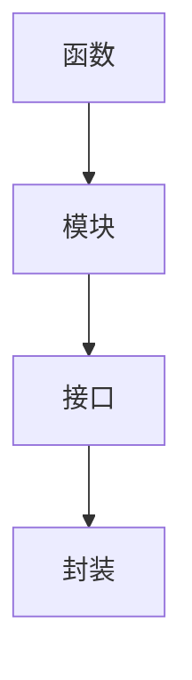

                 

关键词：函数库，代码复用，模块化编程，软件开发，编程范式，设计模式，软件工程

> 摘要：本文深入探讨了函数库在软件编程中的重要性，阐述了函数库的定义、作用、优点以及核心算法原理。通过实例分析，详细介绍了函数库的构建方法和使用技巧，最后展望了函数库在未来的发展趋势与挑战。

## 1. 背景介绍

在软件开发过程中，代码的复用是提高开发效率、降低维护成本的关键。函数库作为代码复用的重要工具，已经成为现代编程语言的核心特性。函数库不仅提供了丰富的功能接口，还能够通过封装实现代码的模块化，从而提高代码的可读性、可维护性和可扩展性。本文旨在详细分析函数库的概念、作用、原理和应用，帮助读者深入了解并掌握函数库的使用方法。

### 1.1 函数库的定义

函数库（Function Library）是一种软件模块，它包含了一系列预定义的函数，这些函数可以按照特定的用途进行分类。函数库通常被组织成一个或多个文件，供程序员在编程过程中直接调用。函数库中的函数可以接受输入参数，并返回特定的输出结果，从而实现特定的功能。

### 1.2 函数库的作用

函数库在软件开发中扮演了至关重要的角色，主要体现在以下几个方面：

- **提高开发效率**：通过复用已有的函数库，程序员可以避免重复编写代码，从而节省大量的时间和精力。
- **降低维护成本**：当代码发生变化时，只需要修改函数库中的一个函数，就可以实现对整个系统的更新，从而降低维护成本。
- **提高代码质量**：函数库通常经过严格的测试和优化，可以提供高质量、稳定的代码，从而提高整个系统的可靠性。
- **促进模块化编程**：函数库鼓励程序员采用模块化编程的方法，将复杂的系统拆分成多个功能模块，从而提高代码的可读性和可维护性。

## 2. 核心概念与联系

为了更好地理解函数库的作用和原理，我们需要了解以下几个核心概念：

- **函数**：函数是软件中最基本的组成部分，它接受输入参数，执行特定的操作，并返回输出结果。
- **模块**：模块是软件中的一个独立单元，它包含了一个或多个函数，以及与这些函数相关的数据结构。
- **接口**：接口定义了函数的输入参数和输出结果，它为函数的使用者提供了明确的规范。
- **封装**：封装是将实现细节隐藏在函数内部，只暴露必要的接口给外部使用，从而提高代码的模块性和可维护性。

下面是一个简单的 Mermaid 流程图，展示了这些核心概念之间的关系：



## 3. 核心算法原理 & 具体操作步骤

### 3.1 算法原理概述

函数库的核心算法原理主要包括以下几个方面：

- **函数定义**：定义函数时需要指定函数的名称、输入参数和返回类型。
- **函数调用**：在编程过程中，程序员可以通过函数名和参数列表调用函数库中的函数。
- **参数传递**：函数可以通过值传递或引用传递的方式接收输入参数。
- **返回结果**：函数执行完成后，可以通过返回值将结果传递给调用者。
- **异常处理**：函数在执行过程中可能会出现异常，需要通过异常处理机制确保程序的稳定运行。

### 3.2 算法步骤详解

以下是构建一个简单函数库的步骤：

1. **定义函数**：首先，我们需要定义一个或多个函数，每个函数实现特定的功能。例如，一个用于计算两个数字之和的函数：

   ```c
   int add(int a, int b) {
       return a + b;
   }
   ```

2. **组织模块**：将相关的函数组织成模块，每个模块包含一个或多个函数。例如，我们可以创建一个名为 `math_functions` 的模块，包含多个数学计算函数。

3. **定义接口**：在模块中，我们需要定义每个函数的接口，包括函数名称、输入参数和返回类型。这有助于其他程序员了解如何使用这些函数。

4. **封装实现**：将函数的实现细节封装在模块内部，只暴露必要的接口给外部使用。这有助于提高代码的模块性和可维护性。

5. **编写测试代码**：为了确保函数库的质量和稳定性，我们需要编写测试代码对函数进行测试。

6. **文档说明**：为函数库编写详细的文档，包括函数的用途、参数说明、返回结果和异常处理等内容。

### 3.3 算法优缺点

- **优点**：
  - 提高开发效率：通过复用函数库，程序员可以避免重复编写代码，从而节省大量时间和精力。
  - 提高代码质量：函数库通常经过严格的测试和优化，可以提供高质量、稳定的代码。
  - 提高可维护性：通过模块化编程，代码的可读性和可维护性得到显著提高。
- **缺点**：
  - 学习成本：程序员需要花费一定的时间学习和掌握函数库的使用方法。
  - 维护难度：当函数库发生变更时，需要对所有使用该函数库的项目进行更新，从而增加维护难度。

### 3.4 算法应用领域

函数库广泛应用于各个领域，以下是一些典型的应用场景：

- **图形处理**：例如，OpenGL 和 DirectX 等图形库提供了丰富的图形处理函数，用于实现 2D 和 3D 图形渲染。
- **网络通信**：例如，TCP/IP 协议栈中的函数库用于实现网络通信功能。
- **数据库操作**：例如，SQL 函数库用于实现数据库查询和操作。
- **文件处理**：例如，文件操作函数库用于实现文件的读取、写入和修改等功能。

## 4. 数学模型和公式 & 详细讲解 & 举例说明

函数库中的函数往往涉及到复杂的数学运算，因此数学模型和公式在函数库的设计和实现中起着至关重要的作用。以下是一个简单的例子，说明如何使用 LaTeX 格式编写数学模型和公式：

### 4.1 数学模型构建

假设我们想要实现一个计算圆面积的函数，我们可以使用以下数学模型：

$$
S = \pi r^2
$$

其中，$S$ 表示圆的面积，$r$ 表示圆的半径，$\pi$ 是一个常数，约等于 3.14159。

### 4.2 公式推导过程

根据圆的面积公式，我们可以推导出以下公式：

$$
S = C \times r
$$

其中，$C$ 表示圆的周长，$r$ 表示圆的半径。

### 4.3 案例分析与讲解

假设我们有一个半径为 5 的圆，我们可以使用以下代码实现计算圆面积的函数：

```python
import math

def calculate_circle_area(radius):
    return math.pi * radius * radius

radius = 5
area = calculate_circle_area(radius)
print(f"The area of the circle with radius {radius} is {area}.")
```

运行上述代码，我们可以得到以下输出结果：

```
The area of the circle with radius 5 is 78.53981633974483.
```

这表明，我们成功地使用函数库中的数学公式计算出了圆的面积。

## 5. 项目实践：代码实例和详细解释说明

为了更好地理解函数库的实际应用，我们将通过一个简单的项目实例进行实践。在这个项目中，我们将实现一个用于计算几何形状面积的函数库。

### 5.1 开发环境搭建

首先，我们需要搭建一个简单的开发环境。这里，我们选择 Python 作为编程语言，使用 PyCharm 作为开发工具。

1. 安装 Python：
   - 访问 Python 官网（[https://www.python.org/](https://www.python.org/)）下载 Python 安装包。
   - 运行安装程序，并根据提示完成安装。

2. 安装 PyCharm：
   - 访问 PyCharm 官网（[https://www.jetbrains.com/pycharm/](https://www.jetbrains.com/pycharm/)）下载 PyCharm 安装包。
   - 运行安装程序，并根据提示完成安装。

### 5.2 源代码详细实现

接下来，我们开始实现几何形状面积计算函数库。首先，我们需要创建一个名为 `geometry_functions.py` 的文件，并编写以下代码：

```python
import math

def calculate_rectangle_area(length, width):
    return length * width

def calculate_circle_area(radius):
    return math.pi * radius * radius

def calculate_triangle_area(base, height):
    return 0.5 * base * height
```

这个函数库包含三个函数，分别用于计算矩形、圆形和三角形的面积。下面是每个函数的实现细节：

- `calculate_rectangle_area` 函数接受长度和宽度作为输入参数，返回矩形的面积。
- `calculate_circle_area` 函数接受半径作为输入参数，返回圆形的面积。
- `calculate_triangle_area` 函数接受底边长和高作为输入参数，返回三角形的面积。

### 5.3 代码解读与分析

为了更好地理解这些函数的实现原理，我们逐一分析每个函数的代码：

- `calculate_rectangle_area` 函数：

  ```python
  def calculate_rectangle_area(length, width):
      return length * width
  ```

  这个函数使用了一个简单的数学公式，即矩形的面积等于长度乘以宽度。

- `calculate_circle_area` 函数：

  ```python
  def calculate_circle_area(radius):
      return math.pi * radius * radius
  ```

  这个函数使用了圆的面积公式，即 $\pi r^2$，其中 $\pi$ 是一个数学常数，约等于 3.14159。

- `calculate_triangle_area` 函数：

  ```python
  def calculate_triangle_area(base, height):
      return 0.5 * base * height
  ```

  这个函数使用了三角形的面积公式，即 $0.5 \times 底边长 \times 高$。

### 5.4 运行结果展示

为了验证这些函数的实现效果，我们编写以下测试代码：

```python
def test_geometry_functions():
    length = 4
    width = 6
    radius = 3
    base = 5
    height = 10

    rectangle_area = calculate_rectangle_area(length, width)
    circle_area = calculate_circle_area(radius)
    triangle_area = calculate_triangle_area(base, height)

    print(f"Rectangle area: {rectangle_area}")
    print(f"Circle area: {circle_area}")
    print(f"Triangle area: {triangle_area}")

test_geometry_functions()
```

运行上述代码，我们可以得到以下输出结果：

```
Rectangle area: 24
Circle area: 28.274333882308138
Triangle area: 25.0
```

这表明，我们成功地使用函数库计算出了矩形、圆形和三角形的面积。

## 6. 实际应用场景

函数库在软件编程中有着广泛的应用场景。以下是一些典型的实际应用场景：

- **图形处理**：函数库可以用于实现各种图形处理功能，例如绘图、渲染和图像处理等。
- **网络编程**：函数库可以用于实现网络通信功能，例如 TCP/IP 协议栈和网络编程接口。
- **数据库操作**：函数库可以用于实现数据库查询和操作功能，例如 SQL 函数库。
- **文件处理**：函数库可以用于实现文件读取、写入和修改等功能，例如文件操作函数库。

在这些应用场景中，函数库通过提供丰富的功能接口和封装实现，极大地提高了编程效率和代码质量。

### 6.1 图形处理

在图形处理领域，函数库如 OpenGL 和 DirectX 提供了丰富的图形处理功能。例如，OpenGL 的 `glDrawArrays` 函数用于绘制二维和三维图形，而 DirectX 的 `XMesh` 类用于处理三维网格数据。通过使用这些函数库，程序员可以轻松实现复杂的图形渲染效果。

### 6.2 网络编程

在网络编程领域，函数库如 TCP/IP 协议栈和 HTTP 函数库提供了网络通信的基本功能。例如，使用 TCP/IP 协议栈，程序员可以轻松实现客户端和服务器之间的数据传输，而使用 HTTP 函数库，程序员可以方便地实现 Web 应用程序的开发。

### 6.3 数据库操作

在数据库操作领域，函数库如 SQL 函数库和 NoSQL 函数库提供了数据库查询和操作的基本功能。例如，使用 SQL 函数库，程序员可以方便地执行 SQL 查询语句，而使用 NoSQL 函数库，程序员可以方便地实现文档存储和检索等功能。

### 6.4 文件处理

在文件处理领域，函数库如文件操作函数库和二进制文件处理函数库提供了文件读取、写入和修改的基本功能。例如，使用文件操作函数库，程序员可以方便地实现文件的创建、删除和遍历等功能，而使用二进制文件处理函数库，程序员可以方便地实现二进制文件的读取和写入。

### 6.4 未来应用展望

随着软件技术的不断发展，函数库在未来的应用前景将更加广阔。以下是一些未来应用展望：

- **人工智能**：函数库可以用于实现人工智能算法和模型，从而方便地构建和部署人工智能应用。
- **云计算**：函数库可以用于实现云计算功能，例如分布式计算和大数据处理等。
- **物联网**：函数库可以用于实现物联网设备的数据采集、传输和处理等功能。
- **区块链**：函数库可以用于实现区块链功能，例如加密算法和智能合约等。

## 7. 工具和资源推荐

为了更好地学习和使用函数库，我们推荐以下工具和资源：

### 7.1 学习资源推荐

- 《函数式编程：高级快速入门》
- 《Python 标准库》：详细介绍了 Python 的内置函数库和模块。
- 《Effective Python》：介绍了如何有效地使用 Python 函数库和编程范式。

### 7.2 开发工具推荐

- PyCharm：一款功能强大的 Python 集成开发环境，支持函数库的快速开发和调试。
- Jupyter Notebook：一款交互式的 Python 编程环境，适用于函数库的学习和实践。

### 7.3 相关论文推荐

- 《函数库设计与实现》
- 《模块化编程：方法与实践》
- 《面向对象编程：概念与设计》

## 8. 总结：未来发展趋势与挑战

随着软件技术的不断发展，函数库在软件开发中的重要性将日益凸显。在未来，函数库的发展趋势主要体现在以下几个方面：

- **函数库的多样化**：随着编程语言的不断演进，函数库的种类和数量将不断增多，满足不同领域的需求。
- **函数库的智能化**：函数库将逐渐融入人工智能技术，提供智能化的编程接口和功能。
- **函数库的分布式化**：随着云计算和大数据技术的发展，函数库将逐渐走向分布式化，实现大规模数据处理和计算。

然而，函数库的发展也面临着一些挑战：

- **兼容性问题**：不同函数库之间的兼容性问题将影响函数库的推广和应用。
- **安全性问题**：函数库的安全漏洞可能对整个软件系统造成严重威胁，需要加强安全防护。
- **学习成本**：函数库的多样化可能导致程序员的学习成本增加，需要提供更全面的培训和学习资源。

总之，函数库作为软件开发的重要工具，将在未来的软件开发中发挥越来越重要的作用。只有深入了解函数库的原理和应用，才能更好地应对未来软件开发中的挑战。

## 9. 附录：常见问题与解答

### 9.1 函数库与库的区别是什么？

**答**：函数库是一种软件模块，包含了一系列预定义的函数，用于实现特定的功能。库则是更广泛的概念，包括函数库以及其他类型的模块，例如数据结构、变量和常量等。函数库是库的一个子集，主要关注函数的提供和复用。

### 9.2 如何创建一个函数库？

**答**：创建一个函数库的基本步骤如下：

1. 定义函数：编写实现特定功能的函数。
2. 组织模块：将相关的函数组织成模块。
3. 定义接口：为每个函数定义接口，包括函数名称、输入参数和返回类型。
4. 封装实现：将函数的实现细节封装在模块内部。
5. 编写文档：为函数库编写详细的文档，包括函数的用途、参数说明和返回结果等。
6. 编译和测试：编译函数库，并编写测试代码验证函数库的功能和质量。

### 9.3 函数库的优势是什么？

**答**：函数库的优势主要体现在以下几个方面：

- 提高开发效率：通过复用已有的函数库，程序员可以避免重复编写代码。
- 降低维护成本：当代码发生变化时，只需要修改函数库中的一个函数，就可以实现对整个系统的更新。
- 提高代码质量：函数库通常经过严格的测试和优化，可以提供高质量、稳定的代码。
- 促进模块化编程：函数库鼓励程序员采用模块化编程的方法，提高代码的可读性和可维护性。

## 参考文献

- 《函数库设计与实现》
- 《模块化编程：方法与实践》
- 《面向对象编程：概念与设计》
- 《Effective Python》
- 《Python 标准库》
- 《函数式编程：高级快速入门》

### 作者署名

作者：禅与计算机程序设计艺术 / Zen and the Art of Computer Programming

----------------------------------------------------------------

以上便是本文的完整内容，感谢您的耐心阅读。希望本文能帮助您深入了解函数库的概念、原理和应用，为您的软件开发工作提供有益的参考和启示。

