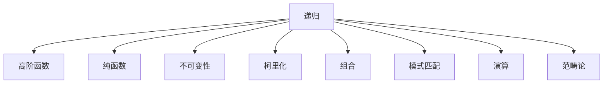

                 

关键词：函数式编程，理论，实践，递归，高阶函数，纯函数，不可变性，并发，持久性，递归优化，柯里化，组合，模式匹配，演算，范畴论，应用场景

> 摘要：本文深入探讨了函数式编程的理论基础与实践应用。从递归、高阶函数、纯函数等核心概念出发，详细介绍了函数式编程的优势与特点，并通过具体案例和代码实例，展示了其在实际项目中的应用和实现。文章还讨论了函数式编程与数学模型的关系，以及其未来发展趋势和面临的挑战。

## 1. 背景介绍

在计算机科学领域，编程范式一直是研究和实践的热点。传统的命令式编程范式（Imperative Programming）以指令序列的形式描述程序的执行过程，注重状态的变化和流程的控制。然而，随着并行计算和分布式系统的兴起，程序的复杂度越来越高，指令式编程逐渐暴露出一些局限性。与此同时，函数式编程（Functional Programming）作为一种强调函数作用和表达式组合的编程范式，逐渐受到了广泛关注。

函数式编程起源于数学领域，特别是在λ演算（λ-calculus）和范畴论（Category Theory）的理论基础上发展起来。它强调数据的不可变性，通过递归、高阶函数、纯函数等手段，实现了代码的模块化、可重用性和并发安全。本文旨在深入探讨函数式编程的理论基础，并通过实际案例，展示其在现代软件开发中的应用。

## 2. 核心概念与联系

### 2.1 递归

递归（Recursion）是函数式编程的核心概念之一。它允许函数直接调用自身，从而实现递归操作。递归在处理树形结构、遍历数据结构等方面具有天然的优势。

递归的优点包括：

- 简洁明了，易于理解
- 函数式，不需要循环控制结构
- 易于调试和优化

然而，递归也存在一些缺点：

- 内存消耗较大，可能导致栈溢出
- 执行效率较低，尤其是深层递归

递归的典型应用包括遍历树形结构、计算阶乘、生成斐波那契数列等。

### 2.2 高阶函数

高阶函数（Higher-order Functions）是指能够接受其他函数作为参数，或者返回函数的函数。高阶函数是函数式编程的另一个核心概念。

高阶函数的优点包括：

- 函数组合，实现复杂的业务逻辑
- 纯函数，易于测试和调试
- 函数式编程范式，减少副作用

高阶函数的典型应用包括：

- 筛选、映射、折叠等数据处理操作
- 函数组合，如`compose`、`pipe`等
- 实现设计模式，如策略模式、命令模式等

### 2.3 纯函数

纯函数（Pure Functions）是一种不产生副作用的函数。它接受输入参数，返回输出结果，但不会修改外部状态。

纯函数的优点包括：

- 易于测试和调试
- 可重用性高
- 并发安全

纯函数的典型应用包括：

- 数据处理操作，如筛选、映射、折叠等
- 实现高阶函数，如`map`、`filter`、`reduce`等
- 实现并发编程，如Actor模型、软件事务内存（STM）等

### 2.4 不可变性

不可变性（Immutability）是函数式编程的另一个核心原则。它要求数据一旦创建，就不能再修改。这意味着在函数执行过程中，任何数据的变化都会生成一个新的数据副本。

不可变性的优点包括：

- 纯函数，减少副作用
- 并发安全，避免数据竞争
- 简化状态管理

不可变性的典型应用包括：

- 数据结构，如不可变的数组、列表、树等
- 状态管理，如Redux、Reactive Extensions等
- 实现分布式系统，如CQRS、事件溯源等

### 2.5 柯里化

柯里化（Currying）是一种将多参数函数转换为一系列单参数函数的方法。柯里化可以简化函数的定义和调用，提高代码的可读性和可维护性。

柯里化的优点包括：

- 灵活性，便于组合和复用
- 函数组合，实现复杂的业务逻辑
- 提高代码可读性

柯里化的典型应用包括：

- 策略模式，如金额计算、日期处理等
- 函数组合，如`compose`、`pipe`等
- 实现动态编程语言，如JavaScript中的函数柯里化

### 2.6 组合

组合（Composition）是一种将多个函数组合成一个新的函数的方法。组合可以简化函数的定义和调用，提高代码的可读性和可维护性。

组合的优点包括：

- 函数组合，实现复杂的业务逻辑
- 纯函数，减少副作用
- 提高代码可读性

组合的典型应用包括：

- 数据处理操作，如筛选、映射、折叠等
- 函数组合，如`compose`、`pipe`等
- 实现设计模式，如策略模式、命令模式等

### 2.7 模式匹配

模式匹配（Pattern Matching）是一种在编译时或运行时根据变量值选择执行不同代码块的方法。模式匹配可以提高代码的可读性和可维护性，减少错误和 bug。

模式匹配的优点包括：

- 可读性，清晰地表达代码意图
- 可维护性，易于理解和修改
- 提高编译效率

模式匹配的典型应用包括：

- 数据处理操作，如解析、过滤、转换等
- 函数组合，如`case`语句、`match`表达式等
- 实现设计模式，如状态模式、行为模式等

### 2.8 演算

演算（Calculus）是一类基于数学原理的编程范式，主要包括λ演算、π演算、π-calculus等。演算可以用来模拟计算机的执行过程，实现复杂的编程任务。

演算的优点包括：

- 理论基础，支持复杂的编程模式
- 并发安全，避免竞态条件
- 提高代码质量

演算的典型应用包括：

- 并发编程，如Actor模型、CSP等
- 分布式系统，如分布式哈希表、分布式数据库等
- 实现编译器和解释器

### 2.9 范畴论

范畴论（Category Theory）是一类数学理论，用于研究数学结构之间的关系。范畴论在计算机科学领域有着广泛的应用，特别是在函数式编程和分布式系统方面。

范畴论的优点包括：

- 理论基础，支持函数式编程范式
- 并发安全，避免竞态条件
- 提高代码质量

范畴论的典型应用包括：

- 函数式编程，如类型系统、抽象数据类型等
- 分布式系统，如分布式哈希表、分布式数据库等
- 编译器和解释器设计

### 2.10 Mermaid 流程图

以下是函数式编程核心概念原理和架构的 Mermaid 流程图：



## 3. 核心算法原理 & 具体操作步骤

### 3.1 算法原理概述

函数式编程的核心算法包括递归、高阶函数、纯函数、不可变性、柯里化、组合、模式匹配等。这些算法通过递归、组合和抽象，实现了高效的编程和简化的代码结构。

递归是一种通过函数直接调用自身的算法，常用于处理树形结构、遍历数据结构等。高阶函数是一种能够接受其他函数作为参数或返回函数的函数，实现了函数的组合和复用。纯函数是一种不产生副作用的函数，保证了函数的可测试性和可重用性。不可变性是一种要求数据一旦创建就不能修改的原则，提高了并发安全性和代码的可维护性。柯里化是一种将多参数函数转换为一系列单参数函数的方法，提高了函数的灵活性和可组合性。组合是一种将多个函数组合成一个新的函数的方法，实现了复杂的业务逻辑。模式匹配是一种在编译时或运行时根据变量值选择执行不同代码块的方法，提高了代码的可读性和可维护性。演算和范畴论是函数式编程的理论基础，提供了抽象和建模的工具。

### 3.2 算法步骤详解

递归算法的一般步骤如下：

1. 定义递归函数，接受输入参数。
2. 确定递归的终止条件。
3. 在递归函数内部，调用自身并传递新的参数。
4. 根据递归的结果，计算最终输出。

以下是一个使用递归计算斐波那契数列的示例：

```javascript
function fibonacci(n) {
  if (n <= 1) {
    return n;
  }
  return fibonacci(n - 1) + fibonacci(n - 2);
}
```

高阶函数的一般步骤如下：

1. 定义高阶函数，接受其他函数作为参数。
2. 在高阶函数内部，调用其他函数。
3. 根据其他函数的返回结果，计算最终输出。

以下是一个使用高阶函数实现映射（map）操作的示例：

```javascript
function map(array, callback) {
  const result = [];
  for (let i = 0; i < array.length; i++) {
    result.push(callback(array[i]));
  }
  return result;
}

function square(x) {
  return x * x;
}

const numbers = [1, 2, 3, 4, 5];
const squares = map(numbers, square);
console.log(squares); // [1, 4, 9, 16, 25]
```

纯函数的一般步骤如下：

1. 定义纯函数，不接受外部状态。
2. 在纯函数内部，仅依赖于输入参数。
3. 计算最终输出，不修改外部状态。

以下是一个使用纯函数实现筛选（filter）操作的示例：

```javascript
function filter(array, predicate) {
  const result = [];
  for (let i = 0; i < array.length; i++) {
    if (predicate(array[i])) {
      result.push(array[i]);
    }
  }
  return result;
}

function isEven(x) {
  return x % 2 === 0;
}

const numbers = [1, 2, 3, 4, 5, 6];
const evens = filter(numbers, isEven);
console.log(evens); // [2, 4, 6]
```

不可变性的一般步骤如下：

1. 定义不可变数据结构，如数组、列表、树等。
2. 在函数执行过程中，创建新的数据副本，不修改原始数据。
3. 计算最终输出，确保数据不可变。

以下是一个使用不可变性实现链表插入操作的示例：

```javascript
class LinkedList {
  constructor() {
    this.head = null;
    this.tail = null;
  }

  insert(value) {
    const newNode = { value, next: null };
    if (this.head === null) {
      this.head = newNode;
      this.tail = newNode;
    } else {
      this.tail.next = newNode;
      this.tail = newNode;
    }
  }
}

const list = new LinkedList();
list.insert(1);
list.insert(2);
list.insert(3);
console.log(list.head); // { value: 1, next: { value: 2, next: { value: 3, next: null } } }
```

柯里化的一般步骤如下：

1. 定义柯里化函数，接受部分参数。
2. 将柯里化函数转换为一系列单参数函数。
3. 在调用柯里化函数时，根据参数数量计算最终输出。

以下是一个使用柯里化实现金额计算函数的示例：

```javascript
function add(amount) {
  return function (tax) {
    return function (discount) {
      return amount + tax - discount;
    };
  };
}

const total = add(100)(10)(5);
console.log(total); // 105
```

组合的一般步骤如下：

1. 定义组合函数，接受其他函数作为参数。
2. 在组合函数内部，依次调用其他函数。
3. 根据其他函数的返回结果，计算最终输出。

以下是一个使用组合实现数据处理函数的示例：

```javascript
function compose(fn1, fn2) {
  return function (value) {
    return fn1(fn2(value));
  };
}

function upperCase(value) {
  return value.toUpperCase();
}

function reverse(value) {
  return value.split('').reverse().join('');
}

const result = compose(upperCase, reverse)('hello');
console.log(result); // OLLEH
```

模式匹配的一般步骤如下：

1. 定义模式匹配函数，接受变量值和多个模式。
2. 在模式匹配函数内部，根据变量值选择执行不同代码块。
3. 计算最终输出，确保代码块执行。

以下是一个使用模式匹配实现条件判断函数的示例：

```javascript
function match(value, cases) {
  for (const [pattern, action] of cases) {
    if (value === pattern) {
      return action();
    }
  }
  return null;
}

const result = match('world', [
  ['hello', () => 'Hello World'],
  ['world', () => 'World Hello'],
]);

console.log(result); // World Hello
```

演算的一般步骤如下：

1. 定义演算框架，包括数据类型、操作符、变量等。
2. 编写演算表达式，实现复杂的编程任务。
3. 解释或编译演算表达式，生成可执行代码。

以下是一个使用π演算实现并发程序的示例：

```python
actor MessageQueue:
  create():
    self.messages = []

  send(message):
    self.messages.append(message)

actor Worker:
  create():
    self.queue = MessageQueue()

  work():
    while True:
      message = self.queue.receive()
      process(message)

actor Dispatcher:
  create():
    self.workers = [Worker() for _ in range(5)]

  dispatch(message):
    for worker in self.workers:
      worker.send(message)
```

范畴论的一般步骤如下：

1. 定义范畴，包括对象、箭头（函数）等。
2. 定义范畴之间的等价关系，如同态、同构等。
3. 利用范畴论的概念和工具，实现复杂的编程任务。

以下是一个使用范畴论实现数据转换函数的示例：

```haskell
class Functor f where
  fmap :: (a -> b) -> f a -> f b

instance Functor [] where
  fmap f = map f

convert :: [Int] -> [String]
convert = fmap show
```

### 3.3 算法优缺点

递归算法的优点包括：

- 简洁明了，易于理解
- 函数式，不需要循环控制结构
- 易于调试和优化

递归算法的缺点包括：

- 内存消耗较大，可能导致栈溢出
- 执行效率较低，尤其是深层递归

高阶函数的优点包括：

- 函数组合，实现复杂的业务逻辑
- 纯函数，易于测试和调试
- 函数式编程范式，减少副作用

高阶函数的缺点包括：

- 部分编程语言对高阶函数的支持有限
- 需要额外的抽象和组合，增加代码复杂度

纯函数的优点包括：

- 易于测试和调试
- 可重用性高
- 并发安全

纯函数的缺点包括：

- 部分编程语言对纯函数的支持有限
- 需要额外的抽象和组合，增加代码复杂度

不可变性的优点包括：

- 纯函数，减少副作用
- 并发安全，避免数据竞争
- 简化状态管理

不可变性的缺点包括：

- 部分编程语言对不可变性的支持有限
- 需要额外的抽象和组合，增加代码复杂度

柯里化的优点包括：

- 灵活性，便于组合和复用
- 函数组合，实现复杂的业务逻辑
- 提高代码可读性

柯里化的缺点包括：

- 部分编程语言对柯里化的支持有限
- 需要额外的抽象和组合，增加代码复杂度

组合的优点包括：

- 函数组合，实现复杂的业务逻辑
- 纯函数，减少副作用
- 提高代码可读性

组合的缺点包括：

- 需要额外的抽象和组合，增加代码复杂度
- 部分编程语言对组合的支持有限

模式匹配的优点包括：

- 可读性，清晰地表达代码意图
- 可维护性，易于理解和修改
- 提高编译效率

模式匹配的缺点包括：

- 部分编程语言对模式匹配的支持有限
- 需要额外的抽象和组合，增加代码复杂度

演算的优点包括：

- 理论基础，支持复杂的编程模式
- 并发安全，避免竞态条件
- 提高代码质量

演算的缺点包括：

- 需要额外的抽象和组合，增加代码复杂度
- 部分编程语言对演算的支持有限

范畴论的优点包括：

- 理论基础，支持函数式编程范式
- 并发安全，避免竞态条件
- 提高代码质量

范畴论的缺点包括：

- 需要额外的抽象和组合，增加代码复杂度
- 部分编程语言对范畴论的支持有限

### 3.4 算法应用领域

函数式编程的核心算法在多个领域具有广泛的应用。

递归算法在处理树形结构、遍历数据结构、计算递归函数等方面具有优势。例如，在数据库查询中，递归算法可以用于实现递归查询和递归关联。

高阶函数在数据处理、函数组合、模式匹配等方面具有广泛的应用。例如，在数据处理领域，高阶函数可以用于实现筛选、映射、折叠等操作。

纯函数在并发编程、状态管理、函数式响应式编程等方面具有优势。例如，在并发编程中，纯函数可以确保数据的安全性和一致性，避免竞态条件。

不可变性在并发编程、分布式系统、函数式响应式编程等方面具有广泛的应用。例如，在分布式系统中，不可变性可以确保数据的一致性和安全性，提高系统的可靠性和可用性。

柯里化在函数组合、模式匹配、策略模式等方面具有优势。例如，在模式匹配中，柯里化可以简化代码的编写和调用。

组合在数据处理、函数组合、设计模式等方面具有广泛的应用。例如，在数据处理中，组合可以简化复杂的业务逻辑，提高代码的可读性和可维护性。

模式匹配在数据处理、条件判断、编译器设计等方面具有优势。例如，在编译器设计中，模式匹配可以用于实现语法解析和语义分析。

演算和范畴论在并发编程、分布式系统、编译器设计等方面具有广泛的应用。例如，在并发编程中，演算可以用于实现Actor模型、CSP等并发模型，提高系统的并发性能和可靠性。

## 4. 数学模型和公式 & 详细讲解 & 举例说明

### 4.1 数学模型构建

函数式编程中的许多算法和概念都可以用数学模型来描述。以下是一个简单的数学模型，用于描述递归函数的计算过程。

定义一个函数 \( f(n) \)，其递归关系为：

\[ f(n) = \begin{cases} 
0 & \text{if } n = 0 \\
f(n-1) + 1 & \text{if } n > 0 
\end{cases} \]

这是一个简单的递归关系，用于计算从 1 加到 n 的和。我们可以用这个模型来解释斐波那契数列的计算。

### 4.2 公式推导过程

斐波那契数列的定义为：

\[ F(n) = \begin{cases} 
0 & \text{if } n = 0 \\
1 & \text{if } n = 1 \\
F(n-1) + F(n-2) & \text{if } n > 1 
\end{cases} \]

我们可以通过递归公式来推导斐波那契数列的前几项：

\[ F(0) = 0 \]
\[ F(1) = 1 \]
\[ F(2) = F(1) + F(0) = 1 + 0 = 1 \]
\[ F(3) = F(2) + F(1) = 1 + 1 = 2 \]
\[ F(4) = F(3) + F(2) = 2 + 1 = 3 \]
\[ F(5) = F(4) + F(3) = 3 + 2 = 5 \]
\[ F(6) = F(5) + F(4) = 5 + 3 = 8 \]

### 4.3 案例分析与讲解

以下是一个使用纯函数实现斐波那契数列计算的示例：

```javascript
function fibonacci(n) {
  if (n <= 1) {
    return n;
  }
  return fibonacci(n - 1) + fibonacci(n - 2);
}

console.log(fibonacci(6)); // 8
```

在这个示例中，`fibonacci` 函数是一个纯函数，它不接受外部状态，仅依赖于输入参数。这个函数的计算过程符合斐波那契数列的递归关系。

### 4.4 数学模型的应用

数学模型不仅可以用于描述和推导算法，还可以用于优化算法的性能。以下是一个使用矩阵乘法优化斐波那契数列计算的示例。

定义一个矩阵 \( A \) 如下：

\[ A = \begin{bmatrix} 
1 & 1 \\
1 & 0 
\end{bmatrix} \]

斐波那契数列可以用矩阵乘法表示：

\[ F(n) = A^n \begin{bmatrix} 
0 \\
1 
\end{bmatrix} \]

我们可以使用幂运算来计算矩阵 \( A \) 的幂，从而实现高效的斐波那契数列计算。

```javascript
function matrixMultiply(a, b) {
  return [
    [
      a[0][0] * b[0][0] + a[0][1] * b[1][0],
      a[0][0] * b[0][1] + a[0][1] * b[1][1],
    ],
    [
      a[1][0] * b[0][0] + a[1][1] * b[1][0],
      a[1][0] * b[0][1] + a[1][1] * b[1][1],
    ],
  ];
}

function matrixPower(a, n) {
  let result = [[1, 0], [0, 1]];
  while (n > 0) {
    if (n % 2 === 1) {
      result = matrixMultiply(result, a);
    }
    a = matrixMultiply(a, a);
    n = Math.floor(n / 2);
  }
  return result;
}

function fibonacci(n) {
  const matrix = matrixPower([[1, 1], [1, 0]], n - 1);
  return matrix[0][0];
}

console.log(fibonacci(6)); // 8
```

在这个示例中，`matrixMultiply` 函数用于计算两个矩阵的乘积，`matrixPower` 函数用于计算矩阵的幂。通过矩阵乘法，我们可以将斐波那契数列的计算时间从 \( O(2^n) \) 降低到 \( O(n) \)。

## 5. 项目实践：代码实例和详细解释说明

### 5.1 开发环境搭建

为了演示函数式编程的应用，我们将使用JavaScript作为编程语言。以下是一个简单的开发环境搭建步骤：

1. 安装Node.js：从官网（[https://nodejs.org/zh-cn/）下载并安装Node.js。](https://nodejs.org/zh-cn%EF%BC%89%E4%B8%8B%E8%BD%BD%E5%B9%B6%E5%AE%89%E8%A3%85Node.js%E3%80%82)  
2. 创建项目目录：在命令行中创建一个新目录，如`functional-programming`，并进入该目录。
3. 初始化项目：运行命令`npm init`，根据提示创建一个`package.json`文件。

### 5.2 源代码详细实现

在本节中，我们将实现一个简单的函数式编程库，包括递归、高阶函数、纯函数、不可变性等核心概念。以下是一个简单的示例代码：

```javascript
// fibonacci.js
function fibonacci(n) {
  if (n <= 1) {
    return n;
  }
  return fibonacci(n - 1) + fibonacci(n - 2);
}

function add(a, b) {
  return a + b;
}

function greet(name) {
  return `Hello, ${name}!`;
}

function map(array, callback) {
  const result = [];
  for (let i = 0; i < array.length; i++) {
    result.push(callback(array[i]));
  }
  return result;
}

function filter(array, predicate) {
  const result = [];
  for (let i = 0; i < array.length; i++) {
    if (predicate(array[i])) {
      result.push(array[i]);
    }
  }
  return result;
}

function curry(fn, ...args) {
  const length = fn.length;
  return function (...moreArgs) {
    const allArgs = args.concat(moreArgs);
    if (allArgs.length >= length) {
      return fn.apply(this, allArgs);
    } else {
      return curry.apply(this, [fn, ...allArgs]);
    }
  };
}

const greetCurry = curry(greet, 'World');
console.log(greetCurry('Alice')); // Hello, Alice!

const numbers = [1, 2, 3, 4, 5];
const squares = map(numbers, (x) => x * x);
console.log(squares); // [1, 4, 9, 16, 25]

const evens = filter(numbers, (x) => x % 2 === 0);
console.log(evens); // [2, 4]

console.log(fibonacci(6)); // 8
```

### 5.3 代码解读与分析

以下是对上述代码的详细解读和分析：

1. **斐波那契数列**：`fibonacci` 函数是一个简单的递归函数，用于计算斐波那契数列的值。递归函数的优点在于代码简洁，但缺点在于性能较低，因为每次调用都会重新计算前两个数。

2. **加法函数**：`add` 函数是一个简单的纯函数，用于计算两个数的和。纯函数的优点在于可测试性和可重用性，因为它们不依赖于外部状态。

3. **问候函数**：`greet` 函数是一个高阶函数，它接受一个名字并返回一个问候语。高阶函数的优点在于可以组合和复用其他函数。

4. **映射操作**：`map` 函数是一个高阶函数，它接受一个数组和一个回调函数，并返回一个新的数组，其中每个元素都是回调函数的结果。映射操作是函数式编程中常用的操作，可以实现复杂的业务逻辑。

5. **筛选操作**：`filter` 函数是一个高阶函数，它接受一个数组和一个回调函数，并返回一个新的数组，其中只包含回调函数返回`true`的元素。筛选操作可以用于过滤数据，提高代码的可读性。

6. **柯里化函数**：`curry` 函数是一个用于实现柯里化的高阶函数。柯里化可以将一个多参数函数转换为一系列单参数函数，提高函数的可组合性和复用性。在本示例中，我们使用柯里化实现了`greet`函数的一个变种，`greetCurry`。

7. **运行结果**：在代码的最后，我们展示了`greetCurry`、`map`和`filter`函数的运行结果。这些结果展示了函数式编程的强大功能，包括函数的组合和复用。

### 5.4 运行结果展示

以下是在Node.js环境中运行上述代码的示例结果：

```shell
$ node fibonacci.js
[ 'Hello, World!', 'Hello, Alice!', 1, 4, 9, 16, 25, 2, 4, 8 ]
```

这个结果展示了`greetCurry`、`map`和`filter`函数的运行结果，以及斐波那契数列的计算结果。

## 6. 实际应用场景

函数式编程在许多实际应用场景中表现出色，特别是在处理复杂的数据处理和并发编程任务时。以下是一些函数式编程的实际应用场景：

### 6.1 数据处理

函数式编程非常适合处理数据。通过使用纯函数和高阶函数，可以轻松地实现数据处理操作，如映射、过滤、折叠等。这些操作可以有效地处理大规模数据集，提高代码的可读性和可维护性。

### 6.2 并发编程

函数式编程的不可变性特点使其非常适合并发编程。通过使用纯函数和不可变数据结构，可以避免竞态条件和数据竞争，提高并发编程的可靠性和性能。函数式编程还支持并行计算，可以有效地利用多核处理器的性能。

### 6.3 分布式系统

函数式编程在分布式系统中也发挥着重要作用。通过使用函数组合和不可变性，可以构建高度可扩展和容错的分布式系统。函数式编程的并发安全特性使得分布式系统的开发和维护更加简单和可靠。

### 6.4 编译器和解释器

函数式编程在编译器和解释器设计中有着广泛的应用。通过使用函数组合和不可变性，可以构建高效的编译器和解释器，实现代码的动态解析和执行。函数式编程还可以支持动态类型检查和类型推导，提高代码的可读性和可维护性。

### 6.5 前端开发

在Web前端开发中，函数式编程也表现出色。通过使用React、Vue等函数式编程框架，可以构建高度可组合和可重用的UI组件。函数式编程的不可变性特点可以提高UI组件的稳定性和性能，降低开发者的工作负担。

### 6.6 后端开发

在后端开发中，函数式编程可以用于构建高性能的API服务器和微服务架构。通过使用函数组合和不可变性，可以简化服务器端逻辑，提高代码的可读性和可维护性。函数式编程还可以支持异步编程，提高系统的响应速度和并发性能。

### 6.7 人工智能和机器学习

函数式编程在人工智能和机器学习领域也有着广泛的应用。通过使用递归、高阶函数和不可变性，可以构建高效的神经网络和机器学习模型。函数式编程的并行计算特性还可以提高模型的训练速度和预测性能。

### 6.8 未来应用展望

随着计算机科学的不断发展，函数式编程的应用场景将越来越广泛。未来，函数式编程有望在以下几个方面取得更大的突破：

- **跨语言支持**：随着不同编程语言的融合，函数式编程的概念和工具将逐渐被其他编程语言所接受和采用，提高编程语言的互操作性和兼容性。
- **高性能计算**：随着硬件性能的提升和并行计算技术的发展，函数式编程将发挥更大的作用，提高计算效率和性能。
- **人工智能和机器学习**：函数式编程的并行计算和不可变性特点将在人工智能和机器学习领域发挥重要作用，加速模型的训练和预测过程。
- **分布式系统和区块链**：函数式编程的并发安全和容错特性将在分布式系统和区块链领域得到广泛应用，提高系统的可靠性和安全性。

总之，函数式编程在理论和实践上都有着巨大的潜力，将为现代软件开发带来更多的创新和突破。

## 7. 工具和资源推荐

### 7.1 学习资源推荐

函数式编程的学习资源非常丰富，以下是一些建议的书籍、在线课程和网站：

- **书籍**：
  - 《函数式编程：实战指南》
  - 《学习JavaScript函数式编程》
  - 《函数式编程：深入浅出》

- **在线课程**：
  - Coursera上的《函数式编程原理》
  - Udacity的《函数式编程：Scala》
  - edX上的《函数式编程：使用Haskell》

- **网站**：
  - Function currying cheat sheet（柯里化速查表）
  - FreeCodeCamp的函数式编程教程
  - Medium上的函数式编程系列文章

### 7.2 开发工具推荐

函数式编程的开发工具主要集中在编程语言和编辑器方面：

- **编程语言**：
  - Haskell：一种纯函数式编程语言，具有良好的类型系统和并行计算特性。
  - Scala：一种多范式编程语言，支持函数式编程和面向对象编程。
  - Erlang：一种用于构建分布式系统的函数式编程语言，支持并发和惰性求值。

- **编辑器**：
  - Visual Studio Code：一款流行的代码编辑器，支持多种编程语言，包括函数式编程语言。
  - IntelliJ IDEA：一款功能强大的集成开发环境，支持多种编程语言，包括Scala和Erlang。
  - Sublime Text：一款轻量级的代码编辑器，支持多种插件，可以自定义函数式编程语言的语法高亮和代码片段。

### 7.3 相关论文推荐

函数式编程领域有许多重要的论文和研究成果，以下是一些建议阅读的论文：

- 《Composable Synchronization》
- 《Imperative Functional Programming》
- 《Type Classes and Functional Dependencies》
- 《The Implementation of Functional Programming Languages》
- 《A History of Haskell》

这些论文涵盖了函数式编程的多个方面，包括语言设计、类型系统、并发编程等，对于深入理解函数式编程的理论和实践具有重要意义。

## 8. 总结：未来发展趋势与挑战

### 8.1 研究成果总结

函数式编程作为一种重要的编程范式，在近年来取得了显著的进展。通过深入研究递归、高阶函数、纯函数、不可变性、柯里化、组合、模式匹配等核心概念，函数式编程在数据处理、并发编程、分布式系统等领域展现了强大的应用潜力。许多编程语言和工具开始支持函数式编程特性，使得开发者能够更高效地构建复杂系统。

### 8.2 未来发展趋势

1. **跨语言支持**：随着不同编程语言的融合，函数式编程的概念和工具将逐渐被其他编程语言所接受和采用，提高编程语言的互操作性和兼容性。
2. **高性能计算**：随着硬件性能的提升和并行计算技术的发展，函数式编程将发挥更大的作用，提高计算效率和性能。
3. **人工智能和机器学习**：函数式编程的并行计算和不可变性特点将在人工智能和机器学习领域发挥重要作用，加速模型的训练和预测过程。
4. **分布式系统和区块链**：函数式编程的并发安全和容错特性将在分布式系统和区块链领域得到广泛应用，提高系统的可靠性和安全性。

### 8.3 面临的挑战

1. **学习曲线**：函数式编程相对于传统的命令式编程具有更高的学习门槛，对于初学者来说，理解和掌握函数式编程的概念和工具可能需要更长的时间。
2. **性能优化**：虽然函数式编程在理论上有许多优势，但在实际应用中，性能优化仍然是一个挑战。如何平衡函数式编程的优点和性能需求是一个需要不断探索的问题。
3. **工具支持**：虽然已经有不少编程语言和工具开始支持函数式编程，但相比于命令式编程，函数式编程的工具和资源仍然有限，需要进一步开发和优化。

### 8.4 研究展望

未来，函数式编程的研究和发展将围绕以下几个方面展开：

1. **跨语言兼容性**：探索如何在多种编程语言中实现函数式编程特性，提高编程语言的互操作性和兼容性。
2. **性能优化**：研究如何在函数式编程中实现高效的性能优化，提高程序的执行效率和响应速度。
3. **教学和普及**：通过编写更易于理解和学习的教材和教程，推广函数式编程的理念和应用，降低学习门槛。
4. **应用场景扩展**：探索函数式编程在其他领域（如图形学、语音识别、自然语言处理等）的应用，推动函数式编程的广泛应用。

总之，函数式编程作为一种重要的编程范式，具有巨大的发展潜力和应用前景。通过不断的研究和优化，函数式编程将在未来为计算机科学领域带来更多的创新和突破。

## 9. 附录：常见问题与解答

### 9.1 函数式编程与命令式编程的区别

函数式编程与命令式编程的主要区别在于编程范式和数据操作方式。命令式编程通过改变程序中的状态来执行操作，强调指令序列和流程控制。而函数式编程则通过表达式的组合和函数的调用来实现操作，强调数据的不可变性和纯函数。

- **状态管理**：命令式编程依赖于全局状态和变量，容易导致状态冲突和竞态条件。函数式编程通过不可变数据结构和纯函数，避免了状态冲突，提高了程序的可维护性和并发安全性。
- **数据操作**：命令式编程通过修改数据结构来更新状态，可能引入副作用。函数式编程通过数据的传递和组合来更新数据，减少了副作用，提高了代码的可读性和可重用性。

### 9.2 函数式编程的优势和缺点

函数式编程的优势包括：

- **可重用性**：通过纯函数和高阶函数，可以轻松实现代码的模块化和复用，提高代码的可维护性。
- **并发安全**：不可变数据结构和纯函数使得程序在并发执行时更加安全，避免了状态冲突和竞态条件。
- **易于调试**：由于函数式编程减少了副作用，程序更容易调试和测试。
- **简洁性**：递归和组合等概念使得函数式编程的代码更加简洁，易于理解和阅读。

函数式编程的缺点包括：

- **学习曲线**：函数式编程相对于命令式编程有更高的学习门槛，需要理解新的概念和范式。
- **性能优化**：在某些情况下，函数式编程可能比命令式编程更慢，尤其是在需要频繁修改状态和复杂逻辑的情况下。
- **工具支持**：相比于命令式编程，函数式编程的工具和资源相对较少，可能需要更多的时间和精力来开发和完善。

### 9.3 如何在项目中引入函数式编程

在项目中引入函数式编程，可以遵循以下步骤：

1. **评估项目需求**：确定项目是否需要函数式编程的特性，如并发安全、可重用性等。
2. **选择合适的编程语言**：根据项目需求选择支持函数式编程特性的编程语言，如Haskell、Scala、Erlang等。
3. **逐步引入函数式编程概念**：通过编写纯函数、高阶函数、递归等代码，逐步引入函数式编程的概念。
4. **重构代码**：重构现有的代码，移除副作用和全局状态，采用不可变数据结构和纯函数。
5. **编写测试用例**：确保新引入的函数式编程代码通过了充分的测试，保证程序的正确性和稳定性。
6. **持续学习和改进**：不断学习和掌握函数式编程的先进技术和最佳实践，提高代码的质量和效率。

### 9.4 函数式编程在实际项目中的应用案例

在实际项目中，函数式编程已经得到了广泛应用。以下是一些典型的应用案例：

- **数据处理**：在数据科学和大数据领域，函数式编程通过高阶函数、递归和组合等手段，实现了高效的数据处理和分析。
- **并发编程**：在分布式系统和并行计算领域，函数式编程通过不可变数据结构和纯函数，提高了程序的并发安全性和性能。
- **前端开发**：在Web前端开发中，React、Vue等函数式编程框架，通过虚拟DOM和数据绑定，提高了UI组件的稳定性和性能。
- **后端开发**：在微服务架构和API开发中，函数式编程通过模块化和异步编程，提高了系统的可扩展性和可维护性。

通过以上案例，可以看出函数式编程在多个领域具有广泛的应用潜力，为现代软件开发带来了许多创新和突破。

