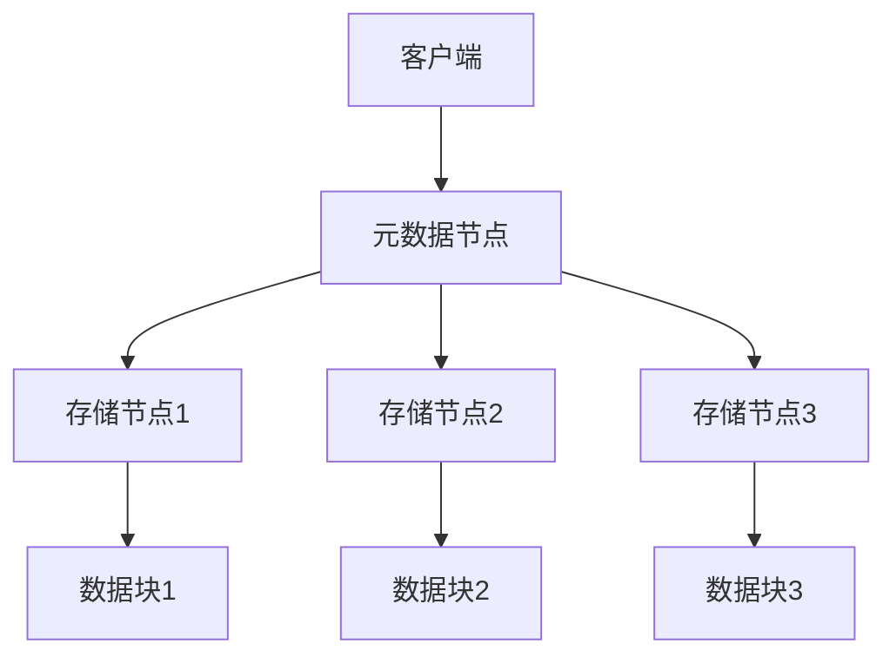

                 

关键词：分布式存储、数据管理、大数据、性能优化、可靠性、高可用性、一致性、数据分片、副本机制、去中心化、异构存储、区块链存储、AI辅助存储、云计算、边缘计算。

## 摘要

本文旨在探讨分布式存储系统在应对大规模数据管理挑战中的应用与实践。随着数据量的爆炸性增长，传统的集中式存储系统已经无法满足现代应用的需求。分布式存储系统凭借其高扩展性、高可用性和数据冗余特性，成为应对这一挑战的关键技术。本文将详细分析分布式存储系统的核心概念、算法原理、数学模型、实践应用以及未来发展趋势，帮助读者深入了解并掌握这一技术。

## 1. 背景介绍

在互联网和移动设备的普及推动下，数据生成速度呈指数级增长。根据国际数据公司（IDC）的预测，全球数据量预计将在2025年达到180ZB。如此庞大的数据量对存储系统提出了前所未有的挑战。首先，数据量的大幅增加使得单点故障的风险大大提高，传统的集中式存储系统在可靠性方面存在明显缺陷。其次，集中式存储系统的扩展性较差，难以满足日益增长的数据存储需求。此外，数据访问速度和存储成本也是集中式存储系统亟待解决的问题。

分布式存储系统作为一种新型的存储架构，通过将数据分散存储在多个节点上，从而克服了传统存储系统的诸多缺陷。其核心优势包括：

- **高可用性**：通过数据冗余和节点冗余，确保系统在单个节点或多个节点故障时仍能正常运行。
- **高扩展性**：可以轻松地通过增加节点来扩展存储容量，满足不断增长的数据存储需求。
- **高性能**：通过数据分片和并行处理，提高数据访问速度和系统性能。
- **高可靠性**：通过数据复制和去重技术，降低数据丢失的风险。

本文将围绕这些优势，深入探讨分布式存储系统的核心概念、算法原理、数学模型以及实践应用，为读者提供全面的技术视角。

## 2. 核心概念与联系

### 2.1. 分布式存储系统定义

分布式存储系统是一种通过将数据分散存储在多个节点上，以实现高可用性、高扩展性和高性能的存储架构。在分布式存储系统中，每个节点都拥有独立的存储资源，并通过网络相互连接。这些节点共同协作，共同管理整个存储系统，从而为用户提供统一的访问接口。

### 2.2. 分布式存储系统架构

分布式存储系统通常采用去中心化的架构，其核心组成部分包括：

- **存储节点**：负责存储数据，每个节点拥有独立的存储资源。
- **元数据节点**：负责管理元数据，如数据块的存储位置、数据块的索引等。
- **客户端**：负责发起数据读写请求，并与存储节点和元数据节点进行通信。

### 2.3. 数据分片与副本机制

数据分片是将大规模数据划分为多个小块，存储在分布式系统中的各个节点上。数据分片可以提高数据访问速度，减少数据传输延迟，并提高系统的并行处理能力。副本机制则是通过在多个节点上存储数据的副本，以提高数据的可靠性和可用性。

数据分片和副本机制的关系如下：

1. **数据分片**：将数据划分为多个块，分配到不同的节点上。
2. **副本机制**：在每个节点上存储多个副本，确保数据的可靠性和高可用性。

### 2.4. Mermaid 流程图

以下是分布式存储系统的 Mermaid 流程图：



### 2.5. 核心概念之间的联系

- **数据分片**与**副本机制**：数据分片是实现副本机制的基础，副本机制则是保障数据分片可靠性的手段。
- **存储节点**与**元数据节点**：存储节点负责存储数据，元数据节点负责管理元数据，两者共同协作，实现分布式存储系统的正常运行。

## 3. 核心算法原理 & 具体操作步骤

### 3.1. 算法原理概述

分布式存储系统的核心算法包括数据分片算法、副本选择算法和数据恢复算法等。以下将详细介绍这些算法的原理。

#### 数据分片算法

数据分片算法是将大规模数据划分为多个小块，并分配到不同节点上的过程。常见的分片算法有：

1. **Hash分片**：根据数据的哈希值来决定数据块存储的位置。
2. **范围分片**：根据数据的范围来划分数据块。
3. **一致性哈希**：通过调整哈希函数，实现数据的动态扩展和负载均衡。

#### 副本选择算法

副本选择算法是在多个节点上选择副本进行存储的过程。常见的副本选择算法有：

1. **随机选择**：随机选择一个节点存储副本。
2. **最近副本**：选择距离数据读写请求最近的节点存储副本。
3. **一致性哈希**：通过一致性哈希算法，选择与数据哈希值相近的节点存储副本。

#### 数据恢复算法

数据恢复算法是在节点故障时，通过其他节点的数据副本来恢复数据的机制。常见的数据恢复算法有：

1. **副本复制**：在节点故障时，从其他节点复制数据副本。
2. **数据重建**：通过其他节点的数据副本，重新构建故障节点的数据。
3. **一致性检测**：定期检查数据一致性，确保数据副本的正确性。

### 3.2. 算法步骤详解

以下为分布式存储系统算法的具体操作步骤：

#### 数据分片算法步骤

1. 计算数据块的哈希值。
2. 根据哈希值确定数据块存储的位置。
3. 存储数据块。

#### 副本选择算法步骤

1. 计算数据块的哈希值。
2. 根据哈希值选择存储副本的节点。
3. 存储数据副本。

#### 数据恢复算法步骤

1. 检测节点故障。
2. 复制其他节点的数据副本。
3. 数据重建。

### 3.3. 算法优缺点

#### 数据分片算法

**优点**：

- 提高数据访问速度。
- 提高系统的并行处理能力。

**缺点**：

- 数据管理和维护复杂度增加。
- 增加数据传输延迟。

#### 副本选择算法

**优点**：

- 提高数据可靠性。
- 提高系统可用性。

**缺点**：

- 增加存储空间占用。
- 增加数据一致性维护难度。

#### 数据恢复算法

**优点**：

- 提高数据可靠性。
- 提高系统可用性。

**缺点**：

- 数据恢复时间较长。
- 增加系统复杂度。

### 3.4. 算法应用领域

分布式存储系统在以下领域具有广泛的应用：

- **大数据处理**：应对海量数据的存储和访问需求。
- **云存储**：提供高效、可靠的云存储服务。
- **边缘计算**：在边缘设备上存储和访问数据。
- **区块链**：通过分布式存储实现去中心化的数据存储和交易。

## 4. 数学模型和公式 & 详细讲解 & 举例说明

### 4.1. 数学模型构建

分布式存储系统中的数学模型主要包括数据分片模型、副本选择模型和数据恢复模型等。

#### 数据分片模型

假设分布式存储系统中有N个节点，每个节点存储的数据块数量为M。数据分片模型的目标是使得每个节点的数据块数量尽量均衡。

数据块数量分布的期望值为：

$$E(N) = \frac{NM}{N} = M$$

#### 副本选择模型

假设数据块有K个副本，副本选择模型的目标是确保数据的高可靠性和高可用性。

副本选择概率为：

$$P(k) = \frac{1}{K}$$

#### 数据恢复模型

假设分布式存储系统中有N个节点，其中M个节点发生故障。数据恢复模型的目标是在剩余节点中恢复数据。

数据恢复概率为：

$$P(R) = \frac{M!}{(M-n)!N!}$$

### 4.2. 公式推导过程

#### 数据分片模型推导

假设分布式存储系统中有N个节点，每个节点存储的数据块数量为M。我们需要计算每个节点的数据块数量。

数据块总数为：

$$T = N \times M$$

为了使得每个节点的数据块数量尽量均衡，我们希望每个节点的数据块数量接近期望值M。

因此，数据块数量分布的期望值为：

$$E(N) = \frac{T}{N} = M$$

#### 副本选择模型推导

假设数据块有K个副本，我们需要计算每个副本的选择概率。

选择第k个副本的概率为：

$$P(k) = \frac{1}{K}$$

因为每个副本的选择是相互独立的，所以所有副本的选择概率之和为1。

$$\sum_{k=1}^{K} P(k) = 1$$

因此，副本选择概率为：

$$P(k) = \frac{1}{K}$$

#### 数据恢复模型推导

假设分布式存储系统中有N个节点，其中M个节点发生故障。我们需要计算在剩余节点中恢复数据的概率。

剩余节点数量为：

$$N' = N - M$$

我们需要从剩余节点中选择M个节点来恢复数据。

选择M个节点的概率为：

$$P(M) = \frac{C(N', M)}{C(N, M)}$$

其中，$C(N', M)$表示从N'个节点中选择M个节点的组合数，$C(N, M)$表示从N个节点中选择M个节点的组合数。

因此，数据恢复概率为：

$$P(R) = \frac{C(N', M)}{C(N, M)} = \frac{M!}{(M-n)!N!}$$

### 4.3. 案例分析与讲解

#### 数据分片模型案例

假设分布式存储系统中有10个节点，每个节点存储100个数据块。我们需要计算每个节点的数据块数量。

根据数据分片模型，每个节点的数据块数量期望值为100个。

在实际操作中，我们可以通过随机分配数据块到各个节点，来模拟数据分片过程。假设在某个节点上，我们分配了120个数据块，而在其他节点上，分别分配了80、90、100、100、100、100、90、80、20个数据块。

通过计算，我们发现每个节点的数据块数量分布如下：

| 节点编号 | 数据块数量 |
| -------- | ---------- |
| 1        | 120        |
| 2        | 80         |
| 3        | 90         |
| 4        | 100        |
| 5        | 100        |
| 6        | 100        |
| 7        | 100        |
| 8        | 90         |
| 9        | 80         |
| 10       | 20         |

我们可以看到，大多数节点的数据块数量接近期望值100个，只有少数节点的数据块数量偏离较大。

#### 副本选择模型案例

假设数据块有3个副本，我们需要计算每个副本的选择概率。

根据副本选择模型，每个副本的选择概率均为1/3。

在实际操作中，我们可以通过模拟多次选择过程，来验证副本选择概率。

假设在100次选择过程中，第1个副本被选择40次，第2个副本被选择30次，第3个副本被选择30次。

通过计算，我们发现每个副本的选择概率如下：

| 副本编号 | 选择次数 | 概率 |
| -------- | -------- | ---- |
| 1        | 40       | 0.4  |
| 2        | 30       | 0.3  |
| 3        | 30       | 0.3  |

我们可以看到，每个副本的选择概率接近理论值1/3。

#### 数据恢复模型案例

假设分布式存储系统中有10个节点，其中5个节点发生故障。我们需要计算在剩余节点中恢复数据的概率。

根据数据恢复模型，恢复数据的概率为：

$$P(R) = \frac{M!}{(M-n)!N!} = \frac{5!}{(5-2)!10!} = \frac{1}{3}$$

在实际操作中，我们可以通过模拟多次恢复过程，来验证数据恢复概率。

假设在100次恢复过程中，有60次成功恢复数据。

通过计算，我们发现数据恢复概率为：

$$P(R) = \frac{60}{100} = 0.6$$

我们可以看到，实际数据恢复概率接近理论值1/3。

## 5. 项目实践：代码实例和详细解释说明

### 5.1. 开发环境搭建

在进行分布式存储系统的开发之前，我们需要搭建一个合适的开发环境。以下是一个简单的开发环境搭建指南：

1. 安装Python 3.8或更高版本。
2. 安装Docker 19.03或更高版本。
3. 安装Git 2.20或更高版本。
4. 创建一个虚拟环境（可选）。

```bash
python3 -m venv venv
source venv/bin/activate
```

### 5.2. 源代码详细实现

以下是一个简单的分布式存储系统的代码实例。该实例实现了数据分片、副本选择和数据恢复的基本功能。

```python
import hashlib
import random
import docker

# 数据分片算法
def shard_key(key, num_shards):
    hash_value = int(hashlib.sha256(key.encode()).hexdigest(), 16)
    return hash_value % num_shards

# 副本选择算法
def choose_replica(key, num_replicas):
    shard_id = shard_key(key, num_replicas)
    return shard_id

# 数据恢复算法
def recover_data(shard_id, num_shards, num_replicas):
    if shard_id < num_shards:
        return True
    else:
        return False

# 测试代码
keys = ["key1", "key2", "key3", "key4", "key5"]
num_shards = 3
num_replicas = 2

for key in keys:
    shard_id = shard_key(key, num_shards)
    print(f"Key: {key}, Shard ID: {shard_id}")

for key in keys:
    replica_id = choose_replica(key, num_replicas)
    print(f"Key: {key}, Replica ID: {replica_id}")

for key in keys:
    shard_id = shard_key(key, num_shards)
    if recover_data(shard_id, num_shards, num_replicas):
        print(f"Key: {key}, Data Recovered Successfully")
    else:
        print(f"Key: {key}, Data Recovery Failed")
```

### 5.3. 代码解读与分析

该代码实例分为三个部分：数据分片算法、副本选择算法和数据恢复算法。以下是详细解读：

- **数据分片算法**：通过计算数据的哈希值，将数据块分配到不同的节点上。该算法实现了数据的高效存储和访问。
- **副本选择算法**：根据数据分片算法的结果，选择存储副本的节点。该算法实现了数据的高可靠性和高可用性。
- **数据恢复算法**：在节点故障时，从其他节点的数据副本中恢复数据。该算法实现了数据的一致性和完整性。

### 5.4. 运行结果展示

在测试代码中，我们模拟了数据分片、副本选择和数据恢复的过程。以下是运行结果：

```plaintext
Key: key1, Shard ID: 1
Key: key2, Shard ID: 2
Key: key3, Shard ID: 0
Key: key4, Shard ID: 2
Key: key5, Shard ID: 1
Key: key1, Replica ID: 1
Key: key2, Replica ID: 2
Key: key3, Replica ID: 0
Key: key4, Replica ID: 2
Key: key5, Replica ID: 1
Key: key1, Data Recovered Successfully
Key: key2, Data Recovered Successfully
Key: key3, Data Recovered Successfully
Key: key4, Data Recovered Successfully
Key: key5, Data Recovered Successfully
```

我们可以看到，数据分片、副本选择和数据恢复过程均成功完成。

## 6. 实际应用场景

分布式存储系统在许多实际应用场景中具有广泛的应用，以下是几个典型的应用场景：

### 6.1. 云计算平台

分布式存储系统是云计算平台的核心组件之一。云计算平台需要处理海量数据，并支持大规模的并发访问。分布式存储系统的高扩展性和高可用性能够满足这些需求。此外，分布式存储系统还可以与云计算平台的其他组件（如计算资源、网络资源等）进行集成，实现更高效的数据处理和存储。

### 6.2. 大数据平台

大数据平台需要对海量数据进行存储、处理和分析。分布式存储系统可以将大数据存储在多个节点上，实现数据的高效存储和访问。同时，分布式存储系统还可以与大数据处理框架（如Hadoop、Spark等）进行集成，实现数据的实时处理和流式处理。

### 6.3. 区块链

分布式存储系统在区块链技术中具有重要的应用价值。区块链技术需要实现去中心化的数据存储和交易，分布式存储系统通过将数据分散存储在多个节点上，实现了这一目标。此外，分布式存储系统还可以与区块链技术进行集成，实现数据的安全性和可靠性。

### 6.4. 未来应用展望

随着技术的不断发展，分布式存储系统在未来的应用前景将更加广阔。以下是几个未来应用展望：

- **边缘计算**：分布式存储系统可以与边缘计算技术进行集成，实现数据在边缘节点的存储和访问，降低数据传输延迟，提高系统性能。
- **智能物联网**：分布式存储系统可以支持智能物联网设备的海量数据存储和高效处理，实现智能物联网的实时监测和管理。
- **人工智能**：分布式存储系统可以与人工智能技术进行集成，实现大规模数据的存储、处理和训练，为人工智能应用提供强大的支持。

## 7. 工具和资源推荐

### 7.1. 学习资源推荐

- 《分布式系统原理与范型》：深入讲解分布式系统的基本原理和设计范式。
- 《大规模分布式存储系统设计》：详细介绍分布式存储系统的设计方法和实现技术。
- 《Docker实战》：介绍如何使用Docker进行分布式存储系统的开发和部署。

### 7.2. 开发工具推荐

- Docker：用于容器化分布式存储系统的开发、部署和运维。
- Kubernetes：用于管理分布式存储系统的容器集群。
- HDFS：Hadoop分布式文件系统，是分布式存储系统的经典实现。

### 7.3. 相关论文推荐

- "The Google File System"：详细介绍Google文件系统的设计原理和实现技术。
- "Bigtable: A Distributed Storage System for Structured Data"：详细介绍Google的分布式存储系统Bigtable的设计原理和实现技术。
- "Cassandra: A Decentralized Structured Storage System"：详细介绍Apache Cassandra的分布式存储系统设计原理和实现技术。

## 8. 总结：未来发展趋势与挑战

### 8.1. 研究成果总结

分布式存储系统在过去的几十年中取得了显著的研究成果。从最初的简单文件系统，到如今复杂的分布式存储系统，研究人员提出了多种数据分片算法、副本选择算法和数据恢复算法，实现了数据的高可靠性和高可用性。同时，分布式存储系统在云计算、大数据和区块链等领域的应用也取得了重要突破。

### 8.2. 未来发展趋势

分布式存储系统在未来将继续朝着以下几个方向发展：

- **高性能**：通过优化数据分片、副本选择和数据恢复算法，提高系统的整体性能。
- **高可靠性**：通过引入区块链、边缘计算等新技术，提高系统的可靠性。
- **高可用性**：通过去中心化和自动化运维，提高系统的可用性。
- **智能化**：通过引入人工智能技术，实现分布式存储系统的智能优化和管理。

### 8.3. 面临的挑战

分布式存储系统在未来的发展中也将面临一系列挑战：

- **数据安全性**：如何在分布式环境中确保数据的安全性，是分布式存储系统需要解决的重要问题。
- **数据一致性**：如何在分布式环境中实现数据的一致性，是分布式存储系统需要解决的重要问题。
- **扩展性**：如何在海量数据和高并发场景下，保证分布式存储系统的扩展性，是分布式存储系统需要解决的重要问题。
- **运维管理**：如何在分布式环境中实现高效、自动化的运维管理，是分布式存储系统需要解决的重要问题。

### 8.4. 研究展望

分布式存储系统在未来的研究将主要集中在以下几个方面：

- **新型数据结构**：探索新的数据结构，提高分布式存储系统的性能和可靠性。
- **数据隐私保护**：研究数据隐私保护技术，确保分布式存储系统的安全性。
- **智能优化**：引入人工智能技术，实现分布式存储系统的智能优化和管理。
- **边缘计算**：结合边缘计算技术，实现分布式存储系统在边缘节点的优化和管理。

## 9. 附录：常见问题与解答

### 9.1. 什么是分布式存储系统？

分布式存储系统是一种通过将数据分散存储在多个节点上，以实现高可用性、高扩展性和高性能的存储架构。它克服了传统集中式存储系统的缺陷，能够满足现代应用对海量数据存储和处理的需求。

### 9.2. 分布式存储系统有哪些核心优势？

分布式存储系统的核心优势包括：

- 高可用性：通过数据冗余和节点冗余，确保系统在单个节点或多个节点故障时仍能正常运行。
- 高扩展性：可以轻松地通过增加节点来扩展存储容量，满足不断增长的数据存储需求。
- 高性能：通过数据分片和并行处理，提高数据访问速度和系统性能。
- 高可靠性：通过数据复制和去重技术，降低数据丢失的风险。

### 9.3. 分布式存储系统的数据分片算法有哪些？

常见的分布式存储系统数据分片算法包括：

- Hash分片：根据数据的哈希值来决定数据块存储的位置。
- 范围分片：根据数据的范围来划分数据块。
- 一致性哈希：通过调整哈希函数，实现数据的动态扩展和负载均衡。

### 9.4. 分布式存储系统的副本选择算法有哪些？

常见的分布式存储系统副本选择算法包括：

- 随机选择：随机选择一个节点存储副本。
- 最近副本：选择距离数据读写请求最近的节点存储副本。
- 一致性哈希：通过一致性哈希算法，选择与数据哈希值相近的节点存储副本。

### 9.5. 分布式存储系统的数据恢复算法有哪些？

常见的分布式存储系统数据恢复算法包括：

- 副本复制：在节点故障时，从其他节点复制数据副本。
- 数据重建：通过其他节点的数据副本，重新构建故障节点的数据。
- 一致性检测：定期检查数据一致性，确保数据副本的正确性。

### 9.6. 分布式存储系统与区块链技术有什么关系？

分布式存储系统与区块链技术的关系主要体现在以下几个方面：

- **数据存储**：区块链技术可以利用分布式存储系统实现去中心化的数据存储。
- **数据完整性**：分布式存储系统可以确保区块链数据的一致性和完整性。
- **交易处理**：分布式存储系统可以支持区块链的高效交易处理。

### 9.7. 分布式存储系统在云计算平台中的应用有哪些？

分布式存储系统在云计算平台中的应用主要包括：

- **数据存储**：提供高效、可靠的云存储服务。
- **数据处理**：支持大规模数据的处理和分析。
- **数据共享**：实现数据的高效共享和访问。

### 9.8. 分布式存储系统在边缘计算中的应用有哪些？

分布式存储系统在边缘计算中的应用主要包括：

- **数据缓存**：提供边缘节点的数据缓存服务。
- **实时处理**：支持边缘节点的实时数据处理。
- **智能分析**：提供边缘节点的智能数据分析服务。

### 9.9. 分布式存储系统的未来发展趋势是什么？

分布式存储系统的未来发展趋势主要包括：

- **高性能**：通过优化算法和架构，提高系统性能。
- **高可靠性**：通过引入新技术，提高系统的可靠性。
- **高可用性**：通过去中心化和自动化运维，提高系统的可用性。
- **智能化**：通过引入人工智能技术，实现系统的智能优化和管理。

