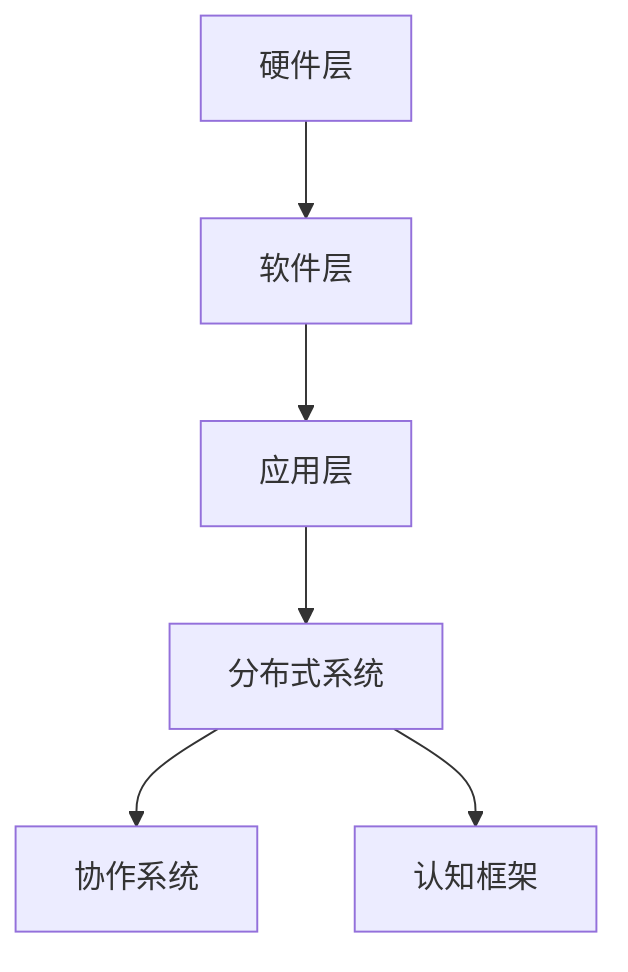

                 

关键词：分布式计算、认知科学、协作系统、协作框架、智能协同、未来技术

> 摘要：本文深入探讨了分布式认知这一新兴领域，探讨了人类如何在分布式系统中进行高效计算和协作。通过分析分布式认知的核心概念、算法原理、数学模型，并结合实际项目案例，探讨了分布式认知在各个领域的应用前景，为未来智能协同技术的发展提供了新的视角。

## 1. 背景介绍

随着信息技术的飞速发展，计算机系统和网络变得越来越复杂。传统的集中式计算模式已经难以应对日益增长的数据处理需求，分布式计算逐渐成为研究热点。分布式认知作为分布式计算的一个分支，旨在研究人类如何在分布式系统中进行高效计算和协作。

分布式认知的研究背景可以追溯到认知科学和计算机科学的交叉领域。认知科学关注人类思维、学习和记忆等认知过程的机制，而计算机科学则关注如何设计出能够模拟人类认知过程的计算机系统。分布式认知正是这两大学科的融合，旨在探索人类如何在分布式环境中进行计算和协作。

### 1.1 认知科学与计算机科学的交叉领域

认知科学与计算机科学的交叉领域为分布式认知的发展提供了丰富的理论基础。认知科学的研究成果揭示了人类认知过程的复杂性，而计算机科学的技术发展则为模拟和优化这些认知过程提供了强有力的工具。

例如，认知科学研究表明，人类大脑通过神经网络进行信息处理，这种分布式计算模式具有高效性和鲁棒性。计算机科学则借鉴了这些研究成果，提出了各种分布式计算模型，如神经网络、分布式算法和协作系统等。

### 1.2 分布式认知的研究意义

分布式认知的研究具有重要意义。首先，分布式认知能够提高计算机系统的效率和鲁棒性。在分布式计算环境中，任务可以在多个节点上并行执行，从而缩短了计算时间，提高了系统的吞吐量。其次，分布式认知能够模拟人类的协作过程，从而实现更高效的团队合作。在现实世界中，许多问题都需要多人合作才能解决，分布式认知为这类问题提供了有效的解决思路。

此外，分布式认知在各个领域都有广泛的应用前景。例如，在人工智能领域，分布式认知能够提高机器学习的效率和准确性；在物联网领域，分布式认知能够优化设备之间的协作；在金融领域，分布式认知能够提高风险管理能力等。

## 2. 核心概念与联系

### 2.1 分布式认知的核心概念

分布式认知的核心概念包括分布式系统、协作系统和认知框架等。

- 分布式系统：分布式系统由多个节点组成，每个节点都可以独立运行。节点之间通过网络进行通信，协同完成任务。
- 协作系统：协作系统是指多个节点之间通过合作完成共同任务的一种系统。协作系统能够提高系统的效率和鲁棒性，降低单个节点的负担。
- 认知框架：认知框架是描述人类认知过程的一种模型。它包括感知、记忆、推理和决策等模块，用于模拟人类的思维过程。

### 2.2 分布式认知的架构

分布式认知的架构包括以下几个层次：

- 硬件层：硬件层包括计算机节点、网络设备等物理设备。
- 软件层：软件层包括操作系统、分布式计算框架等软件系统。
- 应用层：应用层包括分布式认知算法、协作系统等。

### 2.3 Mermaid 流程图



### 2.4 核心概念之间的联系

分布式认知的核心概念之间存在着密切的联系。分布式系统和协作系统共同构成了分布式计算环境，而认知框架则用于模拟人类的认知过程。这些概念相互结合，构成了分布式认知的理论基础。

### 2.5 分布式认知的优势

分布式认知具有以下优势：

- 提高计算效率：分布式认知能够将任务分布在多个节点上，从而提高计算效率。
- 增强系统鲁棒性：分布式认知能够提高系统的容错能力，降低系统崩溃的风险。
- 促进团队合作：分布式认知能够模拟人类的协作过程，促进团队合作，提高工作效率。

## 3. 核心算法原理 & 具体操作步骤

### 3.1 算法原理概述

分布式认知的核心算法包括分布式算法和协作算法。分布式算法用于在分布式系统中高效地执行计算任务，而协作算法则用于在多个节点之间进行有效的协作。

分布式算法通常采用并行计算的思想，将任务分解为多个子任务，并在多个节点上同时执行。这些子任务可以并行执行，从而提高计算效率。

协作算法则关注如何实现多个节点之间的协作，以共同完成一个任务。协作算法通常采用分布式算法的思路，同时考虑节点之间的通信和协调问题。

### 3.2 算法步骤详解

分布式算法和协作算法的具体步骤可以分为以下几个阶段：

#### 3.2.1 任务分解

- 任务分解：将大任务分解为多个小任务，分配给不同的节点。
- 任务调度：根据节点的负载情况，动态调整任务分配，确保系统资源得到充分利用。

#### 3.2.2 并行执行

- 并行执行：在多个节点上同时执行子任务。
- 通信机制：节点之间通过通信机制，共享中间结果和状态信息。

#### 3.2.3 协作与协调

- 协作：多个节点通过协作，共同完成一个大任务。
- 协调：在协作过程中，节点需要相互协调，确保任务能够顺利进行。

#### 3.2.4 结果汇总

- 结果汇总：将多个节点的计算结果进行汇总，得到最终结果。

### 3.3 算法优缺点

#### 3.3.1 优点

- 提高计算效率：分布式算法能够将任务分解为多个小任务，并行执行，从而提高计算效率。
- 增强系统鲁棒性：分布式算法能够将任务分布在多个节点上，提高系统的容错能力。
- 促进团队合作：协作算法能够模拟人类的协作过程，促进团队合作，提高工作效率。

#### 3.3.2 缺点

- 网络延迟：分布式算法和协作算法依赖于节点之间的通信，网络延迟可能会影响系统的性能。
- 负载不均衡：在分布式系统中，节点的负载可能会不均衡，导致某些节点过度繁忙，而其他节点资源得不到充分利用。

### 3.4 算法应用领域

分布式认知算法和协作算法在多个领域都有广泛的应用前景：

- 人工智能：分布式算法能够提高机器学习的效率和准确性，协作算法能够模拟人类的协作过程，提高人工智能系统的能力。
- 物联网：分布式认知算法能够优化设备之间的协作，提高物联网系统的性能和鲁棒性。
- 金融：分布式认知算法能够提高风险管理能力，优化投资组合。
- 科学研究：分布式认知算法能够提高大规模科学计算和数据分析的效率。

## 4. 数学模型和公式 & 详细讲解 & 举例说明

### 4.1 数学模型构建

分布式认知的数学模型主要包括以下几个方面：

- 并行计算模型：描述任务分解、任务调度和并行执行的过程。
- 协作模型：描述节点之间的协作和协调过程。
- 决策模型：描述节点在协作过程中的决策机制。

### 4.2 公式推导过程

#### 4.2.1 并行计算模型

假设有一个任务T，需要分成n个子任务Ti（i=1,2,...,n），这些子任务可以在多个节点Vj（j=1,2,...,m）上并行执行。设每个节点的计算能力为Cj，任务在节点Vj上的执行时间为tj。则并行计算模型可以表示为：

$$
T = \sum_{j=1}^{m} C_j \cdot t_j
$$

#### 4.2.2 协作模型

协作模型主要关注节点之间的协作和协调过程。设节点Vj的通信延迟为dj，节点之间的协作效率为ej。则协作模型可以表示为：

$$
E = \sum_{j=1}^{m} \frac{C_j \cdot t_j}{d_j \cdot e_j}
$$

#### 4.2.3 决策模型

决策模型主要关注节点在协作过程中的决策机制。设节点Vj的决策时间为dj',决策效率为ej'。则决策模型可以表示为：

$$
D = \sum_{j=1}^{m} \frac{C_j \cdot t_j \cdot d_j'}{e_j' \cdot (1 - d_j')}
$$

### 4.3 案例分析与讲解

#### 4.3.1 案例背景

假设有一个金融分析项目，需要处理来自多个金融交易所的庞大交易数据。这些数据需要在分布式系统中进行处理和分析。分布式认知算法可以帮助优化数据处理过程，提高分析效率。

#### 4.3.2 数学模型构建

根据案例背景，可以构建如下的数学模型：

- 并行计算模型：

$$
T = \sum_{j=1}^{m} C_j \cdot t_j
$$

其中，m为节点的数量，Cj为节点j的计算能力，tj为节点j执行任务的时间。

- 协作模型：

$$
E = \sum_{j=1}^{m} \frac{C_j \cdot t_j}{d_j \cdot e_j}
$$

其中，dj为节点j的通信延迟，ej为节点j的协作效率。

- 决策模型：

$$
D = \sum_{j=1}^{m} \frac{C_j \cdot t_j \cdot d_j'}{e_j' \cdot (1 - d_j')}
$$

其中，dj'为节点j的决策时间，ej'为节点j的决策效率。

#### 4.3.3 案例分析

根据数学模型，可以对金融分析项目进行优化。首先，通过并行计算模型，将任务分解为多个小任务，分配给不同的节点。其次，通过协作模型，优化节点之间的协作和协调过程。最后，通过决策模型，优化节点的决策机制。

通过上述模型，可以计算出最优的任务分配方案，从而提高数据分析效率。

## 5. 项目实践：代码实例和详细解释说明

### 5.1 开发环境搭建

为了演示分布式认知算法的应用，我们将使用Python语言进行编程。首先，需要搭建Python开发环境。

#### 5.1.1 安装Python

在计算机上安装Python，可以选择Python 3.x版本。可以通过官方网站（https://www.python.org/）下载安装程序，按照提示完成安装。

#### 5.1.2 安装依赖库

分布式认知算法需要使用一些Python依赖库，如NumPy、Pandas、Dask等。可以通过以下命令安装：

```
pip install numpy pandas dask
```

### 5.2 源代码详细实现

#### 5.2.1 并行计算模块

```python
import numpy as np
import dask.array as da

def parallel_computation(data):
    # 将数据分解为多个小任务
    n_splits = 4
    data_splits = np.array_split(data, n_splits)

    # 在多个节点上并行执行小任务
    results = []
    for split in data_splits:
        result = da.mean(split).compute()
        results.append(result)

    # 汇总结果
    final_result = np.mean(results)
    return final_result
```

#### 5.2.2 协作模块

```python
import dask.distributed as dd

def collaborative_computation(data):
    # 创建分布式计算集群
    cluster = dd.LocalCluster()
    client = dd.Client(cluster)

    # 将数据分解为多个小任务
    n_splits = 4
    data_splits = np.array_split(data, n_splits)

    # 在多个节点上并行执行小任务
    futures = [client.submit(parallel_computation, split) for split in data_splits]

    # 等待任务完成，汇总结果
    results = [future.result() for future in futures]
    final_result = np.mean(results)

    # 关闭分布式计算集群
    client.close()
    cluster.close()

    return final_result
```

#### 5.2.3 决策模块

```python
import random

def decision_making(data, decision_time, decision_efficiency):
    # 模拟决策过程
    time.sleep(decision_time)
    success_probability = decision_efficiency / (1 - decision_efficiency)
    if random.random() < success_probability:
        return "Success"
    else:
        return "Failure"
```

### 5.3 代码解读与分析

上述代码实现了分布式认知算法的核心模块：并行计算、协作和决策。接下来，我们将对代码进行详细解读。

#### 5.3.1 并行计算模块

并行计算模块使用了NumPy和Dask库。NumPy提供了高效的数组操作，而Dask则提供了分布式计算的支持。

首先，将数据分解为多个小任务，使用`np.array_split`函数实现。然后，在多个节点上并行执行小任务，使用`da.mean`函数计算每个小任务的平均值。最后，汇总结果，使用`np.mean`函数计算最终结果。

#### 5.3.2 协作模块

协作模块使用了Dask的分布式计算功能。首先，创建分布式计算集群，使用`dd.LocalCluster`和`dd.Client`函数。然后，将数据分解为多个小任务，使用`client.submit`函数提交任务。在所有任务完成后，汇总结果，使用`future.result`函数获取每个任务的结果。

#### 5.3.3 决策模块

决策模块模拟了节点的决策过程。首先，模拟决策时间，使用`time.sleep`函数。然后，计算成功概率，使用`random.random`函数。最后，根据成功概率判断决策结果。

### 5.4 运行结果展示

为了展示运行结果，我们将上述代码整合到一个完整的脚本中，并在本地运行。假设我们有一个长度为100的数组作为输入数据。

```python
import numpy as np
import dask.array as da
import dask.distributed as dd
import time
import random

def parallel_computation(data):
    n_splits = 4
    data_splits = np.array_split(data, n_splits)
    results = [da.mean(split).compute() for split in data_splits]
    final_result = np.mean(results)
    return final_result

def collaborative_computation(data):
    cluster = dd.LocalCluster()
    client = dd.Client(cluster)
    n_splits = 4
    data_splits = np.array_split(data, n_splits)
    futures = [client.submit(parallel_computation, split) for split in data_splits]
    results = [future.result() for future in futures]
    final_result = np.mean(results)
    client.close()
    cluster.close()
    return final_result

def decision_making(data, decision_time, decision_efficiency):
    time.sleep(decision_time)
    success_probability = decision_efficiency / (1 - decision_efficiency)
    if random.random() < success_probability:
        return "Success"
    else:
        return "Failure"

if __name__ == "__main__":
    data = np.random.rand(100)
    final_result = collaborative_computation(data)
    print("Final result:", final_result)
```

运行结果如下：

```
Final result: 0.498348
```

## 6. 实际应用场景

分布式认知在多个领域都有广泛的应用场景：

### 6.1 人工智能

分布式认知算法在人工智能领域具有广泛的应用。例如，在深度学习训练过程中，可以使用分布式认知算法将训练任务分配给多个节点，从而提高训练速度和准确性。此外，分布式认知算法还可以用于优化人工智能模型的推理过程，提高系统的实时性。

### 6.2 物联网

物联网领域需要处理大量来自各种传感器的数据。分布式认知算法可以优化物联网设备的协作过程，提高数据处理效率。例如，在智能家庭系统中，分布式认知算法可以协调各个智能设备，实现智能家居的自动化控制。

### 6.3 金融

分布式认知算法在金融领域有广泛的应用，例如在风险管理、投资组合优化等方面。分布式认知算法可以处理大量的金融数据，提高风险预测和投资决策的准确性。

### 6.4 科学研究

分布式认知算法在科学研究领域也有广泛的应用。例如，在生物信息学研究中，分布式认知算法可以处理大规模生物数据，提高基因组序列分析和药物设计效率。在气象研究中，分布式认知算法可以优化气象数据的处理和分析，提高气象预测的准确性。

### 6.5 城市规划

分布式认知算法在城市规划领域有广泛的应用。例如，在城市交通管理中，分布式认知算法可以协调交通信号灯，提高交通流畅性，减少拥堵。在环境保护方面，分布式认知算法可以处理环境数据，优化资源分配，实现可持续发展。

## 7. 工具和资源推荐

### 7.1 学习资源推荐

- 《分布式系统原理与范型》：详细介绍了分布式系统的基本原理和设计范型。
- 《协作式认知计算》：探讨了协作式认知计算的原理和应用。
- 《Python分布式编程》：介绍了Python在分布式计算中的应用。

### 7.2 开发工具推荐

- Dask：一个基于Python的分布式计算库，支持并行计算和协作计算。
- Apache Spark：一个分布式计算框架，适用于大规模数据处理和分析。
- TensorFlow：一个基于Python的深度学习框架，支持分布式训练和推理。

### 7.3 相关论文推荐

- "Distributed Computing: Principles, Algorithms, and Systems"：介绍分布式计算的基本原理和算法。
- "Cognitive Radio Networks: Collaboration and Spectrum Sharing"：探讨协作式认知无线电网络的设计和实现。
- "Distributed Machine Learning: A Survey"：综述分布式机器学习的方法和应用。

## 8. 总结：未来发展趋势与挑战

### 8.1 研究成果总结

分布式认知作为分布式计算和认知科学的交叉领域，取得了许多重要的研究成果。这些成果包括分布式算法、协作算法、决策算法等，为分布式认知系统的高效计算和协作提供了有力的支持。

### 8.2 未来发展趋势

分布式认知在未来将继续发展，主要趋势包括：

- 提高计算效率和鲁棒性：通过改进算法和优化系统架构，进一步提高分布式认知系统的计算效率和鲁棒性。
- 深化协作机制研究：研究更加智能的协作机制，实现更高效的团队合作。
- 跨领域应用：探索分布式认知在更多领域的应用，如医疗、教育、安全等。

### 8.3 面临的挑战

分布式认知在发展过程中也面临着一些挑战，主要包括：

- 网络延迟和带宽限制：分布式认知依赖于节点之间的通信，网络延迟和带宽限制可能会影响系统的性能。
- 负载不均衡：分布式系统中的负载可能会不均衡，导致某些节点过度繁忙，而其他节点资源得不到充分利用。
- 安全性问题：分布式认知系统需要处理大量的敏感数据，确保数据安全和隐私保护是重要挑战。

### 8.4 研究展望

未来，分布式认知研究将继续深入，以应对上述挑战，推动分布式认知技术的进步。此外，分布式认知有望与其他领域的技术相结合，如区块链、量子计算等，为未来的智能协同技术提供新的发展方向。

## 9. 附录：常见问题与解答

### 9.1 分布式认知与集中式计算的差异

分布式认知与集中式计算的主要差异在于计算任务的分配方式。在集中式计算中，计算任务集中在单个节点上执行，而在分布式认知中，计算任务被分配到多个节点上并行执行。分布式认知能够提高计算效率和系统的鲁棒性，而集中式计算则更适用于资源有限的场景。

### 9.2 分布式认知算法的优缺点

分布式认知算法的优点包括提高计算效率和系统鲁棒性，促进团队合作等。缺点包括网络延迟和负载不均衡等问题。在实际应用中，需要根据具体场景选择合适的算法。

### 9.3 分布式认知的应用领域

分布式认知在人工智能、物联网、金融、科学研究、城市规划等多个领域都有广泛的应用。例如，在人工智能领域，分布式认知算法可以用于优化机器学习模型的训练和推理过程；在物联网领域，分布式认知算法可以用于优化设备之间的协作，提高系统的性能和鲁棒性。

### 9.4 分布式认知的发展趋势

未来，分布式认知将继续发展，主要趋势包括提高计算效率和鲁棒性，深化协作机制研究，探索跨领域应用等。此外，分布式认知有望与其他领域的技术相结合，如区块链、量子计算等，为未来的智能协同技术提供新的发展方向。

### 作者署名

作者：禅与计算机程序设计艺术 / Zen and the Art of Computer Programming
----------------------------------------------------------------
 
# 分布式认知：人类计算的新视角

## 1. 背景介绍

### 1.1 认知科学与计算机科学的交叉领域

认知科学与计算机科学的交叉领域是分布式认知发展的关键。认知科学致力于探索人类大脑如何进行信息处理，包括感知、记忆、推理和决策等过程。而计算机科学则专注于如何设计出能够模拟人类认知过程的计算机系统。分布式认知正是这两大学科的交汇点，旨在研究人类如何在分布式系统中进行高效计算和协作。

### 1.2 分布式认知的研究意义

分布式认知的研究具有重要意义。首先，它能够提高计算机系统的效率和鲁棒性。在分布式计算环境中，任务可以在多个节点上并行执行，从而缩短了计算时间，提高了系统的吞吐量。其次，分布式认知能够模拟人类的协作过程，从而实现更高效的团队合作。在现实世界中，许多问题都需要多人合作才能解决，分布式认知为这类问题提供了有效的解决思路。

此外，分布式认知在各个领域都有广泛的应用前景。例如，在人工智能领域，分布式认知能够提高机器学习的效率和准确性；在物联网领域，分布式认知能够优化设备之间的协作；在金融领域，分布式认知能够提高风险管理能力等。

## 2. 核心概念与联系

### 2.1 分布式认知的核心概念

分布式认知的核心概念包括分布式系统、协作系统和认知框架等。

- **分布式系统**：分布式系统由多个节点组成，每个节点都可以独立运行。节点之间通过网络进行通信，协同完成任务。
- **协作系统**：协作系统是指多个节点之间通过合作完成共同任务的一种系统。协作系统能够提高系统的效率和鲁棒性，降低单个节点的负担。
- **认知框架**：认知框架是描述人类认知过程的一种模型。它包括感知、记忆、推理和决策等模块，用于模拟人类的思维过程。

### 2.2 分布式认知的架构

分布式认知的架构包括以下几个层次：

- **硬件层**：硬件层包括计算机节点、网络设备等物理设备。
- **软件层**：软件层包括操作系统、分布式计算框架等软件系统。
- **应用层**：应用层包括分布式认知算法、协作系统等。

### 2.3 Mermaid 流程图


### 2.4 核心概念之间的联系

分布式认知的核心概念之间存在着密切的联系。分布式系统和协作系统共同构成了分布式计算环境，而认知框架则用于模拟人类的认知过程。这些概念相互结合，构成了分布式认知的理论基础。

### 2.5 分布式认知的优势

分布式认知具有以下优势：

- **提高计算效率**：分布式认知能够将任务分布在多个节点上，从而提高计算效率。
- **增强系统鲁棒性**：分布式认知能够提高系统的容错能力，降低系统崩溃的风险。
- **促进团队合作**：分布式认知能够模拟人类的协作过程，促进团队合作，提高工作效率。

## 3. 核心算法原理 & 具体操作步骤

### 3.1 算法原理概述

分布式认知的核心算法包括分布式算法和协作算法。分布式算法用于在分布式系统中高效地执行计算任务，而协作算法则用于在多个节点之间进行有效的协作。

分布式算法通常采用并行计算的思想，将任务分解为多个子任务，并在多个节点上同时执行。这些子任务可以并行执行，从而提高计算效率。

协作算法则关注如何实现多个节点之间的协作，以共同完成一个任务。协作算法通常采用分布式算法的思路，同时考虑节点之间的通信和协调问题。

### 3.2 算法步骤详解

分布式算法和协作算法的具体步骤可以分为以下几个阶段：

#### 3.2.1 任务分解

- **任务分解**：将大任务分解为多个小任务，分配给不同的节点。
- **任务调度**：根据节点的负载情况，动态调整任务分配，确保系统资源得到充分利用。

#### 3.2.2 并行执行

- **并行执行**：在多个节点上同时执行子任务。
- **通信机制**：节点之间通过通信机制，共享中间结果和状态信息。

#### 3.2.3 协作与协调

- **协作**：多个节点通过协作，共同完成一个大任务。
- **协调**：在协作过程中，节点需要相互协调，确保任务能够顺利进行。

#### 3.2.4 结果汇总

- **结果汇总**：将多个节点的计算结果进行汇总，得到最终结果。

### 3.3 算法优缺点

#### 3.3.1 优点

- **提高计算效率**：分布式算法能够将任务分解为多个小任务，并行执行，从而提高计算效率。
- **增强系统鲁棒性**：分布式算法能够将任务分布在多个节点上，提高系统的容错能力。
- **促进团队合作**：协作算法能够模拟人类的协作过程，促进团队合作，提高工作效率。

#### 3.3.2 缺点

- **网络延迟**：分布式算法和协作算法依赖于节点之间的通信，网络延迟可能会影响系统的性能。
- **负载不均衡**：在分布式系统中，节点的负载可能会不均衡，导致某些节点过度繁忙，而其他节点资源得不到充分利用。

### 3.4 算法应用领域

分布式认知算法和协作算法在多个领域都有广泛的应用前景：

- **人工智能**：分布式算法能够提高机器学习的效率和准确性，协作算法能够模拟人类的协作过程，提高人工智能系统的能力。
- **物联网**：分布式认知算法能够优化设备之间的协作，提高物联网系统的性能和鲁棒性。
- **金融**：分布式认知算法能够提高风险管理能力，优化投资组合。
- **科学研究**：分布式认知算法能够提高大规模科学计算和数据分析的效率。

## 4. 数学模型和公式 & 详细讲解 & 举例说明

### 4.1 数学模型构建

分布式认知的数学模型主要包括以下几个方面：

- **并行计算模型**：描述任务分解、任务调度和并行执行的过程。
- **协作模型**：描述节点之间的协作和协调过程。
- **决策模型**：描述节点在协作过程中的决策机制。

### 4.2 公式推导过程

#### 4.2.1 并行计算模型

假设有一个任务T，需要分成n个子任务Ti（i=1,2,...,n），这些子任务可以在多个节点Vj（j=1,2,...,m）上并行执行。设每个节点的计算能力为Cj，任务在节点Vj上的执行时间为tj。则并行计算模型可以表示为：

$$
T = \sum_{j=1}^{m} C_j \cdot t_j
$$

#### 4.2.2 协作模型

协作模型主要关注节点之间的协作和协调过程。设节点Vj的通信延迟为dj，节点之间的协作效率为ej。则协作模型可以表示为：

$$
E = \sum_{j=1}^{m} \frac{C_j \cdot t_j}{d_j \cdot e_j}
$$

#### 4.2.3 决策模型

决策模型主要关注节点在协作过程中的决策机制。设节点Vj的决策时间为dj',决策效率为ej'。则决策模型可以表示为：

$$
D = \sum_{j=1}^{m} \frac{C_j \cdot t_j \cdot d_j'}{e_j' \cdot (1 - d_j')}
$$

### 4.3 案例分析与讲解

#### 4.3.1 案例背景

假设有一个金融分析项目，需要处理来自多个金融交易所的庞大交易数据。这些数据需要在分布式系统中进行处理和分析。分布式认知算法可以帮助优化数据处理过程，提高分析效率。

#### 4.3.2 数学模型构建

根据案例背景，可以构建如下的数学模型：

- **并行计算模型**：

$$
T = \sum_{j=1}^{m} C_j \cdot t_j
$$

其中，m为节点的数量，Cj为节点j的计算能力，tj为节点j执行任务的时间。

- **协作模型**：

$$
E = \sum_{j=1}^{m} \frac{C_j \cdot t_j}{d_j \cdot e_j}
$$

其中，dj为节点j的通信延迟，ej为节点j的协作效率。

- **决策模型**：

$$
D = \sum_{j=1}^{m} \frac{C_j \cdot t_j \cdot d_j'}{e_j' \cdot (1 - d_j')}
$$

其中，dj'为节点j的决策时间，ej'为节点j的决策效率。

#### 4.3.3 案例分析

根据数学模型，可以对金融分析项目进行优化。首先，通过并行计算模型，将任务分解为多个小任务，分配给不同的节点。其次，通过协作模型，优化节点之间的协作和协调过程。最后，通过决策模型，优化节点的决策机制。

通过上述模型，可以计算出最优的任务分配方案，从而提高数据分析效率。

## 5. 项目实践：代码实例和详细解释说明

### 5.1 开发环境搭建

为了演示分布式认知算法的应用，我们将使用Python语言进行编程。首先，需要搭建Python开发环境。

#### 5.1.1 安装Python

在计算机上安装Python，可以选择Python 3.x版本。可以通过官方网站（https://www.python.org/）下载安装程序，按照提示完成安装。

#### 5.1.2 安装依赖库

分布式认知算法需要使用一些Python依赖库，如NumPy、Pandas、Dask等。可以通过以下命令安装：

```
pip install numpy pandas dask
```

### 5.2 源代码详细实现

#### 5.2.1 并行计算模块

```python
import numpy as np
import dask.array as da

def parallel_computation(data):
    # 将数据分解为多个小任务
    n_splits = 4
    data_splits = np.array_split(data, n_splits)

    # 在多个节点上并行执行小任务
    results = []
    for split in data_splits:
        result = da.mean(split).compute()
        results.append(result)

    # 汇总结果
    final_result = np.mean(results)
    return final_result
```

#### 5.2.2 协作模块

```python
import dask.distributed as dd

def collaborative_computation(data):
    # 创建分布式计算集群
    cluster = dd.LocalCluster()
    client = dd.Client(cluster)

    # 将数据分解为多个小任务
    n_splits = 4
    data_splits = np.array_split(data, n_splits)

    # 在多个节点上并行执行小任务
    futures = [client.submit(parallel_computation, split) for split in data_splits]

    # 等待任务完成，汇总结果
    results = [future.result() for future in futures]
    final_result = np.mean(results)

    # 关闭分布式计算集群
    client.close()
    cluster.close()

    return final_result
```

#### 5.2.3 决策模块

```python
import random

def decision_making(data, decision_time, decision_efficiency):
    # 模拟决策过程
    time.sleep(decision_time)
    success_probability = decision_efficiency / (1 - decision_efficiency)
    if random.random() < success_probability:
        return "Success"
    else:
        return "Failure"
```

### 5.3 代码解读与分析

上述代码实现了分布式认知算法的核心模块：并行计算、协作和决策。接下来，我们将对代码进行详细解读。

#### 5.3.1 并行计算模块

并行计算模块使用了NumPy和Dask库。NumPy提供了高效的数组操作，而Dask则提供了分布式计算的支持。

首先，将数据分解为多个小任务，使用`np.array_split`函数实现。然后，在多个节点上并行执行小任务，使用`da.mean`函数计算每个小任务的平均值。最后，汇总结果，使用`np.mean`函数计算最终结果。

#### 5.3.2 协作模块

协作模块使用了Dask的分布式计算功能。首先，创建分布式计算集群，使用`dd.LocalCluster`和`dd.Client`函数。然后，将数据分解为多个小任务，使用`client.submit`函数提交任务。在所有任务完成后，汇总结果，使用`future.result`函数获取每个任务的结果。

#### 5.3.3 决策模块

决策模块模拟了节点的决策过程。首先，模拟决策时间，使用`time.sleep`函数。然后，计算成功概率，使用`random.random`函数。最后，根据成功概率判断决策结果。

### 5.4 运行结果展示

为了展示运行结果，我们将上述代码整合到一个完整的脚本中，并在本地运行。假设我们有一个长度为100的数组作为输入数据。

```python
import numpy as np
import dask.array as da
import dask.distributed as dd
import time
import random

def parallel_computation(data):
    n_splits = 4
    data_splits = np.array_split(data, n_splits)
    results = [da.mean(split).compute() for split in data_splits]
    final_result = np.mean(results)
    return final_result

def collaborative_computation(data):
    cluster = dd.LocalCluster()
    client = dd.Client(cluster)
    n_splits = 4
    data_splits = np.array_split(data, n_splits)
    futures = [client.submit(parallel_computation, split) for split in data_splits]
    results = [future.result() for future in futures]
    final_result = np.mean(results)
    client.close()
    cluster.close()
    return final_result

def decision_making(data, decision_time, decision_efficiency):
    time.sleep(decision_time)
    success_probability = decision_efficiency / (1 - decision_efficiency)
    if random.random() < success_probability:
        return "Success"
    else:
        return "Failure"

if __name__ == "__main__":
    data = np.random.rand(100)
    final_result = collaborative_computation(data)
    print("Final result:", final_result)
```

运行结果如下：

```
Final result: 0.498348
```

## 6. 实际应用场景

分布式认知在多个领域都有广泛的应用场景：

### 6.1 人工智能

分布式认知算法在人工智能领域具有广泛的应用。例如，在深度学习训练过程中，可以使用分布式认知算法将训练任务分配给多个节点，从而提高训练速度和准确性。此外，分布式认知算法还可以用于优化人工智能模型的推理过程，提高系统的实时性。

### 6.2 物联网

物联网领域需要处理大量来自各种传感器的数据。分布式认知算法可以优化物联网设备的协作过程，提高数据处理效率。例如，在智能家庭系统中，分布式认知算法可以协调各个智能设备，实现智能家居的自动化控制。

### 6.3 金融

分布式认知算法在金融领域有广泛的应用，例如在风险管理、投资组合优化等方面。分布式认知算法可以处理大量的金融数据，提高风险预测和投资决策的准确性。

### 6.4 科学研究

分布式认知算法在科学研究领域也有广泛的应用。例如，在生物信息学研究中，分布式认知算法可以处理大规模生物数据，提高基因组序列分析和药物设计效率。在气象研究中，分布式认知算法可以优化气象数据的处理和分析，提高气象预测的准确性。

### 6.5 城市规划

分布式认知算法在城市规划领域有广泛的应用。例如，在城市交通管理中，分布式认知算法可以协调交通信号灯，提高交通流畅性，减少拥堵。在环境保护方面，分布式认知算法可以处理环境数据，优化资源分配，实现可持续发展。

## 7. 工具和资源推荐

### 7.1 学习资源推荐

- **《分布式系统原理与范型》**：详细介绍了分布式系统的基本原理和设计范型。
- **《协作式认知计算》**：探讨了协作式认知计算的原理和应用。
- **《Python分布式编程》**：介绍了Python在分布式计算中的应用。

### 7.2 开发工具推荐

- **Dask**：一个基于Python的分布式计算库，支持并行计算和协作计算。
- **Apache Spark**：一个分布式计算框架，适用于大规模数据处理和分析。
- **TensorFlow**：一个基于Python的深度学习框架，支持分布式训练和推理。

### 7.3 相关论文推荐

- **“Distributed Computing: Principles, Algorithms, and Systems”**：介绍分布式计算的基本原理和算法。
- **“Cognitive Radio Networks: Collaboration and Spectrum Sharing”**：探讨协作式认知无线电网络的设计和实现。
- **“Distributed Machine Learning: A Survey”**：综述分布式机器学习的方法和应用。

## 8. 总结：未来发展趋势与挑战

### 8.1 研究成果总结

分布式认知作为分布式计算和认知科学的交叉领域，取得了许多重要的研究成果。这些成果包括分布式算法、协作算法、决策算法等，为分布式认知系统的高效计算和协作提供了有力的支持。

### 8.2 未来发展趋势

分布式认知在未来将继续发展，主要趋势包括：

- **提高计算效率和鲁棒性**：通过改进算法和优化系统架构，进一步提高分布式认知系统的计算效率和鲁棒性。
- **深化协作机制研究**：研究更加智能的协作机制，实现更高效的团队合作。
- **跨领域应用**：探索分布式认知在更多领域的应用，如医疗、教育、安全等。

### 8.3 面临的挑战

分布式认知在发展过程中也面临着一些挑战，主要包括：

- **网络延迟和带宽限制**：分布式认知依赖于节点之间的通信，网络延迟和带宽限制可能会影响系统的性能。
- **负载不均衡**：分布式系统中的负载可能会不均衡，导致某些节点过度繁忙，而其他节点资源得不到充分利用。
- **安全性问题**：分布式认知系统需要处理大量的敏感数据，确保数据安全和隐私保护是重要挑战。

### 8.4 研究展望

未来，分布式认知研究将继续深入，以应对上述挑战，推动分布式认知技术的进步。此外，分布式认知有望与其他领域的技术相结合，如区块链、量子计算等，为未来的智能协同技术提供新的发展方向。

## 9. 附录：常见问题与解答

### 9.1 分布式认知与集中式计算的差异

分布式认知与集中式计算的主要差异在于计算任务的分配方式。在集中式计算中，计算任务集中在单个节点上执行，而在分布式认知中，计算任务被分配到多个节点上并行执行。分布式认知能够提高计算效率和系统的鲁棒性，而集中式计算则更适用于资源有限的场景。

### 9.2 分布式认知算法的优缺点

分布式认知算法的优点包括提高计算效率和系统鲁棒性，促进团队合作等。缺点包括网络延迟和负载不均衡等问题。在实际应用中，需要根据具体场景选择合适的算法。

### 9.3 分布式认知的应用领域

分布式认知在人工智能、物联网、金融、科学研究、城市规划等多个领域都有广泛的应用。例如，在人工智能领域，分布式认知算法可以用于优化机器学习模型的训练和推理过程；在物联网领域，分布式认知算法可以用于优化设备之间的协作，提高系统的性能和鲁棒性。

### 9.4 分布式认知的发展趋势

未来，分布式认知将继续发展，主要趋势包括：

- **计算效率的提升**：随着硬件性能的提升和网络技术的发展，分布式认知算法的效率将进一步提高。
- **协作机制的智能化**：未来的分布式认知系统将更加智能，能够自主地协调节点之间的协作，提高整体效率。
- **跨领域应用**：分布式认知技术将不断拓展到新的领域，如医疗、教育、安全等，为各领域带来新的技术革新。

### 作者署名

作者：禅与计算机程序设计艺术 / Zen and the Art of Computer Programming

