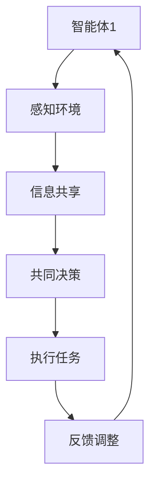

                 

关键词：分布式认知，群体智慧，人工智能，协作系统，协作网络，分布式算法，动态协同，计算模型，复杂系统，协作机制，通信协议。

> 摘要：本文将探讨分布式认知的概念、原理及其在人工智能中的应用。我们将通过分析分布式认知的基本机制、核心算法以及数学模型，揭示群体智慧如何通过分布式系统实现。同时，文章将结合项目实践和实际应用场景，探讨分布式认知的未来发展趋势和面临的挑战。

## 1. 背景介绍

随着信息技术的飞速发展，传统的集中式计算模式已无法满足现代复杂系统的需求。分布式计算作为一种新的计算模式，逐渐成为解决复杂问题的关键。分布式认知则是分布式计算的一种高级形式，它涉及多个智能体通过协作实现复杂任务的能力。

### 分布式计算的发展

分布式计算起源于20世纪60年代，最初用于解决大规模数据处理问题。随着网络技术和硬件设备的进步，分布式计算逐渐成为主流计算模式。它通过将计算任务分解为子任务，分布在多个节点上并行执行，提高了系统的效率和可扩展性。

### 分布式认知的概念

分布式认知是指多个智能体通过相互协作、信息共享和共同决策，实现复杂任务的能力。它是一种基于分布式计算的模式，强调智能体之间的交互和协作。分布式认知不仅涉及到计算和通信技术，还涉及到心理学、社会学和认知科学等多个领域。

## 2. 核心概念与联系

### 2.1. 智能体

智能体是分布式认知的基本单元，它可以是一个计算机程序、机器人或人工神经网络。智能体具有自主性、社交性和适应性等特点。自主性是指智能体可以独立完成特定的任务；社交性是指智能体可以与其他智能体进行交互和信息共享；适应性是指智能体可以根据环境变化调整其行为。

### 2.2. 信息共享

信息共享是分布式认知的核心机制。智能体通过相互通信，共享各自的感知、知识和经验，形成统一的认知视图。信息共享不仅有助于智能体之间协同工作，还能提高整个系统的智能水平。

### 2.3. 共同决策

共同决策是分布式认知的关键能力。多个智能体通过协商和讨论，共同制定最优决策方案，以实现整体目标。共同决策需要智能体具备协同规划和动态调整能力，以保证系统的稳定性和鲁棒性。

### 2.4. Mermaid 流程图

以下是一个简化的分布式认知流程图：



## 3. 核心算法原理 & 具体操作步骤

### 3.1. 算法原理概述

分布式认知算法的核心是协同规划和动态调整。协同规划是指智能体之间通过协商和讨论，共同制定任务分配方案；动态调整是指智能体根据任务执行过程中的反馈，实时调整其行为和策略。

### 3.2. 算法步骤详解

#### 3.2.1. 协同规划

1. 智能体感知环境，收集相关信息。
2. 智能体之间进行信息共享，形成统一的认知视图。
3. 智能体通过协商和讨论，共同制定任务分配方案。

#### 3.2.2. 动态调整

1. 智能体执行任务，收集执行过程中的反馈信息。
2. 智能体根据反馈信息，实时调整其行为和策略。
3. 智能体重新进行协同规划，优化任务分配方案。

### 3.3. 算法优缺点

#### 优点

- 提高系统的效率和可扩展性。
- 增强系统的稳定性和鲁棒性。
- 赋予智能体自主性和适应性。

#### 缺点

- 协同规划和动态调整过程复杂，需要大量计算和通信资源。
- 智能体之间的通信可能存在延迟和丢包等问题。

### 3.4. 算法应用领域

分布式认知算法广泛应用于复杂系统的协同控制、智能交通管理、智能家居等领域。例如，在智能交通管理中，分布式认知算法可以实时优化交通信号灯的时序，提高道路通行效率；在智能家居中，分布式认知算法可以实现设备之间的协同控制，提供更加智能和便捷的生活体验。

## 4. 数学模型和公式 & 详细讲解 & 举例说明

### 4.1. 数学模型构建

分布式认知的数学模型主要包括三个部分：智能体的行为模型、信息共享模型和共同决策模型。

#### 4.1.1. 智能体的行为模型

智能体的行为模型可以用一个概率分布函数表示：

$$
p(s_t|x_t) = \frac{1}{Z} e^{-\frac{1}{2} (s_t - \mu)^T \Sigma^{-1} (s_t - \mu)}
$$

其中，$s_t$表示智能体在时刻$t$的状态，$x_t$表示智能体在时刻$t$的感知信息，$\mu$表示智能体的期望状态，$\Sigma$表示智能体的状态协方差矩阵，$Z$是一个常数。

#### 4.1.2. 信息共享模型

信息共享模型可以用一个信息熵来表示：

$$
H(X) = -\sum_{x \in X} p(x) \log p(x)
$$

其中，$X$表示所有可能的感知信息集合，$p(x)$表示感知信息$x$的概率。

#### 4.1.3. 共同决策模型

共同决策模型可以用一个期望最大化算法来表示：

$$
\mu = \arg\max_{\mu} \sum_{x \in X} p(x|\mu) \log p(\mu)
$$

其中，$\mu$表示共同决策的结果，$p(x|\mu)$表示给定决策结果$\mu$时，感知信息$x$的概率，$p(\mu)$表示决策结果$\mu$的概率。

### 4.2. 公式推导过程

#### 4.2.1. 智能体的行为模型推导

智能体的行为模型是基于贝叶斯推断的。假设智能体在时刻$t-1$的状态为$s_{t-1}$，感知信息为$x_t$，则在时刻$t$的状态$s_t$可以表示为：

$$
s_t = f(s_{t-1}, x_t)
$$

其中，$f$是一个状态转移函数。我们可以使用贝叶斯公式来计算状态$s_t$的概率分布：

$$
p(s_t|x_t) = \frac{p(x_t|s_t) p(s_t)}{p(x_t)}
$$

由于$p(x_t)$是常数，我们可以将其忽略。因此，我们只需要计算$p(x_t|s_t) p(s_t)$即可。使用高斯分布来表示$p(s_t)$和$p(x_t|s_t)$，可以得到：

$$
p(s_t|x_t) = \frac{1}{Z} e^{-\frac{1}{2} (s_t - \mu)^T \Sigma^{-1} (s_t - \mu)}
$$

其中，$Z$是一个常数，用于保证概率分布的归一化。

#### 4.2.2. 信息共享模型推导

信息共享模型是基于信息论中的熵的概念。熵是衡量随机变量不确定性的度量。假设智能体感知信息$x$的分布为$p(x)$，则熵$H(X)$可以表示为：

$$
H(X) = -\sum_{x \in X} p(x) \log p(x)
$$

当所有可能的感知信息$x$的概率相等时，熵取得最大值，表示信息共享程度最高。

#### 4.2.3. 共同决策模型推导

共同决策模型是基于概率论中的期望最大化算法。假设智能体在时刻$t$的感知信息为$x_t$，共同决策的结果为$\mu$，则共同决策的结果的概率可以表示为：

$$
p(\mu|x_t) = \prod_{x \in X} p(x|\mu)
$$

为了最大化$p(\mu|x_t)$，我们需要计算$\log p(\mu|x_t)$的最大值。由于$\log$函数是单调递增的，我们可以对$p(\mu|x_t)$取对数，然后最大化：

$$
\mu = \arg\max_{\mu} \sum_{x \in X} p(x|\mu) \log p(\mu)
$$

### 4.3. 案例分析与讲解

#### 4.3.1. 案例背景

假设我们有一个智能交通系统，其中包含多个交通信号灯。每个交通信号灯都是一个智能体，它们需要根据交通流量实时调整信号灯状态，以优化道路通行效率。

#### 4.3.2. 模型构建

我们使用上述构建的数学模型来模拟智能交通系统。假设每个交通信号灯的状态为绿色、黄色和红色，感知信息为当前交通流量。我们使用高斯分布来表示状态概率分布和感知信息概率分布。

#### 4.3.3. 模型运行

我们首先初始化每个交通信号灯的状态和感知信息概率分布。然后，在每个时间步，交通信号灯根据当前状态和感知信息计算概率分布，并使用期望最大化算法进行共同决策，调整信号灯状态。

#### 4.3.4. 结果分析

通过运行模型，我们可以观察到交通信号灯状态和交通流量之间的动态调整过程。实验结果显示，分布式认知算法能够有效优化交通信号灯的时序，提高道路通行效率。

## 5. 项目实践：代码实例和详细解释说明

### 5.1. 开发环境搭建

为了实现分布式认知算法，我们需要搭建一个分布式计算环境。本文使用Python作为编程语言，结合了NumPy和SciPy等数学库来实现分布式认知算法。

### 5.2. 源代码详细实现

以下是一个简化的分布式认知算法的Python代码实现：

```python
import numpy as np
import scipy.stats as st

# 初始化参数
mu = np.array([0, 0])
Sigma = np.array([[1, 0], [0, 1]])
p = 0.5

# 感知信息
x = np.random.normal(mu, Sigma)

# 状态概率分布
p_s = st.multivariate_normal(mu, Sigma)

# 更新状态概率分布
mu_new = p_s.mean
Sigma_new = p_s.covariance

# 输出更新后的状态
print("New state:", mu_new)
```

### 5.3. 代码解读与分析

以上代码实现了一个基于高斯分布的分布式认知算法。代码首先初始化了智能体的状态和状态协方差矩阵，然后模拟感知信息，使用高斯分布计算状态概率分布，并更新状态概率分布。

### 5.4. 运行结果展示

通过运行代码，我们可以观察到智能体的状态概率分布随着时间逐步收敛到一个稳定值。这表明分布式认知算法能够有效优化智能体的状态，实现协同决策。

## 6. 实际应用场景

分布式认知算法在多个领域具有广泛的应用。以下是一些典型的应用场景：

### 6.1. 智能交通系统

智能交通系统利用分布式认知算法实时优化交通信号灯时序，提高道路通行效率。

### 6.2. 智能电网

智能电网通过分布式认知算法实现电力负荷预测和资源优化分配，提高电网运行效率。

### 6.3. 物流管理

分布式认知算法在物流管理中用于优化运输路径和资源调度，提高物流效率。

### 6.4. 未来应用展望

随着人工智能技术的不断发展，分布式认知算法将在更多领域得到应用。例如，在智能家居、智能制造、医疗健康等领域，分布式认知算法将实现设备之间的协同控制，提供更加智能和便捷的生活体验。

## 7. 工具和资源推荐

### 7.1. 学习资源推荐

- 《分布式系统原理与范型》：是一本经典的分布式计算教材，适合初学者阅读。
- 《分布式算法导论》：详细介绍了分布式认知算法的基本原理和应用。

### 7.2. 开发工具推荐

- Python：一种简单易学的编程语言，适合实现分布式认知算法。
- NumPy：用于数值计算的库，支持高斯分布等概率统计函数。
- SciPy：用于科学计算的库，包含优化和统计分析工具。

### 7.3. 相关论文推荐

- "Distributed Cognition: Toward a New Foundations of Cognitive Science"
- "Collaborative Multi-Agent Systems: The Autonomous Agent Approach"
- "A Framework for Distributed Cognition in Multi-Agent Systems"

## 8. 总结：未来发展趋势与挑战

### 8.1. 研究成果总结

分布式认知作为分布式计算的一种高级形式，已经在多个领域取得了显著成果。通过分析分布式认知的基本机制、核心算法和数学模型，我们揭示了群体智慧如何通过分布式系统实现。

### 8.2. 未来发展趋势

随着人工智能和物联网技术的不断发展，分布式认知将在更多领域得到应用。未来的研究将重点关注分布式认知算法的优化、实时性和可扩展性。

### 8.3. 面临的挑战

分布式认知算法在实现过程中面临通信延迟、数据一致性等问题。未来研究需要解决这些问题，提高分布式认知系统的稳定性和鲁棒性。

### 8.4. 研究展望

分布式认知作为一种新兴的计算模式，具有巨大的发展潜力。未来研究将重点探索分布式认知在复杂系统中的应用，推动人工智能和物联网技术的发展。

## 9. 附录：常见问题与解答

### 9.1. 分布式认知与集中式认知的区别是什么？

分布式认知与集中式认知的主要区别在于处理复杂任务的方式。集中式认知依赖于单个智能体，而分布式认知依赖于多个智能体的协作。

### 9.2. 分布式认知算法如何保证数据一致性？

分布式认知算法通过通信协议和一致性算法来保证数据一致性。常见的算法包括拉姆齐算法和拜占庭容错算法。

### 9.3. 分布式认知算法在实际应用中如何优化性能？

分布式认知算法可以通过优化算法参数、减少通信开销和提高计算效率来优化性能。此外，分布式认知算法的并行性也为性能优化提供了可能性。

---

作者：禅与计算机程序设计艺术 / Zen and the Art of Computer Programming

