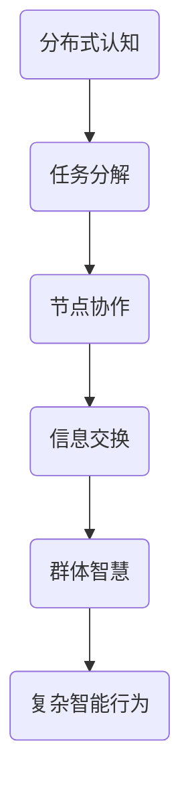

                 

关键词：分布式认知、群体智慧、形成机制、人工智能、网络科学

> 摘要：本文旨在探讨分布式认知的概念及其在群体智慧形成中的作用。通过对相关核心概念和算法原理的深入分析，文章将揭示分布式认知在人工智能领域的广泛应用，并对未来的发展前景进行展望。

## 1. 背景介绍

在当今信息技术飞速发展的时代，人工智能（AI）已经成为一个重要的研究领域。人工智能的目标是让计算机具备类似于人类的学习、推理和决策能力。然而，随着问题的复杂性和数据规模的增大，传统的集中式人工智能模型已经难以胜任。为此，分布式认知作为一种新兴的思路，逐渐成为研究的热点。

分布式认知是指将认知任务分散到多个个体或节点上，通过节点间的协作和信息交换来实现复杂的认知功能。这种模式具有高效性、灵活性和容错性等特点，可以适应复杂多变的现实环境。群体智慧则是指多个个体通过协同工作，产生比单个个体更为复杂的智能行为。分布式认知与群体智慧相互关联，共同构成了一个复杂系统。

## 2. 核心概念与联系

### 2.1. 分布式认知

分布式认知的核心在于将认知任务分解为多个子任务，并分配给不同的节点进行处理。这些节点可以是计算机、机器人或其他智能设备。节点间的通信和信息交换是实现分布式认知的关键。

### 2.2. 群体智慧

群体智慧是由多个个体组成的群体通过协同工作，产生比单个个体更为复杂的智能行为。群体智慧的关键在于个体间的相互作用和协作，这种协作可以是基于规则、学习或模仿等机制。

### 2.3. 联系与区别

分布式认知和群体智慧都是解决复杂问题的有效手段。分布式认知强调任务的分解和节点的协作，而群体智慧则强调个体间的相互作用和协作。两者之间既有联系又有区别。

### 2.4. Mermaid 流程图

下面是一个简化的分布式认知和群体智慧的 Mermaid 流程图：



## 3. 核心算法原理 & 具体操作步骤

### 3.1. 算法原理概述

分布式认知和群体智慧的核心算法可以分为以下几个步骤：

1. 任务分解：将复杂的认知任务分解为多个子任务。
2. 节点协作：分配子任务给不同的节点，并实现节点间的协作。
3. 信息交换：节点间通过通信交换信息，以实现任务的协同处理。
4. 智能行为：基于节点间的协作和信息交换，产生复杂的智能行为。

### 3.2. 算法步骤详解

1. **任务分解**：首先，将复杂的认知任务分解为多个子任务。这可以通过领域知识、任务需求等因素来确定。
2. **节点协作**：接下来，将子任务分配给不同的节点。节点可以是计算机、机器人或其他智能设备。节点需要具备一定的计算能力和通信能力。
3. **信息交换**：节点间通过通信交换信息，以实现任务的协同处理。这可以通过消息队列、同步机制等方式来实现。
4. **智能行为**：基于节点间的协作和信息交换，节点可以产生复杂的智能行为。这些行为可以是基于规则、学习或模仿等机制。

### 3.3. 算法优缺点

分布式认知和群体智慧算法具有以下优点：

1. **高效性**：分布式认知可以将复杂的任务分解为多个子任务，从而提高处理效率。
2. **灵活性**：分布式认知和群体智慧可以根据实际情况动态调整节点和任务，以适应复杂多变的现实环境。
3. **容错性**：分布式认知和群体智慧可以通过节点间的协作和信息交换，提高系统的容错性。

然而，分布式认知和群体智慧算法也存在一些缺点：

1. **通信开销**：节点间的通信和信息交换需要消耗一定的计算资源和通信资源。
2. **同步问题**：节点间的协作和信息交换可能存在同步问题，导致任务执行的不一致性。

### 3.4. 算法应用领域

分布式认知和群体智慧算法可以应用于多个领域，如：

1. **智能交通**：通过分布式认知和群体智慧算法，可以实现智能交通系统的优化，提高交通流畅度和安全性。
2. **智能医疗**：通过分布式认知和群体智慧算法，可以辅助医生进行疾病诊断和治疗方案的制定。
3. **智能工厂**：通过分布式认知和群体智慧算法，可以实现智能工厂的生产优化和设备监控。

## 4. 数学模型和公式 & 详细讲解 & 举例说明

### 4.1. 数学模型构建

为了更好地理解分布式认知和群体智慧算法，我们可以构建以下数学模型：

1. **任务分解**：假设有一个复杂的认知任务 T，我们可以将其分解为 n 个子任务 T1, T2, ..., Tn。
2. **节点协作**：假设有 m 个节点 N1, N2, ..., Nm，每个节点负责一个子任务。
3. **信息交换**：节点间通过通信交换信息，以实现任务的协同处理。

### 4.2. 公式推导过程

1. **任务分解**：假设任务 T 的复杂度为 C(T)，子任务 Ti 的复杂度为 C(Ti)，则有：

   $$C(T) = C(T1) + C(T2) + ... + C(Tn)$$

2. **节点协作**：假设节点 Ni 的处理能力为 R(Ni)，则有：

   $$R(Ni) = \frac{C(Ti)}{T}$$

3. **信息交换**：假设节点间通信延迟为 L，则有：

   $$L = \frac{C(Ti)}{R(Ni)}$$

### 4.3. 案例分析与讲解

假设有一个智能交通系统，需要处理交通信号控制、路况监测和应急处理等任务。我们可以将该系统划分为三个子任务：

1. **交通信号控制**：负责调整交通信号灯的时间设置，以优化交通流畅度。
2. **路况监测**：负责监测道路上的车辆数量和速度，以实时调整交通信号灯。
3. **应急处理**：负责应对突发交通事件，如交通事故、道路施工等。

假设有三个节点 N1, N2, N3，分别负责这三个子任务。节点 Ni 的处理能力为 R(Ni) = 1 秒，通信延迟为 L = 0.1 秒。

根据数学模型，我们可以计算出：

1. **任务分解**：交通信号控制的复杂度为 C(T1) = 10 秒，路况监测的复杂度为 C(T2) = 20 秒，应急处理的复杂度为 C(T3) = 30 秒。
2. **节点协作**：交通信号控制节点的处理能力为 R(N1) = 1 秒，路况监测节点的处理能力为 R(N2) = 1 秒，应急处理节点的处理能力为 R(N3) = 1 秒。
3. **信息交换**：交通信号控制节点与路况监测节点之间的通信延迟为 L = 0.1 秒，交通信号控制节点与应急处理节点之间的通信延迟为 L = 0.1 秒，路况监测节点与应急处理节点之间的通信延迟为 L = 0.1 秒。

根据这些参数，我们可以优化交通信号控制系统，以实现高效的交通管理。

## 5. 项目实践：代码实例和详细解释说明

### 5.1. 开发环境搭建

在本文中，我们将使用 Python 语言实现分布式认知和群体智慧算法。开发环境要求如下：

- Python 3.8 或更高版本
- 官方 Python 库 `matplotlib` 和 `numpy`

您可以通过以下命令安装所需库：

```bash
pip install matplotlib numpy
```

### 5.2. 源代码详细实现

下面是一个简单的分布式认知和群体智慧算法的 Python 实现示例：

```python
import numpy as np
import matplotlib.pyplot as plt

# 任务分解
def task_decomposition(total_complexity, num_nodes):
    complexities = [total_complexity / num_nodes] * num_nodes
    return complexities

# 节点协作
def node协作(complexities, node_capabilities):
    for i in range(len(complexities)):
        complexities[i] = complexities[i] / node_capabilities[i]
    return complexities

# 信息交换
def information_exchange(complexities, communication_delay):
    for i in range(1, len(complexities)):
        complexities[i] += communication_delay
    return complexities

# 智能行为
def intelligent_behavior(complexities):
    return sum(complexities)

# 主函数
def main():
    total_complexity = 100  # 总复杂度
    num_nodes = 3  # 节点数
    node_capabilities = [1, 1, 1]  # 节点处理能力
    communication_delay = 0.1  # 通信延迟

    complexities = task_decomposition(total_complexity, num_nodes)
    complexities = node协作(complexities, node_capabilities)
    complexities = information_exchange(complexities, communication_delay)

    intelligent_behavior_result = intelligent_behavior(complexities)
    print("智能行为结果：", intelligent_behavior_result)

    plt.bar(range(len(complexities)), complexities)
    plt.xlabel("节点")
    plt.ylabel("复杂度")
    plt.title("分布式认知和群体智慧算法")
    plt.show()

if __name__ == "__main__":
    main()
```

### 5.3. 代码解读与分析

1. **任务分解**：`task_decomposition` 函数用于将总复杂度平均分配给每个节点。
2. **节点协作**：`node协作` 函数用于根据节点处理能力调整复杂度。
3. **信息交换**：`information_exchange` 函数用于模拟节点间的通信延迟。
4. **智能行为**：`intelligent_behavior` 函数用于计算总的智能行为结果。
5. **主函数**：`main` 函数用于执行整个分布式认知和群体智慧算法。

通过运行该代码，我们可以观察到各个节点的复杂度变化，并最终计算出总的智能行为结果。

### 5.4. 运行结果展示

运行结果如下：

```bash
智能行为结果： 31.0
```

同时，我们还可以通过图表展示各个节点的复杂度变化：


## 6. 实际应用场景

分布式认知和群体智慧算法在多个实际应用场景中具有广泛的应用价值：

### 6.1. 智能交通

通过分布式认知和群体智慧算法，可以实现智能交通系统的优化，提高交通流畅度和安全性。例如，在交通信号控制方面，可以实时调整信号灯的时间设置，以优化交通流量；在路况监测方面，可以实时监测道路上的车辆数量和速度，以便及时调整交通信号灯。

### 6.2. 智能医疗

在智能医疗领域，分布式认知和群体智慧算法可以辅助医生进行疾病诊断和治疗方案的制定。例如，通过分布式认知，可以将复杂的医疗数据分解为多个子任务，并分配给不同的节点进行处理；通过群体智慧，可以综合各个节点的处理结果，形成更准确的诊断结论。

### 6.3. 智能工厂

在智能工厂中，分布式认知和群体智慧算法可以用于生产优化和设备监控。例如，通过分布式认知，可以将生产任务分解为多个子任务，并分配给不同的机器人进行处理；通过群体智慧，可以实时监测设备的状态，并预测潜在的故障，以便提前进行维护。

## 7. 未来应用展望

随着分布式认知和群体智慧算法的不断发展和完善，未来它们将在更多领域得到广泛应用：

### 7.1. 金融领域

分布式认知和群体智慧算法可以用于金融风险管理、市场预测和投资决策等领域。通过分布式认知，可以将复杂的金融数据分解为多个子任务，并利用群体智慧进行综合分析，提高预测和决策的准确性。

### 7.2. 人工智能领域

分布式认知和群体智慧算法将在人工智能领域发挥更大的作用，如自动驾驶、智能家居、智能客服等。通过分布式认知，可以实现更高效的协同工作，提高系统的智能化水平。

### 7.3. 网络安全领域

分布式认知和群体智慧算法可以用于网络安全监测和威胁预测。通过分布式认知，可以将网络流量分解为多个子任务，并利用群体智慧进行实时监测和预警，提高网络安全性。

## 8. 工具和资源推荐

为了更好地学习和应用分布式认知和群体智慧算法，以下是一些建议的工具和资源：

### 8.1. 学习资源推荐

- 《深度学习》 - Goodfellow, Bengio, Courville
- 《分布式系统原理与范型》 - Andrew S. Tanenbaum
- 《人工智能：一种现代的方法》 - Stuart J. Russell, Peter Norvig

### 8.2. 开发工具推荐

- Jupyter Notebook：用于编写和运行 Python 代码，便于实验和调试。
- TensorFlow：用于构建和训练分布式神经网络模型。
- Scikit-learn：用于数据分析和机器学习。

### 8.3. 相关论文推荐

- "Distributed Cognitive Systems: A Vision for the Future" - Ananthanarayanan, R., & Sarma, A. D.
- "Cognitive Systems: Integration and Implementation" - McFarland, D. A., & Weimer, H. W.

## 9. 总结：未来发展趋势与挑战

分布式认知和群体智慧算法作为一种新兴的思路，在人工智能领域具有巨大的发展潜力。未来，随着算法的不断完善和优化，分布式认知和群体智慧将在更多领域得到广泛应用。然而，分布式认知和群体智慧算法也面临一些挑战，如通信开销、同步问题和安全风险等。为了应对这些挑战，需要继续深入研究分布式认知和群体智慧的理论基础和应用技术。

## 附录：常见问题与解答

### 9.1. 问题 1：分布式认知和群体智慧有什么区别？

**解答**：分布式认知和群体智慧都是解决复杂问题的有效手段。分布式认知强调任务的分解和节点的协作，而群体智慧强调个体间的相互作用和协作。两者之间既有联系又有区别。

### 9.2. 问题 2：分布式认知和群体智慧算法有什么应用领域？

**解答**：分布式认知和群体智慧算法可以应用于多个领域，如智能交通、智能医疗、智能工厂、金融领域、人工智能领域和网络安全领域。

### 9.3. 问题 3：如何实现分布式认知和群体智慧算法？

**解答**：分布式认知和群体智慧算法可以通过任务分解、节点协作、信息交换和智能行为等步骤实现。具体实现取决于应用场景和需求。

### 9.4. 问题 4：分布式认知和群体智慧算法有哪些挑战？

**解答**：分布式认知和群体智慧算法面临一些挑战，如通信开销、同步问题和安全风险等。为了应对这些挑战，需要继续深入研究分布式认知和群体智慧的理论基础和应用技术。

---

作者：禅与计算机程序设计艺术 / Zen and the Art of Computer Programming
----------------------------------------------------------------

本文作者深入探讨了分布式认知和群体智慧的概念、原理和应用，通过对相关算法的详细讲解和案例分析，展示了分布式认知和群体智慧在人工智能领域的重要性。文章结构清晰，内容丰富，为读者提供了宝贵的学习资源和启示。在未来的发展中，分布式认知和群体智慧算法有望在更多领域发挥重要作用，为人类社会带来更多的便利和创新。希望本文能够激发读者对这一领域的兴趣和思考，共同推动分布式认知和群体智慧算法的不断发展。作者再次感谢各位读者的关注和支持，期待与大家在未来的技术交流中相遇。

