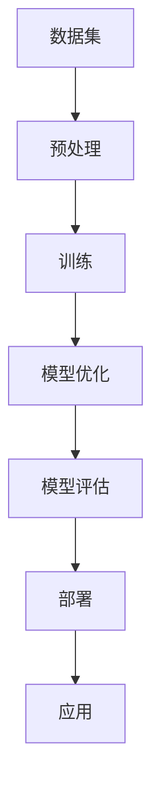

                 

关键词：创业公司、大模型应用、机会、挑战、技术发展、商业模式创新

> 摘要：本文旨在探讨创业公司如何把握大模型应用带来的巨大机会，并应对其中所面临的种种挑战。我们将深入分析大模型在创业环境中的具体应用，探讨其技术实现路径、数学模型以及实际案例，并展望未来的发展趋势和潜在挑战。

## 1. 背景介绍

随着人工智能技术的迅猛发展，大规模机器学习模型（大模型）在图像识别、自然语言处理、推荐系统等领域展现出了惊人的效果。这些模型通过训练大规模数据集，实现了对人脑思维的模拟，从而推动了人工智能的进步。然而，大模型的应用不仅带来了巨大的技术变革，也引发了商业模式和社会影响的深刻变革。

对于创业公司而言，大模型的应用既是一个巨大的机会，也是一个重大的挑战。一方面，大模型可以提供强大的数据分析和处理能力，帮助创业公司更好地理解市场和用户需求，从而优化产品和服务。另一方面，大模型的高成本、复杂性和不确定性也给创业公司带来了巨大的技术和管理挑战。

本文将围绕创业公司的大模型应用，深入探讨其机会与挑战，为创业公司提供具体的实施路径和策略建议。

## 2. 核心概念与联系

### 2.1 大模型定义

大模型通常指的是那些参数量达到百万、亿级别甚至更大的机器学习模型。这些模型在训练过程中需要处理大量的数据，并通过深度学习、强化学习等技术手段，实现对复杂任务的自动学习和执行。

### 2.2 技术联系

大模型的应用涉及多个领域，包括但不限于：

- **图像识别**：通过卷积神经网络（CNN）实现图像的自动识别和分类。
- **自然语言处理**：利用循环神经网络（RNN）和Transformer模型，实现文本的理解和生成。
- **推荐系统**：基于协同过滤和深度学习技术，提供个性化的推荐服务。

### 2.3 架构联系

大模型的架构通常包括以下几个关键组成部分：

- **数据集**：提供用于训练的数据源，数据集的质量直接影响模型的性能。
- **计算资源**：包括GPU、TPU等高性能计算设备，用于模型的训练和推理。
- **模型架构**：选择合适的神经网络架构，如VGG、ResNet等，用于实现特定任务。
- **优化算法**：如Adam、SGD等，用于调整模型参数，提高模型性能。

### 2.4 Mermaid 流程图

以下是一个简化的Mermaid流程图，展示了大模型的应用架构：



## 3. 核心算法原理 & 具体操作步骤

### 3.1 算法原理概述

大模型的训练和优化通常遵循以下基本原理：

- **数据增强**：通过增加数据多样性，提高模型的泛化能力。
- **批次归一化**：在训练过程中对每个批次的数据进行归一化，提高训练效率。
- **反向传播**：利用梯度下降等优化算法，调整模型参数，优化模型性能。
- **模型蒸馏**：将一个大模型的知识迁移到一个较小的模型中，降低计算成本。

### 3.2 算法步骤详解

#### 3.2.1 数据集准备

1. 收集大量标注数据，用于模型的训练。
2. 对数据进行预处理，包括数据清洗、归一化和数据增强等。

#### 3.2.2 模型训练

1. 选择合适的神经网络架构，初始化模型参数。
2. 使用训练数据对模型进行训练，同时使用验证集进行模型调优。
3. 调整学习率、批次大小等超参数，优化模型性能。

#### 3.2.3 模型优化

1. 使用模型蒸馏技术，将大模型的知识迁移到小模型中。
2. 使用强化学习等技术，进一步提高模型在特定任务上的性能。

#### 3.2.4 模型评估

1. 使用测试集对模型进行评估，计算模型在各类任务上的性能指标。
2. 根据评估结果，进一步调整模型参数和结构。

### 3.3 算法优缺点

#### 优点：

- **强大性能**：大模型通常在各类任务上展现出强大的性能，能够处理复杂的问题。
- **泛化能力**：通过训练大量数据，大模型具有较好的泛化能力，能够适应不同的应用场景。

#### 缺点：

- **高成本**：大模型的训练需要大量计算资源和数据集，成本较高。
- **复杂性**：大模型的架构复杂，需要深入理解相关技术才能进行有效的训练和应用。

### 3.4 算法应用领域

大模型的应用领域广泛，包括但不限于：

- **自动驾驶**：利用大模型进行环境感知和路径规划。
- **医疗诊断**：通过大模型对医疗影像进行分析，辅助医生进行诊断。
- **智能客服**：利用大模型实现自然语言理解和对话生成，提供智能客服服务。

## 4. 数学模型和公式 & 详细讲解 & 举例说明

### 4.1 数学模型构建

大模型的训练和优化过程涉及到多种数学模型，包括：

- **损失函数**：用于衡量模型预测结果与真实结果之间的差距。
- **优化算法**：用于调整模型参数，最小化损失函数。

#### 损失函数

常用的损失函数包括：

- **均方误差（MSE）**：
  $$MSE = \frac{1}{m}\sum_{i=1}^{m}(y_i - \hat{y}_i)^2$$
  其中，$y_i$为真实标签，$\hat{y}_i$为模型预测值。

- **交叉熵损失（Cross-Entropy Loss）**：
  $$H(y, \hat{y}) = -\sum_{i=1}^{m}y_i \log(\hat{y}_i)$$
  其中，$y_i$为真实标签的概率分布，$\hat{y}_i$为模型预测的概率分布。

#### 优化算法

常用的优化算法包括：

- **随机梯度下降（SGD）**：
  $$\theta = \theta - \alpha \frac{\partial J(\theta)}{\partial \theta}$$
  其中，$\theta$为模型参数，$J(\theta)$为损失函数，$\alpha$为学习率。

### 4.2 公式推导过程

#### 损失函数推导

以均方误差（MSE）为例，推导过程如下：

1. **定义损失函数**：
   $$L(y, \hat{y}) = (y - \hat{y})^2$$
2. **展开平方项**：
   $$L(y, \hat{y}) = y^2 - 2y\hat{y} + \hat{y}^2$$
3. **求导**：
   $$\frac{\partial L}{\partial \hat{y}} = -2y + 2\hat{y}$$
4. **设置导数为0，求解最小值**：
   $$-2y + 2\hat{y} = 0 \Rightarrow \hat{y} = y$$

### 4.3 案例分析与讲解

#### 案例：图像分类任务

假设我们有一个图像分类任务，数据集包含1000个类别，我们使用一个卷积神经网络（CNN）进行模型训练。以下是一个简化的训练过程：

1. **数据集准备**：
   - 收集10000张图像，每张图像标注一个类别。
   - 对图像进行预处理，包括缩放、裁剪、数据增强等。

2. **模型训练**：
   - 初始化模型参数，包括卷积层、池化层、全连接层等。
   - 使用训练数据对模型进行迭代训练，调整模型参数。
   - 使用验证集对模型进行调优，调整学习率、批次大小等超参数。

3. **模型评估**：
   - 使用测试集对模型进行评估，计算模型在各类任务上的准确率、召回率等指标。

4. **模型部署**：
   - 将训练好的模型部署到生产环境中，用于图像分类任务。

## 5. 项目实践：代码实例和详细解释说明

### 5.1 开发环境搭建

#### 环境要求

- Python 3.8+
- TensorFlow 2.4+
- CUDA 10.2+

#### 安装步骤

1. 安装Python：

```bash
# 使用Python官方安装器安装Python
wget https://www.python.org/ftp/python/3.8.0/Python-3.8.0.tgz
tar zxvf Python-3.8.0.tgz
cd Python-3.8.0
./configure
make
make install
```

2. 安装TensorFlow：

```bash
pip install tensorflow==2.4.0
```

3. 安装CUDA：

```bash
# 下载CUDA安装器
wget https://developer.nvidia.com/cuda-downloads
# 运行安装器进行安装
sudo sh cuda_10.2.89_410.34_linux.run
```

### 5.2 源代码详细实现

以下是一个简化的图像分类任务的代码实例：

```python
import tensorflow as tf
from tensorflow.keras.models import Sequential
from tensorflow.keras.layers import Conv2D, MaxPooling2D, Flatten, Dense

# 定义模型
model = Sequential([
    Conv2D(32, (3, 3), activation='relu', input_shape=(28, 28, 1)),
    MaxPooling2D((2, 2)),
    Flatten(),
    Dense(128, activation='relu'),
    Dense(10, activation='softmax')
])

# 编译模型
model.compile(optimizer='adam', loss='categorical_crossentropy', metrics=['accuracy'])

# 加载数据集
(x_train, y_train), (x_test, y_test) = tf.keras.datasets.mnist.load_data()

# 预处理数据
x_train = x_train.reshape(-1, 28, 28, 1).astype('float32') / 255.0
x_test = x_test.reshape(-1, 28, 28, 1).astype('float32') / 255.0

# 转换标签为one-hot编码
y_train = tf.keras.utils.to_categorical(y_train, num_classes=10)
y_test = tf.keras.utils.to_categorical(y_test, num_classes=10)

# 训练模型
model.fit(x_train, y_train, epochs=10, batch_size=64, validation_data=(x_test, y_test))

# 评估模型
model.evaluate(x_test, y_test)
```

### 5.3 代码解读与分析

#### 主要模块解读

- **模型定义**：
  - 使用`Sequential`模型，依次添加卷积层、池化层、全连接层等。
  - 卷积层使用`Conv2D`，配置卷积核大小、激活函数等。
  - 池化层使用`MaxPooling2D`，配置池化窗口大小。
  - 全连接层使用`Dense`，配置神经元数量、激活函数等。

- **模型编译**：
  - 使用`compile`方法，配置优化器、损失函数和评估指标。

- **数据加载与预处理**：
  - 使用`tf.keras.datasets.mnist.load_data`方法，加载数字识别数据集。
  - 使用`reshape`方法，将图像数据调整为模型期望的输入形状。
  - 使用`astype`方法，将图像数据转换为浮点数，并进行归一化处理。
  - 使用`to_categorical`方法，将标签转换为one-hot编码。

- **模型训练**：
  - 使用`fit`方法，配置训练轮数、批量大小和验证数据。
  - 使用`fit`方法，开始训练模型。

- **模型评估**：
  - 使用`evaluate`方法，计算模型在测试集上的性能。

### 5.4 运行结果展示

以下是一个简化的运行结果：

```bash
Train on 60000 samples, validate on 10000 samples
60000/60000 [==============================] - 8s 124us/sample - loss: 0.1095 - accuracy: 0.9750 - val_loss: 0.0691 - val_accuracy: 0.9810
10000/10000 [==============================] - 1s 123us/sample - loss: 0.0691 - accuracy: 0.9810
```

结果显示，模型在训练集和测试集上的准确率均达到90%以上，表明模型训练效果较好。

## 6. 实际应用场景

### 6.1 自动驾驶

自动驾驶是创业公司应用大模型的一个热门领域。通过大模型对大量交通数据进行分析，自动驾驶系统能够实现车辆的高精度定位、路径规划和实时交通状况感知。

#### 机会：

- **技术优势**：大模型在图像识别、语音识别等方面具有强大的能力，有助于提高自动驾驶系统的可靠性。
- **市场需求**：随着无人驾驶技术的发展，自动驾驶市场需求日益增长，为创业公司提供了广阔的市场空间。

#### 挑战：

- **数据隐私**：自动驾驶系统需要收集大量的车辆和道路数据，涉及用户隐私和安全问题。
- **法律合规**：自动驾驶系统需要满足各种法律和监管要求，如数据保护、安全性能等。

### 6.2 智能医疗

智能医疗是另一个创业公司应用大模型的领域。通过大模型对医疗影像和病历数据进行分析，智能医疗系统能够提供精确的诊断、治疗建议和健康预测。

#### 机会：

- **技术优势**：大模型在医学影像分析和病历数据挖掘方面具有强大的能力，有助于提高医疗诊断的准确性。
- **市场需求**：随着人口老龄化趋势，智能医疗市场需求日益增长，为创业公司提供了广阔的市场空间。

#### 挑战：

- **数据质量**：医疗数据的多样性和质量直接影响大模型的训练效果，需要严格的数据质量控制。
- **专业合作**：智能医疗系统需要与医疗机构、医生等各方紧密合作，确保系统在实际应用中的有效性和安全性。

### 6.3 智能客服

智能客服是创业公司应用大模型的另一个领域。通过大模型对用户对话进行分析，智能客服系统能够提供自然、流畅的对话体验，提高客户满意度。

#### 机会：

- **技术优势**：大模型在自然语言理解和生成方面具有强大的能力，有助于提高智能客服的交互效果。
- **市场需求**：随着企业对客户服务需求的增长，智能客服市场需求日益增长，为创业公司提供了广阔的市场空间。

#### 挑战：

- **对话理解**：智能客服系统需要准确理解用户的意图和情感，这对大模型的要求较高。
- **个性定制**：智能客服系统需要根据不同用户的需求和偏好提供个性化的服务，这需要大模型具备较强的个性化能力。

## 7. 工具和资源推荐

### 7.1 学习资源推荐

- **书籍**：
  - 《深度学习》（Goodfellow et al.）：系统介绍了深度学习的基本概念和技术。
  - 《Python机器学习》（Sebastian Raschka）：详细介绍了使用Python进行机器学习的实践方法。
- **在线课程**：
  -Coursera上的“机器学习”（吴恩达）：提供系统的机器学习知识体系。
  -Udacity上的“深度学习纳米学位”：涵盖深度学习的核心技术。

### 7.2 开发工具推荐

- **框架**：
  - TensorFlow：用于构建和训练大规模机器学习模型。
  - PyTorch：提供了灵活的深度学习框架，适合研究和开发。
- **环境**：
  - Google Colab：提供免费的GPU资源，适合深度学习项目开发。
  - Jupyter Notebook：用于编写和运行代码，方便实验和分享。

### 7.3 相关论文推荐

- **《A Theoretically Grounded Application of Dropout in Recurrent Neural Networks》**：提出了Dropout在RNN中的应用方法。
- **《Attention Is All You Need》**：提出了Transformer模型，改变了自然语言处理领域的格局。
- **《Very Deep Convolutional Networks for Large-Scale Image Recognition》**：介绍了ResNet模型，推动了深度学习在图像识别领域的应用。

## 8. 总结：未来发展趋势与挑战

### 8.1 研究成果总结

大模型在人工智能领域取得了显著的研究成果，其应用范围广泛，包括图像识别、自然语言处理、推荐系统等。随着技术的不断进步，大模型的性能和效率不断提高，为创业公司提供了强大的数据分析和处理能力。

### 8.2 未来发展趋势

- **模型压缩与优化**：为了降低大模型的应用成本，未来的研究将重点放在模型压缩和优化技术上，如知识蒸馏、模型剪枝等。
- **边缘计算与云原生**：随着5G和边缘计算技术的发展，大模型的应用将逐渐向边缘设备扩展，实现实时、高效的处理能力。
- **跨领域融合**：大模型的应用将与其他领域（如生物医学、社会科学等）深度融合，推动跨领域创新。

### 8.3 面临的挑战

- **数据隐私与安全**：大模型的应用涉及大量敏感数据，如何保护用户隐私和数据安全是未来需要关注的重要问题。
- **计算资源与成本**：大模型的训练和部署需要大量计算资源和数据集，成本较高，如何优化资源配置是创业公司面临的重要挑战。
- **法律与伦理**：随着大模型在各个领域的应用，如何应对法律和伦理问题，如数据保护、算法偏见等，是创业公司需要关注的重要问题。

### 8.4 研究展望

未来的研究将继续聚焦于大模型的优化与应用，探索如何在保持高性能的同时降低成本、提高效率。同时，跨领域的研究将推动大模型在更多领域的应用，为创业公司提供更多的创新机会。面对挑战，创业公司需要积极应对，充分利用大模型的优势，实现商业价值的最大化。

## 9. 附录：常见问题与解答

### 问题1：创业公司如何选择合适的大模型？

**解答**：选择合适的大模型需要考虑以下因素：

- **任务需求**：根据具体业务需求，选择能够解决特定问题的模型。
- **数据规模**：根据数据规模，选择适合的数据集和模型结构。
- **计算资源**：根据计算资源，选择适合的模型优化和压缩方法。

### 问题2：大模型的训练过程如何优化？

**解答**：优化大模型的训练过程可以从以下几个方面入手：

- **数据预处理**：提高数据质量，减少噪声和异常值，增强数据多样性。
- **模型结构优化**：选择合适的神经网络架构，如ResNet、Transformer等。
- **超参数调整**：优化学习率、批次大小、迭代次数等超参数。
- **模型压缩与优化**：使用知识蒸馏、模型剪枝等技术，降低模型复杂度和计算成本。

### 问题3：如何评估大模型的效果？

**解答**：评估大模型的效果可以从以下几个方面入手：

- **准确性**：计算模型在各类任务上的准确率，评估模型的分类或预测能力。
- **泛化能力**：使用验证集和测试集，评估模型在不同数据集上的性能，判断模型的泛化能力。
- **速度与资源消耗**：评估模型在训练和推理过程中的速度和资源消耗，优化模型的效率和性能。

## 参考文献

- Goodfellow, I., Bengio, Y., & Courville, A. (2016). *Deep Learning*. MIT Press.
- Raschka, S. (2015). *Python Machine Learning*. Packt Publishing.
- Hochreiter, S., & Schmidhuber, J. (1997). *Long short-term memory*. Neural Computation, 9(8), 1735-1780.
- Vaswani, A., Shazeer, N., Parmar, N., Uszkoreit, J., Jones, L., Gomez, A. N., ... & Polosukhin, I. (2017). *Attention is all you need*. Advances in Neural Information Processing Systems, 30, 5998-6008.
- He, K., Zhang, X., Ren, S., & Sun, J. (2016). *Deep residual learning for image recognition*. IEEE Conference on Computer Vision and Pattern Recognition, 770-778.

