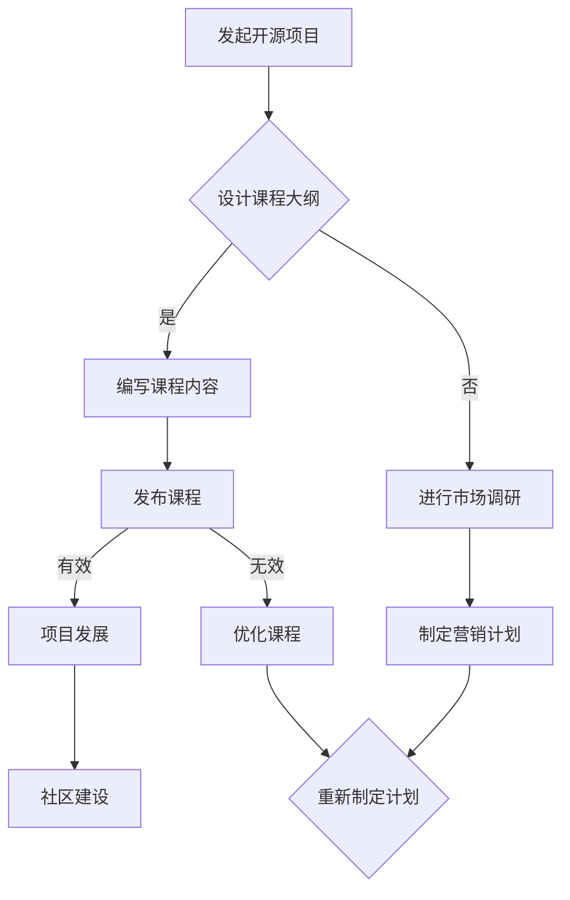

                 

关键词：开源项目、企业级培训、课程设计、营销策略、技术传播、知识共享

> 摘要：本文旨在探讨如何为企业开源项目设计一个高价值的培训课程，并提供一系列实用的营销策略，以最大化项目的传播和影响力。通过详细的课程结构和有效的营销手段，我们将揭示如何在技术领域成功推广和维持一个开源项目。

## 1. 背景介绍

在当今数字化时代，开源项目已成为技术发展的重要推动力量。开源软件不仅促进了创新和协作，也为企业和开发者提供了广泛的技术资源和解决方案。然而，许多优秀的开源项目在开始时充满激情和潜力，但随着时间的推移，往往因为缺乏持续的关注和维护而逐渐被遗忘。其中，一个关键因素就是缺乏有效的培训和营销策略。

企业级培训课程在这一过程中扮演了至关重要的角色。一方面，通过课程，企业可以系统地传授开源项目的核心知识和使用技巧，帮助技术人员提升技能，更好地利用开源技术。另一方面，有效的营销策略则能帮助企业将课程推广至更广泛的受众，从而提高项目的知名度和影响力。

本文将围绕如何设计一个高质量的企业级培训课程，并运用一系列营销手段来推广项目，展开深入探讨。通过本文的阅读，读者将获得以下方面的见解：

1. 开源项目培训课程设计的关键要素。
2. 适用于开源项目营销的各种策略。
3. 如何评估和优化课程的市场效果。
4. 开源项目培训课程的发展趋势和未来挑战。

## 2. 核心概念与联系

### 2.1. 开源项目的定义

开源项目（Open Source Project）是指遵循开源协议（如GPL、Apache License等）的软件开发项目，允许用户自由地查看、使用、修改和分发源代码。这种模式促进了社区协作和知识共享，使得项目能够快速迭代和改进。

### 2.2. 企业级培训课程的目标

企业级培训课程旨在为企业内部或外部用户提供一个系统化、专业化的学习路径。其主要目标包括：

- **知识传授**：将开源项目的核心知识和应用技巧传授给用户。
- **技能提升**：通过实际操作和案例分析，帮助用户掌握开源技术。
- **社区建设**：促进学员之间的交流，形成有活力的开源社区。

### 2.3. 培训课程与开源项目的相互关系

培训课程与开源项目之间存在着紧密的互动关系。一方面，课程作为知识传播的载体，可以将开源项目的价值传递给更广泛的受众。另一方面，通过课程，项目能够吸引更多的开发者参与，推动项目的发展。

### 2.4. Mermaid 流程图



通过这个流程图，我们可以清晰地看到从发起开源项目到培训课程设计、发布及营销，再到项目发展的整体过程。

## 3. 核心算法原理 & 具体操作步骤

### 3.1. 算法原理概述

在设计和营销开源项目培训课程时，我们可以将这个过程看作是一个复杂的算法。该算法的核心原理是：

1. **需求分析**：理解目标受众的需求，确定课程内容的核心要点。
2. **课程设计**：结合开源项目的特性，设计一个结构合理、内容丰富的课程体系。
3. **内容开发**：将设计好的课程大纲转化为实际的教学内容。
4. **营销策略**：制定并执行一系列营销活动，提高课程的市场曝光率。
5. **持续优化**：根据市场反馈和课程效果，不断调整和优化课程内容。

### 3.2. 算法步骤详解

#### 步骤1：需求分析

在开始课程设计之前，我们需要对目标受众进行详细的调研，包括他们的技术背景、学习需求、职业目标等。这可以通过问卷调查、用户访谈等方式进行。通过需求分析，我们可以明确课程的核心内容和目标。

#### 步骤2：课程设计

基于需求分析的结果，设计课程大纲。课程大纲应包括：

- **课程目标**：明确课程旨在让学员掌握哪些技能和知识。
- **课程结构**：合理划分课程模块，确保内容有序且层次分明。
- **教学方式**：结合线上和线下教学，提供多样化的学习体验。
- **案例和实践**：通过实际案例和实践，加深学员对课程内容的理解。

#### 步骤3：内容开发

根据课程大纲，开发具体的教学内容。这包括编写教材、准备课件、录制教学视频等。内容开发需要注重实用性和可操作性，确保学员能够学以致用。

#### 步骤4：营销策略

在课程发布前，制定并执行一系列营销策略，包括：

- **社交媒体推广**：利用微博、知乎、微信公众号等平台，发布课程相关信息，吸引潜在学员的关注。
- **内容营销**：撰写技术博客、发布教程和案例分析，提高课程的权威性和吸引力。
- **合作推广**：与相关企业和机构合作，共同推广课程，扩大影响力。
- **活动策划**：举办线上或线下的技术沙龙、研讨会等活动，增加课程曝光度。

#### 步骤5：持续优化

课程发布后，我们需要收集学员的反馈，并根据反馈不断调整和优化课程内容。同时，通过数据分析，评估营销策略的效果，进一步改进推广方式。

### 3.3. 算法优缺点

#### 优点：

- **系统化**：通过明确的算法步骤，确保课程设计、开发和营销的有序进行。
- **灵活性**：根据市场和学员反馈，灵活调整课程内容和营销策略。
- **高效性**：优化资源利用，提高课程质量和市场推广效果。

#### 缺点：

- **依赖数据**：算法的执行效果高度依赖于市场数据和学员反馈，需要持续投入时间和精力进行数据收集和分析。
- **复杂性**：涉及多个环节和步骤，需要协调不同部门和团队的合作。

### 3.4. 算法应用领域

该算法可以广泛应用于各种开源项目培训课程的设计和营销，包括但不限于：

- **软件开发**：为程序员和开发人员提供开源软件的培训。
- **数据科学**：为数据科学家和分析师提供开源数据工具和库的培训。
- **人工智能**：为人工智能开发者和研究人员提供开源人工智能框架的培训。

## 4. 数学模型和公式 & 详细讲解 & 举例说明

### 4.1. 数学模型构建

在课程设计和营销过程中，我们可以引入一些数学模型来指导我们的决策。以下是一个简单的数学模型，用于评估课程的市场效果。

#### 模型假设：

- **学员数量**：N，表示课程的目标受众规模。
- **课程关注度**：A，表示学员对课程的兴趣程度。
- **课程满意度**：S，表示学员对课程的评价满意度。
- **课程转化率**：R，表示学员转化为实际学员的比率。

#### 数学模型：

$$
市场效果 = A \times S \times R
$$

### 4.2. 公式推导过程

公式的推导基于以下逻辑：

1. **学员数量（N）**：这是课程市场的基数，决定了潜在的市场规模。
2. **课程关注度（A）**：表示学员对课程的兴趣程度，通常与课程内容的新颖性、实用性以及推广力度有关。
3. **课程满意度（S）**：表示学员对课程的整体评价，反映了课程的质量和教学效果。
4. **课程转化率（R）**：表示潜在学员转化为实际学员的比率，这是营销策略的重要指标。

通过这些因素的乘积，我们可以得到市场效果。其中，任何一方的提升都会对整体市场效果产生积极影响。

### 4.3. 案例分析与讲解

#### 案例背景：

假设我们设计了一门关于Python数据科学的开源培训课程，目标受众为数据科学领域的从业者。

#### 数据收集：

- 学员数量（N）：1000人
- 课程关注度（A）：0.8
- 课程满意度（S）：0.9
- 课程转化率（R）：0.3

#### 计算市场效果：

$$
市场效果 = 0.8 \times 0.9 \times 0.3 = 0.216
$$

这意味着，该课程在市场中的潜在效果为216人。通过这个计算，我们可以对课程的市场表现有一个量化的认识。

#### 改进策略：

- **提高课程关注度（A）**：通过增加课程的推广力度，如举办线上活动、合作推广等。
- **提升课程满意度（S）**：通过不断优化课程内容，确保课程质量。
- **提高课程转化率（R）**：通过提供优惠、增加学员互动等手段，鼓励潜在学员报名。

通过这些策略的执行，我们可以进一步优化市场效果。

## 5. 项目实践：代码实例和详细解释说明

### 5.1. 开发环境搭建

为了实际操作，我们以一个开源的Python数据科学培训课程为例，首先需要搭建一个适合课程开发的环境。

#### 步骤1：安装Python

确保Python环境已安装在系统中。如果尚未安装，可以访问Python官网下载最新版本。

```bash
# 安装Python
curl -O https://www.python.org/ftp/python/3.9.7/Python-3.9.7.tgz
tar -xzf Python-3.9.7.tgz
cd Python-3.9.7
./configure
make
sudo make install
```

#### 步骤2：安装必要库

安装数据分析、机器学习等相关库。

```bash
pip install numpy pandas scikit-learn matplotlib
```

### 5.2. 源代码详细实现

以下是一个简单的Python数据分析教程，用于演示如何读取数据、进行基本的数据清洗和可视化。

#### 步骤1：读取数据

```python
import pandas as pd

# 读取CSV文件
data = pd.read_csv('example_data.csv')
```

#### 步骤2：数据清洗

```python
# 填充缺失值
data.fillna(0, inplace=True)

# 删除重复行
data.drop_duplicates(inplace=True)

# 删除无用列
data.drop(['unnecessary_column'], axis=1, inplace=True)
```

#### 步骤3：数据可视化

```python
import matplotlib.pyplot as plt

# 绘制柱状图
data['column_to_plot'].value_counts().plot(kind='bar')
plt.show()

# 绘制散点图
plt.scatter(data['column_x'], data['column_y'])
plt.xlabel('Column X')
plt.ylabel('Column Y')
plt.show()
```

### 5.3. 代码解读与分析

上述代码演示了如何进行数据读取、清洗和基本的数据可视化。以下是每个步骤的解读：

- **读取数据**：使用Pandas库读取CSV文件，这是数据分析的基础步骤。
- **数据清洗**：填充缺失值、删除重复行和无用列，确保数据的准确性和一致性。
- **数据可视化**：通过Matplotlib库绘制柱状图和散点图，帮助直观地理解数据分布和关系。

这些操作不仅适用于Python数据分析，也可以作为其他开源项目培训课程的示例，帮助学员掌握数据处理和可视化的基本技能。

### 5.4. 运行结果展示

运行上述代码后，将得到以下结果：

- **柱状图**：展示数据列的分布情况，有助于识别数据中的异常值。
- **散点图**：展示数据列之间的关系，有助于发现数据中的趋势和模式。

这些结果可以通过调整代码中的参数进行优化和细化，以满足不同的分析需求。

## 6. 实际应用场景

### 6.1. 开源项目培训课程在技术企业中的应用

在技术企业中，开源项目培训课程的作用尤为重要。通过这些课程，企业能够快速提升内部技术团队的专业技能，从而在激烈的市场竞争中保持领先。以下是开源项目培训课程在技术企业中应用的几个具体场景：

1. **新员工入职培训**：新员工在入职时，可以通过开源项目培训课程快速掌握企业核心技术栈，减少入职适应期，提高工作效率。
2. **在职员工技能提升**：定期开设的培训课程可以帮助在职员工不断更新知识，掌握最新的开源技术和工具，提高项目开发质量和速度。
3. **技术攻关与疑难解决**：通过课程中的实战案例，员工可以学习到解决实际技术问题的方法和经验，提高问题解决能力。

### 6.2. 开源项目培训课程在教育领域的应用

在教育领域，开源项目培训课程不仅可以帮助学生掌握编程技能，还能培养他们的创新意识和团队合作能力。以下是开源项目培训课程在教育领域应用的几个具体场景：

1. **计算机课程扩展**：在高校和中学的计算机课程中，加入开源项目培训内容，可以帮助学生了解前沿技术，拓宽知识视野。
2. **实践项目驱动**：通过开源项目培训课程，学生可以参与实际的编程项目，将理论知识应用于实践，提高实际操作能力。
3. **创业实践**：对于有志于创业的学生，开源项目培训课程可以提供必要的技能支持，帮助他们将创意转化为实际产品。

### 6.3. 开源项目培训课程在个人职业发展中的应用

对于个人职业发展，开源项目培训课程同样具有巨大的价值。以下是几个具体的应用场景：

1. **技能提升**：通过学习开源项目培训课程，个人可以不断提升自己的技术能力，增加职业竞争力。
2. **知识储备**：掌握多个开源项目的技术栈，有助于个人在职业发展中应对不同领域的技术需求。
3. **社区参与**：参与开源项目培训课程，个人有机会加入开源社区，与其他开发者交流和学习，扩大人脉圈。

### 6.4. 未来应用展望

随着技术的不断进步，开源项目培训课程的应用领域也将越来越广泛。以下是几个未来应用展望：

1. **AI与机器学习**：随着AI和机器学习技术的发展，相关的开源项目培训课程将成为热门，帮助更多人掌握前沿技术。
2. **区块链技术**：区块链技术的广泛应用将带来新的培训需求，相关培训课程将在金融、供应链管理等多个领域发挥作用。
3. **云计算与大数据**：云计算和大数据技术的普及将推动开源项目培训课程在更多企业中的应用，提升企业数据管理能力。

## 7. 工具和资源推荐

### 7.1. 学习资源推荐

1. **在线学习平台**：如Coursera、edX、Udemy等，提供丰富的开源项目相关课程。
2. **GitHub**：一个托管开源项目的主导平台，用户可以查找、学习并参与各种开源项目。
3. **Stack Overflow**：一个庞大的编程问答社区，用户可以在这里解决编程问题、学习新技能。

### 7.2. 开发工具推荐

1. **Git**：一个分布式版本控制系统，用于开源项目的版本管理和协作开发。
2. **Jenkins**：一个开源的持续集成工具，可以自动化构建和测试开源项目。
3. **Docker**：一个开源的应用容器引擎，用于打包、交付和运行应用程序。

### 7.3. 相关论文推荐

1. **"The Cathedral and the Bazaar"**：由Eric S. Raymond撰写的经典论文，探讨了开源社区的特点和发展模式。
2. **"Open Source Software Development: The Case of Linux"**：由W. Richard Scott撰写的论文，研究了Linux开源项目的开发过程和组织结构。
3. **"The Economics of Open Source"**：由Stijn Hoogendoorn和Andrea Coli撰写的论文，分析了开源软件的经济价值和商业模式。

## 8. 总结：未来发展趋势与挑战

### 8.1. 研究成果总结

本文通过对开源项目培训课程的设计和营销策略的深入探讨，总结了以下关键成果：

1. **系统化的课程设计流程**：从需求分析、课程设计、内容开发到营销策略，构建了一个完整的课程设计框架。
2. **多样化的营销策略**：包括社交媒体推广、内容营销、合作推广和活动策划等，提供了一系列实用的营销手段。
3. **数学模型的应用**：通过构建数学模型，对课程的市场效果进行了量化评估，为优化课程设计和营销策略提供了数据支持。

### 8.2. 未来发展趋势

随着开源项目的不断增长和技术的快速迭代，开源项目培训课程在未来将呈现以下发展趋势：

1. **AI和大数据培训**：随着AI和大数据技术的兴起，相关培训课程将成为热门。
2. **个性化学习**：利用人工智能技术，实现课程内容的个性化推荐，满足不同学员的学习需求。
3. **国际化发展**：随着全球化的加深，开源项目培训课程将在更多国家和地区得到推广和应用。

### 8.3. 面临的挑战

尽管开源项目培训课程具有巨大的发展潜力，但也面临以下挑战：

1. **内容更新和维护**：开源技术更新迅速，课程内容需要不断更新，保持时效性。
2. **市场推广难度**：在竞争激烈的市场环境中，如何有效推广课程，吸引更多学员，是一个重要挑战。
3. **社区建设和维护**：建立并维护一个有活力的开源社区，需要持续投入时间和资源。

### 8.4. 研究展望

未来的研究可以重点关注以下几个方面：

1. **个性化学习算法**：结合机器学习技术，开发个性化的课程推荐系统，提高学员的学习效果。
2. **跨领域合作**：与其他领域的专家和机构合作，开发跨学科的培训课程，拓宽应用范围。
3. **商业模式创新**：探索新的商业模式，实现开源项目培训课程的可持续发展和商业化。

## 9. 附录：常见问题与解答

### 9.1. 如何选择合适的开源项目进行培训？

**答案**：选择开源项目时，应考虑以下因素：

- **项目活跃度**：选择活跃的项目，可以确保课程内容紧跟技术前沿。
- **项目影响力**：选择影响力较大的项目，有助于提高课程的知名度。
- **项目适用性**：选择与课程目标受众相关的项目，确保课程内容与实际需求匹配。

### 9.2. 如何评估课程的市场效果？

**答案**：可以通过以下方式评估课程的市场效果：

- **学员反馈**：收集学员的反馈意见，了解课程的优势和改进空间。
- **学员转化率**：统计学员的报名转化率，评估课程的市场吸引力。
- **社交媒体互动**：通过社交媒体的数据分析，了解课程在目标受众中的影响力。

### 9.3. 如何制定有效的营销策略？

**答案**：制定有效的营销策略，应遵循以下原则：

- **明确目标**：明确营销目标，确保营销活动有的放矢。
- **多样化手段**：结合多种营销手段，如社交媒体推广、内容营销、活动策划等。
- **数据驱动**：根据市场数据和学员反馈，不断调整和优化营销策略。

## 作者署名

作者：禅与计算机程序设计艺术 / Zen and the Art of Computer Programming

---

通过本文的深入探讨，我们不仅揭示了开源项目培训课程的设计和营销策略，还提出了未来发展的方向和面临的挑战。希望本文能够为开源项目的发展提供有益的参考，推动技术知识的传播和共享。

