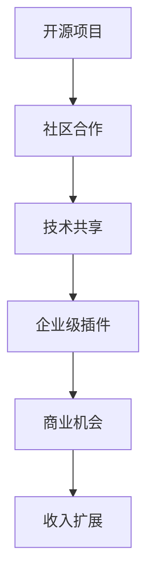

                 

关键词：开源项目，企业级插件，收入来源，技术扩展，商业价值，代码质量

> 摘要：本文旨在探讨如何通过创建开源项目的企业级插件来扩展收入来源。我们将从开源项目的优势、企业级插件的特点、开发与维护的关键点，以及实际案例解析等方面，深入分析这一策略在商业和技术层面的可行性。

## 1. 背景介绍

在当今快速发展的技术环境中，开源项目已成为软件开发的重要组成部分。开源不仅促进了技术创新，还推动了社区协作。然而，对于企业来说，开源项目的价值不仅仅在于技术分享，更在于其潜在的商业机会。其中，创建企业级插件成为许多企业探索新收入来源的重要途径。

企业级插件通常具备高度定制化和专业化的特点，能够满足企业在特定业务场景下的需求。通过将插件开放给社区，企业不仅可以提升品牌影响力，还可以通过与插件相关的服务、支持和维护来获得额外收入。本文将围绕这一主题，详细介绍如何创建和运营企业级插件，以实现商业价值和技术拓展。

## 2. 核心概念与联系

### 2.1 开源项目

开源项目是指软件开发过程中，源代码可以被公众访问、学习和修改的项目。开源项目的核心在于代码的共享和社区合作，这有助于技术的快速迭代和优化。

### 2.2 企业级插件

企业级插件是为特定企业或行业需求设计的软件组件，通常具有高度的专业性和定制化。企业级插件不仅可以扩展原有系统的功能，还可以提高系统的稳定性和安全性。

### 2.3 Mermaid 流程图



## 3. 核心算法原理 & 具体操作步骤

### 3.1 算法原理概述

创建企业级插件的核心在于理解和运用现有软件框架和库。企业级插件通常基于某种主流的软件开发框架，如Spring Boot、Django等，通过定制化开发实现特定的功能。

### 3.2 算法步骤详解

1. **需求分析**：明确插件的目标功能，了解目标用户的需求。
2. **框架选择**：选择合适的软件开发框架，如Spring Boot、Django等。
3. **模块设计**：设计插件的核心模块，如API接口、业务逻辑处理等。
4. **开发实现**：编写代码，实现插件的核心功能。
5. **测试与优化**：进行单元测试、集成测试和性能测试，确保插件的稳定性和性能。
6. **文档编写**：编写详细的开发文档和用户手册，方便用户使用和二次开发。

### 3.3 算法优缺点

**优点**：
- **灵活性**：企业级插件可以根据具体需求进行定制化开发，具有很强的灵活性。
- **扩展性**：插件可以方便地集成到现有系统中，实现功能的扩展。

**缺点**：
- **维护成本**：随着用户数量的增加，插件的维护成本也会增加。
- **兼容性问题**：需要保证插件与不同系统的兼容性。

### 3.4 算法应用领域

企业级插件广泛应用于企业级应用、在线服务、电子商务等领域，特别是在需要高度定制化解决方案的场景中具有显著优势。

## 4. 数学模型和公式 & 详细讲解 & 举例说明

### 4.1 数学模型构建

在插件开发过程中，我们可能需要使用到一些数学模型，如回归分析、决策树等。这些模型有助于预测用户行为、优化插件性能等。

### 4.2 公式推导过程

以线性回归模型为例，其公式为：

$$y = \beta_0 + \beta_1x + \epsilon$$

其中，$y$ 为因变量，$x$ 为自变量，$\beta_0$ 和 $\beta_1$ 为参数，$\epsilon$ 为误差项。

### 4.3 案例分析与讲解

假设我们想要开发一款电商平台的优惠券插件，我们可以使用回归分析来预测优惠券的使用率。通过收集历史数据，我们可以建立回归模型，预测不同优惠券类型的使用率。

## 5. 项目实践：代码实例和详细解释说明

### 5.1 开发环境搭建

在创建企业级插件之前，我们需要搭建一个合适的开发环境。这里以 Spring Boot 为例，详细介绍开发环境的搭建过程。

### 5.2 源代码详细实现

以下是一个简单的 Spring Boot 插件示例：

```java
@RestController
public class CouponController {

    @GetMapping("/coupon")
    public String getCoupon(@RequestParam String type) {
        // 根据优惠券类型获取优惠券
        // 实现优惠券逻辑
        return "Coupon Obtained";
    }
}
```

### 5.3 代码解读与分析

这段代码定义了一个简单的优惠券获取接口，根据传入的优惠券类型，实现优惠券的获取逻辑。

### 5.4 运行结果展示

启动 Spring Boot 应用后，我们可以通过访问 `/coupon?类型=满减` 来获取相应的优惠券。

## 6. 实际应用场景

### 6.1 电商优惠券插件

电商平台可以通过开发优惠券插件，实现不同类型优惠券的发放和管理。

### 6.2 企业管理系统插件

企业可以通过开发定制化插件，满足不同业务场景下的管理需求。

## 7. 未来应用展望

随着技术的不断进步，企业级插件的应用场景将越来越广泛。未来，我们将看到更多针对特定行业和业务场景的插件出现，为企业提供更加灵活和高效的解决方案。

## 8. 工具和资源推荐

### 8.1 学习资源推荐

- 《Spring Boot 实战》
- 《Django 深入实践》
- 《企业级应用架构设计与实践》

### 8.2 开发工具推荐

- IntelliJ IDEA
- Eclipse
- Visual Studio Code

### 8.3 相关论文推荐

- "Building extensible software architectures"
- "Plugin-Based Software Development"
- "The Role of Open Source in Enterprise Software Development"

## 9. 总结：未来发展趋势与挑战

### 9.1 研究成果总结

本文通过分析开源项目的优势、企业级插件的特点，以及开发与维护的关键点，阐述了创建企业级插件作为扩展收入来源的可行性。

### 9.2 未来发展趋势

随着技术的不断进步，企业级插件将在更多行业和应用场景中得到广泛应用。

### 9.3 面临的挑战

企业级插件在开发、维护和兼容性方面面临一定的挑战，需要不断优化和改进。

### 9.4 研究展望

未来，我们将看到更多针对特定行业和业务场景的插件出现，为企业提供更加灵活和高效的解决方案。

## 10. 附录：常见问题与解答

**Q：如何保证企业级插件的质量？**

A：确保插件质量的关键在于严格的代码审查、单元测试和性能测试。同时，提供详细的文档和用户手册，帮助用户正确使用插件。

**Q：企业级插件的商业模式如何？**

A：企业级插件的商业模式通常包括插件销售、订阅服务、定制开发等。通过提供高质量的服务和支持，企业可以建立稳定的收入来源。

## 作者署名

作者：禅与计算机程序设计艺术 / Zen and the Art of Computer Programming

[本文完]

