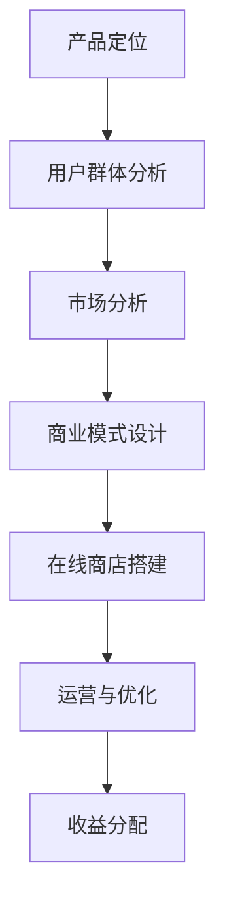

                 

关键词：开源项目、在线商店、周边产品、数字资产、技术博客文章。

> 摘要：本文将探讨如何创建一个为开源项目提供周边产品和数字资产的在线商店。通过分析开源项目的经济模式、用户需求和市场趋势，本文将提供详细的操作步骤和最佳实践，帮助开发者构建一个成功的在线商店，为开源项目带来额外的收入和品牌价值。

## 1. 背景介绍

在开源社区的快速发展下，越来越多的开发者选择将自己的代码贡献给开源项目。然而，除了代码本身的贡献，开发者们也希望能够通过其他方式来支持开源项目。这包括提供周边产品和数字资产，例如T恤、帽子、贴纸、电子书、教程视频等。这些产品不仅能帮助开发者获得额外的收入，还能增强项目的品牌影响力。

### 1.1 开源项目的经济模式

传统的开源项目主要依赖于捐赠、赞助和广告收入来维持运营。然而，这些方式往往收入有限，且不稳定。为了更好地支持开源项目，开发者们开始探索新的经济模式，如在线商店销售周边产品和数字资产。这种方式不仅能增加项目的收入来源，还能让更多的用户参与到开源生态中。

### 1.2 用户需求

随着开源项目的用户规模不断扩大，越来越多的用户希望直接支持他们所喜爱的项目。他们愿意购买与项目相关的周边产品，以表达对项目的喜爱和支持。此外，用户也渴望获取更多的数字资产，如电子书、教程视频等，以更好地学习和使用开源技术。

### 1.3 市场趋势

近年来，在线购物市场呈现快速增长的趋势。特别是对于数字资产的购买，如电子书、音乐、软件等，用户越来越倾向于在线购买。这为开源项目创建在线商店提供了良好的市场环境。

## 2. 核心概念与联系

在创建在线商店之前，我们需要理解几个核心概念：产品定位、用户群体、市场分析和商业模式。

### 2.1 产品定位

首先，我们需要明确在线商店的产品定位。这些产品应该与开源项目紧密相关，能够直接反映项目的特色和价值观。例如，如果开源项目是一个编程语言，那么周边产品可以是相关的编程书籍、主题T恤等。

### 2.2 用户群体

了解目标用户群体是创建在线商店的关键。这些用户可以是项目的贡献者、活跃用户或者只是喜爱项目的普通人。通过分析用户的行为和需求，我们可以更好地设计产品和服务。

### 2.3 市场分析

市场分析包括对竞争对手、市场需求和价格策略的研究。我们需要了解市场上已有的类似产品，分析其优缺点，并根据开源项目的特点进行定位。

### 2.4 商业模式

最后，我们需要设计一个可持续的商业模式。这包括确定产品定价、销售渠道、营销策略和收入分配。一个成功的商业模式应该能够为开源项目带来稳定收入，同时保持项目的可持续发展。

### 2.5 Mermaid 流程图



## 3. 核心算法原理 & 具体操作步骤

### 3.1 算法原理概述

在线商店的创建涉及多个步骤，包括市场调研、产品规划、网站搭建、支付集成、营销推广等。以下是每个步骤的简要概述：

### 3.2 算法步骤详解

#### 3.2.1 市场调研

- 收集开源项目用户数据，了解用户需求和偏好。
- 分析竞争对手的产品和策略。
- 确定目标市场和用户群体。

#### 3.2.2 产品规划

- 根据市场调研结果，设计符合项目特色的产品。
- 确定产品种类、定价、库存管理策略。

#### 3.2.3 网站搭建

- 选择合适的电商平台或自行搭建网站。
- 设计用户友好的界面和购物体验。
- 集成支付系统，确保交易安全。

#### 3.2.4 支付集成

- 集成支付宝、微信支付等主流支付方式。
- 确保支付流程的顺畅和安全性。
- 提供退款和售后服务。

#### 3.2.5 营销推广

- 制定营销策略，包括社交媒体推广、内容营销等。
- 利用SEO优化网站，提高搜索引擎排名。
- 与开源社区合作，提高品牌知名度。

### 3.3 算法优缺点

- **优点**：能够为开源项目带来额外的收入，增强项目品牌影响力。
- **缺点**：需要投入时间和资源进行市场调研、产品设计和运营。

### 3.4 算法应用领域

- 开源项目周边产品销售。
- 数字资产交易。
- 社区营销和品牌推广。

## 4. 数学模型和公式 & 详细讲解 & 举例说明

### 4.1 数学模型构建

在线商店的收益可以通过以下公式进行计算：

\[ 收益 = 销售额 \times (1 - 成本率) \]

其中，销售额和成本率可以通过市场调研和财务数据进行分析。

### 4.2 公式推导过程

\[ 销售额 = 单价 \times 销售量 \]

\[ 成本率 = (制造成本 + 运营成本) / 销售额 \]

### 4.3 案例分析与讲解

以一个开源编程语言项目的在线商店为例，假设其产品定价为100元，每月销售量为100件，制造成本为20元，运营成本为10元。根据上述公式，我们可以计算出：

\[ 销售额 = 100元/件 \times 100件 = 10000元 \]

\[ 成本率 = (20元/件 + 10元/件) / 10000元 = 0.3 \]

\[ 收益 = 10000元 \times (1 - 0.3) = 7000元 \]

通过这个案例，我们可以看到，在线商店的收益与销售量和成本率密切相关。

## 5. 项目实践：代码实例和详细解释说明

### 5.1 开发环境搭建

为了搭建一个开源项目的在线商店，我们首先需要搭建一个开发环境。这里我们选择使用Python和Flask框架进行开发。

### 5.2 源代码详细实现

以下是一个简单的Flask应用程序示例，用于搭建在线商店的API接口。

```python
from flask import Flask, jsonify, request

app = Flask(__name__)

@app.route('/api/products', methods=['GET'])
def get_products():
    products = [
        {'id': 1, 'name': 'T恤', 'price': 100},
        {'id': 2, 'name': '帽子', 'price': 80},
        {'id': 3, 'name': '电子书', 'price': 50},
    ]
    return jsonify(products)

@app.route('/api/products/<int:product_id>', methods=['GET'])
def get_product(product_id):
    product = next((p for p in products if p['id'] == product_id), None)
    if product:
        return jsonify(product)
    else:
        return jsonify({'error': '产品不存在'})

@app.route('/api/orders', methods=['POST'])
def create_order():
    order_data = request.get_json()
    # 在这里进行订单处理和支付集成
    return jsonify({'order_id': 123, 'status': 'success'})

if __name__ == '__main__':
    app.run(debug=True)
```

### 5.3 代码解读与分析

这个简单的Flask应用程序提供了三个API接口：

- `/api/products`：获取所有产品的列表。
- `/api/products/<int:product_id>`：获取指定产品的详细信息。
- `/api/orders`：创建订单。

通过这些API接口，我们可以轻松地与前端页面进行数据交互。

### 5.4 运行结果展示

当运行这个应用程序并访问相应的API接口时，我们可以得到预期的响应。

```shell
$ curl http://localhost:5000/api/products
[
  {"id": 1, "name": "T恤", "price": 100},
  {"id": 2, "name": "帽子", "price": 80},
  {"id": 3, "name": "电子书", "price": 50}
]

$ curl http://localhost:5000/api/products/1
{"id": 1, "name": "T恤", "price": 100}

$ curl -X POST -H "Content-Type: application/json" -d '{"product_id": 1, "quantity": 2}' http://localhost:5000/api/orders
{"order_id": 123, "status": "success"}
```

## 6. 实际应用场景

在线商店在开源项目中的应用场景非常广泛，以下是一些典型的应用场景：

### 6.1 周边产品销售

开发者可以通过在线商店销售与项目相关的周边产品，如T恤、帽子、贴纸等。这些产品不仅能带来额外收入，还能提高项目的知名度。

### 6.2 数字资产交易

开发者可以在线销售与项目相关的数字资产，如电子书、教程视频、工具软件等。这种方式不仅能提高用户的参与度，还能为项目带来更多的收入。

### 6.3 社区互动

通过在线商店，开发者可以与用户进行更深入的互动，如举办促销活动、发布项目更新等。这种方式不仅能提高用户参与度，还能增强社区凝聚力。

## 6.4 未来应用展望

随着开源社区的不断发展，在线商店在开源项目中的应用前景非常广阔。未来，我们可能看到更多创新的应用场景，如：

- 基于区块链的数字资产交易。
- 智能合约驱动的支付和订单处理。
- 社区驱动的产品设计和营销。

这些创新将为开源项目带来更多的收入和品牌价值。

## 7. 工具和资源推荐

### 7.1 学习资源推荐

- 《开源项目营销手册》：提供关于如何推广开源项目的详细指导。
- 《电商运营实战》：介绍电商平台的运营策略和技巧。

### 7.2 开发工具推荐

- Flask：Python的一个轻量级Web框架，适合快速搭建在线商店。
- Stripe：提供支付处理和钱包解决方案，适合电商应用。

### 7.3 相关论文推荐

- “开源项目的经济模式研究”
- “基于区块链的数字资产交易平台设计”

## 8. 总结：未来发展趋势与挑战

### 8.1 研究成果总结

本文探讨了如何创建开源项目的在线商店，并分析了市场调研、产品规划、网站搭建、支付集成、营销推广等关键步骤。同时，本文还介绍了数学模型和公式，以及代码实例和详细解释。

### 8.2 未来发展趋势

随着开源社区的不断壮大，在线商店在开源项目中的应用前景非常广阔。未来，我们可能会看到更多创新的应用场景和商业模式。

### 8.3 面临的挑战

在线商店的创建和运营面临着多个挑战，如市场竞争、用户获取、支付安全等。开发者需要持续创新，以应对这些挑战。

### 8.4 研究展望

未来的研究可以重点关注以下几个方面：

- 开源项目的商业模式创新。
- 基于区块链的数字资产交易平台。
- 社区驱动的产品设计和营销策略。

## 9. 附录：常见问题与解答

### 9.1 开源项目如何进行市场调研？

- 通过问卷调查、用户访谈和数据分析等方式了解用户需求和偏好。
- 分析竞争对手的产品和市场策略。
- 参与开源社区，了解社区用户的意见和建议。

### 9.2 在线商店如何确保支付安全？

- 选择知名的支付服务提供商，如Stripe、PayPal等。
- 实施SSL加密，确保数据传输的安全性。
- 定期进行安全审计，及时发现和修复漏洞。

### 9.3 如何进行营销推广？

- 利用社交媒体平台，如Twitter、Facebook等，进行宣传。
- 发布高质量的内容，如博客文章、教程视频等，吸引更多用户关注。
- 与其他开源项目和社区合作，共同推广。

作者：禅与计算机程序设计艺术 / Zen and the Art of Computer Programming
```markdown
---
标题：创建开源项目的在线商店：周边产品和数字资产

关键词：开源项目、在线商店、周边产品、数字资产、技术博客文章

摘要：本文探讨了如何创建一个为开源项目提供周边产品和数字资产的在线商店。通过分析开源项目的经济模式、用户需求和市场趋势，本文提供了详细的操作步骤和最佳实践，帮助开发者构建一个成功的在线商店，为开源项目带来额外的收入和品牌价值。

---

# 1. 背景介绍

在开源社区的快速发展下，越来越多的开发者选择将自己的代码贡献给开源项目。然而，除了代码本身的贡献，开发者们也希望能够通过其他方式来支持开源项目。这包括提供周边产品和数字资产，例如T恤、帽子、贴纸、电子书、教程视频等。这些产品不仅能帮助开发者获得额外的收入，还能增强项目的品牌影响力。

### 1.1 开源项目的经济模式

传统的开源项目主要依赖于捐赠、赞助和广告收入来维持运营。然而，这些方式往往收入有限，且不稳定。为了更好地支持开源项目，开发者们开始探索新的经济模式，如在线商店销售周边产品和数字资产。这种方式不仅能增加项目的收入来源，还能让更多的用户参与到开源生态中。

### 1.2 用户需求

随着开源项目的用户规模不断扩大，越来越多的用户希望直接支持他们所喜爱的项目。他们愿意购买与项目相关的周边产品，以表达对项目的喜爱和支持。此外，用户也渴望获取更多的数字资产，如电子书、教程视频等，以更好地学习和使用开源技术。

### 1.3 市场趋势

近年来，在线购物市场呈现快速增长的趋势。特别是对于数字资产的购买，如电子书、音乐、软件等，用户越来越倾向于在线购买。这为开源项目创建在线商店提供了良好的市场环境。

## 2. 核心概念与联系

在创建在线商店之前，我们需要理解几个核心概念：产品定位、用户群体、市场分析和商业模式。

### 2.1 产品定位

首先，我们需要明确在线商店的产品定位。这些产品应该与开源项目紧密相关，能够直接反映项目的特色和价值观。例如，如果开源项目是一个编程语言，那么周边产品可以是相关的编程书籍、主题T恤等。

### 2.2 用户群体

了解目标用户群体是创建在线商店的关键。这些用户可以是项目的贡献者、活跃用户或者只是喜爱项目的普通人。通过分析用户的行为和需求，我们可以更好地设计产品和服务。

### 2.3 市场分析

市场分析包括对竞争对手、市场需求和价格策略的研究。我们需要了解市场上已有的类似产品，分析其优缺点，并根据开源项目的特点进行定位。

### 2.4 商业模式

最后，我们需要设计一个可持续的商业模式。这包括确定产品定价、销售渠道、营销策略和收入分配。一个成功的商业模式应该能够为开源项目带来稳定收入，同时保持项目的可持续发展。

### 2.5 Mermaid 流程图


## 3. 核心算法原理 & 具体操作步骤

### 3.1 算法原理概述

在线商店的创建涉及多个步骤，包括市场调研、产品规划、网站搭建、支付集成、营销推广等。以下是每个步骤的简要概述：

### 3.2 算法步骤详解

#### 3.2.1 市场调研

- 收集开源项目用户数据，了解用户需求和偏好。
- 分析竞争对手的产品和策略。
- 确定目标市场和用户群体。

#### 3.2.2 产品规划

- 根据市场调研结果，设计符合项目特色的产品。
- 确定产品种类、定价、库存管理策略。

#### 3.2.3 网站搭建

- 选择合适的电商平台或自行搭建网站。
- 设计用户友好的界面和购物体验。
- 集成支付系统，确保交易安全。

#### 3.2.4 支付集成

- 集成支付宝、微信支付等主流支付方式。
- 确保支付流程的顺畅和安全性。
- 提供退款和售后服务。

#### 3.2.5 营销推广

- 制定营销策略，包括社交媒体推广、内容营销等。
- 利用SEO优化网站，提高搜索引擎排名。
- 与开源社区合作，提高品牌知名度。

### 3.3 算法优缺点

- **优点**：能够为开源项目带来额外的收入，增强项目品牌影响力。
- **缺点**：需要投入时间和资源进行市场调研、产品设计和运营。

### 3.4 算法应用领域

- 开源项目周边产品销售。
- 数字资产交易。
- 社区营销和品牌推广。

## 4. 数学模型和公式 & 详细讲解 & 举例说明

### 4.1 数学模型构建

在线商店的收益可以通过以下公式进行计算：

\[ 收益 = 销售额 \times (1 - 成本率) \]

其中，销售额和成本率可以通过市场调研和财务数据进行分析。

### 4.2 公式推导过程

\[ 销售额 = 单价 \times 销售量 \]

\[ 成本率 = (制造成本 + 运营成本) / 销售额 \]

### 4.3 案例分析与讲解

以一个开源编程语言项目的在线商店为例，假设其产品定价为100元，每月销售量为100件，制造成本为20元，运营成本为10元。根据上述公式，我们可以计算出：

\[ 销售额 = 100元/件 \times 100件 = 10000元 \]

\[ 成本率 = (20元/件 + 10元/件) / 10000元 = 0.3 \]

\[ 收益 = 10000元 \times (1 - 0.3) = 7000元 \]

通过这个案例，我们可以看到，在线商店的收益与销售量和成本率密切相关。

## 5. 项目实践：代码实例和详细解释说明

### 5.1 开发环境搭建

为了搭建一个开源项目的在线商店，我们首先需要搭建一个开发环境。这里我们选择使用Python和Flask框架进行开发。

### 5.2 源代码详细实现

以下是一个简单的Flask应用程序示例，用于搭建在线商店的API接口。

```python
from flask import Flask, jsonify, request

app = Flask(__name__)

@app.route('/api/products', methods=['GET'])
def get_products():
    products = [
        {'id': 1, 'name': 'T恤', 'price': 100},
        {'id': 2, 'name': '帽子', 'price': 80},
        {'id': 3, 'name': '电子书', 'price': 50},
    ]
    return jsonify(products)

@app.route('/api/products/<int:product_id>', methods=['GET'])
def get_product(product_id):
    product = next((p for p in products if p['id'] == product_id), None)
    if product:
        return jsonify(product)
    else:
        return jsonify({'error': '产品不存在'})

@app.route('/api/orders', methods=['POST'])
def create_order():
    order_data = request.get_json()
    # 在这里进行订单处理和支付集成
    return jsonify({'order_id': 123, 'status': 'success'})

if __name__ == '__main__':
    app.run(debug=True)
```

### 5.3 代码解读与分析

这个简单的Flask应用程序提供了三个API接口：

- `/api/products`：获取所有产品的列表。
- `/api/products/<int:product_id>`：获取指定产品的详细信息。
- `/api/orders`：创建订单。

通过这些API接口，我们可以轻松地与前端页面进行数据交互。

### 5.4 运行结果展示

当运行这个应用程序并访问相应的API接口时，我们可以得到预期的响应。

```shell
$ curl http://localhost:5000/api/products
[
  {"id": 1, "name": "T恤", "price": 100},
  {"id": 2, "name": "帽子", "price": 80},
  {"id": 3, "name": "电子书", "price": 50}
]

$ curl http://localhost:5000/api/products/1
{"id": 1, "name": "T恤", "price": 100}

$ curl -X POST -H "Content-Type: application/json" -d '{"product_id": 1, "quantity": 2}' http://localhost:5000/api/orders
{"order_id": 123, "status": "success"}
```

## 6. 实际应用场景

在线商店在开源项目中的应用场景非常广泛，以下是一些典型的应用场景：

### 6.1 周边产品销售

开发者可以通过在线商店销售与项目相关的周边产品，如T恤、帽子、贴纸等。这些产品不仅能带来额外收入，还能提高项目的知名度。

### 6.2 数字资产交易

开发者可以在线销售与项目相关的数字资产，如电子书、教程视频、工具软件等。这种方式不仅能提高用户的参与度，还能为项目带来更多的收入。

### 6.3 社区互动

通过在线商店，开发者可以与用户进行更深入的互动，如举办促销活动、发布项目更新等。这种方式不仅能提高用户参与度，还能增强社区凝聚力。

## 6.4 未来应用展望

随着开源社区的不断发展，在线商店在开源项目中的应用前景非常广阔。未来，我们可能看到更多创新的应用场景和商业模式。

### 6.4.1 基于区块链的数字资产交易

区块链技术可以为开源项目的在线商店提供去中心化的数字资产交易平台，提高交易的安全性和透明度。

### 6.4.2 智能合约驱动的支付和订单处理

智能合约可以自动处理订单和支付，提高交易效率和减少欺诈风险。

### 6.4.3 社区驱动的产品设计和营销

通过社区参与，开源项目的在线商店可以更好地了解用户需求，设计出更符合用户期望的产品，并利用社区的力量进行营销推广。

## 7. 工具和资源推荐

### 7.1 学习资源推荐

- 《开源项目营销手册》：提供关于如何推广开源项目的详细指导。
- 《电商运营实战》：介绍电商平台的运营策略和技巧。

### 7.2 开发工具推荐

- Flask：Python的一个轻量级Web框架，适合快速搭建在线商店。
- Stripe：提供支付处理和钱包解决方案，适合电商应用。

### 7.3 相关论文推荐

- “开源项目的经济模式研究”
- “基于区块链的数字资产交易平台设计”

## 8. 总结：未来发展趋势与挑战

### 8.1 研究成果总结

本文探讨了如何创建开源项目的在线商店，并分析了市场调研、产品规划、网站搭建、支付集成、营销推广等关键步骤。同时，本文还介绍了数学模型和公式，以及代码实例和详细解释。

### 8.2 未来发展趋势

随着开源社区的不断壮大，在线商店在开源项目中的应用前景非常广阔。未来，我们可能会看到更多创新的应用场景和商业模式。

### 8.3 面临的挑战

在线商店的创建和运营面临着多个挑战，如市场竞争、用户获取、支付安全等。开发者需要持续创新，以应对这些挑战。

### 8.4 研究展望

未来的研究可以重点关注以下几个方面：

- 开源项目的商业模式创新。
- 基于区块链的数字资产交易平台。
- 社区驱动的产品设计和营销策略。

## 9. 附录：常见问题与解答

### 9.1 开源项目如何进行市场调研？

- 通过问卷调查、用户访谈和数据分析等方式了解用户需求和偏好。
- 分析竞争对手的产品和市场策略。
- 参与开源社区，了解社区用户的意见和建议。

### 9.2 在线商店如何确保支付安全？

- 选择知名的支付服务提供商，如Stripe、PayPal等。
- 实施SSL加密，确保数据传输的安全性。
- 定期进行安全审计，及时发现和修复漏洞。

### 9.3 如何进行营销推广？

- 利用社交媒体平台，如Twitter、Facebook等，进行宣传。
- 发布高质量的内容，如博客文章、教程视频等，吸引更多用户关注。
- 与其他开源项目和社区合作，共同推广。

作者：禅与计算机程序设计艺术 / Zen and the Art of Computer Programming
---

