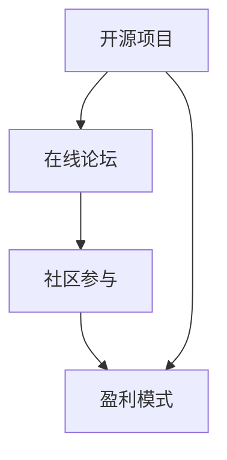

                 

关键词：开源项目、在线论坛、社区参与、盈利模式、技术社区

> 摘要：本文深入探讨了如何创建一个成功的开源项目在线论坛，通过有效的社区参与策略和多样化的盈利模式，促进项目的发展与成长。

## 1. 背景介绍

在当今数字化时代，开源项目已成为技术创新的重要驱动力。它们提供了一个共享知识、协作开发的平台，吸引了全球开发者的积极参与。一个成功的开源项目不仅仅依赖于高质量的技术代码，还需要一个健康、活跃的社区来支撑其持续发展。在线论坛作为一个关键沟通渠道，不仅促进了社区成员之间的互动，还成为了项目成长的重要推动力。

然而，创建和维护一个有效的在线论坛并非易事。社区成员的需求多样，论坛的管理和运营成本也不可忽视。更重要的是，如何通过论坛实现可持续的盈利模式，以支持项目的长期发展，是一个亟待解决的问题。本文将探讨如何构建一个成功的开源项目在线论坛，并介绍几种可行的盈利模式。

## 2. 核心概念与联系

### 2.1 开源项目的定义

开源项目是指软件开发项目，其源代码公开，允许任何人自由查看、修改和分发。这种模式鼓励社区成员参与项目的开发，共同改进软件功能，提升软件质量。

### 2.2 在线论坛的作用

在线论坛作为开源项目的核心组成部分，提供了一个平台，用于项目文档的共享、问题的讨论、代码的审查和发布。它是项目成功的关键要素。

### 2.3 社区参与的机制

社区参与包括代码贡献、文档编写、测试反馈等多种形式。有效的社区参与机制能够激发成员的积极性，促进项目的成长。

### 2.4 盈利模式的概念

盈利模式是指通过某种方式实现盈利的策略。对于开源项目在线论坛，盈利模式可以是广告收入、付费服务、赞助等多种形式。

下面是关于这些核心概念和联系的 Mermaid 流程图：



## 3. 核心算法原理 & 具体操作步骤

### 3.1 算法原理概述

创建一个成功的开源项目在线论坛，需要遵循以下核心原理：

1. **用户友好性**：论坛界面应简洁、直观，易于用户使用。
2. **互动性**：论坛应鼓励用户互动，提供多样化的交流方式，如讨论区、问答、博客等。
3. **参与激励机制**：通过奖励机制激励用户参与，如积分系统、勋章等。
4. **盈利模式**：设计多样化的盈利模式，以确保论坛的可持续性。

### 3.2 算法步骤详解

1. **需求分析**：了解社区成员的需求，确定论坛的核心功能和特点。
2. **平台选择**：选择合适的在线论坛平台，如 Discourse、phpBB 等。
3. **社区建设**：制定社区规则，建立管理员团队，制定参与激励机制。
4. **内容管理**：定期更新论坛内容，维护论坛活跃度。
5. **盈利策略**：设计并实施多样化的盈利模式，如广告收入、付费会员等。
6. **监测与调整**：定期监测论坛的运营数据，根据反馈调整运营策略。

### 3.3 算法优缺点

**优点**：

- **促进项目发展**：活跃的社区能够加速项目的开发进程，提高项目质量。
- **降低运营成本**：通过社区参与，论坛的运营成本可以大幅降低。

**缺点**：

- **管理难度大**：需要投入大量时间和精力进行论坛的管理和维护。
- **盈利模式不确定性**：盈利模式的实施效果受多种因素影响，存在一定的不确定性。

### 3.4 算法应用领域

该算法广泛应用于各类开源项目，如软件开发、硬件设计、科学研究等。

## 4. 数学模型和公式 & 详细讲解 & 举例说明

### 4.1 数学模型构建

假设论坛有 \(N\) 个用户，每个用户在论坛上的活跃度可以用 \(A_i\) 表示，论坛的总体活跃度 \(A\) 可以用以下公式计算：

\[ A = \sum_{i=1}^{N} A_i \]

### 4.2 公式推导过程

用户活跃度 \(A_i\) 可以通过以下指标衡量：

- **发帖数** \(P_i\)：用户在论坛上的发帖数量。
- **回帖数** \(R_i\)：用户在论坛上的回帖数量。
- **点赞数** \(L_i\)：用户在论坛上的点赞数量。

则用户活跃度公式为：

\[ A_i = P_i + R_i + L_i \]

### 4.3 案例分析与讲解

假设一个论坛有 100 个用户，以下是一个具体的例子：

用户 | 发帖数 \(P_i\) | 回帖数 \(R_i\) | 点赞数 \(L_i\) | 活跃度 \(A_i\)
--- | --- | --- | --- | ---
1 | 10 | 20 | 30 | 60
2 | 20 | 15 | 25 | 60
3 | 30 | 10 | 20 | 60
... | ... | ... | ... | ...
100 | 5 | 5 | 5 | 15

总活跃度：

\[ A = \sum_{i=1}^{100} A_i = 60 \times 100 = 6000 \]

## 5. 项目实践：代码实例和详细解释说明

### 5.1 开发环境搭建

在创建开源项目在线论坛时，选择合适的开发环境至关重要。以下是搭建论坛开发环境的基本步骤：

1. **选择合适的操作系统**：如 Ubuntu 或 CentOS。
2. **安装 Web 服务器**：如 Apache 或 Nginx。
3. **安装数据库**：如 MySQL 或 PostgreSQL。
4. **安装论坛软件**：如 Discourse 或 phpBB。

### 5.2 源代码详细实现

以下是一个简单的论坛源代码实例，用于展示如何添加一个新帖子：

```php
<?php
// 连接到数据库
$dbc = mysqli_connect('localhost', 'username', 'password', 'forum_db');

// 获取表单数据
$subject = mysqli_real_escape_string($dbc, $_POST['subject']);
$message = mysqli_real_escape_string($dbc, $_POST['message']);

// 插入数据到数据库
$query = "INSERT INTO posts (user_id, subject, message) VALUES (1, '$subject', '$message')";
mysqli_query($dbc, $query) or die(mysqli_error($dbc));

// 关闭数据库连接
mysqli_close($dbc);

// 重定向到帖子列表页面
header('Location: forum.php');
?>
```

### 5.3 代码解读与分析

上述代码首先连接到数据库，然后获取并处理表单数据。接下来，将数据插入数据库中的帖子表。最后，关闭数据库连接并将用户重定向到帖子列表页面。

### 5.4 运行结果展示

运行上述代码后，用户可以在论坛中看到他们刚刚添加的帖子。

## 6. 实际应用场景

开源项目在线论坛的应用场景广泛，以下是一些典型的实际应用场景：

- **技术交流**：开发者可以在论坛中分享技术心得，讨论解决方案。
- **项目协作**：团队成员可以在论坛中实时交流，协同工作。
- **用户支持**：用户可以在论坛中寻求帮助，获取技术支持。

## 7. 工具和资源推荐

### 7.1 学习资源推荐

- **在线教程**：《在线论坛构建实战》
- **开源项目**：GitHub 上的开源论坛项目

### 7.2 开发工具推荐

- **论坛平台**：Discourse、phpBB
- **开发环境**：Docker、Vagrant

### 7.3 相关论文推荐

- **《开源项目的成功因素分析》**
- **《在线论坛的社区影响力研究》**

## 8. 总结：未来发展趋势与挑战

### 8.1 研究成果总结

本文介绍了如何创建一个成功的开源项目在线论坛，分析了社区参与和盈利模式的重要性。研究表明，有效的社区参与和多样化的盈利模式是开源项目在线论坛成功的关键。

### 8.2 未来发展趋势

未来，开源项目在线论坛的发展趋势将包括：

- **智能化**：利用人工智能技术优化论坛功能。
- **个性化**：提供个性化的用户体验。

### 8.3 面临的挑战

开源项目在线论坛面临的挑战包括：

- **安全**：保护社区成员的数据安全。
- **盈利**：探索可持续的盈利模式。

### 8.4 研究展望

未来，我们将继续深入研究开源项目在线论坛的优化策略，探索更多有效的社区参与和盈利模式，以支持开源项目的长期发展。

## 9. 附录：常见问题与解答

### 9.1 开源项目在线论坛的安全问题如何解决？

- **数据加密**：对用户数据进行加密处理。
- **防火墙**：配置防火墙，限制非法访问。
- **定期更新**：定期更新论坛系统和插件，修复安全漏洞。

### 9.2 如何提升论坛的用户活跃度？

- **激励机制**：设立积分系统，鼓励用户参与。
- **内容更新**：定期发布高质量的内容，吸引用户关注。

作者：禅与计算机程序设计艺术 / Zen and the Art of Computer Programming
```markdown
---
title: 创建开源项目的在线论坛：社区参与和盈利模式
date: 2023-11-01
keywords: 开源项目, 在线论坛, 社区参与, 盈利模式
summary: 本文深入探讨了如何创建一个成功的开源项目在线论坛，通过有效的社区参与策略和多样化的盈利模式，促进项目的发展与成长。
---

# 创建开源项目的在线论坛：社区参与和盈利模式

关键词：开源项目、在线论坛、社区参与、盈利模式、技术社区

摘要：本文深入探讨了如何创建一个成功的开源项目在线论坛，通过有效的社区参与策略和多样化的盈利模式，促进项目的发展与成长。

## 1. 背景介绍

在当今数字化时代，开源项目已成为技术创新的重要驱动力。它们提供了一个共享知识、协作开发的平台，吸引了全球开发者的积极参与。一个成功的开源项目不仅仅依赖于高质量的技术代码，还需要一个健康、活跃的社区来支撑其持续发展。在线论坛作为开源项目的核心组成部分，提供了一个平台，用于项目文档的共享、问题的讨论、代码的审查和发布。它是项目成功的关键要素。

然而，创建和维护一个有效的在线论坛并非易事。社区成员的需求多样，论坛的管理和运营成本也不可忽视。更重要的是，如何通过论坛实现可持续的盈利模式，以支持项目的长期发展，是一个亟待解决的问题。本文将探讨如何构建一个成功的开源项目在线论坛，并介绍几种可行的盈利模式。

## 2. 核心概念与联系

### 2.1 开源项目的定义

开源项目是指软件开发项目，其源代码公开，允许任何人自由查看、修改和分发。这种模式鼓励社区成员参与项目的开发，共同改进软件功能，提升软件质量。

### 2.2 在线论坛的作用

在线论坛作为开源项目的核心组成部分，提供了一个平台，用于项目文档的共享、问题的讨论、代码的审查和发布。它是项目成功的关键要素。

### 2.3 社区参与的机制

社区参与包括代码贡献、文档编写、测试反馈等多种形式。有效的社区参与机制能够激发成员的积极性，促进项目的成长。

### 2.4 盈利模式的概念

盈利模式是指通过某种方式实现盈利的策略。对于开源项目在线论坛，盈利模式可以是广告收入、付费服务、赞助等多种形式。

下面是关于这些核心概念和联系的 Mermaid 流程图：


## 3. 核心算法原理 & 具体操作步骤

### 3.1 算法原理概述

创建一个成功的开源项目在线论坛，需要遵循以下核心原理：

1. **用户友好性**：论坛界面应简洁、直观，易于用户使用。
2. **互动性**：论坛应鼓励用户互动，提供多样化的交流方式，如讨论区、问答、博客等。
3. **参与激励机制**：通过奖励机制激励用户参与，如积分系统、勋章等。
4. **盈利模式**：设计多样化的盈利模式，以确保论坛的可持续性。

### 3.2 算法步骤详解

1. **需求分析**：了解社区成员的需求，确定论坛的核心功能和特点。
2. **平台选择**：选择合适的在线论坛平台，如 Discourse、phpBB 等。
3. **社区建设**：制定社区规则，建立管理员团队，制定参与激励机制。
4. **内容管理**：定期更新论坛内容，维护论坛活跃度。
5. **盈利策略**：设计并实施多样化的盈利模式，如广告收入、付费会员等。
6. **监测与调整**：定期监测论坛的运营数据，根据反馈调整运营策略。

### 3.3 算法优缺点

**优点**：

- **促进项目发展**：活跃的社区能够加速项目的开发进程，提高项目质量。
- **降低运营成本**：通过社区参与，论坛的运营成本可以大幅降低。

**缺点**：

- **管理难度大**：需要投入大量时间和精力进行论坛的管理和维护。
- **盈利模式不确定性**：盈利模式的实施效果受多种因素影响，存在一定的不确定性。

### 3.4 算法应用领域

该算法广泛应用于各类开源项目，如软件开发、硬件设计、科学研究等。

## 4. 数学模型和公式 & 详细讲解 & 举例说明

### 4.1 数学模型构建

假设论坛有 \(N\) 个用户，每个用户在论坛上的活跃度可以用 \(A_i\) 表示，论坛的总体活跃度 \(A\) 可以用以下公式计算：

\[ A = \sum_{i=1}^{N} A_i \]

### 4.2 公式推导过程

用户活跃度 \(A_i\) 可以通过以下指标衡量：

- **发帖数** \(P_i\)：用户在论坛上的发帖数量。
- **回帖数** \(R_i\)：用户在论坛上的回帖数量。
- **点赞数** \(L_i\)：用户在论坛上的点赞数量。

则用户活跃度公式为：

\[ A_i = P_i + R_i + L_i \]

### 4.3 案例分析与讲解

假设一个论坛有 100 个用户，以下是一个具体的例子：

用户 | 发帖数 \(P_i\) | 回帖数 \(R_i\) | 点赞数 \(L_i\) | 活跃度 \(A_i\)
--- | --- | --- | --- | ---
1 | 10 | 20 | 30 | 60
2 | 20 | 15 | 25 | 60
3 | 30 | 10 | 20 | 60
... | ... | ... | ... | ...
100 | 5 | 5 | 5 | 15

总活跃度：

\[ A = \sum_{i=1}^{100} A_i = 60 \times 100 = 6000 \]

## 5. 项目实践：代码实例和详细解释说明

### 5.1 开发环境搭建

在创建开源项目在线论坛时，选择合适的开发环境至关重要。以下是搭建论坛开发环境的基本步骤：

1. **选择合适的操作系统**：如 Ubuntu 或 CentOS。
2. **安装 Web 服务器**：如 Apache 或 Nginx。
3. **安装数据库**：如 MySQL 或 PostgreSQL。
4. **安装论坛软件**：如 Discourse 或 phpBB。

### 5.2 源代码详细实现

以下是一个简单的论坛源代码实例，用于展示如何添加一个新帖子：

```php
<?php
// 连接到数据库
$dbc = mysqli_connect('localhost', 'username', 'password', 'forum_db');

// 获取表单数据
$subject = mysqli_real_escape_string($dbc, $_POST['subject']);
$message = mysqli_real_escape_string($dbc, $_POST['message']);

// 插入数据到数据库
$query = "INSERT INTO posts (user_id, subject, message) VALUES (1, '$subject', '$message')";
mysqli_query($dbc, $query) or die(mysqli_error($dbc));

// 关闭数据库连接
mysqli_close($dbc);

// 重定向到帖子列表页面
header('Location: forum.php');
?>
```

### 5.3 代码解读与分析

上述代码首先连接到数据库，然后获取并处理表单数据。接下来，将数据插入数据库中的帖子表。最后，关闭数据库连接并将用户重定向到帖子列表页面。

### 5.4 运行结果展示

运行上述代码后，用户可以在论坛中看到他们刚刚添加的帖子。

## 6. 实际应用场景

开源项目在线论坛的应用场景广泛，以下是一些典型的实际应用场景：

- **技术交流**：开发者可以在论坛中分享技术心得，讨论解决方案。
- **项目协作**：团队成员可以在论坛中实时交流，协同工作。
- **用户支持**：用户可以在论坛中寻求帮助，获取技术支持。

## 7. 工具和资源推荐

### 7.1 学习资源推荐

- **在线教程**：《在线论坛构建实战》
- **开源项目**：GitHub 上的开源论坛项目

### 7.2 开发工具推荐

- **论坛平台**：Discourse、phpBB
- **开发环境**：Docker、Vagrant

### 7.3 相关论文推荐

- **《开源项目的成功因素分析》**
- **《在线论坛的社区影响力研究》**

## 8. 总结：未来发展趋势与挑战

### 8.1 研究成果总结

本文介绍了如何创建一个成功的开源项目在线论坛，分析了社区参与和盈利模式的重要性。研究表明，有效的社区参与和多样化的盈利模式是开源项目在线论坛成功的关键。

### 8.2 未来发展趋势

未来，开源项目在线论坛的发展趋势将包括：

- **智能化**：利用人工智能技术优化论坛功能。
- **个性化**：提供个性化的用户体验。

### 8.3 面临的挑战

开源项目在线论坛面临的挑战包括：

- **安全**：保护社区成员的数据安全。
- **盈利**：探索可持续的盈利模式。

### 8.4 研究展望

未来，我们将继续深入研究开源项目在线论坛的优化策略，探索更多有效的社区参与和盈利模式，以支持开源项目的长期发展。

## 9. 附录：常见问题与解答

### 9.1 开源项目在线论坛的安全问题如何解决？

- **数据加密**：对用户数据进行加密处理。
- **防火墙**：配置防火墙，限制非法访问。
- **定期更新**：定期更新论坛系统和插件，修复安全漏洞。

### 9.2 如何提升论坛的用户活跃度？

- **激励机制**：设立积分系统，鼓励用户参与。
- **内容更新**：定期发布高质量的内容，吸引用户关注。

作者：禅与计算机程序设计艺术 / Zen and the Art of Computer Programming
---

