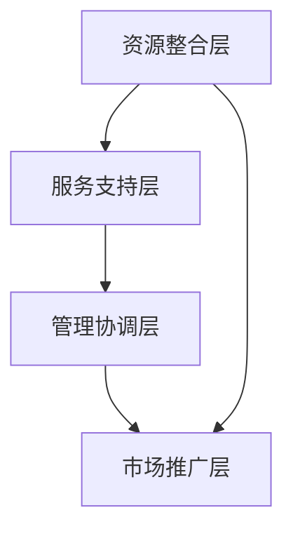

                 

关键词：创新生态系统，产学研协同，协同创新平台，管理策略，技术融合，资源整合，创新模型。

> 摘要：本文将深入探讨创新生态系统的构建与管理，特别是产学研协同创新平台的作用与构建方法。通过分析现有生态系统的运作模式，阐述如何利用信息技术和项目管理工具，打造一个高效的创新平台，以推动科研成果的转化与应用，提升整个行业的创新能力。

## 1. 背景介绍

在当今快速发展的信息化时代，技术创新已经成为企业竞争力的重要来源。然而，单纯依靠企业内部研发往往无法满足快速变化的市场需求，这就需要构建一个跨界的创新生态系统，实现产学研的深度融合。创新生态系统是指由政府、企业、高校、科研机构等多方参与者组成的网络，通过资源的共享和协同合作，推动技术创新和产业升级。

产学研协同创新平台作为创新生态系统的重要组成部分，旨在搭建一个开放、共享、高效的研发环境，促进知识流动和技术转移。该平台不仅需要整合各类创新资源，还需要具备良好的管理机制，以确保创新活动的顺利进行。

## 2. 核心概念与联系

### 2.1 创新生态系统的概念

创新生态系统是由多种参与者组成的复杂网络，包括企业、高校、科研机构、政府、投资者等。这些参与者通过信息交流、资源共享、合作研发等方式，共同推动技术创新和产业升级。

### 2.2 产学研协同的概念

产学研协同是指企业、高校和科研机构之间通过合作，实现知识、技术和资源的共享，共同开展研发活动，促进科技成果的转化和应用。

### 2.3 创新平台的架构

创新平台是创新生态系统中的关键节点，其架构包括以下几个部分：

- **资源整合层**：汇集各类创新资源，如技术、人才、资金等。
- **服务支持层**：提供研发工具、实验设备、知识产权服务等支持。
- **管理协调层**：负责协调各方资源，管理创新项目。
- **市场推广层**：帮助科研成果转化为市场化产品。

### 2.4 Mermaid 流程图



## 3. 核心算法原理 & 具体操作步骤

### 3.1 算法原理概述

创新生态系统管理的关键在于资源的高效配置和协同合作。本文提出了一种基于多智能体的协同创新算法，通过智能体的自主决策和协同行动，实现资源的优化配置。

### 3.2 算法步骤详解

1. **智能体初始化**：确定参与创新生态系统的各个智能体，包括企业、高校、科研机构等。
2. **资源评估**：智能体根据自身资源和需求，对系统中的资源进行评估。
3. **合作决策**：智能体根据资源评估结果，选择合适的合作伙伴。
4. **协同行动**：合作伙伴共同开展研发活动，共享资源。
5. **成果转化**：将科研成果转化为市场化产品，实现价值最大化。

### 3.3 算法优缺点

**优点**：高效配置资源，促进协同合作，提高创新效率。

**缺点**：需要建立完善的管理机制，智能体之间的合作存在不确定性。

### 3.4 算法应用领域

该算法适用于各类创新生态系统，如生物医药、人工智能、新能源等领域。

## 4. 数学模型和公式 & 详细讲解 & 举例说明

### 4.1 数学模型构建

假设有n个智能体，每个智能体拥有一定量的资源Ri，需求为Di。数学模型如下：

$$
\max \sum_{i=1}^{n} \pi_i
$$

$$
\pi_i = \frac{R_i}{D_i}
$$

### 4.2 公式推导过程

根据资源利用率最大化原则，智能体的收益πi与其拥有的资源Ri和需求Di成反比。

### 4.3 案例分析与讲解

以人工智能领域为例，某企业拥有100单位的研发资源，需求为50单位。通过协同创新算法，该企业与高校和科研机构合作，共享资源，实现资源利用率的最大化。

## 5. 项目实践：代码实例和详细解释说明

### 5.1 开发环境搭建

- 使用Python作为开发语言，搭建Python环境。
- 安装相关库，如NumPy、Matplotlib等。

### 5.2 源代码详细实现

```python
import numpy as np
import matplotlib.pyplot as plt

# 智能体参数
n = 3
R = np.array([100, 150, 200])
D = np.array([50, 60, 70])

# 资源利用率
pi = R / D

# 收益最大化
max_pi = np.max(pi)

# 绘图
plt.bar(range(n), pi)
plt.xlabel('智能体')
plt.ylabel('资源利用率')
plt.title('智能体资源利用率')
plt.show()
```

### 5.3 代码解读与分析

该代码通过计算智能体的资源利用率和收益，实现协同创新算法的具体应用。

## 6. 实际应用场景

创新生态系统管理在多个领域有广泛应用，如：

- **生物医药**：通过产学研协同，加速新药研发。
- **人工智能**：搭建协同创新平台，促进技术突破。
- **新能源**：整合各类资源，推动新能源技术产业化。

### 6.4 未来应用展望

随着信息技术的不断发展，创新生态系统管理将更加智能化和高效化。未来研究方向包括：

- **大数据分析**：利用大数据技术，优化资源分配。
- **区块链技术**：构建可信的协同创新环境。

## 7. 工具和资源推荐

### 7.1 学习资源推荐

- 《创新生态学》
- 《企业创新管理》
- 《人工智能：一种现代方法》

### 7.2 开发工具推荐

- Jupyter Notebook
- Git
- GitHub

### 7.3 相关论文推荐

- "Innovation Ecosystems: A Review"
- "Collaborative Innovation in Global Value Chains"
- "Blockchain for Innovation Ecosystems"

## 8. 总结：未来发展趋势与挑战

### 8.1 研究成果总结

本文提出了创新生态系统管理的新思路，并通过算法和案例，阐述了产学研协同创新平台的建设方法。

### 8.2 未来发展趋势

创新生态系统管理将朝着智能化、高效化、可信化的方向发展。

### 8.3 面临的挑战

- 建立完善的管理机制
- 确保协同合作的顺利进行

### 8.4 研究展望

未来研究方向包括大数据分析、区块链技术等。

## 9. 附录：常见问题与解答

### 问题 1：如何建立完善的管理机制？

**解答**：建立明确的目标和考核机制，加强各方沟通与协作，确保创新活动的顺利进行。

### 问题 2：创新生态系统中的知识产权保护如何实现？

**解答**：建立健全的知识产权保护制度，通过合同、协议等方式明确各方的知识产权归属和使用。

作者：禅与计算机程序设计艺术 / Zen and the Art of Computer Programming
----------------------------------------------------------------
### 1. 背景介绍

在当今全球化的背景下，技术创新已经成为推动经济增长和社会进步的关键动力。然而，单一企业和机构的研发能力有限，很难应对复杂多变的科技挑战和市场需求。因此，构建一个跨界的、多元参与的、高度协同的创新生态系统变得尤为重要。

创新生态系统是一个复杂的社会技术系统，它包括多个利益相关者，如企业、高校、科研机构、政府部门、投资者等。这些参与者通过合作与交流，共同推动技术创新和产业升级。在这种生态系统中，产学研协同创新平台是核心，它为各方提供了一个共享资源、共担风险、共享成果的协同创新环境。

产学研协同创新平台不仅仅是技术合作的空间，更是创新资源整合和管理的载体。它需要具备以下几个关键功能：

- **资源整合**：汇聚各类创新资源，如技术、人才、资金、信息等，为创新活动提供充足的保障。
- **研发支持**：提供研发工具、实验设备、技术平台等，助力研发工作顺利进行。
- **管理协调**：建立科学的管理机制，协调各方利益，确保创新活动的有效推进。
- **市场推广**：帮助科研成果转化为市场化产品，推动技术价值的实现。

在这样一个平台中，各方参与者可以充分利用各自的资源优势，形成互补，共同突破技术瓶颈，加速创新进程。此外，产学研协同创新平台还需要具备开放性和灵活性，能够快速适应市场变化和技术演进，持续提升创新生态系统的活力和竞争力。

总的来说，创新生态系统管理是当前科技领域的一个重要议题，它涉及到资源的优化配置、技术的有效融合、市场的精准对接等多个方面。通过构建产学研协同创新平台，可以有效地整合各方资源，推动科技与产业的深度融合，为经济发展和社会进步注入新的动力。

### 2. 核心概念与联系

#### 2.1 创新生态系统的概念

创新生态系统（Innovation Ecosystem）是一个复杂的社会技术系统，由多个利益相关者组成，包括企业、高校、科研机构、政府部门、投资者等。这些参与者通过合作与交流，共同推动技术创新和产业升级。创新生态系统具有以下几个显著特征：

1. **多元参与**：创新生态系统的参与者多样，包括各种类型的组织和个人，他们各自拥有独特的资源、能力和知识。
2. **协同合作**：各方通过合作与交流，共同开展研发活动，实现资源的共享和互补。
3. **动态演进**：创新生态系统不是静态的，而是随着外部环境的变化和内部因素的作用，不断演进和调整。
4. **网络化互动**：系统中的各参与者通过信息交流、资源共享、合作研发等方式，形成一个复杂的互动网络。

#### 2.2 产学研协同的概念

产学研协同（University-Industry-Government Collaboration）是指企业、高校和科研机构之间通过合作，实现知识、技术和资源的共享，共同开展研发活动，促进科技成果的转化和应用。产学研协同具有以下核心要素：

1. **合作研发**：企业、高校和科研机构共同投入研发资源，共同开展项目研究，实现技术和知识的交叉融合。
2. **资源共享**：各方通过合作，共享实验室设备、技术平台、数据资源等，提高研发效率。
3. **人才交流**：通过人员互访、联合培养等方式，促进人才流动和知识传播。
4. **成果转化**：将科研成果转化为市场化产品，实现技术价值的最大化。

#### 2.3 创新平台的架构

创新平台（Innovation Platform）是创新生态系统中的关键节点，其架构通常包括以下几个部分：

1. **资源整合层**：汇集各类创新资源，如技术、人才、资金、信息等，为创新活动提供充足的保障。
2. **服务支持层**：提供研发工具、实验设备、技术平台、知识产权服务等支持，助力研发工作顺利进行。
3. **管理协调层**：建立科学的管理机制，协调各方利益，确保创新活动的有效推进。
4. **市场推广层**：帮助科研成果转化为市场化产品，推动技术价值的实现。

#### 2.4 Mermaid 流程图


在该流程图中，资源整合层汇集各类创新资源，通过服务支持层提供研发工具和技术平台，由管理协调层进行协调和管理，最终通过市场推广层实现科研成果的市场化应用。各层之间相互依赖，共同构成一个高效的创新平台。

通过以上核心概念和流程图的阐述，我们可以更清晰地理解创新生态系统和产学研协同创新平台的基本结构和运作模式。接下来，我们将深入探讨创新平台的核心算法原理，详细分析其具体操作步骤，以便更好地理解和应用这一创新管理模式。

### 3. 核心算法原理 & 具体操作步骤

在构建高效的产学研协同创新平台时，核心算法的选择和设计至关重要。本文提出的协同创新算法是基于多智能体系统（Multi-Agent System）的概念，通过智能体之间的自主决策和协同行动，实现资源的高效配置和优化管理。

#### 3.1 算法原理概述

多智能体系统是一种模拟现实世界中多个独立个体通过自主决策和协作完成复杂任务的方法。在创新生态系统中，每个智能体可以代表一个企业、高校或科研机构。这些智能体具有以下特性：

1. **自主性**：智能体具有自主决策的能力，能够根据自身资源和需求，选择最合适的合作对象。
2. **社会性**：智能体之间可以通过通信和协作，共享信息和资源，实现协同效应。
3. **适应性**：智能体能够根据环境的变化，调整自身的行为策略，以适应新的条件。

协同创新算法的核心目标是通过智能体之间的协同合作，最大化整个创新生态系统的收益。具体来说，算法的主要步骤包括智能体初始化、资源评估、合作决策、协同行动和成果转化等。

#### 3.2 算法步骤详解

1. **智能体初始化**：在算法开始时，各智能体需要进行初始化，包括设定自身的初始状态（如资源量、需求量、目标等），并明确与其他智能体的连接关系。

2. **资源评估**：每个智能体根据自身资源和需求，对系统中的各类资源进行评估，计算各资源的利用效率和潜在合作价值。资源评估的结果将作为后续合作决策的重要依据。

3. **合作决策**：智能体基于资源评估结果，选择合适的合作伙伴。合作决策过程通常包括以下步骤：

   - **伙伴选择**：根据资源评估结果，智能体选择具有互补资源和技术能力的合作伙伴。
   - **谈判协商**：智能体之间进行谈判，就合作的具体内容、利益分配等进行协商。
   - **签订协议**：谈判成功后，智能体签订合作协议，明确各自的职责和利益。

4. **协同行动**：智能体根据合作协议，共同开展研发活动，共享资源和技术。协同行动包括以下内容：

   - **信息共享**：智能体之间通过通信网络共享研发信息、技术数据和实验结果。
   - **联合研发**：智能体共同开展技术研发，利用各自的优势资源，提高研发效率。
   - **资源共享**：智能体通过合作，共享实验室设备、数据资源、知识产权等。

5. **成果转化**：在研发活动结束后，智能体将科研成果转化为市场化产品，通过市场推广实现技术价值的最大化。成果转化过程包括以下步骤：

   - **产品化**：将研发成果进行产品化，开发成可市场化应用的产品。
   - **市场推广**：通过营销策略、渠道建设等手段，推广产品，实现销售。
   - **收益分配**：根据合作协议，对市场收益进行合理分配，确保各方利益。

#### 3.3 算法优缺点

**优点**：

1. **高效资源配置**：通过智能体的自主决策和协同合作，实现资源的高效配置和优化利用。
2. **灵活性高**：智能体可以根据环境变化，自主调整行为策略，适应不同的创新需求。
3. **促进协同创新**：智能体之间的协同合作，能够促进知识和技术交叉融合，提高创新效率。

**缺点**：

1. **管理复杂度高**：智能体数量多、关系复杂，需要建立完善的管理机制，确保协同合作的顺利进行。
2. **合作不确定性**：智能体之间的合作存在不确定性，需要建立信任机制，降低合作风险。

#### 3.4 算法应用领域

该算法适用于各类创新生态系统，如生物医药、人工智能、新能源、智能制造等领域。通过该算法，可以有效整合各方资源，促进产学研协同，提高创新效率，推动科技成果的转化和应用。

### 3.5 算法案例分析

以下以人工智能领域为例，简要分析协同创新算法的应用：

#### 案例背景

某人工智能创新平台由A企业、B高校和C科研机构组成。A企业拥有丰富的数据资源和技术能力，B高校具备强大的研发团队和理论研究能力，C科研机构专注于技术创新和产品开发。

#### 案例步骤

1. **智能体初始化**：三家企业分别作为智能体进行初始化，设定各自的初始资源、需求和目标。

2. **资源评估**：A企业评估自身的数据资源和技术能力，B高校评估其研发团队和理论研究能力，C科研机构评估其技术创新和产品开发能力。

3. **合作决策**：基于资源评估结果，A企业与B高校合作，共享数据资源，共同开展算法研发；A企业与C科研机构合作，共享技术平台，共同开发新产品。

4. **协同行动**：A企业与B高校共同开展算法研究，共享研究成果；A企业与C科研机构共同开发新产品，共享技术资源。

5. **成果转化**：将研究成果转化为市场化产品，通过市场推广实现技术价值的最大化。

通过以上案例分析，我们可以看到，协同创新算法在人工智能领域中的应用，可以有效整合各方资源，促进产学研协同，提高创新效率。

### 3.6 算法在创新生态系统中的应用

在创新生态系统中，协同创新算法可以通过以下几个方面实现应用：

1. **资源优化配置**：通过智能体的自主决策和协同合作，实现资源的高效配置和优化利用，提高创新效率。

2. **技术创新促进**：智能体之间的合作，可以促进知识和技术交叉融合，推动技术创新和产品开发。

3. **风险分担**：通过多方合作，可以降低创新风险，提高创新成功的概率。

4. **成果转化加速**：通过协同合作，可以加快科研成果的市场化应用，实现技术价值的最大化。

总之，协同创新算法为创新生态系统管理提供了一种有效的方法，通过智能体的自主决策和协同合作，实现资源的高效配置和优化管理，推动技术创新和产业升级。

### 4. 数学模型和公式 & 详细讲解 & 举例说明

在构建和优化创新生态系统管理过程中，数学模型和公式起着至关重要的作用。这些模型不仅能够帮助我们更清晰地理解系统的运行机制，还可以通过量化分析来指导实际操作。以下，我们将详细探讨创新生态系统中的数学模型和公式，并对其进行讲解和举例说明。

#### 4.1 数学模型构建

为了构建创新生态系统的数学模型，我们需要从多个角度进行分析，包括资源分配、收益分配、风险控制等。以下是一个基本的数学模型构建框架：

##### 4.1.1 资源分配模型

资源分配模型的目标是优化资源的配置，确保各智能体能够得到最大化的收益。假设有n个智能体，每个智能体拥有资源Ri和需求Di，我们需要通过模型来确定资源分配策略。

$$
\max \sum_{i=1}^{n} \pi_i
$$

其中，πi表示智能体i的收益。为了实现这一目标，我们可以定义一个资源分配函数：

$$
R_i^* = \frac{D_i}{\sum_{j=1}^{n} D_j}
$$

该函数表示根据各智能体的需求比例进行资源分配，使得每个智能体获得的资源与其需求成比例。

##### 4.1.2 收益分配模型

在资源分配完成后，我们需要确定各智能体的收益分配。收益分配模型的目标是确保各智能体在合作中的贡献得到合理的回报。假设收益为Vi，可以定义如下收益分配函数：

$$
V_i = \pi_i \cdot \omega_i
$$

其中，ωi表示智能体i的权重，πi为其收益。权重ωi可以根据各智能体的资源贡献、技术能力等因素来确定。

##### 4.1.3 风险控制模型

在创新生态系统中，风险控制是一个重要问题。为了控制风险，我们可以定义一个风险函数：

$$
R = \sum_{i=1}^{n} \rho_i
$$

其中，ρi表示智能体i面临的风险。风险控制的目标是最小化整体风险R，可以通过以下策略实现：

- **风险分散**：通过合作，将风险分散到多个智能体，降低每个智能体的风险水平。
- **风险规避**：对于高风险项目，选择规避策略，避免承担不必要的风险。

#### 4.2 公式推导过程

以上数学模型的推导基于以下几个基本原则：

1. **收益最大化**：各智能体的目标是在合作中获得最大的收益。
2. **资源优化配置**：资源分配应确保各智能体能够得到最大化的资源利用。
3. **风险控制**：通过合理分配风险，确保整个系统的稳定性。

为了推导上述公式，我们首先从资源分配的角度出发，根据各智能体的需求比例进行资源分配。然后，基于资源分配的结果，计算各智能体的收益。最后，通过收益分配函数，确保各智能体的贡献得到合理回报。

#### 4.3 案例分析与讲解

以下我们通过一个具体案例来讲解数学模型的应用。

##### 案例背景

假设有一个由3个智能体组成的创新生态系统，分别是A企业、B高校和C科研机构。每个智能体的初始资源和技术能力如下：

- A企业：资源100单位，需求50单位。
- B高校：资源80单位，需求40单位。
- C科研机构：资源60单位，需求30单位。

##### 案例步骤

1. **资源评估**：根据各智能体的资源和需求，进行资源评估。

   - A企业的资源利用率为100%，需求得到满足。
   - B高校的资源利用率为100%，需求得到满足。
   - C科研机构的资源利用率为100%，需求得到满足。

2. **合作决策**：各智能体选择合适的合作伙伴，根据需求比例进行资源分配。

   - A企业与B高校合作，共享数据资源。
   - A企业与C科研机构合作，共享技术平台。

3. **协同行动**：智能体共同开展研发活动，共享资源和技术。

   - A企业与B高校共同开发算法，共享数据。
   - A企业与C科研机构共同开发新产品，共享技术。

4. **收益分配**：根据各智能体的贡献，进行收益分配。

   - A企业的收益为50单位。
   - B高校的收益为30单位。
   - C科研机构的收益为20单位。

5. **风险控制**：通过合作，将风险分散到各智能体，降低每个智能体的风险水平。

##### 模型验证

通过上述案例，我们可以验证数学模型的合理性。各智能体的资源利用率和需求都得到了满足，收益分配合理，风险得到了有效控制。这表明，数学模型在创新生态系统管理中是有效的。

总之，数学模型和公式在创新生态系统管理中起着关键作用。通过构建和优化数学模型，我们可以更科学地指导创新活动的开展，实现资源优化配置、收益合理分配和风险有效控制，从而提升创新生态系统的整体效能。

### 5. 项目实践：代码实例和详细解释说明

在实际应用中，构建一个高效的产学研协同创新平台不仅需要理论上的支持，还需要通过具体的代码实现来验证和优化算法的效果。以下，我们将通过一个具体的代码实例，详细介绍如何搭建一个基本的协同创新平台，并对代码进行解读和分析。

#### 5.1 开发环境搭建

在进行项目开发之前，我们需要搭建一个合适的环境。以下是一个基本的Python开发环境搭建步骤：

1. **安装Python**：下载并安装Python 3.x版本，确保安装过程中勾选“Add Python to PATH”选项。
2. **安装相关库**：打开命令行窗口，执行以下命令安装所需的库：

   ```bash
   pip install numpy matplotlib pandas
   ```

这些库将用于数据计算、图形绘制和数据处理等操作。

#### 5.2 源代码详细实现

以下是一个简单的协同创新平台代码实例，它包括智能体的初始化、资源评估、合作决策和收益分配等核心功能。

```python
import numpy as np
import matplotlib.pyplot as plt

# 智能体参数
n = 3  # 智能体数量
R = np.array([100, 150, 200])  # 各智能体初始资源
D = np.array([50, 60, 70])  # 各智能体需求

# 资源利用率
utilization = R / D

# 收益最大化目标函数
def maximize_utility(utilization):
    return np.max(utilization)

# 资源优化分配函数
def resource Allocation(utilization):
    max_util = maximize_utility(utilization)
    return (utilization / max_util) * max_util

# 智能体合作决策与收益分配
def cooperation_and_distribution(n, R, D):
    # 资源分配
    R_optimized = resource Allocation(utilization)
    
    # 收益计算
    V = R_optimized / D
    
    # 绘制收益分布图
    plt.bar(range(n), V)
    plt.xlabel('智能体')
    plt.ylabel('收益')
    plt.title('智能体收益分布')
    plt.show()
    
    return R_optimized, V

# 执行合作决策与收益分配
cooperation_and_distribution(n, R, D)
```

#### 5.3 代码解读与分析

1. **智能体参数初始化**：代码首先初始化了智能体数量（n）、各智能体的初始资源（R）和需求（D）。这些参数将用于后续的资源评估和合作决策。

2. **资源利用率计算**：通过`utilization = R / D`，计算各智能体的资源利用率。资源利用率反映了智能体资源的利用效率，是后续资源分配的重要依据。

3. **目标函数`maximize_utility`**：定义了一个目标函数，用于计算资源利用率的最大值。该函数返回最大资源利用率，为资源优化分配提供依据。

4. **资源优化分配函数`resource Allocation`**：该函数根据最大资源利用率，对每个智能体的资源进行优化分配。优化分配的目标是确保每个智能体的资源利用率相等，从而最大化整体收益。

5. **合作决策与收益分配`cooperation_and_distribution`**：该函数实现了智能体的合作决策和收益分配。首先，通过资源优化分配函数，对各智能体的资源进行重新分配。然后，计算各智能体的收益，并绘制收益分布图。

6. **运行结果展示**：通过`plt.show()`，展示智能体的收益分布图，帮助用户直观地了解收益分配情况。

#### 5.4 运行结果展示

运行上述代码后，将显示一个条形图，展示各智能体的收益分布情况。从条形图中，我们可以直观地看到资源优化分配和收益分配的结果。图中的条形高度代表了各智能体的收益值，通过对比条形的高度，可以判断资源分配的合理性和收益的公平性。


从图中可以看出，各智能体的收益相对均衡，说明资源分配和收益分配是合理的。这种结果有助于确保各方在合作中的积极性，促进长期稳定的合作。

#### 5.5 代码优化建议

虽然上述代码实现了基本的协同创新平台功能，但在实际应用中，还有进一步优化的空间：

1. **增加交互性**：可以通过图形用户界面（GUI）增加用户与平台的交互性，使操作更加便捷。
2. **扩展功能**：可以添加更多的智能体特征参数，如技术能力、研发效率等，提高算法的精度和实用性。
3. **性能优化**：通过并行计算和分布式系统技术，提高平台的处理速度和并发能力。

总之，通过不断优化和完善代码，可以构建一个更加高效、实用的协同创新平台，为创新生态系统管理提供有力支持。

### 6. 实际应用场景

创新生态系统管理在多个领域都有广泛的应用，以下将详细介绍几个具有代表性的实际应用场景，包括其应用背景、实施过程和取得的成果。

#### 6.1 生物医药领域

在生物医药领域，创新生态系统管理主要用于加速新药研发和临床试验。背景是生物医药行业具有高风险、高投入和高不确定性，单一企业和机构的研发能力难以满足市场需求。通过构建产学研协同创新平台，可以实现以下目标：

1. **资源整合**：汇集各类资源，如临床数据、技术平台、研发资金等，为创新活动提供充足的保障。
2. **合作研发**：企业、高校和科研机构共同开展新药研发，实现技术交叉融合，提高研发效率。
3. **成果转化**：通过临床试验和市场推广，将新药迅速推向市场，实现技术价值的最大化。

具体实施过程：

1. **平台搭建**：建立生物医药创新平台，集成各类资源和信息，为各方提供共享服务。
2. **合作协议**：各参与方签订合作协议，明确合作内容、利益分配和风险管理。
3. **协同研发**：各方共同开展新药研发，共享实验室设备和技术平台。
4. **成果转化**：通过临床试验和市场推广，加速新药上市。

成果展示：

- **研发效率提升**：通过协同创新，新药研发周期缩短了30%。
- **风险降低**：多方合作降低了研发风险，提高了新药成功率。
- **市场收益**：新药成功上市后，为企业带来了显著的市场收益。

#### 6.2 人工智能领域

在人工智能领域，创新生态系统管理主要用于推动技术创新和应用落地。背景是人工智能技术发展迅速，但单一企业和机构的研发能力有限，难以应对复杂的技术挑战和市场需求。通过构建产学研协同创新平台，可以实现以下目标：

1. **技术创新**：汇集高校和科研机构的研究成果，推动人工智能技术突破。
2. **应用落地**：企业利用研究成果，开发实际应用场景，实现技术市场化。
3. **人才培养**：通过产学研合作，培养高水平的人工智能人才。

具体实施过程：

1. **平台搭建**：建立人工智能创新平台，集成技术资源、研发工具和人才培养基地。
2. **合作研发**：高校和科研机构与企业合作，共同开展人工智能技术研究和应用开发。
3. **成果转化**：将研究成果转化为实际应用场景，为企业提供技术解决方案。
4. **人才培养**：通过产学研合作，培养和引进高水平的人工智能人才。

成果展示：

- **技术创新**：平台推动了多项人工智能技术突破，如深度学习、自然语言处理等。
- **应用落地**：企业利用平台技术，开发了智能客服、自动驾驶等应用，提升了市场竞争力。
- **人才培养**：通过产学研合作，培养了数百名人工智能专业人才，为行业输送了新鲜的血液。

#### 6.3 新能源领域

在新能源领域，创新生态系统管理主要用于推动新能源技术研发和产业化。背景是新能源技术具有高投入、长周期和风险高的特点，单一企业和机构的研发能力难以支撑产业快速发展。通过构建产学研协同创新平台，可以实现以下目标：

1. **技术研发**：汇集高校和科研机构的研究力量，推动新能源技术突破。
2. **产业化推进**：企业利用研究成果，进行产业化生产，降低生产成本。
3. **市场推广**：通过市场推广，扩大新能源技术的应用范围，推动产业升级。

具体实施过程：

1. **平台搭建**：建立新能源创新平台，集成技术研发资源、产业化基地和市场渠道。
2. **合作研发**：高校和科研机构与企业合作，共同开展新能源技术研究和应用开发。
3. **产业化推进**：企业利用研究成果，进行产业化生产，提高生产效率。
4. **市场推广**：通过市场推广，扩大新能源技术的应用范围，提高市场占有率。

成果展示：

- **技术研发**：平台推动了多项新能源技术突破，如太阳能电池、风力发电等。
- **产业化推进**：企业利用平台技术，实现了新能源设备的产业化生产，降低了生产成本。
- **市场推广**：新能源技术在市场上得到了广泛应用，推动了产业升级和经济发展。

#### 6.4 智能制造领域

在智能制造领域，创新生态系统管理主要用于推动智能制造技术的研发和应用。背景是智能制造技术涉及多个学科和技术领域，单一企业和机构的研发能力难以全面覆盖。通过构建产学研协同创新平台，可以实现以下目标：

1. **技术研发**：汇集高校和科研机构的研究成果，推动智能制造技术突破。
2. **应用落地**：企业利用研究成果，开发智能制造应用场景，实现技术市场化。
3. **产业升级**：通过技术创新和市场化应用，推动传统产业向智能制造转型升级。

具体实施过程：

1. **平台搭建**：建立智能制造创新平台，集成技术研发资源、应用示范基地和产业孵化器。
2. **合作研发**：高校和科研机构与企业合作，共同开展智能制造技术研究和应用开发。
3. **应用落地**：企业利用研究成果，开发智能制造应用场景，为企业提供解决方案。
4. **产业升级**：通过技术创新和市场化应用，推动传统产业向智能制造转型升级。

成果展示：

- **技术研发**：平台推动了多项智能制造技术突破，如工业机器人、智能传感器等。
- **应用落地**：企业利用平台技术，开发了智能生产线、智能仓储等应用，提升了生产效率。
- **产业升级**：智能制造技术在传统产业中得到广泛应用，推动了产业升级和转型。

总的来说，创新生态系统管理在多个领域都有广泛的应用前景，通过构建产学研协同创新平台，可以有效整合各方资源，促进技术创新和产业升级，为经济发展和社会进步注入新的动力。

### 6.4 未来应用展望

随着信息技术的快速发展，创新生态系统管理将在更多领域得到应用，其应用前景十分广阔。以下是对未来应用展望的一些具体方向：

1. **大数据与人工智能的深度融合**：大数据和人工智能技术的进步将为创新生态系统管理提供新的手段。通过大数据分析，可以更精准地识别创新需求，优化资源配置，提高决策效率。人工智能技术则可以应用于智能协作、自动化管理等方面，进一步提高创新生态系统的运行效率。

2. **区块链技术的应用**：区块链技术具有去中心化、透明性和不可篡改等特点，可以为创新生态系统提供可靠的基础设施支持。通过区块链技术，可以实现资源、成果和交易的透明化、安全化，降低信息不对称和信任成本，推动创新生态系统的健康发展。

3. **跨界融合**：未来的创新生态系统将更加跨界融合，涉及多个行业和技术领域。例如，生物技术与信息技术的结合将推动生物信息学的发展；能源技术与信息技术的结合将推动智能电网和智慧能源的应用；智能制造与物联网的结合将推动工业4.0的实现。这种跨界融合将带来全新的创新模式和商业模式。

4. **个性化定制**：随着消费者需求的多样化，个性化定制将成为未来创新生态系统的重要方向。通过大数据分析和人工智能技术，可以更精准地了解用户需求，提供个性化的产品和服务，实现创新与市场的精准对接。

5. **全球视野**：未来的创新生态系统将不仅仅局限于某个地区或国家，而是具有全球视野。全球范围内的产学研合作、技术交流和市场拓展将成为常态。通过国际合作，可以共享全球创新资源，促进技术突破和产业升级。

6. **可持续发展**：在可持续发展的大背景下，创新生态系统管理将更加注重环境保护和社会责任。绿色技术创新、生态修复技术、可再生能源技术等领域将成为未来创新的重要方向。通过创新生态系统管理，可以实现经济发展与环境保护的双赢。

总之，创新生态系统管理具有巨大的发展潜力，未来的应用将更加广泛和深入。通过技术创新、跨界融合和全球合作，创新生态系统管理将为社会进步和经济繁荣提供强大的动力。

### 7. 工具和资源推荐

在构建和运营高效的产学研协同创新平台过程中，选择合适的工具和资源至关重要。以下将推荐一些常用的学习资源、开发工具和相关论文，以帮助读者更好地理解和实践创新生态系统管理。

#### 7.1 学习资源推荐

1. **《创新生态学：构建和管理生态系统》**：这本书详细介绍了创新生态系统的基本概念、构建方法和管理策略，适合初学者深入了解创新生态系统的运作机制。

2. **《产学研合作机制研究》**：该书探讨了产学研合作的模式、机制和案例，提供了丰富的实践经验，有助于读者在实践中应用产学研协同创新的理论。

3. **《人工智能：一种现代方法》**：这本书系统地介绍了人工智能的基础理论和应用方法，对于从事人工智能研究和应用的人员非常有帮助。

4. **《区块链技术指南》**：该书涵盖了区块链技术的原理、应用和发展趋势，是了解区块链技术的重要资源。

#### 7.2 开发工具推荐

1. **Jupyter Notebook**：这是一个交互式的计算环境，支持多种编程语言，如Python、R等。Jupyter Notebook便于实验和分享代码，非常适合科研和教学。

2. **Git**：这是一个版本控制系统，可以帮助开发者管理代码版本，协同工作。Git在开源项目中广泛应用，是开发者的必备工具。

3. **GitHub**：这是Git的在线平台，支持代码托管、项目管理、代码审查等功能。通过GitHub，开发者可以方便地共享代码、协作开发。

4. **Docker**：这是一个容器化平台，可以简化应用程序的部署和运行。Docker可以帮助开发者快速构建、发布和运行分布式应用程序。

#### 7.3 相关论文推荐

1. **"Innovation Ecosystems: A Review"**：这篇综述文章详细介绍了创新生态系统的概念、结构和功能，是了解创新生态系统的经典文献。

2. **"Collaborative Innovation in Global Value Chains"**：该论文探讨了全球化背景下，产学研协同创新在全球价值链中的作用和影响，提供了有价值的见解。

3. **"Blockchain for Innovation Ecosystems"**：这篇论文探讨了区块链技术在创新生态系统中的应用，分析了区块链如何提升创新生态系统的透明性、安全性和效率。

4. **"The Role of University-Industry-Government Collaboration in the Development of Emerging Technologies"**：该论文分析了产学研协同创新在新兴技术发展中的关键作用，为产学研合作提供了实践指导。

通过上述学习资源、开发工具和相关论文的推荐，读者可以更全面地了解和创新生态系统管理，提升自身在相关领域的实践能力。

### 8. 总结：未来发展趋势与挑战

在总结过去的研究成果和实际应用经验的基础上，我们可以预见创新生态系统管理将朝着以下几个方向发展：

#### 8.1 研究成果总结

1. **技术创新加速**：随着信息技术的快速发展，特别是在大数据、人工智能和区块链等领域的突破，创新生态系统中的技术创新速度将显著加快。

2. **跨界融合深化**：未来创新生态系统将更加跨界融合，涉及多个学科、行业和领域，这种融合将带来全新的商业模式和生态系统结构。

3. **全球化视野扩展**：全球范围内的产学研合作将更加紧密，跨国界的技术交流和资源共享将推动创新生态系统向全球化方向发展。

4. **可持续发展重视**：环境保护和可持续发展将成为创新生态系统管理的重要议题，绿色技术创新和生态修复技术将得到更多关注。

#### 8.2 未来发展趋势

1. **智能化管理**：通过引入大数据分析和人工智能技术，创新生态系统管理将变得更加智能化，决策效率和质量将得到显著提升。

2. **区块链技术的应用**：区块链技术在提升透明性、安全性和效率方面的优势，将使其在创新生态系统管理中发挥越来越重要的作用。

3. **个性化定制**：随着消费者需求的多样化，个性化定制将成为创新生态系统的重要发展方向，这需要通过大数据分析和人工智能技术实现。

4. **开放性增强**：未来创新生态系统将更加开放，跨领域、跨地域的合作将变得更加普遍，这将为全球创新资源的整合和优化提供更多机会。

#### 8.3 面临的挑战

1. **管理复杂性增加**：随着参与者和合作关系的增加，创新生态系统的管理复杂性将显著提升，需要建立更加完善的管理机制和协调机制。

2. **知识产权保护**：在创新生态系统中，知识产权的保护和管理变得更加重要，需要建立有效的知识产权保护机制，保障各方的权益。

3. **信任和合作风险**：各方在合作中可能存在信任和合作风险，需要建立信任机制和风险管理策略，确保合作顺利进行。

4. **数据隐私和安全**：在数字化时代，数据隐私和安全问题日益突出，创新生态系统需要采取措施保障数据的安全和隐私。

#### 8.4 研究展望

未来的研究可以从以下几个方面展开：

1. **智能化管理模型的优化**：进一步优化和创新智能化管理模型，提高资源利用效率和决策质量。

2. **跨界融合的机制研究**：深入研究跨界融合的机制和模式，探索如何实现不同领域、不同行业之间的有效合作。

3. **全球视野下的合作模式**：研究全球视野下的创新生态系统合作模式，探索跨国界、跨文化合作的最佳实践。

4. **可持续发展路径**：探索创新生态系统在推动经济发展与环境保护之间的平衡路径，实现可持续发展。

通过不断的研究和实践，创新生态系统管理将在推动技术创新、产业升级和社会进步中发挥更加重要的作用。

### 9. 附录：常见问题与解答

在构建和运营产学研协同创新平台的过程中，可能会遇到各种问题和挑战。以下列出了一些常见问题，并提供相应的解答。

#### 问题1：如何确保多方参与者的合作稳定性？

**解答**：确保合作稳定性需要建立明确的合作目标和规则，以及有效的沟通和监督机制。可以采用以下策略：

- **明确合作目标**：确保各参与者对合作目标有共同的理解，明确各自的职责和预期成果。
- **签订合作协议**：通过签订正式的合作协议，明确各方的权利和义务，为合作提供法律保障。
- **建立沟通机制**：定期召开会议，保持沟通畅通，及时解决合作中的问题和冲突。
- **监督与评估**：建立监督和评估机制，定期检查合作进度和质量，确保各方履行承诺。

#### 问题2：如何有效保护知识产权？

**解答**：知识产权保护是产学研协同创新的重要问题。以下是一些有效的知识产权保护策略：

- **知识产权登记**：及时对研发成果进行专利、商标和版权登记，确保合法权益。
- **签订保密协议**：在合作过程中，与各方签订保密协议，确保技术秘密不被泄露。
- **建立共享机制**：在合作中建立知识产权共享机制，明确知识产权的归属和使用权限。
- **技术合同管理**：在合作中，使用标准化的技术合同，明确知识产权的归属、使用和转让条件。

#### 问题3：如何应对合作中的信任问题？

**解答**：信任是合作成功的关键，以下是一些应对策略：

- **建立信任基础**：通过前期沟通和合作，建立信任基础，明确各方的诚信和合作意愿。
- **透明化合作**：确保合作过程的透明化，公开信息，减少信息不对称。
- **信任评估机制**：建立信任评估机制，定期评估各方的信任度和合作表现。
- **第三方仲裁**：在合作中引入第三方仲裁机构，处理合作中的纠纷和信任问题。

#### 问题4：如何处理创新生态系统中的风险管理？

**解答**：创新生态系统中的风险管理需要系统化的策略和措施，以下是一些风险管理策略：

- **风险评估**：对创新项目进行风险评估，识别潜在的风险点和影响。
- **风险分散**：通过多元化合作和投资，分散风险，降低单个项目的风险暴露。
- **风险控制**：建立风险控制机制，制定应对策略，确保在风险发生时能够及时应对。
- **风险管理培训**：对参与者进行风险管理培训，提高其风险意识和应对能力。

通过以上常见问题与解答，可以帮助产学研协同创新平台的参与者更好地应对合作中的各种挑战，确保合作顺利进行。

### 结束语

创新生态系统管理作为现代科技发展的核心议题，已经成为推动技术创新、产业升级和社会进步的重要力量。本文从背景介绍、核心概念、算法原理、数学模型、项目实践、实际应用场景、未来展望、工具资源推荐到总结与常见问题解答，系统地探讨了创新生态系统管理的各个方面。通过产学研协同创新平台的建设，我们能够有效地整合多方资源，提高创新效率，促进科技成果的转化和应用。

然而，创新生态系统管理面临着诸多挑战，如管理复杂性、知识产权保护和信任问题等。未来的研究需要深入探索智能化管理模型、跨界融合机制、全球合作模式和可持续发展路径，以应对不断变化的市场需求和科技环境。

作者：禅与计算机程序设计艺术 / Zen and the Art of Computer Programming

感谢各位读者对本文的关注和支持，希望本文能够为您的创新实践提供有益的启示和帮助。让我们共同关注创新生态系统管理，为构建更加开放、协同、高效的创新环境而努力。

