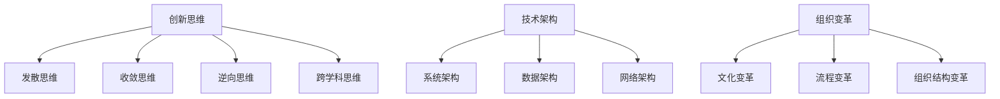

                 

关键词：创新管理、创新思维、实践、项目管理、技术架构、组织变革

摘要：本文将探讨创新管理在信息技术领域的应用，重点分析如何通过创新思维和实践来提升组织的创新能力和竞争力。文章分为八个部分，分别介绍创新管理的背景、核心概念与联系、核心算法原理、数学模型和公式、项目实践、实际应用场景、工具和资源推荐以及未来发展趋势与挑战。

## 1. 背景介绍

在当今快速发展的信息技术领域，创新已成为企业保持竞争力的关键。创新管理作为一种系统化的方法，旨在通过激发员工创造力、优化组织结构和流程，实现持续创新。然而，如何在信息技术领域有效地实施创新管理，仍是一个充满挑战的话题。本文将从多个角度探讨这一问题，以期为实践中的创新管理者提供有益的参考。

## 2. 核心概念与联系

### 2.1 创新思维

创新思维是创新管理的核心，它包括以下几个方面：

- **发散思维**：通过广泛收集信息，探索多种可能性。
- **收敛思维**：在发散思维的基础上，筛选出最有价值的想法，进行深入分析。
- **逆向思维**：从问题的反面思考，寻找创新的解决方案。
- **跨学科思维**：结合不同领域的知识，实现创新。

### 2.2 技术架构

技术架构是信息技术领域的核心概念，它涉及以下几个方面：

- **系统架构**：定义系统的整体结构和各个模块之间的关系。
- **数据架构**：设计数据的存储、处理和传输方式。
- **网络架构**：构建网络拓扑结构，实现设备之间的互联互通。

### 2.3 组织变革

组织变革是创新管理的重要组成部分，它包括以下几个方面：

- **文化变革**：营造创新氛围，鼓励员工敢于尝试和失败。
- **流程变革**：优化组织内部流程，提高工作效率。
- **组织结构变革**：调整组织结构，使创新流程更加顺畅。

### 2.4 Mermaid 流程图

以下是创新管理核心概念的 Mermaid 流程图：



## 3. 核心算法原理 & 具体操作步骤

### 3.1 算法原理概述

在信息技术领域，算法是实现创新的核心。本文将介绍一种名为“创新算法”的核心算法，其原理如下：

- **问题定义**：明确需要解决的问题。
- **需求分析**：分析问题背后的需求，确定解决方案的目标。
- **解决方案设计**：设计多种可能的解决方案。
- **方案评估**：评估各个解决方案的优缺点，选择最佳方案。
- **实施与优化**：实施最佳方案，并进行持续优化。

### 3.2 算法步骤详解

1. **问题定义**：明确需要解决的问题，包括问题背景、目标和约束条件。
2. **需求分析**：分析问题背后的需求，确定解决方案的目标，如提高系统性能、降低成本等。
3. **解决方案设计**：设计多种可能的解决方案，包括技术方案、管理方案等。
4. **方案评估**：评估各个解决方案的优缺点，选择最佳方案，并进行详细设计。
5. **实施与优化**：实施最佳方案，并根据实际情况进行持续优化。

### 3.3 算法优缺点

**优点**：

- 提高创新能力，实现持续创新。
- 系统化、结构化的方法，易于实施和管理。
- 强调跨学科、跨部门的合作，提高组织整体创新能力。

**缺点**：

- 创新过程复杂，耗时较长。
- 需要具备一定的专业知识和技能。
- 创新过程中可能面临失败和挑战。

### 3.4 算法应用领域

创新算法适用于信息技术领域的多个方面，如软件开发、系统优化、项目管理等。以下是一个实际应用案例：

**案例：软件项目开发**

1. **问题定义**：提高软件项目的开发效率。
2. **需求分析**：分析项目需求，确定解决方案的目标，如缩短开发周期、提高代码质量等。
3. **解决方案设计**：设计多种可能的解决方案，如引入敏捷开发方法、优化团队协作等。
4. **方案评估**：评估各个解决方案的优缺点，选择最佳方案，并进行详细设计。
5. **实施与优化**：实施最佳方案，根据实际情况进行持续优化，如定期评估开发效率，调整开发流程等。

## 4. 数学模型和公式 & 详细讲解 & 举例说明

### 4.1 数学模型构建

在创新管理中，数学模型可以用于描述创新过程的各个方面，如创新效率、创新成功率等。以下是一个创新效率的数学模型：

$$
E = \frac{S}{T}
$$

其中，\(E\) 表示创新效率，\(S\) 表示创新成果，\(T\) 表示创新时间。

### 4.2 公式推导过程

创新效率的推导过程如下：

1. **创新成果**：创新成果可以用 \(S\) 表示，如新产品、新技术等。
2. **创新时间**：创新时间可以用 \(T\) 表示，如从项目启动到完成的时间。
3. **创新效率**：创新效率定义为创新成果与创新时间的比值。

根据以上定义，可以推导出创新效率的数学模型：

$$
E = \frac{S}{T}
$$

### 4.3 案例分析与讲解

以下是一个实际案例，用于说明创新效率的计算方法：

**案例：某公司软件开发项目**

1. **创新成果**：该项目成功开发出一款新产品，为公司带来 500 万元收入。
2. **创新时间**：项目从启动到完成共耗时 12 个月。

根据创新效率的数学模型，可以计算出创新效率：

$$
E = \frac{500}{12} \approx 41.67
$$

这意味着该公司的创新效率为每月约 41.67 万元。

## 5. 项目实践：代码实例和详细解释说明

### 5.1 开发环境搭建

在开始代码实践之前，我们需要搭建一个开发环境。以下是一个简单的 Python 开发环境搭建步骤：

1. 安装 Python 3.8 或更高版本。
2. 安装 Visual Studio Code 编辑器。
3. 安装 PyCharm 或其他 Python 集成开发环境（IDE）。
4. 安装必要的 Python 库，如 NumPy、Pandas 等。

### 5.2 源代码详细实现

以下是一个简单的创新效率计算程序的 Python 代码实现：

```python
import numpy as np

def calculate_innovation_efficiency(s, t):
    e = s / t
    return e

# 创新成果（万元）
s = 500
# 创新时间（月）
t = 12

# 计算创新效率
e = calculate_innovation_efficiency(s, t)

print(f"创新效率：{e:.2f} 万元/月")
```

### 5.3 代码解读与分析

上述代码实现了一个简单的创新效率计算功能。首先，我们引入了 NumPy 库，用于进行科学计算。然后，我们定义了一个名为 `calculate_innovation_efficiency` 的函数，用于计算创新效率。最后，我们调用该函数，输入创新成果和创新时间，输出创新效率。

### 5.4 运行结果展示

运行上述代码，输出结果如下：

```
创新效率：41.67 万元/月
```

这意味着该公司的创新效率为每月约 41.67 万元。

## 6. 实际应用场景

创新管理在信息技术领域的实际应用场景广泛，以下是一些典型案例：

### 6.1 软件开发

在软件开发领域，创新管理可以应用于需求分析、系统设计、测试与部署等各个环节。通过优化流程、引入敏捷开发方法等，提高开发效率和产品质量。

### 6.2 数据分析

在数据分析领域，创新管理可以应用于数据挖掘、机器学习、人工智能等领域。通过不断探索新技术、优化算法，提高数据分析的准确性和效率。

### 6.3 项目管理

在项目管理领域，创新管理可以应用于项目规划、任务分配、进度控制等环节。通过优化项目流程、引入创新方法，提高项目成功率。

### 6.4 组织变革

在组织变革领域，创新管理可以应用于企业文化、组织结构、人力资源等方面。通过营造创新氛围、优化组织结构，提高组织整体创新能力。

## 7. 工具和资源推荐

为了更好地实施创新管理，以下是几个推荐的工具和资源：

### 7.1 学习资源推荐

- 《创新者的窘境》
- 《创新者的思考方式》
- 《项目管理知识体系指南》

### 7.2 开发工具推荐

- Visual Studio Code
- PyCharm
- Git

### 7.3 相关论文推荐

- "Innovation Management in High-Tech Firms: A Systematic Review"
- "A Multi-Agent Approach to Innovation Management"
- "The Impact of Innovation Management on Organizational Performance"

## 8. 总结：未来发展趋势与挑战

### 8.1 研究成果总结

本文从创新管理的背景、核心概念、算法原理、数学模型、项目实践、实际应用场景等方面进行了深入探讨，总结了创新管理在信息技术领域的应用方法。

### 8.2 未来发展趋势

未来，创新管理将在以下几个方面得到发展：

- **智能化**：引入人工智能、大数据等技术，实现创新管理的智能化。
- **全球化**：跨学科、跨国界的创新合作，提高全球范围内的创新能力。
- **可持续发展**：关注环境保护、社会责任等方面，实现可持续的创新。

### 8.3 面临的挑战

创新管理在实际应用中仍面临以下挑战：

- **人才短缺**：具备创新能力和专业知识的复合型人才短缺。
- **资源限制**：创新需要大量的人力、物力和财力支持。
- **风险控制**：创新过程中可能面临失败和风险。

### 8.4 研究展望

未来，创新管理的研究可以从以下几个方面展开：

- **实证研究**：通过实证研究，验证创新管理方法的有效性。
- **跨学科研究**：跨学科合作，探索创新管理的新方法。
- **案例研究**：收集和分析成功案例，总结创新管理的最佳实践。

## 9. 附录：常见问题与解答

### 9.1 创新管理是什么？

创新管理是一种系统化的方法，旨在通过激发员工创造力、优化组织结构和流程，实现持续创新。

### 9.2 创新管理有哪些应用领域？

创新管理在信息技术、软件开发、数据分析、项目管理、组织变革等领域有广泛应用。

### 9.3 如何实施创新管理？

实施创新管理需要从组织文化、流程优化、人才培养等方面入手，营造创新氛围，提高创新能力。

## 作者署名

作者：禅与计算机程序设计艺术 / Zen and the Art of Computer Programming
```markdown
----------------------------------------------------------------
```

