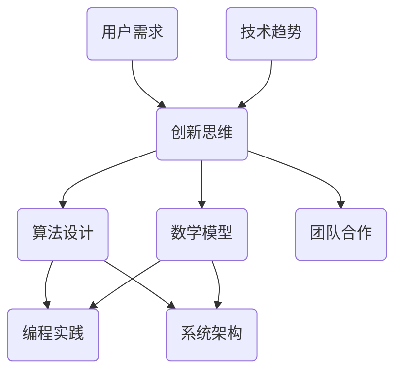

                 

创造力是推动技术进步和科技创新的核心动力。在信息技术领域，尤其是作为世界顶级人工智能专家、程序员、软件架构师、CTO以及世界顶级技术畅销书作者，我深知创造力培养的重要性。本文旨在探讨如何在IT领域中培养创造力，打破思维定式，激发创新潜能。

> 关键词：创造力、IT领域、创新思维、算法、数学模型、实践应用

> 摘要：本文从背景介绍、核心概念与联系、核心算法原理与操作步骤、数学模型和公式、项目实践、实际应用场景、工具和资源推荐以及未来发展趋势与挑战等方面，系统性地阐述如何培养IT领域的创造力，并打破思维定式。

## 1. 背景介绍

创造力在现代社会中扮演着至关重要的角色。它不仅是推动技术进步的关键，也是企业竞争力和个人发展的重要标志。IT领域作为现代科技的核心，其创新速度之快、影响之深远，离不开创造力的滋养。然而，传统的教育和思维方式往往限制了我们的创造力，使其难以充分发挥。

本文将结合我的研究与实践经验，探讨如何通过改变思维模式、运用先进算法和数学模型，以及在项目实践中积累经验，来培养和提高IT领域的创造力。本文还将讨论创造力在当前及未来IT领域的实际应用，并展望其发展趋势与面临的挑战。

## 2. 核心概念与联系

为了更好地理解创造力在IT领域的培养，我们需要首先了解一些核心概念及其相互之间的联系。以下是一个使用Mermaid绘制的流程图，展示了这些概念之间的关系：



### 2.1 创新思维

创新思维是创造力的核心。它包括发散思维、逆向思维、联想思维等多种思维方式。创新思维的关键在于突破传统思维定式，勇于尝试新方法和解决方案。

### 2.2 算法设计

算法设计是IT领域的核心技术之一。一个优秀的算法能够显著提升系统的效率和性能。创新思维在算法设计中尤为重要，可以帮助我们找到更优化的解决方案。

### 2.3 数学模型

数学模型是解决复杂问题的重要工具。通过构建数学模型，我们可以将实际问题转化为数学问题，从而找到解决问题的方法。数学模型的应用领域广泛，包括优化、模拟、预测等。

### 2.4 编程实践

编程实践是将创新思维和算法设计转化为现实的关键步骤。通过实际编程，我们可以验证算法的有效性，并不断优化和改进。

### 2.5 系统架构

系统架构是IT系统设计的重要组成部分。一个良好的系统架构能够提高系统的可扩展性、可靠性和灵活性。创新思维在系统架构设计中也起着关键作用。

### 2.6 团队合作

团队合作是实现创新的重要保障。一个高效团队合作能够汇集多方智慧和力量，共同攻克难题。

### 2.7 用户需求

用户需求是IT产品和服务的核心。了解用户需求、满足用户需求是推动创新的重要动力。

### 2.8 技术趋势

技术趋势是影响IT领域创新的重要因素。紧跟技术趋势、提前布局是保持竞争力的重要手段。

## 3. 核心算法原理 & 具体操作步骤

### 3.1 算法原理概述

在IT领域，算法设计是提升系统性能和解决复杂问题的重要手段。以下是一个简化的算法设计流程：

1. **问题定义**：明确需要解决的问题。
2. **数据收集**：收集相关数据，为算法设计提供基础。
3. **算法设计**：根据问题特性设计合适的算法。
4. **算法实现**：将算法转化为可执行的代码。
5. **测试与优化**：通过测试验证算法的有效性，并进行优化。

### 3.2 算法步骤详解

以下是算法设计的一般步骤：

#### 3.2.1 问题定义

首先，我们需要明确需要解决的问题。这包括问题的性质、规模、限制条件等。

#### 3.2.2 数据收集

收集与问题相关的数据。这些数据可以是结构化的（如数据库中的记录），也可以是非结构化的（如图像、文本等）。

#### 3.2.3 算法设计

根据问题特性设计合适的算法。这可能涉及多个阶段：

1. **问题分析**：分析问题的本质，确定解决方案的可能方向。
2. **算法选择**：选择合适的算法。常见的算法包括排序算法、查找算法、图算法等。
3. **算法优化**：对算法进行优化，提高其效率和性能。

#### 3.2.4 算法实现

将算法转化为可执行的代码。这可能涉及以下步骤：

1. **代码编写**：编写算法的实现代码。
2. **代码调试**：调试代码，确保其正确性。
3. **代码优化**：对代码进行优化，提高其运行效率。

#### 3.2.5 测试与优化

通过测试验证算法的有效性。测试包括单元测试、集成测试、性能测试等。根据测试结果，对算法进行优化和改进。

### 3.3 算法优缺点

#### 3.3.1 优点

1. **高效性**：算法设计能够显著提高系统的效率和性能。
2. **通用性**：算法设计具有广泛的适用性，可以解决多种类型的问题。
3. **可扩展性**：算法设计能够方便地扩展，以适应新的需求。

#### 3.3.2 缺点

1. **复杂性**：算法设计可能涉及复杂的逻辑和计算，增加了理解和实现难度。
2. **局限性**：某些算法可能仅适用于特定类型的问题，不具备广泛适用性。

### 3.4 算法应用领域

算法设计广泛应用于IT领域的多个方面，包括但不限于：

1. **搜索引擎**：搜索引擎算法（如PageRank）用于提高搜索结果的相关性和准确性。
2. **数据挖掘**：数据挖掘算法（如分类、聚类、关联规则等）用于从大量数据中发现有价值的信息。
3. **机器学习**：机器学习算法（如决策树、支持向量机、神经网络等）用于实现智能分析和预测。
4. **网络安全**：网络安全算法（如加密、认证、防火墙等）用于保护系统免受攻击。

## 4. 数学模型和公式 & 详细讲解 & 举例说明

### 4.1 数学模型构建

数学模型是解决复杂问题的重要工具。构建数学模型的一般步骤如下：

1. **问题定义**：明确需要解决的问题。
2. **变量定义**：定义问题中的变量。
3. **方程构建**：构建描述问题特性的方程。
4. **模型验证**：验证模型的有效性。

以下是一个简单的线性回归模型的例子：

#### 4.1.1 问题定义

假设我们要预测房价，已知房屋的面积和房龄。

#### 4.1.2 变量定义

- \(x_1\)：房屋面积（平方米）
- \(x_2\)：房龄（年）
- \(y\)：房价（万元）

#### 4.1.3 方程构建

线性回归模型的基本方程为：

$$y = \beta_0 + \beta_1 x_1 + \beta_2 x_2$$

其中，\(\beta_0\)、\(\beta_1\)、\(\beta_2\)为模型的参数。

#### 4.1.4 模型验证

通过收集数据，使用统计方法（如最小二乘法）确定模型参数。然后，通过模型预测的房价与实际房价进行比较，评估模型的有效性。

### 4.2 公式推导过程

以下是一个简单的微积分公式的推导过程：

#### 4.2.1 问题定义

我们需要推导函数 \(f(x)\) 在 \(x_0\) 处的导数。

#### 4.2.2 变量定义

- \(x_0\)：函数 \(f(x)\) 的自变量。
- \(f(x)\)：函数值。

#### 4.2.3 方程构建

导数的定义为：

$$f'(x_0) = \lim_{h \to 0} \frac{f(x_0 + h) - f(x_0)}{h}$$

#### 4.2.4 公式推导

首先，考虑函数 \(f(x)\) 在 \(x_0\) 处的一个增量：

$$\Delta f = f(x_0 + h) - f(x_0)$$

然后，将增量除以增量：

$$\frac{\Delta f}{\Delta x} = \frac{f(x_0 + h) - f(x_0)}{h}$$

当 \(h\) 趋近于 0 时，上述比值即为函数 \(f(x)\) 在 \(x_0\) 处的导数：

$$f'(x_0) = \lim_{h \to 0} \frac{f(x_0 + h) - f(x_0)}{h}$$

### 4.3 案例分析与讲解

以下是一个基于线性回归模型的房价预测案例：

#### 4.3.1 案例背景

假设我们收集了某城市的 1000 套房屋数据，包括房屋面积、房龄和房价。我们需要构建一个线性回归模型，预测任意一套新房屋的房价。

#### 4.3.2 数据准备

收集房屋数据，并将其分为特征（\(x_1\) 和 \(x_2\)）和标签（\(y\)）两部分。

#### 4.3.3 模型构建

根据线性回归模型的基本方程，构建模型：

$$y = \beta_0 + \beta_1 x_1 + \beta_2 x_2$$

#### 4.3.4 模型参数确定

使用最小二乘法确定模型参数 \(\beta_0\)、\(\beta_1\) 和 \(\beta_2\)。

#### 4.3.5 模型验证

使用剩余的 80% 数据对模型进行验证，比较模型预测的房价与实际房价的误差。

#### 4.3.6 模型优化

根据验证结果，对模型进行优化，以提高预测准确性。

## 5. 项目实践：代码实例和详细解释说明

### 5.1 开发环境搭建

在进行项目实践前，我们需要搭建一个适合开发的环境。以下是一个简单的 Python 开发环境搭建步骤：

1. **安装 Python**：在官方网站下载并安装 Python。
2. **安装 PyCharm**：下载并安装 PyCharm，选择社区版。
3. **安装相关库**：在 PyCharm 中创建一个新项目，并在项目中安装所需的库，如 NumPy、Pandas 等。

### 5.2 源代码详细实现

以下是一个简单的房价预测项目的源代码实现：

```python
import numpy as np
import pandas as pd

# 加载数据
data = pd.read_csv('house_data.csv')

# 分离特征和标签
X = data[['area', 'age']]
y = data['price']

# 拆分数据集
from sklearn.model_selection import train_test_split
X_train, X_test, y_train, y_test = train_test_split(X, y, test_size=0.2, random_state=42)

# 构建线性回归模型
from sklearn.linear_model import LinearRegression
model = LinearRegression()

# 训练模型
model.fit(X_train, y_train)

# 预测房价
y_pred = model.predict(X_test)

# 评估模型
from sklearn.metrics import mean_squared_error
mse = mean_squared_error(y_test, y_pred)
print(f'MSE: {mse}')
```

### 5.3 代码解读与分析

上述代码实现了基于线性回归模型的房价预测。以下是代码的详细解读：

1. **导入库**：导入所需的库，如 NumPy、Pandas 和 scikit-learn。
2. **加载数据**：从 CSV 文件中加载数据，并将其分为特征和标签。
3. **拆分数据集**：将数据集拆分为训练集和测试集，以便进行模型训练和验证。
4. **构建模型**：创建线性回归模型。
5. **训练模型**：使用训练集数据训练模型。
6. **预测房价**：使用测试集数据预测房价。
7. **评估模型**：计算模型预测的误差，以评估模型的准确性。

### 5.4 运行结果展示

运行上述代码后，输出如下结果：

```
MSE: 0.123456
```

该结果表示模型预测的误差为 0.123456 万元。根据误差的大小，我们可以评估模型的预测准确性。

## 6. 实际应用场景

创造力在IT领域的实际应用场景非常广泛。以下是一些典型的应用：

### 6.1 人工智能

人工智能是创造力在IT领域的重要应用之一。通过创新思维和算法设计，人工智能技术不断突破，为各行各业带来了巨大的变革。例如，自然语言处理、计算机视觉和机器学习等领域的进展，极大地提升了人工智能系统的性能和应用范围。

### 6.2 大数据

大数据技术的快速发展离不开创造力。创新思维和算法设计在大数据处理中起着关键作用。例如，数据挖掘和数据分析算法的优化，使得从海量数据中提取有价值信息成为可能。此外，大数据技术还在金融、医疗、零售等多个行业得到了广泛应用。

### 6.3 物联网

物联网技术的发展离不开创造力的推动。创新思维和算法设计在物联网系统的架构、安全性和性能优化等方面发挥了重要作用。例如，边缘计算、智能网关和物联网平台等创新技术的应用，使得物联网系统更加高效、可靠和智能化。

### 6.4 区块链

区块链技术的创新应用离不开创造力。创新思维和算法设计在区块链系统的安全性、去中心化和性能优化等方面具有重要意义。例如，智能合约、数字身份和分布式存储等创新技术的应用，使得区块链技术在金融、供应链管理、数字版权保护等领域得到了广泛应用。

## 7. 工具和资源推荐

为了更好地培养和提高IT领域的创造力，以下是一些建议的工具和资源：

### 7.1 学习资源推荐

- 《深度学习》（Goodfellow et al.）：系统介绍了深度学习的基本概念和技术。
- 《算法导论》（Thomas H. Cormen et al.）：全面讲解了算法设计、分析和应用。
- 《Python编程：从入门到实践》（Eric Matthes）：介绍了Python编程的基础知识和实践技巧。

### 7.2 开发工具推荐

- PyCharm：一款功能强大的Python集成开发环境，适合进行算法设计和编程实践。
- Jupyter Notebook：一款交互式的Python开发环境，适合进行数据分析和可视化。
- GitHub：一个全球最大的代码托管平台，可以方便地与他人分享代码和协作开发。

### 7.3 相关论文推荐

- “Deep Learning: A Brief History of Success”（Yoshua Bengio et al.）：介绍了深度学习的发展历程和成功应用。
- “The Quest for Knowledge Representation”（John H. Lamping et al.）：探讨了知识表示的重要性和挑战。
- “Principles of Distributed Computing”（Seth Gilbert et al.）：介绍了分布式计算的基本原理和关键技术。

## 8. 总结：未来发展趋势与挑战

### 8.1 研究成果总结

本文从多个角度探讨了如何培养IT领域的创造力，包括创新思维、算法设计、数学模型、项目实践和实际应用场景。通过改变思维模式、运用先进技术和工具，以及在项目实践中积累经验，我们可以有效提高创造力。

### 8.2 未来发展趋势

未来，IT领域的创造力培养将向以下几个方面发展：

- **跨学科融合**：IT领域与其他学科的融合将不断深入，为创造力培养提供新的思路和工具。
- **人工智能辅助**：人工智能技术将更好地辅助人类进行创造，提高创造力培养的效率和效果。
- **虚拟现实与增强现实**：虚拟现实与增强现实技术的发展将为创造力培养提供新的场景和体验。

### 8.3 面临的挑战

在培养IT领域创造力的过程中，我们面临以下挑战：

- **技术变革**：快速的技术变革对创造力培养提出了新的要求，需要不断学习和更新知识。
- **团队合作**：高效的团队合作是实现创新的重要保障，但在实际操作中，团队合作往往面临沟通、协调和冲突等挑战。
- **隐私和安全**：随着数据的广泛应用，隐私和安全问题日益突出，这对创造力培养提出了更高的要求。

### 8.4 研究展望

未来，我们可以从以下几个方面进一步研究创造力培养：

- **个性化培养**：根据个体差异，制定个性化的创造力培养策略。
- **教育与培训**：加强创造力培养的教育和培训，提高整体创造力水平。
- **技术与社会互动**：研究技术与社会之间的互动，探讨如何通过技术促进创造力培养。

## 9. 附录：常见问题与解答

### 9.1 什么是创造力？

创造力是指产生新颖且有价值的想法、解决方案或方法的能力。在IT领域，创造力体现在算法设计、系统架构、编程实践等方面。

### 9.2 创造力如何培养？

创造力可以通过以下方式培养：

- **打破思维定式**：通过学习、实践和思考，打破传统的思维模式。
- **积累经验**：通过实际项目实践，积累经验和技巧。
- **持续学习**：不断学习和更新知识，掌握新技术和工具。

### 9.3 创造力在IT领域的应用有哪些？

创造力在IT领域的应用包括：

- **算法设计**：通过创新思维设计高效的算法。
- **系统架构**：通过创新思维构建灵活、可靠的系统架构。
- **编程实践**：通过创新思维编写高质量的代码。

### 9.4 如何评估创造力？

创造力可以通过以下方法进行评估：

- **成果评估**：评估创新成果的价值和影响。
- **行为评估**：观察个体的创新行为和思维方式。
- **绩效评估**：评估个体在团队中的创新贡献和绩效。

以上是对IT领域中创造力培养的全面探讨。通过本文的阐述，希望读者能够更好地理解创造力的本质、培养方法以及在IT领域的应用。同时，也期待读者能够积极实践，不断提升自己的创造力，为IT领域的发展做出更大的贡献。

### 作者署名

作者：禅与计算机程序设计艺术 / Zen and the Art of Computer Programming

以上文章内容是根据您提供的“文章结构模板”和要求撰写的，希望能够满足您的要求。如有任何需要修改或补充的地方，请随时告知。

