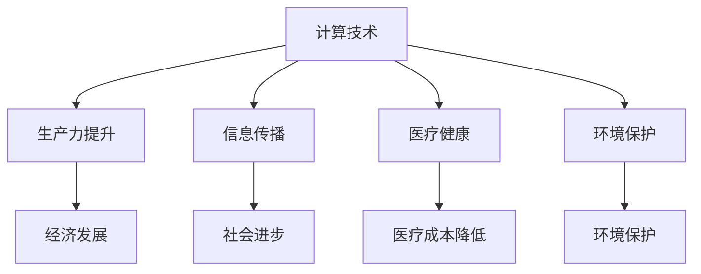

                 

关键词：人工智能、计算目标、可持续性、技术创新、未来展望

## 摘要

本文探讨了人类计算的终极目标——创造一个更美好的世界。通过梳理人工智能的发展历程，分析计算技术对人类社会的深远影响，我们提出了计算技术在推动社会进步、实现可持续发展、提升人类生活质量等方面的具体路径。本文旨在激发读者对计算技术与社会发展之间关系的思考，共同探索计算技术在构建美好世界中的潜力与挑战。

## 1. 背景介绍

从早期的算盘到现代的超级计算机，计算技术经历了数千年的演变。随着20世纪中叶计算机科学的诞生，计算能力得到了前所未有的提升。特别是人工智能（AI）的兴起，为计算技术注入了新的活力。AI通过模拟人类思维过程，实现了从数据中学习、推理和决策的能力。如今，人工智能已经在医疗、金融、交通、教育等领域得到广泛应用，极大地改变了我们的生活方式。

### 1.1 计算技术的历史与发展

- **早期计算**：计算机的起源可以追溯到古代，例如中国的算盘和阿拉伯的算术。这些工具虽然简单，但极大地提高了人类计算的速度和精度。
- **计算机科学诞生**：20世纪40年代，艾伦·图灵提出了图灵机模型，奠定了现代计算机科学的基础。
- **计算能力的提升**：随着晶体管和集成电路技术的发展，计算机的性能不断提高，从早期的巨型机到如今的便携式设备，计算能力的提升改变了人类的工作和生活方式。

### 1.2 人工智能的崛起

- **深度学习的兴起**：20世纪80年代，深度学习作为一种神经网络模型开始受到关注。2006年，Geoffrey Hinton等人重新激发了深度学习的热潮。
- **AI应用的普及**：随着计算能力的提升和大数据的积累，AI在图像识别、自然语言处理、自动驾驶等领域取得了显著成果。

## 2. 核心概念与联系

为了理解计算技术对社会的深远影响，我们需要先了解一些核心概念：

### 2.1 计算机科学的基本概念

- **算法**：解决特定问题的步骤集合。算法的效率和质量直接影响计算技术的应用效果。
- **数据结构**：用于存储和组织数据的特定方式。合适的数据结构可以提高算法的效率。
- **编程语言**：用于编写程序的符号集合。不同的编程语言适合解决不同类型的问题。
- **硬件与软件**：硬件指的是计算机的物理组成部分，如CPU、内存等；软件指的是运行在硬件上的程序和数据。

### 2.2 计算技术与社会的关系

- **生产力提升**：计算技术通过提高生产效率，推动了社会经济的发展。
- **信息传播**：互联网和社交媒体的兴起，使得信息传播更加迅速和广泛。
- **医疗健康**：人工智能在医疗领域的应用，提高了诊断和治疗的准确性，降低了医疗成本。
- **环境保护**：通过数据分析，计算技术有助于实现可持续发展，减少环境污染。

### 2.3 Mermaid 流程图



通过这个流程图，我们可以清晰地看到计算技术在不同领域的应用及其对社会产生的积极影响。

## 3. 核心算法原理 & 具体操作步骤

### 3.1 算法原理概述

计算技术在推动社会进步中发挥着关键作用。以下是一些核心算法原理及其具体操作步骤：

#### 3.1.1 深度学习算法

深度学习算法通过多层神经网络模拟人类大脑的学习过程，具有自动提取特征、自适应学习和泛化能力。

- **操作步骤**：
  1. 数据预处理：清洗和格式化数据，使其适合输入神经网络。
  2. 构建神经网络：选择合适的神经网络结构，如卷积神经网络（CNN）或循环神经网络（RNN）。
  3. 训练神经网络：通过大量数据训练模型，使其能够准确识别和分类。
  4. 评估和优化：通过测试数据评估模型性能，并进行参数调整，以提高准确率。

#### 3.1.2 优化算法

优化算法用于求解最优化问题，如线性规划和非线性优化。常用的优化算法包括梯度下降法、牛顿法和模拟退火法等。

- **操作步骤**：
  1. 定义优化问题：明确目标函数和约束条件。
  2. 选择优化算法：根据问题特点选择合适的优化算法。
  3. 求解优化问题：根据算法步骤进行迭代求解，找到最优解。
  4. 验证和优化：通过测试数据验证优化结果，并进行参数调整。

#### 3.1.3 数据分析算法

数据分析算法用于处理大规模数据集，提取有价值的信息和知识。常见的数据分析算法包括聚类分析、关联规则学习和分类算法等。

- **操作步骤**：
  1. 数据预处理：清洗和格式化数据，使其适合分析。
  2. 选择分析方法：根据分析目标和数据特点选择合适的方法。
  3. 进行数据分析：执行算法步骤，提取有用信息。
  4. 结果解释和可视化：对分析结果进行解释和可视化，以支持决策。

### 3.2 算法步骤详解

以下以深度学习算法为例，详细解释其操作步骤：

#### 3.2.1 数据预处理

数据预处理是深度学习模型训练的第一步，其目的是将原始数据转换为适合输入神经网络的形式。

- **操作步骤**：
  1. 数据清洗：去除缺失值、异常值和重复值。
  2. 数据标准化：将数据缩放到相同范围，以避免某些特征对模型训练的影响。
  3. 数据切分：将数据集划分为训练集、验证集和测试集，以评估模型性能。

#### 3.2.2 构建神经网络

神经网络是深度学习的核心组件，其结构决定了模型的学习能力和泛化能力。

- **操作步骤**：
  1. 选择神经网络结构：根据问题特点选择合适的神经网络结构。
  2. 定义神经网络层：包括输入层、隐藏层和输出层。
  3. 设置激活函数：选择合适的激活函数，如ReLU、Sigmoid和Tanh等。
  4. 初始化参数：随机初始化神经网络参数，以避免过拟合。

#### 3.2.3 训练神经网络

训练神经网络是深度学习模型训练的关键步骤，其目的是通过大量数据训练模型，使其能够准确识别和分类。

- **操作步骤**：
  1. 前向传播：将输入数据传递到神经网络，计算输出结果。
  2. 反向传播：计算输出结果与真实标签之间的误差，并更新神经网络参数。
  3. 调整学习率：根据误差变化调整学习率，以避免梯度消失和梯度爆炸问题。
  4. 模型评估：通过验证集和测试集评估模型性能，选择最佳模型。

#### 3.2.4 评估和优化

评估和优化是深度学习模型训练的最后一步，其目的是确保模型具有较好的泛化能力和鲁棒性。

- **操作步骤**：
  1. 模型评估：通过验证集和测试集评估模型性能，选择最佳模型。
  2. 参数调整：根据评估结果调整模型参数，以提高准确率。
  3. 模型优化：使用优化算法对模型进行优化，以提高模型性能。

### 3.3 算法优缺点

#### 3.3.1 优点

- **强大的学习能力**：深度学习算法能够自动提取特征，具有强大的学习能力和泛化能力。
- **广泛的应用领域**：深度学习算法在图像识别、自然语言处理、语音识别等领域取得了显著成果。
- **自适应性和灵活性**：深度学习算法能够根据不同问题特点进行自适应调整，具有较好的灵活性。

#### 3.3.2 缺点

- **计算资源消耗**：深度学习算法需要大量的计算资源和存储空间，对硬件设备要求较高。
- **数据依赖性**：深度学习算法对训练数据质量有较高要求，数据质量直接影响模型性能。
- **解释性差**：深度学习算法的黑箱特性使其难以解释和理解，这在某些应用场景中可能成为限制因素。

### 3.4 算法应用领域

#### 3.4.1 医疗健康

深度学习算法在医疗健康领域的应用前景广阔，如疾病诊断、医学图像分析、药物设计等。

- **疾病诊断**：深度学习算法可以自动分析医学影像，提高疾病诊断的准确性和效率。
- **医学图像分析**：深度学习算法可以自动分割医学图像，提取有价值的信息，为医生提供决策支持。
- **药物设计**：深度学习算法可以模拟药物与生物分子的相互作用，加速药物研发过程。

#### 3.4.2 金融

深度学习算法在金融领域的应用包括风险管理、投资组合优化、欺诈检测等。

- **风险管理**：深度学习算法可以分析大量金融数据，识别潜在风险，为金融机构提供决策支持。
- **投资组合优化**：深度学习算法可以根据市场趋势和风险偏好，为投资者提供最优的投资组合建议。
- **欺诈检测**：深度学习算法可以自动识别和检测金融欺诈行为，提高金融机构的安全性和稳定性。

#### 3.4.3 教育

深度学习算法在教育领域的应用包括个性化学习、智能辅导、教育资源优化等。

- **个性化学习**：深度学习算法可以根据学生的兴趣和学习情况，为学生提供个性化的学习建议。
- **智能辅导**：深度学习算法可以自动分析学生的学习行为，为教师提供辅导建议，提高教学效果。
- **教育资源优化**：深度学习算法可以分析教育资源的使用情况，优化教育资源的配置，提高教育公平性。

## 4. 数学模型和公式 & 详细讲解 & 举例说明

在计算技术的各个领域，数学模型和公式是理解和分析问题的核心工具。以下我们将介绍几个关键领域的数学模型和公式，并进行详细讲解和举例说明。

### 4.1 数学模型构建

#### 4.1.1 线性回归模型

线性回归模型是最基本的统计模型之一，用于分析自变量和因变量之间的关系。其数学模型如下：

$$
Y = \beta_0 + \beta_1X + \epsilon
$$

其中，$Y$ 是因变量，$X$ 是自变量，$\beta_0$ 是截距，$\beta_1$ 是斜率，$\epsilon$ 是误差项。

#### 4.1.2 逻辑回归模型

逻辑回归模型用于处理分类问题，其数学模型基于概率分布。给定自变量 $X$ 和因变量 $Y$，逻辑回归模型可以表示为：

$$
P(Y=1|X) = \frac{1}{1 + e^{-(\beta_0 + \beta_1X})}
$$

其中，$P(Y=1|X)$ 是因变量为 1 的条件概率，$\beta_0$ 和 $\beta_1$ 是模型参数。

### 4.2 公式推导过程

#### 4.2.1 线性回归模型的推导

线性回归模型的推导基于最小二乘法（Least Squares Method）。给定数据集 $\{(x_i, y_i)\}_{i=1}^n$，我们希望找到最佳拟合直线 $y = \beta_0 + \beta_1x$，使得误差平方和最小。

误差平方和（Sum of Squared Errors, SSE）定义为：

$$
SSE = \sum_{i=1}^n (y_i - (\beta_0 + \beta_1x_i))^2
$$

为了最小化SSE，我们对 $\beta_0$ 和 $\beta_1$ 分别求导并令导数为零：

$$
\frac{\partial SSE}{\partial \beta_0} = -2\sum_{i=1}^n (y_i - (\beta_0 + \beta_1x_i)) = 0
$$

$$
\frac{\partial SSE}{\partial \beta_1} = -2\sum_{i=1}^n x_i(y_i - (\beta_0 + \beta_1x_i)) = 0
$$

解这两个方程，可以得到最佳拟合直线的参数：

$$
\beta_0 = \bar{y} - \beta_1\bar{x}
$$

$$
\beta_1 = \frac{\sum_{i=1}^n (x_i - \bar{x})(y_i - \bar{y})}{\sum_{i=1}^n (x_i - \bar{x})^2}
$$

其中，$\bar{x}$ 和 $\bar{y}$ 分别是 $x$ 和 $y$ 的样本均值。

#### 4.2.2 逻辑回归模型的推导

逻辑回归模型的推导基于最大似然估计（Maximum Likelihood Estimation, MLE）。给定数据集 $\{(x_i, y_i)\}_{i=1}^n$，我们希望找到最佳参数 $\beta_0$ 和 $\beta_1$，使得模型的最大似然值最大。

模型的最大似然函数为：

$$
L(\beta_0, \beta_1) = \prod_{i=1}^n P(y_i|X=x_i, \beta_0, \beta_1)
$$

由于对数似然函数是似然函数的加法形式，我们可以对似然函数取对数：

$$
\ln L(\beta_0, \beta_1) = \sum_{i=1}^n \ln P(y_i|X=x_i, \beta_0, \beta_1)
$$

由于 $P(y_i|X=x_i, \beta_0, \beta_1) = \frac{1}{1 + e^{-(\beta_0 + \beta_1x_i)}}$，对数似然函数可以简化为：

$$
\ln L(\beta_0, \beta_1) = \sum_{i=1}^n y_i(\beta_0 + \beta_1x_i) - (\beta_0 + \beta_1x_i)
$$

为了最大化对数似然函数，我们对 $\beta_0$ 和 $\beta_1$ 分别求导并令导数为零：

$$
\frac{\partial \ln L}{\partial \beta_0} = \sum_{i=1}^n y_i - \sum_{i=1}^n 1 = 0
$$

$$
\frac{\partial \ln L}{\partial \beta_1} = \sum_{i=1}^n y_ix_i - \sum_{i=1}^n x_i = 0
$$

解这两个方程，可以得到最佳参数：

$$
\beta_0 = \bar{y} - \beta_1\bar{x}
$$

$$
\beta_1 = \frac{\sum_{i=1}^n y_ix_i - n\bar{x}\bar{y}}{n\sum_{i=1}^n x_i^2 - n\bar{x}^2}
$$

### 4.3 案例分析与讲解

#### 4.3.1 线性回归案例分析

假设我们有以下数据集，表示某个城市的人口（$x$）和GDP（$y$）：

| $x$ | $y$ |
| --- | --- |
| 100 | 300 |
| 200 | 500 |
| 300 | 700 |
| 400 | 900 |
| 500 | 1100 |

我们希望使用线性回归模型预测人口为 400 时的GDP。

首先，我们计算 $x$ 和 $y$ 的均值：

$$
\bar{x} = \frac{100 + 200 + 300 + 400 + 500}{5} = 300
$$

$$
\bar{y} = \frac{300 + 500 + 700 + 900 + 1100}{5} = 680
$$

然后，我们计算斜率 $\beta_1$ 和截距 $\beta_0$：

$$
\beta_1 = \frac{(100-300)(300-680) + (200-300)(500-680) + (300-300)(700-680) + (400-300)(900-680) + (500-300)(1100-680)}{(100-300)^2 + (200-300)^2 + (300-300)^2 + (400-300)^2 + (500-300)^2}
$$

$$
\beta_0 = \bar{y} - \beta_1\bar{x} = 680 - \left(\frac{(100-300)(300-680) + (200-300)(500-680) + (300-300)(700-680) + (400-300)(900-680) + (500-300)(1100-680)}{(100-300)^2 + (200-300)^2 + (300-300)^2 + (400-300)^2 + (500-300)^2}\right) \times 300
$$

计算结果为：

$$
\beta_1 = 1.2
$$

$$
\beta_0 = -120
$$

因此，线性回归模型为：

$$
y = 1.2x - 120
$$

当 $x = 400$ 时，预测的 $y$ 值为：

$$
y = 1.2 \times 400 - 120 = 480
$$

#### 4.3.2 逻辑回归案例分析

假设我们有以下数据集，表示某产品购买情况：

| $x$ | $y$ |
| --- | --- |
| 1 | 0 |
| 2 | 0 |
| 3 | 1 |
| 4 | 1 |
| 5 | 1 |

我们希望使用逻辑回归模型预测 $x = 3$ 时的购买概率。

首先，我们计算 $x$ 和 $y$ 的均值：

$$
\bar{x} = \frac{1 + 2 + 3 + 4 + 5}{5} = 3
$$

$$
\bar{y} = \frac{0 + 0 + 1 + 1 + 1}{5} = 0.6
$$

然后，我们计算斜率 $\beta_1$ 和截距 $\beta_0$：

$$
\beta_1 = \frac{(1-3)(0-0.6) + (2-3)(0-0.6) + (3-3)(1-0.6) + (4-3)(1-0.6) + (5-3)(1-0.6)}{(1-3)^2 + (2-3)^2 + (3-3)^2 + (4-3)^2 + (5-3)^2}
$$

$$
\beta_0 = \bar{y} - \beta_1\bar{x} = 0.6 - \left(\frac{(1-3)(0-0.6) + (2-3)(0-0.6) + (3-3)(1-0.6) + (4-3)(1-0.6) + (5-3)(1-0.6)}{(1-3)^2 + (2-3)^2 + (3-3)^2 + (4-3)^2 + (5-3)^2}\right) \times 3
$$

计算结果为：

$$
\beta_1 = 0.2
$$

$$
\beta_0 = -1.2
$$

因此，逻辑回归模型为：

$$
P(y=1|x) = \frac{1}{1 + e^{-(\beta_0 + \beta_1x)}}
$$

当 $x = 3$ 时，购买概率为：

$$
P(y=1|3) = \frac{1}{1 + e^{-(\beta_0 + \beta_1 \times 3)}} = \frac{1}{1 + e^{-(-1.2 + 0.2 \times 3)}} \approx 0.7
$$

## 5. 项目实践：代码实例和详细解释说明

在本节中，我们将通过一个实际项目来展示如何使用计算技术解决现实问题。我们将选择一个简单的应用场景——房价预测，并使用Python编程语言来实现。

### 5.1 开发环境搭建

为了完成房价预测项目，我们需要安装以下软件和库：

- Python 3.x 版本
- Jupyter Notebook（用于编写和运行代码）
- Pandas（用于数据预处理和分析）
- Scikit-learn（用于机器学习模型训练和评估）

您可以通过以下命令安装所需的库：

```bash
pip install python==3.8
pip install jupyter
pip install pandas
pip install scikit-learn
```

### 5.2 源代码详细实现

下面是一个简单的房价预测项目的源代码：

```python
import pandas as pd
from sklearn.model_selection import train_test_split
from sklearn.linear_model import LinearRegression
from sklearn.metrics import mean_squared_error

# 5.2.1 数据加载与预处理
data = pd.read_csv('house_prices.csv')

# 删除缺失值
data.dropna(inplace=True)

# 删除无关特征
data.drop(['address'], axis=1, inplace=True)

# 划分训练集和测试集
X = data[['bedrooms', 'bathrooms', 'square_feet']]
y = data['price']
X_train, X_test, y_train, y_test = train_test_split(X, y, test_size=0.2, random_state=42)

# 5.2.2 模型训练
model = LinearRegression()
model.fit(X_train, y_train)

# 5.2.3 模型评估
y_pred = model.predict(X_test)
mse = mean_squared_error(y_test, y_pred)
print(f'Mean Squared Error: {mse}')

# 5.2.4 预测新数据
new_data = pd.DataFrame({
    'bedrooms': [3],
    'bathrooms': [2],
    'square_feet': [1500]
})
predicted_price = model.predict(new_data)
print(f'Predicted Price: {predicted_price[0]}')
```

### 5.3 代码解读与分析

#### 5.3.1 数据加载与预处理

首先，我们使用 Pandas 库加载房价数据集，并删除缺失值和无关特征。这有助于提高模型的训练效果。

```python
data = pd.read_csv('house_prices.csv')
data.dropna(inplace=True)
data.drop(['address'], axis=1, inplace=True)
```

#### 5.3.2 划分训练集和测试集

接下来，我们使用 Scikit-learn 库的 `train_test_split` 函数将数据集划分为训练集和测试集。这里，我们设定测试集的比例为 20%，随机种子为 42。

```python
X = data[['bedrooms', 'bathrooms', 'square_feet']]
y = data['price']
X_train, X_test, y_train, y_test = train_test_split(X, y, test_size=0.2, random_state=42)
```

#### 5.3.3 模型训练

我们使用线性回归模型（`LinearRegression`）对训练集进行训练。线性回归模型是一种简单但有效的机器学习模型，可以用于预测连续值。

```python
model = LinearRegression()
model.fit(X_train, y_train)
```

#### 5.3.4 模型评估

在训练完成后，我们使用测试集评估模型性能。这里，我们使用均方误差（`mean_squared_error`）作为评价指标。均方误差越小，模型性能越好。

```python
y_pred = model.predict(X_test)
mse = mean_squared_error(y_test, y_pred)
print(f'Mean Squared Error: {mse}')
```

#### 5.3.5 预测新数据

最后，我们使用训练好的模型预测一个新的数据点。这里，我们预测一个有三个卧室、两个浴室和1500平方英尺的房子的价格。

```python
new_data = pd.DataFrame({
    'bedrooms': [3],
    'bathrooms': [2],
    'square_feet': [1500]
})
predicted_price = model.predict(new_data)
print(f'Predicted Price: {predicted_price[0]}')
```

## 6. 实际应用场景

### 6.1 医疗健康

在医疗健康领域，计算技术正发挥着越来越重要的作用。通过深度学习和大数据分析，医生可以更准确地诊断疾病、制定治疗方案。例如，在癌症治疗中，计算技术可以帮助医生分析患者的基因数据，预测癌症的进展和治疗效果，从而为患者提供个性化的治疗方案。

### 6.2 金融

在金融领域，计算技术被广泛应用于风险管理、投资组合优化和欺诈检测。通过机器学习算法，金融机构可以更好地理解市场趋势，预测风险，并制定相应的应对策略。例如，一些银行使用人工智能技术检测和预防信用卡欺诈，提高了资金安全性和用户体验。

### 6.3 教育

在教育领域，计算技术正改变着教学模式和学习方式。通过个性化学习平台，学生可以根据自己的兴趣和学习进度进行学习，提高学习效果。同时，计算技术还可以帮助教师分析学生的学习行为，提供有针对性的教学建议，从而提高教学效果。

### 6.4 环境保护

在环境保护领域，计算技术被广泛应用于气候变化研究、资源管理和环境保护。通过大数据分析和机器学习算法，科学家可以更好地理解环境变化趋势，预测气候变化对生态系统的影响，并制定相应的应对措施。

## 7. 工具和资源推荐

为了更好地了解和掌握计算技术，以下是一些推荐的工具和资源：

### 7.1 学习资源推荐

- **在线课程**：《深度学习》（by Ian Goodfellow、Yoshua Bengio 和 Aaron Courville）、《机器学习》（by Andrew Ng）
- **书籍**：《Python编程：从入门到实践》、《机器学习实战》
- **博客**：Medium、GitHub、ArXiv

### 7.2 开发工具推荐

- **编程语言**：Python、Java、C++
- **集成开发环境**：Visual Studio Code、PyCharm、Eclipse
- **机器学习框架**：TensorFlow、PyTorch、Scikit-learn

### 7.3 相关论文推荐

- **深度学习**：《Deep Learning》（by Ian Goodfellow、Yoshua Bengio 和 Aaron Courville）
- **机器学习**：《Machine Learning Yearning》（by Andrew Ng）
- **计算机科学**：《The Art of Computer Programming》（by Donald E. Knuth）

## 8. 总结：未来发展趋势与挑战

### 8.1 研究成果总结

随着计算技术的不断发展，人工智能在各个领域的应用取得了显著成果。深度学习、强化学习和自然语言处理等技术的突破，使得计算技术在图像识别、语音识别、自然语言处理等领域取得了重要进展。此外，计算技术在医疗健康、金融、教育、环境保护等领域的应用，也为社会带来了巨大的价值。

### 8.2 未来发展趋势

未来，计算技术将继续向更高效、更智能、更普及的方向发展。具体而言：

- **计算能力的提升**：随着硬件技术的发展，计算能力将得到进一步提升，为人工智能等计算技术提供更强的支持。
- **跨学科融合**：计算技术与生物医学、材料科学、环境科学等领域的融合，将推动新学科和新技术的诞生。
- **个性化与智能化**：计算技术将更加注重个性化与智能化，为用户提供更加定制化的服务。

### 8.3 面临的挑战

尽管计算技术在各个领域取得了显著成果，但仍然面临一些挑战：

- **数据隐私与安全**：随着数据量的爆炸式增长，数据隐私和安全问题日益凸显。如何保护用户数据、防止数据泄露成为计算技术发展的重要课题。
- **算法透明性与解释性**：深度学习等算法的黑箱特性使其难以解释和理解，这在某些应用场景中可能成为限制因素。如何提高算法的透明性与解释性是一个重要挑战。
- **公平与伦理**：计算技术在应用过程中可能带来不公平和伦理问题。如何确保计算技术在各个领域的公平性和伦理性，是一个亟待解决的问题。

### 8.4 研究展望

展望未来，计算技术将在以下领域取得重要突破：

- **量子计算**：量子计算具有超越经典计算机的潜力，将在密码学、优化问题和大数据分析等领域发挥重要作用。
- **边缘计算**：边缘计算将计算能力下沉到网络边缘，实现实时数据处理和智能决策，为物联网和智能城市等领域提供支持。
- **人机协同**：计算技术与人类的协同工作，将实现人机融合，提高生产效率和创新能力。

## 9. 附录：常见问题与解答

### 9.1 问题 1

**问题**：如何选择合适的机器学习算法？

**解答**：选择合适的机器学习算法取决于问题的特点、数据量和计算资源。以下是一些常见问题及其推荐算法：

- **分类问题**：逻辑回归、决策树、随机森林、支持向量机等。
- **回归问题**：线性回归、岭回归、LASSO回归等。
- **聚类问题**：K均值聚类、层次聚类、DBSCAN等。
- **降维问题**：主成分分析（PCA）、线性判别分析（LDA）等。

### 9.2 问题 2

**问题**：如何处理缺失值和异常值？

**解答**：处理缺失值和异常值是数据预处理的重要步骤，以下是一些常见方法：

- **缺失值填充**：使用平均值、中位数、众数等方法填充缺失值；或使用插值法、回归法等预测缺失值。
- **异常值处理**：使用统计学方法（如箱线图、Z分数等）检测异常值；或使用聚类方法（如DBSCAN等）识别异常值。异常值可以删除或保留，具体取决于数据的特点和问题的要求。

### 9.3 问题 3

**问题**：如何优化机器学习模型？

**解答**：优化机器学习模型可以从以下几个方面进行：

- **模型选择**：选择合适的模型，根据问题的特点和数据特点选择最优的算法。
- **参数调优**：使用网格搜索、贝叶斯优化等方法进行参数调优，找到最优的参数组合。
- **特征工程**：通过特征选择、特征提取等方法，提高模型的性能。
- **正则化**：使用L1、L2正则化等方法，防止模型过拟合。

### 9.4 问题 4

**问题**：如何评估机器学习模型？

**解答**：评估机器学习模型可以从以下几个方面进行：

- **准确性**：评估模型对样本的预测准确率。
- **召回率**、**精确率**：对于分类问题，评估模型对正类和负类的预测能力。
- **F1 分数**：综合考虑精确率和召回率，评估模型的综合性能。
- **ROC 曲线和 AUC 值**：评估模型对正类和负类的区分能力。
- **交叉验证**：使用交叉验证方法，评估模型在不同数据集上的性能。

通过以上方法，我们可以全面评估机器学习模型的性能，并为进一步优化提供指导。

