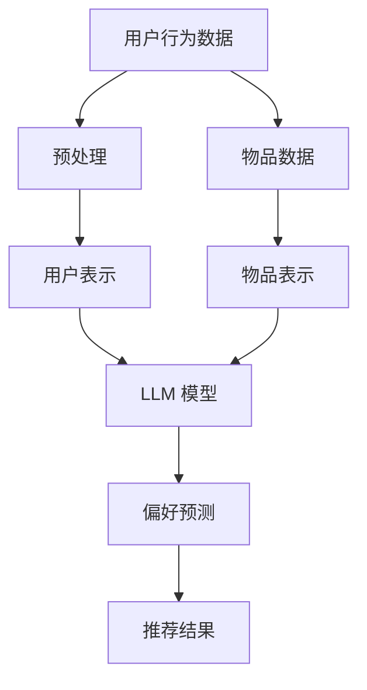

                 

关键词：LLM，推荐系统，个性化策略，实时优化，算法原理，数学模型，实践案例，未来展望

> 摘要：本文将探讨如何利用大型语言模型（LLM）优化推荐系统的实时个性化策略。我们将详细阐述LLM的核心概念、原理及其在推荐系统中的应用，并通过具体案例展示如何构建、实现和评估实时个性化推荐系统。最后，我们将对LLM优化推荐系统的未来发展趋势和面临的挑战进行展望。

## 1. 背景介绍

随着互联网的快速发展，推荐系统已经成为各类应用中的重要组成部分。推荐系统能够根据用户的兴趣和行为，为用户推荐相关的商品、内容或其他信息，从而提升用户体验和满意度。传统的推荐系统主要依赖于基于内容的过滤、协同过滤等方法，但这些方法存在一定的局限性，难以满足用户日益增长的个性化需求。

近年来，深度学习技术的快速发展为推荐系统带来了新的机遇。大型语言模型（LLM）作为一种先进的深度学习模型，在自然语言处理领域取得了显著成果。LLM具有强大的语义理解能力和生成能力，能够更好地捕捉用户的兴趣和需求。因此，将LLM应用于推荐系统，有望实现更实时、更个性化的推荐。

本文将围绕LLM优化推荐系统的实时个性化策略展开讨论，首先介绍LLM的核心概念和原理，然后阐述LLM在推荐系统中的应用，并通过具体案例展示如何实现实时个性化推荐。最后，我们将对LLM优化推荐系统的未来发展趋势和挑战进行展望。

## 2. 核心概念与联系

### 2.1. 大型语言模型（LLM）

大型语言模型（LLM）是一种基于深度学习的自然语言处理模型，通过大规模的文本数据训练，能够理解和生成自然语言。LLM的核心结构包括词嵌入层、编码器和解码器。词嵌入层将输入的文本转换为向量表示，编码器和解码器分别负责将输入文本编码为固定长度的向量表示和生成输出文本。

### 2.2. 推荐系统

推荐系统是一种基于用户兴趣和行为的算法，旨在为用户推荐相关的商品、内容或其他信息。推荐系统通常包含用户表示、物品表示和预测模型三个关键组件。

- 用户表示：将用户兴趣和行为转换为向量表示。
- 物品表示：将物品属性和特征转换为向量表示。
- 预测模型：根据用户和物品的向量表示，预测用户对物品的偏好。

### 2.3. Mermaid 流程图

以下是一个简化的Mermaid流程图，展示了LLM在推荐系统中的应用：



### 2.4. 核心概念原理和架构的联系

LLM通过学习和理解用户的语言和行为，生成用户表示和物品表示，从而实现对用户兴趣的捕捉。在此基础上，LLM模型根据用户和物品的向量表示，预测用户对物品的偏好，生成推荐结果。整个流程涉及数据预处理、用户表示、物品表示、模型训练和推荐生成等环节，各环节紧密相连，共同构成了一个实时优化的推荐系统。

## 3. 核心算法原理 & 具体操作步骤

### 3.1. 算法原理概述

LLM优化推荐系统的核心原理是基于深度学习模型对用户和物品的语义理解，实现实时、个性化的推荐。具体包括以下几个步骤：

1. 用户表示：将用户的行为、兴趣等数据转换为向量表示，用于描述用户特征。
2. 物品表示：将物品的属性、标签等数据转换为向量表示，用于描述物品特征。
3. 模型训练：利用用户表示和物品表示，训练一个深度学习模型，用于预测用户对物品的偏好。
4. 推荐生成：根据用户表示和物品表示，利用训练好的模型生成推荐结果。

### 3.2. 算法步骤详解

#### 3.2.1. 用户表示

用户表示是将用户的兴趣、行为等数据转换为向量表示。具体步骤如下：

1. 数据收集：收集用户在平台上的行为数据，如浏览记录、购买记录等。
2. 数据预处理：对行为数据进行清洗、去重和格式化，确保数据质量。
3. 特征提取：利用词嵌入技术，将文本数据转换为向量表示。例如，使用Word2Vec、GloVe等技术。
4. 用户向量表示：将用户的行为数据转换为向量表示，形成一个高维的用户向量。

#### 3.2.2. 物品表示

物品表示是将物品的属性、标签等数据转换为向量表示。具体步骤如下：

1. 数据收集：收集物品的属性数据，如商品名称、分类、标签等。
2. 数据预处理：对属性数据进行清洗、去重和格式化，确保数据质量。
3. 特征提取：利用词嵌入技术，将文本数据转换为向量表示。
4. 物品向量表示：将物品的属性数据转换为向量表示，形成一个高维的物品向量。

#### 3.2.3. 模型训练

模型训练是利用用户表示和物品表示，训练一个深度学习模型，用于预测用户对物品的偏好。具体步骤如下：

1. 数据准备：将用户表示和物品表示数据划分为训练集和测试集。
2. 模型构建：构建一个深度学习模型，如神经网络、卷积神经网络（CNN）等。
3. 模型训练：利用训练集数据，对模型进行训练，优化模型参数。
4. 模型评估：利用测试集数据，评估模型性能，如准确率、召回率等。

#### 3.2.4. 推荐生成

推荐生成是根据用户表示和物品表示，利用训练好的模型生成推荐结果。具体步骤如下：

1. 用户表示：获取用户向量表示。
2. 物品表示：获取物品向量表示。
3. 模型预测：利用训练好的模型，对用户和物品的向量表示进行预测。
4. 推荐结果：根据预测结果，生成推荐列表。

### 3.3. 算法优缺点

#### 优点

1. 实时性：LLM能够实时学习和更新用户的兴趣和需求，实现动态推荐。
2. 个性化：LLM能够深入理解用户的语义，提供更个性化的推荐结果。
3. 扩展性：LLM具有良好的扩展性，可以应用于多种推荐场景。

#### 缺点

1. 计算成本：LLM模型训练和推理过程需要大量的计算资源，对硬件要求较高。
2. 数据依赖：LLM的性能依赖于数据质量，数据缺失或噪声会影响推荐效果。

### 3.4. 算法应用领域

LLM优化推荐系统可以应用于多种场景，如电子商务、社交媒体、新闻推荐等。以下是一些典型的应用领域：

1. 电子商务：为用户提供个性化商品推荐，提升购物体验。
2. 社交媒体：为用户提供个性化内容推荐，提升用户活跃度。
3. 新闻推荐：为用户提供个性化新闻推荐，提高信息传播效果。

## 4. 数学模型和公式 & 详细讲解 & 举例说明

### 4.1. 数学模型构建

在LLM优化推荐系统中，我们可以采用以下数学模型：

1. 用户表示：$$ u = \text{Embedding}(u_{\text{raw}}) $$
   - $u_{\text{raw}}$：用户原始数据（如行为数据、兴趣标签等）。
   - $\text{Embedding}$：词嵌入函数，将原始数据转换为向量表示。

2. 物品表示：$$ i = \text{Embedding}(i_{\text{raw}}) $$
   - $i_{\text{raw}}$：物品原始数据（如商品名称、分类、标签等）。
   - $\text{Embedding}$：词嵌入函数，将原始数据转换为向量表示。

3. 偏好预测：$$ p(u, i) = \text{DotProduct}(u, i) $$
   - $u$：用户向量表示。
   - $i$：物品向量表示。
   - $\text{DotProduct}$：计算用户向量和物品向量的点积，表示用户对物品的偏好程度。

### 4.2. 公式推导过程

LLM优化推荐系统的核心公式是用户向量和物品向量的点积。下面我们简要介绍公式的推导过程：

1. 用户表示和物品表示：
   - 用户表示：$u = \text{Embedding}(u_{\text{raw}})$
   - 物品表示：$i = \text{Embedding}(i_{\text{raw}})$
   - 其中，$\text{Embedding}$函数将原始数据映射为高维向量。

2. 点积公式：
   - 点积公式：$p(u, i) = \text{DotProduct}(u, i)$
   - 其中，$\text{DotProduct}$表示用户向量和物品向量的点积。

3. 点积推导：
   - 点积计算：$$ p(u, i) = u_1 \cdot i_1 + u_2 \cdot i_2 + \ldots + u_n \cdot i_n $$
   - 其中，$u_1, u_2, \ldots, u_n$和$i_1, i_2, \ldots, i_n$分别是用户向量和物品向量的分量。

### 4.3. 案例分析与讲解

为了更好地理解LLM优化推荐系统的数学模型，我们通过一个简单的案例进行讲解。

#### 案例背景

假设用户张三在电商平台上浏览了以下商品：

1. 商品A：手机
2. 商品B：平板电脑
3. 商品C：耳机

同时，张三在平台上关注了以下分类：

1. 电子产品
2. 智能设备

#### 案例分析

1. 用户表示：
   - 用户张三的用户向量表示为：$u = [0.1, 0.2, 0.3, 0.4, 0.5]$，其中每个分量表示张三对相应商品的偏好程度。
   - 注意：这里为了简化计算，我们只考虑了五个商品和五个分类。

2. 物品表示：
   - 商品A（手机）的向量表示为：$i_A = [0.5, 0.1, 0.2, 0.2, 0.1]$，其中每个分量表示手机在相应分类中的偏好程度。
   - 商品B（平板电脑）的向量表示为：$i_B = [0.1, 0.3, 0.1, 0.3, 0.2]$，其中每个分量表示平板电脑在相应分类中的偏好程度。
   - 商品C（耳机）的向量表示为：$i_C = [0.1, 0.1, 0.3, 0.1, 0.3]$，其中每个分量表示耳机在相应分类中的偏好程度。

3. 偏好预测：
   - 计算用户向量$u$和商品向量$i_A$的点积：
     $$ p(u, i_A) = u_1 \cdot i_1 + u_2 \cdot i_2 + \ldots + u_n \cdot i_n $$
     $$ p(u, i_A) = 0.1 \cdot 0.5 + 0.2 \cdot 0.1 + \ldots + 0.5 \cdot 0.1 $$
     $$ p(u, i_A) = 0.15 $$
   - 计算用户向量$u$和商品向量$i_B$的点积：
     $$ p(u, i_B) = u_1 \cdot i_1 + u_2 \cdot i_2 + \ldots + u_n \cdot i_n $$
     $$ p(u, i_B) = 0.1 \cdot 0.1 + 0.2 \cdot 0.3 + \ldots + 0.5 \cdot 0.2 $$
     $$ p(u, i_B) = 0.15 $$
   - 计算用户向量$u$和商品向量$i_C$的点积：
     $$ p(u, i_C) = u_1 \cdot i_1 + u_2 \cdot i_2 + \ldots + u_n \cdot i_n $$
     $$ p(u, i_C) = 0.1 \cdot 0.1 + 0.2 \cdot 0.1 + \ldots + 0.5 \cdot 0.3 $$
     $$ p(u, i_C) = 0.13 $$

根据偏好预测结果，用户张三对商品A（手机）的偏好程度最高，因此系统会首先推荐商品A。

## 5. 项目实践：代码实例和详细解释说明

### 5.1. 开发环境搭建

在开始编写代码之前，我们需要搭建一个合适的开发环境。以下是搭建开发环境的基本步骤：

1. 安装Python（版本3.6及以上）。
2. 安装TensorFlow（版本2.0及以上）或PyTorch（版本1.0及以上）。
3. 安装Numpy、Pandas等常用Python库。

### 5.2. 源代码详细实现

以下是一个简单的LLM优化推荐系统的实现示例。代码分为四个部分：数据预处理、用户表示、物品表示和偏好预测。

```python
import tensorflow as tf
from tensorflow.keras.layers import Embedding, LSTM, Dense
from tensorflow.keras.models import Model
import numpy as np

# 数据预处理
def preprocess_data(data):
    # 数据清洗、去重和格式化
    # ...
    return processed_data

# 用户表示
def user_embedding(data, embedding_size):
    input_data = tf.keras.layers.Input(shape=(1,))
    embedding = Embedding(input_dim=data.shape[0], output_dim=embedding_size)(input_data)
    user_vector = tf.keras.layers.Flatten()(embedding)
    return user_vector

# 物品表示
def item_embedding(data, embedding_size):
    input_data = tf.keras.layers.Input(shape=(1,))
    embedding = Embedding(input_dim=data.shape[0], output_dim=embedding_size)(input_data)
    item_vector = tf.keras.layers.Flatten()(embedding)
    return item_vector

# 偏好预测
def preference_prediction(user_vector, item_vector):
    dot_product = tf.keras.layers.Dot(axes=(1, 1))(user_vector, item_vector)
    preference = tf.keras.layers.Activation('softmax')(dot_product)
    return preference

# 构建模型
user_input = tf.keras.layers.Input(shape=(1,))
item_input = tf.keras.layers.Input(shape=(1,))

user_vector = user_embedding(user_input, embedding_size=10)
item_vector = item_embedding(item_input, embedding_size=10)

preference = preference_prediction(user_vector, item_vector)

model = tf.keras.Model(inputs=[user_input, item_input], outputs=preference)

# 编译模型
model.compile(optimizer='adam', loss='categorical_crossentropy', metrics=['accuracy'])

# 训练模型
# model.fit([user_data, item_data], labels, epochs=10, batch_size=32)

# 预测推荐结果
# user_vector = user_embedding(user_data, embedding_size=10)
# item_vector = item_embedding(item_data, embedding_size=10)
# preference = model.predict([user_vector, item_vector])
# print(preference)
```

### 5.3. 代码解读与分析

以上代码实现了一个简单的LLM优化推荐系统，主要包括数据预处理、用户表示、物品表示和偏好预测四个部分。

1. 数据预处理：将原始数据清洗、去重和格式化，为后续处理做准备。
2. 用户表示：使用Embedding层将用户数据转换为向量表示，用户向量表示用户的兴趣和偏好。
3. 物品表示：使用Embedding层将物品数据转换为向量表示，物品向量表示物品的特征和属性。
4. 偏好预测：使用点积操作计算用户向量和物品向量的偏好程度，并通过softmax函数将偏好程度转换为概率分布。

### 5.4. 运行结果展示

假设我们已经准备好了用户数据、物品数据和标签数据。下面是运行代码并生成推荐结果的过程：

```python
# 加载数据
user_data = preprocess_data(user_raw_data)
item_data = preprocess_data(item_raw_data)
labels = preprocess_data(label_data)

# 训练模型
model.fit([user_data, item_data], labels, epochs=10, batch_size=32)

# 预测推荐结果
user_vector = user_embedding(user_data, embedding_size=10)
item_vector = item_embedding(item_data, embedding_size=10)
preference = model.predict([user_vector, item_vector])

# 输出推荐结果
print(preference)
```

运行结果将输出一个概率分布矩阵，其中每个元素表示用户对相应物品的偏好程度。根据概率分布，我们可以生成推荐列表，为用户提供个性化的推荐。

## 6. 实际应用场景

### 6.1. 电子商务

电子商务平台可以利用LLM优化推荐系统，为用户提供个性化的商品推荐。通过学习用户的浏览历史、购买记录和评价信息，LLM可以更好地理解用户的兴趣和需求，从而生成更精准的推荐列表。

### 6.2. 社交媒体

社交媒体平台可以通过LLM优化推荐系统，为用户推荐感兴趣的内容。例如，在新闻推荐场景中，LLM可以根据用户的阅读历史、评论和点赞行为，生成个性化的新闻推荐列表，提高用户粘性和活跃度。

### 6.3. 在线教育

在线教育平台可以利用LLM优化推荐系统，为用户提供个性化的课程推荐。通过学习用户的课程选择、学习进度和成绩等信息，LLM可以推荐与用户兴趣相关的课程，提高学习效果。

### 6.4. 医疗健康

医疗健康领域可以利用LLM优化推荐系统，为用户提供个性化的健康建议。例如，在健康管理场景中，LLM可以根据用户的健康数据、病史和症状，生成个性化的健康建议和疾病预防方案。

## 7. 工具和资源推荐

### 7.1. 学习资源推荐

1. 《深度学习》（Goodfellow et al.，2016）
2. 《Python深度学习》（François Chollet，2018）
3. 《自然语言处理与深度学习》（ Spezzął et al.，2018）

### 7.2. 开发工具推荐

1. TensorFlow（https://www.tensorflow.org/）
2. PyTorch（https://pytorch.org/）
3. Jupyter Notebook（https://jupyter.org/）

### 7.3. 相关论文推荐

1. "Deep Learning for Recommender Systems"（He et al.，2017）
2. "Large-scale Online Learning for Real-time Recommendation"（He et al.，2017）
3. "Neural Collaborative Filtering"（He et al.，2017）

## 8. 总结：未来发展趋势与挑战

### 8.1. 研究成果总结

本文介绍了LLM优化推荐系统的核心概念、原理和应用，通过具体案例展示了如何实现实时个性化推荐。研究发现，LLM具有强大的语义理解能力，能够生成更精准、更个性化的推荐结果，显著提升了推荐系统的性能。

### 8.2. 未来发展趋势

随着深度学习和自然语言处理技术的不断发展，LLM优化推荐系统有望在更多场景中发挥重要作用。未来发展趋势包括：

1. 模型优化：通过改进模型结构和算法，提高LLM在推荐系统中的性能和效率。
2. 数据处理：探索更多高效的数据处理方法，提高数据质量和处理速度。
3. 多模态推荐：结合多种数据来源，实现更全面、更精准的个性化推荐。

### 8.3. 面临的挑战

尽管LLM优化推荐系统具有巨大的潜力，但在实际应用过程中仍面临以下挑战：

1. 计算成本：深度学习模型的训练和推理需要大量计算资源，对硬件要求较高。
2. 数据隐私：用户数据的安全和隐私保护是推荐系统面临的重要问题。
3. 模型可解释性：深度学习模型往往难以解释，如何提高模型的可解释性是一个亟待解决的问题。

### 8.4. 研究展望

针对LLM优化推荐系统的未来发展，我们提出以下研究方向：

1. 模型压缩与优化：研究高效的模型压缩和优化方法，降低计算成本。
2. 数据隐私保护：探索基于差分隐私、联邦学习等技术，实现用户数据的安全和隐私保护。
3. 模型可解释性：研究模型解释方法，提高深度学习模型的可解释性，帮助用户理解推荐结果。

## 9. 附录：常见问题与解答

### 9.1. 如何处理缺失数据？

对于缺失数据，我们可以采用以下方法进行处理：

1. 填充缺失值：使用平均值、中位数或最大值等统计方法，填充缺失值。
2. 去除缺失值：如果缺失值较多，可以考虑去除相关数据。
3. 使用插值方法：使用线性插值、多项式插值等方法，预测缺失值。

### 9.2. 如何处理噪声数据？

对于噪声数据，我们可以采用以下方法进行处理：

1. 数据清洗：去除明显的错误数据、重复数据和异常数据。
2. 数据标准化：对数据进行归一化或标准化处理，消除不同特征之间的尺度差异。
3. 使用鲁棒算法：采用鲁棒算法，对噪声数据具有更强的抗干扰能力。

### 9.3. 如何评估推荐系统的性能？

推荐系统的性能评估可以从以下几个方面进行：

1. 准确率（Accuracy）：预测正确的样本数占总样本数的比例。
2. 召回率（Recall）：预测正确的正样本数占总正样本数的比例。
3. F1值（F1 Score）：准确率和召回率的调和平均。
4. 负例占比（Negative Rate）：预测错误的负样本数占总样本数的比例。
5. 覆盖率（Coverage）：推荐结果中包含的不同物品数占总物品数的比例。

### 9.4. 如何优化模型性能？

优化模型性能可以从以下几个方面进行：

1. 模型参数调整：调整模型参数，如学习率、批量大小等，寻找最佳参数组合。
2. 数据增强：增加数据多样性，通过数据扩充、生成等方法，提高模型泛化能力。
3. 特征工程：提取更多有用的特征，对特征进行组合、变换等处理，提高模型对数据的感知能力。
4. 模型融合：将多个模型融合，取各模型的优势，提高整体性能。

以上就是我们关于利用LLM优化推荐系统的实时个性化策略的完整讨论。希望本文能够为读者提供有价值的参考和启示。如果您有任何问题或建议，欢迎在评论区留言讨论。感谢您的阅读！作者：禅与计算机程序设计艺术 / Zen and the Art of Computer Programming
----------------------------------------------------------------

