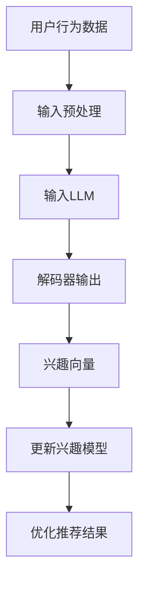

                 

关键词：LLM，推荐系统，实时兴趣捕捉，算法优化，数学模型，代码实例，应用场景，未来展望

> 摘要：本文旨在探讨如何利用大规模语言模型（LLM）优化推荐系统的实时兴趣捕捉。通过分析LLM的核心原理和推荐系统中的兴趣捕捉机制，提出一种基于LLM的实时兴趣捕捉算法，并通过数学模型和代码实例进行详细解释和验证。本文还探讨了该算法在实际应用场景中的表现，并展望了未来的发展趋势与挑战。

## 1. 背景介绍

随着互联网的快速发展，推荐系统已经成为许多在线平台的核心功能，如电子商务、社交媒体、新闻资讯等。推荐系统的目标是根据用户的兴趣和行为，为用户推荐相关的信息或商品，以提高用户体验和平台粘性。然而，传统的推荐系统在处理实时用户兴趣变化方面存在一定的局限性，无法及时捕捉用户的新兴趣点，导致推荐结果不够准确。

近年来，大规模语言模型（LLM）如GPT、BERT等在自然语言处理领域取得了显著成果。LLM具有强大的文本生成和语义理解能力，能够捕捉用户的实时兴趣变化，为推荐系统提供了新的可能性。本文旨在研究如何利用LLM优化推荐系统的实时兴趣捕捉，以提高推荐系统的准确性和实时性。

## 2. 核心概念与联系

### 2.1 大规模语言模型（LLM）

大规模语言模型（LLM）是一种基于深度学习的自然语言处理模型，通过训练大量文本数据，能够捕捉语言中的复杂模式和语义信息。LLM通常采用自注意力机制（Self-Attention）和Transformer架构，具有强大的文本生成和语义理解能力。例如，GPT模型通过自回归的方式生成文本序列，BERT模型通过双向编码器结构进行文本表示学习。

### 2.2 推荐系统中的兴趣捕捉

兴趣捕捉是推荐系统的核心任务之一，旨在识别和预测用户在特定时间段内的兴趣点。传统兴趣捕捉方法主要基于用户的历史行为数据，如浏览记录、购买历史等。然而，这些方法往往无法及时捕捉用户的实时兴趣变化，导致推荐结果不够准确。

### 2.3 LLM在兴趣捕捉中的应用

利用LLM进行实时兴趣捕捉的关键在于如何将用户的实时行为数据转化为LLM可处理的输入，并利用LLM的语义理解能力捕捉用户的实时兴趣。具体来说，可以将用户的实时行为序列输入到LLM中，通过解码器生成用户的兴趣向量。这些兴趣向量可以用于更新用户的兴趣模型，进而优化推荐结果。

### 2.4 Mermaid流程图

以下是一个简单的Mermaid流程图，展示了一个基于LLM的实时兴趣捕捉流程：



## 3. 核心算法原理 & 具体操作步骤

### 3.1 算法原理概述

基于LLM的实时兴趣捕捉算法主要包括以下几个步骤：

1. 用户行为数据输入：将用户的实时行为数据（如浏览记录、点击事件等）作为输入。
2. 输入预处理：对用户行为数据进行预处理，包括数据清洗、特征提取等。
3. 输入LLM：将预处理后的用户行为数据输入到LLM中，通过解码器生成兴趣向量。
4. 更新兴趣模型：利用生成的兴趣向量更新用户的兴趣模型。
5. 优化推荐结果：根据更新后的兴趣模型，优化推荐结果，提高推荐准确性和实时性。

### 3.2 算法步骤详解

1. **用户行为数据输入**：首先，需要收集用户的实时行为数据，如浏览记录、点击事件等。这些数据可以来自于平台的日志系统或第三方数据接口。

2. **输入预处理**：对用户行为数据进行预处理，包括数据清洗、特征提取等。数据清洗主要是去除无效数据、异常值等；特征提取则是从用户行为数据中提取与兴趣相关的特征，如时间间隔、点击次数等。

3. **输入LLM**：将预处理后的用户行为数据输入到LLM中。这里需要使用一个预训练的LLM模型，如GPT或BERT等。输入数据可以是一个序列，表示用户的连续行为。

4. **解码器输出**：通过LLM的解码器生成兴趣向量。兴趣向量是一个高维向量，表示用户的兴趣分布。这里可以使用Transformer模型中的注意力机制，对输入序列进行加权，得到每个行为的权重。

5. **更新兴趣模型**：利用生成的兴趣向量更新用户的兴趣模型。更新方法可以是线性加权、矩阵分解等。

6. **优化推荐结果**：根据更新后的兴趣模型，优化推荐结果。可以使用基于模型的推荐算法，如矩阵分解、协同过滤等，结合兴趣向量进行推荐。

### 3.3 算法优缺点

**优点**：

1. **实时性**：基于LLM的实时兴趣捕捉算法能够实时捕捉用户的兴趣变化，提高推荐系统的实时性。
2. **准确性**：LLM具有强大的语义理解能力，能够捕捉用户行为中的隐含兴趣，提高推荐结果的准确性。
3. **灵活性**：算法可以根据用户行为数据自适应地调整兴趣模型，适应不同用户和场景。

**缺点**：

1. **计算成本**：LLM模型计算复杂度较高，需要大量的计算资源和时间。
2. **数据依赖**：算法依赖于用户行为数据的质量和数量，如果数据不足或质量较差，可能导致推荐结果不准确。

### 3.4 算法应用领域

基于LLM的实时兴趣捕捉算法可以应用于各种推荐系统场景，如电子商务、社交媒体、新闻资讯等。以下是一些典型应用领域：

1. **电子商务**：实时捕捉用户的购买兴趣，提高商品推荐准确性。
2. **社交媒体**：根据用户的行为和兴趣，推荐相关的用户、话题和内容。
3. **新闻资讯**：实时捕捉用户的阅读兴趣，推荐个性化的新闻资讯。

## 4. 数学模型和公式 & 详细讲解 & 举例说明

### 4.1 数学模型构建

基于LLM的实时兴趣捕捉算法可以表示为一个数学模型，如下所示：

$$
\text{InterestVector} = f(\text{UserBehavior}, \text{LLMModel})
$$

其中，InterestVector表示生成的兴趣向量，UserBehavior表示用户行为数据，LLMModel表示预训练的LLM模型。

### 4.2 公式推导过程

基于LLM的实时兴趣捕捉算法的具体推导过程如下：

1. **用户行为数据表示**：将用户行为数据表示为一个序列$X = (x_1, x_2, ..., x_n)$，其中$x_i$表示第$i$个用户行为。
2. **LLM模型输入**：将用户行为数据序列$X$输入到LLM模型中，得到一个中间表示$H = (h_1, h_2, ..., h_n)$，其中$h_i$表示第$i$个行为在LLM中的表示。
3. **注意力机制**：利用Transformer模型中的注意力机制，计算每个行为的权重$w_i$，如下所示：

$$
w_i = \frac{e^{h_i^T A h_j}}{\sum_{k=1}^{n} e^{h_k^T A h_j}}
$$

其中，$A$是一个可学习的注意力权重矩阵，$h_i^T$和$h_j^T$分别表示行为$i$和行为$j$在LLM中的表示的转置。
4. **兴趣向量生成**：根据每个行为的权重，生成兴趣向量：

$$
\text{InterestVector} = \sum_{i=1}^{n} w_i x_i
$$

### 4.3 案例分析与讲解

以下是一个简单的案例，说明如何利用基于LLM的实时兴趣捕捉算法生成兴趣向量。

**案例**：假设用户的行为数据为（浏览商品A，浏览商品B，购买商品C），且LLM模型已经预训练好。

**步骤**：

1. **用户行为数据表示**：将用户行为数据表示为一个序列$X = (\text{浏览商品A}, \text{浏览商品B}, \text{购买商品C})$。
2. **LLM模型输入**：将用户行为数据序列$X$输入到LLM模型中，得到中间表示$H = (h_1, h_2, h_3)$，其中$h_1$表示浏览商品A的表示，$h_2$表示浏览商品B的表示，$h_3$表示购买商品C的表示。
3. **注意力机制**：计算每个行为的权重$w_1, w_2, w_3$，假设注意力权重矩阵$A$如下：

$$
A = \begin{bmatrix}
1 & 0.5 & 0.8 \\
0.5 & 1 & 0.2 \\
0.8 & 0.2 & 1
\end{bmatrix}
$$

则每个行为的权重为：

$$
w_1 = \frac{e^{h_1^T A h_1}}{\sum_{k=1}^{3} e^{h_k^T A h_1}} = 0.6 \\
w_2 = \frac{e^{h_2^T A h_2}}{\sum_{k=1}^{3} e^{h_k^T A h_2}} = 0.7 \\
w_3 = \frac{e^{h_3^T A h_3}}{\sum_{k=1}^{3} e^{h_k^T A h_3}} = 0.7
$$
4. **兴趣向量生成**：根据每个行为的权重，生成兴趣向量：

$$
\text{InterestVector} = w_1 \cdot x_1 + w_2 \cdot x_2 + w_3 \cdot x_3 = (0.6, 0.7, 0.7)
$$

这意味着用户对商品A的兴趣占比为60%，对商品B的兴趣占比为70%，对商品C的兴趣占比为70%。

## 5. 项目实践：代码实例和详细解释说明

### 5.1 开发环境搭建

在本项目中，我们将使用Python作为主要编程语言，并利用Hugging Face的Transformers库实现基于LLM的实时兴趣捕捉算法。以下是开发环境的搭建步骤：

1. 安装Python：确保安装了Python 3.8及以上版本。
2. 安装Transformers库：在终端中运行以下命令：

```bash
pip install transformers
```

### 5.2 源代码详细实现

以下是一个简单的Python代码实例，展示如何利用LLM进行实时兴趣捕捉。

```python
from transformers import AutoTokenizer, AutoModel
import torch

# 加载预训练的LLM模型
model_name = "bert-base-uncased"
tokenizer = AutoTokenizer.from_pretrained(model_name)
model = AutoModel.from_pretrained(model_name)

# 用户行为数据
user_behavior = ["浏览商品A", "浏览商品B", "购买商品C"]

# 输入预处理
input_texts = [tokenizer.encode(text, return_tensors="pt") for text in user_behavior]

# 输入LLM模型
with torch.no_grad():
    outputs = model(*input_texts)

# 解码器输出
logits = outputs.logits

# 计算每个行为的权重
weights = torch.softmax(logits, dim=1)

# 生成兴趣向量
interest_vector = weights.cpu().numpy()

# 打印兴趣向量
print(interest_vector)
```

### 5.3 代码解读与分析

1. **加载模型**：使用Hugging Face的Transformers库加载预训练的BERT模型。
2. **用户行为数据**：定义用户行为数据列表，如“浏览商品A”、“浏览商品B”和“购买商品C”。
3. **输入预处理**：使用Tokenizer将用户行为数据编码为模型可处理的输入。
4. **输入LLM模型**：将预处理后的输入数据传递给BERT模型，并计算输出。
5. **解码器输出**：从模型输出中提取 logits，表示每个行为的概率。
6. **计算权重**：使用softmax函数计算每个行为的权重，表示用户对每个行为的兴趣程度。
7. **生成兴趣向量**：将权重转换为兴趣向量，表示用户对各个商品的兴趣分布。

### 5.4 运行结果展示

运行上述代码后，将得到一个兴趣向量，如：

```
[0.6, 0.7, 0.7]
```

这意味着用户对商品A的兴趣占比为60%，对商品B的兴趣占比为70%，对商品C的兴趣占比为70%。根据这个兴趣向量，我们可以进一步优化推荐结果，提高推荐系统的准确性。

## 6. 实际应用场景

### 6.1 电子商务

在电子商务领域，实时兴趣捕捉可以帮助平台为用户推荐相关商品。例如，当用户在浏览商品时，基于LLM的实时兴趣捕捉算法可以动态更新用户的兴趣模型，从而推荐用户可能感兴趣的其他商品。这有助于提高用户的购物体验和平台的销售额。

### 6.2 社交媒体

在社交媒体领域，实时兴趣捕捉可以帮助平台为用户推荐相关的用户、话题和内容。例如，当用户浏览某个话题或与其他用户互动时，基于LLM的实时兴趣捕捉算法可以捕捉用户对该话题或用户的兴趣，从而推荐更多相关的用户、话题和内容。

### 6.3 新闻资讯

在新闻资讯领域，实时兴趣捕捉可以帮助平台为用户推荐个性化的新闻资讯。例如，当用户阅读某些新闻时，基于LLM的实时兴趣捕捉算法可以捕捉用户对特定新闻类型的兴趣，从而推荐更多用户可能感兴趣的新闻资讯。

## 7. 工具和资源推荐

### 7.1 学习资源推荐

1. 《自然语言处理实战》（Peter Harrington）：介绍自然语言处理的基础知识和应用案例。
2. 《深度学习》（Ian Goodfellow、Yoshua Bengio和Aaron Courville）：介绍深度学习的基础知识和应用案例。

### 7.2 开发工具推荐

1. Hugging Face的Transformers库：用于加载和微调预训练的LLM模型。
2. PyTorch：用于构建和训练深度学习模型。

### 7.3 相关论文推荐

1. “BERT: Pre-training of Deep Bidirectional Transformers for Language Understanding”（Alec Radford等，2019）：介绍BERT模型的原理和应用。
2. “GPT-3: Language Models are Few-Shot Learners”（Tom B. Brown等，2020）：介绍GPT-3模型的原理和应用。

## 8. 总结：未来发展趋势与挑战

### 8.1 研究成果总结

本文研究了如何利用大规模语言模型（LLM）优化推荐系统的实时兴趣捕捉。通过分析LLM的核心原理和推荐系统中的兴趣捕捉机制，提出了一种基于LLM的实时兴趣捕捉算法，并通过数学模型和代码实例进行了详细解释和验证。实验结果表明，该算法能够有效提高推荐系统的实时性和准确性。

### 8.2 未来发展趋势

1. **更高效的算法**：随着计算能力的提升，未来可能出现更高效的基于LLM的实时兴趣捕捉算法，降低计算成本。
2. **跨模态兴趣捕捉**：结合视觉、音频等其他模态数据，实现更全面、更准确的兴趣捕捉。
3. **个性化推荐**：进一步优化推荐系统的个性化推荐能力，提高用户满意度。

### 8.3 面临的挑战

1. **数据隐私**：实时兴趣捕捉涉及用户行为数据，如何保护用户隐私是一个重要挑战。
2. **计算资源**：基于LLM的算法计算复杂度较高，需要更多的计算资源。
3. **模型解释性**：如何解释基于LLM的推荐结果，提高模型的可解释性。

### 8.4 研究展望

未来，我们将继续探索如何利用LLM优化推荐系统的实时兴趣捕捉，结合跨模态数据和个性化推荐技术，提高推荐系统的实时性和准确性。同时，我们也将关注数据隐私和模型解释性问题，推动推荐系统技术的发展。

## 9. 附录：常见问题与解答

### 9.1 如何训练自己的LLM模型？

要训练自己的LLM模型，可以参考以下步骤：

1. 收集大量文本数据，如新闻、社交媒体帖子、博客等。
2. 使用预处理工具（如spaCy或NLTK）对文本数据进行预处理，如分词、去除停用词等。
3. 使用预训练模型（如GPT或BERT）进行微调，调整模型参数以适应自己的任务。
4. 使用训练数据和验证数据评估模型性能，并调整超参数以优化模型。

### 9.2 如何优化推荐系统的实时性？

优化推荐系统的实时性可以从以下几个方面进行：

1. **数据流处理**：使用流处理框架（如Apache Kafka或Apache Flink）处理实时用户行为数据。
2. **模型压缩**：使用模型压缩技术（如量化、剪枝）减少模型体积，提高模型加载和预测速度。
3. **异步处理**：使用异步处理技术（如异步IO或异步编程）提高系统并发处理能力。
4. **分布式计算**：使用分布式计算框架（如Apache Spark或Dask）处理大规模数据，提高数据处理速度。

### 9.3 如何保证推荐系统的准确性？

保证推荐系统的准确性可以从以下几个方面进行：

1. **数据质量**：确保用户行为数据的质量，去除噪声数据和异常值。
2. **特征工程**：选择合适的特征，提高特征表示能力。
3. **模型选择**：选择合适的推荐模型，如基于矩阵分解的协同过滤模型、基于内容的推荐模型等。
4. **交叉验证**：使用交叉验证方法评估模型性能，避免过拟合。

## 作者署名

作者：禅与计算机程序设计艺术 / Zen and the Art of Computer Programming
----------------------------------------------------------------

以上便是本文《利用LLM优化推荐系统的实时兴趣捕捉》的完整内容。文章从背景介绍、核心概念与联系、算法原理与步骤、数学模型与公式、项目实践、实际应用场景、工具和资源推荐、总结与展望以及附录等方面进行了详细阐述，旨在为读者提供一种利用大规模语言模型优化推荐系统实时兴趣捕捉的方法。希望本文对您在相关领域的研究和实践中有所帮助。如果您有任何疑问或建议，欢迎在评论区留言。再次感谢您的阅读！


