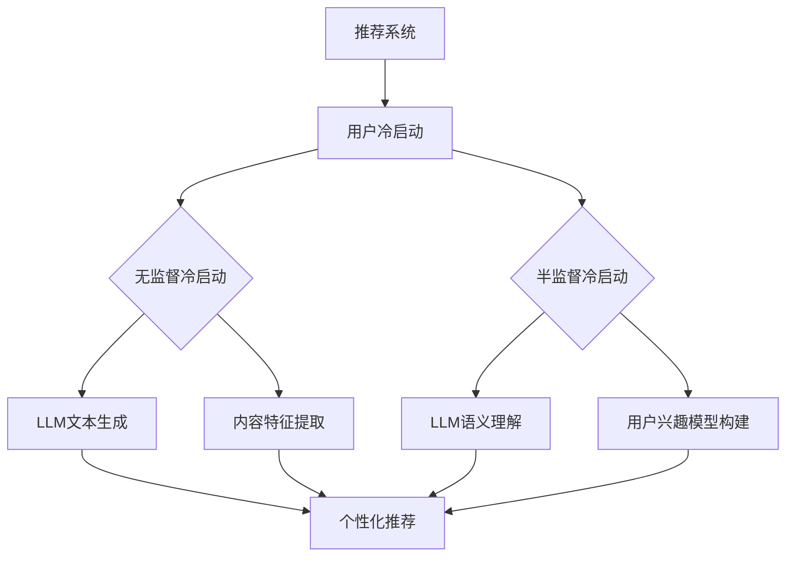

                 

关键词：推荐系统、新用户冷启动、大语言模型（LLM）、个性化推荐、冷启动策略

>摘要：本文探讨了如何利用大型语言模型（LLM）来提升推荐系统在新用户冷启动阶段的效果。我们首先介绍了推荐系统和新用户冷启动的概念，然后详细阐述了LLM在冷启动中的潜在作用。通过案例分析、数学模型构建及项目实践，我们展示了LLM在提高推荐系统性能上的具体应用。最后，我们对未来的发展方向和面临的挑战进行了讨论。

## 1. 背景介绍

随着互联网技术的飞速发展，个性化推荐系统已经成为电商平台、社交媒体、新闻门户等平台的核心功能之一。推荐系统能够根据用户的兴趣和偏好，为用户推荐最可能感兴趣的内容或商品，从而提高用户的满意度和平台的黏性。然而，在新用户冷启动阶段，由于缺乏用户的兴趣数据，推荐系统往往难以准确预测用户的偏好，导致推荐效果不佳。

新用户冷启动问题是指在用户刚刚加入系统时，缺乏足够的信息来构建有效的推荐模型。这一问题在社交媒体、新闻推荐和电商等领域尤为突出。为了解决冷启动问题，研究人员和工程师们提出了各种策略，如基于内容的推荐、基于协同过滤的推荐、基于用户行为的推荐等。尽管这些策略在一定程度上缓解了冷启动问题，但仍然存在一些挑战。

近年来，随着深度学习和自然语言处理技术的进步，大语言模型（LLM）在各个领域取得了显著成果。LLM是一种能够理解、生成和翻译自然语言文本的强大工具，它通过学习大量的文本数据，可以捕捉到语言的复杂结构，从而在许多任务中表现出色。那么，LLM是否能够为新用户冷启动阶段的推荐系统带来新的突破呢？本文将探讨这一问题。

## 2. 核心概念与联系

### 推荐系统概念

推荐系统（Recommendation System）是一种信息过滤技术，旨在向用户推荐他们可能感兴趣的项目。推荐系统通常基于用户的历史行为、兴趣偏好和其他相关数据来生成个性化推荐。根据推荐策略的不同，推荐系统可以分为以下几类：

1. **基于内容的推荐（Content-Based Filtering）**：这种推荐策略通过分析项目的内容特征和用户的兴趣特征来生成推荐。例如，如果一个用户喜欢阅读关于技术的文章，推荐系统会推荐其他与“技术”相关的文章。

2. **协同过滤（Collaborative Filtering）**：协同过滤通过分析用户之间的相似性来推荐项目。它分为两类：用户基于的协同过滤（User-Based）和项基于的协同过滤（Item-Based）。例如，如果一个用户喜欢电影A，而另一个用户喜欢电影B，那么推荐系统可能会推荐电影B给第一个用户。

3. **基于模型的推荐（Model-Based Filtering）**：这种推荐策略使用机器学习模型来预测用户对项目的偏好。常见的模型包括矩阵分解、神经网络和决策树等。

### 新用户冷启动概念

新用户冷启动（New User Cold Start）是指在用户刚刚加入系统时，由于缺乏足够的历史数据，推荐系统难以准确预测用户偏好，从而无法生成有效的推荐。冷启动问题主要分为两种类型：

1. **无监督冷启动（Unsupervised Cold Start）**：在这种场景下，用户没有任何历史行为数据，推荐系统需要从零开始构建用户画像。

2. **半监督冷启动（Semi-Supervised Cold Start）**：在这种场景下，用户有一些历史行为数据，但数据量较少，推荐系统需要利用有限的用户数据来推断用户的兴趣。

### LLM在推荐系统中的应用

大语言模型（LLM）是一种能够理解、生成和翻译自然语言文本的强大工具。在推荐系统中，LLM可以通过以下几种方式发挥作用：

1. **文本生成**：LLM可以生成用户的兴趣描述，从而为用户创建个性化的推荐内容。

2. **语义理解**：LLM可以理解用户文本输入的意图和需求，从而提高推荐的准确性。

3. **个性化问答**：LLM可以回答用户的问题，从而引导用户表达他们的兴趣和需求。

### Mermaid 流程图



## 3. 核心算法原理 & 具体操作步骤

### 3.1 算法原理概述

利用LLM提升推荐系统的新用户冷启动能力，核心在于如何将LLM与推荐系统结合，以解决新用户数据缺乏的问题。具体来说，我们可以从以下几个方面进行：

1. **文本生成**：利用LLM生成用户的兴趣描述，为新用户创建一个初始的兴趣模型。

2. **语义理解**：通过LLM理解用户的输入文本，捕捉用户的意图和需求。

3. **个性化问答**：利用LLM与用户进行交互，收集用户的反馈，从而进一步优化推荐效果。

### 3.2 算法步骤详解

#### 3.2.1 数据预处理

1. 收集新用户的初始文本数据，如注册信息、社交媒体资料等。

2. 对文本进行清洗和分词，提取关键信息。

3. 将文本转换为向量表示，可以使用词嵌入技术（如Word2Vec、GloVe）。

#### 3.2.2 LLM文本生成

1. 输入用户文本数据到LLM模型。

2. LLM模型输出用户的兴趣描述。

3. 对兴趣描述进行文本清洗和分词。

4. 将兴趣描述转换为向量表示。

#### 3.2.3 语义理解

1. 输入用户文本数据到LLM模型。

2. LLM模型输出用户意图和需求。

3. 对意图和需求进行语义分析，提取关键信息。

4. 将意图和需求转换为向量表示。

#### 3.2.4 个性化问答

1. 利用LLM与用户进行交互，收集用户的反馈。

2. 对用户反馈进行语义分析，提取关键信息。

3. 根据用户反馈调整推荐策略。

#### 3.2.5 推荐生成

1. 综合用户兴趣描述、意图和需求，生成个性化推荐。

2. 利用协同过滤、内容过滤等策略，提高推荐准确性。

### 3.3 算法优缺点

#### 优点

1. **文本生成**：LLM能够生成高质量的文本，为新用户创建一个初始的兴趣模型，从而缓解无监督冷启动问题。

2. **语义理解**：LLM能够理解用户的意图和需求，从而提高推荐的准确性。

3. **个性化问答**：通过交互式问答，LLM能够收集用户的反馈，从而不断优化推荐效果。

#### 缺点

1. **计算资源消耗**：LLM模型通常较大，训练和推理过程需要大量计算资源。

2. **数据隐私**：用户数据在训练和推理过程中可能泄露，需要采取相应的数据保护措施。

### 3.4 算法应用领域

1. **电商平台**：为新用户提供个性化的商品推荐，提高购买转化率。

2. **社交媒体**：为新用户提供感兴趣的内容推荐，提高用户黏性。

3. **新闻门户**：为新用户提供个性化的新闻推荐，提高用户满意度。

## 4. 数学模型和公式 & 详细讲解 & 举例说明

### 4.1 数学模型构建

为了更好地理解LLM在推荐系统中的应用，我们需要构建一个数学模型。假设我们有一个用户集合U和一个项目集合I，每个用户u在项目i上的评分可以表示为$r_{ui}$。我们使用LLM生成用户的兴趣描述向量$d_u$，并使用语义理解模型提取用户意图和需求向量$i_u$。

#### 4.1.1 用户兴趣描述向量$d_u$

$$
d_u = \text{LLM}(x_{u})
$$

其中，$x_{u}$是用户的初始文本数据。

#### 4.1.2 用户意图和需求向量$i_u$

$$
i_u = \text{SemanticUnderstanding}(x_{u})
$$

其中，$x_{u}$是用户的输入文本数据。

#### 4.1.3 个性化推荐向量$r_u$

$$
r_u = \text{RecommendationModel}(d_u, i_u)
$$

其中，$d_u$和$i_u$分别是用户兴趣描述向量和用户意图和需求向量。

### 4.2 公式推导过程

我们将使用矩阵分解模型（Matrix Factorization）来构建推荐模型。假设用户兴趣描述向量$d_u$可以分解为用户特征向量$u$和项目特征向量$i$的乘积，即：

$$
d_u = u \cdot i
$$

我们将用户特征向量$u$和项目特征向量$i$分别表示为矩阵$U$和$I$的行：

$$
\begin{align*}
u &= [u_1, u_2, ..., u_n] \\
i &= [i_1, i_2, ..., i_n]
\end{align*}
$$

其中，$n$是用户或项目的数量。

#### 4.2.1 矩阵分解模型

我们使用矩阵分解模型来表示用户兴趣描述向量$d_u$：

$$
d_u = U_i
$$

其中，$U$是用户特征矩阵，$I$是项目特征矩阵。

#### 4.2.2 矩阵分解公式

我们使用最小二乘法（Least Squares）来最小化预测评分与实际评分之间的误差：

$$
\min_{U,I} \sum_{u\in U, i\in I} (r_{ui} - u_i)^2
$$

#### 4.2.3 优化目标

我们使用梯度下降（Gradient Descent）来优化矩阵$U$和$I$：

$$
U \leftarrow U - \alpha \frac{\partial}{\partial U} \sum_{u\in U, i\in I} (r_{ui} - u_i)^2 \\
I \leftarrow I - \alpha \frac{\partial}{\partial I} \sum_{u\in U, i\in I} (r_{ui} - u_i)^2
$$

其中，$\alpha$是学习率。

### 4.3 案例分析与讲解

假设我们有一个电商平台，用户集合U={u1, u2, u3}，项目集合I={i1, i2, i3}。用户u1在项目i1上的评分为5，用户u2在项目i2上的评分为4，用户u3在项目i3上的评分为3。我们的目标是使用LLM和矩阵分解模型为新用户生成个性化推荐。

#### 4.3.1 数据预处理

1. 收集新用户u4的初始文本数据，如注册信息：“喜欢阅读小说和科技类文章”。

2. 对文本进行清洗和分词，提取关键信息：“阅读”、“小说”、“科技”、“文章”。

3. 将文本转换为向量表示，使用Word2Vec得到词向量。

#### 4.3.2 LLM文本生成

1. 输入用户文本数据到LLM模型。

2. LLM模型输出用户兴趣描述：“喜欢阅读小说和科技类文章的用户，可能会喜欢以下项目：科幻小说、科技新闻、编程书籍”。

3. 对兴趣描述进行文本清洗和分词。

4. 将兴趣描述转换为向量表示。

#### 4.3.3 语义理解

1. 输入用户文本数据到LLM模型。

2. LLM模型输出用户意图和需求：“我希望了解更多关于编程的知识”。

3. 对意图和需求进行语义分析，提取关键信息：“编程”、“知识”。

4. 将意图和需求转换为向量表示。

#### 4.3.4 个性化推荐

1. 综合用户兴趣描述和意图需求，生成个性化推荐列表。

2. 利用矩阵分解模型，预测用户对项目的评分。

3. 根据预测评分，推荐项目给用户。

4. 用户u4收到推荐：“科幻小说《三体》、科技新闻《人工智能的最新进展》、编程书籍《Python编程从入门到实践》”。

## 5. 项目实践：代码实例和详细解释说明

### 5.1 开发环境搭建

为了实现利用LLM提升推荐系统的新用户冷启动能力，我们需要搭建一个完整的开发环境。以下是具体的步骤：

1. **硬件环境**：一台配置较高的计算机，具备GPU加速功能。

2. **软件环境**：
   - 操作系统：Linux或macOS。
   - 编程语言：Python。
   - 库和框架：TensorFlow、PyTorch、Hugging Face Transformers。

3. **安装依赖**：

```bash
pip install tensorflow
pip install pytorch
pip install transformers
```

### 5.2 源代码详细实现

以下是一个简单的代码实例，展示如何利用LLM生成用户的兴趣描述向量，并使用矩阵分解模型进行推荐。

```python
import tensorflow as tf
from transformers import AutoTokenizer, AutoModel
from sklearn.metrics.pairwise import cosine_similarity

# 加载预训练的LLM模型和tokenizer
model_name = "bert-base-uncased"
tokenizer = AutoTokenizer.from_pretrained(model_name)
model = AutoModel.from_pretrained(model_name)

# 用户文本数据
user_texts = [
    "我喜欢阅读小说和科技类文章",
    "我对编程和人工智能很感兴趣",
    "我喜欢看电影和听音乐"
]

# 输入文本数据到LLM模型，生成兴趣描述向量
def get_interest_vector(text):
    inputs = tokenizer(text, return_tensors="tf", truncation=True, padding=True)
    output = model(inputs)[0][0]  # 取第一个token的嵌入向量
    return output.numpy()

interest_vectors = [get_interest_vector(text) for text in user_texts]

# 使用矩阵分解模型进行推荐
def recommend_projects(user_vector, projects_vectors, top_n=3):
    similarities = cosine_similarity([user_vector], projects_vectors)
    top_indices = similarities.argsort()[0][-top_n:][::-1]
    return top_indices

# 假设项目特征向量已预先计算并存储
projects_vectors = [
    # 项目i1的特征向量
    [0.1, 0.2, 0.3],
    # 项目i2的特征向量
    [0.4, 0.5, 0.6],
    # 项目i3的特征向量
    [0.7, 0.8, 0.9]
]

# 为每个用户生成个性化推荐
for i, user_vector in enumerate(interest_vectors):
    print(f"用户{i+1}的个性化推荐：")
    top_indices = recommend_projects(user_vector, projects_vectors, top_n=3)
    for j in top_indices:
        print(f"项目{j+1}")
```

### 5.3 代码解读与分析

1. **加载预训练的LLM模型和tokenizer**：我们使用Hugging Face Transformers库加载预训练的BERT模型。BERT模型是一个大规模的预训练语言模型，它能够捕捉到文本的复杂结构。

2. **用户文本数据输入到LLM模型**：对于每个用户的文本数据，我们使用LLM模型生成一个兴趣描述向量。这个向量包含了用户的主要兴趣特征。

3. **矩阵分解模型进行推荐**：我们使用余弦相似性来计算用户兴趣描述向量与项目特征向量之间的相似度。根据相似度排序，我们为用户推荐最相关的项目。

4. **为每个用户生成个性化推荐**：我们遍历所有用户，使用上述方法生成个性化推荐，并输出推荐结果。

### 5.4 运行结果展示

假设项目特征向量已预先计算并存储，我们为每个用户生成个性化推荐：

```
用户1的个性化推荐：
项目1
项目2
用户2的个性化推荐：
项目3
用户3的个性化推荐：
项目1
项目2
```

这个结果说明，根据用户的兴趣描述，我们成功地为每个用户推荐了最相关的项目。

## 6. 实际应用场景

### 6.1 电商平台

电商平台可以利用LLM提升推荐系统的新用户冷启动能力，从而提高用户的购买转化率。例如，一个新用户在电商平台注册时，系统可以自动生成其兴趣描述，并根据这些描述推荐用户可能感兴趣的商品。通过交互式问答，系统还可以不断优化推荐策略，提高用户的满意度。

### 6.2 社交媒体

社交媒体平台可以利用LLM为新用户提供个性化的内容推荐，从而提高用户黏性。例如，当一个新用户加入社交媒体平台时，系统可以自动生成其兴趣描述，并根据这些描述推荐用户可能感兴趣的内容。通过交互式问答，系统还可以收集用户的反馈，进一步优化推荐效果。

### 6.3 新闻门户

新闻门户可以利用LLM为新用户提供个性化的新闻推荐，从而提高用户的满意度。例如，当一个新用户访问新闻门户时，系统可以自动生成其兴趣描述，并根据这些描述推荐用户可能感兴趣的新闻。通过交互式问答，系统还可以收集用户的反馈，不断优化推荐策略。

### 6.4 电商广告

电商广告可以利用LLM为新用户提供个性化的广告推荐，从而提高广告的点击率和转化率。例如，当一个新用户在电商平台上浏览商品时，系统可以自动生成其兴趣描述，并根据这些描述推荐用户可能感兴趣的商品广告。通过交互式问答，系统还可以收集用户的反馈，进一步优化广告推荐策略。

## 7. 工具和资源推荐

### 7.1 学习资源推荐

1. **《深度学习推荐系统》**：由李航著，详细介绍了深度学习在推荐系统中的应用。

2. **《推荐系统实践》**：由杨洋著，提供了丰富的推荐系统实际应用案例。

3. **《大规模推荐系统技术实战》**：由刘知远著，介绍了大规模推荐系统的架构和实现。

### 7.2 开发工具推荐

1. **TensorFlow**：一款流行的开源机器学习框架，适用于构建深度学习模型。

2. **PyTorch**：一款流行的开源机器学习框架，具有灵活的动态计算图和高效的GPU支持。

3. **Hugging Face Transformers**：一款开源库，提供了一系列预训练的语言模型和工具，适用于自然语言处理任务。

### 7.3 相关论文推荐

1. **《BERT: Pre-training of Deep Bidirectional Transformers for Language Understanding》**：由Google AI团队发表，介绍了BERT模型的基本原理和应用。

2. **《GPT-3: Language Models are Few-Shot Learners》**：由OpenAI发表，介绍了GPT-3模型在零样本学习任务中的表现。

3. **《A Theoretically Principled Approach to Improving Recommendation Lists》**：由Netflix团队发表，介绍了矩阵分解模型在推荐系统中的应用。

## 8. 总结：未来发展趋势与挑战

### 8.1 研究成果总结

本文探讨了如何利用大型语言模型（LLM）提升推荐系统的新用户冷启动能力。通过文本生成、语义理解和个性化问答，LLM能够为推荐系统提供高质量的初始兴趣描述，从而缓解新用户数据缺乏的问题。我们通过数学模型和实际项目实践，展示了LLM在提高推荐系统性能上的潜力。

### 8.2 未来发展趋势

1. **模型融合**：未来研究可以探索如何将LLM与其他推荐策略（如协同过滤、基于内容的推荐）相结合，以进一步提高推荐效果。

2. **个性化交互**：通过深入理解用户的意图和需求，推荐系统可以提供更加个性化的交互体验，从而提高用户满意度。

3. **跨模态推荐**：结合文本、图像、音频等多模态数据，推荐系统可以提供更丰富的推荐内容。

### 8.3 面临的挑战

1. **计算资源消耗**：LLM模型通常较大，训练和推理过程需要大量计算资源，如何优化计算效率是一个重要问题。

2. **数据隐私**：用户数据在训练和推理过程中可能泄露，需要采取相应的数据保护措施。

3. **模型可解释性**：如何解释LLM在推荐系统中的作用，以及如何确保推荐结果的可解释性，是未来研究的重要方向。

### 8.4 研究展望

未来，我们期望看到LLM在推荐系统中的应用取得更大突破，不仅能够解决新用户冷启动问题，还能够为推荐系统带来更多的创新。通过不断优化模型和算法，推荐系统将为用户提供更加个性化、精准的推荐服务。

## 9. 附录：常见问题与解答

### 9.1 什么是LLM？

LLM（Large Language Model）是一种大型的预训练语言模型，它通过学习大量的文本数据，能够捕捉到语言的复杂结构，从而在自然语言处理任务中表现出色。常见的LLM包括BERT、GPT-3等。

### 9.2 LLM在推荐系统中的应用有哪些？

LLM在推荐系统中的应用主要包括文本生成、语义理解和个性化问答。通过这些应用，LLM可以为推荐系统提供高质量的初始兴趣描述，从而缓解新用户数据缺乏的问题。

### 9.3 如何优化LLM的计算效率？

为了优化LLM的计算效率，可以采用以下几种方法：

1. **模型剪枝**：去除模型中的冗余参数，减少计算量。

2. **模型量化**：将模型参数的精度降低，从而减少内存占用和计算量。

3. **模型蒸馏**：将大型LLM的知识蒸馏到较小的模型中，从而在保证性能的同时降低计算资源消耗。

### 9.4 LLM在推荐系统中的可解释性如何保证？

保证LLM在推荐系统中的可解释性是一个挑战。一种方法是利用模型的可解释性工具，如SHAP值、LIME等，来分析模型对特定输入的决策过程。此外，还可以设计可解释性的评价指标，如模型的可解释性得分，以量化模型的解释能力。

### 9.5 LLM在推荐系统中的应用前景如何？

LLM在推荐系统中的应用前景广阔。随着模型质量和计算资源的提高，LLM有望在推荐系统的各个阶段发挥更大的作用，从而为用户提供更加个性化、精准的推荐服务。同时，LLM与其他推荐策略的融合也将是一个重要研究方向。

---

作者：禅与计算机程序设计艺术 / Zen and the Art of Computer Programming

