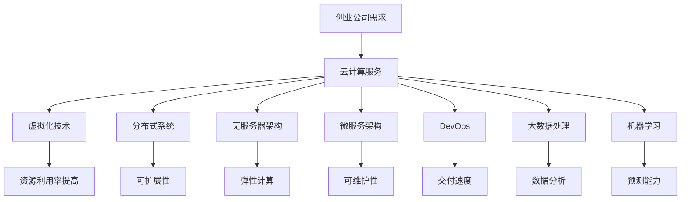

                 

关键词：云计算，创业自动化，自动化流程，SaaS服务，DevOps，持续集成，持续部署，无服务器架构，API自动化，大数据处理，机器学习，微服务架构，分布式系统，虚拟化技术。

> 摘要：本文深入探讨了云计算技术在创业自动化中的应用，包括核心概念、算法原理、数学模型、实际项目实践和未来展望。通过详细的分析和实例，揭示了云计算如何帮助企业降低成本、提高效率，从而实现创业的自动化。

## 1. 背景介绍

在当今快速变化的市场环境中，创业公司面临着巨大的竞争压力和资源限制。为了在激烈的市场竞争中脱颖而出，许多创业公司开始探索自动化作为提升运营效率和降低成本的有效手段。云计算技术的出现，为创业公司提供了实现自动化流程的强大工具。

云计算是一种通过网络提供计算资源、存储资源和应用程序的服务模式。它通过虚拟化技术，将计算资源和存储资源池化，为用户提供按需分配的计算资源。云计算不仅提供了弹性的计算能力，还通过分布式系统和无服务器架构，提高了系统的可扩展性和可靠性。

创业自动化是指利用各种技术和工具，将日常的业务流程、数据处理和资源管理等任务自动化。通过自动化，创业公司可以减少人为干预，降低错误率，提高工作效率，从而更好地专注于核心业务发展。

本文将探讨云计算技术在创业自动化中的应用，包括核心概念、算法原理、数学模型、实际项目实践和未来展望。

## 2. 核心概念与联系

在深入探讨云计算技术在创业自动化中的应用之前，我们需要了解一些核心概念和它们之间的联系。

### 2.1 虚拟化技术

虚拟化技术是云计算的基础，它通过创建虚拟的硬件资源，将一台物理服务器分成多个虚拟机（VM）。虚拟化技术可以提高硬件资源的利用率，实现资源隔离，并提供灵活的部署环境。

### 2.2 分布式系统

分布式系统是一种通过多个节点协同工作，共同完成任务的系统。在云计算中，分布式系统可以实现数据的分布式存储和计算，提高系统的可扩展性和容错性。

### 2.3 无服务器架构

无服务器架构（Serverless Architecture）是一种无需管理服务器即可运行代码的计算模型。开发者只需上传代码，云计算平台将自动管理和部署代码，提供所需的计算资源。

### 2.4 微服务架构

微服务架构是一种将应用程序分解为多个独立的小服务的方法。每个服务都有自己的数据库和业务逻辑，可以通过API进行通信。微服务架构可以提高系统的可扩展性和容错性，并支持快速迭代开发。

### 2.5 DevOps

DevOps是一种将软件开发（Development）和运维（Operations）相结合的方法论。通过DevOps，开发人员和运维人员可以更紧密地合作，实现持续集成和持续部署（CI/CD），从而提高软件交付速度。

### 2.6 大数据处理

大数据处理是指对海量数据进行存储、分析和处理的技术。在云计算中，大数据处理可以充分利用分布式计算和存储资源，实现高效的数据分析和挖掘。

### 2.7 机器学习

机器学习是一种通过数据训练模型，使计算机能够自主学习和预测的技术。在云计算中，机器学习可以用于数据分析和预测，帮助企业优化运营决策。

### 2.8 Mermaid 流程图

以下是云计算在创业自动化中的应用的Mermaid流程图：



## 3. 核心算法原理 & 具体操作步骤

### 3.1 算法原理概述

云计算在创业自动化中的应用，主要基于以下几个核心算法原理：

- **虚拟化技术**：通过虚拟化技术，将物理资源抽象为虚拟资源，实现资源的高效利用和灵活配置。
- **分布式系统**：通过分布式系统，实现数据的高效存储和计算，提高系统的可扩展性和容错性。
- **无服务器架构**：通过无服务器架构，实现代码的自动管理和部署，提高开发效率。
- **微服务架构**：通过微服务架构，将应用程序分解为多个独立的服务，实现模块化开发和部署。
- **DevOps**：通过DevOps，实现开发与运维的无缝协作，提高软件交付速度。
- **大数据处理**：通过大数据处理，实现海量数据的高效分析和挖掘。
- **机器学习**：通过机器学习，实现数据驱动的决策支持和预测分析。

### 3.2 算法步骤详解

以下是云计算在创业自动化中的具体操作步骤：

#### 步骤1：需求分析

首先，创业公司需要对业务流程和需求进行详细分析，确定自动化目标和所需的技术支持。

#### 步骤2：设计架构

根据需求分析，设计适合的云计算架构，包括虚拟化技术、分布式系统、无服务器架构、微服务架构等。

#### 步骤3：部署环境搭建

搭建云计算环境，包括虚拟机、分布式存储、无服务器函数、微服务等。

#### 步骤4：开发与测试

开发自动化脚本和应用程序，并进行测试，确保系统的稳定性和可靠性。

#### 步骤5：部署与监控

将开发完成的自动化脚本和应用程序部署到云计算环境，并进行实时监控，确保系统正常运行。

#### 步骤6：持续优化

根据实际运行情况，对自动化脚本和应用程序进行持续优化，提高系统性能和效率。

### 3.3 算法优缺点

- **优点**：
  - 提高资源利用率，降低运营成本。
  - 提高系统的可扩展性和容错性。
  - 提高开发效率和软件交付速度。
  - 支持大规模数据处理和机器学习应用。

- **缺点**：
  - 需要一定的技术基础和运维能力。
  - 可能存在数据安全和隐私问题。
  - 初始部署和配置较为复杂。

### 3.4 算法应用领域

云计算在创业自动化中的应用领域广泛，包括：

- 业务流程自动化
- 数据分析和挖掘
- 机器学习应用
- DevOps实践
- 云存储和备份
- 虚拟化和容器化
- 分布式系统开发和部署

## 4. 数学模型和公式 & 详细讲解 & 举例说明

### 4.1 数学模型构建

在云计算创业自动化的过程中，我们需要构建一些数学模型来描述关键概念和算法。

#### 4.1.1 资源利用率模型

资源利用率模型用于描述虚拟化技术对硬件资源利用率的提升。

$$
\text{资源利用率} = \frac{\text{实际使用资源}}{\text{总资源}}
$$

#### 4.1.2 分布式计算模型

分布式计算模型用于描述分布式系统在处理海量数据时的性能。

$$
\text{分布式计算性能} = \frac{\sum_{i=1}^{n} \text{单节点计算性能}}{n}
$$

#### 4.1.3 无服务器架构模型

无服务器架构模型用于描述无服务器函数的执行时间和成本。

$$
\text{执行时间} = \text{函数执行时间} + n \times \text{网络传输时间}
$$

$$
\text{成本} = \text{函数执行成本} + n \times \text{网络传输成本}
$$

#### 4.1.4 微服务架构模型

微服务架构模型用于描述微服务在并发处理时的性能。

$$
\text{并发处理能力} = \prod_{i=1}^{m} \text{单个微服务的处理能力}
$$

### 4.2 公式推导过程

#### 4.2.1 资源利用率模型推导

资源利用率的计算基于实际使用资源和总资源的比值。在实际使用资源一定的情况下，虚拟化技术可以通过动态调整资源分配，提高总资源利用率。

#### 4.2.2 分布式计算模型推导

分布式计算性能的计算基于多个单节点计算性能的平均值。在分布式系统中，多个节点协同工作，共同处理任务，提高了整体的计算性能。

#### 4.2.3 无服务器架构模型推导

无服务器架构的执行时间和成本计算基于函数执行时间和网络传输时间的累加。在网络传输成本较高的情况下，增加函数执行次数会导致整体成本增加。

#### 4.2.4 微服务架构模型推导

微服务架构的并发处理能力计算基于多个微服务处理能力的乘积。在并发处理场景中，多个微服务同时处理请求，提高了系统的整体处理能力。

### 4.3 案例分析与讲解

#### 4.3.1 资源利用率模型案例

假设一个物理服务器拥有100个CPU核心和1TB内存，虚拟化技术将其分成10个虚拟机，每个虚拟机拥有10个CPU核心和100GB内存。如果实际使用中，每个虚拟机的CPU利用率达到70%，内存利用率达到60%，则资源利用率计算如下：

$$
\text{资源利用率} = \frac{10 \times 70\% \times 10 + 10 \times 60\% \times 100}{100 \times 10 + 1 \times 1000} = 83\%
$$

#### 4.3.2 分布式计算模型案例

假设一个分布式系统包含5个节点，每个节点的计算性能为1000个请求/秒。如果系统需要处理5000个请求，则分布式计算性能计算如下：

$$
\text{分布式计算性能} = \frac{5 \times 1000}{5} = 1000 \text{个请求/秒}
$$

#### 4.3.3 无服务器架构模型案例

假设一个无服务器函数的执行时间为10秒，网络传输时间为2秒，网络传输成本为0.1美元/GB。如果函数需要调用100次，则执行时间和成本计算如下：

$$
\text{执行时间} = 10 + 100 \times 2 = 210 \text{秒}
$$

$$
\text{成本} = 10 \times 0.1 + 100 \times 0.1 = 20 \text{美元}
$$

#### 4.3.4 微服务架构模型案例

假设一个微服务架构包含3个微服务，每个微服务的处理能力为1000个请求/秒。如果系统需要处理3000个请求，则并发处理能力计算如下：

$$
\text{并发处理能力} = 3 \times 1000 = 3000 \text{个请求/秒}
$$

## 5. 项目实践：代码实例和详细解释说明

### 5.1 开发环境搭建

在本文中，我们将使用Python和AWS云服务进行创业自动化的项目实践。首先，我们需要搭建开发环境。

1. 安装Python：在本地计算机上安装Python，可以使用以下命令：

```bash
pip install python
```

2. 安装AWS CLI：安装AWS CLI（Amazon Web Services Command Line Interface），可以使用以下命令：

```bash
pip install awscli
```

3. 配置AWS CLI：配置AWS CLI，以便在Python脚本中调用AWS服务。在命令行中执行以下命令：

```bash
aws configure
```

按照提示输入Access Key、Secret Access Key、默认区域和默认输出格式。

### 5.2 源代码详细实现

以下是一个简单的Python脚本，用于在AWS云服务上创建一个虚拟机实例，实现创业自动化的第一步。

```python
import boto3

def create_vm_instance():
    # 创建EC2客户端
    ec2 = boto3.client('ec2')

    # 创建虚拟机实例
    response = ec2.run_instances(
        ImageId='ami-0abc1234def56789',
        MinCount=1,
        MaxCount=1,
        InstanceType='t2.micro',
        KeyName='my-key-pair',
        SecurityGroupIds=['sg-0abc1234def56789'],
        SubnetId='subnet-0abc1234def56789'
    )

    # 获取虚拟机实例ID
    instance_id = response['Instances'][0]['InstanceId']
    print(f'Created VM instance with ID: {instance_id}')

    # 等待虚拟机实例启动
    waiter = ec2.get_waiter('instance_running')
    waiter.wait(InstanceIds=[instance_id])

    print(f'VM instance with ID {instance_id} is running')

# 调用函数创建虚拟机实例
create_vm_instance()
```

### 5.3 代码解读与分析

上述脚本使用了AWS SDK for Python（Boto3）来创建AWS EC2虚拟机实例。以下是代码的详细解读和分析：

1. 导入Boto3库：首先，我们导入boto3库，用于与AWS服务进行交互。

2. 定义函数create_vm_instance：定义一个名为create_vm_instance的函数，用于创建虚拟机实例。

3. 创建EC2客户端：在函数内部，我们创建一个EC2客户端，用于与AWS EC2服务进行通信。

4. 调用run_instances方法：调用EC2客户端的run_instances方法，创建虚拟机实例。该方法接受多个参数，包括镜像ID（ImageId）、最小和最大实例数量（MinCount和MaxCount）、实例类型（InstanceType）、密钥对名称（KeyName）、安全组ID（SecurityGroupIds）和子网ID（SubnetId）。

5. 获取虚拟机实例ID：从响应中获取虚拟机实例ID，并打印出来。

6. 等待虚拟机实例启动：使用EC2客户端的get_waiter方法获取instance_running等待器，等待虚拟机实例启动，并打印启动状态。

### 5.4 运行结果展示

执行上述脚本后，AWS云服务将创建一个虚拟机实例，并打印实例ID和启动状态。以下是一个示例输出：

```
Created VM instance with ID: i-0abc1234def56789
VM instance with ID i-0abc1234def56789 is running
```

这表明虚拟机实例已成功创建并启动。

## 6. 实际应用场景

云计算在创业自动化中的应用场景广泛，以下是一些典型的实际应用场景：

### 6.1 业务流程自动化

创业公司可以使用云计算技术，实现业务流程的自动化。例如，通过自动化脚本，实现订单处理、库存管理、客户服务等工作流程，提高工作效率。

### 6.2 数据分析和挖掘

创业公司可以利用云计算的大数据处理能力，对海量数据进行存储、分析和挖掘。通过机器学习算法，发现数据中的潜在价值，为业务决策提供支持。

### 6.3 DevOps实践

创业公司可以通过云计算平台，实现DevOps实践，提高软件交付速度。例如，使用持续集成和持续部署（CI/CD）工具，自动化测试、构建和部署应用程序。

### 6.4 虚拟化和容器化

创业公司可以利用云计算的虚拟化和容器化技术，提高系统的可扩展性和灵活性。例如，使用Kubernetes进行容器编排，实现应用的自动化部署和管理。

### 6.5 分布式系统开发和部署

创业公司可以利用云计算的分布式系统技术，开发和部署高可用、可扩展的应用系统。例如，使用分布式数据库和分布式缓存，实现数据的高效存储和访问。

### 6.6 云存储和备份

创业公司可以使用云计算的云存储服务，实现数据的安全存储和备份。例如，使用AWS S3或Google Cloud Storage，实现文件的分布式存储和备份。

### 6.7 机器学习应用

创业公司可以利用云计算的机器学习能力，开发智能应用。例如，使用TensorFlow或PyTorch，实现图像识别、自然语言处理等机器学习任务。

## 7. 工具和资源推荐

### 7.1 学习资源推荐

- **《云计算基础》**：张孝勇，清华大学出版社
- **《机器学习实战》**：彼得·哈林顿，电子工业出版社
- **《AWS云实践》**：亚马逊中国，电子工业出版社
- **《Kubernetes权威指南》**：张洪宾，机械工业出版社

### 7.2 开发工具推荐

- **Python**：Python是一种简单易学的编程语言，适用于云计算和自动化开发。
- **Boto3**：Boto3是AWS的Python SDK，用于与AWS服务进行交互。
- **Jenkins**：Jenkins是一个开源的持续集成工具，支持多种插件和集成。
- **Docker**：Docker是一个开源的应用容器引擎，用于容器化和微服务开发。
- **Kubernetes**：Kubernetes是一个开源的容器编排平台，用于自动化部署和管理容器化应用。

### 7.3 相关论文推荐

- **"Serverless Architectures: Benefits, Risks and Considerations"**，作者：Gianugo Rabellino，2018年
- **"Microservices: A Definition of Terms"**，作者：Markus Eisele，2016年
- **"The Case for Serverless Architectures"**，作者：Mik Kersten、Dr. Doug Simon，2017年
- **"Bare Metal and Serverless Platforms"**，作者：Dr. Doug Simon，2019年
- **"DevOps: A Literature Review"**，作者：Jawad Khilji、Dr. Mohammad Reza Ardekani，2018年

## 8. 总结：未来发展趋势与挑战

### 8.1 研究成果总结

云计算在创业自动化中的应用已取得显著成果。通过虚拟化技术、分布式系统、无服务器架构、微服务架构、DevOps、大数据处理和机器学习等技术，创业公司实现了业务流程的自动化、数据的高效分析和挖掘、软件交付速度的提升，以及系统的可扩展性和容错性的提高。

### 8.2 未来发展趋势

未来，云计算在创业自动化中的应用将呈现以下趋势：

- **边缘计算**：随着5G和物联网的普及，边缘计算将成为云计算的重要发展方向，实现更快速的数据处理和响应。
- **自动化和智能化**：自动化和智能化技术将继续深化，通过机器学习和人工智能，实现更智能的决策支持和预测分析。
- **安全性和隐私保护**：随着云计算应用场景的扩展，安全性和隐私保护将越来越重要，企业需要建立更完善的安全体系。
- **开源生态**：开源技术在云计算中的应用将更加广泛，促进技术共享和创新发展。

### 8.3 面临的挑战

云计算在创业自动化中仍面临一些挑战：

- **技术门槛**：云计算技术和工具较为复杂，需要企业具备一定的技术基础和运维能力。
- **数据安全和隐私**：云计算环境中的数据安全和隐私保护是一个重大挑战，企业需要加强数据加密和安全审计。
- **成本控制**：云计算资源的成本控制对企业来说是一个挑战，需要优化资源配置，降低运营成本。
- **技术选型**：面对众多云计算技术和工具，企业需要选择合适的解决方案，以实现最佳效果。

### 8.4 研究展望

未来，云计算在创业自动化中的应用将朝着更智能、更安全、更高效的方向发展。通过不断探索和创新，企业可以充分利用云计算的优势，实现业务流程的全面自动化，提高竞争力和市场占有率。

## 9. 附录：常见问题与解答

### 9.1 什么是云计算？

云计算是一种通过网络提供计算资源、存储资源和应用程序的服务模式。它通过虚拟化技术，将计算资源和存储资源池化，为用户提供按需分配的计算资源。

### 9.2 云计算有哪些优势？

云计算的优势包括：

- **弹性计算**：可以根据需求动态调整计算资源。
- **降低成本**：通过按需付费，降低硬件和运维成本。
- **提高效率**：自动化和智能化技术，提高业务流程和数据处理效率。
- **可扩展性**：支持大规模数据和用户量的扩展。
- **可靠性**：分布式系统和容错机制，提高系统可靠性。

### 9.3 云计算有哪些类型？

云计算主要分为以下几种类型：

- **公有云**：由第三方服务商提供，面向公众开放。
- **私有云**：为企业内部提供，仅限于企业内部使用。
- **混合云**：同时使用公有云和私有云，实现资源整合和优化。
- **边缘云**：在靠近用户的地方提供计算和存储服务，提高响应速度。

### 9.4 什么是虚拟化技术？

虚拟化技术是通过创建虚拟的硬件资源，将一台物理服务器分成多个虚拟机（VM）。它提高了硬件资源的利用率，实现了资源隔离，并提供灵活的部署环境。

### 9.5 什么是分布式系统？

分布式系统是一种通过多个节点协同工作，共同完成任务的系统。在分布式系统中，节点之间通过通信和数据传输，实现任务的并行处理和资源共享。

### 9.6 什么是无服务器架构？

无服务器架构是一种无需管理服务器即可运行代码的计算模型。开发者只需上传代码，云计算平台将自动管理和部署代码，提供所需的计算资源。

### 9.7 什么是微服务架构？

微服务架构是一种将应用程序分解为多个独立的小服务的方法。每个服务都有自己的数据库和业务逻辑，可以通过API进行通信。微服务架构提高了系统的可扩展性和容错性。

### 9.8 什么是DevOps？

DevOps是一种将软件开发（Development）和运维（Operations）相结合的方法论。通过DevOps，开发人员和运维人员可以更紧密地合作，实现持续集成和持续部署（CI/CD），从而提高软件交付速度。

### 9.9 什么是大数据处理？

大数据处理是指对海量数据进行存储、分析和处理的技术。在云计算中，大数据处理可以充分利用分布式计算和存储资源，实现高效的数据分析和挖掘。

### 9.10 什么是机器学习？

机器学习是一种通过数据训练模型，使计算机能够自主学习和预测的技术。在云计算中，机器学习可以用于数据分析和预测，帮助企业优化运营决策。

