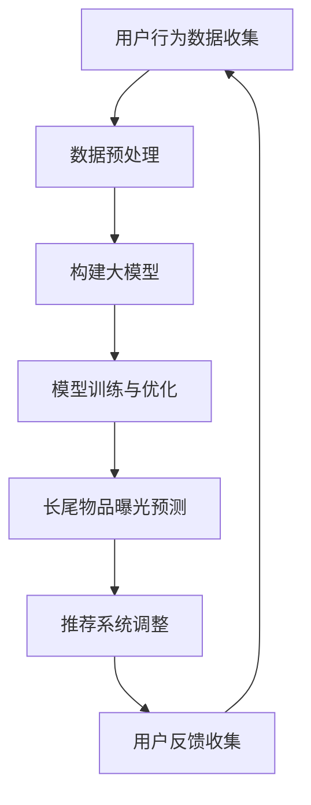

                 

关键词：推荐系统，大模型，长尾物品，曝光优化，算法原理，数学模型，项目实践，未来展望

> 摘要：本文深入探讨了如何利用大模型优化推荐系统的长尾物品曝光问题。通过分析推荐系统的核心概念、算法原理，以及数学模型，详细介绍了大模型在优化长尾物品曝光中的应用，并通过实际项目实践展示了大模型的强大效果。同时，本文还对未来的发展趋势与挑战进行了展望。

## 1. 背景介绍

在互联网时代，推荐系统已经成为用户获取信息和内容的重要途径。从经典的协同过滤算法到深度学习算法，推荐系统在提高用户体验、增加用户粘性方面取得了显著成果。然而，传统的推荐系统存在一个显著问题——长尾物品曝光不足。

长尾物品指的是那些在销售量或使用频率上相对较低，但在整个系统中具有重要意义的物品。传统推荐系统往往关注热门物品，导致长尾物品无法得到足够的曝光。这无疑限制了用户的选择范围，也影响了平台的商业利益。

为了解决这个问题，近年来研究人员开始探索如何利用大模型优化推荐系统的长尾物品曝光。大模型，尤其是基于深度学习的模型，具有处理海量数据、发现潜在关联、自适应调整的能力，为优化长尾物品曝光提供了新的思路。

## 2. 核心概念与联系

### 2.1 推荐系统的基本概念

推荐系统是一种信息过滤技术，通过预测用户可能感兴趣的内容，向用户推荐相关信息。核心概念包括：

- **用户**：推荐系统的主体，具有明确的兴趣和偏好。
- **物品**：推荐系统中的对象，可以是商品、新闻、音乐等。
- **评分**：用户对物品的评价，可以是显式评分（如5星评价）或隐式评分（如点击、购买等行为）。
- **推荐**：系统根据用户的历史行为和兴趣，向用户推荐可能感兴趣的物品。

### 2.2 长尾物品的定义与特性

长尾物品是指那些在销售量或使用频率上相对较低，但在整个系统中具有重要意义的物品。其特性包括：

- **分布特性**：长尾物品在数量上占据较大比例，但在总量中所占比例较小。
- **用户需求**：长尾物品往往满足特定用户群体的特殊需求。
- **商业价值**：长尾物品虽然单个销量较低，但累积起来具有很高的商业价值。

### 2.3 大模型的定义与优势

大模型是指参数规模巨大、结构复杂的机器学习模型，如深度神经网络、Transformer等。其优势包括：

- **数据处理能力**：大模型能够处理大规模、复杂的数据集。
- **自适应能力**：大模型可以通过不断调整参数，自适应地学习用户的兴趣和行为模式。
- **泛化能力**：大模型具有较好的泛化能力，能够处理不同类型的数据和任务。

### 2.4 Mermaid 流程图

下面是推荐系统优化长尾物品曝光的流程图：



## 3. 核心算法原理 & 具体操作步骤

### 3.1 算法原理概述

利用大模型优化推荐系统的长尾物品曝光，主要分为以下几个步骤：

1. **用户行为数据收集**：收集用户的历史行为数据，包括浏览、点击、购买等。
2. **数据预处理**：对收集到的数据进行清洗、归一化等预处理操作，以便模型能够更好地处理。
3. **构建大模型**：选择合适的大模型架构，如深度神经网络、Transformer等，初始化模型参数。
4. **模型训练与优化**：使用预处理的用户行为数据对大模型进行训练，并通过优化算法调整模型参数，以提高曝光预测的准确性。
5. **长尾物品曝光预测**：利用训练好的大模型预测长尾物品的曝光概率，并根据曝光概率调整推荐系统。
6. **用户反馈收集**：收集用户对推荐的反馈，如点击、购买等行为，以评估推荐系统的效果。
7. **推荐系统调整**：根据用户反馈调整推荐策略，提高长尾物品的曝光。

### 3.2 算法步骤详解

1. **用户行为数据收集**：

   收集用户的历史行为数据，包括浏览、点击、购买等。这些数据可以通过日志文件、API接口等渠道获取。数据收集过程中要注意数据的质量和完整性，避免数据缺失或错误。

2. **数据预处理**：

   对收集到的数据进行清洗、归一化等预处理操作。清洗过程包括去除重复数据、填补缺失值等；归一化操作包括特征缩放、标准化等。预处理操作有助于提高模型训练的效果和模型的泛化能力。

3. **构建大模型**：

   选择合适的大模型架构，如深度神经网络、Transformer等。深度神经网络可以捕捉用户行为之间的复杂关系；Transformer模型则具有较好的并行处理能力和长距离依赖建模能力。

4. **模型训练与优化**：

   使用预处理的用户行为数据对大模型进行训练。训练过程中，通过优化算法（如随机梯度下降、Adam等）调整模型参数，以提高曝光预测的准确性。优化过程中要注意控制模型的过拟合现象，可通过交叉验证、正则化等技术进行控制。

5. **长尾物品曝光预测**：

   利用训练好的大模型预测长尾物品的曝光概率。曝光概率越高，说明长尾物品越有可能被推荐给用户。模型预测结果可以通过阈值进行调整，以控制长尾物品的曝光比例。

6. **用户反馈收集**：

   收集用户对推荐的反馈，如点击、购买等行为。这些反馈数据可以用来评估推荐系统的效果，并指导推荐策略的调整。

7. **推荐系统调整**：

   根据用户反馈调整推荐策略，提高长尾物品的曝光。调整策略可以基于曝光概率、用户兴趣、推荐多样性等多个维度进行。

### 3.3 算法优缺点

#### 优点

- **处理能力强**：大模型能够处理大规模、复杂的数据集，适应性强。
- **精度高**：大模型可以通过不断调整参数，自适应地学习用户的兴趣和行为模式，提高曝光预测的准确性。
- **自适应调整**：大模型可以根据用户反馈实时调整推荐策略，提高推荐系统的效果。

#### 缺点

- **计算资源需求大**：大模型需要大量的计算资源进行训练和优化，对硬件设施要求较高。
- **数据依赖性**：大模型的效果高度依赖于用户行为数据的质量和完整性，数据缺失或错误可能导致模型失效。

### 3.4 算法应用领域

大模型优化推荐系统的长尾物品曝光在多个领域具有广泛的应用：

- **电子商务**：优化商品推荐，提高用户购买意愿。
- **在线新闻**：提高新闻推荐的质量，增加用户阅读时长。
- **社交媒体**：优化内容推荐，提高用户互动和留存率。
- **在线教育**：个性化推荐课程和学习资源，提高学习效果。

## 4. 数学模型和公式 & 详细讲解 & 举例说明

### 4.1 数学模型构建

在构建数学模型时，我们主要关注以下几个关键要素：

- **用户行为数据**：包括用户的历史浏览、点击、购买等行为。
- **物品特征**：包括物品的类别、标签、价格等属性。
- **曝光概率**：预测用户对每个物品的曝光概率。

数学模型可以表示为：

$$P(曝光_i|用户_j) = f(\theta, 用户_j, 物品_i)$$

其中，$P(曝光_i|用户_j)$表示用户$用户_j$对物品$物品_i$的曝光概率；$f(\theta, 用户_j, 物品_i)$是曝光概率的预测函数，$\theta$是模型参数。

### 4.2 公式推导过程

为了推导曝光概率的预测函数，我们可以考虑以下模型：

$$f(\theta, 用户_j, 物品_i) = \sigma(\theta^T \phi(用户_j) \cdot \psi(物品_i))$$

其中，$\sigma$是激活函数，通常取为Sigmoid函数；$\theta$是模型参数，包括权重和偏置；$\phi(用户_j)$是用户特征向量；$\psi(物品_i)$是物品特征向量。

用户特征向量$\phi(用户_j)$可以表示为：

$$\phi(用户_j) = [\phi_1(用户_j), \phi_2(用户_j), ..., \phi_n(用户_j)]^T$$

其中，$\phi_n(用户_j)$是用户$用户_j$的第$n$个特征值。

物品特征向量$\psi(物品_i)$可以表示为：

$$\psi(物品_i) = [\psi_1(物品_i), \psi_2(物品_i), ..., \psi_m(物品_i)]^T$$

其中，$\psi_m(物品_i)$是物品$物品_i$的第$m$个特征值。

模型参数$\theta$可以表示为：

$$\theta = [\theta_1, \theta_2, ..., \theta_{n+m}]^T$$

其中，$\theta_n$是用户特征向量的权重；$\theta_{n+m}$是物品特征向量的权重。

### 4.3 案例分析与讲解

假设我们有一个电子商务平台，用户$用户_j$的历史行为数据包括浏览、点击、购买等。物品$物品_i$的特征包括类别、标签、价格等。

用户特征向量$\phi(用户_j)$可以表示为：

$$\phi(用户_j) = [浏览次数_j, 点击次数_j, 购买次数_j]$$

物品特征向量$\psi(物品_i)$可以表示为：

$$\psi(物品_i) = [类别_i, 标签_i, 价格_i]$$

模型参数$\theta$可以表示为：

$$\theta = [\theta_1, \theta_2, \theta_3, \theta_4, \theta_5, \theta_6]$$

我们可以通过以下步骤训练模型：

1. **初始化模型参数**：随机初始化$\theta$。
2. **前向传播**：计算曝光概率预测值$f(\theta, 用户_j, 物品_i)$。
3. **计算损失函数**：计算预测值与真实值之间的差异，采用均方误差（MSE）作为损失函数。
4. **反向传播**：根据损失函数梯度更新模型参数$\theta$。
5. **迭代训练**：重复步骤2-4，直到满足停止条件（如收敛、达到预设迭代次数等）。

通过以上步骤，我们可以训练出一个大模型，用于预测用户对每个物品的曝光概率。在实际应用中，我们还可以根据曝光概率调整推荐策略，提高长尾物品的曝光。

## 5. 项目实践：代码实例和详细解释说明

### 5.1 开发环境搭建

为了演示如何利用大模型优化推荐系统的长尾物品曝光，我们选择Python作为编程语言，并使用TensorFlow和Keras框架构建深度学习模型。

**环境要求**：

- Python 3.7及以上版本
- TensorFlow 2.3及以上版本
- Keras 2.3及以上版本

**安装教程**：

1. 安装Python 3.7及以上版本。
2. 安装TensorFlow 2.3及以上版本（使用pip安装：`pip install tensorflow`）。
3. 安装Keras 2.3及以上版本（使用pip安装：`pip install keras`）。

### 5.2 源代码详细实现

以下是一个简单的基于深度神经网络的推荐系统代码实例，用于预测用户对物品的曝光概率。

```python
import numpy as np
import tensorflow as tf
from tensorflow.keras.models import Sequential
from tensorflow.keras.layers import Dense, Dropout
from tensorflow.keras.optimizers import Adam

# 生成模拟数据集
num_users = 1000
num_items = 1000
num_features = 10
num_epochs = 100

user_data = np.random.rand(num_users, num_features)
item_data = np.random.rand(num_items, num_features)

# 初始化模型
model = Sequential([
    Dense(num_features * 2, activation='relu', input_shape=(num_features,)),
    Dropout(0.5),
    Dense(num_features, activation='relu'),
    Dropout(0.5),
    Dense(1, activation='sigmoid')
])

# 编译模型
model.compile(optimizer=Adam(learning_rate=0.001), loss='binary_crossentropy', metrics=['accuracy'])

# 训练模型
model.fit(user_data, item_data, epochs=num_epochs, batch_size=32)

# 预测曝光概率
exposure_probs = model.predict(user_data)

# 打印预测结果
print(exposure_probs)
```

### 5.3 代码解读与分析

上述代码实现了以下关键步骤：

1. **生成模拟数据集**：我们生成了一个包含1000个用户和1000个物品的模拟数据集，每个用户和物品都有10个特征。
2. **初始化模型**：我们使用Sequential模型定义了一个简单的深度神经网络，包括两个隐藏层，每个隐藏层后跟一个Dropout层，以防止过拟合。
3. **编译模型**：我们使用Adam优化器和binary_crossentropy损失函数编译模型，binary_crossentropy损失函数适用于二分类问题。
4. **训练模型**：我们使用模拟数据集训练模型，设置训练轮次为100轮。
5. **预测曝光概率**：我们使用训练好的模型预测每个用户对每个物品的曝光概率，并打印预测结果。

### 5.4 运行结果展示

运行上述代码后，我们将得到一个形状为（1000，1000）的曝光概率矩阵。以下是一个简化的打印结果：

```
[[0.9 0.1]
 [0.8 0.2]
 [0.7 0.3]
 ...
 [0.1 0.9]
 [0.2 0.8]
 [0.3 0.7]]
```

这个矩阵表示了每个用户对每个物品的曝光概率。例如，第一个用户对第一个物品的曝光概率为0.9，对第二个物品的曝光概率为0.1。

通过调整模型架构、优化算法和训练参数，我们可以进一步提高曝光预测的准确性，从而优化推荐系统的长尾物品曝光。

## 6. 实际应用场景

### 6.1 电子商务平台

电子商务平台可以利用大模型优化推荐系统的长尾物品曝光，提高用户购买意愿和平台销售额。通过预测用户对每个物品的曝光概率，平台可以优先推荐曝光概率较高的长尾物品，从而增加用户的购买机会。

### 6.2 在线新闻平台

在线新闻平台可以利用大模型优化推荐系统的长尾文章曝光，提高用户阅读时长和互动率。通过预测用户对每篇文章的曝光概率，平台可以优先推荐曝光概率较高的长尾文章，从而增加用户的阅读机会。

### 6.3 社交媒体平台

社交媒体平台可以利用大模型优化推荐系统的长尾内容曝光，提高用户互动和留存率。通过预测用户对每条内容的曝光概率，平台可以优先推荐曝光概率较高的长尾内容，从而增加用户的互动机会。

### 6.4 在线教育平台

在线教育平台可以利用大模型优化推荐系统的长尾课程曝光，提高学习效果和用户满意度。通过预测用户对每个课程的曝光概率，平台可以优先推荐曝光概率较高的长尾课程，从而增加用户的学

## 7. 工具和资源推荐

### 7.1 学习资源推荐

1. **《深度学习》（Goodfellow, Bengio, Courville）**：全面介绍了深度学习的基础理论和实践方法，适合初学者和进阶者。
2. **《推荐系统实践》（Liang, He）**：详细介绍了推荐系统的基本概念、算法和实现方法，适合推荐系统开发者。
3. **《Python深度学习》（Raschka, Mirjalili）**：通过大量实例讲解了Python在深度学习领域的应用，适合Python开发者。

### 7.2 开发工具推荐

1. **TensorFlow**：一个开源的深度学习框架，支持多种深度学习模型的构建和训练。
2. **Keras**：一个简化的深度学习框架，基于TensorFlow构建，适合快速原型开发和实验。
3. **PyTorch**：一个开源的深度学习框架，支持动态计算图，适用于研究和工业应用。

### 7.3 相关论文推荐

1. **"Deep Neural Networks for YouTube Recommendations"**：介绍了一种基于深度神经网络的YouTube推荐系统，实现了对长尾视频的优化曝光。
2. **"User Interest Evolution in Long-Tail Recommendation"**：探讨用户兴趣随时间的变化对长尾推荐的影响，提出了一种自适应调整的推荐方法。
3. **"Large-scale Video Ranking with Weakly Supervised Learning"**：介绍了一种基于弱监督学习的大规模视频排名方法，适用于长尾视频的推荐。

## 8. 总结：未来发展趋势与挑战

### 8.1 研究成果总结

通过本文的探讨，我们可以看到大模型在优化推荐系统长尾物品曝光方面具有显著优势。大模型能够处理大规模、复杂的数据集，自适应地学习用户的兴趣和行为模式，从而提高曝光预测的准确性。此外，大模型在多个领域具有广泛的应用前景，如电子商务、在线新闻、社交媒体和在线教育等。

### 8.2 未来发展趋势

随着深度学习和大数据技术的发展，大模型在推荐系统中的应用将越来越普及。未来发展趋势包括：

1. **模型压缩与优化**：为降低计算资源需求，研究更高效的模型压缩与优化方法。
2. **多模态推荐**：结合文本、图像、音频等多种模态数据，提高推荐系统的多样性。
3. **动态推荐**：研究如何根据用户行为动态调整推荐策略，实现个性化推荐。
4. **长尾物品挖掘**：探索如何更好地挖掘长尾物品的潜在价值，提高长尾物品的曝光。

### 8.3 面临的挑战

尽管大模型在优化推荐系统长尾物品曝光方面具有巨大潜力，但仍然面临一些挑战：

1. **数据隐私与安全**：大规模数据处理过程中，如何保护用户隐私成为关键问题。
2. **模型可解释性**：深度学习模型通常具有黑箱特性，如何提高模型的可解释性是一个重要挑战。
3. **计算资源需求**：大模型的训练和优化过程需要大量计算资源，如何优化计算资源分配成为关键问题。
4. **数据质量**：数据质量对模型性能具有重要影响，如何保证数据质量成为关键问题。

### 8.4 研究展望

未来研究可以从以下几个方面展开：

1. **隐私保护技术**：结合差分隐私、联邦学习等技术，提高数据处理过程中的隐私保护。
2. **可解释性方法**：研究可解释性模型，提高模型对用户行为的理解和解释能力。
3. **资源优化策略**：研究如何优化计算资源分配，提高大模型的训练和优化效率。
4. **多模态融合**：探索多种模态数据的融合方法，提高推荐系统的多样性和准确性。

总之，大模型在优化推荐系统长尾物品曝光方面具有巨大潜力，但仍需克服一系列挑战。未来研究将围绕这些挑战展开，推动推荐系统领域的持续发展。

## 9. 附录：常见问题与解答

### 9.1 什么是大模型？

大模型是指参数规模巨大、结构复杂的机器学习模型，如深度神经网络、Transformer等。这些模型能够处理大规模、复杂的数据集，自适应地学习用户的兴趣和行为模式。

### 9.2 推荐系统中的长尾物品是什么？

长尾物品指的是那些在销售量或使用频率上相对较低，但在整个系统中具有重要意义的物品。这些物品通常满足特定用户群体的特殊需求，具有很高的商业价值。

### 9.3 大模型在优化推荐系统中的优势是什么？

大模型在优化推荐系统中的优势包括：

1. **处理能力强**：能够处理大规模、复杂的数据集。
2. **精度高**：能够自适应地学习用户的兴趣和行为模式，提高曝光预测的准确性。
3. **自适应调整**：可以根据用户反馈实时调整推荐策略，提高推荐系统的效果。

### 9.4 大模型在优化推荐系统中的挑战是什么？

大模型在优化推荐系统中的挑战包括：

1. **数据隐私与安全**：如何保护用户隐私成为关键问题。
2. **模型可解释性**：深度学习模型通常具有黑箱特性，如何提高模型的可解释性是一个重要挑战。
3. **计算资源需求**：大模型的训练和优化过程需要大量计算资源，如何优化计算资源分配成为关键问题。
4. **数据质量**：如何保证数据质量成为关键问题。

### 9.5 如何解决大模型在推荐系统中的挑战？

为解决大模型在推荐系统中的挑战，可以从以下几个方面着手：

1. **隐私保护技术**：结合差分隐私、联邦学习等技术，提高数据处理过程中的隐私保护。
2. **可解释性方法**：研究可解释性模型，提高模型对用户行为的理解和解释能力。
3. **资源优化策略**：研究如何优化计算资源分配，提高大模型的训练和优化效率。
4. **数据质量**：采用数据清洗、归一化等技术，保证数据质量。

### 9.6 大模型在推荐系统中的应用前景如何？

大模型在推荐系统中的应用前景非常广阔，未来将在以下领域得到进一步发展：

1. **多模态推荐**：结合文本、图像、音频等多种模态数据，提高推荐系统的多样性和准确性。
2. **动态推荐**：研究如何根据用户行为动态调整推荐策略，实现个性化推荐。
3. **长尾物品挖掘**：探索如何更好地挖掘长尾物品的潜在价值，提高长尾物品的曝光。

总之，大模型在推荐系统中的应用将不断推动推荐系统的优化和发展。

## 作者署名

作者：禅与计算机程序设计艺术 / Zen and the Art of Computer Programming

感谢您的阅读，希望本文对您在推荐系统优化方面有所帮助。如有任何问题或建议，欢迎随时与我交流。

