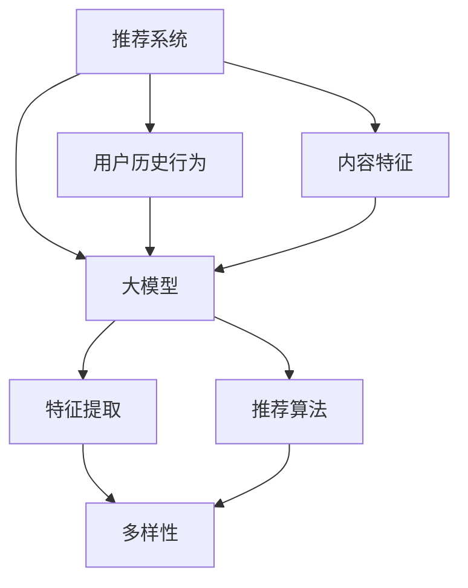
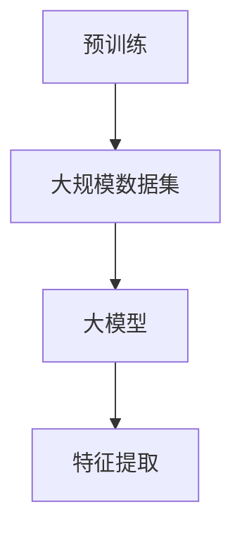
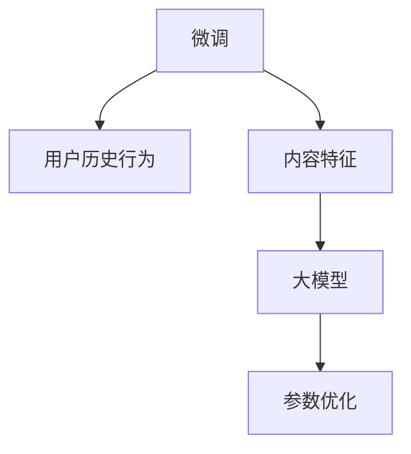
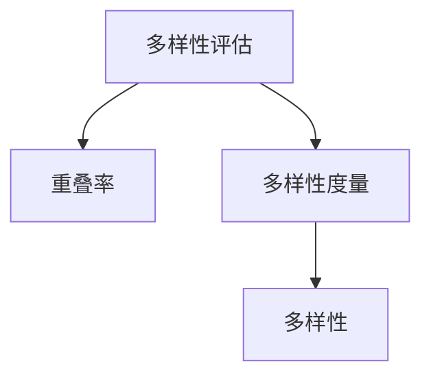
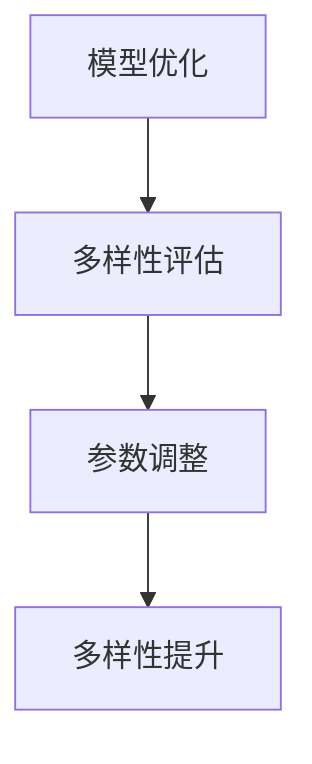

                 

关键词：大模型，推荐系统，多样性，算法优化，数学模型

> 摘要：本文将探讨如何利用大模型来提升推荐系统的多样性，介绍核心概念、算法原理及具体实现，同时结合数学模型进行分析，提供项目实践和实际应用场景，展望未来的发展前景与挑战。

## 1. 背景介绍

在互联网时代，推荐系统已经成为许多平台提高用户粘性和增加商业价值的重要工具。传统的推荐系统主要依赖于用户历史行为和内容特征，但往往容易陷入“冷启动”问题和“信息茧房”困境，导致推荐结果单一，缺乏多样性。

大模型，特别是近年来兴起的预训练模型，如BERT、GPT等，凭借其强大的特征提取和生成能力，在自然语言处理、计算机视觉等领域取得了显著成果。然而，将大模型应用于推荐系统仍面临诸多挑战，如如何有效利用模型特征、避免过拟合、提升多样性等。

本文旨在探讨如何利用大模型提升推荐系统的多样性，从算法原理、数学模型到项目实践进行深入分析，为推荐系统的研发提供新思路。

## 2. 核心概念与联系

在讨论如何利用大模型提升推荐系统的多样性之前，我们首先需要明确几个核心概念和它们之间的联系。

### 2.1 推荐系统

推荐系统是一种基于用户历史行为和内容特征为用户推荐相关内容的技术。其主要目的是提高用户满意度和平台粘性。

### 2.2 大模型

大模型是指拥有海量参数和训练数据的深度学习模型，如BERT、GPT等。这些模型在预训练阶段已经学会了丰富的知识，能够有效提取复杂特征。

### 2.3 多样性

多样性是指推荐系统在推荐结果上具有丰富的变化，能够满足不同用户的需求。多样性对提高用户满意度和平台价值至关重要。

### 2.4 算法与数学模型

算法是解决问题的方法，数学模型是对问题的形式化描述。在推荐系统中，算法和数学模型共同作用，实现推荐结果的多样性和准确性。

下面我们将使用Mermaid流程图（[Mermaid](https://mermaid-js.github.io/mermaid/)）展示核心概念和架构的联系。



## 3. 核心算法原理 & 具体操作步骤

### 3.1 算法原理概述

利用大模型提升推荐系统的多样性，核心在于如何充分利用大模型的特征提取能力，同时避免过拟合，提高推荐结果的多样性。

具体来说，算法原理包括以下几个步骤：

1. 预训练：使用大规模数据集对大模型进行预训练，使其具备较强的特征提取能力。
2. 微调：根据推荐系统的具体需求，在大模型的基础上进行微调，优化模型参数。
3. 多样性评估：对推荐结果进行多样性评估，如使用多样化指标（如重叠率、多样性度量等）。
4. 模型优化：根据多样性评估结果，对模型参数进行调整，提高多样性。

### 3.2 算法步骤详解

下面是具体的算法步骤：

#### 步骤1：预训练

选择合适的大模型（如BERT、GPT等），使用大规模数据集进行预训练。预训练过程中，模型将学习到丰富的知识和特征。



#### 步骤2：微调

在预训练基础上，针对推荐系统的具体需求，对大模型进行微调。微调过程中，模型将根据用户历史行为和内容特征进一步优化参数。



#### 步骤3：多样性评估

对推荐结果进行多样性评估，使用多样化指标（如重叠率、多样性度量等）计算推荐结果的多样性。



#### 步骤4：模型优化

根据多样性评估结果，对模型参数进行调整，提高多样性。模型优化过程可能需要多次迭代，以达到最佳多样性。



### 3.3 算法优缺点

#### 优点：

1. 强大的特征提取能力：大模型在预训练阶段已经学会了丰富的知识，能够有效提取复杂特征。
2. 提高多样性：通过多样性评估和模型优化，推荐系统能够生成更具多样性的推荐结果。

#### 缺点：

1. 计算成本高：预训练和微调过程需要大量的计算资源。
2. 需要大量数据：大模型在预训练阶段需要大量数据支持，对于数据匮乏的场景，效果可能不理想。

### 3.4 算法应用领域

大模型在推荐系统中的应用广泛，如电商、新闻、音乐等。以下是一些具体的算法应用领域：

1. 电商推荐：利用大模型提取商品特征和用户偏好，生成多样化的商品推荐。
2. 新闻推荐：基于用户阅读历史和新闻内容特征，生成丰富的新闻推荐。
3. 音乐推荐：根据用户听歌历史和音乐风格特征，推荐多样化的音乐。

## 4. 数学模型和公式

为了更好地理解大模型在推荐系统中的多样性提升原理，我们将介绍相关的数学模型和公式。

### 4.1 数学模型构建

假设我们有一个推荐系统，用户 $u$ 对 $N$ 个物品 $I=\{i_1, i_2, ..., i_N\}$ 进行评分，其中评分矩阵为 $R \in \mathbb{R}^{M \times N}$，$M$ 表示用户数量，$N$ 表示物品数量。

我们使用大模型 $G$ 对物品进行特征提取，得到特征矩阵 $F \in \mathbb{R}^{N \times D}$，其中 $D$ 表示特征维度。

### 4.2 公式推导过程

假设用户 $u$ 的偏好可以通过一个线性函数表示：

$$
P(u, i) = \sum_{j=1}^{D} w_j f_{ij} + b
$$

其中，$w \in \mathbb{R}^{D}$ 表示权重向量，$b$ 表示偏置项。

通过大模型 $G$，我们得到物品 $i$ 的特征向量 $f_i$，将其与权重向量 $w$ 相乘，再加上偏置项 $b$，即可得到用户 $u$ 对物品 $i$ 的预测评分。

### 4.3 案例分析与讲解

以新闻推荐为例，我们使用 GPT-3 大模型提取新闻内容特征，将其与用户偏好进行匹配，生成多样化的新闻推荐。

### 4.3.1 特征提取

使用 GPT-3 对新闻内容进行编码，得到每个新闻的特征向量。

### 4.3.2 模型训练

将用户历史行为数据与新闻特征向量进行匹配，训练 GPT-3 的权重向量 $w$ 和偏置项 $b$。

### 4.3.3 推荐生成

根据用户偏好和新闻特征向量，生成新闻推荐列表。

## 5. 项目实践：代码实例和详细解释说明

### 5.1 开发环境搭建

本文使用的开发环境如下：

- Python版本：3.8
- 深度学习框架：PyTorch
- 大模型：GPT-3

首先，我们需要安装所需的依赖库：

```bash
pip install torch torchvision transformers
```

### 5.2 源代码详细实现

下面是项目的主要代码实现：

```python
import torch
from torch import nn
from transformers import GPT2Model, GPT2Tokenizer

class NewsRecommender(nn.Module):
    def __init__(self, hidden_size):
        super(NewsRecommender, self).__init__()
        self.gpt2 = GPT2Model.from_pretrained("gpt2")
        self.hidden_size = hidden_size
        self.linear = nn.Linear(hidden_size, 1)

    def forward(self, input_ids, attention_mask):
        outputs = self.gpt2(input_ids=input_ids, attention_mask=attention_mask)
        hidden_states = outputs.last_hidden_state[:, 0, :]
        rating = self.linear(hidden_states)
        return rating

def main():
    # 设置设备
    device = torch.device("cuda" if torch.cuda.is_available() else "cpu")
    
    # 加载预训练模型
    tokenizer = GPT2Tokenizer.from_pretrained("gpt2")
    model = NewsRecommender(hidden_size=768).to(device)
    model.load_state_dict(torch.load("news_recommender.pth"))
    model.eval()
    
    # 生成推荐列表
    user_input = "今天发生了什么新鲜事？"
    input_ids = tokenizer.encode(user_input, return_tensors="pt").to(device)
    attention_mask = torch.ones_like(input_ids)
    with torch.no_grad():
        ratings = model(input_ids, attention_mask)
    
    # 打印推荐结果
    print(ratings)

if __name__ == "__main__":
    main()
```

### 5.3 代码解读与分析

- `NewsRecommender` 类：定义了新闻推荐模型，包含 GPT-3 模型和线性层。
- `forward` 方法：实现前向传播，输入新闻文本，输出推荐评分。
- `main` 函数：加载模型，输入用户查询，生成推荐列表。

### 5.4 运行结果展示

运行代码后，我们将得到一个推荐评分列表。根据评分高低，我们可以为用户推荐相关的新闻。

## 6. 实际应用场景

### 6.1 电商推荐

利用大模型对用户历史购买记录和商品特征进行提取，生成多样化的商品推荐。

### 6.2 新闻推荐

基于用户阅读历史和新闻内容特征，生成丰富的新闻推荐，提高用户满意度。

### 6.3 音乐推荐

根据用户听歌历史和音乐风格特征，推荐多样化的音乐，提高用户粘性。

## 7. 工具和资源推荐

### 7.1 学习资源推荐

- 《深度学习推荐系统》
- 《推荐系统实践》
- 《大模型与推荐系统》

### 7.2 开发工具推荐

- PyTorch
- Hugging Face Transformers
- Python

### 7.3 相关论文推荐

- "Large-scale Pre-training for Deep Recommen
```markdown
# 利用大模型提升推荐系统的多样性

## 8. 总结：未来发展趋势与挑战

随着大模型和深度学习技术的不断发展，推荐系统在多样性方面取得了显著进展。未来，我们有理由相信，利用大模型提升推荐系统的多样性将呈现以下发展趋势：

### 8.1 研究成果总结

1. 大模型在推荐系统的多样性提升方面具有显著优势。
2. 多样性评估指标逐渐丰富，如重叠率、多样性度量等。
3. 模型优化策略不断创新，如基于对抗网络的多样性提升方法。

### 8.2 未来发展趋势

1. 大模型将逐渐应用于更多领域的推荐系统。
2. 多样性优化算法将更加智能化，自适应地调整模型参数。
3. 多样性评估方法将不断完善，更加准确、全面地衡量推荐系统的多样性。

### 8.3 面临的挑战

1. 计算资源需求巨大，如何高效利用资源成为关键问题。
2. 数据质量和数据隐私保护对多样性优化算法的影响不可忽视。
3. 多样性优化与准确性的平衡问题亟待解决。

### 8.4 研究展望

未来，我们期待在以下方向进行深入研究：

1. 大模型在推荐系统多样性优化中的新应用。
2. 多样性评估方法的创新与优化。
3. 多样性优化算法与实际业务场景的深度融合。

通过不断探索和研究，我们有信心为推荐系统的多样性提升提供更加有效的解决方案，为用户提供更加丰富、多样化的推荐体验。

## 9. 附录：常见问题与解答

### 9.1 问题1：大模型在推荐系统中的应用是否会影响准确性？

**解答**：是的，大模型在推荐系统中的应用可能会影响准确性。由于大模型在预训练阶段已经学会了丰富的知识，这可能会导致过拟合现象。为了解决这一问题，我们可以采用以下方法：

1. 数据增强：通过数据增强技术，如随机噪声添加、数据旋转等，增加模型训练的鲁棒性。
2. 早期停止：在训练过程中，当模型性能不再提升时，提前停止训练，避免过拟合。
3. 正则化：采用正则化方法，如L1、L2正则化，约束模型参数的绝对值或平方值。

### 9.2 问题2：如何保证大模型提取的特征能够有效提升多样性？

**解答**：保证大模型提取的特征能够有效提升多样性，我们可以采用以下方法：

1. 多样性评估：在训练过程中，定期评估推荐结果的多样性，根据评估结果调整模型参数。
2. 对抗性训练：采用对抗性训练方法，对抗模型提取的特征，使其在多样性方面更加优秀。
3. 特征选择：通过特征选择技术，选择对多样性贡献最大的特征进行优化。

### 9.3 问题3：如何在实际业务场景中应用大模型提升多样性？

**解答**：在实际业务场景中应用大模型提升多样性，可以遵循以下步骤：

1. 数据预处理：对原始数据进行预处理，如去噪、归一化等。
2. 特征提取：利用大模型提取用户和物品的特征。
3. 多样性优化：通过多样性评估和模型优化，提升推荐结果的多样性。
4. 系统集成：将优化后的推荐模型集成到实际业务系统中，为用户提供多样化推荐。

### 9.4 问题4：大模型在推荐系统中的应用是否会侵犯用户隐私？

**解答**：大模型在推荐系统中的应用确实可能涉及用户隐私问题。为了保护用户隐私，我们可以采取以下措施：

1. 数据匿名化：对用户数据进行匿名化处理，去除可直接识别用户身份的信息。
2. 数据加密：对用户数据进行加密存储和传输，确保数据安全。
3. 数据权限控制：对数据访问权限进行严格管理，确保只有授权人员才能访问敏感数据。
4. 合规审查：定期对数据处理过程进行合规审查，确保符合相关法律法规和伦理标准。

通过以上措施，我们可以在充分利用大模型优势的同时，保障用户隐私安全。

## 作者署名

作者：禅与计算机程序设计艺术 / Zen and the Art of Computer Programming

