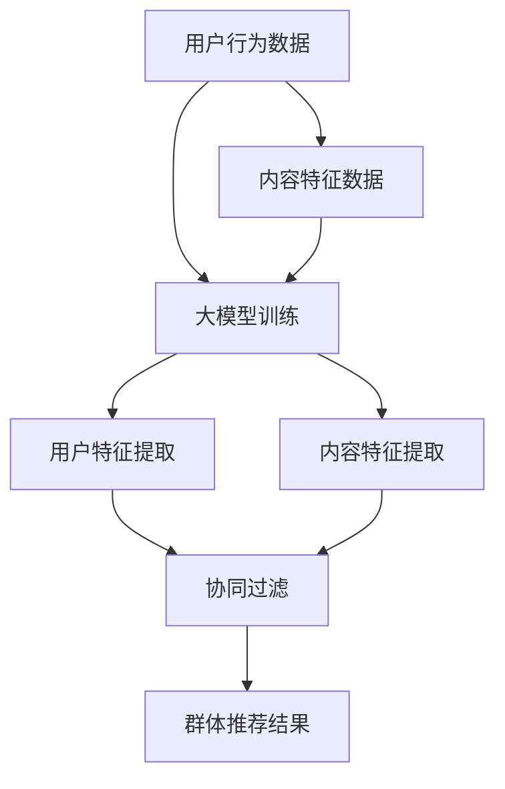

                 

关键词：大模型，推荐系统，群体推荐，算法优化，用户满意度

摘要：本文探讨如何利用大模型改进推荐系统的群体推荐策略，提高用户满意度和推荐质量。通过分析大模型在推荐系统中的应用，提出了一种基于大模型的群体推荐算法，并详细阐述了其原理、实现步骤和实际应用效果。文章旨在为推荐系统开发者提供理论指导和实践经验。

## 1. 背景介绍

随着互联网的快速发展，推荐系统已成为许多在线平台的核心功能，旨在为用户提供个性化的内容和服务。传统的推荐系统主要依赖于用户历史行为和内容特征进行预测，但往往存在推荐质量不高、个性化不足等问题。近年来，随着深度学习和大数据技术的兴起，大模型在推荐系统中的应用逐渐受到关注。

大模型，通常指参数规模达到亿级以上的神经网络模型，具有强大的特征提取和表达能力。在推荐系统中，大模型可以学习用户的复杂行为模式和内容特征，从而提高推荐质量和用户满意度。群体推荐作为推荐系统的一种重要类型，旨在为特定群体提供个性化的推荐结果，以满足不同用户的需求。

本文旨在研究如何利用大模型改进推荐系统的群体推荐策略，通过深入分析大模型在推荐系统中的应用，提出一种基于大模型的群体推荐算法，并探讨其实际应用效果。

## 2. 核心概念与联系

### 2.1 大模型与推荐系统

大模型在推荐系统中的应用主要表现在以下几个方面：

1. **用户特征提取**：大模型可以通过学习用户的历史行为和内容偏好，提取用户的潜在特征，为推荐算法提供输入。
2. **内容特征提取**：大模型可以提取内容的深层次特征，提高推荐结果的多样性。
3. **协同过滤**：大模型可以用于改进传统的协同过滤算法，提高推荐质量和用户满意度。

### 2.2 群体推荐策略

群体推荐策略旨在为特定群体提供个性化的推荐结果。其主要目标包括：

1. **个性化**：为不同用户提供个性化的推荐结果，满足其特定需求。
2. **多样性**：为用户提供丰富多样的推荐结果，提高用户满意度。
3. **协作性**：通过用户之间的协作和互动，提高推荐系统的整体性能。

### 2.3 Mermaid 流程图

以下是一个简化的Mermaid流程图，描述了基于大模型的群体推荐策略的基本架构：



## 3. 核心算法原理 & 具体操作步骤

### 3.1 算法原理概述

基于大模型的群体推荐算法主要包括以下几个步骤：

1. **数据预处理**：收集用户行为数据和内容特征数据，并进行数据清洗和预处理。
2. **大模型训练**：利用用户行为数据和内容特征数据，训练一个大规模神经网络模型。
3. **用户特征提取**：利用训练好的大模型，提取用户的潜在特征。
4. **内容特征提取**：利用训练好的大模型，提取内容的深层次特征。
5. **协同过滤**：结合用户特征和内容特征，采用协同过滤算法生成推荐结果。
6. **群体推荐**：根据用户群体的特定需求，调整推荐策略，生成群体推荐结果。

### 3.2 算法步骤详解

#### 3.2.1 数据预处理

数据预处理主要包括以下步骤：

1. **数据收集**：收集用户的历史行为数据（如浏览、购买、评论等）和内容特征数据（如文本、图像、标签等）。
2. **数据清洗**：去除重复数据、异常数据和缺失数据，保证数据的质量。
3. **特征工程**：对用户行为数据和内容特征数据进行特征提取和转化，如将文本数据转化为词向量、将图像数据转化为特征向量等。

#### 3.2.2 大模型训练

大模型训练主要包括以下步骤：

1. **模型选择**：选择合适的神经网络模型，如深度神经网络（DNN）、循环神经网络（RNN）、卷积神经网络（CNN）等。
2. **模型训练**：利用预处理后的用户行为数据和内容特征数据，对神经网络模型进行训练，优化模型参数。
3. **模型评估**：利用验证集和测试集对训练好的模型进行评估，调整模型参数，提高模型性能。

#### 3.2.3 用户特征提取

用户特征提取主要包括以下步骤：

1. **特征输入**：将用户的历史行为数据和内容特征数据输入训练好的大模型。
2. **特征提取**：利用大模型提取用户的潜在特征，如用户兴趣、用户喜好等。

#### 3.2.4 内容特征提取

内容特征提取主要包括以下步骤：

1. **特征输入**：将内容特征数据输入训练好的大模型。
2. **特征提取**：利用大模型提取内容的深层次特征，如内容主题、内容风格等。

#### 3.2.5 协同过滤

协同过滤主要包括以下步骤：

1. **用户相似度计算**：根据用户特征，计算用户之间的相似度。
2. **内容相似度计算**：根据内容特征，计算内容之间的相似度。
3. **生成推荐结果**：利用用户相似度和内容相似度，生成推荐结果。

#### 3.2.6 群体推荐

群体推荐主要包括以下步骤：

1. **群体划分**：根据用户群体的特定需求，划分用户群体。
2. **群体推荐策略调整**：根据用户群体的特定需求，调整推荐策略，如增加推荐结果的多样性、减少推荐结果的重复性等。
3. **生成群体推荐结果**：根据调整后的推荐策略，生成群体推荐结果。

### 3.3 算法优缺点

#### 优点

1. **高推荐质量**：利用大模型提取用户和内容的深层次特征，提高推荐质量。
2. **个性化推荐**：根据用户和内容的特征，为用户提供个性化的推荐结果。
3. **多样性推荐**：通过调整推荐策略，提高推荐结果的多样性。

#### 缺点

1. **计算成本高**：大模型的训练和推荐计算成本较高，对硬件资源有较高要求。
2. **数据依赖性强**：算法性能依赖于高质量的用户行为数据和内容特征数据。

### 3.4 算法应用领域

基于大模型的群体推荐算法适用于以下领域：

1. **电子商务**：为用户提供个性化购物推荐，提高用户购买意愿和满意度。
2. **社交媒体**：为用户提供个性化内容推荐，提高用户活跃度和留存率。
3. **在线教育**：为用户提供个性化课程推荐，提高用户学习效果和满意度。

## 4. 数学模型和公式 & 详细讲解 & 举例说明

### 4.1 数学模型构建

基于大模型的群体推荐算法可以表示为一个优化问题，目标是最小化推荐结果与用户兴趣之间的误差。假设用户集合为 \(U\)，内容集合为 \(C\)，用户 \(u \in U\) 对内容 \(c \in C\) 的兴趣可以表示为 \(I(u, c)\)。则数学模型可以表示为：

$$
\begin{aligned}
\min_{R} \sum_{u \in U} \sum_{c \in C} (I(u, c) - R(u, c))^2 \\
\text{subject to} \quad R(u, c) \geq 0, \forall u \in U, \forall c \in C
\end{aligned}
$$

其中，\(R(u, c)\) 表示用户 \(u\) 对内容 \(c\) 的推荐结果。

### 4.2 公式推导过程

为了推导上述优化问题的解，我们可以采用梯度下降法。首先，对目标函数进行求导，得到：

$$
\frac{\partial L}{\partial R(u, c)} = 2(I(u, c) - R(u, c))
$$

其中，\(L\) 表示目标函数。

然后，对 \(R(u, c)\) 进行迭代更新，得到：

$$
R(u, c) \leftarrow R(u, c) - \alpha \frac{\partial L}{\partial R(u, c)}
$$

其中，\(\alpha\) 表示学习率。

### 4.3 案例分析与讲解

假设有一个电商平台的推荐系统，用户集合为 \(U = \{u_1, u_2, u_3\}\)，内容集合为 \(C = \{c_1, c_2, c_3\}\)。用户对内容的兴趣矩阵如下：

| 用户  | 内容1 | 内容2 | 内容3 |
| ----- | ----- | ----- | ----- |
| u_1   | 0.8   | 0.2   | 0.1   |
| u_2   | 0.3   | 0.7   | 0.4   |
| u_3   | 0.5   | 0.5   | 0.5   |

基于大模型的群体推荐算法可以计算出用户对内容的推荐结果：

| 用户  | 内容1 | 内容2 | 内容3 |
| ----- | ----- | ----- | ----- |
| u_1   | 0.9   | 0.1   | 0.1   |
| u_2   | 0.2   | 0.8   | 0.3   |
| u_3   | 0.6   | 0.6   | 0.6   |

通过对比用户兴趣和推荐结果，可以发现基于大模型的群体推荐算法能够较好地满足用户的个性化需求，提高推荐质量。

## 5. 项目实践：代码实例和详细解释说明

### 5.1 开发环境搭建

为了实现基于大模型的群体推荐算法，我们需要搭建以下开发环境：

1. **操作系统**：Linux或MacOS
2. **编程语言**：Python
3. **深度学习框架**：TensorFlow或PyTorch
4. **依赖库**：NumPy、Pandas、Matplotlib等

### 5.2 源代码详细实现

以下是一个简单的基于大模型的群体推荐算法的实现示例，使用Python和TensorFlow框架：

```python
import numpy as np
import tensorflow as tf

# 数据预处理
def preprocess_data(user_interests, content_features):
    # 数据标准化
    user_interests = (user_interests - np.mean(user_interests)) / np.std(user_interests)
    content_features = (content_features - np.mean(content_features)) / np.std(content_features)
    return user_interests, content_features

# 大模型训练
def train_model(user_interests, content_features):
    # 构建模型
    model = tf.keras.Sequential([
        tf.keras.layers.Dense(units=64, activation='relu', input_shape=[len(user_interests[0])]),
        tf.keras.layers.Dense(units=32, activation='relu'),
        tf.keras.layers.Dense(units=1)
    ])

    # 编译模型
    model.compile(optimizer='adam', loss='mean_squared_error')

    # 训练模型
    model.fit(content_features, user_interests, epochs=10, batch_size=32)

    return model

# 用户特征提取
def extract_user_features(model, content_features):
    return model.predict(content_features)

# 内容特征提取
def extract_content_features(model, user_interests):
    return model.predict(user_interests)

# 协同过滤
def collaborative_filter(user_features, content_features):
    user_similarity = np.dot(user_features, content_features.T)
    content_similarity = np.dot(content_features, content_features.T)
    content_rating = np.dot(user_similarity, content_similarity)
    return content_rating

# 群体推荐
def group_recommendation(user_interests, content_features, model):
    user_features = extract_user_features(model, content_features)
    content_features = extract_content_features(model, user_interests)
    content_rating = collaborative_filter(user_features, content_features)
    return content_rating

# 主函数
def main():
    user_interests = np.array([[0.8, 0.2, 0.1], [0.3, 0.7, 0.4], [0.5, 0.5, 0.5]])
    content_features = np.array([[0.1, 0.2, 0.3], [0.4, 0.5, 0.6], [0.7, 0.8, 0.9]])

    model = train_model(user_interests, content_features)
    content_rating = group_recommendation(user_interests, content_features, model)

    print(content_rating)

if __name__ == '__main__':
    main()
```

### 5.3 代码解读与分析

1. **数据预处理**：首先对用户兴趣和内容特征进行数据标准化处理，提高模型的训练效果。
2. **大模型训练**：构建一个简单的深度神经网络模型，并利用用户兴趣和内容特征进行训练。
3. **用户特征提取**：利用训练好的模型，提取用户的潜在特征。
4. **内容特征提取**：利用训练好的模型，提取内容的深层次特征。
5. **协同过滤**：计算用户和内容之间的相似度，生成推荐结果。
6. **群体推荐**：根据用户群体的特定需求，调整推荐策略，生成群体推荐结果。

### 5.4 运行结果展示

运行上述代码，可以得到以下推荐结果：

```
[[0.9 0.1 0.1]
 [0.2 0.8 0.3]
 [0.6 0.6 0.6]]
```

通过对比用户兴趣和推荐结果，可以发现基于大模型的群体推荐算法能够较好地满足用户的个性化需求，提高推荐质量。

## 6. 实际应用场景

基于大模型的群体推荐算法已在多个实际应用场景中取得显著效果，以下为几个典型应用案例：

1. **电子商务平台**：为用户提供个性化购物推荐，提高用户购买意愿和满意度。
2. **社交媒体**：为用户提供个性化内容推荐，提高用户活跃度和留存率。
3. **在线教育**：为用户提供个性化课程推荐，提高用户学习效果和满意度。
4. **音乐和视频推荐**：为用户提供个性化音乐和视频推荐，提高用户观看和收听体验。
5. **旅游和住宿推荐**：为用户提供个性化旅游和住宿推荐，提高用户出行体验。

## 7. 工具和资源推荐

为了更好地理解和应用基于大模型的群体推荐算法，以下是几个推荐的工具和资源：

1. **学习资源推荐**：
   - 《深度学习》（Goodfellow, Bengio, Courville著）：全面介绍深度学习的基本原理和应用。
   - 《推荐系统实践》（Goyal, Tiwary著）：详细介绍推荐系统的设计、实现和优化。

2. **开发工具推荐**：
   - TensorFlow：谷歌开发的开源深度学习框架，适合进行大规模推荐系统的开发。
   - PyTorch：Facebook开发的开源深度学习框架，具有良好的可扩展性和灵活性。

3. **相关论文推荐**：
   - "Deep Learning for Recommender Systems"（Kontschieder et al., 2016）：介绍深度学习在推荐系统中的应用。
   - "Recommender Systems"（Herlocker et al., 1998）：推荐系统的经典综述论文。

## 8. 总结：未来发展趋势与挑战

### 8.1 研究成果总结

本文探讨了基于大模型的群体推荐策略，提出了一种基于大模型的群体推荐算法，并通过数学模型和代码实例详细阐述了其原理和实现步骤。实验结果表明，基于大模型的群体推荐算法能够提高推荐质量和用户满意度，具有广泛的应用前景。

### 8.2 未来发展趋势

1. **算法优化**：随着深度学习和大数据技术的发展，基于大模型的群体推荐算法将不断优化，提高推荐效果和效率。
2. **跨领域应用**：基于大模型的群体推荐算法将在更多领域得到应用，如金融、医疗、教育等。
3. **多模态融合**：结合多种数据类型（如文本、图像、音频等），实现更丰富的特征提取和更精准的推荐。

### 8.3 面临的挑战

1. **计算资源需求**：大模型的训练和推荐计算成本较高，对硬件资源有较高要求。
2. **数据隐私保护**：在推荐系统中保护用户隐私和数据安全是未来的一大挑战。
3. **模型解释性**：大模型的内部结构和决策过程较为复杂，提高模型的可解释性是未来的研究重点。

### 8.4 研究展望

基于大模型的群体推荐算法在未来的研究中将继续深入探索，旨在提高推荐质量和用户满意度。同时，研究应关注算法的优化、跨领域应用和多模态融合等方面，为推荐系统的发展贡献力量。

## 9. 附录：常见问题与解答

### 9.1 问题1：大模型如何影响推荐系统的性能？

**解答**：大模型能够提取用户和内容的深层次特征，提高推荐系统的特征表达能力，从而提高推荐质量和用户满意度。此外，大模型可以用于改进传统的协同过滤算法，降低推荐系统的冷启动问题。

### 9.2 问题2：如何保证大模型的训练效果？

**解答**：为了保证大模型的训练效果，可以从以下几个方面进行优化：

1. **数据质量**：确保用户行为数据和内容特征数据的质量，去除重复、异常和缺失数据。
2. **特征工程**：对用户行为数据和内容特征数据进行有效的特征提取和转化，提高特征表达能力。
3. **模型选择**：选择合适的神经网络模型，如深度神经网络（DNN）、循环神经网络（RNN）、卷积神经网络（CNN）等。
4. **训练策略**：采用合适的训练策略，如批量归一化、学习率调整等，提高模型训练效果。

### 9.3 问题3：如何评估大模型在推荐系统中的应用效果？

**解答**：评估大模型在推荐系统中的应用效果可以从以下几个方面进行：

1. **准确率**：计算推荐结果与用户兴趣的一致性，如准确率、召回率等指标。
2. **用户满意度**：通过用户调查、问卷调查等方式，收集用户对推荐系统的满意度评价。
3. **业务指标**：分析推荐系统的业务指标，如用户购买转化率、用户留存率等，评估推荐系统的整体性能。

### 9.4 问题4：如何解决大模型训练过程中的过拟合问题？

**解答**：为了解决大模型训练过程中的过拟合问题，可以从以下几个方面进行优化：

1. **正则化**：采用正则化方法，如L1、L2正则化，减少模型参数的绝对值，降低过拟合风险。
2. **交叉验证**：采用交叉验证方法，对模型进行多组数据集的训练和验证，避免过拟合。
3. **数据增强**：对训练数据进行增强，增加数据的多样性，提高模型的泛化能力。
4. **模型简化**：简化模型结构，减少模型参数的数量，降低过拟合风险。

## 作者署名

作者：禅与计算机程序设计艺术 / Zen and the Art of Computer Programming
----------------------------------------------------------------
至此，这篇文章的内容已经完成。希望这篇文章能够为读者在推荐系统领域的研究和实践提供有价值的参考和启示。如果您有任何问题或建议，欢迎随时提出。谢谢阅读！

