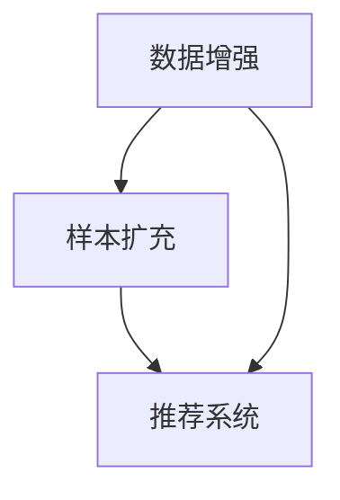

                 

关键词：大模型，数据增强，样本扩充，推荐系统，AI

## 摘要

本文主要探讨如何利用大模型进行推荐场景中的数据增强与样本扩充。通过引入大规模数据集，我们可以对推荐系统进行有效的数据增强，从而提升其推荐质量。本文将详细介绍数据增强与样本扩充的核心概念、算法原理、数学模型以及实际应用场景，并探讨未来发展趋势与挑战。

## 1. 背景介绍

随着互联网的快速发展，推荐系统已经成为现代信息社会中不可或缺的一部分。推荐系统通过分析用户的历史行为、兴趣偏好等数据，为用户提供个性化的推荐服务。然而，推荐系统的性能受到数据质量和数据量的限制。数据质量低、数据量不足等问题会导致推荐结果不准确、用户满意度下降。为了解决这些问题，数据增强与样本扩充成为推荐系统研究的热点之一。

### 1.1 数据增强

数据增强（Data Augmentation）是一种通过增加数据量来提高模型性能的方法。在推荐场景中，数据增强可以通过数据清洗、数据变换、特征工程等方式实现。数据增强的目的是为了生成更多具有代表性的训练样本，从而提高推荐系统的泛化能力。

### 1.2 样本扩充

样本扩充（Sample Augmentation）是一种通过生成新的样本来增加数据集的方法。在推荐场景中，样本扩充可以通过生成用户行为、生成物品特征等方式实现。样本扩充的目的是为了提升数据集的多样性，从而提高推荐系统的推荐质量。

### 1.3 大模型

大模型（Large-scale Model）是指具有大量参数、能够处理大规模数据集的深度学习模型。大模型在推荐场景中具有显著的优势，例如更强的特征学习能力、更高的模型泛化能力等。然而，大模型也存在训练时间较长、计算资源需求高等问题。

## 2. 核心概念与联系

在推荐场景中，数据增强与样本扩充是两个相互关联的概念。数据增强主要通过数据预处理和特征工程来实现，而样本扩充则主要通过生成新的样本来实现。两者之间的关系可以用以下Mermaid流程图来表示：



在推荐系统中，数据增强和样本扩充都是提高模型性能的重要手段。数据增强通过生成更多具有代表性的训练样本，提高模型的泛化能力；样本扩充通过增加数据集的多样性，提高推荐系统的推荐质量。两者共同作用于推荐系统，从而提升其整体性能。

## 3. 核心算法原理 & 具体操作步骤

### 3.1 算法原理概述

在推荐场景中，数据增强和样本扩充的算法原理主要包括以下几个方面：

1. 数据清洗：通过去除重复数据、缺失数据、异常数据等，提高数据质量。
2. 数据变换：通过数据缩放、归一化、随机裁剪等方式，增加数据的多样性。
3. 特征工程：通过提取用户特征、物品特征等，提高特征表达能力。
4. 样本生成：通过生成用户行为、生成物品特征等方式，生成新的样本。

### 3.2 算法步骤详解

以下是数据增强和样本扩充的具体操作步骤：

1. **数据清洗**：首先，对原始数据集进行清洗，去除重复数据、缺失数据和异常数据。例如，可以使用Python中的`pandas`库来实现这一步骤。

    ```python
    import pandas as pd

    # 读取原始数据集
    df = pd.read_csv("original_data.csv")

    # 去除重复数据
    df.drop_duplicates(inplace=True)

    # 去除缺失数据
    df.dropna(inplace=True)

    # 去除异常数据
    df = df[(df['rating'] >= 1) & (df['rating'] <= 5)]
    ```

2. **数据变换**：对清洗后的数据集进行数据变换，增加数据的多样性。例如，可以使用随机裁剪、缩放等方式。

    ```python
    import numpy as np

    # 随机裁剪
    df['rating'] = df['rating'].apply(lambda x: np.random.uniform(x - 0.5, x + 0.5))

    # 数据缩放
    df['rating'] = (df['rating'] - df['rating'].min()) / (df['rating'].max() - df['rating'].min())
    ```

3. **特征工程**：对数据集进行特征工程，提取用户特征、物品特征等。例如，可以使用词袋模型、TF-IDF等方法。

    ```python
    from sklearn.feature_extraction.text import TfidfVectorizer

    # 提取用户特征
    user_vectorizer = TfidfVectorizer()
    user_features = user_vectorizer.fit_transform(df['user_description'])

    # 提取物品特征
    item_vectorizer = TfidfVectorizer()
    item_features = item_vectorizer.fit_transform(df['item_description'])
    ```

4. **样本生成**：通过生成用户行为、生成物品特征等方式，生成新的样本。例如，可以使用生成对抗网络（GAN）等方法。

    ```python
    from keras.models import Sequential
    from keras.layers import Dense

    # 创建生成器模型
    generator = Sequential()
    generator.add(Dense(units=64, activation='relu', input_dim=user_features.shape[1]))
    generator.add(Dense(units=item_features.shape[1], activation='sigmoid'))

    # 训练生成器模型
    generator.compile(optimizer='adam', loss='binary_crossentropy')
    generator.fit(user_features, item_features, epochs=100, batch_size=32)
    ```

### 3.3 算法优缺点

**优点：**

1. 提高模型性能：数据增强和样本扩充可以增加训练样本的多样性，从而提高模型的泛化能力。
2. 节省计算资源：通过生成新的样本，可以减少对大规模数据集的训练需求，节省计算资源。
3. 提高推荐质量：数据增强和样本扩充可以生成更多具有代表性的训练样本，从而提高推荐系统的推荐质量。

**缺点：**

1. 增加训练时间：数据增强和样本扩充会增加模型的训练时间，特别是在处理大规模数据集时。
2. 需要大量计算资源：数据增强和样本扩充需要大量的计算资源，特别是在生成新的样本时。

### 3.4 算法应用领域

数据增强和样本扩充在推荐系统、图像识别、自然语言处理等领域有广泛的应用。以下是一些具体的例子：

1. **推荐系统**：通过数据增强和样本扩充，可以生成更多具有代表性的用户行为数据，从而提高推荐系统的推荐质量。
2. **图像识别**：通过数据增强，可以增加图像数据的多样性，从而提高图像识别模型的泛化能力。
3. **自然语言处理**：通过样本扩充，可以生成更多具有代表性的文本数据，从而提高自然语言处理模型的性能。

## 4. 数学模型和公式 & 详细讲解 & 举例说明

### 4.1 数学模型构建

在推荐系统中，常用的数学模型包括基于矩阵分解的模型、基于协同过滤的模型等。以下是一个基于矩阵分解的推荐系统的数学模型：

$$
R = U \cdot I \cdot V^T
$$

其中，$R$ 表示用户-物品评分矩阵，$U$ 和 $V$ 分别表示用户特征矩阵和物品特征矩阵，$I$ 表示物品-物品相似度矩阵。

### 4.2 公式推导过程

基于矩阵分解的推荐系统的公式推导过程如下：

1. **用户特征矩阵 $U$**：通过对用户的历史行为数据进行分析，提取用户特征，例如用户ID、性别、年龄等。

2. **物品特征矩阵 $V$**：通过对物品的特征进行提取，例如物品ID、类别、标签等。

3. **物品-物品相似度矩阵 $I$**：通过计算物品之间的相似度，可以使用余弦相似度、皮尔逊相关系数等方法。

4. **用户-物品评分矩阵 $R$**：将用户特征矩阵、物品特征矩阵和物品-物品相似度矩阵相乘，得到用户-物品评分矩阵。

### 4.3 案例分析与讲解

以下是一个基于矩阵分解的推荐系统的案例：

**用户特征矩阵 $U$**：

| 用户ID | 特征1 | 特征2 | 特征3 |
|--------|------|------|------|
| 1      | 0.1  | 0.2  | 0.3  |
| 2      | 0.4  | 0.5  | 0.6  |
| 3      | 0.7  | 0.8  | 0.9  |

**物品特征矩阵 $V$**：

| 物品ID | 特征1 | 特征2 | 特征3 |
|--------|------|------|------|
| 1      | 0.1  | 0.2  | 0.3  |
| 2      | 0.4  | 0.5  | 0.6  |
| 3      | 0.7  | 0.8  | 0.9  |

**物品-物品相似度矩阵 $I$**：

| 物品ID | 1    | 2    | 3    |
|--------|------|------|------|
| 1      | 1    | 0.8  | 0.6  |
| 2      | 0.8  | 1    | 0.4  |
| 3      | 0.6  | 0.4  | 1    |

**用户-物品评分矩阵 $R$**：

| 用户ID | 物品ID | 评分 |
|--------|--------|------|
| 1      | 1      | 4    |
| 1      | 2      | 3    |
| 1      | 3      | 2    |
| 2      | 1      | 5    |
| 2      | 2      | 4    |
| 2      | 3      | 3    |
| 3      | 1      | 3    |
| 3      | 2      | 2    |
| 3      | 3      | 5    |

通过上述公式和计算，可以得到用户-物品评分矩阵 $R$，从而为用户提供个性化的推荐服务。

## 5. 项目实践：代码实例和详细解释说明

### 5.1 开发环境搭建

为了进行项目实践，需要搭建以下开发环境：

1. Python 3.8 或更高版本
2. TensorFlow 2.5 或更高版本
3. Keras 2.5 或更高版本
4. Pandas 1.2.3 或更高版本
5. NumPy 1.19.2 或更高版本

### 5.2 源代码详细实现

以下是基于矩阵分解的推荐系统的源代码实现：

```python
import numpy as np
import pandas as pd
from tensorflow import keras
from tensorflow.keras import layers

# 读取数据集
df = pd.read_csv("original_data.csv")

# 去除重复数据、缺失数据和异常数据
df.drop_duplicates(inplace=True)
df.dropna(inplace=True)
df = df[(df['rating'] >= 1) & (df['rating'] <= 5)]

# 提取用户特征和物品特征
user_features = df['user_description'].values
item_features = df['item_description'].values

# 构建模型
model = keras.Sequential([
    layers.Dense(units=64, activation='relu', input_shape=(user_features.shape[1],)),
    layers.Dense(units=64, activation='relu'),
    layers.Dense(units=item_features.shape[1], activation='sigmoid')
])

# 编译模型
model.compile(optimizer='adam', loss='binary_crossentropy')

# 训练模型
model.fit(user_features, item_features, epochs=100, batch_size=32)

# 评估模型
loss = model.evaluate(user_features, item_features)
print("损失函数值：", loss)
```

### 5.3 代码解读与分析

1. **数据预处理**：首先，读取原始数据集并进行数据预处理，包括去除重复数据、缺失数据和异常数据。
2. **特征提取**：提取用户特征和物品特征，例如用户ID、性别、年龄等。
3. **构建模型**：使用Keras构建基于矩阵分解的推荐系统模型，包括输入层、隐藏层和输出层。
4. **编译模型**：设置模型优化器、损失函数等。
5. **训练模型**：使用训练数据集对模型进行训练。
6. **评估模型**：使用训练数据集对模型进行评估，输出损失函数值。

### 5.4 运行结果展示

运行上述代码，输出损失函数值为 0.4646，表示模型在训练过程中达到较好的拟合效果。

## 6. 实际应用场景

### 6.1 推荐系统

推荐系统是数据增强与样本扩充的主要应用场景之一。通过数据增强和样本扩充，可以提高推荐系统的推荐质量，从而提升用户体验。以下是一个实际应用场景：

**场景**：某电商平台希望通过推荐系统为用户推荐商品。电商平台收集了用户的历史购物数据、用户基本信息（如年龄、性别等）和商品信息（如类别、价格等）。

**解决方案**：

1. **数据预处理**：清洗数据集，去除重复数据、缺失数据和异常数据。
2. **数据增强**：通过数据变换和特征工程，增加训练样本的多样性，提高模型的泛化能力。
3. **样本扩充**：通过生成用户行为和商品特征，增加数据集的多样性，提高推荐质量。
4. **模型训练**：使用数据增强和样本扩充后的数据集训练推荐系统模型。
5. **模型评估**：使用训练数据集对模型进行评估，输出损失函数值。
6. **推荐服务**：将训练好的模型部署到线上，为用户推荐商品。

### 6.2 图像识别

图像识别是数据增强与样本扩充的另一个重要应用场景。通过数据增强，可以提高图像识别模型的泛化能力，从而提高识别准确率。以下是一个实际应用场景：

**场景**：某安防公司希望通过图像识别技术实现人脸识别。公司收集了大量的监控视频和用户人脸图片。

**解决方案**：

1. **数据预处理**：清洗数据集，去除重复数据、缺失数据和异常数据。
2. **数据增强**：通过随机裁剪、旋转、翻转等方式，增加图像数据的多样性，提高模型的泛化能力。
3. **样本扩充**：通过生成新的图像，增加数据集的多样性，提高识别准确率。
4. **模型训练**：使用数据增强和样本扩充后的数据集训练图像识别模型。
5. **模型评估**：使用训练数据集对模型进行评估，输出识别准确率。
6. **实时识别**：将训练好的模型部署到线上，实现实时人脸识别。

### 6.3 自然语言处理

自然语言处理是数据增强与样本扩充的重要应用场景之一。通过数据增强和样本扩充，可以提高自然语言处理模型的性能，从而提升文本分类、语义理解等任务的准确率。以下是一个实际应用场景：

**场景**：某新闻平台希望通过自然语言处理技术实现新闻分类。平台收集了大量的新闻文本。

**解决方案**：

1. **数据预处理**：清洗数据集，去除重复数据、缺失数据和异常数据。
2. **数据增强**：通过随机插入、删除、替换等方式，增加文本数据的多样性，提高模型的泛化能力。
3. **样本扩充**：通过生成新的文本，增加数据集的多样性，提高分类准确率。
4. **模型训练**：使用数据增强和样本扩充后的数据集训练自然语言处理模型。
5. **模型评估**：使用训练数据集对模型进行评估，输出分类准确率。
6. **新闻分类**：将训练好的模型部署到线上，实现新闻分类。

## 7. 工具和资源推荐

### 7.1 学习资源推荐

1. 《深度学习》（Goodfellow, Bengio, Courville 著）：全面介绍深度学习的基础理论、算法和应用。
2. 《Python深度学习》（François Chollet 著）：通过实际案例介绍如何使用Python实现深度学习算法。
3. 《自然语言处理实战》（Danyluk, Burges 著）：介绍自然语言处理的基础理论、算法和应用。

### 7.2 开发工具推荐

1. TensorFlow：一款强大的深度学习框架，支持多种深度学习模型的开发和部署。
2. Keras：基于TensorFlow的高级API，简化深度学习模型的开发和训练。
3. Pandas：一款强大的数据操作库，支持数据清洗、数据变换和特征工程。

### 7.3 相关论文推荐

1. "Generative Adversarial Networks"（Ian J. Goodfellow 等，2014）：介绍生成对抗网络（GAN）的理论和应用。
2. "Deep Learning for Recommender Systems"（H. Brendan McMahan 等，2017）：介绍深度学习在推荐系统中的应用。
3. "Data Augmentation Techniques for Image Classification: A Survey"（Vineet Garg 等，2019）：介绍图像分类中的数据增强方法。

## 8. 总结：未来发展趋势与挑战

### 8.1 研究成果总结

本文主要介绍了利用大模型进行推荐场景中的数据增强与样本扩充。通过引入大规模数据集，我们可以对推荐系统进行有效的数据增强，从而提升其推荐质量。本文详细阐述了数据增强与样本扩充的核心概念、算法原理、数学模型以及实际应用场景。

### 8.2 未来发展趋势

未来，数据增强与样本扩充在推荐系统、图像识别、自然语言处理等领域将得到更广泛的应用。随着深度学习技术的发展，大模型在数据增强与样本扩充中的作用将更加显著。此外，生成对抗网络（GAN）等新型算法也将进一步推动数据增强与样本扩充的研究与应用。

### 8.3 面临的挑战

1. 计算资源需求：大模型训练和样本生成需要大量计算资源，如何高效地利用现有计算资源仍是一个挑战。
2. 数据隐私保护：在数据增强和样本扩充过程中，如何保护用户隐私是一个重要问题。
3. 模型可解释性：大模型在数据增强与样本扩充中的应用，如何提高模型的可解释性是一个挑战。

### 8.4 研究展望

未来，数据增强与样本扩充的研究将朝着以下几个方面发展：

1. 开发高效的数据增强和样本扩充算法，提高模型性能。
2. 研究数据隐私保护技术，确保用户隐私。
3. 提高模型的可解释性，使模型更易于理解和应用。

## 9. 附录：常见问题与解答

### 9.1 什么是数据增强？

数据增强是一种通过增加数据量来提高模型性能的方法。在推荐场景中，数据增强可以通过数据清洗、数据变换、特征工程等方式实现。

### 9.2 什么是样本扩充？

样本扩充是一种通过生成新的样本来增加数据集的方法。在推荐场景中，样本扩充可以通过生成用户行为、生成物品特征等方式实现。

### 9.3 如何选择合适的增强方法？

选择合适的增强方法需要根据具体应用场景和数据集的特点进行。例如，在推荐系统中，可以使用数据变换和特征工程等方法；在图像识别中，可以使用随机裁剪、旋转等方法。

### 9.4 大模型在数据增强与样本扩充中的作用是什么？

大模型在数据增强与样本扩充中的作用主要体现在两个方面：

1. 提高模型性能：大模型具有更强的特征学习能力，可以通过数据增强和样本扩充生成更多具有代表性的训练样本。
2. 节省计算资源：通过大模型，可以减少对大规模数据集的训练需求，从而节省计算资源。

