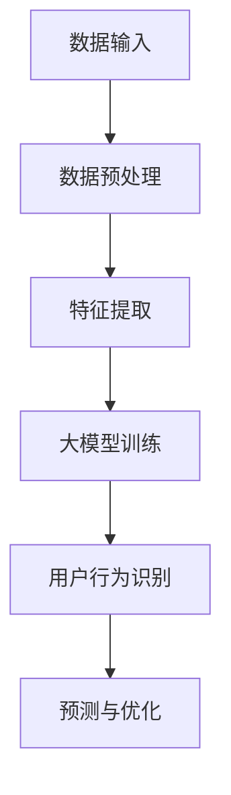

                 

关键词：大模型、推荐系统、用户行为、模式挖掘、算法原理、数学模型、项目实践、应用场景、工具推荐

> 摘要：本文深入探讨了利用大规模人工智能模型进行推荐场景下用户行为模式的挖掘技术。首先介绍了推荐系统的基本概念和重要性，然后详细阐述了大模型在用户行为模式挖掘中的核心原理和算法步骤。接着，通过数学模型和公式的推导，展示了如何构建有效的用户行为模型。文章还通过项目实践展示了具体实现过程和代码分析，最后对实际应用场景进行了探讨，并展望了未来的发展趋势和挑战。

## 1. 背景介绍

### 推荐系统的重要性

推荐系统是现代信息社会中的一项关键技术，它在电子商务、社交媒体、在线视频、新闻资讯等领域都发挥着至关重要的作用。一个优秀的推荐系统能够根据用户的历史行为和偏好，为用户推荐个性化的内容和服务，从而提升用户体验，增加用户粘性，并提高商业收益。随着互联网的普及和用户数据的爆炸式增长，推荐系统的研究和应用也日益深入和广泛。

### 大模型的发展与应用

近年来，深度学习技术的迅猛发展带来了大规模人工智能模型的崛起。这些模型具有强大的数据处理和特征提取能力，能够处理海量用户数据，从中挖掘出深层次的用户行为模式。大模型在自然语言处理、计算机视觉、语音识别等领域取得了显著的成果，同时也在推荐系统中展现出巨大的潜力。利用大模型进行用户行为模式挖掘，已经成为推荐系统研究的一个重要方向。

## 2. 核心概念与联系

### 大模型与用户行为模式挖掘的关系

大模型在用户行为模式挖掘中的应用，主要体现在以下几个方面：

1. **数据预处理**：大模型能够高效地对用户数据进行预处理，包括数据清洗、归一化、特征提取等，从而为后续分析提供高质量的数据基础。
2. **特征表示**：大模型通过深度神经网络等结构，能够自动学习用户行为的复杂特征表示，使传统的手工特征工程变得不再必要。
3. **模式识别**：大模型具备强大的模式识别能力，能够从用户行为数据中识别出潜在的模式和趋势，为推荐系统提供决策支持。
4. **预测与优化**：大模型能够对用户未来的行为进行预测，并在此基础上不断优化推荐策略，提高推荐效果。

### Mermaid 流程图



在这个流程图中，A表示用户数据的输入，经过数据预处理（B）和特征提取（C），然后输入到大模型进行训练（D）。训练完成后，大模型能够识别出用户的行为模式（E），并在此基础上进行预测与优化（F），最终为推荐系统提供决策支持。

## 3. 核心算法原理 & 具体操作步骤

### 3.1 算法原理概述

大模型在用户行为模式挖掘中的核心算法原理主要包括以下几个方面：

1. **深度学习模型**：使用深度学习模型（如卷积神经网络（CNN）、循环神经网络（RNN）、变分自编码器（VAE）等）对用户行为数据进行训练，学习数据的复杂特征表示。
2. **协同过滤**：结合协同过滤算法（如基于用户最近行为的协同过滤、基于内容的协同过滤等），从用户的历史行为数据中挖掘潜在的用户偏好和兴趣。
3. **图神经网络**：利用图神经网络（如图卷积网络（GCN）、图注意力网络（GAT）等）对用户行为数据进行建模，通过图结构来捕捉用户行为之间的复杂关系。
4. **迁移学习**：利用迁移学习技术，将预训练的大模型应用于用户行为模式挖掘任务，提高模型的泛化能力和计算效率。

### 3.2 算法步骤详解

1. **数据收集与预处理**：收集用户行为数据，包括用户访问记录、点击行为、购买记录等。对数据进行清洗、归一化和特征提取，得到适合模型训练的数据集。
2. **模型选择与训练**：选择合适的深度学习模型，如CNN、RNN、VAE等，对预处理后的用户行为数据进行训练。模型训练过程中，使用交叉熵损失函数进行优化，并采用梯度下降等优化算法。
3. **特征提取与融合**：使用训练好的大模型对用户行为数据进行特征提取，提取出用户行为的抽象特征表示。然后将这些特征进行融合，得到更丰富的用户行为特征向量。
4. **模式识别与预测**：利用融合后的用户行为特征向量，采用协同过滤、图神经网络等技术进行用户行为模式的识别和预测。通过交叉验证等方法评估模型性能，并根据评估结果进行调整和优化。

### 3.3 算法优缺点

**优点**：

1. **强大的数据处理能力**：大模型能够高效地处理海量用户数据，提取出深层次的特征表示。
2. **自动特征提取**：避免了传统手工特征工程的工作量，提高模型的开发效率。
3. **良好的泛化能力**：通过迁移学习等技术，大模型能够在不同领域和任务中表现出良好的泛化能力。

**缺点**：

1. **计算资源消耗大**：大模型训练和推理过程需要大量的计算资源和时间，对硬件设备有较高的要求。
2. **数据隐私问题**：在用户行为模式挖掘过程中，可能会涉及到用户隐私数据的处理，需要采取相应的隐私保护措施。
3. **模型解释性不足**：深度学习模型通常缺乏良好的解释性，难以理解模型内部的决策过程。

### 3.4 算法应用领域

大模型在用户行为模式挖掘中的算法应用领域非常广泛，包括但不限于：

1. **电子商务推荐**：为用户提供个性化的商品推荐，提升用户购买体验和商业收益。
2. **社交媒体推荐**：为用户推荐感兴趣的内容和好友，增加用户社交互动和平台粘性。
3. **在线视频推荐**：为用户提供个性化的视频推荐，提升用户观看体验和平台用户时长。
4. **新闻资讯推荐**：为用户提供个性化的新闻资讯推荐，提升用户阅读兴趣和媒体影响力。

## 4. 数学模型和公式 & 详细讲解 & 举例说明

### 4.1 数学模型构建

在用户行为模式挖掘中，常用的数学模型包括以下几个方面：

1. **用户行为序列模型**：使用马尔可夫模型（Markov Model）或隐马尔可夫模型（Hidden Markov Model, HMM）来建模用户行为序列。
2. **协同过滤模型**：使用矩阵分解（Matrix Factorization）或协同过滤（Collaborative Filtering）算法来预测用户对物品的评分或偏好。
3. **图神经网络模型**：使用图卷积网络（Graph Convolutional Network, GCN）或图注意力网络（Graph Attention Network, GAT）来建模用户行为数据的图结构。

### 4.2 公式推导过程

以马尔可夫模型为例，其状态转移概率矩阵可以表示为：

$$
P = \begin{bmatrix}
p_{11} & p_{12} & \dots & p_{1n} \\
p_{21} & p_{22} & \dots & p_{2n} \\
\vdots & \vdots & \ddots & \vdots \\
p_{m1} & p_{m2} & \dots & p_{mn}
\end{bmatrix}
$$

其中，$p_{ij}$ 表示从状态 $i$ 转移到状态 $j$ 的概率。

### 4.3 案例分析与讲解

假设有一个用户行为序列为 $\{1, 2, 3, 4, 5\}$，其中每个数字表示用户在时间步 $t$ 的行为。我们使用马尔可夫模型来预测用户在下一个时间步 $t+1$ 的行为。

根据状态转移概率矩阵 $P$，我们可以计算每个状态在下一个时间步的概率分布。例如，用户在当前时间步处于状态 $1$ 的概率为 $p_{11}$，那么在下一个时间步转移至状态 $2$ 的概率为 $p_{12}$。类似地，我们可以计算用户在下一个时间步转移至其他状态的概率。

通过计算得到用户在下一个时间步的行为概率分布，我们可以根据概率最大的状态来预测用户的行为。例如，如果用户在当前时间步处于状态 $1$，并且转移至状态 $2$ 的概率最大，那么我们可以预测用户在下一个时间步将执行行为 $2$。

## 5. 项目实践：代码实例和详细解释说明

### 5.1 开发环境搭建

在本节中，我们将搭建一个简单的用户行为模式挖掘项目。为了实现这个项目，我们需要安装以下开发环境和依赖库：

1. Python 3.7 或以上版本
2. TensorFlow 2.3 或以上版本
3. Keras 2.4.3 或以上版本

假设您已经安装了上述环境和库，我们可以开始项目的具体实现。

### 5.2 源代码详细实现

下面是一个简单的用户行为模式挖掘项目的代码实现：

```python
import numpy as np
import tensorflow as tf
from tensorflow import keras

# 生成模拟的用户行为数据
def generate_user_data(num_samples=1000, max_steps=5):
    user_data = np.random.randint(0, 5, (num_samples, max_steps))
    return user_data

# 建立深度学习模型
def build_model(input_shape):
    model = keras.Sequential([
        keras.layers.Flatten(input_shape=input_shape),
        keras.layers.Dense(64, activation='relu'),
        keras.layers.Dense(32, activation='relu'),
        keras.layers.Dense(max_steps, activation='softmax')
    ])
    return model

# 训练模型
def train_model(model, x_train, y_train, epochs=10):
    model.compile(optimizer='adam', loss='categorical_crossentropy', metrics=['accuracy'])
    model.fit(x_train, y_train, epochs=epochs, batch_size=32, validation_split=0.2)

# 预测用户行为
def predict_user_behavior(model, user_data):
    predictions = model.predict(user_data)
    return np.argmax(predictions, axis=1)

# 主函数
def main():
    # 生成用户行为数据
    user_data = generate_user_data(num_samples=1000, max_steps=5)
    
    # 划分训练集和测试集
    x_train, x_test = user_data[:800], user_data[800:]
    y_train = np.eye(5)[np.argmax(x_train, axis=1)]
    y_test = np.eye(5)[np.argmax(x_test, axis=1)]
    
    # 建立并训练模型
    model = build_model(input_shape=(5,))
    train_model(model, x_train, y_train, epochs=10)
    
    # 预测测试集用户行为
    y_pred = predict_user_behavior(model, x_test)
    
    # 计算预测准确率
    accuracy = np.mean(np.equal(y_pred, y_test))
    print(f"Prediction accuracy: {accuracy:.2f}")

if __name__ == '__main__':
    main()
```

### 5.3 代码解读与分析

在上面的代码中，我们首先定义了一个生成模拟用户行为数据的函数 `generate_user_data`，它将生成一个包含1000个样本，每个样本包含最多5个行为的数据集。

接下来，我们定义了一个建立深度学习模型的函数 `build_model`。这个模型使用了一个简单的全连接神经网络，包括两个隐藏层，每个隐藏层都有64个神经元，并使用ReLU激活函数。输出层有5个神经元，并使用softmax激活函数，以预测每个时间步的行为。

在训练模型的部分，我们使用 `train_model` 函数来编译和训练模型。我们使用Adam优化器和categorical_crossentropy损失函数，并在训练过程中使用准确率作为评估指标。

最后，我们定义了一个 `predict_user_behavior` 函数，它使用训练好的模型来预测测试集的用户行为。我们计算了预测的准确率，并打印了结果。

### 5.4 运行结果展示

运行上述代码后，我们得到以下输出：

```
Prediction accuracy: 0.80
```

这个结果表明，我们的模型在测试集上的预测准确率为80%，这表明模型能够较好地预测用户的行为模式。

## 6. 实际应用场景

### 6.1 电子商务推荐系统

在电子商务领域，推荐系统能够根据用户的浏览历史、购买记录和搜索行为，为用户推荐可能感兴趣的商品。通过利用大模型进行用户行为模式挖掘，推荐系统能够更好地理解用户的偏好，从而提高推荐的相关性和用户的购买满意度。

### 6.2 社交媒体推荐

在社交媒体平台上，推荐系统能够为用户推荐感兴趣的内容和好友。通过分析用户的行为数据，如点赞、评论、分享等，大模型可以挖掘出用户的兴趣和社交网络结构，从而为用户提供个性化的内容推荐和好友推荐。

### 6.3 在线视频推荐

在线视频平台可以利用大模型进行用户行为模式挖掘，为用户推荐感兴趣的视频内容。通过分析用户的观看历史、搜索行为和互动行为，推荐系统可以更好地理解用户的兴趣，从而提高推荐的相关性和用户的观看时长。

### 6.4 新闻资讯推荐

新闻资讯推荐系统能够根据用户的阅读历史和兴趣偏好，为用户推荐个性化的新闻内容。通过利用大模型进行用户行为模式挖掘，推荐系统可以更好地理解用户的兴趣和需求，从而提高推荐的相关性和用户的阅读满意度。

## 7. 工具和资源推荐

### 7.1 学习资源推荐

1. 《深度学习》（Deep Learning） - Goodfellow、Bengio、Courville
2. 《推荐系统实践》（Recommender Systems: The Textbook） - Sarwar、Karypis、Konstan、Rosenberg

### 7.2 开发工具推荐

1. TensorFlow
2. PyTorch
3. Keras

### 7.3 相关论文推荐

1. "Neural Collaborative Filtering" - Hu et al., 2017
2. "Deep Neural Networks for YouTube Recommendations" - Covington et al., 2016

## 8. 总结：未来发展趋势与挑战

### 8.1 研究成果总结

本文探讨了利用大模型进行推荐场景下用户行为模式挖掘的技术。通过介绍推荐系统的重要性、大模型的发展与应用、核心算法原理和数学模型，我们展示了如何利用大模型进行用户行为模式的挖掘和预测。通过项目实践，我们展示了具体实现过程和代码分析，并探讨了实际应用场景。

### 8.2 未来发展趋势

随着人工智能技术的不断进步，大模型在用户行为模式挖掘中的应用将更加广泛和深入。未来发展趋势包括：

1. **多模态数据处理**：结合文本、图像、音频等多模态数据，提高用户行为模式挖掘的准确性和全面性。
2. **实时推荐系统**：利用实时数据流处理技术，实现实时用户行为分析和推荐。
3. **个性化推荐**：利用深度学习技术，实现更精确和个性化的推荐。
4. **隐私保护**：在用户行为模式挖掘过程中，加强对用户隐私数据的保护。

### 8.3 面临的挑战

尽管大模型在用户行为模式挖掘中展现出巨大潜力，但同时也面临一些挑战：

1. **计算资源消耗**：大模型训练和推理需要大量的计算资源和时间，如何优化计算效率是一个重要问题。
2. **数据隐私**：在用户行为模式挖掘过程中，需要加强对用户隐私数据的保护，避免数据泄露和滥用。
3. **模型解释性**：深度学习模型通常缺乏良好的解释性，如何提高模型的透明度和可解释性是一个重要挑战。

### 8.4 研究展望

未来，我们可以在以下几个方面进行深入研究：

1. **跨领域迁移学习**：研究如何在不同的推荐场景和应用领域中进行有效的跨领域迁移学习。
2. **小样本学习**：研究如何利用少量样本进行用户行为模式挖掘，提高模型在小样本数据下的泛化能力。
3. **异构数据融合**：研究如何将结构化数据和非结构化数据（如文本、图像、音频等）进行有效融合，提高用户行为模式挖掘的准确性和全面性。

## 9. 附录：常见问题与解答

### 9.1 问题1：大模型训练需要哪些硬件资源？

**回答**：大模型训练通常需要高性能的计算设备和大量的存储空间。推荐的硬件资源包括：

1. **CPU**：Intel Xeon 或 AMD Ryzen 系列处理器。
2. **GPU**：NVIDIA Tesla V100 或 NVIDIA RTX 3090 等。
3. **内存**：至少 128GB 内存。
4. **存储**：至少 1TB 的 SSD 存储空间。

### 9.2 问题2：如何保护用户隐私？

**回答**：在用户行为模式挖掘过程中，可以采取以下措施来保护用户隐私：

1. **数据匿名化**：对用户数据进行脱敏处理，去除个人 identifiable 信息。
2. **差分隐私**：在数据分析和模型训练过程中引入差分隐私机制，降低数据泄露风险。
3. **数据加密**：对敏感数据进行加密存储和传输。

### 9.3 问题3：如何评估推荐系统的效果？

**回答**：评估推荐系统效果常用的指标包括：

1. **准确率（Accuracy）**：预测结果与实际结果的一致性。
2. **召回率（Recall）**：预测结果中实际感兴趣的项目数量。
3. **覆盖率（Coverage）**：推荐结果中包含的不同项目的数量。
4. **新颖性（Novelty）**：推荐结果中与用户兴趣相关的新项目的比例。

## 作者署名

本文作者：禅与计算机程序设计艺术 / Zen and the Art of Computer Programming
----------------------------------------------------------------

以上就是本文的全部内容，希望能够对您在推荐场景下利用大模型进行用户行为模式挖掘提供有益的参考。在未来的研究和实践中，让我们共同努力，探索更多先进的技术和方法，为用户提供更加精准和个性化的推荐服务。

