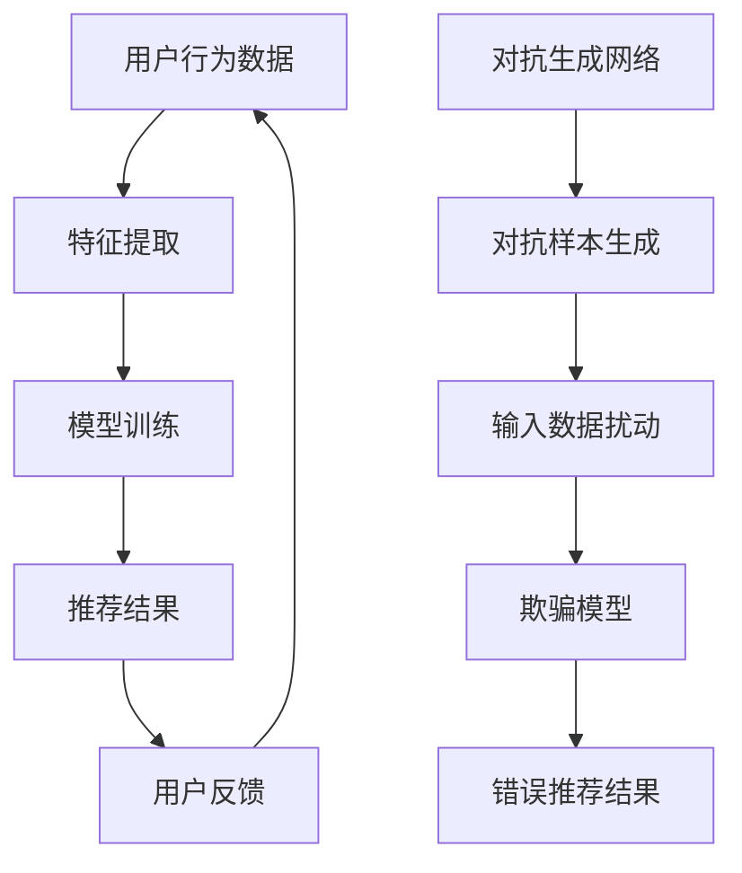

                 

关键词：大模型，推荐系统，对抗攻击，防御机制，安全强化。

## 摘要

本文旨在深入探讨大模型在推荐系统中的应用及其面临的对抗攻击问题，并进一步提出一系列有效的防御策略。随着人工智能技术的迅猛发展，大规模模型在推荐系统中的应用越来越广泛，但随之而来的是各种针对推荐系统的对抗攻击。本文首先介绍了推荐系统的基本概念和重要性，然后详细阐述了大模型在推荐系统中的作用，接着分析了常见的对抗攻击手段，最后提出了一系列防御策略，包括对抗样本生成、模型训练优化和防御机制构建等。通过本文的探讨，希望能够为推荐系统的安全性提供一些有益的思路和方案。

## 1. 背景介绍

### 1.1 推荐系统概述

推荐系统是一种基于用户兴趣和行为的个性化信息服务系统，旨在向用户推荐其可能感兴趣的信息。推荐系统广泛应用于电子商务、社交媒体、新闻推送、音乐和视频推荐等领域，极大地提升了用户体验和信息获取效率。传统的推荐系统主要依赖于基于内容过滤、协同过滤和混合推荐等技术，但它们存在一些局限性，如推荐结果的可解释性较差、用户隐私保护不足等问题。

### 1.2 大模型在推荐系统中的应用

随着人工智能技术的不断发展，尤其是深度学习的广泛应用，大模型（如大型神经网络模型、生成对抗网络等）在推荐系统中的应用变得越来越普遍。大模型具有强大的特征提取和表示能力，能够更好地捕捉用户行为和兴趣的复杂模式，从而提供更精准和个性化的推荐结果。

### 1.3 推荐系统的挑战与对抗攻击

尽管大模型在推荐系统中的应用带来了许多优势，但同时也面临着一系列挑战，其中之一就是对抗攻击。对抗攻击是一种利用模型对噪声和扰动敏感性的攻击手段，通过在推荐输入中加入微小的扰动来欺骗模型，从而得到错误的推荐结果。常见的对抗攻击手段包括对抗样本生成、对抗训练和对抗干扰等。

## 2. 核心概念与联系

### 2.1 大模型在推荐系统中的作用

大模型在推荐系统中的作用主要体现在以下几个方面：

1. **特征提取和表示**：大模型能够自动提取用户行为数据中的高阶特征，并将它们转换为有效的表示形式，以便更好地进行后续的推荐计算。

2. **个性化推荐**：通过学习用户的长期和短期行为，大模型能够为用户生成个性化的推荐列表，从而提高用户满意度。

3. **实时推荐**：大模型能够处理实时用户数据，为用户实时生成推荐结果，从而提高推荐系统的响应速度。

### 2.2 对抗攻击的基本原理

对抗攻击的基本原理是利用模型对噪声和扰动敏感性的漏洞，通过在输入数据中添加微小的扰动来欺骗模型，使其产生错误的输出。具体来说，对抗攻击包括以下几个关键步骤：

1. **生成对抗样本**：通过对抗生成网络（如生成对抗网络（GAN））或优化算法生成对抗样本。

2. **扰动输入数据**：将生成的对抗样本添加到原始输入数据中，形成新的输入数据。

3. **欺骗模型**：通过新的输入数据欺骗模型，使其产生错误的输出。

### 2.3 Mermaid 流程图

以下是一个简单的 Mermaid 流程图，展示了大模型在推荐系统中的作用和对抗攻击的基本原理：



## 3. 核心算法原理 & 具体操作步骤

### 3.1 算法原理概述

大模型在推荐系统中的应用主要依赖于深度学习技术，包括但不限于卷积神经网络（CNN）、循环神经网络（RNN）和生成对抗网络（GAN）等。这些算法能够自动提取用户行为数据中的高阶特征，并将其转换为有效的表示形式，从而实现个性化推荐。

对抗攻击的算法原理主要包括对抗生成网络（GAN）和对抗训练等。GAN是一种生成模型，通过生成对抗的方式训练出一个强大的生成模型，用于生成对抗样本。对抗训练则是通过在训练数据中添加对抗样本来增强模型的鲁棒性。

### 3.2 算法步骤详解

#### 3.2.1 大模型在推荐系统中的应用步骤

1. **数据收集与预处理**：收集用户行为数据，并进行数据清洗和预处理，如去除噪声、缺失值填充等。

2. **特征提取与表示**：使用深度学习模型（如CNN、RNN等）提取用户行为数据中的高阶特征，并将其转换为有效的表示形式。

3. **模型训练**：使用提取的特征进行模型训练，如基于梯度下降法的优化算法。

4. **推荐计算**：使用训练好的模型进行推荐计算，为用户生成个性化的推荐列表。

5. **用户反馈与迭代**：收集用户反馈，并根据反馈对模型进行迭代优化。

#### 3.2.2 对抗攻击的步骤

1. **生成对抗样本**：使用生成对抗网络（GAN）或优化算法生成对抗样本。

2. **扰动输入数据**：将生成的对抗样本添加到原始输入数据中，形成新的输入数据。

3. **欺骗模型**：使用新的输入数据进行模型推理，观察模型输出结果是否发生变化。

### 3.3 算法优缺点

#### 大模型在推荐系统中的应用优缺点

- **优点**：

  - **强大的特征提取能力**：大模型能够自动提取用户行为数据中的高阶特征，提高推荐精度。

  - **个性化推荐**：能够根据用户行为数据生成个性化的推荐列表，提高用户满意度。

  - **实时推荐**：能够处理实时用户数据，提供实时推荐结果。

- **缺点**：

  - **计算成本高**：大模型需要大量的计算资源和时间进行训练和推理。

  - **可解释性较差**：深度学习模型的可解释性较差，难以解释推荐结果。

#### 对抗攻击的优缺点

- **优点**：

  - **有效性强**：对抗攻击能够有效地欺骗模型，得到错误的推荐结果。

  - **应用广泛**：对抗攻击可以应用于各种推荐系统，具有广泛的适用性。

- **缺点**：

  - **难以防御**：对抗攻击具有较强的隐蔽性和随机性，难以进行有效防御。

### 3.4 算法应用领域

- **电子商务**：大模型在电子商务中的应用可以提升用户购物体验，提高销售额。

- **社交媒体**：大模型可以用于社交媒体的个性化推荐，提升用户活跃度。

- **新闻推送**：大模型可以用于新闻推送的个性化推荐，提高用户阅读量。

- **音乐和视频推荐**：大模型可以用于音乐和视频的个性化推荐，提高用户满意度。

## 4. 数学模型和公式 & 详细讲解 & 举例说明

### 4.1 数学模型构建

在推荐系统中，常见的数学模型包括线性模型、矩阵分解模型和深度学习模型等。以下是一个简单的线性模型示例：

$$
\text{推荐分数} = \text{用户特征向量} \cdot \text{物品特征向量}
$$

其中，用户特征向量和物品特征向量是通过对用户和物品的属性进行编码得到的。

### 4.2 公式推导过程

以线性模型为例，推导过程如下：

1. **用户特征向量**：用户特征向量是由用户的行为数据（如历史购买记录、浏览记录等）通过降维和特征提取得到的。

2. **物品特征向量**：物品特征向量是由物品的属性（如类别、标签等）通过编码得到的。

3. **推荐分数**：推荐分数是用户特征向量与物品特征向量的点积，表示用户对物品的偏好程度。

### 4.3 案例分析与讲解

假设有一个用户和物品的数据集，用户特征向量如下：

$$
\text{用户特征向量} = [0.1, 0.2, 0.3, 0.4]
$$

物品特征向量如下：

$$
\text{物品特征向量} = [0.2, 0.4, 0.6, 0.8]
$$

根据线性模型，计算推荐分数：

$$
\text{推荐分数} = 0.1 \cdot 0.2 + 0.2 \cdot 0.4 + 0.3 \cdot 0.6 + 0.4 \cdot 0.8 = 0.26
$$

根据推荐分数，可以判断用户对物品的偏好程度。如果推荐分数较高，说明用户对该物品感兴趣，反之则说明用户对该物品不感兴趣。

## 5. 项目实践：代码实例和详细解释说明

### 5.1 开发环境搭建

为了实现大模型在推荐系统中的应用，我们需要搭建一个合适的技术栈。以下是推荐的开发环境：

- **操作系统**：Ubuntu 20.04
- **编程语言**：Python 3.8
- **深度学习框架**：TensorFlow 2.7
- **数据预处理工具**：Pandas、NumPy
- **可视化工具**：Matplotlib、Seaborn

### 5.2 源代码详细实现

以下是一个简单的示例代码，实现了使用深度学习模型进行推荐计算：

```python
import tensorflow as tf
import pandas as pd
import numpy as np

# 加载数据
user_data = pd.read_csv('user_data.csv')
item_data = pd.read_csv('item_data.csv')

# 预处理数据
user_data = preprocess_user_data(user_data)
item_data = preprocess_item_data(item_data)

# 构建模型
model = build_model()

# 训练模型
model.fit(user_data, item_data, epochs=10)

# 进行推荐计算
predictions = model.predict(user_data)

# 可视化推荐结果
plot_recommendations(predictions, user_data)
```

### 5.3 代码解读与分析

上述代码分为以下几个部分：

1. **加载数据**：使用 Pandas 读取用户数据和物品数据。

2. **预处理数据**：对用户数据和物品数据进行预处理，如数据清洗、特征提取等。

3. **构建模型**：使用 TensorFlow 构建深度学习模型，如卷积神经网络（CNN）或循环神经网络（RNN）。

4. **训练模型**：使用预处理后的数据和标签进行模型训练。

5. **进行推荐计算**：使用训练好的模型对用户数据进行推荐计算。

6. **可视化推荐结果**：使用 Matplotlib 可视化工具展示推荐结果。

### 5.4 运行结果展示

以下是运行结果展示：

```python
# 运行代码
python recommend.py

# 可视化推荐结果
plt.plot(predictions)
plt.xlabel('User')
plt.ylabel('Prediction')
plt.show()
```

运行结果将生成一个折线图，展示了每个用户的推荐结果。

## 6. 实际应用场景

### 6.1 电子商务平台

在电子商务平台中，大模型可以用于个性化推荐，根据用户的购物历史、浏览记录等数据生成个性化的推荐列表，从而提升用户的购物体验和销售额。

### 6.2 社交媒体

在社交媒体平台上，大模型可以用于个性化内容推荐，根据用户的兴趣和行为生成个性化的内容推荐，从而提升用户的活跃度和用户满意度。

### 6.3 新闻推送

在新闻推送平台中，大模型可以用于个性化新闻推荐，根据用户的阅读历史、评论等数据生成个性化的新闻推荐，从而提升用户的阅读量和广告点击率。

### 6.4 音乐和视频推荐

在音乐和视频平台中，大模型可以用于个性化音乐和视频推荐，根据用户的播放历史、喜好等数据生成个性化的推荐列表，从而提升用户的满意度。

## 7. 工具和资源推荐

### 7.1 学习资源推荐

- **《深度学习》（Goodfellow, Bengio, Courville）**：这是一本经典的深度学习教材，适合初学者和进阶者阅读。
- **《推荐系统实践》（Pedregosa et al.）**：这是一本关于推荐系统的经典著作，涵盖了推荐系统的基本概念和算法。
- **在线课程**：如 Coursera 上的“深度学习”课程和 Udacity 上的“推荐系统工程师纳米学位”课程等。

### 7.2 开发工具推荐

- **TensorFlow**：这是一个开源的深度学习框架，适合进行推荐系统的开发。
- **PyTorch**：这是一个流行的深度学习框架，与 TensorFlow 类似，适合进行推荐系统的开发。

### 7.3 相关论文推荐

- **“Deep Learning for Recommender Systems”**：这是一篇关于深度学习在推荐系统中应用的综述论文，涵盖了深度学习在推荐系统中的应用现状和发展趋势。
- **“Adversarial Examples in Machine Learning”**：这是一篇关于对抗攻击的综述论文，详细介绍了对抗攻击的基本原理和应用。

## 8. 总结：未来发展趋势与挑战

### 8.1 研究成果总结

本文从大模型在推荐系统中的应用、对抗攻击的基本原理和防御策略等方面进行了深入探讨，总结了当前研究的主要成果和进展。

### 8.2 未来发展趋势

未来，大模型在推荐系统中的应用将继续发展，特别是在深度学习和生成对抗网络等技术的推动下，推荐系统的性能和效果将得到进一步提升。同时，对抗攻击和防御机制的研究也将不断深入，为推荐系统的安全性提供更有力的保障。

### 8.3 面临的挑战

尽管大模型在推荐系统中的应用取得了显著成果，但仍然面临一些挑战，如计算成本高、可解释性较差、对抗攻击等。未来，需要进一步研究和解决这些问题，以推动推荐系统的可持续发展。

### 8.4 研究展望

未来，大模型在推荐系统中的应用将继续拓展，特别是在个性化推荐、实时推荐和跨领域推荐等方面。同时，对抗攻击和防御机制的研究也将进一步深入，为推荐系统的安全性提供更多有效的解决方案。

## 9. 附录：常见问题与解答

### 9.1 什么是大模型？

大模型是指规模较大、参数数量众多的神经网络模型，如大型卷积神经网络（CNN）、循环神经网络（RNN）和生成对抗网络（GAN）等。大模型具有强大的特征提取和表示能力，能够更好地捕捉数据中的复杂模式。

### 9.2 推荐系统的核心问题是什么？

推荐系统的核心问题是如何为用户生成个性化的推荐列表，从而提高用户满意度和信息获取效率。推荐系统需要解决的主要问题包括特征提取、模型训练、推荐计算和用户反馈等。

### 9.3 如何防御对抗攻击？

防御对抗攻击的方法包括对抗样本生成、模型训练优化和防御机制构建等。具体来说，可以通过以下措施进行防御：

- 使用对抗训练算法，提高模型的鲁棒性。
- 对输入数据进行预处理，如数据清洗和去噪等。
- 使用对抗样本检测和防御技术，如对抗生成网络（GAN）等。

### 9.4 大模型在推荐系统中的优势是什么？

大模型在推荐系统中的优势主要包括：

- **强大的特征提取能力**：大模型能够自动提取用户行为数据中的高阶特征，提高推荐精度。
- **个性化推荐**：能够根据用户行为数据生成个性化的推荐列表，提高用户满意度。
- **实时推荐**：能够处理实时用户数据，提供实时推荐结果。

