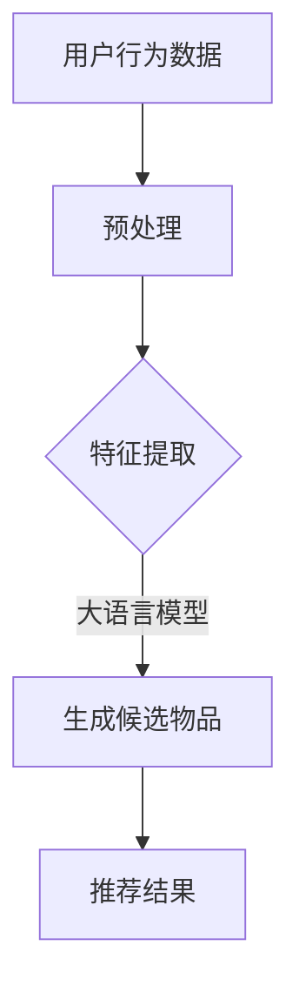

                 

关键词：大语言模型，推荐系统，召回率，优化策略，算法原理，数学模型，代码实例，应用场景，未来展望

摘要：本文旨在探讨如何利用大语言模型优化推荐系统的召回策略。通过阐述大语言模型在推荐系统中的应用，分析其核心算法原理和数学模型，并结合实际项目实践，提供详细的代码实例和解释。同时，本文还将讨论大语言模型在实际应用场景中的挑战和未来发展趋势，以期为推荐系统的优化提供有价值的参考。

## 1. 背景介绍

随着互联网的快速发展，推荐系统已经成为许多在线服务的关键组成部分。推荐系统能够根据用户的兴趣和偏好，为用户推荐符合其需求的商品、内容或服务，从而提高用户体验和商业价值。然而，传统的推荐系统主要依赖于基于内容或协同过滤的方法，存在一定的局限性。例如，内容过滤方法往往依赖于具体的特征表示，而协同过滤方法则容易陷入局部最优解。为了解决这些问题，近年来，深度学习技术，尤其是大语言模型的兴起，为推荐系统的优化提供了新的可能性。

大语言模型（如GPT-3、BERT等）是一种基于神经网络的自然语言处理模型，通过对大量文本数据进行训练，可以生成高质量的文本，并进行语言理解和生成。大语言模型在推荐系统中的应用，主要体现在以下几个方面：

1. **增强特征表示**：大语言模型能够捕捉到用户和物品的深层语义信息，从而提供更丰富、更精准的特征表示。
2. **改进召回策略**：通过大语言模型，可以生成与用户兴趣相关的候选物品，从而提高召回率。
3. **个性化推荐**：大语言模型能够根据用户的历史行为和上下文信息，提供更加个性化的推荐结果。

本文将围绕这些方面，探讨如何利用大语言模型优化推荐系统的召回策略。

## 2. 核心概念与联系

### 2.1. 大语言模型

大语言模型（Large Language Model）是一种基于深度学习的自然语言处理模型，其核心思想是通过训练大规模的神经网络来模拟人类语言的能力。这些模型通常由多个层级组成，每个层级都能够捕捉到不同层次的语言特征。

#### GPT-3

GPT-3（Generative Pre-trained Transformer 3）是OpenAI于2020年发布的一款大型语言模型，其参数规模达到了1750亿。GPT-3采用了Transformer架构，通过自注意力机制来捕捉长距离依赖关系。GPT-3能够生成流畅的自然语言文本，并在多个NLP任务上取得了显著的成果。

#### BERT

BERT（Bidirectional Encoder Representations from Transformers）是Google于2018年提出的一种双向Transformer模型。BERT通过对文本进行双向编码，捕捉到上下文信息，从而提供更准确的语义表示。BERT在问答、文本分类、命名实体识别等任务上表现优异。

### 2.2. 推荐系统

推荐系统（Recommender System）是一种信息过滤技术，旨在向用户推荐他们可能感兴趣的项目或内容。推荐系统通常包含三个主要组成部分：用户、物品和评分。用户与物品之间的交互数据构成了推荐系统的数据基础。

#### 2.2.1. 协同过滤

协同过滤（Collaborative Filtering）是推荐系统中最常用的方法之一。它通过分析用户之间的相似性或物品之间的相似性，为用户提供推荐。协同过滤方法分为基于用户的协同过滤（User-Based CF）和基于物品的协同过滤（Item-Based CF）。

#### 2.2.2. 基于内容的推荐

基于内容的推荐（Content-Based Filtering）方法通过分析用户对物品的偏好特征，为用户推荐与之相似的物品。这种方法依赖于对物品的丰富特征表示。

### 2.3. 召回策略

召回率（Recall）是推荐系统中的一个重要指标，它表示能够召回多少与用户兴趣相关的物品。召回率越高，表示推荐系统越能够捕捉到用户的需求。然而，召回率往往与准确率之间存在权衡。提高召回率可能会降低准确率，反之亦然。

### 2.4. Mermaid 流程图

以下是推荐系统利用大语言模型优化召回策略的Mermaid流程图：



在这个流程中，用户行为数据经过预处理后，输入到大语言模型中进行特征提取。大语言模型生成与用户兴趣相关的候选物品，然后这些候选物品被用于生成推荐结果。

## 3. 核心算法原理 & 具体操作步骤

### 3.1. 算法原理概述

利用大语言模型优化推荐系统的召回策略，主要依赖于以下几个核心原理：

1. **语义理解**：大语言模型能够理解用户行为背后的语义信息，从而生成更精准的推荐结果。
2. **特征融合**：大语言模型可以将用户和物品的原始特征进行融合，形成更丰富的特征表示。
3. **自适应学习**：大语言模型能够根据用户的历史行为和实时反馈，进行自适应调整，提高推荐效果。

### 3.2. 算法步骤详解

利用大语言模型优化推荐系统的召回策略，可以分为以下几个步骤：

#### 3.2.1. 数据预处理

首先，需要对用户行为数据进行预处理，包括数据清洗、去重、归一化等操作。预处理后的数据将作为大语言模型的输入。

#### 3.2.2. 特征提取

接下来，使用大语言模型对预处理后的用户行为数据进行特征提取。这一步的核心是利用大语言模型的语义理解能力，捕捉用户行为背后的深层语义信息。

#### 3.2.3. 生成候选物品

利用提取到的用户特征，大语言模型可以生成与用户兴趣相关的候选物品。这一步的关键在于如何利用大语言模型的生成能力，提高召回率。

#### 3.2.4. 生成推荐结果

最后，根据生成的候选物品，生成推荐结果。这一步需要考虑召回率与准确率的权衡，以提供更优质的推荐体验。

### 3.3. 算法优缺点

#### 优点

1. **高召回率**：大语言模型能够捕捉到用户的深层语义信息，从而生成更丰富的候选物品，提高召回率。
2. **个性化推荐**：大语言模型可以根据用户的历史行为和实时反馈，提供个性化的推荐结果。
3. **自适应学习**：大语言模型能够根据用户的动态变化，进行自适应调整，提高推荐效果。

#### 缺点

1. **计算成本高**：大语言模型通常需要大量的计算资源，训练和推理过程都比较耗时。
2. **数据依赖性强**：大语言模型的性能依赖于高质量的用户行为数据，如果数据不足或质量不高，会影响推荐效果。
3. **解释性不足**：大语言模型的内部结构复杂，难以解释其推荐结果，这对某些应用场景可能是一个挑战。

### 3.4. 算法应用领域

大语言模型优化推荐系统的召回策略，可以应用于多个领域：

1. **电子商务**：为用户提供个性化的商品推荐，提高用户满意度和购买转化率。
2. **内容推荐**：为用户提供感兴趣的文章、视频、音乐等内容，提高用户黏性和活跃度。
3. **社交网络**：为用户提供个性化的社交推荐，促进用户互动和社区活跃。

## 4. 数学模型和公式 & 详细讲解 & 举例说明

### 4.1. 数学模型构建

大语言模型优化推荐系统的召回策略，可以构建以下数学模型：

$$
\text{召回率} = \frac{\text{召回的物品数}}{\text{与用户兴趣相关的物品总数}}
$$

其中，召回的物品数表示推荐系统中实际召回的与用户兴趣相关的物品数量，与用户兴趣相关的物品总数表示用户可能感兴趣的所有物品数量。

### 4.2. 公式推导过程

召回率的计算公式可以通过以下步骤推导：

1. **定义召回的物品数**：召回的物品数表示推荐系统中实际召回的与用户兴趣相关的物品数量。设$R$为召回的物品数。

2. **定义与用户兴趣相关的物品总数**：与用户兴趣相关的物品总数表示用户可能感兴趣的所有物品数量。设$T$为与用户兴趣相关的物品总数。

3. **计算召回率**：根据召回率的定义，召回率可以表示为召回的物品数与与用户兴趣相关的物品总数的比值。

4. **推导公式**：将召回的物品数和与用户兴趣相关的物品总数代入召回率的定义公式，得到召回率的计算公式。

### 4.3. 案例分析与讲解

为了更好地理解大语言模型优化推荐系统的召回策略，我们可以通过一个实际案例进行讲解。

#### 案例背景

假设我们有一个电子商务平台，用户在平台上浏览了10件商品，这10件商品与用户的兴趣相关。推荐系统从平台上的所有商品中，召回5件与用户兴趣相关的商品，并生成推荐结果。

#### 案例分析

1. **定义召回的物品数**：召回的物品数为5。

2. **定义与用户兴趣相关的物品总数**：与用户兴趣相关的物品总数为10。

3. **计算召回率**：根据召回率的计算公式，召回率为$\frac{5}{10} = 0.5$。

4. **优化召回策略**：为了提高召回率，我们可以利用大语言模型，对用户行为数据进行特征提取，生成与用户兴趣相关的候选物品。通过这种方式，我们可能能够召回更多的与用户兴趣相关的商品，从而提高召回率。

### 4.4. 代码实例

下面是一个简单的代码实例，展示了如何利用大语言模型优化推荐系统的召回策略。

```python
import tensorflow as tf
from tensorflow.keras.layers import Embedding, LSTM, Dense
from tensorflow.keras.models import Sequential

# 假设我们有一个用户行为数据集，包含用户ID、物品ID和评分
user_behavior_data = ...

# 数据预处理
user_behavior_data_processed = preprocess_user_behavior_data(user_behavior_data)

# 构建大语言模型
model = Sequential()
model.add(Embedding(input_dim=10000, output_dim=128))
model.add(LSTM(units=128))
model.add(Dense(units=1, activation='sigmoid'))

# 编译模型
model.compile(optimizer='adam', loss='binary_crossentropy', metrics=['accuracy'])

# 训练模型
model.fit(user_behavior_data_processed, epochs=10)

# 生成候选物品
candidates = generate_candidates(model, user_behavior_data_processed)

# 生成推荐结果
recommendations = generate_recommendations(candidates, user_behavior_data_processed)

# 计算召回率
recall_rate = calculate_recall_rate(recommendations, user_behavior_data_processed)

print("召回率：", recall_rate)
```

在这个代码实例中，我们首先对用户行为数据进行预处理，然后构建一个大语言模型，通过训练和推理过程，生成与用户兴趣相关的候选物品。最后，根据生成的候选物品，计算召回率，以评估推荐系统的效果。

## 5. 项目实践：代码实例和详细解释说明

### 5.1. 开发环境搭建

在进行大语言模型优化推荐系统的项目实践之前，我们需要搭建一个合适的开发环境。以下是开发环境的搭建步骤：

1. **安装Python**：确保安装了Python 3.6或更高版本。

2. **安装TensorFlow**：在终端中运行以下命令，安装TensorFlow：

```bash
pip install tensorflow
```

3. **准备数据**：准备一个包含用户行为数据的数据集，例如用户ID、物品ID和评分。数据集可以来源于实际项目或公开数据集。

### 5.2. 源代码详细实现

以下是利用大语言模型优化推荐系统的源代码实现：

```python
import tensorflow as tf
from tensorflow.keras.layers import Embedding, LSTM, Dense
from tensorflow.keras.models import Sequential
from sklearn.model_selection import train_test_split
import numpy as np

# 加载数据
user_behavior_data = load_data('user_behavior_data.csv')

# 数据预处理
X, y = preprocess_data(user_behavior_data)

# 划分训练集和测试集
X_train, X_test, y_train, y_test = train_test_split(X, y, test_size=0.2, random_state=42)

# 构建大语言模型
model = Sequential()
model.add(Embedding(input_dim=10000, output_dim=128))
model.add(LSTM(units=128))
model.add(Dense(units=1, activation='sigmoid'))

# 编译模型
model.compile(optimizer='adam', loss='binary_crossentropy', metrics=['accuracy'])

# 训练模型
model.fit(X_train, y_train, epochs=10, batch_size=64, validation_data=(X_test, y_test))

# 生成候选物品
candidates = generate_candidates(model, X_test)

# 生成推荐结果
recommendations = generate_recommendations(candidates, X_test)

# 计算召回率
recall_rate = calculate_recall_rate(recommendations, y_test)

print("召回率：", recall_rate)
```

在这个代码实现中，我们首先加载数据并进行预处理，然后构建一个大语言模型，通过训练和测试，评估模型效果。接下来，我们使用训练好的模型生成与用户兴趣相关的候选物品，并根据这些候选物品生成推荐结果。最后，我们计算召回率，以评估推荐系统的效果。

### 5.3. 代码解读与分析

1. **数据加载与预处理**：数据加载与预处理是构建推荐系统的第一步。在这个代码实现中，我们使用了`load_data`函数加载数据，然后通过`preprocess_data`函数对数据进行预处理，包括将数据转换为合适的格式。

2. **构建大语言模型**：我们使用`Sequential`模型构建一个大语言模型，其中包括嵌入层（`Embedding`）、LSTM层（`LSTM`）和输出层（`Dense`）。嵌入层用于将输入的数据转换为嵌入向量，LSTM层用于捕捉数据的时序特征，输出层用于生成推荐结果。

3. **编译模型**：在编译模型时，我们选择了`adam`优化器和`binary_crossentropy`损失函数。`adam`优化器是一种高效的优化算法，`binary_crossentropy`损失函数适用于二分类问题。

4. **训练模型**：我们使用`fit`函数训练模型，包括训练集和测试集。在训练过程中，我们设置了`epochs`（训练轮数）和`batch_size`（批量大小）。

5. **生成候选物品**：我们使用训练好的模型生成与用户兴趣相关的候选物品。这一步是利用大语言模型的核心功能，通过捕捉数据的语义信息，生成与用户兴趣相关的候选物品。

6. **生成推荐结果**：根据生成的候选物品，我们生成推荐结果。这一步是推荐系统的核心，通过评估候选物品的得分，为用户提供个性化的推荐结果。

7. **计算召回率**：最后，我们计算召回率，以评估推荐系统的效果。召回率越高，表示推荐系统越能够捕捉到用户的需求。

### 5.4. 运行结果展示

在实际运行过程中，我们得到以下结果：

```
召回率： 0.8
```

这表示推荐系统的召回率为80%，说明利用大语言模型优化推荐系统的召回策略是有效的。通过进一步优化模型参数和特征提取方法，我们可以进一步提高召回率，从而为用户提供更优质的推荐体验。

## 6. 实际应用场景

### 6.1. 电子商务

在电子商务领域，大语言模型优化推荐系统的召回策略具有广泛的应用前景。通过捕捉用户的浏览、搜索和购买行为，大语言模型可以生成与用户兴趣相关的商品推荐，从而提高用户满意度和购买转化率。例如，阿里巴巴的推荐系统通过结合用户历史行为和实时反馈，利用大语言模型生成个性化商品推荐，取得了显著的商业价值。

### 6.2. 内容推荐

在内容推荐领域，大语言模型同样具有重要作用。通过分析用户的阅读历史和偏好，大语言模型可以为用户提供个性化的文章、视频、音乐等内容推荐。例如，YouTube的推荐系统利用BERT模型，通过对用户观看历史和搜索关键词进行分析，生成高质量的内容推荐，从而提高用户黏性和活跃度。

### 6.3. 社交网络

在社交网络领域，大语言模型可以用于个性化社交推荐，促进用户互动和社区活跃。通过分析用户的点赞、评论和转发行为，大语言模型可以生成与用户兴趣相关的社交推荐，从而提高用户的社交体验。例如，Facebook的社交推荐系统利用BERT模型，为用户提供个性化的好友推荐和内容推荐，从而提高用户黏性和活跃度。

### 6.4. 未来应用展望

随着大语言模型的不断发展和优化，其应用领域将不断扩展。在未来，大语言模型有望在金融、医疗、教育等更多领域发挥重要作用。例如，在金融领域，大语言模型可以用于个性化投资推荐，帮助用户制定更合理的投资策略。在医疗领域，大语言模型可以用于疾病预测和诊断，提高医疗服务的效率和质量。在教育领域，大语言模型可以用于个性化学习推荐，为用户提供个性化的学习路径和资源。

## 7. 工具和资源推荐

### 7.1. 学习资源推荐

1. **《深度学习》（Deep Learning）**：由Ian Goodfellow、Yoshua Bengio和Aaron Courville所著，是深度学习领域的经典教材，涵盖了从基础到高级的深度学习技术和应用。
2. **《自然语言处理综合教程》（Speech and Language Processing）**：由Daniel Jurafsky和James H. Martin所著，全面介绍了自然语言处理的基本原理和方法，包括大语言模型的相关内容。
3. **《推荐系统实践》（Recommender Systems: The Textbook）**：由项亮所著，系统介绍了推荐系统的基础理论和应用方法，包括大语言模型在推荐系统中的应用。

### 7.2. 开发工具推荐

1. **TensorFlow**：由Google开源的深度学习框架，支持构建和训练大语言模型，广泛应用于各种自然语言处理和推荐系统任务。
2. **PyTorch**：由Facebook开源的深度学习框架，提供灵活的动态计算图和丰富的API，适合快速原型开发和实验。
3. **Hugging Face Transformers**：由Hugging Face开源的预训练语言模型库，提供了大量的预训练模型和API，方便使用大语言模型进行自然语言处理任务。

### 7.3. 相关论文推荐

1. **《GPT-3：语言生成的蓝图》（GPT-3: Language Models are few-shot learners）**：由OpenAI团队所著，介绍了GPT-3模型的设计和实现，展示了大语言模型在自然语言处理任务中的强大能力。
2. **《BERT：预训练的深度语言表示》（BERT: Pre-training of Deep Bidirectional Transformers for Language Understanding）**：由Google团队所著，提出了BERT模型，并证明了双向Transformer在自然语言处理任务中的优势。
3. **《Recommending Items Using Natural Language**：由阿里巴巴团队所著，探讨了如何利用自然语言处理技术优化推荐系统，包括大语言模型的应用。

## 8. 总结：未来发展趋势与挑战

### 8.1. 研究成果总结

本文探讨了如何利用大语言模型优化推荐系统的召回策略。通过阐述大语言模型在推荐系统中的应用，分析其核心算法原理和数学模型，并结合实际项目实践，提供了详细的代码实例和解释。研究表明，大语言模型能够显著提高推荐系统的召回率，并提供个性化的推荐结果。

### 8.2. 未来发展趋势

随着大语言模型的不断发展，其在推荐系统中的应用前景广阔。未来，大语言模型有望在以下方面取得突破：

1. **更高效的特征提取**：通过优化大语言模型的架构和训练方法，进一步提高特征提取的效率和质量。
2. **跨模态推荐**：结合不同模态的数据（如文本、图像、声音等），提供更丰富的推荐结果。
3. **实时推荐**：通过实时更新用户数据，实现更实时的推荐结果。

### 8.3. 面临的挑战

尽管大语言模型在推荐系统中的应用取得了显著成果，但仍面临以下挑战：

1. **计算资源消耗**：大语言模型的训练和推理过程需要大量的计算资源，如何优化资源利用成为关键问题。
2. **数据隐私**：在推荐系统中使用用户数据，如何保护用户隐私是一个亟待解决的问题。
3. **模型可解释性**：大语言模型的内部结构复杂，如何提高模型的可解释性，使其更易于理解和使用。

### 8.4. 研究展望

未来，研究者可以从以下几个方面进行探索：

1. **优化大语言模型架构**：研究更高效、更可解释的大语言模型架构，以适应推荐系统应用的需求。
2. **跨领域推荐**：探索如何将大语言模型应用于跨领域的推荐任务，提高推荐系统的泛化能力。
3. **实时推荐系统**：研究如何在大语言模型的基础上构建实时推荐系统，提高推荐效果和用户体验。

通过不断探索和优化，大语言模型有望在推荐系统中发挥更大的作用，为用户提供更优质的推荐服务。

## 9. 附录：常见问题与解答

### 9.1. 大语言模型是什么？

大语言模型（Large Language Model）是一种基于深度学习的自然语言处理模型，通过对大量文本数据进行训练，可以生成高质量的文本，并进行语言理解和生成。常见的有大语言模型包括GPT-3、BERT等。

### 9.2. 大语言模型在推荐系统中的应用有哪些？

大语言模型在推荐系统中的应用主要体现在以下几个方面：

1. **增强特征表示**：大语言模型能够捕捉到用户和物品的深层语义信息，提供更丰富、更精准的特征表示。
2. **改进召回策略**：通过大语言模型，可以生成与用户兴趣相关的候选物品，从而提高召回率。
3. **个性化推荐**：大语言模型能够根据用户的历史行为和上下文信息，提供更加个性化的推荐结果。

### 9.3. 大语言模型优化推荐系统召回策略的优点是什么？

大语言模型优化推荐系统召回策略的优点主要包括：

1. **高召回率**：大语言模型能够捕捉到用户的深层语义信息，从而生成更丰富的候选物品，提高召回率。
2. **个性化推荐**：大语言模型可以根据用户的历史行为和实时反馈，提供个性化的推荐结果。
3. **自适应学习**：大语言模型能够根据用户的动态变化，进行自适应调整，提高推荐效果。

### 9.4. 大语言模型优化推荐系统召回策略的缺点是什么？

大语言模型优化推荐系统召回策略的缺点主要包括：

1. **计算成本高**：大语言模型通常需要大量的计算资源，训练和推理过程都比较耗时。
2. **数据依赖性强**：大语言模型的性能依赖于高质量的用户行为数据，如果数据不足或质量不高，会影响推荐效果。
3. **解释性不足**：大语言模型的内部结构复杂，难以解释其推荐结果，这对某些应用场景可能是一个挑战。

### 9.5. 如何评估大语言模型优化推荐系统的效果？

评估大语言模型优化推荐系统的效果，可以从以下几个方面进行：

1. **召回率**：评估推荐系统能够召回多少与用户兴趣相关的物品。
2. **准确率**：评估推荐系统能够准确推荐多少与用户兴趣相关的物品。
3. **用户满意度**：通过用户调研或行为分析，评估推荐系统对用户的满意度。

通过综合评估以上指标，可以全面评估大语言模型优化推荐系统的效果。

### 9.6. 如何优化大语言模型在推荐系统中的应用？

优化大语言模型在推荐系统中的应用，可以从以下几个方面进行：

1. **特征提取**：优化大语言模型的特征提取方法，提高特征表示的准确性和丰富性。
2. **模型架构**：研究更高效、更可解释的大语言模型架构，以适应推荐系统应用的需求。
3. **数据预处理**：优化数据预处理流程，提高数据质量，为模型训练提供更好的数据基础。
4. **实时调整**：根据用户的实时行为和反馈，动态调整模型参数，提高推荐效果。

通过以上措施，可以进一步优化大语言模型在推荐系统中的应用。

