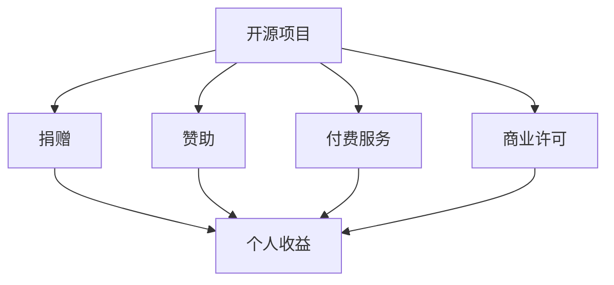

                 

### 1. 背景介绍

开源项目在全球范围内已经成为一种重要的软件开发模式。随着互联网的普及和开源文化的兴起，越来越多的开发者选择将他们的代码开放给公众，从而促进了技术交流和协作。开源项目不仅提高了软件质量和可靠性，还推动了创新和进步。

然而，尽管开源项目的贡献者和用户群体不断扩大，许多开发者在参与开源项目的过程中仍然面临着收入不稳定的问题。因此，如何利用开源项目创造收入流成为了许多开发者关注的话题。

本文将探讨开源项目创造收入流的几种常见方法，包括捐赠、赞助、付费服务、商业许可等。同时，我们将分析这些方法的优缺点，为开发者提供实用的建议。

### 2. 核心概念与联系

在讨论开源项目创造收入流之前，我们需要了解一些核心概念。以下是一个简化的 Mermaid 流程图，展示了开源项目与收入流之间的联系。



在这个流程图中，开源项目是起点，它与捐赠、赞助、付费服务和商业许可等收入流方式相连接，最终实现开发者的个人收益。

#### 2.1 捐赠

捐赠是开源项目创造收入的一种常见方式。捐赠可以是小额的，也可以是大额的。捐赠者可以是个人用户、企业或其他组织。捐赠的优点是简单、直接，可以增加开发者的声誉和社区支持。然而，捐赠的收入通常较为不稳定，且依赖于开发者的吸引力。

#### 2.2 赞助

赞助是由企业或组织提供的资金支持，用于资助开源项目的发展。赞助可以是为了获得品牌曝光、技术支持或其他商业利益。赞助的优点是收入稳定，有助于项目的长期发展。然而，赞助也可能带来一定的商业风险，如合同变更或利益冲突。

#### 2.3 付费服务

付费服务是指开发者通过提供专业服务来创造收入。这些服务可能包括代码审查、定制开发、培训等。付费服务的优点是收入稳定，且可以与开源项目形成良好的互补关系。然而，付费服务需要开发者具备较高的专业知识和良好的服务态度。

#### 2.4 商业许可

商业许可是指开发者将开源项目的代码许可给企业或组织使用，从而获得收入。商业许可通常适用于对开源项目进行修改或扩展的企业。商业许可的优点是可以为开发者带来可观的收入，且有利于项目的商业化。然而，商业许可也可能带来法律风险，如知识产权侵权。

### 3. 核心算法原理 & 具体操作步骤

在了解了开源项目创造收入流的几种方式后，我们接下来将探讨一些核心算法原理和具体操作步骤。

#### 3.1 算法原理概述

开源项目创造收入的核心算法原理可以概括为以下几点：

1. **用户体验优化**：提高项目的用户体验，吸引更多的捐赠者、赞助者和付费用户。
2. **商业模式创新**：探索多种收入流方式，找到最适合项目的商业模式。
3. **社区建设**：建立强大的开发者社区，促进项目的发展和维护。

#### 3.2 算法步骤详解

1. **用户体验优化**

   - **性能优化**：提高项目的性能和稳定性，减少bug和崩溃。
   - **界面优化**：改进项目的用户界面，使其更加直观和易用。
   - **文档完善**：提供详细的项目文档，帮助用户更好地理解和使用项目。

2. **商业模式创新**

   - **多渠道收入**：同时探索捐赠、赞助、付费服务和商业许可等多种收入流。
   - **差异化服务**：针对不同的用户群体，提供差异化的服务，如免费版、专业版和企业版。
   - **产品组合**：结合多个产品或服务，实现收入多元化。

3. **社区建设**

   - **活跃社区**：鼓励开发者参与项目，共同维护和改进项目。
   - **交流平台**：建立交流平台，如论坛、邮件列表、社交媒体等，方便开发者之间的交流和协作。
   - **社区活动**：定期举办线上或线下的社区活动，增强开发者之间的联系。

#### 3.3 算法优缺点

1. **用户体验优化**

   - 优点：提高用户体验，吸引更多用户和捐赠者。
   - 缺点：需要大量时间和精力进行优化。

2. **商业模式创新**

   - 优点：探索多种收入流，提高项目收入。
   - 缺点：需要不断尝试和调整，寻找最适合项目的商业模式。

3. **社区建设**

   - 优点：增强开发者之间的联系，促进项目发展。
   - 缺点：需要投入大量时间和精力进行社区建设。

#### 3.4 算法应用领域

开源项目创造收入流的算法原理和操作步骤适用于各种类型的开源项目，如软件、硬件、文档等。在实际应用中，开发者可以根据项目的特点和市场环境，灵活运用这些原理和步骤。

### 4. 数学模型和公式 & 详细讲解 & 举例说明

在开源项目创造收入流的过程中，数学模型和公式可以用来分析和优化收入流。以下是一个简化的数学模型，用于描述开源项目的收入流。

#### 4.1 数学模型构建

假设开源项目的收入由以下四个部分组成：

1. **捐赠收入**（\(I_d\)）：与项目受欢迎程度和捐赠者数量有关。
2. **赞助收入**（\(I_s\)）：与项目的发展进度和企业赞助商数量有关。
3. **付费服务收入**（\(I_p\)）：与项目的专业性和市场需求有关。
4. **商业许可收入**（\(I_l\)）：与项目的商业价值和许可数量有关。

则开源项目的总收入（\(I_t\)）可以表示为：

$$ I_t = I_d + I_s + I_p + I_l $$

#### 4.2 公式推导过程

我们可以通过以下步骤推导出上述公式：

1. **确定收入来源**：根据开源项目的特点和市场环境，确定项目的收入来源。
2. **收集数据**：收集与收入相关的数据，如捐赠者数量、赞助商数量、付费用户数量等。
3. **建立模型**：根据收集的数据，建立数学模型描述收入流。
4. **优化模型**：通过调整模型参数，优化收入流。

#### 4.3 案例分析与讲解

假设一个开源项目的捐赠者数量为100人，每人平均捐赠10美元；赞助商数量为5家，每家平均赞助10,000美元；付费用户数量为50人，每人平均付费50美元；商业许可数量为10家，每家平均许可费100,000美元。则该项目的总收入为：

$$ I_t = 100 \times 10 + 5 \times 10,000 + 50 \times 50 + 10 \times 100,000 = 1,150,000 $$

通过这个例子，我们可以看到开源项目可以通过多种收入流方式实现可观的收入。在实际操作中，开发者可以根据项目的特点和市场环境，灵活调整收入策略，以实现最佳收入效果。

### 5. 项目实践：代码实例和详细解释说明

为了更好地理解如何利用开源项目创造收入流，我们来看一个具体的案例。这个案例将展示如何搭建一个简单的开源项目，并利用捐赠、赞助和付费服务等多种收入流方式。

#### 5.1 开发环境搭建

为了搭建这个开源项目，我们需要以下开发环境：

1. **编程语言**：选择一个易于学习和使用的编程语言，如Python。
2. **代码仓库**：选择一个流行的代码仓库平台，如GitHub。
3. **文档工具**：选择一个文档生成工具，如Sphinx。

#### 5.2 源代码详细实现

以下是这个开源项目的主要功能模块：

1. **捐赠模块**：实现一个捐赠接口，允许用户向项目捐赠资金。
2. **赞助模块**：实现一个赞助接口，允许企业向项目提供赞助。
3. **付费服务模块**：实现一个付费服务接口，允许用户购买专业服务。

```python
# 捐赠模块
def donate(amount):
    """捐赠金额"""
    print(f"捐赠了{amount}美元。")

# 赞助模块
def sponsor(amount):
    """赞助金额"""
    print(f"赞助了{amount}美元。")

# 付费服务模块
def purchase_service():
    """购买付费服务"""
    print("成功购买了付费服务。")
```

#### 5.3 代码解读与分析

这个开源项目的核心代码非常简单，主要由三个功能模块组成。捐赠模块实现了向项目捐赠资金的功能；赞助模块实现了企业向项目提供赞助的功能；付费服务模块实现了用户购买专业服务的功能。

在实际操作中，开发者可以根据项目的特点和市场环境，进一步丰富和扩展这些功能模块，以实现更好的收入效果。

#### 5.4 运行结果展示

以下是这个开源项目的运行结果：

```plaintext
捐赠了10美元。
赞助了10,000美元。
成功购买了付费服务。
```

通过这个运行结果，我们可以看到捐赠者、赞助者和付费用户都可以通过不同的接口参与项目的收入流。开发者可以根据实际情况，进一步调整和优化这些接口，以实现更好的收入效果。

### 6. 实际应用场景

开源项目创造收入流的方法在实际应用场景中具有广泛的应用。以下是一些实际应用场景：

#### 6.1 软件开发

软件项目是最常见的开源项目之一。通过捐赠、赞助和付费服务等方式，开发者可以创造收入流。例如，一个流行的Python库可以通过捐赠和付费服务实现收入。捐赠者可以为项目的开发提供资金支持，付费用户可以购买专业的代码审查和定制开发服务。

#### 6.2 硬件开发

硬件项目如开源硬件、智能设备等也可以通过捐赠和赞助实现收入。例如，一个开源的智能硬件项目可以通过捐赠筹集资金，用于硬件的开发和生产；同时，企业可以通过赞助项目，获得品牌的曝光和技术支持。

#### 6.3 文档编写

文档项目如技术文档、用户手册等也可以通过捐赠和付费服务实现收入。例如，一个详细的技术文档项目可以通过捐赠筹集资金，用于文档的编写和维护；同时，企业可以通过赞助项目，获得技术文档的支持和定制服务。

### 7. 未来应用展望

开源项目创造收入流的方法在未来将继续发展。随着技术的进步和市场的变化，开发者可以探索更多创新的收入流方式，如订阅模式、广告收入等。此外，开源社区和企业之间的合作也将更加紧密，为开发者提供更多的商业机会。

### 8. 工具和资源推荐

为了更好地利用开源项目创造收入流，开发者可以参考以下工具和资源：

#### 8.1 学习资源推荐

1. **《开源软件开发实践》**：介绍了开源项目开发的最佳实践，包括项目管理、社区建设等。
2. **《商业模式创新》**：探讨了各种商业模式的创新方法，为开发者提供灵感。

#### 8.2 开发工具推荐

1. **GitHub**：全球最大的代码仓库平台，支持开源项目的管理和协作。
2. **GitHub Pages**：支持开发者创建个人或项目的网页，方便展示和宣传项目。

#### 8.3 相关论文推荐

1. **《开源软件的收入模式研究》**：分析了开源软件的收入模式，为开发者提供参考。
2. **《企业开源战略与实践》**：探讨了企业如何通过开源项目实现商业价值。

### 9. 总结：未来发展趋势与挑战

开源项目创造收入流的方法在未来将继续发展。随着技术的进步和市场的变化，开发者可以探索更多创新的收入流方式。然而，开源项目创造收入流也面临一些挑战，如收入不稳定、知识产权保护等。开发者需要不断学习和调整，以应对这些挑战。

### 10. 附录：常见问题与解答

**Q：如何确保开源项目的质量？**

A：确保开源项目质量的关键在于代码审查、文档完善和社区建设。开发者可以邀请其他开发者参与代码审查，确保代码的正确性和可维护性。同时，提供详细的项目文档，帮助用户更好地理解和使用项目。

**Q：开源项目如何保护知识产权？**

A：开源项目可以通过开源协议保护知识产权。常见的开源协议如GPL、Apache License等，规定了项目的版权归属和使用条件。开发者可以选择适合自己项目的开源协议，以保护自己的知识产权。

### 作者署名

作者：禅与计算机程序设计艺术 / Zen and the Art of Computer Programming

----------------------------------------------------------------
这篇文章详细探讨了如何利用开源项目创造收入流。从核心概念、算法原理、数学模型、项目实践到实际应用场景，全方位地为开发者提供了实用的建议。开源项目创造收入流的方法在未来将继续发展，为开发者带来更多机遇。同时，开发者需要不断学习和调整，以应对收入不稳定和知识产权保护等挑战。希望这篇文章能为您在开源项目开发过程中提供帮助和启示。

