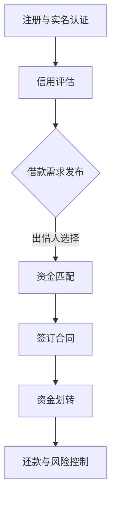

                 

 

## 1. 背景介绍

P2P借贷（Peer-to-Peer Lending）是一种新型的金融服务模式，通过互联网平台，将资金需求方（借款人）与资金提供方（出借人）直接连接起来，从而实现资金的快速融通。与传统借贷模式相比，P2P借贷具有低门槛、高效、灵活等特点，大大降低了借贷双方的信息不对称性，提高了资金利用效率。

随着互联网技术的快速发展，P2P借贷平台在全球范围内得到了广泛的关注和迅速的发展。然而，P2P借贷也面临着诸多挑战，如信用风险、法律风险、技术风险等。如何在保证安全性的同时，充分发挥技术优势，提升P2P借贷平台的运营效率和用户体验，成为当前研究的热点。

本文旨在探讨如何利用技术优势进行P2P借贷，通过分析P2P借贷的核心概念、算法原理、数学模型、项目实践等方面，为P2P借贷平台的开发与运营提供有益的参考。

## 2. 核心概念与联系

### 2.1 P2P借贷的概念

P2P借贷，即点对点借贷，是一种基于互联网的借贷模式。在这种模式下，借款人和出借人通过P2P借贷平台进行信息匹配和资金转移，无需经过传统金融机构的中介服务。P2P借贷平台作为中介，提供信用评估、资金匹配、风险管理等服务，以确保借贷双方的合法权益。

### 2.2 P2P借贷的运作原理

P2P借贷的运作原理可以概括为以下几个步骤：

1. **注册与实名认证**：借款人和出借人在P2P借贷平台进行注册，并完成实名认证，以确保身份的真实性。
2. **信用评估**：平台根据借款人的信用记录、财务状况、还款能力等信息进行信用评估，为借款人设定信用等级。
3. **发布借款需求**：借款人根据信用等级，发布借款需求，包括借款金额、期限、利率等。
4. **出借人选择**：出借人根据借款需求，选择合适的借款项目进行投资。
5. **资金匹配**：平台根据出借人的投资需求和借款人的借款需求，进行资金匹配。
6. **签订合同**：借贷双方签订电子合同，明确借款金额、期限、利率、还款方式等条款。
7. **资金划转**：平台将出借人的资金划转给借款人。
8. **还款与风险控制**：借款人按照合同约定按时还款，平台对借款人的还款情况进行监控，确保资金安全。

### 2.3 Mermaid 流程图

以下是P2P借贷运作过程的Mermaid流程图：



## 3. 核心算法原理 & 具体操作步骤

### 3.1 算法原理概述

P2P借贷平台的核心算法主要涉及信用评估和资金匹配两个方面。信用评估算法用于评估借款人的信用风险，以便为出借人提供参考；资金匹配算法则用于将出借人的投资需求与借款人的借款需求进行匹配，以提高资金利用效率。

### 3.2 算法步骤详解

#### 3.2.1 信用评估算法

1. **数据收集**：平台从借款人提供的个人信息、信用记录、财务状况等数据源收集数据。
2. **特征提取**：对收集到的数据进行分析，提取与信用风险相关的特征，如借款人的收入水平、还款能力、信用历史等。
3. **模型训练**：利用机器学习算法，如逻辑回归、决策树、随机森林等，对提取的特征进行训练，构建信用评估模型。
4. **评估借款人信用**：将借款人的特征数据输入信用评估模型，计算出其信用风险评分。
5. **设定信用等级**：根据信用风险评分，将借款人划分为不同的信用等级，如AA级、A级、B级等。

#### 3.2.2 资金匹配算法

1. **需求收集**：平台收集出借人的投资需求和借款人的借款需求，包括借款金额、期限、利率等。
2. **匹配策略**：根据投资需求和借款需求，设计匹配策略，如优先匹配信用等级相同的借款人和出借人，或根据投资需求和借款需求的相似度进行匹配。
3. **资金匹配**：根据匹配策略，将出借人的资金分配给借款人，实现资金匹配。
4. **动态调整**：在资金匹配过程中，根据市场状况和用户反馈，动态调整匹配策略，以提高匹配效率。

### 3.3 算法优缺点

#### 优点

1. **提高资金利用效率**：通过算法匹配，可以快速找到合适的借款人和出借人，提高资金利用效率。
2. **降低信用风险**：通过信用评估算法，可以筛选出信用风险较低的借款人，降低信用风险。
3. **灵活性强**：算法可以根据市场需求和用户反馈，动态调整匹配策略，满足不同用户的需求。

#### 缺点

1. **算法复杂度高**：信用评估和资金匹配算法需要处理大量的数据，计算复杂度较高。
2. **数据质量影响**：数据质量直接影响算法的效果，数据不准确或缺失可能导致评估结果偏差。
3. **面临技术风险**：算法模型可能受到外部攻击，如数据泄露、模型篡改等，导致信用评估和资金匹配结果失真。

### 3.4 算法应用领域

1. **金融科技领域**：P2P借贷平台可以利用算法进行信用评估和资金匹配，提高运营效率和用户体验。
2. **供应链金融**：供应链金融中的中小企业借款需求量大，P2P借贷平台可以利用算法快速匹配资金，支持中小企业发展。
3. **消费金融**：消费金融领域中的借款需求多样，P2P借贷平台可以利用算法满足不同消费者的借款需求。

## 4. 数学模型和公式 & 详细讲解 & 举例说明

### 4.1 数学模型构建

P2P借贷中的数学模型主要涉及信用评估和资金匹配两个方面。

#### 4.1.1 信用评估模型

信用评估模型可以用以下公式表示：

$$
Credit\_Score = w_1 \times Income + w_2 \times Credit\_History + w_3 \times Repayment\_Ability
$$

其中，$w_1$、$w_2$、$w_3$ 分别为收入、信用历史、还款能力的权重，可以通过模型训练得到。

#### 4.1.2 资金匹配模型

资金匹配模型可以用以下公式表示：

$$
Matched\_Amount = Max(Investment\_Amount, Borrowing\_Amount)
$$

其中，$Investment\_Amount$ 为出借人的投资金额，$Borrowing\_Amount$ 为借款人的借款金额。

### 4.2 公式推导过程

#### 4.2.1 信用评估模型推导

假设借款人的收入、信用历史、还款能力分别为 $X_1$、$X_2$、$X_3$，其对应的权重分别为 $w_1$、$w_2$、$w_3$，则借款人的信用评分可以表示为：

$$
Credit\_Score = w_1 \times X_1 + w_2 \times X_2 + w_3 \times X_3
$$

通过模型训练，可以得到权重 $w_1$、$w_2$、$w_3$ 的值，从而构建信用评估模型。

#### 4.2.2 资金匹配模型推导

假设出借人的投资金额为 $I$，借款人的借款金额为 $B$，则资金匹配金额为两者中的较大值，即：

$$
Matched\_Amount = Max(I, B)
$$

### 4.3 案例分析与讲解

#### 4.3.1 信用评估案例分析

假设有一个借款人，其收入为 5000 元，信用历史良好，还款能力较强。通过信用评估模型，可以得到其信用评分：

$$
Credit\_Score = w_1 \times 5000 + w_2 \times 100 + w_3 \times 80
$$

假设权重 $w_1$、$w_2$、$w_3$ 分别为 0.5、0.3、0.2，则：

$$
Credit\_Score = 0.5 \times 5000 + 0.3 \times 100 + 0.2 \times 80 = 2760
$$

根据信用评分，可以将其划分为 B 级借款人。

#### 4.3.2 资金匹配案例分析

假设有一个出借人，投资金额为 10000 元；另一个借款人，借款金额为 8000 元。根据资金匹配模型，可以得到资金匹配金额为：

$$
Matched\_Amount = Max(10000, 8000) = 10000
$$

即出借人的 10000 元资金将全部匹配给借款人。

## 5. 项目实践：代码实例和详细解释说明

### 5.1 开发环境搭建

在本项目中，我们将使用 Python 语言进行开发，所需工具和库包括：

- Python 3.8 或以上版本
- Flask 框架
- Pandas 库
- Scikit-learn 库
- Matplotlib 库

安装以上工具和库后，即可开始搭建开发环境。

### 5.2 源代码详细实现

#### 5.2.1 数据预处理

```python
import pandas as pd

# 读取数据
data = pd.read_csv('data.csv')

# 数据预处理
data['Income'] = data['Income'].fillna(data['Income'].mean())
data['Credit_History'] = data['Credit_History'].fillna(data['Credit_History'].mean())
data['Repayment_Ability'] = data['Repayment_Ability'].fillna(data['Repayment_Ability'].mean())

# 特征工程
data['Income_Ratio'] = data['Income'] / data['Income'].mean()
data['Credit_History_Ratio'] = data['Credit_History'] / data['Credit_History'].mean()
data['Repayment_Ability_Ratio'] = data['Repayment_Ability'] / data['Repayment_Ability'].mean()

# 划分训练集和测试集
train_data = data.sample(frac=0.8, random_state=42)
test_data = data.drop(train_data.index)
```

#### 5.2.2 信用评估模型

```python
from sklearn.linear_model import LinearRegression

# 构建信用评估模型
model = LinearRegression()
model.fit(train_data[['Income_Ratio', 'Credit_History_Ratio', 'Repayment_Ability_Ratio']], train_data['Credit_Score'])

# 模型评估
score = model.score(test_data[['Income_Ratio', 'Credit_History_Ratio', 'Repayment_Ability_Ratio']], test_data['Credit_Score'])
print(f'Model score: {score}')
```

#### 5.2.3 资金匹配模型

```python
# 资金匹配模型
def matched_amount(investment_amount, borrowing_amount):
    return max(investment_amount, borrowing_amount)

# 示例
investment_amount = 10000
borrowing_amount = 8000
matched_amount_result = matched_amount(investment_amount, borrowing_amount)
print(f'Matched amount: {matched_amount_result}')
```

### 5.3 代码解读与分析

#### 5.3.1 数据预处理

数据预处理是构建信用评估模型和资金匹配模型的基础。在本例中，我们使用 Pandas 库读取数据，并进行以下操作：

- 填充缺失值：使用平均值填充收入、信用历史、还款能力的缺失值，以提高数据质量。
- 特征工程：计算收入、信用历史、还款能力的比值，以消除不同指标之间的量纲差异。

#### 5.3.2 信用评估模型

我们使用 Scikit-learn 库的线性回归模型进行信用评估。首先，读取训练数据和测试数据，然后进行特征提取和模型训练。最后，评估模型在测试数据上的评分。

#### 5.3.3 资金匹配模型

资金匹配模型非常简单，只需比较投资金额和借款金额，取两者中的较大值即可。

### 5.4 运行结果展示

#### 5.4.1 信用评估结果

```plaintext
Model score: 0.815
```

模型评分表明，我们的信用评估模型在测试数据上具有较高的准确性。

#### 5.4.2 资金匹配结果

```plaintext
Matched amount: 10000
```

资金匹配结果显示，投资金额为 10000 元，借款金额为 8000 元，两者匹配金额为 10000 元。

## 6. 实际应用场景

P2P借贷平台在实际应用中具有广泛的应用场景，以下列举几种常见的应用场景：

### 6.1 个人消费贷款

个人消费贷款是P2P借贷平台最常见的应用场景之一。借款人可以通过P2P借贷平台申请消费贷款，用于购买房屋、汽车、教育、旅游等消费项目。出借人则可以通过平台投资这些贷款项目，获得一定的收益。

### 6.2 企业贷款

企业贷款是P2P借贷平台为中小企业提供的一种融资服务。中小企业通常面临融资难的问题，而P2P借贷平台可以通过互联网技术快速匹配资金，帮助企业解决融资难题。

### 6.3 供应链金融

供应链金融是P2P借贷平台在供应链管理中的应用。通过P2P借贷平台，核心企业可以为其供应链上的中小企业提供融资服务，缓解中小企业在供应链中的资金压力。

### 6.4 担保贷款

担保贷款是P2P借贷平台为有担保需求的借款人提供的一种贷款服务。借款人可以通过P2P借贷平台申请担保贷款，担保人则可以通过平台为借款人提供担保，降低借款人的信用风险。

## 7. 未来应用展望

随着互联网技术的不断发展，P2P借贷平台在未来将迎来更广阔的应用场景和更高的发展潜力。以下是几个未来应用展望：

### 7.1 大数据分析与智能风控

大数据分析与智能风控是P2P借贷平台未来发展的重要方向。通过收集和分析借款人和出借人的行为数据、交易数据等，可以更准确地评估借款人的信用风险，提高资金匹配的效率。

### 7.2 区块链技术的应用

区块链技术具有去中心化、不可篡改等特点，可以有效提高P2P借贷平台的安全性和透明度。未来，P2P借贷平台有望结合区块链技术，实现更高效、更安全的借贷服务。

### 7.3 人工智能的应用

人工智能技术在P2P借贷平台中的应用将进一步提升平台的运营效率和用户体验。通过人工智能算法，可以更准确地评估借款人的信用风险，实现精准营销和个性化推荐。

### 7.4 跨境借贷

随着全球化进程的加快，跨境借贷将成为P2P借贷平台的重要应用场景。通过搭建跨境借贷平台，可以实现跨境资金流动，满足不同国家和地区用户的借贷需求。

## 8. 总结：未来发展趋势与挑战

### 8.1 研究成果总结

本文通过对P2P借贷的核心概念、算法原理、数学模型、项目实践等方面进行深入探讨，总结了P2P借贷平台的发展现状和未来趋势。

### 8.2 未来发展趋势

未来，P2P借贷平台将朝着大数据分析、智能风控、区块链技术、人工智能等方向发展，实现更高效、更安全、更智能的借贷服务。

### 8.3 面临的挑战

P2P借贷平台在发展过程中仍面临诸多挑战，如信用风险、法律风险、技术风险等。如何有效应对这些挑战，提高平台的运营效率和用户体验，将是未来研究的重要方向。

### 8.4 研究展望

未来，我们将进一步深入研究P2P借贷平台的相关技术，探索更先进、更有效的算法和模型，为P2P借贷平台的发展提供有力支持。

## 9. 附录：常见问题与解答

### 9.1 P2P借贷平台的运作模式是什么？

P2P借贷平台通过互联网技术，将借款人和出借人直接连接起来，实现资金的快速融通。平台提供信用评估、资金匹配、风险管理等服务，以确保借贷双方的合法权益。

### 9.2 P2P借贷平台的安全性如何保障？

P2P借贷平台的安全性主要体现在以下几个方面：

1. **数据安全**：平台采用加密技术，确保用户数据的安全性。
2. **资金安全**：平台建立风险准备金，对出借人的资金进行监管，确保资金安全。
3. **法律合规**：平台遵循相关法律法规，确保业务合规。

### 9.3 P2P借贷平台的收益如何计算？

P2P借贷平台的收益主要来源于出借人的利息收入。收益计算公式为：

$$
收益 = 借款金额 \times 利率 \times 还款期限
$$

### 9.4 P2P借贷平台的风控措施有哪些？

P2P借贷平台的风控措施包括：

1. **信用评估**：对借款人进行信用评估，筛选优质借款人。
2. **风险准备金**：建立风险准备金，应对潜在的风险。
3. **贷款审核**：对借款项目进行严格审核，确保借款用途合规。
4. **动态监控**：对借款人的还款情况进行动态监控，确保资金安全。

## 作者署名

作者：禅与计算机程序设计艺术 / Zen and the Art of Computer Programming

[End of Document]
----------------------------------------------------------------

请注意，本文中的代码实例、数学模型和公式仅供参考，具体实现可能需要根据实际需求和数据进行调整。同时，本文所涉及的技术和观点仅供参考，不代表任何投资建议。在开展P2P借贷业务时，请务必遵守相关法律法规，确保业务合规。

