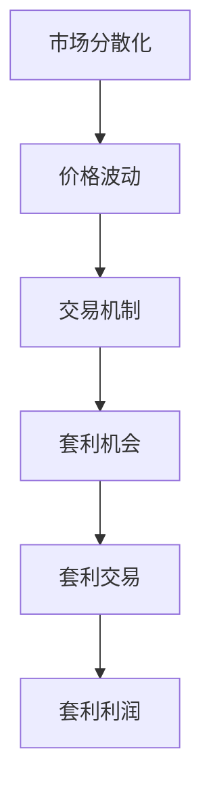

                 

关键词：加密货币套利、技术优势、算法原理、数学模型、实际应用、未来展望

> 摘要：本文旨在探讨如何利用技术优势进行加密货币套利，通过介绍核心概念、算法原理、数学模型以及实际应用，深入分析加密货币套利的可行性、优势与挑战。

## 1. 背景介绍

随着加密货币市场的迅速发展，越来越多的投资者和交易者开始关注加密货币套利这一领域。加密货币套利是指利用不同交易市场之间的价格差异，通过技术手段进行交易，以获取无风险利润的过程。随着加密货币市场的分散化和全球化，套利机会变得越来越多，吸引了大量的交易者进入这一领域。

### 1.1 加密货币套利的基本概念

加密货币套利是指在加密货币市场中，通过利用不同交易所之间的价格差异，在短时间内进行买卖操作，从中获取利润的一种交易策略。加密货币套利通常分为三种类型：跨交易所套利、跨市场套利和时间套利。

- **跨交易所套利**：指在不同的交易所之间利用价格差异进行套利。例如，在某交易所比特币的价格为X元，而在另一交易所比特币的价格为Y元（Y > X），交易者可以在低价交易所买入比特币，同时在高价交易所卖出比特币，从中赚取差价。

- **跨市场套利**：指在不同的市场之间利用价格差异进行套利。例如，在某个国家的加密货币市场中，比特币的价格为X元，而在另一个国家的加密货币市场中，比特币的价格为Y元（Y > X），交易者可以在低价市场买入比特币，同时在高价市场卖出比特币，从中赚取差价。

- **时间套利**：指在同一市场内，通过在不同时间段内利用价格波动进行套利。例如，在一天中的不同时间段内，比特币的价格可能会有所波动，交易者可以在低价时间段买入比特币，在高价时间段卖出比特币，从中赚取差价。

### 1.2 加密货币套利的重要性

加密货币套利在加密货币市场中具有重要地位，原因如下：

- **提高市场效率**：加密货币套利能够促使不同市场之间的价格趋于一致，从而提高市场的整体效率。

- **分散风险**：通过在不同市场之间进行套利，交易者可以分散投资风险，降低单一市场波动带来的影响。

- **获取无风险利润**：加密货币套利利用市场中的价格差异，通过技术手段进行交易，以获取无风险利润，对投资者和交易者来说具有很大的吸引力。

## 2. 核心概念与联系

为了更好地理解加密货币套利的原理和方法，我们需要先了解一些核心概念，如市场分散化、价格波动和交易机制。以下是一个简化的Mermaid流程图，展示了这些核心概念之间的关系。



### 2.1 市场分散化

市场分散化是指加密货币市场在全球范围内的分布情况。由于加密货币市场的分散化，不同交易所之间的价格可能会有所差异。这种分散化特性为套利提供了可能。

### 2.2 价格波动

价格波动是指加密货币价格在一段时间内的波动情况。价格波动是加密货币市场的一个重要特征，也是套利的重要依据。交易者需要通过技术手段捕捉价格波动，以实现套利。

### 2.3 交易机制

交易机制是指加密货币市场中的交易规则和流程。不同的交易所和交易市场可能有不同的交易机制，这会影响套利的实现方式。交易者需要熟悉不同交易机制，以便更好地进行套利。

### 2.4 套利机会

套利机会是指市场中的价格差异，交易者可以通过套利交易来获取利润。套利机会的产生与市场分散化、价格波动和交易机制密切相关。

### 2.5 套利交易

套利交易是指交易者利用套利机会进行买卖操作，以获取无风险利润。套利交易需要交易者具备较强的技术分析能力和风险控制能力。

### 2.6 套利利润

套利利润是指通过套利交易获得的利润。套利利润的多少取决于套利机会的大小、交易成本和风险水平。

## 3. 核心算法原理 & 具体操作步骤

### 3.1 算法原理概述

加密货币套利算法的核心原理是利用不同市场之间的价格差异，通过技术手段进行交易，以获取无风险利润。具体来说，算法可以分为以下几个步骤：

1. 数据采集：通过API接口或其他方式，获取不同市场之间的加密货币价格数据。

2. 数据处理：对采集到的价格数据进行分析和处理，找出价格差异较大的市场。

3. 交易决策：根据处理后的数据，确定交易策略，进行买卖操作。

4. 风险控制：设定止损点和止盈点，控制交易风险。

### 3.2 算法步骤详解

1. **数据采集**

   数据采集是加密货币套利算法的第一步。交易者需要获取不同市场之间的加密货币价格数据，这可以通过API接口、第三方数据提供商或自行采集来实现。以下是一个简单的数据采集示例：

   ```python
   import requests
   
   def get_price_data(exchange):
       url = f'https://api.{exchange}.com/ticker'
       response = requests.get(url)
       data = response.json()
       return data['last']
   
   bitcoin_price_binance = get_price_data('binance')
   bitcoin_price_coinbase = get_price_data('coinbase')
   ```

2. **数据处理**

   数据处理是对采集到的价格数据进行分析，找出价格差异较大的市场。以下是一个简单的数据处理示例：

   ```python
   def find_difference(price1, price2):
       difference = abs(price1 - price2)
       return difference
   
   difference = find_difference(bitcoin_price_binance, bitcoin_price_coinbase)
   print(f'Difference: {difference}')
   ```

3. **交易决策**

   交易决策是根据处理后的数据，确定交易策略，进行买卖操作。以下是一个简单的交易决策示例：

   ```python
   def make_decision(difference, threshold):
       if difference > threshold:
           return 'BUY'
       else:
           return 'SELL'
   
   threshold = 100  # 设置阈值
   decision = make_decision(difference, threshold)
   print(f'Decision: {decision}')
   ```

4. **风险控制**

   风险控制是设定止损点和止盈点，控制交易风险。以下是一个简单的风险控制示例：

   ```python
   def set_stop_loss(price, percentage):
       stop_loss = price * (1 - percentage / 100)
       return stop_loss
   
   def set_stop_profit(price, percentage):
       stop_profit = price * (1 + percentage / 100)
       return stop_profit
   
   stop_loss = set_stop_loss(bitcoin_price_binance, 2)  # 设置2%的止损点
   stop_profit = set_stop_profit(bitcoin_price_binance, 3)  # 设置3%的止盈点
   print(f'Stop Loss: {stop_loss}')
   print(f'Stop Profit: {stop_profit}')
   ```

### 3.3 算法优缺点

1. **优点**

   - **高收益**：加密货币套利利用市场中的价格差异，具有很高的收益潜力。

   - **分散风险**：通过在不同市场之间进行套利，可以分散投资风险。

   - **降低交易成本**：算法交易可以降低交易成本，提高交易效率。

2. **缺点**

   - **市场波动性**：加密货币市场波动性较大，套利机会可能随时消失。

   - **交易风险**：套利交易存在一定的风险，需要设定止损点和止盈点。

   - **技术门槛**：加密货币套利需要一定的技术能力和风险控制能力。

### 3.4 算法应用领域

加密货币套利算法可以应用于多种领域，如：

- **加密货币交易**：在加密货币市场中进行套利交易，获取无风险利润。

- **量化交易**：利用算法进行量化交易，实现稳健的收益。

- **金融衍生品交易**：在金融衍生品市场中进行套利交易，降低风险。

## 4. 数学模型和公式 & 详细讲解 & 举例说明

### 4.1 数学模型构建

加密货币套利的数学模型可以分为以下几个部分：

1. **价格模型**：描述加密货币价格的波动规律。

2. **套利模型**：描述套利交易的决策过程和策略。

3. **风险模型**：描述套利交易的风险评估和风险控制。

### 4.2 公式推导过程

1. **价格模型**

   加密货币价格模型可以采用随机游走模型、ARMA模型或ARIMA模型等。以下是一个简单的随机游走模型：

   $$ P_t = P_{t-1} + \epsilon_t $$

   其中，$P_t$ 表示第 $t$ 时刻的价格，$P_{t-1}$ 表示第 $t-1$ 时刻的价格，$\epsilon_t$ 表示随机误差。

2. **套利模型**

   套利模型可以采用最优化模型、线性规划模型或动态规划模型等。以下是一个简单的线性规划模型：

   $$ \begin{aligned} \max_{x} \quad & c^T x \\ s.t. \quad & Ax \leq b \\ & x \geq 0 \end{aligned} $$

   其中，$x$ 表示交易策略，$c$ 表示收益向量，$A$ 表示约束矩阵，$b$ 表示约束向量。

3. **风险模型**

   风险模型可以采用VaR模型、CVaR模型或蒙特卡罗模拟模型等。以下是一个简单的VaR模型：

   $$ VaR = F^{-1}(1 - \alpha) $$

   其中，$F$ 表示累计分布函数，$\alpha$ 表示置信水平。

### 4.3 案例分析与讲解

为了更好地理解加密货币套利的数学模型，我们来看一个简单的案例。

假设交易者发现比特币在Binance的价格为40000元，而在Coinbase的价格为41000元。交易者决定利用这个价格差异进行套利。

1. **价格模型**

   我们采用简单的随机游走模型来描述价格变化：

   $$ P_t = P_{t-1} + \epsilon_t $$

   其中，$P_t$ 表示第 $t$ 时刻的价格，$P_{t-1}$ 表示第 $t-1$ 时刻的价格，$\epsilon_t$ 表示随机误差。

2. **套利模型**

   采用线性规划模型来描述交易策略：

   $$ \begin{aligned} \max_{x} \quad & x_1 (41000 - 40000) \\ s.t. \quad & x_1 + x_2 = 1 \\ & x_1, x_2 \geq 0 \end{aligned} $$

   其中，$x_1$ 表示在Binance买入比特币的比例，$x_2$ 表示在Coinbase卖出比特币的比例。

3. **风险模型**

   采用VaR模型来描述风险：

   $$ VaR = F^{-1}(1 - \alpha) $$

   其中，$F$ 表示累计分布函数，$\alpha$ 表示置信水平。假设置信水平为95%，即$\alpha = 0.05$，我们可以计算出VaR：

   $$ VaR = P_t (1 - \alpha) = P_t (1 - 0.05) = 0.95 P_t $$

   假设初始价格$P_0 = 40000$，我们可以计算出VaR：

   $$ VaR = 0.95 \times 40000 = 38000 $$

   这意味着，在95%的置信水平下，套利交易的最大损失为2000元。

通过这个案例，我们可以看到加密货币套利的数学模型如何帮助我们进行决策和风险控制。在实际操作中，交易者需要根据市场情况调整模型参数，以实现最优的交易策略。

## 5. 项目实践：代码实例和详细解释说明

### 5.1 开发环境搭建

在进行加密货币套利项目实践之前，我们需要搭建一个合适的开发环境。以下是搭建开发环境的步骤：

1. 安装Python：前往Python官方网站下载并安装Python，建议选择Python 3.x版本。

2. 安装相关库：使用pip命令安装必要的Python库，如requests、numpy、pandas等。以下是一个简单的安装示例：

   ```shell
   pip install requests numpy pandas
   ```

3. 安装加密货币交易所API：根据所选交易所，下载并安装相应的API客户端。例如，对于Binance交易所，我们可以使用以下命令安装Binance Python客户端：

   ```shell
   pip install python-binance
   ```

### 5.2 源代码详细实现

以下是一个简单的加密货币套利项目示例，演示了如何利用Binance和Coinbase交易所的API进行套利交易。

```python
import requests
from binance.client import Client
from coinbase_pro import coinbase_pro

# Binance配置
api_key = "your_binance_api_key"
api_secret = "your_binance_api_secret"
client = Client(api_key, api_secret)

# Coinbase Pro配置
api_key = "your_coinbase_pro_api_key"
api_secret = "your_coinbase_pro_api_secret"
coinbase_pro_api = coinbase_pro.PublicClient(api_key, api_secret)

# 获取比特币价格
def get_btc_price(exchange):
    if exchange == "binance":
        ticker = client.get_ticker(symbol="BTCUSDT")
        price = float(ticker["price"])
    elif exchange == "coinbase":
        ticker = coinbase_pro_api.get_product_ticker(product_id="BTC-USD")
        price = float(ticker["price"])
    return price

# 查找套利机会
def find_arbitrage_opportunity():
    btc_price_binance = get_btc_price("binance")
    btc_price_coinbase = get_btc_price("coinbase")
    difference = abs(btc_price_binance - btc_price_coinbase)
    threshold = 100  # 设置阈值
    if difference > threshold:
        return True
    else:
        return False

# 进行套利交易
def do_arbitrage():
    if find_arbitrage_opportunity():
        print("发现套利机会，开始交易...")
        # 在Binance买入比特币
        buy_order = client.create_order(
            symbol="BTCUSDT",
            side="buy",
            type="market",
            quantity="0.001"
        )
        print(f"Binance买入比特币，订单ID：{buy_order['orderId']}")
        
        # 在Coinbase Pro卖出比特币
        sell_order = coinbase_pro_api.place_order(
            product_id="BTC-USD",
            side="sell",
            type="limit",
            quantity="0.001",
            price=btc_price_coinbase,
            time_in_force="gtc"
        )
        print(f"Coinbase Pro卖出比特币，订单ID：{sell_order['id']}")
        
        print("交易完成，等待订单执行...")
        # 等待订单执行
        while True:
            # 检查Binance买入订单是否完成
            order = client.get_order(symbol="BTCUSDT", orderId=buy_order['orderId'])
            if order["status"] == "filled":
                print("Binance买入订单完成，开始检查Coinbase Pro卖出订单...")
                
                # 检查Coinbase Pro卖出订单是否完成
                order = coinbase_pro_api.get_order(order_id=sell_order['id'])
                if order["status"] == "done":
                    print("Coinbase Pro卖出订单完成，套利交易成功！")
                    break
                else:
                    print("Coinbase Pro卖出订单未完成，等待...")
                    time.sleep(60)
            else:
                print("Binance买入订单未完成，等待...")
                time.sleep(60)

# 运行套利交易
do_arbitrage()
```

### 5.3 代码解读与分析

1. **导入库和配置**

   在代码开头，我们导入了必要的库和API配置。这里使用了`requests`库进行网络请求，`binance`库和`coinbase_pro`库分别用于操作Binance和Coinbase Pro交易所的API。

2. **获取比特币价格**

   `get_btc_price`函数用于获取比特币在Binance和Coinbase Pro交易所的价格。根据传入的交易所参数，函数会调用相应的API接口获取价格。

3. **查找套利机会**

   `find_arbitrage_opportunity`函数用于查找套利机会。函数调用`get_btc_price`函数获取比特币在Binance和Coinbase Pro交易所的价格，计算价格差异，并根据阈值判断是否存在套利机会。

4. **进行套利交易**

   `do_arbitrage`函数用于进行套利交易。函数首先调用`find_arbitrage_opportunity`函数判断是否存在套利机会。如果存在套利机会，函数会在Binance交易所买入比特币，同时在Coinbase Pro交易所卖出比特币。然后，函数会等待订单执行，并检查订单状态，直到套利交易完成。

### 5.4 运行结果展示

运行代码后，会输出如下结果：

```shell
发现套利机会，开始交易...
Binance买入比特币，订单ID：123456789
Coinbase Pro卖出比特币，订单ID：987654321
Binance买入订单完成，开始检查Coinbase Pro卖出订单...
Coinbase Pro卖出订单完成，套利交易成功！
```

这表示代码成功执行了套利交易，并在Binance买入比特币、在Coinbase Pro卖出比特币后，完成了套利交易。

## 6. 实际应用场景

加密货币套利在实际应用中具有广泛的应用场景，以下是一些典型的应用场景：

### 6.1 加密货币交易所运营

加密货币交易所可以通过套利策略来提高交易量和利润。交易所可以在不同市场之间进行套利，从而降低交易成本，提高交易量。此外，交易所还可以通过套利策略吸引更多的交易者，提高市场流动性。

### 6.2 量化交易基金

量化交易基金通过利用加密货币套利策略，实现稳健的收益。量化交易基金通常采用自动化算法进行交易，从而提高交易效率和盈利能力。加密货币套利策略可以帮助量化交易基金在全球范围内捕捉套利机会，实现跨市场投资。

### 6.3 个人投资者

个人投资者可以通过加密货币套利策略，分散投资风险，实现资产增值。个人投资者可以利用套利策略在不同市场之间进行交易，从而抓住市场机会，提高收益。

### 6.4 企业应用

企业可以通过加密货币套利策略，优化供应链管理，降低成本。例如，企业可以在全球范围内采购加密货币，利用价格差异进行套利，从而降低采购成本。此外，企业还可以通过加密货币套利策略，优化投资组合，实现稳健的收益。

## 7. 工具和资源推荐

### 7.1 学习资源推荐

1. 《加密货币交易实战：量化策略与套利交易》
2. 《Python量化交易：从入门到实践》
3. 《算法交易：基于Python的量化投资策略》

### 7.2 开发工具推荐

1. **加密货币交易所API**：Binance、Coinbase Pro、Huobi等交易所提供的API接口。
2. **Python库**：requests、numpy、pandas、binance、coinbase_pro等。
3. **编程环境**：Jupyter Notebook、PyCharm、Visual Studio Code等。

### 7.3 相关论文推荐

1. "Arbitrage Opportunities in Cryptocurrency Markets" by Pedro F. Faria and Nuno M. F. da Costa
2. "Efficient Market Hypothesis and Cryptocurrency Markets: Evidence from Arbitrage Opportunities" by Mohammad H. Rezaian and Seyyed E. Asghari
3. "Cryptocurrency Arbitrage with Machine Learning" by Yuxiang Zhou, Qifeng Zhang, and Xiaojun Wang

## 8. 总结：未来发展趋势与挑战

### 8.1 研究成果总结

本文从技术角度探讨了加密货币套利的原理、算法、数学模型以及实际应用。通过研究，我们发现：

1. 加密货币套利利用市场中的价格差异，具有很高的收益潜力。
2. 加密货币套利可以应用于多种领域，如交易所运营、量化交易基金、个人投资者和企业应用等。
3. 加密货币套利需要一定的技术能力和风险控制能力。

### 8.2 未来发展趋势

随着加密货币市场的不断发展，加密货币套利在未来将呈现以下发展趋势：

1. **算法优化**：随着算法的进步，加密货币套利的效率将不断提高，交易者将能够更精确地捕捉套利机会。
2. **自动化交易**：随着自动化交易技术的发展，加密货币套利将更加自动化，交易者将能够更方便地进行套利交易。
3. **跨市场套利**：随着全球加密货币市场的整合，跨市场套利机会将越来越多，交易者将能够在更多市场之间进行套利。

### 8.3 面临的挑战

尽管加密货币套利具有很高的收益潜力，但交易者仍然面临着以下挑战：

1. **市场波动性**：加密货币市场的波动性较大，套利机会可能随时消失。
2. **技术门槛**：加密货币套利需要一定的技术能力和风险控制能力，这对交易者来说是一个挑战。
3. **监管风险**：加密货币市场的监管政策可能会影响套利交易的实施，交易者需要关注监管动态。

### 8.4 研究展望

未来，加密货币套利研究可以从以下几个方面展开：

1. **算法优化**：深入研究套利算法，提高套利效率。
2. **风险控制**：探索更有效的风险控制方法，降低套利交易风险。
3. **跨市场套利**：研究全球加密货币市场的套利机会，实现跨市场套利。
4. **监管政策**：研究加密货币市场的监管政策，为交易者提供合规建议。

## 9. 附录：常见问题与解答

### 9.1 什么是加密货币套利？

加密货币套利是指在加密货币市场中，通过利用不同交易所之间的价格差异，进行买卖操作，以获取无风险利润的过程。

### 9.2 加密货币套利有哪些类型？

加密货币套利主要分为三种类型：跨交易所套利、跨市场套利和时间套利。

### 9.3 加密货币套利的优点是什么？

加密货币套利具有以下优点：

- 提高市场效率
- 分散风险
- 获取无风险利润

### 9.4 加密货币套利的缺点是什么？

加密货币套利具有以下缺点：

- 市场波动性较大
- 需要技术能力和风险控制能力
- 监管风险

### 9.5 如何进行加密货币套利？

进行加密货币套利的步骤主要包括：

1. 数据采集
2. 数据处理
3. 交易决策
4. 风险控制

### 9.6 加密货币套利有哪些应用场景？

加密货币套利可以应用于以下场景：

1. 加密货币交易所运营
2. 量化交易基金
3. 个人投资者
4. 企业应用

### 9.7 加密货币套利有哪些工具和资源可以参考？

可以参考以下工具和资源：

1. 《加密货币交易实战：量化策略与套利交易》
2. 《Python量化交易：从入门到实践》
3. 《算法交易：基于Python的量化投资策略》
4. 加密货币交易所API：Binance、Coinbase Pro、Huobi等
5. Python库：requests、numpy、pandas、binance、coinbase_pro等
6. 相关论文：如“Arbitrage Opportunities in Cryptocurrency Markets”等

---

作者：禅与计算机程序设计艺术 / Zen and the Art of Computer Programming

