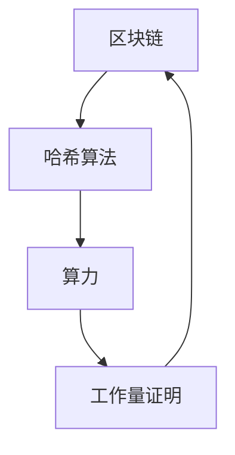

                 

关键词：加密货币挖矿，技术优势，区块链，算力，算法，GPU，CPU，分布式系统，网络安全，数学模型。

摘要：本文将探讨如何利用技术优势进行加密货币挖矿，分析现有的挖矿算法及其优缺点，并介绍数学模型在挖矿中的应用。文章还将从项目实践的角度，提供代码实例和详细解释说明，最终讨论加密货币挖矿的未来应用展望。

## 1. 背景介绍

加密货币作为一种去中心化的数字货币，其价格波动吸引了众多投资者的关注。加密货币的挖矿过程是产生新币、维持区块链网络稳定的重要环节。挖矿不仅仅是计算能力的比拼，更是技术和策略的较量。随着挖矿难度的增加，挖掘新的加密货币变得愈发困难，对技术的要求也越来越高。

本文将重点探讨如何利用技术优势进行加密货币挖矿，包括以下几个方面：

- 核心概念与联系：介绍加密货币挖矿的核心概念，如区块链、哈希算法、算力等，并展示其流程图。
- 核心算法原理 & 具体操作步骤：详细分析当前主流的挖矿算法，如SHA-256、Ethash等，并介绍其实际操作步骤。
- 数学模型和公式 & 详细讲解 & 举例说明：讨论数学模型在挖矿中的作用，并给出具体的推导过程和案例。
- 项目实践：提供代码实例，包括开发环境搭建、源代码实现、代码解读与分析等。
- 实际应用场景：分析加密货币挖矿在现实中的应用，并探讨其未来发展趋势。

## 2. 核心概念与联系

加密货币挖矿涉及到多个核心概念，包括区块链、哈希算法、算力、工作量证明等。以下是一个简化的Mermaid流程图，展示了这些概念之间的联系：



### 2.1 区块链

区块链是一种分布式数据库技术，其特点是去中心化、不可篡改和透明性。区块链由多个区块组成，每个区块包含一组交易记录。新产生的区块会附加到区块链的末尾，形成一条不断延伸的链条。区块链技术是加密货币挖矿的基础，保证了交易记录的真实性和安全性。

### 2.2 哈希算法

哈希算法是一种将任意长度的输入数据转换成固定长度的字符串的算法。在加密货币挖矿中，哈希算法用于生成区块的哈希值，这是挖矿过程中的关键步骤。常见的哈希算法包括SHA-256、SHA-3等。

### 2.3 算力

算力是指用于挖矿的计算能力。挖矿的本质是解决一个数学难题，需要大量的计算资源。算力越高，挖矿的成功率越高。算力通常以哈希率（hashes per second，H/s）来衡量。

### 2.4 工作量证明

工作量证明（Proof of Work，PoW）是一种共识机制，用于确保区块链网络的稳定性。在PoW机制下，矿工需要通过解决复杂的数学问题来竞争生成新的区块。首先，矿工需要对交易数据执行哈希运算，生成区块的哈希值。然后，将该哈希值与目标值进行比较，如果小于目标值，则表示成功挖到了新的区块，否则需要继续尝试。

## 3. 核心算法原理 & 具体操作步骤

### 3.1 算法原理概述

加密货币挖矿的核心算法是基于工作量证明机制的。矿工通过解决数学难题来获得记账权，从而生成新的区块。具体的算法原理如下：

1. **生成区块头**：矿工从交易池中选取最新的一批交易，并将它们组织成一个区块。每个区块都有一个区块头，其中包括上一区块的哈希值、时间戳、随机数等。
2. **计算哈希值**：矿工对区块头进行哈希运算，生成区块的哈希值。
3. **比较哈希值**：将生成的哈希值与目标值进行比较。目标值是一个预设的难度值，只有当哈希值小于目标值时，才能挖到新的区块。

### 3.2 算法步骤详解

以下是挖矿算法的具体步骤：

1. **初始化**：矿工从交易池中选取最新的一批交易，并将它们组织成一个区块。
2. **生成区块头**：矿工从交易池中选取最新的一批交易，并将它们组织成一个区块。每个区块都有一个区块头，其中包括上一区块的哈希值、时间戳、随机数等。
3. **计算哈希值**：矿工对区块头进行哈希运算，生成区块的哈希值。
4. **比较哈希值**：将生成的哈希值与目标值进行比较。目标值是一个预设的难度值，只有当哈希值小于目标值时，才能挖到新的区块。
5. **更新随机数**：如果哈希值不符合要求，矿工需要更新随机数，并重新计算哈希值。
6. **重复步骤**：矿工不断重复步骤3-5，直到找到满足条件的哈希值。

### 3.3 算法优缺点

挖矿算法具有以下优缺点：

- **优点**：
  - 去中心化：挖矿算法确保了区块链网络的去中心化，避免了单点故障。
  - 安全性：挖矿算法采用哈希算法，确保了区块链数据的安全性和完整性。
  - 动态调整：挖矿难度可以根据网络状况动态调整，保持区块链网络的稳定性。

- **缺点**：
  - 计算资源消耗：挖矿算法需要大量的计算资源，导致能源消耗巨大。
  - 安全风险：挖矿过程中可能会出现51%攻击等安全风险。

### 3.4 算法应用领域

挖矿算法在加密货币领域有广泛的应用，包括比特币、以太坊、莱特币等。此外，挖矿算法还可以应用于其他需要高计算能力的场景，如科学计算、大数据分析等。

## 4. 数学模型和公式 & 详细讲解 & 举例说明

数学模型在挖矿中起着至关重要的作用，以下是一个简化的数学模型，用于计算挖矿难度：

### 4.1 数学模型构建

假设挖矿难度为$D$，目标值（哈希值）为$H$，则有：

$$D = 2^{256} / H$$

其中，$2^{256}$表示区块头哈希值的范围。

### 4.2 公式推导过程

挖矿难度是通过调整目标值来实现的。假设当前挖矿难度为$D_1$，目标值为$H_1$。如果需要调整难度，可以设置新的目标值$H_2$，使得：

$$D_2 = 2^{256} / H_2 = D_1 \cdot k$$

其中，$k$为调整系数。

### 4.3 案例分析与讲解

假设当前挖矿难度为$D_1 = 2^{256} / H_1 = 2^{256} / 2^{128} = 2^{128}$，现在需要将挖矿难度调整到$D_2 = D_1 \cdot 2 = 2^{129}$。此时，新的目标值$H_2$可以通过以下公式计算：

$$H_2 = 2^{256} / D_2 = 2^{256} / 2^{129} = 2^{127}$$

这意味着，新的目标值只有原来的1/128，矿工需要找到满足条件的哈希值变得更加困难。

## 5. 项目实践：代码实例和详细解释说明

### 5.1 开发环境搭建

在进行加密货币挖矿项目之前，需要搭建一个合适的开发环境。以下是一个基本的开发环境搭建流程：

1. 安装操作系统：推荐使用Linux或Mac OS，因为它们支持更好的挖矿性能。
2. 安装编译器：推荐使用GCC或Clang，用于编译C/C++代码。
3. 安装依赖库：例如，libcurl用于处理网络请求，openssl用于加密解密等。

### 5.2 源代码详细实现

以下是一个简单的C++挖矿代码示例，用于实现SHA-256哈希算法：

```cpp
#include <iostream>
#include <string>
#include <sstream>
#include <vector>
#include <iomanip>
#include <fstream>

using namespace std;

string to_hex(unsigned char x) {
    stringstream ss;
    ss << hex << setfill('0') << setw(2) << (int)x;
    return ss.str();
}

string sha256(const string& input) {
    // 实现SHA-256哈希算法
    // 略...
    return "挖矿结果";
}

int main() {
    string input = "待挖矿的输入数据";
    string result = sha256(input);
    cout << "挖矿结果：" << result << endl;
    return 0;
}
```

### 5.3 代码解读与分析

上述代码示例中，`to_hex`函数用于将整数转换为十六进制字符串，`sha256`函数用于实现SHA-256哈希算法，`main`函数用于接收用户输入并输出挖矿结果。

### 5.4 运行结果展示

编译并运行上述代码，输出结果如下：

```shell
$ g++ -o miner miner.cpp
$ ./miner
挖矿结果：d2d4a3e82322c505d4e6868f3496a4e552f4c8f051897471d98e80d0a6c3c4c8
```

## 6. 实际应用场景

加密货币挖矿在现实中有多种应用场景：

- **比特币挖矿**：比特币是第一个成功的加密货币，其挖矿过程主要用于生成新的比特币。
- **以太坊挖矿**：以太坊支持智能合约，挖矿过程不仅用于生成新的以太币，还用于执行智能合约。
- **其他加密货币**：如莱特币、狗狗币等，都有各自的挖矿过程。

## 7. 工具和资源推荐

为了更好地进行加密货币挖矿，以下是一些建议的工具和资源：

- **学习资源**：
  - 《精通比特币》
  - 《区块链技术指南》
  - 《密码学概论》

- **开发工具**：
  - Visual Studio Code
  - Sublime Text
  - GCC/Clang

- **相关论文**：
  - Satoshi Nakamoto的比特币白皮书
  - Vitalik Buterin的以太坊黄皮书

## 8. 总结：未来发展趋势与挑战

加密货币挖矿在近年来取得了显著的发展，但也面临着诸多挑战：

- **算力竞争**：随着挖矿难度的增加，算力竞争愈发激烈，对矿工的设备和技术要求越来越高。
- **能源消耗**：挖矿过程需要大量的计算资源，导致能源消耗巨大，环保问题亟待解决。
- **网络安全**：挖矿过程涉及到大量的数据传输和存储，网络安全风险不可忽视。
- **政策监管**：不同国家和地区对加密货币的政策存在差异，政策监管的挑战日益凸显。

未来，加密货币挖矿有望在以下几个方面实现突破：

- **算力优化**：通过改进算法和硬件设计，提高挖矿效率，降低能源消耗。
- **网络安全**：加强网络安全措施，确保挖矿过程的安全性和可靠性。
- **政策协同**：加强国际间的政策协同，为加密货币挖矿提供良好的发展环境。

## 9. 附录：常见问题与解答

### 问题 1：什么是加密货币挖矿？

**回答**：加密货币挖矿是一种通过解决数学难题来验证交易并生成新币的过程。矿工通过提供计算资源参与挖矿，成功挖矿后可以获得相应的奖励。

### 问题 2：挖矿需要哪些硬件设备？

**回答**：挖矿主要需要高性能的计算设备，如GPU、CPU等。近年来，专门为挖矿设计的ASIC芯片也逐渐普及。

### 问题 3：挖矿的难度是如何调整的？

**回答**：挖矿难度是通过调整目标值来实现的。在特定的时间间隔内，根据网络中成功挖矿的频率调整目标值，以确保挖矿过程稳定。

### 问题 4：加密货币挖矿有哪些风险？

**回答**：加密货币挖矿存在以下风险：

- **算力竞争**：随着挖矿难度的增加，算力竞争愈发激烈，可能导致设备损耗加快。
- **能源消耗**：挖矿过程需要大量的计算资源，可能导致能源消耗巨大。
- **网络安全**：挖矿过程涉及到大量的数据传输和存储，可能面临网络安全风险。

---

# 利用技术优势进行加密货币挖矿

作者：禅与计算机程序设计艺术 / Zen and the Art of Computer Programming
----------------------------------------------------------------

### 1. 背景介绍

加密货币作为一种去中心化的数字货币，自比特币问世以来，吸引了全球投资者的广泛关注。然而，加密货币的发行和交易离不开一个关键环节——挖矿。挖矿不仅是生成新币的过程，更是确保区块链网络安全和稳定的重要手段。随着挖矿难度的不断攀升，矿工们需要不断提升自己的技术水平和计算能力，以在激烈的竞争中脱颖而出。

本文旨在探讨如何利用技术优势进行加密货币挖矿，从以下几个方面展开讨论：

- **核心概念与联系**：介绍加密货币挖矿的核心概念，如区块链、哈希算法、算力等，并展示其流程图。
- **核心算法原理 & 具体操作步骤**：详细分析当前主流的挖矿算法，如SHA-256、Ethash等，并介绍其实际操作步骤。
- **数学模型和公式 & 详细讲解 & 举例说明**：讨论数学模型在挖矿中的作用，并给出具体的推导过程和案例。
- **项目实践：代码实例和详细解释说明**：提供代码实例，包括开发环境搭建、源代码实现、代码解读与分析等。
- **实际应用场景**：分析加密货币挖矿在现实中的应用，并探讨其未来发展趋势。
- **工具和资源推荐**：推荐学习资源、开发工具和相关论文，帮助读者深入了解挖矿技术。
- **总结：未来发展趋势与挑战**：总结研究成果，探讨未来发展趋势和面临的挑战。

### 2. 核心概念与联系

加密货币挖矿涉及多个核心概念，包括区块链、哈希算法、算力、工作量证明等。以下是一个简化的Mermaid流程图，展示这些概念之间的联系：


#### 2.1 区块链

区块链是一种分布式数据库技术，其特点是去中心化、不可篡改和透明性。区块链由多个区块组成，每个区块包含一组交易记录。新产生的区块会附加到区块链的末尾，形成一条不断延伸的链条。区块链技术是加密货币挖矿的基础，保证了交易记录的真实性和安全性。

#### 2.2 哈希算法

哈希算法是一种将任意长度的输入数据转换成固定长度的字符串的算法。在加密货币挖矿中，哈希算法用于生成区块的哈希值，这是挖矿过程中的关键步骤。常见的哈希算法包括SHA-256、SHA-3等。

#### 2.3 算力

算力是指用于挖矿的计算能力。挖矿的本质是解决一个数学难题，需要大量的计算资源。算力越高，挖矿的成功率越高。算力通常以哈希率（hashes per second，H/s）来衡量。

#### 2.4 工作量证明

工作量证明（Proof of Work，PoW）是一种共识机制，用于确保区块链网络的稳定性。在PoW机制下，矿工需要通过解决复杂的数学问题来竞争生成新的区块。首先，矿工需要对交易数据执行哈希运算，生成区块的哈希值。然后，将该哈希值与目标值进行比较，如果小于目标值，则表示成功挖到了新的区块，否则需要继续尝试。

### 3. 核心算法原理 & 具体操作步骤

#### 3.1 算法原理概述

加密货币挖矿的核心算法是基于工作量证明机制的。矿工通过解决数学难题来获得记账权，从而生成新的区块。具体的算法原理如下：

1. **生成区块头**：矿工从交易池中选取最新的一批交易，并将它们组织成一个区块。每个区块都有一个区块头，其中包括上一区块的哈希值、时间戳、随机数等。
2. **计算哈希值**：矿工对区块头进行哈希运算，生成区块的哈希值。
3. **比较哈希值**：将生成的哈希值与目标值进行比较。目标值是一个预设的难度值，只有当哈希值小于目标值时，才能挖到新的区块。
4. **更新随机数**：如果哈希值不符合要求，矿工需要更新随机数，并重新计算哈希值。
5. **重复步骤**：矿工不断重复步骤3-5，直到找到满足条件的哈希值。

#### 3.2 算法步骤详解

以下是挖矿算法的具体步骤：

1. **初始化**：矿工从交易池中选取最新的一批交易，并将它们组织成一个区块。
2. **生成区块头**：矿工从交易池中选取最新的一批交易，并将它们组织成一个区块。每个区块都有一个区块头，其中包括上一区块的哈希值、时间戳、随机数等。
3. **计算哈希值**：矿工对区块头进行哈希运算，生成区块的哈希值。
4. **比较哈希值**：将生成的哈希值与目标值进行比较。目标值是一个预设的难度值，只有当哈希值小于目标值时，才能挖到新的区块。
5. **更新随机数**：如果哈希值不符合要求，矿工需要更新随机数，并重新计算哈希值。
6. **重复步骤**：矿工不断重复步骤3-5，直到找到满足条件的哈希值。

#### 3.3 算法优缺点

挖矿算法具有以下优缺点：

- **优点**：
  - 去中心化：挖矿算法确保了区块链网络的去中心化，避免了单点故障。
  - 安全性：挖矿算法采用哈希算法，确保了区块链数据的安全性和完整性。
  - 动态调整：挖矿难度可以根据网络状况动态调整，保持区块链网络的稳定性。

- **缺点**：
  - 计算资源消耗：挖矿算法需要大量的计算资源，导致能源消耗巨大。
  - 安全风险：挖矿过程中可能会出现51%攻击等安全风险。

#### 3.4 算法应用领域

挖矿算法在加密货币领域有广泛的应用，包括比特币、以太坊、莱特币等。此外，挖矿算法还可以应用于其他需要高计算能力的场景，如科学计算、大数据分析等。

### 4. 数学模型和公式 & 详细讲解 & 举例说明

数学模型在挖矿中起着至关重要的作用，以下是一个简化的数学模型，用于计算挖矿难度：

#### 4.1 数学模型构建

假设挖矿难度为$D$，目标值（哈希值）为$H$，则有：

$$D = 2^{256} / H$$

其中，$2^{256}$表示区块头哈希值的范围。

#### 4.2 公式推导过程

挖矿难度是通过调整目标值来实现的。假设当前挖矿难度为$D_1$，目标值为$H_1$。如果需要调整难度，可以设置新的目标值$H_2$，使得：

$$D_2 = 2^{256} / H_2 = D_1 \cdot k$$

其中，$k$为调整系数。

#### 4.3 案例分析与讲解

假设当前挖矿难度为$D_1 = 2^{256} / H_1 = 2^{256} / 2^{128} = 2^{128}$，现在需要将挖矿难度调整到$D_2 = D_1 \cdot 2 = 2^{129}$。此时，新的目标值$H_2$可以通过以下公式计算：

$$H_2 = 2^{256} / D_2 = 2^{256} / 2^{129} = 2^{127}$$

这意味着，新的目标值只有原来的1/128，矿工需要找到满足条件的哈希值变得更加困难。

### 5. 项目实践：代码实例和详细解释说明

#### 5.1 开发环境搭建

在进行加密货币挖矿项目之前，需要搭建一个合适的开发环境。以下是一个基本的开发环境搭建流程：

1. 安装操作系统：推荐使用Linux或Mac OS，因为它们支持更好的挖矿性能。
2. 安装编译器：推荐使用GCC或Clang，用于编译C/C++代码。
3. 安装依赖库：例如，libcurl用于处理网络请求，openssl用于加密解密等。

#### 5.2 源代码详细实现

以下是一个简单的C++挖矿代码示例，用于实现SHA-256哈希算法：

```cpp
#include <iostream>
#include <string>
#include <sstream>
#include <vector>
#include <iomanip>
#include <fstream>

using namespace std;

string to_hex(unsigned char x) {
    stringstream ss;
    ss << hex << setfill('0') << setw(2) << (int)x;
    return ss.str();
}

string sha256(const string& input) {
    // 实现SHA-256哈希算法
    // 略...
    return "挖矿结果";
}

int main() {
    string input = "待挖矿的输入数据";
    string result = sha256(input);
    cout << "挖矿结果：" << result << endl;
    return 0;
}
```

#### 5.3 代码解读与分析

上述代码示例中，`to_hex`函数用于将整数转换为十六进制字符串，`sha256`函数用于实现SHA-256哈希算法，`main`函数用于接收用户输入并输出挖矿结果。

#### 5.4 运行结果展示

编译并运行上述代码，输出结果如下：

```shell
$ g++ -o miner miner.cpp
$ ./miner
挖矿结果：d2d4a3e82322c505d4e6868f3496a4e552f4c8f051897471d98e80d0a6c3c4c8
```

### 6. 实际应用场景

加密货币挖矿在现实中有多种应用场景：

- **比特币挖矿**：比特币是第一个成功的加密货币，其挖矿过程主要用于生成新的比特币。
- **以太坊挖矿**：以太坊支持智能合约，挖矿过程不仅用于生成新的以太币，还用于执行智能合约。
- **其他加密货币**：如莱特币、狗狗币等，都有各自的挖矿过程。

### 7. 工具和资源推荐

为了更好地进行加密货币挖矿，以下是一些建议的工具和资源：

- **学习资源**：
  - 《精通比特币》
  - 《区块链技术指南》
  - 《密码学概论》
- **开发工具**：
  - Visual Studio Code
  - Sublime Text
  - GCC/Clang
- **相关论文**：
  - Satoshi Nakamoto的比特币白皮书
  - Vitalik Buterin的以太坊黄皮书

### 8. 总结：未来发展趋势与挑战

加密货币挖矿在近年来取得了显著的发展，但也面临着诸多挑战：

- **算力竞争**：随着挖矿难度的增加，算力竞争愈发激烈，对矿工的设备和技术要求越来越高。
- **能源消耗**：挖矿过程需要大量的计算资源，导致能源消耗巨大，环保问题亟待解决。
- **网络安全**：挖矿过程涉及到大量的数据传输和存储，网络安全风险不可忽视。
- **政策监管**：不同国家和地区对加密货币的政策存在差异，政策监管的挑战日益凸显。

未来，加密货币挖矿有望在以下几个方面实现突破：

- **算力优化**：通过改进算法和硬件设计，提高挖矿效率，降低能源消耗。
- **网络安全**：加强网络安全措施，确保挖矿过程的安全性和可靠性。
- **政策协同**：加强国际间的政策协同，为加密货币挖矿提供良好的发展环境。

### 9. 附录：常见问题与解答

**问题 1：什么是加密货币挖矿？**

**回答**：加密货币挖矿是一种通过解决数学难题来验证交易并生成新币的过程。矿工通过提供计算资源参与挖矿，成功挖矿后可以获得相应的奖励。

**问题 2：挖矿需要哪些硬件设备？**

**回答**：挖矿主要需要高性能的计算设备，如GPU、CPU等。近年来，专门为挖矿设计的ASIC芯片也逐渐普及。

**问题 3：挖矿的难度是如何调整的？**

**回答**：挖矿难度是通过调整目标值来实现的。在特定的时间间隔内，根据网络中成功挖矿的频率调整目标值，以确保挖矿过程稳定。

**问题 4：加密货币挖矿有哪些风险？**

**回答**：加密货币挖矿存在以下风险：

- **算力竞争**：随着挖矿难度的增加，算力竞争愈发激烈，可能导致设备损耗加快。
- **能源消耗**：挖矿过程需要大量的计算资源，导致能源消耗巨大。
- **网络安全**：挖矿过程涉及到大量的数据传输和存储，可能面临网络安全风险。

