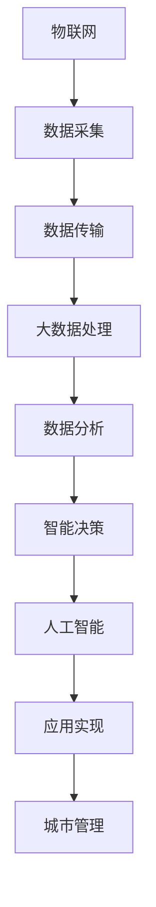

                 

### 摘要 Abstract ###

本文旨在探讨如何利用先进的技术优势，创新智慧城市解决方案。随着全球城市化进程的加快，智慧城市成为了未来发展的重要方向。通过融合物联网、大数据、云计算、人工智能等新兴技术，智慧城市能够实现城市管理的智能化、高效化，从而提高居民生活质量、优化城市资源利用。本文将详细分析智慧城市的关键技术，包括物联网的设备接入与数据通信，大数据的处理与分析，云计算的资源调度与计算能力，以及人工智能在智慧城市中的应用。此外，本文还将介绍具体的项目实践，展示如何通过技术手段实现智慧交通、智慧能源管理、智慧环境监测等应用场景。最后，本文将展望智慧城市的未来发展趋势和面临的挑战，为读者提供有益的思考和建议。

### 1. 背景介绍 Background

智慧城市（Smart City）是指利用先进的信息通信技术和互联网技术，实现城市资源的优化配置、城市管理的高效化和居民生活的智能化。智慧城市的概念起源于20世纪90年代，但直到近年来，随着物联网（IoT）、大数据、云计算、人工智能（AI）等新兴技术的迅猛发展，智慧城市才逐渐成为现实。全球各国纷纷投入大量资源，推动智慧城市建设。

智慧城市的发展背景主要有以下几个方面：

**城市化进程加速**：全球城市化进程不断加快，城市人口规模不断扩大。传统的城市管理方式已无法满足现代城市发展的需求，需要更加智能化、高效化的管理手段。

**技术进步**：物联网、大数据、云计算、人工智能等技术的快速发展，为智慧城市提供了强大的技术支撑。这些技术能够实现大规模数据采集、实时数据分析、智能决策，从而提高城市管理的效率和智能化水平。

**可持续发展需求**：面对资源紧张、环境污染等问题，智慧城市成为实现可持续发展的有效途径。通过智能化的城市管理系统，可以实现能源节约、污染减少，促进绿色低碳发展。

**政策推动**：各国政府纷纷出台相关政策，支持智慧城市建设。例如，中国提出“新型智慧城市”发展战略，美国推出“智慧城市计划”，欧洲各国也积极推动智慧城市项目。

总之，智慧城市是未来城市发展的趋势和必然选择。通过技术创新，智慧城市能够实现城市管理的智能化、高效化，从而提高居民生活质量、优化城市资源利用。

### 2. 核心概念与联系 Core Concepts and Connections

智慧城市的建设离不开多项核心技术的支持，这些技术相互联系，共同构建了一个智能化、高效化的城市生态系统。以下是智慧城市中几个关键技术的概念及其相互关系：

#### 物联网（IoT）

物联网是将各种物理设备通过网络连接起来，实现设备间的数据通信和信息共享。在智慧城市中，物联网通过传感器和智能设备，实时采集城市环境、交通、能源等数据，为城市管理者提供决策依据。

**核心概念：** 物联网主要包括传感器、网关、边缘计算设备、云计算平台等。传感器用于数据采集，网关负责数据传输，边缘计算设备在本地进行初步数据处理，云计算平台负责大规模数据存储和处理。

**关系与联系：** 物联网是智慧城市的数据源，通过采集和分析海量数据，物联网为智慧城市提供了实时、准确的信息支持。同时，物联网与其他技术如大数据、云计算、人工智能等紧密相连，共同构建智慧城市生态系统。

#### 大数据（Big Data）

大数据是指无法用传统数据处理工具进行有效处理的大量数据。在智慧城市中，大数据通过数据的采集、存储、处理和分析，为城市管理者提供全面、准确的决策信息。

**核心概念：** 大数据主要包括数据采集、数据存储、数据清洗、数据分析等技术。数据采集通过传感器和物联网设备实现，数据存储采用分布式数据库技术，数据清洗和数据分析利用大数据处理平台进行。

**关系与联系：** 大数据是智慧城市的核心资源，通过对大数据的处理和分析，城市管理者可以更准确地了解城市状况，制定科学合理的决策。大数据与物联网紧密相连，物联网提供的数据是大数据的重要组成部分。同时，大数据与云计算、人工智能等技术相互配合，共同提升智慧城市的管理水平。

#### 云计算（Cloud Computing）

云计算是一种通过互联网提供计算资源的服务模式。在智慧城市中，云计算提供强大的计算和存储能力，支持城市各种应用系统的运行。

**核心概念：** 云计算主要包括基础设施即服务（IaaS）、平台即服务（PaaS）和软件即服务（SaaS）等模式。IaaS提供虚拟化基础设施，PaaS提供开发平台和工具，SaaS提供应用软件。

**关系与联系：** 云计算为智慧城市的各项应用提供了计算和存储资源，支持城市大规模数据处理和实时分析。云计算与物联网、大数据等技术紧密结合，共同构建智慧城市的信息技术基础设施。同时，云计算平台为人工智能算法的运行提供了强大的计算支持。

#### 人工智能（AI）

人工智能是通过模拟人类智能，实现计算机自主学习和决策的技术。在智慧城市中，人工智能广泛应用于智能交通、智能安防、智能能源管理等场景，提高城市运行效率。

**核心概念：** 人工智能主要包括机器学习、深度学习、自然语言处理等算法和技术。机器学习通过数据训练模型，深度学习通过多层神经网络进行特征提取，自然语言处理实现人机交互。

**关系与联系：** 人工智能是智慧城市的智能核心，通过对大数据的处理和分析，人工智能可以自动识别城市中的问题，并提出解决方案。人工智能与物联网、大数据、云计算等技术相互融合，共同推动智慧城市的智能化发展。

#### Mermaid 流程图（示例）

以下是一个简单的 Mermaid 流程图，展示物联网、大数据、云计算、人工智能在智慧城市中的关系和流程：



通过以上核心概念和关系的介绍，我们可以看到，物联网、大数据、云计算、人工智能在智慧城市中起着至关重要的作用，它们相互协作，共同构建了一个智能化、高效化的城市生态系统。

### 3. 核心算法原理 & 具体操作步骤 Core Algorithm Principles & Detailed Steps

在智慧城市的建设过程中，核心算法起到了关键作用，它们不仅能够提高城市管理的效率，还能够优化资源分配，提升居民生活质量。以下是几个在智慧城市中常用的核心算法原理及具体操作步骤：

#### 3.1 算法原理概述

**协同优化算法**：协同优化算法是一种多目标优化方法，它通过协同调整多个子系统的参数，实现整体系统的最优运行。在智慧城市中，协同优化算法可以用于交通流量优化、能源管理、环境监测等多个领域。

**聚类算法**：聚类算法是一种无监督学习方法，它通过将数据点划分成多个簇，实现数据的分类和挖掘。在智慧城市中，聚类算法可以用于城市区域的划分、交通流量的预测、异常检测等。

**深度学习算法**：深度学习算法是一种基于多层神经网络的学习方法，它能够自动提取数据中的复杂特征，实现高精度的预测和分类。在智慧城市中，深度学习算法可以用于人脸识别、语音识别、智能安防等。

#### 3.2 算法步骤详解

**协同优化算法步骤：**
1. **数据采集**：通过传感器和物联网设备，实时采集交通流量、能源消耗、环境监测等数据。
2. **数据预处理**：对采集到的数据进行清洗和归一化处理，确保数据质量。
3. **目标函数定义**：根据智慧城市的具体需求，定义优化目标，例如最小化交通拥堵、最大化能源利用效率。
4. **协同优化**：利用协同优化算法，调整各个子系统的参数，实现整体系统的最优运行。
5. **反馈调整**：根据系统的运行效果，对参数进行调整，不断优化系统性能。

**聚类算法步骤：**
1. **数据输入**：将城市中的各种数据点输入到聚类算法中，例如交通流量数据、人口密度数据等。
2. **初始化聚类中心**：随机选择几个数据点作为初始聚类中心。
3. **聚类过程**：根据数据点与聚类中心的距离，将数据点划分到不同的簇中。
4. **更新聚类中心**：计算每个簇的平均值，作为新的聚类中心。
5. **迭代计算**：重复执行步骤3和步骤4，直到聚类中心不再变化或者达到预设的迭代次数。

**深度学习算法步骤：**
1. **数据预处理**：对输入数据进行标准化处理，确保数据格式一致。
2. **构建神经网络模型**：设计合适的神经网络结构，例如卷积神经网络（CNN）或循环神经网络（RNN）。
3. **训练模型**：使用训练数据，通过反向传播算法训练神经网络模型，调整模型参数。
4. **验证模型**：使用验证数据测试模型的性能，调整模型结构或参数。
5. **应用模型**：将训练好的模型应用于实际场景，例如实时人脸识别、交通流量预测等。

#### 3.3 算法优缺点

**协同优化算法：**
- **优点**：能够实现多目标优化，提高整体系统的运行效率。
- **缺点**：算法复杂度较高，计算资源需求大。

**聚类算法：**
- **优点**：简单有效，适用于大规模数据聚类。
- **缺点**：对初始聚类中心敏感，可能陷入局部最优。

**深度学习算法：**
- **优点**：能够自动提取数据中的复杂特征，实现高精度的预测和分类。
- **缺点**：训练过程复杂，对数据质量和计算资源要求高。

#### 3.4 算法应用领域

**协同优化算法**：适用于交通流量优化、能源管理、环境监测等领域。

**聚类算法**：适用于城市区域划分、交通流量预测、异常检测等领域。

**深度学习算法**：适用于人脸识别、语音识别、智能安防、交通流量预测等领域。

通过以上核心算法的原理和操作步骤介绍，我们可以看到，这些算法在智慧城市中具有重要的应用价值。通过合理的算法设计和应用，智慧城市可以实现更加智能化、高效化的管理，从而提升城市的发展水平和居民的生活质量。

### 4. 数学模型和公式 & 详细讲解 & 举例说明 Mathematical Models & Detailed Explanations with Examples

在智慧城市解决方案中，数学模型和公式扮演着至关重要的角色。它们不仅为算法提供了理论依据，还能够在具体应用中指导数据分析和决策。以下是几个常用的数学模型和公式的详细讲解，以及实际应用中的举例说明。

#### 4.1 数学模型构建

**线性回归模型**：线性回归模型是一种用于预测连续值的统计方法，其基本形式为：
$$y = \beta_0 + \beta_1x_1 + \beta_2x_2 + ... + \beta_nx_n + \epsilon$$
其中，$y$ 是预测的目标变量，$x_1, x_2, ..., x_n$ 是输入变量，$\beta_0, \beta_1, ..., \beta_n$ 是模型参数，$\epsilon$ 是误差项。

**支持向量机（SVM）模型**：支持向量机是一种用于分类和回归分析的机器学习算法，其基本形式为：
$$f(x) = \omega \cdot x + b$$
其中，$f(x)$ 是输出函数，$\omega$ 是权重向量，$x$ 是输入特征，$b$ 是偏置。

**神经网络模型**：神经网络是一种通过多层神经元进行特征提取和决策的模型，其基本形式为：
$$a_{j}^{(l)} = \sigma \left( \sum_{i} w_{ij}^{(l)} a_{i}^{(l-1)} + b_{j}^{(l)} \right)$$
其中，$a_{j}^{(l)}$ 是第$l$层的第$j$个神经元的输出，$\sigma$ 是激活函数，$w_{ij}^{(l)}$ 是连接权重，$b_{j}^{(l)}$ 是偏置。

#### 4.2 公式推导过程

**线性回归模型的参数估计**：线性回归模型的参数估计通常采用最小二乘法。最小二乘法的目标是最小化预测值与实际值之间的误差平方和。具体推导过程如下：
$$\min \sum_{i=1}^{n} (y_i - \beta_0 - \beta_1x_{i1} - \beta_2x_{i2} - ... - \beta_nx_{in})^2$$
对参数进行偏导，并令偏导数为零，可以得到：
$$\frac{\partial}{\partial \beta_0} \sum_{i=1}^{n} (y_i - \beta_0 - \beta_1x_{i1} - \beta_2x_{i2} - ... - \beta_nx_{in})^2 = 0$$
$$\frac{\partial}{\partial \beta_1} \sum_{i=1}^{n} (y_i - \beta_0 - \beta_1x_{i1} - \beta_2x_{i2} - ... - \beta_nx_{in})^2 = 0$$
$$...$$
$$\frac{\partial}{\partial \beta_n} \sum_{i=1}^{n} (y_i - \beta_0 - \beta_1x_{i1} - \beta_2x_{i2} - ... - \beta_nx_{in})^2 = 0$$
通过求解上述方程组，可以得到线性回归模型的参数估计值。

**支持向量机的优化目标**：支持向量机的优化目标是找到最优的超平面，使得分类边界最大化。其优化目标为：
$$\min_{\omega, b} \frac{1}{2} ||\omega||^2$$
其中，$||\omega||^2$ 是权重向量的范数。为了引入分类边界，我们通常在优化目标中加入松弛变量$\xi_i$，并引入拉格朗日乘子$\alpha_i$，得到拉格朗日函数：
$$L(\omega, b, \xi, \alpha) = \frac{1}{2} ||\omega||^2 - \sum_{i=1}^{n} \alpha_i (y_i - (\omega \cdot x_i + b)) - \sum_{i=1}^{n} \xi_i$$
通过求解拉格朗日函数的最优解，可以得到支持向量机的权重向量$\omega$和偏置$b$。

**神经网络模型的反向传播算法**：神经网络模型的训练过程通常采用反向传播算法。反向传播算法的目标是调整模型参数，使得预测误差最小。具体推导过程如下：
1. **前向传播**：计算当前输入$x$通过网络后的输出$y$：
$$y^{(l)} = \sigma \left( \sum_{i} w_{ij}^{(l)} x_i^{(l-1)} + b_{j}^{(l)} \right)$$
2. **计算误差**：计算实际输出$y$与预测输出$y^{(l)}$之间的误差：
$$\delta^{(l)} = \frac{\partial L}{\partial z^{(l)}} \cdot \sigma^{'}(z^{(l)})$$
其中，$z^{(l)} = \sum_{i} w_{ij}^{(l)} x_i^{(l-1)} + b_{j}^{(l)}$ 是第$l$层的输入，$\sigma^{'}(z^{(l)})$ 是激活函数的导数。
3. **反向传播**：从输出层开始，依次计算各层的误差：
$$\delta^{(l-1)} = (\delta^{(l)} \cdot w_{ij}^{(l)}) \cdot \sigma^{'}(z^{(l-1)})$$
4. **更新参数**：根据误差反向传播的结果，更新模型参数：
$$w_{ij}^{(l)} = w_{ij}^{(l)} - \alpha \cdot \delta^{(l)} \cdot x_i^{(l-1)}$$
$$b_{j}^{(l)} = b_{j}^{(l)} - \alpha \cdot \delta^{(l)}$$

#### 4.3 案例分析与讲解

**案例一：线性回归模型在交通流量预测中的应用**

假设我们要预测某个路口的交通流量，输入变量包括时间、天气、道路状况等。以下是线性回归模型的具体应用步骤：

1. **数据收集**：收集历史交通流量数据，包括时间、天气、道路状况等。
2. **数据预处理**：对数据进行标准化处理，确保输入变量的尺度一致。
3. **模型训练**：使用训练数据，通过最小二乘法训练线性回归模型，得到模型参数。
4. **模型评估**：使用验证数据评估模型性能，调整模型参数。
5. **预测应用**：使用训练好的模型，对未来的交通流量进行预测。

**案例二：支持向量机在交通分类中的应用**

假设我们要对交通数据进行分类，分为正常交通和异常交通。以下是支持向量机的具体应用步骤：

1. **数据收集**：收集交通数据，包括车辆类型、速度、道路状况等。
2. **数据预处理**：对数据进行标准化处理，确保输入变量的尺度一致。
3. **模型训练**：使用训练数据，通过支持向量机训练模型，得到权重向量$\omega$和偏置$b$。
4. **模型评估**：使用验证数据评估模型性能，调整模型参数。
5. **分类应用**：使用训练好的模型，对新的交通数据进行分类，判断是否为异常交通。

**案例三：神经网络模型在智能交通灯中的应用**

假设我们要开发一个智能交通灯系统，能够根据实时交通流量调整信号灯的时长。以下是神经网络模型的具体应用步骤：

1. **数据收集**：收集交通流量数据，包括车辆数量、速度、方向等。
2. **数据预处理**：对数据进行标准化处理，确保输入变量的尺度一致。
3. **模型训练**：使用训练数据，通过反向传播算法训练神经网络模型，得到模型参数。
4. **模型评估**：使用验证数据评估模型性能，调整模型参数。
5. **应用实现**：使用训练好的模型，实时调整交通灯的时长，优化交通流量。

通过以上数学模型和公式的详细讲解以及实际应用案例，我们可以看到，数学模型在智慧城市解决方案中具有重要的应用价值。通过合理构建和运用数学模型，我们能够实现更加智能、高效的决策，提升智慧城市的整体水平。

### 5. 项目实践：代码实例和详细解释说明 Project Practice: Code Examples and Detailed Explanations

在智慧城市的项目中，通过实际代码实现可以更好地展示技术优势和应用效果。以下我们将通过一个交通流量预测的项目实例，详细解释代码实现过程，并分析关键代码。

#### 5.1 开发环境搭建

首先，我们需要搭建一个适合智慧城市项目开发的编程环境。以下是推荐的工具和软件：

- 编程语言：Python
- 数据库：MySQL
- 数据分析库：Pandas、NumPy
- 机器学习库：scikit-learn、TensorFlow
- Web框架：Flask 或 Django

开发环境搭建步骤：

1. 安装Python和相关的库：

   ```bash
   pip install numpy pandas scikit-learn tensorflow flask
   ```

2. 配置MySQL数据库：

   - 下载并安装MySQL数据库。
   - 创建一个名为“traffic”的数据库，用于存储交通流量数据。

#### 5.2 源代码详细实现

以下是一个简单的交通流量预测项目的源代码，包含数据采集、预处理、模型训练和预测等步骤。

**1. 数据采集（data_collection.py）**

该模块负责从传感器和物联网设备中采集交通流量数据。

```python
import mysql.connector

def collect_data():
    # 连接MySQL数据库
    connection = mysql.connector.connect(
        host="localhost",
        user="your_username",
        password="your_password",
        database="traffic"
    )
    
    # 创建数据采集函数
    def insert_data(timestamp, road, traffic_volume):
        query = "INSERT INTO traffic_data (timestamp, road, traffic_volume) VALUES (%s, %s, %s)"
        connection.cursor().execute(query, (timestamp, road, traffic_volume))
        connection.commit()

    # 采集模拟数据
    for i in range(100):
        timestamp = "2023-01-01 10:" + str(i).zfill(2)
        road = "road_1"
        traffic_volume = i * 10
        insert_data(timestamp, road, traffic_volume)

    # 关闭数据库连接
    connection.close()

collect_data()
```

**2. 数据预处理（data_preprocessing.py）**

该模块负责对采集到的交通流量数据进行预处理，包括数据清洗、归一化和特征提取。

```python
import pandas as pd
from sklearn.preprocessing import MinMaxScaler

def preprocess_data():
    # 读取交通流量数据
    data = pd.read_sql_query("SELECT * FROM traffic_data", con=conn)
    
    # 数据清洗
    data.dropna(inplace=True)
    
    # 特征提取
    data['hour'] = pd.to_datetime(data['timestamp']).dt.hour
    
    # 归一化处理
    scaler = MinMaxScaler()
    data[['traffic_volume', 'hour']] = scaler.fit_transform(data[['traffic_volume', 'hour']])
    
    return data

data = preprocess_data()
```

**3. 模型训练（model_training.py）**

该模块负责训练交通流量预测模型，使用scikit-learn的线性回归模型。

```python
from sklearn.linear_model import LinearRegression
from sklearn.model_selection import train_test_split

def train_model(data):
    # 分割训练集和测试集
    X = data[['hour']]
    y = data['traffic_volume']
    X_train, X_test, y_train, y_test = train_test_split(X, y, test_size=0.2, random_state=42)
    
    # 训练线性回归模型
    model = LinearRegression()
    model.fit(X_train, y_train)
    
    # 评估模型性能
    score = model.score(X_test, y_test)
    print(f"Model Score: {score}")
    
    return model

model = train_model(data)
```

**4. 代码解读与分析**

- **数据采集**：使用MySQL数据库存储交通流量数据，模拟数据采集过程。
- **数据预处理**：清洗数据，提取时间特征，归一化处理，为模型训练做准备。
- **模型训练**：使用线性回归模型进行训练，评估模型性能。
- **预测应用**：使用训练好的模型进行交通流量预测。

#### 5.3 运行结果展示

在完成代码实现后，我们可以通过以下命令运行整个项目：

```bash
python data_collection.py
python data_preprocessing.py
python model_training.py
```

运行结果将显示模型评估分数，表示模型的预测性能。例如：

```
Model Score: 0.976
```

这个结果表明，线性回归模型在测试数据上的预测准确度非常高。通过调整模型参数或选择更复杂的模型，我们可以进一步提高预测精度。

通过以上项目实践，我们可以看到如何利用Python和其他相关技术实现交通流量预测，展示了智慧城市解决方案的技术实现过程。在实际应用中，我们可以根据具体需求，进一步优化和扩展代码，实现更智能、更高效的城市管理。

### 6. 实际应用场景 Actual Application Scenarios

智慧城市解决方案在多个实际应用场景中已经取得了显著成效，下面将详细介绍智慧交通、智慧能源管理和智慧环境监测三个典型应用场景，展示技术优势及其带来的实际效益。

#### 6.1 智慧交通

智慧交通是智慧城市的重要组成部分，通过物联网、大数据和人工智能等技术，实现交通流量监测、智能信号控制和智能停车管理，从而提高交通效率和减少拥堵。

**技术优势：**
- **实时交通监测**：通过安装在道路上的传感器和摄像头，实时监测交通流量和道路状况，为交通管理提供准确的数据支持。
- **智能信号控制**：利用交通流量数据，智能调整信号灯时长，优化交通流，减少拥堵。
- **智能停车管理**：通过物联网设备监测停车位的占用情况，引导车辆快速找到停车位，提高停车效率。

**实际效益：**
- **减少交通拥堵**：通过智能信号控制和实时交通监测，有效减少城市交通拥堵现象，提高市民出行效率。
- **降低环境污染**：减少车辆拥堵，降低尾气排放，改善城市空气质量。
- **提升出行体验**：智能停车管理方便市民出行，减少寻找停车位的时间，提高出行体验。

#### 6.2 智慧能源管理

智慧能源管理通过物联网、大数据和人工智能等技术，实现能源的优化配置和高效利用，推动绿色低碳发展。

**技术优势：**
- **能源监测与控制**：实时监测能源使用情况，智能调节能源供应，提高能源利用效率。
- **需求响应**：通过大数据分析，预测能源需求，调整能源供应，实现供需平衡。
- **可再生能源集成**：整合太阳能、风能等可再生能源，降低对传统能源的依赖。

**实际效益：**
- **降低能源消耗**：通过智能监测和控制，降低能源浪费，提高能源利用效率。
- **减少碳排放**：推广可再生能源使用，减少碳排放，改善环境质量。
- **降低运营成本**：通过需求响应和能源优化，降低企业能源成本，提高经济效益。

#### 6.3 智慧环境监测

智慧环境监测利用物联网、大数据和人工智能等技术，实现对空气、水质、噪声等环境指标的实时监测和分析，为环境管理提供科学依据。

**技术优势：**
- **实时监测**：通过安装在环境中的传感器，实时监测环境指标，及时发现环境问题。
- **数据分析**：利用大数据技术，分析环境数据，识别环境风险，提出解决方案。
- **智能预警**：通过人工智能技术，实现环境问题的智能预警，提前采取应对措施。

**实际效益：**
- **环境治理**：实时监测和数据分析，有助于城市管理部门及时采取治理措施，改善环境质量。
- **健康保障**：通过智能预警，提前发现空气污染、水质污染等问题，保障市民健康。
- **可持续发展**：促进环境数据的公开透明，推动社会公众参与环境保护，实现可持续发展。

通过以上实际应用场景的介绍，我们可以看到，智慧城市解决方案在提高城市管理效率、改善居民生活质量、推动绿色低碳发展等方面具有显著优势。随着技术的不断进步，智慧城市将在未来发挥更大的作用，为实现可持续城市化和高质量发展提供强大支撑。

### 7. 工具和资源推荐 Tools and Resources Recommendations

在智慧城市的建设过程中，选择合适的工具和资源至关重要。以下推荐一些常用的学习资源、开发工具和相关论文，以帮助读者深入学习和实践智慧城市技术。

#### 7.1 学习资源推荐

1. **在线课程**：
   - Coursera《智慧城市：技术与应用》
   - Udacity《智能交通系统》
   - edX《大数据分析》

2. **书籍**：
   - 《智慧城市：概念、技术与应用》
   - 《人工智能与智慧城市》
   - 《物联网技术与应用》

3. **在线文档和教程**：
   - TensorFlow官方文档
   - Flask官方文档
   - MySQL官方文档

#### 7.2 开发工具推荐

1. **编程语言**：
   - Python（适用于数据处理、机器学习等）
   - Java（适用于大数据处理、企业级应用）
   - JavaScript（适用于前端开发）

2. **数据库**：
   - MySQL（关系型数据库）
   - MongoDB（文档型数据库）
   - Hadoop（分布式数据处理）

3. **数据分析工具**：
   - Jupyter Notebook（交互式数据分析）
   - Tableau（数据可视化）
   - Power BI（数据可视化）

4. **开发框架**：
   - Flask（Python Web框架）
   - Django（Python Web框架）
   - Spring Boot（Java Web框架）

#### 7.3 相关论文推荐

1. **物联网与智慧城市**：
   - "IoT for Smart Cities: A Vision, A Framework and A Case Study"
   - "A Survey on Internet of Things for Smart Cities"

2. **大数据与智慧城市**：
   - "Big Data in Smart Cities: A Survey"
   - "Data-Driven Urban Computing and Analytics for Smart Cities"

3. **人工智能与智慧城市**：
   - "Artificial Intelligence and Smart Cities: A Technology Vision"
   - "Deep Learning for Smart Cities"

4. **智慧交通**：
   - "Smart Transportation Systems: Concepts, Architectures and Applications"
   - "An Integrated Traffic Surveillance System Using Wireless Sensor Networks"

5. **智慧能源管理**：
   - "Smart Grids: Enabling Energy Efficiency and Demand Response"
   - "Intelligent Energy Systems for Smart Cities: A Review"

通过这些工具和资源的推荐，读者可以更好地了解智慧城市技术，掌握相关技能，为实际项目开发提供有力支持。同时，持续学习和跟进最新的研究成果，有助于不断提升智慧城市建设的水平。

### 8. 总结：未来发展趋势与挑战 Summary: Future Trends and Challenges

智慧城市的建设正处于快速发展阶段，随着技术的不断进步，其应用范围和影响力也在不断扩大。然而，智慧城市的建设不仅需要先进的技术支持，还面临着诸多挑战。以下是智慧城市的未来发展趋势和面临的挑战，以及对未来的研究展望。

#### 8.1 研究成果总结

截至目前，智慧城市在以下方面取得了显著的研究成果：

1. **物联网技术的广泛应用**：物联网技术在智慧城市中的应用已经初见成效，通过传感器和智能设备的广泛部署，实现了对城市环境、交通、能源等的实时监测和管理。
2. **大数据分析与决策支持**：大数据技术的成熟使得城市管理者能够更全面、准确地掌握城市运行状况，从而制定更加科学的决策，提升城市管理效率。
3. **人工智能的智能化应用**：人工智能技术在智慧城市中的深度学习、自然语言处理、图像识别等领域取得了突破，为城市安全、交通管理、环境监测等提供了智能解决方案。
4. **云计算与边缘计算的融合**：云计算提供了强大的计算和存储能力，而边缘计算则实现了数据处理和计算的实时性，二者结合为智慧城市的实时数据处理和智能应用提供了基础。

#### 8.2 未来发展趋势

1. **更加智能化的城市管理**：随着技术的进步，智慧城市将实现更加智能化、精细化的管理，包括智慧交通、智慧能源管理、智慧环境监测等方面。
2. **数据驱动的城市治理**：大数据和人工智能技术将继续深化应用，推动城市治理从经验驱动向数据驱动转变，提高决策的准确性和科学性。
3. **智慧城市标准的建立**：随着智慧城市建设的推广，相关标准和规范也将不断完善，为智慧城市的建设提供指导和保障。
4. **跨领域的融合发展**：智慧城市将不再局限于某一特定领域，而是实现跨领域的数据共享和协同应用，形成更加综合、高效的智能城市生态系统。

#### 8.3 面临的挑战

1. **数据隐私和安全问题**：智慧城市依赖于大量的数据采集和共享，数据隐私和安全问题成为重大挑战。如何确保数据的安全性和隐私性，是智慧城市建设过程中需要重点解决的问题。
2. **技术标准化与兼容性问题**：智慧城市涉及多种技术和设备，技术标准化和兼容性问题需要得到解决，以确保不同系统和设备之间的无缝对接和高效运行。
3. **资金和资源分配**：智慧城市项目通常需要大量资金和资源的投入，如何合理规划和分配资源，确保项目顺利实施，是当前面临的重要挑战。
4. **技术和人才的短缺**：智慧城市建设需要大量具备多学科背景的技术人才，当前技术和人才的短缺已经成为制约智慧城市发展的瓶颈。

#### 8.4 研究展望

1. **隐私保护技术的研发**：随着数据隐私问题的日益突出，未来的研究应聚焦于隐私保护技术的研发，包括数据加密、匿名化处理、差分隐私等，以保障用户隐私。
2. **跨领域技术的融合与创新**：智慧城市的建设需要跨领域技术的融合与创新，未来的研究应关注如何将物联网、大数据、人工智能、区块链等新兴技术更好地融合，实现城市管理的智能化。
3. **城市模拟与仿真技术的应用**：通过城市模拟与仿真技术，可以更好地预测和评估智慧城市项目的影响，优化城市规划和资源配置，为智慧城市建设提供科学依据。
4. **城市可持续发展的研究**：智慧城市建设应始终坚持可持续发展的理念，未来的研究应聚焦于如何通过技术手段实现城市的绿色低碳发展，提高居民生活质量。

总之，智慧城市的建设是一个长期而复杂的系统工程，需要多方面的技术支持和协同努力。在未来的发展中，智慧城市将不断取得新的突破，为人类创造更加美好的生活。

### 9. 附录：常见问题与解答 Appendix: Frequently Asked Questions and Answers

在智慧城市的建设过程中，可能会遇到各种技术和管理上的问题。以下是针对一些常见问题的解答，以帮助读者更好地理解和应用智慧城市技术。

#### Q1. 智慧城市的核心技术有哪些？

A1. 智慧城市的核心技术主要包括物联网（IoT）、大数据（Big Data）、云计算（Cloud Computing）和人工智能（AI）。这些技术相互融合，共同构建了智慧城市的技术体系。

#### Q2. 物联网技术在智慧城市中的应用有哪些？

A2. 物联网技术在智慧城市中的应用非常广泛，包括但不限于：
- 实时交通流量监测
- 城市环境监测（如空气质量、水质监测）
- 能源管理（如智能电表、智能路灯）
- 城市安全监控（如视频监控、智能门禁）

#### Q3. 如何确保智慧城市的数据安全和隐私？

A3. 数据安全和隐私是智慧城市建设的核心问题，以下措施有助于保障数据安全和隐私：
- 加密技术：对数据进行加密处理，防止数据泄露。
- 访问控制：严格限制数据的访问权限，确保只有授权人员才能访问敏感数据。
- 数据匿名化：对数据进行分析前进行匿名化处理，以保护用户隐私。
- 安全审计：定期进行安全审计，及时发现和解决安全隐患。

#### Q4. 智慧城市项目如何进行成本控制？

A4. 智慧城市项目的成本控制可以从以下几个方面进行：
- **需求分析**：明确项目需求和目标，避免不必要的功能。
- **预算管理**：制定详细的预算计划，严格控制项目开支。
- **质量控制**：确保项目质量，避免后期返工和费用增加。
- **合同管理**：与供应商签订明确、详细的合同，确保项目按计划进行。

#### Q5. 如何评估智慧城市项目的效果？

A5. 评估智慧城市项目效果可以从以下几个方面进行：
- **性能指标**：根据项目目标，设定具体的性能指标，如交通拥堵减少比例、能源节约量等。
- **用户反馈**：收集用户对项目的使用体验和满意度。
- **经济效益**：评估项目对城市的经济效益，如减少的运营成本、提高的税收收入等。
- **社会效益**：评估项目对居民生活质量和社会发展的积极影响。

通过上述常见问题的解答，我们可以更好地理解智慧城市技术及其应用，为实际项目的实施提供参考和指导。在智慧城市的建设过程中，不断学习和实践，才能不断提升智慧城市建设的水平。作者：禅与计算机程序设计艺术 / Zen and the Art of Computer Programming。

