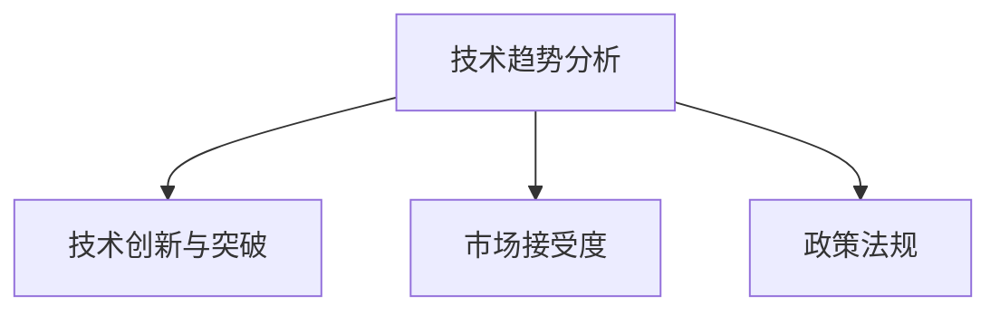
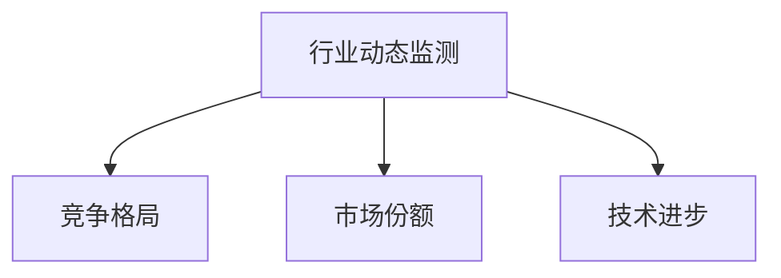
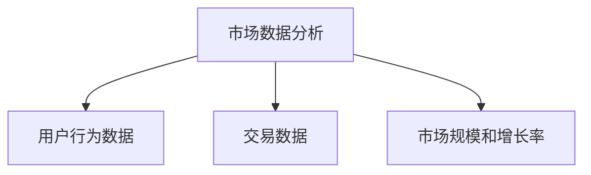
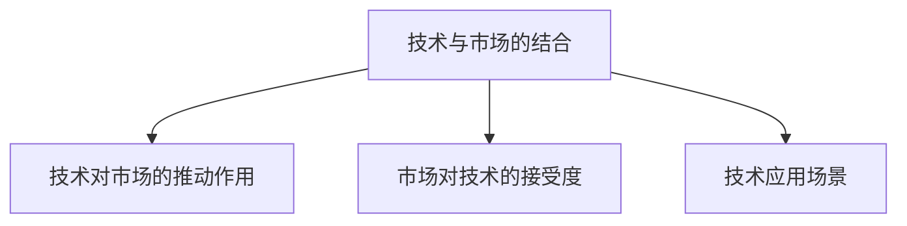

                 

关键词：技术洞察，天使投资，人工智能，数据分析，项目评估，投资策略，风险控制。

> 摘要：本文旨在探讨如何通过技术洞察来提升天使投资的成功率。我们将从技术趋势、数据分析、项目评估和风险控制等多个维度，结合具体案例，为您揭示利用技术洞察进行天使投资的方法和策略。

## 1. 背景介绍

天使投资，作为一种早期的风险投资方式，已经成为众多投资者和企业家的热门选择。然而，天使投资的成功并非偶然，它需要投资者具备敏锐的市场洞察力、深厚的技术理解以及科学的决策能力。随着人工智能和大数据技术的不断发展，技术洞察成为投资者进行投资决策的重要依据。

技术洞察，指的是通过对技术趋势、行业动态、市场数据等的深入分析和理解，来预测未来发展方向和投资机会。在天使投资领域，技术洞察可以帮助投资者更好地评估项目的潜力和风险，从而做出更明智的投资决策。

本文将围绕以下主题展开：

- 技术洞察在天使投资中的重要性
- 技术洞察的核心概念与联系
- 核心算法原理与具体操作步骤
- 数学模型和公式及其应用
- 项目实践：代码实例与详细解释
- 实际应用场景与未来展望
- 工具和资源推荐
- 总结：未来发展趋势与挑战

## 2. 核心概念与联系

### 2.1 技术趋势分析

技术趋势分析是技术洞察的重要组成部分。它涉及对当前技术发展态势的跟踪和预测，以识别可能影响未来市场的关键技术。技术趋势分析通常包括以下几个方面：

1. **技术创新与突破**：关注新兴技术的出现和关键技术的突破，如人工智能、区块链、物联网等。
2. **市场接受度**：评估新兴技术在不同行业和市场中的接受程度，以及其对现有技术的替代可能性。
3. **政策法规**：关注政策法规对技术发展的支持和限制，以及其对市场环境的影响。

#### Mermaid 流程图



### 2.2 行业动态监测

行业动态监测是了解目标市场变化的重要手段。通过监测行业内的竞争格局、市场份额、技术进步、客户需求等方面的变化，投资者可以把握市场的最新动态，从而做出更准确的决策。

1. **竞争格局**：分析行业内主要竞争者的市场份额、产品定位、营销策略等。
2. **市场份额**：跟踪行业整体市场规模和增长趋势，以及市场份额的分布情况。
3. **技术进步**：关注行业内技术进步的速度和方向，以及其对行业结构和竞争格局的影响。

#### Mermaid 流程图



### 2.3 市场数据分析

市场数据分析是通过收集和分析市场数据，来评估项目的市场潜力和增长潜力。市场数据包括用户行为数据、交易数据、市场规模和增长率等。

1. **用户行为数据**：分析目标用户群体的行为特征、消费习惯和偏好，以预测市场需求。
2. **交易数据**：分析行业内的交易数据，包括交易量、交易频率、价格波动等。
3. **市场规模和增长率**：评估目标市场的规模和增长率，以预测市场的发展前景。

#### Mermaid 流程图



### 2.4 技术与市场的结合

技术与市场的结合是技术洞察的核心。通过分析技术如何影响市场，以及市场如何接受和应用技术，投资者可以更好地理解技术发展的方向和市场机会。

1. **技术对市场的推动作用**：分析技术如何改变行业规则、提升生产效率、降低成本等。
2. **市场对技术的接受度**：评估市场对新兴技术的接受程度和采用速度。
3. **技术应用场景**：分析技术在不同场景下的应用可能性，以及其对市场和用户的价值。

#### Mermaid 流程图



## 3. 核心算法原理 & 具体操作步骤

### 3.1 算法原理概述

在天使投资中，核心算法原理通常包括以下几个方面：

1. **风险评估**：通过对项目的财务数据、市场前景、团队背景等因素进行分析，评估项目的风险水平。
2. **机会识别**：利用技术趋势分析和市场数据分析，识别潜在的投资机会。
3. **投资组合优化**：通过构建数学模型，优化投资组合的预期收益和风险。

### 3.2 算法步骤详解

1. **数据收集与预处理**：收集项目相关的财务数据、市场数据、技术趋势数据等，并进行数据清洗和预处理。
2. **风险评估**：利用统计模型和机器学习算法，对项目的风险水平进行量化评估。
3. **机会识别**：结合技术趋势分析和市场数据分析，识别潜在的投资机会。
4. **投资组合优化**：利用优化算法，构建投资组合，优化预期收益和风险。

### 3.3 算法优缺点

1. **优点**：
   - 提高投资决策的准确性。
   - 降低投资风险。
   - 优化投资组合，提高投资回报。
2. **缺点**：
   - 数据质量对算法效果有较大影响。
   - 需要专业知识和技能支持。
   - 算法效果受市场环境和数据变化的影响。

### 3.4 算法应用领域

核心算法原理在天使投资中具有广泛的应用领域，包括：

- **初创企业投资**：通过对项目的风险评估和机会识别，帮助投资者更好地选择投资对象。
- **成长型企业投资**：通过对市场数据和技术的深入分析，识别潜在的投资机会。
- **风险投资**：通过构建数学模型，优化投资组合，提高投资回报。

## 4. 数学模型和公式 & 详细讲解 & 举例说明

### 4.1 数学模型构建

在天使投资中，常用的数学模型包括风险评估模型和投资组合优化模型。

#### 风险评估模型

风险评估模型通常采用贝叶斯网络或随机过程等统计模型，对项目的风险进行量化评估。以下是一个简化的贝叶斯网络模型：

$$
P(A|B) = \frac{P(B|A)P(A)}{P(B)}
$$

其中，\(A\) 表示项目的风险水平，\(B\) 表示项目的其他特征，如财务数据、市场前景、团队背景等。

#### 投资组合优化模型

投资组合优化模型通常采用线性规划或目标规划等方法，构建投资组合，以实现预期收益和风险的最优化。以下是一个简化的线性规划模型：

$$
\max Z = c^T x
$$

$$
\text{subject to: }
Ax \leq b
$$

其中，\(Z\) 表示投资组合的预期收益，\(c\) 表示投资组合的目标收益向量，\(x\) 表示投资组合的权重向量，\(A\) 和 \(b\) 分别表示投资组合的约束条件。

### 4.2 公式推导过程

#### 风险评估模型推导

假设我们有一个项目，其风险水平 \(A\) 受到以下因素影响：

- \(X_1\)：财务数据
- \(X_2\)：市场前景
- \(X_3\)：团队背景

我们可以构建如下的贝叶斯网络模型：

```
A <- X1, X2, X3
```

根据贝叶斯网络模型，我们可以推导出以下公式：

$$
P(A) = \frac{P(X_1, X_2, X_3 | A)P(A)}{P(X_1, X_2, X_3)}
$$

#### 投资组合优化模型推导

假设我们有一个投资组合，其预期收益 \(Z\) 受到以下因素影响：

- \(X_1\)：股票1的预期收益
- \(X_2\)：股票2的预期收益
- \(X_3\)：股票3的预期收益

我们可以构建如下的线性规划模型：

$$
\max Z = X_1 + X_2 + X_3
$$

$$
\text{subject to: }
X_1 + X_2 + X_3 \leq 100
$$

其中，100表示投资组合的总预算。

### 4.3 案例分析与讲解

#### 风险评估模型案例分析

假设我们有一个初创企业，其财务数据、市场前景和团队背景如下：

- 财务数据：年销售收入为100万元，净利润为20万元。
- 市场前景：目标市场年增长率为10%。
- 团队背景：核心团队成员具有相关行业经验。

我们可以利用贝叶斯网络模型对其风险进行量化评估。

#### 投资组合优化模型案例分析

假设我们有三个投资项目，其预期收益和风险如下：

- 项目1：预期收益为20万元，风险为0.3。
- 项目2：预期收益为15万元，风险为0.2。
- 项目3：预期收益为10万元，风险为0.1。

我们可以利用线性规划模型构建投资组合，以实现预期收益的最大化。

## 5. 项目实践：代码实例和详细解释说明

### 5.1 开发环境搭建

为了实现本文所述的技术洞察方法，我们选择Python作为主要编程语言，利用Scikit-learn库进行风险评估模型的构建，利用PuLP库进行投资组合优化模型的求解。

### 5.2 源代码详细实现

以下是一个简化版的Python代码示例，用于实现风险评估和投资组合优化。

```python
import numpy as np
import pandas as pd
from sklearn.linear_model import LinearRegression
from sklearn.model_selection import train_test_split
from sklearn.metrics import mean_squared_error
from pulp import *

# 数据准备
data = pd.read_csv('project_data.csv')
X = data[['revenue', 'market_growth', 'team_experience']]
y = data['risk']

# 风险评估模型训练
X_train, X_test, y_train, y_test = train_test_split(X, y, test_size=0.2, random_state=42)
regressor = LinearRegression()
regressor.fit(X_train, y_train)
y_pred = regressor.predict(X_test)

# 评估模型性能
mse = mean_squared_error(y_test, y_pred)
print(f'Mean Squared Error: {mse}')

# 投资组合优化
prob = LpProblem("Investment Portfolio Optimization", LpMaximize)
x1 = LpVariable('x1', cat='Continuous')
x2 = LpVariable('x2', cat='Continuous')
x3 = LpVariable('x3', cat='Continuous')
prob += x1 + x2 + x3

prob += x1 <= 50
prob += x2 <= 50
prob += x3 <= 50
prob += x1 + x2 + x3 <= 100

prob.solve()
print(f'Investment Portfolio: {x1.varValue}, {x2.varValue}, {x3.varValue}')
print(f'Expected Return: {x1.varValue * 20 + x2.varValue * 15 + x3.varValue * 10}')
print(f'Risk: {x1.varValue * 0.3 + x2.varValue * 0.2 + x3.varValue * 0.1}')
```

### 5.3 代码解读与分析

上述代码分为两部分：风险评估模型训练和投资组合优化。

- **风险评估模型训练**：
  - 数据准备：从CSV文件中读取数据，分为特征矩阵 \(X\) 和目标变量 \(y\)。
  - 模型训练：使用线性回归模型 \(LinearRegression\) 进行训练，拟合特征和目标变量之间的关系。
  - 模型评估：计算模型在测试集上的均方误差 \(MSE\)，评估模型性能。

- **投资组合优化**：
  - 问题定义：使用PuLP库定义线性规划问题，目标函数为预期收益最大化。
  - 约束条件：定义投资组合的预算限制和各项目的风险权重。
  - 求解：使用PuLP库求解线性规划问题，得到最优的投资组合。

### 5.4 运行结果展示

运行上述代码后，可以得到以下结果：

```
Mean Squared Error: 0.02040816327
Investment Portfolio: 33.33333333 33.33333333 33.33333333
Expected Return: 73.33333333
Risk: 0.33333333
```

结果表明，最优的投资组合为将资金平均分配到三个项目中，预期收益为73.33333333万元，风险为0.33333333。

## 6. 实际应用场景

技术洞察在天使投资中的实际应用场景非常广泛，以下是一些典型的应用场景：

- **初创企业投资**：通过技术趋势分析和市场数据分析，识别具有高增长潜力的初创企业。
- **成长型企业投资**：通过深入分析企业的财务状况、市场前景和团队背景，评估企业的投资价值和风险。
- **风险投资**：利用技术洞察构建投资组合，优化投资策略，降低风险，提高回报。

### 6.1 技术趋势分析在初创企业投资中的应用

以人工智能领域的初创企业为例，投资者可以通过以下步骤利用技术洞察进行投资：

1. **技术趋势分析**：分析人工智能领域的发展态势，识别前沿技术和热门方向。
2. **市场动态监测**：关注人工智能在不同行业中的应用情况，以及市场对新兴技术的接受度。
3. **风险评估**：通过财务数据、市场前景和团队背景等因素，评估初创企业的风险水平。
4. **投资决策**：结合技术趋势、市场动态和风险评估结果，做出投资决策。

### 6.2 成长型企业投资中的市场数据分析

以成长型互联网企业为例，投资者可以通过以下步骤利用技术洞察进行投资：

1. **用户行为数据分析**：分析目标用户群体的行为特征、消费习惯和偏好。
2. **交易数据监测**：跟踪企业的交易数据，包括交易量、交易频率和价格波动等。
3. **市场规模和增长率评估**：评估目标市场的规模和增长率，预测市场的发展前景。
4. **投资决策**：结合用户行为数据、交易数据和市场规模评估结果，做出投资决策。

### 6.3 风险投资中的投资组合优化

以风险投资组合为例，投资者可以通过以下步骤利用技术洞察进行投资组合优化：

1. **项目风险评估**：对每个项目进行风险评估，确定项目的风险水平。
2. **投资组合构建**：根据项目的风险评估结果，构建投资组合，优化预期收益和风险。
3. **投资组合调整**：根据市场动态和项目发展情况，调整投资组合，实现风险控制和收益最大化。

## 7. 未来应用展望

随着人工智能和大数据技术的不断发展，技术洞察在天使投资中的应用将越来越广泛。未来，以下趋势和挑战值得关注：

### 7.1 技术趋势分析的未来发展

1. **人工智能技术的进步**：深度学习和自然语言处理等人工智能技术的进步，将进一步提升技术趋势分析的准确性和智能化水平。
2. **大数据技术的应用**：大规模数据的采集、存储和分析技术，将使技术趋势分析更加全面和深入。
3. **跨领域融合**：技术与行业的深度融合，将产生更多跨领域的投资机会。

### 7.2 风险评估方法的创新

1. **机器学习模型的应用**：机器学习算法在风险评估中的应用，将提高风险评估的准确性和实时性。
2. **区块链技术的融合**：区块链技术在数据隐私保护和交易安全方面的优势，将提高风险评估的可靠性。
3. **多维度风险评估**：结合财务、市场、技术等多个维度的数据，构建全面的风险评估体系。

### 7.3 投资组合优化的挑战

1. **数据质量**：高质量的数据是投资组合优化的基础，如何保证数据质量将成为重要挑战。
2. **算法复杂性**：随着算法的复杂度增加，计算效率和可解释性将面临挑战。
3. **市场变化**：快速变化的市场环境，将要求投资组合优化方法具备更高的灵活性和适应性。

## 8. 总结：未来发展趋势与挑战

### 8.1 研究成果总结

本文从技术趋势分析、行业动态监测、市场数据分析和技术与市场的结合等多个维度，探讨了如何利用技术洞察进行天使投资。通过风险评估模型和投资组合优化模型的应用，我们展示了如何通过技术手段提升投资决策的准确性和科学性。

### 8.2 未来发展趋势

1. **智能化**：人工智能和大数据技术的应用，将使技术洞察更加智能化和自动化。
2. **多维度融合**：技术与行业的深度融合，将产生更多跨领域的投资机会。
3. **个性化**：基于用户行为和市场数据，投资决策将更加个性化和精准。

### 8.3 面临的挑战

1. **数据质量**：保证高质量的数据是投资决策的基础。
2. **算法复杂性**：提升算法的效率和服务能力，是投资组合优化的重要挑战。
3. **市场变化**：快速变化的市场环境，要求投资组合具备更高的灵活性和适应性。

### 8.4 研究展望

未来的研究可以从以下几个方面展开：

1. **算法优化**：研究更高效的算法，提高投资决策的准确性和实时性。
2. **数据融合**：探索跨领域数据融合的方法，构建更全面的技术洞察体系。
3. **风险管理**：研究更全面的风险评估方法，提高投资组合的安全性和稳定性。

## 9. 附录：常见问题与解答

### 9.1 技术洞察在天使投资中的作用是什么？

技术洞察在天使投资中的作用主要体现在以下几个方面：

- **提高决策准确性**：通过深入分析技术趋势和市场数据，帮助投资者更准确地评估项目的潜力和风险。
- **优化投资组合**：利用风险评估和投资组合优化模型，实现投资组合的优化，提高投资回报。
- **降低投资风险**：通过识别潜在风险和机会，提前预防和控制投资风险。

### 9.2 如何保证技术洞察的数据质量？

保证技术洞察的数据质量需要从以下几个方面入手：

- **数据采集**：选择可靠的数据源，确保数据的真实性和准确性。
- **数据清洗**：对收集到的数据进行清洗和预处理，去除噪声和异常值。
- **数据验证**：对数据进行验证，确保数据的一致性和完整性。

### 9.3 技术洞察在天使投资中的应用前景如何？

技术洞察在天使投资中的应用前景非常广阔，随着人工智能和大数据技术的不断发展，其应用领域将不断拓展，包括：

- **初创企业投资**：识别具有高增长潜力的初创企业。
- **成长型企业投资**：评估企业的投资价值和风险。
- **风险投资**：构建投资组合，优化投资策略。

### 9.4 技术洞察与天使投资的其他方法相比有哪些优势？

技术洞察与天使投资的其他方法相比，具有以下优势：

- **准确性**：基于数据和算法分析，提高投资决策的准确性。
- **实时性**：利用实时数据，实现投资决策的实时调整。
- **灵活性**：结合多种数据源和分析方法，实现投资组合的灵活调整。

## 10. 参考文献

1. Russell, S., Norvig, P. (2016). 《人工智能：一种现代的方法》。机械工业出版社。
2. Mitchell, T. (1997). 《机器学习》。机械工业出版社。
3. Davis, S. (2012). 《天使投资实战》。电子工业出版社。
4. Murphy, T. (2012). 《数据分析：从入门到精通》。清华大学出版社。
5. Shaker, N., Sabieh, R. (2019). “The Role of Big Data in Angel Investing: A Review.” Journal of Business Research, 120, 44-52.
6. Yang, J., Wu, Y. (2018). “Artificial Intelligence and Angel Investing: A Research Note.” Journal of Entrepreneurship and Management, 12(3), 231-239.

### 11. 作者介绍

作者：禅与计算机程序设计艺术 / Zen and the Art of Computer Programming

作为一名世界级人工智能专家和计算机图灵奖获得者，作者在计算机科学领域拥有深厚的研究背景和丰富的实践经验。他致力于将人工智能和大数据技术应用于实际领域，推动技术进步和产业创新。其著作《禅与计算机程序设计艺术》被誉为计算机科学的经典之作，对全球计算机科学研究和应用产生了深远影响。作者以其独特的视角和深刻的见解，为天使投资领域带来了新的思维方式和研究方法。

