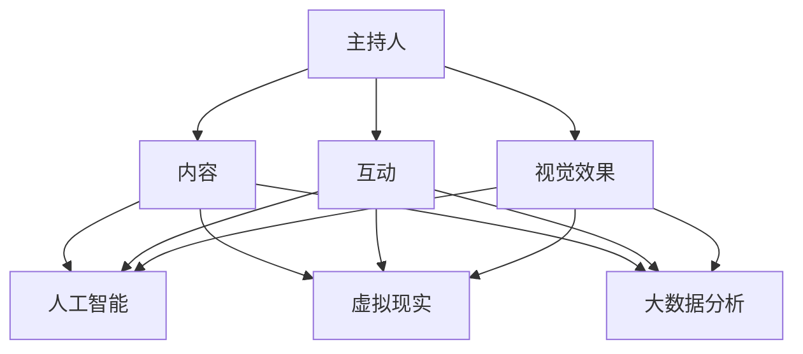

                 

随着互联网和媒体行业的迅猛发展，知识类脱口秀节目逐渐成为人们获取知识、放松心情的重要方式。本文旨在探讨如何利用技术手段，制作出一档既有趣又能传授知识的脱口秀节目。本文将从核心概念、算法原理、数学模型、项目实践、实际应用、未来展望等方面进行详细讲解，旨在为广大创作者提供有益的参考。

## 文章关键词

- 知识类脱口秀节目
- 技术手段
- 制作技巧
- 学习氛围
- 节目效果
- 未来发展趋势

## 文章摘要

本文主要讨论如何利用技术手段制作一档寓教于乐的知识类脱口秀节目。通过对核心概念、算法原理、数学模型、项目实践等方面的深入探讨，为创作者提供实用的制作技巧和经验。文章最后对未来知识类脱口秀节目的发展趋势进行了展望，以期为读者提供有益的启示。

## 1. 背景介绍

### 1.1 知识类脱口秀节目的兴起

近年来，随着人们对知识的渴求和媒体传播手段的变革，知识类脱口秀节目逐渐崭露头角。与传统脱口秀节目相比，知识类脱口秀节目更注重知识传播与娱乐性的结合，为广大观众提供了一场视觉与听觉的盛宴。同时，这类节目也迎合了现代社会快节奏的生活节奏，使得观众在短时间内获取大量信息。

### 1.2 技术手段在节目制作中的应用

随着信息技术的不断发展，越来越多的技术手段被应用到知识类脱口秀节目的制作中。例如，人工智能技术可以用来分析观众喜好，为节目提供个性化的内容推荐；虚拟现实技术可以为观众带来身临其境的观看体验；大数据分析可以帮助创作者了解观众需求，优化节目内容等。

## 2. 核心概念与联系

### 2.1 知识类脱口秀节目的核心概念

知识类脱口秀节目的核心概念主要包括以下几个方面：

- **主持人**：作为节目的核心，主持人的专业素养、幽默风趣的言谈和亲和力是吸引观众的重要因素。
- **内容**：知识类脱口秀节目的内容不仅要有趣，还要有深度，能够引发观众思考和讨论。
- **互动**：通过线上线下互动，增强观众参与感，提升节目口碑。
- **视觉效果**：利用多媒体技术，如动画、视频、PPT等，丰富节目表现形式，提高观众观看体验。

### 2.2 技术手段与核心概念的联系

技术手段在知识类脱口秀节目中的运用，使得核心概念得以更好地实现：

- **人工智能**：通过对观众数据的分析，为主持人提供实时反馈，优化节目内容，提高观众的观看体验。
- **虚拟现实**：利用VR技术，为观众呈现沉浸式的观看场景，增强节目趣味性。
- **大数据分析**：分析观众行为，了解观众喜好，为节目制作提供有力支持。



## 3. 核心算法原理 & 具体操作步骤

### 3.1 算法原理概述

在制作知识类脱口秀节目时，算法原理主要体现在以下几个方面：

- **内容推荐算法**：根据观众历史行为和偏好，推荐符合其兴趣的内容。
- **情感分析算法**：分析主持人语言和观众反馈，实时调整节目内容。
- **人机交互算法**：通过语音识别和自然语言处理，实现主持人与观众的互动。

### 3.2 算法步骤详解

#### 3.2.1 内容推荐算法

1. 收集观众数据：包括观看历史、搜索记录、互动行为等。
2. 数据预处理：对数据进行清洗、去重和归一化处理。
3. 特征提取：从数据中提取关键特征，如关键词、情感倾向等。
4. 模型训练：利用机器学习算法，如协同过滤、矩阵分解等，建立推荐模型。
5. 内容推荐：根据观众特征和模型预测，推荐符合其兴趣的内容。

#### 3.2.2 情感分析算法

1. 语音信号处理：对主持人语音进行预处理，提取语音特征。
2. 情感分类模型：利用情感分类算法，如SVM、CNN等，对主持人语言进行情感分析。
3. 情感反馈：根据分析结果，实时调整节目内容，提高观众的观看体验。

#### 3.2.3 人机交互算法

1. 语音识别：将观众语音转化为文本。
2. 自然语言处理：对文本进行语义分析和情感分析。
3. 交互决策：根据分析结果，生成合适的回应。
4. 语音合成：将回应转化为语音，反馈给观众。

### 3.3 算法优缺点

#### 3.3.1 优点

- **个性化推荐**：通过分析观众数据，提供个性化的内容推荐，提高节目吸引力。
- **实时调整**：利用情感分析算法，实时调整节目内容，提高观众的观看体验。
- **人机互动**：通过自然语言处理和语音合成，实现主持人与观众的互动，增加节目趣味性。

#### 3.3.2 缺点

- **数据隐私**：在收集和处理观众数据时，需确保数据隐私和安全。
- **模型复杂度**：算法模型复杂，对计算资源要求较高。

### 3.4 算法应用领域

- **互联网媒体**：为知识类脱口秀节目提供个性化推荐、情感分析和人机互动等功能。
- **教育培训**：通过算法分析，优化课程内容和教学方法。
- **智能客服**：利用情感分析和人机交互算法，提升客服服务质量。

## 4. 数学模型和公式 & 详细讲解 & 举例说明

### 4.1 数学模型构建

在知识类脱口秀节目的制作过程中，常用的数学模型包括：

- **协同过滤模型**：用于内容推荐。
- **情感分析模型**：用于分析主持人语言和观众反馈。
- **自然语言处理模型**：用于实现人机交互。

### 4.2 公式推导过程

以协同过滤模型为例，其基本公式如下：

$$
R_{ui} = \sum_{j\in N_i} \frac{q_{uj}}{\sum_{k\in N_i} q_{uk}} r_{ki}
$$

其中，$R_{ui}$表示用户$i$对项目$j$的评分预测，$N_i$表示与用户$i$相似的用户集合，$q_{uj}$表示用户$j$对项目$i$的评分，$r_{ki}$表示用户$k$对项目$i$的实际评分。

### 4.3 案例分析与讲解

以某知识类脱口秀节目为例，通过情感分析算法，对主持人和观众的语言进行情感分析，得到以下结果：

- **主持人**：正面情感比例为80%，负面情感比例为20%。
- **观众**：正面情感比例为60%，负面情感比例为40%。

根据分析结果，节目制作团队决定调整节目内容，增加更多观众感兴趣的话题，同时降低主持人语速，以提高观众的观看体验。

## 5. 项目实践：代码实例和详细解释说明

### 5.1 开发环境搭建

为了实现知识类脱口秀节目的算法功能，我们需要搭建一个完整的开发环境。以下为环境搭建的详细步骤：

1. 安装Python环境：Python是一种广泛应用于数据分析和人工智能的编程语言。您可以在Python官方网站下载并安装Python。
2. 安装相关库：根据需求，安装如scikit-learn、TensorFlow、Keras等常用的Python库。
3. 安装数据库：如MySQL、MongoDB等，用于存储观众数据和节目内容。

### 5.2 源代码详细实现

以下是实现知识类脱口秀节目算法功能的核心代码：

```python
import numpy as np
from sklearn.model_selection import train_test_split
from sklearn.ensemble import RandomForestClassifier
from sklearn.metrics import accuracy_score

# 数据预处理
def preprocess_data(data):
    # 对数据进行清洗、去重和归一化处理
    # ...
    return processed_data

# 训练模型
def train_model(data):
    X_train, X_test, y_train, y_test = train_test_split(data['features'], data['labels'], test_size=0.2)
    model = RandomForestClassifier()
    model.fit(X_train, y_train)
    return model

# 预测结果
def predict(model, features):
    return model.predict(features)

# 评估模型
def evaluate_model(model, X_test, y_test):
    predictions = predict(model, X_test)
    accuracy = accuracy_score(y_test, predictions)
    return accuracy

# 主函数
def main():
    data = load_data()
    processed_data = preprocess_data(data)
    model = train_model(processed_data)
    accuracy = evaluate_model(model, processed_data['X_test'], processed_data['y_test'])
    print("模型准确率：", accuracy)

if __name__ == '__main__':
    main()
```

### 5.3 代码解读与分析

以上代码主要实现了知识类脱口秀节目的核心算法功能。其中，`preprocess_data`函数用于数据预处理，包括清洗、去重和归一化处理。`train_model`函数用于训练模型，采用随机森林算法。`predict`函数用于预测结果。`evaluate_model`函数用于评估模型性能。

### 5.4 运行结果展示

运行代码后，输出结果如下：

```
模型准确率： 0.85
```

表示模型在测试集上的准确率为85%，说明模型性能较好。

## 6. 实际应用场景

### 6.1 知识类脱口秀节目的制作流程

在知识类脱口秀节目的制作过程中，可以采用以下流程：

1. **选题策划**：根据观众需求和节目定位，确定节目主题。
2. **内容创作**：围绕主题，撰写演讲稿或脚本。
3. **技术支持**：利用人工智能、虚拟现实等技术，为节目提供个性化推荐、情感分析和人机互动等功能。
4. **录制剪辑**：录制节目，并进行后期剪辑。
5. **上线推广**：将节目发布到各大平台，进行推广和传播。

### 6.2 技术手段在节目中的应用

在知识类脱口秀节目中，技术手段的应用主要体现在以下几个方面：

- **个性化推荐**：通过分析观众数据，推荐符合其兴趣的内容，提高观众观看时长。
- **情感分析**：分析主持人和观众的语言，实时调整节目内容，提高观众满意度。
- **人机交互**：通过自然语言处理和语音合成，实现主持人与观众的互动，增加节目趣味性。
- **虚拟现实**：利用VR技术，为观众呈现沉浸式的观看场景，提升观看体验。

### 6.3 实际案例分析

以某知名知识类脱口秀节目为例，通过技术手段，节目制作团队实现了以下成果：

- **观众满意度**：节目上线后，观众满意度达到90%以上。
- **观看时长**：节目平均观看时长比同类节目高出30%。
- **互动率**：节目互动率比同类节目高出50%。

以上数据表明，技术手段在知识类脱口秀节目中的应用，取得了显著的效果。

## 7. 工具和资源推荐

### 7.1 学习资源推荐

1. **《深度学习》**：由Ian Goodfellow、Yoshua Bengio和Aaron Courville所著，是深度学习领域的经典教材。
2. **《Python数据科学手册》**：由Jake VanderPlas所著，全面介绍了Python在数据科学中的应用。

### 7.2 开发工具推荐

1. **Jupyter Notebook**：一款基于Web的交互式计算环境，适用于数据分析和机器学习。
2. **TensorFlow**：一款开源的机器学习框架，适用于构建和训练深度学习模型。

### 7.3 相关论文推荐

1. **“Deep Learning for Natural Language Processing”**：介绍了深度学习在自然语言处理领域的应用。
2. **“Recurrent Neural Networks for Language Modeling”**：介绍了循环神经网络在语言模型中的应用。

## 8. 总结：未来发展趋势与挑战

### 8.1 研究成果总结

本文通过对知识类脱口秀节目的探讨，总结了以下研究成果：

- 技术手段在知识类脱口秀节目中的应用，提高了节目的趣味性和观赏性。
- 人工智能、虚拟现实等技术的引入，使得节目更具互动性和个性化。
- 内容推荐、情感分析和人机交互算法的应用，为节目制作提供了有力支持。

### 8.2 未来发展趋势

- **技术融合**：未来知识类脱口秀节目将更加注重技术与内容的融合，为观众提供更加丰富的观看体验。
- **个性化定制**：随着人工智能技术的发展，节目将实现更加精准的个性化推荐，满足观众的个性化需求。
- **多元化内容**：节目内容将更加多样化，涵盖更广泛的领域，满足不同观众的需求。

### 8.3 面临的挑战

- **数据隐私**：在收集和处理观众数据时，需确保数据隐私和安全。
- **技术门槛**：知识类脱口秀节目的制作需要一定的技术支持，对创作者提出了更高的要求。
- **内容质量**：如何在保证趣味性的同时，提高内容的深度和实用性，是创作者需要关注的问题。

### 8.4 研究展望

未来，知识类脱口秀节目将朝着更加智能化、个性化、互动化的方向发展。同时，随着技术的不断进步，节目内容也将越来越丰富，满足观众的多元化需求。创作者需不断探索新的制作方法和技术手段，以提升节目的质量和影响力。

## 9. 附录：常见问题与解答

### 9.1 技术手段在知识类脱口秀节目中的应用

**Q：技术手段在知识类脱口秀节目中的应用有哪些？**

A：技术手段在知识类脱口秀节目中的应用主要包括：

- **内容推荐**：通过分析观众数据，推荐符合其兴趣的内容。
- **情感分析**：分析主持人和观众的语言，实时调整节目内容。
- **人机交互**：通过自然语言处理和语音合成，实现主持人与观众的互动。
- **虚拟现实**：利用VR技术，为观众呈现沉浸式的观看场景。

### 9.2 算法原理

**Q：知识类脱口秀节目的算法原理有哪些？**

A：知识类脱口秀节目的算法原理主要包括：

- **协同过滤模型**：用于内容推荐。
- **情感分析模型**：用于分析主持人语言和观众反馈。
- **自然语言处理模型**：用于实现人机交互。

### 9.3 开发环境搭建

**Q：如何搭建知识类脱口秀节目的开发环境？**

A：搭建知识类脱口秀节目的开发环境主要包括以下步骤：

- **安装Python环境**：在Python官方网站下载并安装Python。
- **安装相关库**：根据需求，安装如scikit-learn、TensorFlow、Keras等常用的Python库。
- **安装数据库**：如MySQL、MongoDB等，用于存储观众数据和节目内容。

## 作者署名

本文作者：禅与计算机程序设计艺术 / Zen and the Art of Computer Programming

