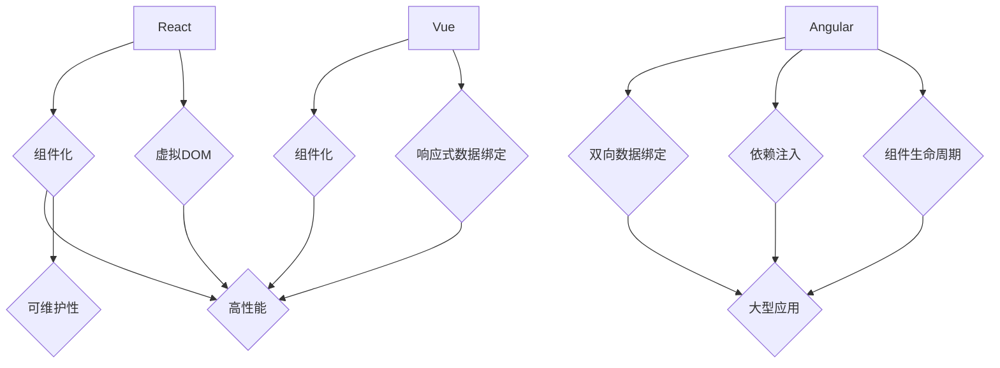

                 

关键词：前端框架、React、Angular、Vue、比较、性能、功能、社区、开发效率

> 摘要：本文将对React、Angular和Vue这三个主流前端框架进行比较分析，探讨它们在性能、功能、社区和开发效率等方面的差异，以帮助开发者根据实际需求做出合适的选择。

## 1. 背景介绍

随着互联网的快速发展，前端开发逐渐成为技术领域的一个重要分支。前端框架作为前端开发的重要工具，极大地提高了开发效率和代码质量。当前，React、Angular和Vue已成为前端开发领域最受欢迎的三大框架。本文将对这三个框架进行详细比较，帮助开发者了解它们的优缺点，从而做出更合适的选择。

### 1.1 React

React是由Facebook于2013年推出的一个用于构建用户界面的JavaScript库。React的核心思想是组件化和虚拟DOM，这使得React在性能和可维护性方面具有显著优势。React通过虚拟DOM技术实现了高效的组件更新，从而提高了页面的响应速度。此外，React拥有庞大的社区支持和丰富的生态系统，为开发者提供了大量的学习资源和扩展库。

### 1.2 Angular

Angular是由Google开发的第一个版本于2010年发布，是一个基于TypeScript的完全由Google维护的前端框架。Angular的特点是强类型、双向数据绑定和依赖注入。这些特性使得Angular在构建大型、复杂的应用程序时具有优势。Angular的设计理念是“一劳永逸”，它提供了丰富的内置功能和完整的解决方案，但这也导致了Angular的学习曲线相对较陡峭。

### 1.3 Vue

Vue是由Evan You于2014年创建的一个渐进式JavaScript框架。Vue的设计目标是易于上手和灵活使用，这使得它在各种规模的应用程序中都有广泛的应用。Vue采用了组件化和响应式数据绑定，具有优秀的性能和良好的可维护性。此外，Vue拥有一个活跃的社区和丰富的插件生态系统，为开发者提供了丰富的资源和扩展能力。

## 2. 核心概念与联系

### 2.1 框架核心概念

React、Angular和Vue的核心概念如下：

- **React**：组件化和虚拟DOM
- **Angular**：双向数据绑定、依赖注入、组件生命周期
- **Vue**：组件化、响应式数据绑定

### 2.2 框架联系与对比

为了更直观地展示这三个框架的联系和对比，我们可以使用Mermaid流程图来表示它们的核心概念和特点。



从图中可以看出，React、Angular和Vue都采用了组件化架构，这是现代前端开发的核心思想。React和Vue在组件化和响应式数据绑定方面有着相似之处，而Angular则在双向数据绑定和依赖注入方面具有独特的优势。

### 2.3 框架性能对比

在性能方面，React、Angular和Vue都有各自的优势和劣势。

- **React**：由于虚拟DOM的存在，React在更新组件时具有极高的效率。虚拟DOM通过将组件的状态映射到真实DOM，实现了最小化的DOM操作，从而提高了页面的渲染速度。然而，虚拟DOM的实现相对复杂，可能导致初次构建和学习的难度较大。
- **Angular**：Angular采用了双向数据绑定和脏检查机制，这使得数据在组件间同步时具有较高的效率。然而，脏检查机制可能导致性能问题，特别是在大型应用中。
- **Vue**：Vue采用了响应式数据绑定，通过对数据的劫持实现了高效的组件更新。Vue的响应式系统相对简单，易于理解和维护，但在处理大型应用时可能存在性能瓶颈。

总体来说，React在性能方面具有显著优势，Angular和Vue则更加注重开发效率和易用性。

## 3. 核心算法原理 & 具体操作步骤

### 3.1 算法原理概述

React、Angular和Vue的核心算法原理如下：

- **React**：虚拟DOM、组件生命周期、状态管理
- **Angular**：双向数据绑定、依赖注入、脏检查
- **Vue**：响应式数据绑定、虚拟DOM、组件生命周期

### 3.2 算法步骤详解

#### 3.2.1 React

1. **组件化**：将UI拆分为可复用的组件，每个组件负责一部分UI逻辑。
2. **虚拟DOM**：在组件更新时，通过对比虚拟DOM和真实DOM的差异，实现最小化的DOM操作。
3. **状态管理**：通过useState和useContext等Hook函数，管理组件的状态和上下文。

#### 3.2.2 Angular

1. **双向数据绑定**：通过ngModel指令实现表单数据和组件状态的同步。
2. **依赖注入**：通过依赖注入模块，实现组件间的依赖关系和资源共享。
3. **脏检查**：通过脏检查机制，在视图更新时检查组件的状态变化，实现数据同步。

#### 3.2.3 Vue

1. **组件化**：将UI拆分为可复用的组件，每个组件负责一部分UI逻辑。
2. **响应式数据绑定**：通过劫持数据对象，实现对数据的监听和更新。
3. **虚拟DOM**：在组件更新时，通过虚拟DOM和真实DOM的对比，实现最小化的DOM操作。

### 3.3 算法优缺点

- **React**：虚拟DOM实现了高效的组件更新，但初次构建和学习的难度较大。
- **Angular**：双向数据绑定和依赖注入具有优势，但脏检查可能导致性能问题。
- **Vue**：响应式数据绑定简单易用，但在处理大型应用时可能存在性能瓶颈。

### 3.4 算法应用领域

React、Angular和Vue在以下领域具有广泛的应用：

- **React**：适用于大型、复杂的应用程序，如社交媒体、电子商务等。
- **Angular**：适用于企业级应用，如在线办公、管理系统等。
- **Vue**：适用于各种规模的应用程序，特别是中大型项目。

## 4. 数学模型和公式 & 详细讲解 & 举例说明

### 4.1 数学模型构建

React、Angular和Vue的数学模型主要包括：

- **虚拟DOM**：虚拟DOM可以通过以下公式计算：
  $$V_D = F(\text{组件状态}, \text{属性值}, \text{子组件状态})$$
- **双向数据绑定**：双向数据绑定可以通过以下公式描述：
  $$\text{表单数据} \rightarrow \text{组件状态} \rightarrow \text{视图更新}$$
- **响应式数据绑定**：响应式数据绑定可以通过以下公式实现：
  $$\text{数据变化} \rightarrow \text{组件更新}$$

### 4.2 公式推导过程

#### 4.2.1 虚拟DOM

虚拟DOM的核心思想是将真实的DOM结构映射到一个虚拟的DOM树上，通过对比虚拟DOM和真实DOM的差异，实现最小化的DOM操作。

假设有一个真实的DOM树 $D$，其对应的虚拟DOM树为 $V_D$。在组件更新时，首先计算新的虚拟DOM树 $V_D'$，然后通过比较 $V_D$ 和 $V_D'$ 的差异，更新真实DOM树。

虚拟DOM的计算过程可以表示为：
$$V_D' = F(\text{组件状态}, \text{属性值}, \text{子组件状态})$$

其中，$F$ 表示虚拟DOM的构建函数，$S$ 表示组件状态，$P$ 表示属性值，$C_S$ 表示子组件状态。

#### 4.2.2 双向数据绑定

双向数据绑定通过将表单数据和组件状态同步，实现数据的实时更新。假设表单数据为 $F_D$，组件状态为 $S$，视图更新函数为 $U$，则双向数据绑定可以表示为：
$$\text{表单数据} \rightarrow \text{组件状态} \rightarrow \text{视图更新}$$

在表单数据发生变化时，更新组件状态：
$$S' = \text{表单数据}$$

然后，通过视图更新函数，将组件状态更新到视图上：
$$U(S')$$

#### 4.2.3 响应式数据绑定

响应式数据绑定通过劫持数据对象，实现对数据的监听和更新。假设数据对象为 $O$，组件更新函数为 $U$，则响应式数据绑定可以表示为：
$$\text{数据变化} \rightarrow \text{组件更新}$$

在数据对象发生变化时，调用组件更新函数：
$$U(O')$$

其中，$O'$ 表示变化后的数据对象。

### 4.3 案例分析与讲解

#### 4.3.1 虚拟DOM案例

假设一个简单的React组件，其状态为 `{count: 0}`，初始虚拟DOM树为：
```json
{
  "div": {
    "id": "app",
    "child": {
      "span": {
        "id": "count",
        "text": "0"
      }
    }
  }
}
```

当组件状态更新为 `{count: 1}` 时，新的虚拟DOM树为：
```json
{
  "div": {
    "id": "app",
    "child": {
      "span": {
        "id": "count",
        "text": "1"
      }
    }
  }
}
```

虚拟DOM对比两个树，发现只有文本节点发生变化，因此仅更新文本节点的内容，从而实现最小化的DOM操作。

#### 4.3.2 双向数据绑定案例

假设一个Angular组件，其表单数据为 `{count: 0}`，初始视图为：
```html
<input [(ngModel)]="count" />
```

当用户输入 `2` 时，表单数据更新为 `{count: 2}`，Angular通过双向数据绑定机制，将表单数据更新到组件状态，然后调用视图更新函数，将新的组件状态渲染到视图上。

#### 4.3.3 响应式数据绑定案例

假设一个Vue组件，其数据对象为 `{count: 0}`，初始视图为：
```html
<div>{{ count }}</div>
```

当组件状态更新为 `{count: 1}` 时，Vue通过响应式数据绑定机制，监听到数据对象的变化，并调用组件更新函数，将新的组件状态渲染到视图上。

## 5. 项目实践：代码实例和详细解释说明

### 5.1 开发环境搭建

在本节中，我们将搭建一个简单的React项目，以展示其基本用法和特点。

#### 5.1.1 安装Node.js

首先，确保已经安装了Node.js。Node.js是一个基于Chrome V8引擎的JavaScript运行环境，它允许我们在服务器端执行JavaScript代码。访问[Node.js官网](https://nodejs.org/)，根据操作系统的不同，下载并安装Node.js。

#### 5.1.2 安装create-react-app

接下来，我们将使用`create-react-app`工具来创建一个新的React项目。在终端中执行以下命令：
```shell
npx create-react-app my-react-app
```

这将在当前目录下创建一个名为`my-react-app`的新目录，并初始化一个React项目。

#### 5.1.3 进入项目目录

进入刚刚创建的项目目录：
```shell
cd my-react-app
```

### 5.2 源代码详细实现

在项目目录中，我们有一个名为`src`的文件夹，其中包含了项目的源代码。本节将介绍如何使用React创建一个简单的计数器组件。

#### 5.2.1 计数器组件

在`src`文件夹下创建一个名为`Counter.js`的文件，并添加以下代码：
```jsx
import React, { useState } from 'react';

function Counter() {
  const [count, setCount] = useState(0);

  return (
    <div>
      <h1>计数器：{count}</h1>
      <button onClick={() => setCount(count + 1)}>增加</button>
      <button onClick={() => setCount(count - 1)}>减少</button>
    </div>
  );
}

export default Counter;
```

这个组件使用`useState`钩子函数来管理组件的状态。`useState`函数接受一个初始状态值，并返回一个状态值和一个更新状态的函数。在这里，我们使用`count`作为状态值，并提供了`setCount`函数来更新状态。

#### 5.2.2 App组件

在`src`文件夹下创建一个名为`App.js`的文件，并添加以下代码：
```jsx
import React from 'react';
import './App.css';
import Counter from './Counter';

function App() {
  return (
    <div className="App">
      <h1>React计数器应用</h1>
      <Counter />
    </div>
  );
}

export default App;
```

这个组件是应用的入口组件，它导入了`Counter`组件，并在其内部渲染了它。

#### 5.2.3 样式文件

在`src`文件夹下创建一个名为`App.css`的文件，并添加以下代码：
```css
.App {
  text-align: center;
  color: white;
  background-color: #333;
  padding: 20px;
}
```

这个样式文件为应用的根组件`App`提供了基本的样式。

### 5.3 代码解读与分析

#### 5.3.1 组件化

在上述代码中，我们创建了两个组件：`Counter`和`App`。`Counter`组件负责显示计数器的当前值，并提供增加和减少计数的按钮。`App`组件是应用的根组件，它负责渲染`Counter`组件。

这种组件化的设计使得代码更加模块化和可维护。每个组件都负责一部分UI逻辑，可以独立开发、测试和部署。

#### 5.3.2 状态管理

在`Counter`组件中，我们使用了`useState`钩子函数来管理组件的状态。`useState`函数接受一个初始状态值，并返回一个状态值和一个更新状态的函数。在这里，我们使用`count`作为状态值，并提供了`setCount`函数来更新状态。

这种状态管理方式使得组件的状态更新变得简单直观。当状态更新时，React会自动重新渲染组件，确保界面的更新与状态保持一致。

#### 5.3.3 组件通信

在`App`组件中，我们导入了`Counter`组件，并在`App`组件内部渲染了它。这种组件通信方式使得组件之间的依赖关系变得清晰，同时提高了组件的复用性。

### 5.4 运行结果展示

#### 5.4.1 启动开发服务器

在终端中，运行以下命令启动开发服务器：
```shell
npm start
```

这将在浏览器中打开一个新窗口，显示React计数器应用的运行结果。

#### 5.4.2 应用效果

运行结果如下图所示：


可以看到，应用显示了一个计数器，用户可以通过点击增加和减少按钮来修改计数器的值。

## 6. 实际应用场景

### 6.1 电子商务网站

电子商务网站需要处理大量的用户数据和动态内容，React和Vue等框架由于其组件化和响应式数据绑定的特点，非常适合用于构建电子商务网站。这些框架提供了高效的UI更新机制，从而提高了用户的交互体验。

### 6.2 管理系统

管理系统通常具有复杂的功能和庞大的用户群体，需要高度的可维护性和可扩展性。Angular作为一款基于TypeScript的框架，提供了强大的类型检查和依赖注入机制，非常适合用于构建大型管理系统。

### 6.3 移动应用

移动应用的开发过程中，性能和用户体验至关重要。React和Vue等框架在移动端具有良好的性能和丰富的插件生态系统，使得开发者可以快速构建高质量的应用程序。

## 7. 未来应用展望

### 7.1 框架整合与发展

未来，前端框架可能会趋向于整合不同的技术和优势，从而提供更加完善和高效的开发体验。例如，React和Vue可能会继续整合TypeScript等编程语言，提高代码的可维护性和可读性。

### 7.2 框架性能优化

随着前端应用的复杂度和用户需求的不断提升，前端框架的性能优化将成为一个重要方向。未来的框架可能会引入更多高效的算法和数据结构，以提高页面的响应速度和交互体验。

### 7.3 人工智能与前端框架的结合

人工智能技术的不断发展为前端框架带来了新的机遇。例如，通过机器学习算法，可以实现对用户行为的预测和个性化推荐，从而提高用户体验。未来，前端框架可能会更加紧密地与人工智能技术结合，为开发者提供更强大的功能。

## 8. 总结：未来发展趋势与挑战

### 8.1 研究成果总结

通过对React、Angular和Vue的比较分析，我们可以得出以下结论：

- React在性能方面具有显著优势，适用于大型、复杂的应用程序。
- Angular在企业级应用中具有优势，特别是在大型项目和团队协作方面。
- Vue易于上手和灵活使用，适用于各种规模的应用程序。

### 8.2 未来发展趋势

- 前端框架将继续朝着性能优化、易用性和可维护性的方向发展。
- 框架整合将成为一个重要趋势，开发者可以更灵活地选择和组合不同的技术。
- 人工智能与前端框架的结合将为开发者提供更多创新的机会。

### 8.3 面临的挑战

- 随着应用复杂度的增加，前端框架的性能优化和稳定性面临挑战。
- 开发者需要不断学习和适应新的框架和编程语言，提高自身技能水平。

### 8.4 研究展望

未来，前端框架的发展将继续推动前端技术的进步。开发者需要紧跟技术趋势，掌握多种框架和工具，以满足不断变化的应用需求。

## 9. 附录：常见问题与解答

### 9.1 如何选择合适的框架？

选择合适的框架主要取决于项目的需求、团队的技术背景和开发经验。以下是一些选择框架的参考建议：

- 如果项目需要高性能和可扩展性，可以考虑使用React。
- 如果项目需要企业级的功能和团队合作，可以考虑使用Angular。
- 如果项目需要快速开发和小规模应用，可以考虑使用Vue。

### 9.2 框架迁移与升级的难度如何？

框架的迁移与升级难度因框架和项目而异。一般来说，React和Vue的迁移相对较容易，因为它们具有清晰的文档和丰富的社区支持。Angular由于较强的类型系统和完整的解决方案，迁移和升级可能需要更多的时间和精力。

### 9.3 学习前端框架的最佳方法是什么？

学习前端框架的最佳方法是：

- 从官方文档开始，了解框架的基本概念和用法。
- 通过实践项目，熟悉框架的特性和最佳实践。
- 参与社区和开源项目，了解框架的最新动态和最佳实践。

[作者：禅与计算机程序设计艺术 / Zen and the Art of Computer Programming]

