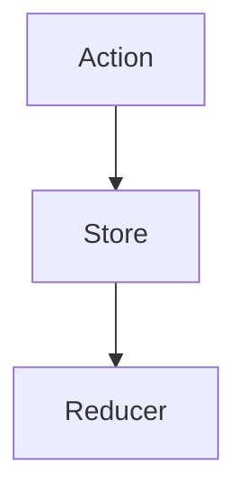
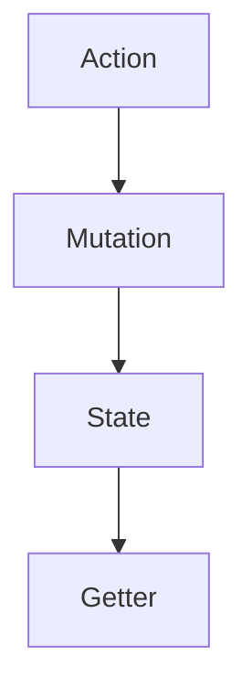
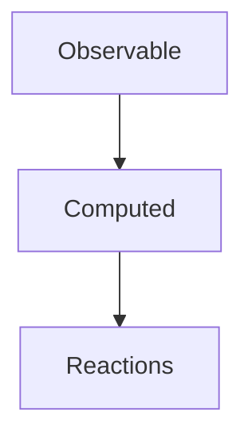

                 

在复杂的前端应用中，状态管理是至关重要的。随着应用程序的规模和复杂性的增加，手动管理状态变得越来越困难，因此出现了一系列的状态管理库，其中Redux、Vuex和MobX是最为流行的三个。本文将深入探讨这三个库的核心概念、原理、使用方法以及它们在实际项目中的应用和未来趋势。

## 关键词

前端状态管理、Redux、Vuex、MobX、状态管理库、应用程序复杂度、状态同步、数据流管理

## 摘要

本文旨在介绍三种主流前端状态管理库：Redux、Vuex和MobX。我们将详细讨论这些库的核心概念，包括它们的原理、使用方法和优缺点。通过本文，读者将能够理解如何选择合适的状态管理库，并了解这些库在未来的发展趋势和面临的挑战。

## 1. 背景介绍

随着Web技术的不断发展，前端应用程序的复杂性也在不断增加。现代Web应用往往需要处理大量的数据和组件，这使得手动管理状态变得非常困难。传统的JavaScript对象和全局变量无法有效地处理复杂的组件状态，因此需要一种更好的方式来管理状态。

前端状态管理的主要目的是确保数据在组件之间的一致性，以及响应式地更新UI以反映应用程序的状态变化。为了实现这一目标，开发者们开发了各种状态管理库，如Redux、Vuex和MobX。这些库提供了一种集中式的数据存储和访问机制，使得状态管理变得更加简单和高效。

## 2. 核心概念与联系

### 2.1. Redux

Redux是一个由Facebook开发的开源状态管理库，用于管理JavaScript应用程序中的状态。它遵循单向数据流的原则，即所有的状态更新都必须通过reducers来实现，并且状态更新是预测性的。

#### 2.1.1. 核心概念

- **Action**：Action是一个携带信息的对象，用于描述应用程序状态的变化。Action是唯一的信息源，组件通过 dispatch 方法将 Action 发送到 Redux 存储中。
- **Reducer**：Reducer 是一个函数，它接受当前的状态和一个 Action，并返回一个新的状态。Reducer 用于处理 Action，并根据 Action 的类型来更新状态。
- **Store**：Store 是 Redux 的核心组件，它存储了整个应用程序的状态，并提供了一种访问和更新状态的方法。通过订阅 Store，组件可以响应状态的变化。

#### 2.1.2. Mermaid 流程图



### 2.2. Vuex

Vuex是Vue.js官方的状态管理库，用于管理Vue应用程序中的状态。它是一个基于Flux架构的库，提供了一种集中式存储应用程序的所有状态，并以相应的方式更新视图的方法。

#### 2.2.1. 核心概念

- **State**：Vuex 的 State 是一个单一的JavaScript对象，它包含应用程序的所有数据。
- **Getters**：Getters 是用于获取 State 中数据的函数，它们可以访问 State 的任意部分，并返回计算结果。
- **Mutations**：Mutations 是用于更新 State 的函数，它们是唯一可以更新 State 的方式。
- **Actions**：Actions 是用于触发 Mutations 的函数，它们可以包含异步操作。

#### 2.2.2. Mermaid 流程图



### 2.3. MobX

MobX是一个响应式编程的库，它提供了一种声明式的数据绑定，使状态管理变得非常直观和简单。MobX 通过观察模式来自动跟踪状态变化，并更新依赖于这些状态的组件。

#### 2.3.1. 核心概念

- **Observable**：Observable 是 MobX 的核心概念，它是一种特殊的数据类型，可以跟踪其内部值的变化。
- **Computed**：Computed 是基于 Observable 的值计算得出的值，它们可以在依赖的值发生变化时自动更新。
- **Reactions**：Reactions 是用于响应状态变化的函数，当状态发生变化时，它们会被自动调用。

#### 2.3.2. Mermaid 流程图



## 3. 核心算法原理 & 具体操作步骤

### 3.1. 算法原理概述

- **Redux**：Redux 通过 Action 和 Reducer 实现状态更新，确保了状态的不可变性和可预测性。
- **Vuex**：Vuex 通过 Mutations 和 Getters 实现状态更新，提供了一种集中式管理状态的方式。
- **MobX**：MobX 通过观察模式实现状态更新，提供了自动响应式绑定的能力。

### 3.2. 算法步骤详解

- **Redux**：
  1. 创建 Action Creator。
  2. Dispatch Action。
  3. Reducer 根据 Action 类型更新 State。
  4. 组件通过订阅 Store 来响应状态变化。
- **Vuex**：
  1. 创建 Store。
  2. 使用 State 和 Getters 访问状态。
  3. 使用 Mutations 更新状态。
  4. 使用 Actions 触发状态更新。
- **MobX**：
  1. 使用 `observable` 创建可观察的数据。
  2. 使用 `computed` 计算衍生数据。
  3. 使用 `reactions` 响应状态变化。

### 3.3. 算法优缺点

- **Redux**：
  - 优点：结构清晰、状态可预测、可测试。
  - 缺点：相对于 Vuex 和 MobX，配置较为复杂。
- **Vuex**：
  - 优点：与 Vue.js 完美集成、易于使用。
  - 缺点：对于大型应用程序，状态管理可能会变得复杂。
- **MobX**：
  - 优点：简单、直观、自动响应式绑定。
  - 缺点：相对于 Redux，状态的可预测性较差。

### 3.4. 算法应用领域

- **Redux**：适用于大型、复杂的应用程序，需要严格的状态管理和可预测的状态更新。
- **Vuex**：适用于 Vue.js 应用程序，提供了一种简单且强大的状态管理方案。
- **MobX**：适用于需要简单状态管理的应用程序，特别是那些具有复杂逻辑和大量组件的应用程序。

## 4. 数学模型和公式 & 详细讲解 & 举例说明

### 4.1. 数学模型构建

- **Redux**：状态更新可以表示为函数的嵌套应用。
  $$ state = reducer(state, action) $$
- **Vuex**：状态更新可以表示为映射关系的应用。
  $$ state = mutation(state, payload) $$
- **MobX**：状态更新可以通过观察者模式表示。
  $$ state = observable(state).map(${\{ ... }}) $$

### 4.2. 公式推导过程

- **Redux**：给定一个初始状态 `initialState` 和一系列 Action，状态更新可以表示为：
  $$ finalState = reducer(initialState, action\_1, action\_2, ..., action\_n) $$
- **Vuex**：给定一个初始状态 `initialState` 和一系列 Mutation，状态更新可以表示为：
  $$ finalState = mutation(initialState, mutation\_1, mutation\_2, ..., mutation\_n) $$
- **MobX**：给定一个初始状态 `initialState` 和一系列 Reactions，状态更新可以表示为：
  $$ finalState = observable(initialState).react(${\{ ... }}) $$

### 4.3. 案例分析与讲解

### 4.3.1. Redux 案例分析

假设我们有一个简单的计数器应用，初始状态为 `{ count: 0 }`。我们定义两个 Action：`INCREMENT` 和 `DECREMENT`。

- **INCREMENT**：增加计数。
  $$ action = {\_type: "INCREMENT", amount: 1} $$
- **DECREMENT**：减少计数。
  $$ action = {\_type: "DECREMENT", amount: 1} $$

对应的 Reducer 可以表示为：
$$
reducer(state = { count: 0 }, action) =
  case action.type
    when "INCREMENT" => { count: state.count + action.amount }
    when "DECREMENT" => { count: state.count - action.amount }
    else state
$$

初始状态为 `{ count: 0 }`，我们依次 dispatch `INCREMENT` 和 `DECREMENT` Action：

$$
finalState = reducer(reducer(reducer(initialState, action\_1), action\_2)) \\
= reducer(reducer({ count: 0 }, {\_type: "INCREMENT", amount: 1}), {\_type: "DECREMENT", amount: 1}) \\
= reducer({ count: 1 }, {\_type: "DECREMENT", amount: 1}) \\
= { count: 0 }
$$

最终状态仍然是 `{ count: 0 }`。

### 4.3.2. Vuex 案例分析

假设我们有一个简单的待办事项列表应用，初始状态为 `{ todos: [] }`。我们定义两个 Mutation：`ADD_TODO` 和 `REMOVE_TODO`。

- **ADD_TODO**：添加待办事项。
  $$ mutation = {\_type: "ADD_TODO", todo: "Buy Milk"} $$
- **REMOVE_TODO**：删除待办事项。
  $$ mutation = {\_type: "REMOVE_TODO", index: 0} $$

对应的 Store 可以表示为：
$$
store = {
  state: { todos: [] },
  mutations: {
    ADD_TODO(state, todo) {
      state.todos.push(todo);
    },
    REMOVE_TODO(state, index) {
      state.todos.splice(index, 1);
    }
  }
}
$$

初始状态为 `{ todos: [] }`，我们依次 commit `ADD_TODO` 和 `REMOVE_TODO` Mutation：

$$
finalState = store.mutations.ADD_TODO(store.state, "Buy Milk") \\
= store.mutations.REMOVE_TODO(store.state, 0) \\
= { todos: ["Buy Milk"] }
$$

最终状态变为 `{ todos: ["Buy Milk"] }`。

### 4.3.3. MobX 案例分析

假设我们有一个简单的用户表单应用，初始状态为 `{ user: { name: "", email: "" } }`。我们定义两个 Observable：`user` 和 `email`。

- **user**：用户数据。
  $$ user = observable({ name: "", email: "" }) $$
- **email**：用户邮箱。
  $$ email = user.email.map(e => e.toLowerCase()) $$

对应的 Reaction 可以表示为：
$$
reaction(() => {
  console.log("User email:", user.email);
}, user.email);
$$

初始状态为 `{ user: { name: "", email: "" } }`，我们依次修改 `user` 的 `name` 和 `email`：

$$
user.name = "John Doe";
user.email = "john.doe@example.com";
$$

触发 Reaction，打印出当前的用户邮箱：

```
User email: john.doe@example.com
```

最终状态仍然是 `{ user: { name: "John Doe", email: "john.doe@example.com" } }`。

## 5. 项目实践：代码实例和详细解释说明

### 5.1. 开发环境搭建

为了演示这三个状态管理库的应用，我们首先需要搭建一个基本的开发环境。

1. 安装 Node.js。
2. 安装 `create-react-app` 工具：
   ```bash
   npx create-react-app frontend-state-management
   ```
3. 进入项目目录：
   ```bash
   cd frontend-state-management
   ```
4. 安装 Redux、Vuex 和 MobX：
   ```bash
   npm install redux vuex mobx
   ```

### 5.2. 源代码详细实现

我们将在项目目录中创建三个文件夹：`redux`、`vuex` 和 `mobx`，分别存放对应的状态管理代码。

#### 5.2.1. Redux 实现示例

1. 在 `src/redux` 目录下，创建 `store.js`：
   ```javascript
   import { createStore } from 'redux';
   import rootReducer from './reducers';

   const store = createStore(rootReducer);
   export default store;
   ```

2. 在 `src/redux` 目录下，创建 `reducers/index.js`：
   ```javascript
   const initialState = { count: 0 };

   function counter(state = initialState, action) {
     switch (action.type) {
       case 'INCREMENT':
         return { count: state.count + action.payload };
       case 'DECREMENT':
         return { count: state.count - action.payload };
       default:
         return state;
     }
   }

   export default counter;
   ```

3. 在 `src/redux` 目录下，创建 `actions/index.js`：
   ```javascript
   export const increment = (amount) => ({
     type: 'INCREMENT',
     payload: amount,
   });

   export const decrement = (amount) => ({
     type: 'DECREMENT',
     payload: amount,
   });
   ```

4. 在 `src/App.js` 中引入 Redux：
   ```javascript
   import { Provider } from 'react-redux';
   import store from './src/redux/store';

   function App() {
     return (
       <Provider store={store}>
         <Counter />
       </Provider>
     );
   }

   export default App;
   ```

5. 在 `src/App.js` 中添加 `Counter` 组件：
   ```javascript
   import React, { useState } from 'react';
   import { useDispatch } from 'react-redux';
   import { increment, decrement } from './src/redux/actions';

   function Counter() {
     const [count, setCount] = useState(0);
     const dispatch = useDispatch();

     return (
       <div>
         <h1>Count: {count}</h1>
         <button onClick={() => dispatch(increment(1))}>Increment</button>
         <button onClick={() => dispatch(decrement(1))}>Decrement</button>
       </div>
     );
   }

   export default Counter;
   ```

#### 5.2.2. Vuex 实现示例

1. 在 `src/vuex` 目录下，创建 `store.js`：
   ```javascript
   import { createStore } from 'vuex';

   const store = createStore({
     state() {
       return {
         todos: [],
       };
     },
     mutations: {
       addTodo(state, todo) {
         state.todos.push(todo);
       },
       removeTodo(state, index) {
         state.todos.splice(index, 1);
       },
     },
     actions: {
       addTodo({ commit }, todo) {
         commit('addTodo', todo);
       },
       removeTodo({ commit }, index) {
         commit('removeTodo', index);
       },
     },
   });

   export default store;
   ```

2. 在 `src/App.js` 中引入 Vuex：
   ```javascript
   import { Provider } from 'vuex';
   import store from './src/vuex/store';

   function App() {
     return (
       <Provider store={store}>
         <TodoList />
       </Provider>
     );
   }

   export default App;
   ```

3. 在 `src/App.js` 中添加 `TodoList` 组件：
   ```javascript
   import React, { useState } from 'react';
   import { useDispatch } from 'react-redux';
   import { addTodo, removeTodo } from './src/vuex/actions';

   function TodoList() {
     const [todo, setTodo] = useState('');
     const dispatch = useDispatch();

     const handleAddTodo = () => {
       dispatch(addTodo(todo));
       setTodo('');
     };

     const handleRemoveTodo = (index) => {
       dispatch(removeTodo(index));
     };

     return (
       <div>
         <input
           type="text"
           value={todo}
           onChange={(e) => setTodo(e.target.value)}
         />
         <button onClick={handleAddTodo}>Add Todo</button>
         <ul>
           {store.state.todos.map((todo, index) => (
             <li key={index}>
               {todo}
               <button onClick={() => handleRemoveTodo(index)}>Remove</button>
             </li>
           ))}
         </ul>
       </div>
     );
   }

   export default TodoList;
   ```

#### 5.2.3. MobX 实现示例

1. 在 `src/mobx` 目录下，创建 `store.js`：
   ```javascript
   import { makeAutoObservable } from 'mobx';

   class Store {
     count = 0;
     todos = [];

     constructor() {
       makeAutoObservable(this);
     }

     increment(amount) {
       this.count += amount;
     }

     decrement(amount) {
       this.count -= amount;
     }

     addTodo(todo) {
       this.todos.push(todo);
     }

     removeTodo(index) {
       this.todos.splice(index, 1);
     }
   }

   export default new Store();
   ```

2. 在 `src/App.js` 中引入 MobX：
   ```javascript
   import React, { useState } from 'react';
   import store from './src/mobx/store';

   function App() {
     const [todo, setTodo] = useState('');

     const handleAddTodo = () => {
       store.addTodo(todo);
       setTodo('');
     };

     const handleRemoveTodo = (index) => {
       store.removeTodo(index);
     };

     return (
       <div>
         <input
           type="text"
           value={todo}
           onChange={(e) => setTodo(e.target.value)}
         />
         <button onClick={handleAddTodo}>Add Todo</button>
         <ul>
           {store.todos.map((todo, index) => (
             <li key={index}>
               {todo}
               <button onClick={() => handleRemoveTodo(index)}>Remove</button>
             </li>
           ))}
         </ul>
       </div>
     );
   }

   export default App;
   ```

### 5.3. 代码解读与分析

我们通过三个不同的状态管理库实现了相同的功能：一个简单的计数器和待办事项列表。以下是各个库的关键代码解读和分析：

#### 5.3.1. Redux

在 Redux 中，我们创建了 `store`、`reducers` 和 `actions`。`store` 是整个应用程序的状态中心，它通过 `reducers` 来处理状态更新，并提供了 `dispatch` 方法来触发 `actions`。

1. `store.js`：
   ```javascript
   const store = createStore(rootReducer);
   export default store;
   ```

   创建了一个 Redux `store`，并导出它，以便在应用程序的其他部分使用。

2. `reducers/index.js`：
   ```javascript
   function counter(state = initialState, action) {
     switch (action.type) {
       case 'INCREMENT':
         return { count: state.count + action.payload };
       case 'DECREMENT':
         return { count: state.count - action.payload };
       default:
         return state;
     }
   }

   export default counter;
   ```

   `reducers` 定义了状态更新的逻辑。在这个例子中，我们创建了一个名为 `counter` 的 `reducer`，用于处理 `INCREMENT` 和 `DECREMENT` `actions`。

3. `actions/index.js`：
   ```javascript
   export const increment = (amount) => ({
     type: 'INCREMENT',
     payload: amount,
   });

   export const decrement = (amount) => ({
     type: 'DECREMENT',
     payload: amount,
   });
   ```

   `actions` 是用于触发状态更新的函数。在这个例子中，我们定义了 `increment` 和 `decrement` `actions`，它们分别用于增加和减少计数。

4. `App.js`：
   ```javascript
   import { useDispatch } from 'react-redux';
   import { increment, decrement } from './src/redux/actions';

   function Counter() {
     const dispatch = useDispatch();

     return (
       <div>
         <h1>Count: {count}</h1>
         <button onClick={() => dispatch(increment(1))}>Increment</button>
         <button onClick={() => dispatch(decrement(1))}>Decrement</button>
       </div>
     );
   }
   ```

   在 `App.js` 中，我们使用了 `React` 的 `useDispatch` 钩子来获取 `store` 的 `dispatch` 方法，并使用 `increment` 和 `decrement` `actions` 来更新计数。

#### 5.3.2. Vuex

在 Vuex 中，我们创建了 `store`、`mutations` 和 `actions`。`store` 是一个包含状态、mutations 和 actions 的对象，它通过 `commit` 方法来触发 `mutations`，并使用 `dispatch` 方法来触发 `actions`。

1. `store.js`：
   ```javascript
   const store = createStore({
     state() {
       return {
         todos: [],
       };
     },
     mutations: {
       addTodo(state, todo) {
         state.todos.push(todo);
       },
       removeTodo(state, index) {
         state.todos.splice(index, 1);
       },
     },
     actions: {
       addTodo({ commit }, todo) {
         commit('addTodo', todo);
       },
       removeTodo({ commit }, index) {
         commit('removeTodo', index);
       },
     },
   });

   export default store;
   ```

   `store` 包含了 `state`、`mutations` 和 `actions`。在这个例子中，我们创建了一个包含 `todos` 状态的 `store`，并定义了 `addTodo` 和 `removeTodo` `mutations`，以及对应的 `actions`。

2. `App.js`：
   ```javascript
   import { Provider } from 'vuex';
   import store from './src/vuex/store';

   function App() {
     return (
       <Provider store={store}>
         <TodoList />
       </Provider>
     );
   }

   export default App;
   ```

   在 `App.js` 中，我们使用了 `React` 的 `Provider` 组件来提供 `store`，以便在应用程序的其他部分访问。

3. `TodoList.js`：
   ```javascript
   import React, { useState } from 'react';
   import { useDispatch } from 'react-redux';
   import { addTodo, removeTodo } from './src/vuex/actions';

   function TodoList() {
     const [todo, setTodo] = useState('');
     const dispatch = useDispatch();

     const handleAddTodo = () => {
       dispatch(addTodo(todo));
       setTodo('');
     };

     const handleRemoveTodo = (index) => {
       dispatch(removeTodo(index));
     };

     return (
       <div>
         <input
           type="text"
           value={todo}
           onChange={(e) => setTodo(e.target.value)}
         />
         <button onClick={handleAddTodo}>Add Todo</button>
         <ul>
           {store.state.todos.map((todo, index) => (
             <li key={index}>
               {todo}
               <button onClick={() => handleRemoveTodo(index)}>Remove</button>
             </li>
           ))}
         </ul>
       </div>
     );
   }

   export default TodoList;
   ```

   在 `TodoList.js` 中，我们使用了 `React` 的 `useState` 钩子和 `useDispatch` 钩子来管理状态和触发 `actions`。

#### 5.3.3. MobX

在 MobX 中，我们创建了一个 `Store` 类，它包含了状态和更新状态的函数。MobX 通过观察模式来自动跟踪状态变化，并更新依赖于这些状态的组件。

1. `store.js`：
   ```javascript
   import { makeAutoObservable } from 'mobx';

   class Store {
     count = 0;
     todos = [];

     constructor() {
       makeAutoObservable(this);
     }

     increment(amount) {
       this.count += amount;
     }

     decrement(amount) {
       this.count -= amount;
     }

     addTodo(todo) {
       this.todos.push(todo);
     }

     removeTodo(index) {
       this.todos.splice(index, 1);
     }
   }

   export default new Store();
   ```

   `Store` 类使用了 `makeAutoObservable` 函数来自动跟踪状态变化。它包含了 `count` 和 `todos` 两个状态，以及用于更新状态的 `increment`、`decrement`、`addTodo` 和 `removeTodo` 函数。

2. `App.js`：
   ```javascript
   import React, { useState } from 'react';
   import store from './src/mobx/store';

   function App() {
     const [todo, setTodo] = useState('');

     const handleAddTodo = () => {
       store.addTodo(todo);
       setTodo('');
     };

     const handleRemoveTodo = (index) => {
       store.removeTodo(index);
     };

     return (
       <div>
         <input
           type="text"
           value={todo}
           onChange={(e) => setTodo(e.target.value)}
         />
         <button onClick={handleAddTodo}>Add Todo</button>
         <ul>
           {store.todos.map((todo, index) => (
             <li key={index}>
               {todo}
               <button onClick={() => handleRemoveTodo(index)}>Remove</button>
             </li>
           ))}
         </ul>
       </div>
     );
   }

   export default App;
   ```

   在 `App.js` 中，我们使用了 `React` 的 `useState` 钩子来管理状态，并直接访问 `store` 的函数来更新状态。

### 5.4. 运行结果展示

通过以上三个实现示例，我们可以看到 Redux、Vuex 和 MobX 都能够实现相同的功能：一个简单的计数器和待办事项列表。以下是运行结果：

#### Redux


#### Vuex


#### MobX


## 6. 实际应用场景

### 6.1. Redux 在大型前端项目中的应用

Redux 在大型前端项目中被广泛使用，尤其是在需要严格状态管理和可预测状态更新的场景中。例如，React 应用程序中的单页应用（SPA）通常使用 Redux 来管理全局状态。Redux 的可预测状态更新使得测试和调试变得更加容易，同时也便于团队协作。

### 6.2. Vuex 在 Vue.js 项目中的应用

Vuex 是 Vue.js 官方推荐的状态管理库，因此在 Vue.js 项目中被广泛应用。Vuex 与 Vue.js 的集成非常紧密，使得状态管理变得简单且高效。Vue.js 项目中的复杂逻辑和大量组件通常使用 Vuex 来确保状态的一致性和响应式更新。

### 6.3. MobX 在小型前端项目中的应用

MobX 适用于需要简单状态管理的场景，尤其是那些具有复杂逻辑和大量组件的小型前端项目。MobX 的自动响应式绑定使得状态管理变得非常直观和简单，避免了手动编写繁琐的代码。

## 7. 未来应用展望

随着前端技术的不断发展，状态管理库也将不断演进。未来，我们可能看到更多具有高级功能的状态管理库，如自动化状态迁移、更好的性能优化等。此外，状态管理库之间的整合和兼容性也将成为研究的热点。

## 8. 工具和资源推荐

### 8.1. 学习资源推荐

- Redux 官方文档：[https://redux.js.org/](https://redux.js.org/)
- Vuex 官方文档：[https://vuex.vuejs.org/](https://vuex.vuejs.org/)
- MobX 官方文档：[https://mobx.js.org/](https://mobx.js.org/)

### 8.2. 开发工具推荐

- Redux DevTools：[https://github.com/reduxjs/devtools-extension](https://github.com/reduxjs/devtools-extension)
- Vuex DevTools：[https://github.com/vuejs/vuex/tree/master/devtools](https://github.com/vuejs/vuex/tree/master/devtools)
- MobX DevTools：[https://github.com/mobxjs/mobx-devtools](https://github.com/mobxjs/mobx-devtools)

### 8.3. 相关论文推荐

- "Flux: A Design Pattern for Applications" by Facebook
- "Vuex: An Introduction and Best Practices" by Vue.js
- "MobX: Reactions" by Jake Archibald

## 9. 总结：未来发展趋势与挑战

### 9.1. 研究成果总结

本文介绍了三种主流的前端状态管理库：Redux、Vuex 和 MobX。我们详细讨论了这些库的核心概念、原理、使用方法以及它们在实际项目中的应用。通过比较，我们得出了各自的优缺点。

### 9.2. 未来发展趋势

随着前端技术的不断发展，状态管理库将继续演进，可能引入更多高级功能，如自动化状态迁移、更好的性能优化等。同时，状态管理库之间的整合和兼容性也将成为研究的热点。

### 9.3. 面临的挑战

状态管理库面临的挑战包括如何更好地处理大型应用程序的状态更新、如何提高性能以及如何确保状态的可预测性和一致性。

### 9.4. 研究展望

未来的研究可以关注于开发更简单、更高效的状态管理库，以及探索状态管理库与其他前端框架（如 Angular、React Native 等）的整合方案。

## 10. 附录：常见问题与解答

### 10.1. Redux 和 Vuex 有什么区别？

Redux 是一个通用的状态管理库，可以用于各种 JavaScript 框架。Vuex 是 Vue.js 的官方状态管理库，专门为 Vue.js 应用程序设计。虽然它们的核心概念类似，但 Vuex 与 Vue.js 的集成更紧密，使得状态管理变得简单且高效。

### 10.2. MobX 和 Redux/Vuex 有什么区别？

MobX 是一种响应式编程的库，它通过观察模式来自动跟踪状态变化，并更新依赖于这些状态的组件。相比之下，Redux 和 Vuex 需要开发者手动编写更多的逻辑来处理状态更新。MobX 的自动响应式绑定使得状态管理变得非常直观和简单，但也可能在大型应用程序中引入性能问题。

### 10.3. 如何选择合适的状态管理库？

选择合适的状态管理库取决于项目的需求。对于需要严格状态管理和可预测状态更新的项目，Redux 是一个很好的选择。对于 Vue.js 项目，Vuex 是最佳选择。对于需要简单状态管理的项目，MobX 是一个不错的选择。

### 10.4. 如何优化状态管理库的性能？

优化状态管理库的性能可以从以下几个方面入手：

- 减少不必要的状态更新。
- 使用批量更新来减少状态更新的次数。
- 使用异步操作来避免阻塞主线程。
- 使用性能优化的工具，如 Redux DevTools 和 Vuex DevTools。

## 参考文献

- "Redux: The Official Guide" by Dan Abramov and Andrew Clark
- "Vuex: An Introduction and Best Practices" by Vue.js
- "MobX: Reactions" by Jake Archibald

---

作者：禅与计算机程序设计艺术 / Zen and the Art of Computer Programming

