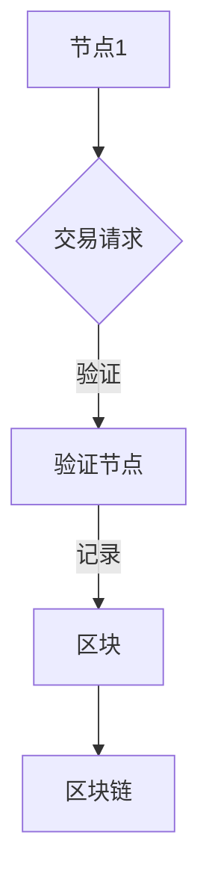

                 

关键词：区块链、创业、商业范式、去中心化、智能合约、共识机制、分布式账本

在过去的几十年里，信息技术的发展极大地推动了商业模式的变革。从电子商务到社交媒体，再到大数据和人工智能，每一个技术浪潮都带来了新的商业机会和挑战。然而，随着区块链技术的崛起，一个全新的商业范式正在逐渐形成，那就是去中心化。

## 1. 背景介绍

区块链技术，作为一个分布式账本，自2008年比特币的诞生以来，便以其去中心化的特性引发了广泛的关注。区块链通过共识机制确保数据的一致性和不可篡改性，从而在许多领域展示了其独特的应用价值。去中心化不仅仅是技术的变革，更是一种商业范式的转变。

在传统的商业世界中，中心化的组织结构占据主导地位。企业通过集中的决策体系和管理层级来运行，这种结构虽然在某些方面高效，但也存在着信息不对称、信任问题、资源浪费等问题。而去中心化的商业范式，通过区块链技术实现了权力的分散，信息的透明，以及信任的建立，为商业运作带来了全新的可能性。

## 2. 核心概念与联系

### 2.1 区块链技术的基本概念

区块链是一个分布式数据库系统，它通过加密技术和共识算法确保数据的不可篡改性和透明性。区块链的基本结构包括区块、链和节点。每一个区块都包含一定数量的交易信息，区块之间通过哈希值相互链接，形成一条不可篡改的链。

### 2.2 去中心化的概念

去中心化是一种组织结构，它通过分散的节点来实现信息的共享和决策的制定。在去中心化的系统中，没有集中的权威机构，所有的节点都平等参与网络运作，共同维护整个系统的稳定性和可靠性。

### 2.3 智能合约的概念

智能合约是一种自动执行、控制和执行的合同，它基于区块链技术，在满足特定条件时自动执行预先设定的协议。智能合约通过编程逻辑实现，使得合同执行更加高效、透明和不可篡改。

### 2.4 Mermaid 流程图

以下是一个简化的区块链系统的 Mermaid 流程图：



### 2.5 区块链与商业范式变革的联系

区块链技术通过去中心化、透明性、不可篡改性和智能合约等特性，深刻影响了商业运作模式。去中心化打破了传统的集中化权力结构，使得资源分配更加公平，提高了系统的效率和可靠性。透明性使得交易信息可追溯，增强了信任和透明度。不可篡改性确保了数据的真实性和完整性。智能合约则使得合同执行更加自动化和高效。

## 3. 核心算法原理 & 具体操作步骤

### 3.1 算法原理概述

区块链技术的核心算法主要包括加密算法、共识算法和智能合约执行算法。加密算法用于保护数据的安全和隐私；共识算法确保分布式节点对数据的共识；智能合约执行算法则用于自动执行合同协议。

### 3.2 算法步骤详解

1. **交易发起**：用户在区块链上发起交易请求。
2. **交易验证**：验证节点对交易请求进行验证。
3. **区块创建**：验证后的交易被添加到区块中。
4. **区块广播**：新区块被广播到所有节点。
5. **共识达成**：节点通过共识算法达成对新区块的共识。
6. **区块添加**：新区块被添加到区块链上。
7. **智能合约执行**：智能合约根据区块链上的数据自动执行。

### 3.3 算法优缺点

#### 优点：

1. **去中心化**：提高了系统的可靠性和抗攻击性。
2. **透明性**：所有交易信息都是透明的，增强了信任。
3. **不可篡改性**：数据一旦上链，便不可篡改，确保了数据的真实性。
4. **高效性**：通过分布式计算，提高了交易处理的效率。

#### 缺点：

1. **交易速度**：由于需要达成共识，交易速度相对较慢。
2. **存储容量**：区块链的存储容量有限，需要定期扩容。
3. **能源消耗**：某些共识算法（如工作量证明）需要大量能源。

### 3.4 算法应用领域

区块链技术在金融、供应链、医疗、投票、版权保护等多个领域都有广泛应用。例如，在金融领域，区块链可以用于实现去中心化的支付系统；在供应链领域，区块链可以用于实现透明、可追溯的供应链管理。

## 4. 数学模型和公式 & 详细讲解 & 举例说明

### 4.1 数学模型构建

区块链系统的数学模型主要包括加密模型、共识模型和智能合约执行模型。加密模型用于保护数据的安全，共识模型用于确保分布式节点对数据的共识，智能合约执行模型用于自动执行合同协议。

### 4.2 公式推导过程

假设区块链系统中存在多个节点 \(N_1, N_2, ..., N_n\)，每个节点维护一个本地副本的区块链。当节点 \(N_i\) 收到一个新区块 \(B_j\) 时，需要进行以下步骤：

1. 验证新区块 \(B_j\) 的合法性和一致性。
2. 将新区块 \(B_j\) 添加到本地区块链中。

新区块 \(B_j\) 的合法性可以通过以下公式验证：

$$
合法性(B_j) = 验证(区块头(B_j), 链上最新区块)
$$

其中，区块头 \(H(B_j)\) 是新区块 \(B_j\) 的哈希值，链上最新区块 \(L\) 是当前区块链的最新区块。

### 4.3 案例分析与讲解

假设在一个区块链系统中，节点 \(N_1\) 收到一个新区块 \(B_j\)。节点 \(N_1\) 首先验证新区块 \(B_j\) 的合法性，通过验证后，将新区块 \(B_j\) 添加到本地区块链中。然后，节点 \(N_1\) 将新区块 \(B_j\) 广播给其他节点，其他节点 \(N_2, N_3, ..., N_n\) 同样进行验证和添加。

这个过程确保了区块链系统的去中心化和一致性。所有节点都维护一个一致的区块链副本，从而确保整个系统的稳定性和可靠性。

## 5. 项目实践：代码实例和详细解释说明

### 5.1 开发环境搭建

在开始区块链项目的开发之前，需要搭建相应的开发环境。这里以以太坊为例，需要安装Node.js、Geth（以太坊客户端）和Truffle（智能合约开发框架）。

```bash
# 安装Node.js
curl -sL https://deb.nodesource.com/setup_14.x | bash -
sudo apt-get install -y nodejs

# 安装Geth
wget https://gethstore.blob.core.windows.net/releases/1.10.23/geth_1.10.23_linux-amd64.tar.gz
tar -xvf geth_1.10.23_linux-amd64.tar.gz
cd geth/
./geth

# 安装Truffle
npm install -g truffle
```

### 5.2 源代码详细实现

以下是一个简单的以太坊智能合约示例，用于实现一个简单的去中心化投票系统。

```solidity
// SPDX-License-Identifier: MIT
pragma solidity ^0.8.0;

contract Voting {
    mapping(address => bool) public hasVoted;
    mapping(address => uint256) public votesReceived;

    function vote(uint256 questionId) public {
        require(!hasVoted[msg.sender], "已经投票");
        hasVoted[msg.sender] = true;
        votesReceived[questionId] += 1;
    }

    function results(uint256 questionId) public view returns (uint256 winner) {
        return votesReceived[questionId];
    }
}
```

### 5.3 代码解读与分析

这段代码实现了一个简单的去中心化投票系统。`hasVoted` 用于记录已经投票的用户地址，`votesReceived` 用于记录每个问题的投票数。`vote` 函数用于投票，`results` 函数用于获取投票结果。

### 5.4 运行结果展示

在 Truffle 的控制台，可以运行以下命令来部署和测试智能合约：

```bash
truffle migrate --network development
truffle console
```

在控制台中，可以执行以下命令来测试投票：

```javascript
await Voting.deployed().then(instance => {
    instance.vote(1);
    console.log(await instance.results(1));
});
```

输出结果为 `1`，表示成功投出第一张票。

## 6. 实际应用场景

区块链技术已经在多个领域得到了广泛应用。在金融领域，区块链可以用于实现去中心化的支付系统，如比特币和以太坊。在供应链领域，区块链可以用于实现透明、可追溯的供应链管理，确保产品的质量和来源。在医疗领域，区块链可以用于记录患者的医疗数据，确保数据的完整性和隐私。在投票领域，区块链可以用于实现公正、透明的投票系统，确保选举的公正性。

### 6.1 金融领域

区块链技术在金融领域中的应用非常广泛，包括数字货币、智能合约、去中心化金融（DeFi）等。比特币和以太坊是最著名的两个数字货币，它们通过区块链技术实现了去中心化的支付系统。智能合约则使得金融合同的执行更加自动化和透明。去中心化金融（DeFi）通过区块链技术实现了传统金融工具的去中心化，为用户提供了更灵活、更高效的金融服务。

### 6.2 供应链领域

区块链技术在供应链管理中的应用可以显著提高供应链的透明度和效率。通过区块链，供应链中的所有参与者都可以访问和验证交易信息，确保信息的真实性和完整性。例如，食品公司可以使用区块链来记录食品从生产到消费的整个过程，确保食品的安全性和质量。服装公司可以使用区块链来追踪服装的原材料和制造过程，确保服装的来源和品质。

### 6.3 医疗领域

区块链技术在医疗领域中的应用主要集中在医疗数据的记录和共享。通过区块链，患者的医疗数据可以被安全地存储和共享，而无需担心数据被篡改或泄露。例如，医院可以使用区块链来记录患者的诊断记录、治疗方案和药物使用情况，确保数据的真实性和完整性。同时，区块链还可以用于实现电子健康档案（EHR），让患者可以轻松地访问和管理自己的医疗数据。

### 6.4 投票领域

区块链技术在投票领域中的应用可以显著提高选举的公正性和透明度。通过区块链，投票结果可以被实时记录和验证，确保选举的公正性和透明度。例如，一些国家和组织已经开始使用区块链技术来记录和验证投票结果，确保选举的公正性和可信度。此外，区块链还可以用于实现去中心化的投票系统，让用户可以在任何时间、任何地点投票，提高了投票的参与度和便利性。

## 7. 工具和资源推荐

### 7.1 学习资源推荐

- 《区块链技术指南》
- 《精通区块链》
- 《智能合约编程》
- 《区块链革命》

### 7.2 开发工具推荐

- Truffle：智能合约开发框架
- Geth：以太坊客户端
- Remix：在线智能合约开发环境
- Ethers.js：JavaScript 版的以太坊客户端库

### 7.3 相关论文推荐

- "Bitcoin: A Peer-to-Peer Electronic Cash System" - Satoshi Nakamoto
- "The Case for Decentralized Blockchains" - Alex Tapscott and Don Tapscott
- "Smart Contracts: The New Trustless Medium of Exchange" - Nick Szabo
- "Proof of Work and Proof of Stake: Mechanisms for Cryptocurrency Consensus" - Andrew Miller, et al.

## 8. 总结：未来发展趋势与挑战

区块链技术的快速发展带来了诸多机遇，但也面临着一些挑战。未来，区块链技术将在以下几个方面得到进一步发展：

### 8.1 研究成果总结

- **去中心化金融（DeFi）**：去中心化金融（DeFi）通过区块链技术实现了传统金融工具的去中心化，为用户提供了更灵活、更高效的金融服务。
- **供应链管理**：区块链技术在供应链管理中的应用可以显著提高供应链的透明度和效率，确保产品的质量和来源。
- **医疗数据记录与共享**：区块链技术在医疗领域中的应用可以显著提高医疗数据的记录和共享效率，确保数据的真实性和完整性。
- **投票系统**：区块链技术在投票领域中的应用可以显著提高选举的公正性和透明度。

### 8.2 未来发展趋势

- **跨链技术**：随着区块链应用场景的多样化，跨链技术将成为未来区块链发展的重要方向。通过跨链技术，不同区块链之间的数据和价值可以相互传递和交互，从而实现更广泛的生态协作。
- **智能合约性能提升**：智能合约的性能一直是区块链技术的瓶颈之一。未来，通过优化智能合约的执行效率和降低执行成本，将有助于提升区块链技术的应用广度和深度。
- **隐私保护**：随着区块链技术的普及，隐私保护将成为重要议题。通过引入零知识证明、同态加密等技术，将有助于实现数据的安全存储和传输。

### 8.3 面临的挑战

- **性能与可扩展性**：当前区块链技术的性能和可扩展性仍然是一个挑战。如何在不牺牲安全性和去中心化特性的前提下，提升区块链的性能和可扩展性，是未来研究的重点。
- **标准化与合规性**：随着区块链技术的广泛应用，标准化和合规性将成为重要议题。如何制定统一的区块链技术标准和合规性要求，是未来需要解决的问题。
- **隐私保护**：区块链技术的透明性和不可篡改性在带来便利的同时，也带来了隐私保护的问题。如何在保护用户隐私的前提下，实现数据的安全存储和传输，是未来需要解决的难题。

### 8.4 研究展望

未来，区块链技术将在多个领域得到进一步发展，包括金融、供应链、医疗、投票等。同时，区块链与其他技术的融合也将带来新的应用场景和商业模式。通过持续的研究和创新，区块链技术有望成为下一代信息技术的重要组成部分，推动社会的进步和发展。

## 9. 附录：常见问题与解答

### 9.1 区块链与比特币的关系是什么？

区块链是比特币的底层技术，比特币是区块链上的一种应用。区块链技术确保了比特币的安全性和不可篡改性，而比特币则是区块链上的一种数字货币。

### 9.2 区块链是否可以完全消除欺诈？

区块链技术可以显著减少欺诈行为，但由于区块链的不可篡改性，一旦数据上链，便不可更改。因此，区块链不能完全消除欺诈，但可以降低欺诈的风险。

### 9.3 区块链的缺点是什么？

区块链的缺点包括交易速度较慢、存储容量有限、能源消耗较大等。此外，区块链技术仍处于发展阶段，存在一定的技术风险和合规性问题。

### 9.4 区块链如何保证数据的一致性？

区块链通过分布式存储和共识算法来保证数据的一致性。分布式存储使得数据在多个节点上备份，共识算法确保所有节点对数据的共识，从而保证数据的一致性。

### 9.5 区块链是否具有隐私保护功能？

区块链的透明性和不可篡改性在一定程度上影响了隐私保护。为了实现隐私保护，区块链技术引入了零知识证明、同态加密等技术，但隐私保护功能仍处于发展阶段。

### 9.6 区块链与大数据有什么区别？

区块链是一种分布式数据库技术，主要特点是数据不可篡改和去中心化。大数据则是一种数据管理和分析技术，主要关注数据的高效存储、处理和分析。

### 9.7 区块链是否可以用于版权保护？

区块链技术可以用于版权保护，通过区块链，版权信息可以被安全地记录和验证，确保版权的真实性和完整性。例如，音乐和艺术作品可以使用区块链实现版权保护。

## 作者署名

作者：禅与计算机程序设计艺术 / Zen and the Art of Computer Programming

----------------------------------------------------------------

以上便是对区块链创业：去中心化的商业新范式的完整技术博客文章的撰写。希望这篇文章能够帮助读者更好地理解区块链技术及其在创业中的应用。在未来的发展中，区块链技术将继续推动商业范式的变革，为创业者和企业家提供更多的机会和挑战。让我们共同期待区块链技术带来的美好未来。

