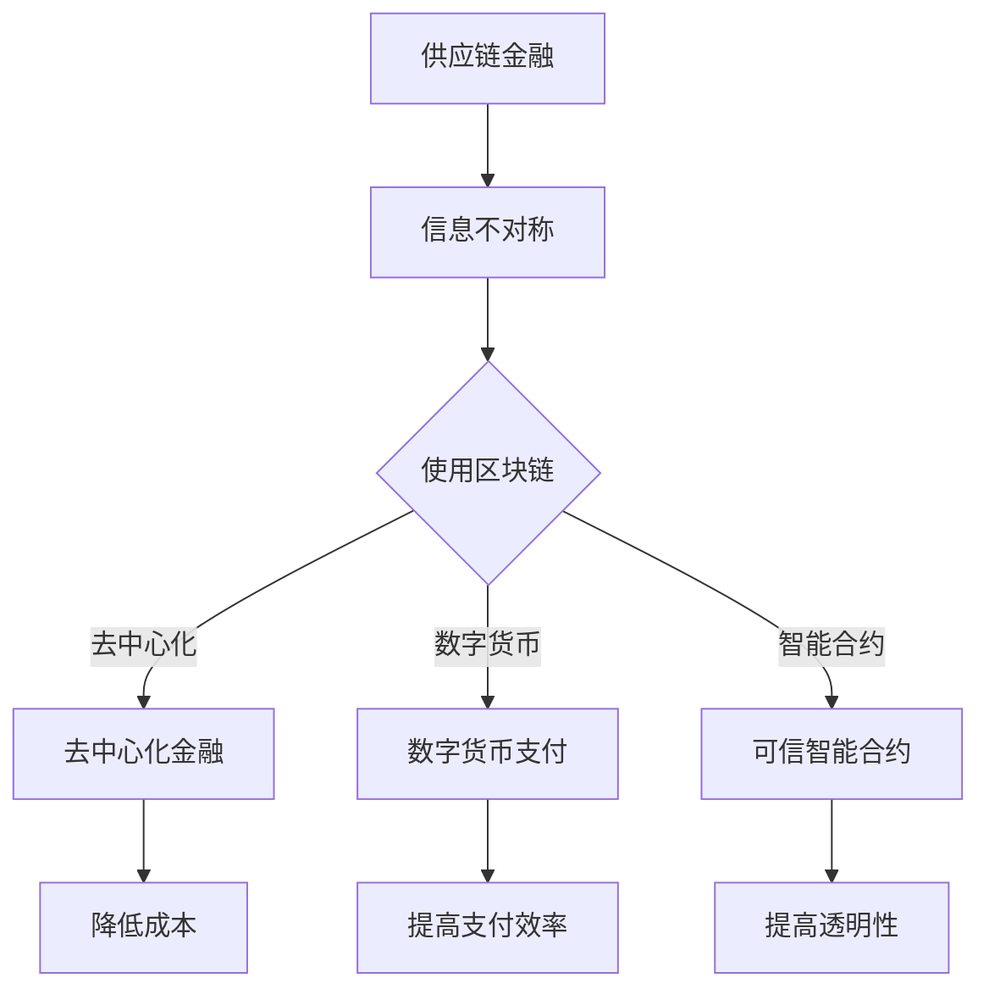

                 

### 关键词 Keywords ###
- 区块链
- 供应链金融
- 数字货币
- 去中心化金融
- 跨境支付
- 可信智能合约

<|assistant|>### 摘要 Abstract ###
本文深入探讨了区块链技术如何为供应链金融领域带来革命性变革。首先，我们介绍了区块链的基本概念及其在金融领域的潜在应用。随后，重点分析了区块链技术在供应链金融中的创新应用，包括数字货币、去中心化金融（DeFi）以及可信智能合约等。接着，文章通过一个具体案例展示了区块链如何优化供应链金融流程。此外，我们还讨论了区块链在供应链金融中的应用挑战以及未来发展趋势。

## 1. 背景介绍

供应链金融是一种基于供应链的融资模式，旨在通过供应链中各方信用关系和交易数据为中小企业提供融资支持。然而，传统供应链金融在运作过程中存在信息不对称、流程繁琐、信任机制薄弱等问题，导致中小企业融资难、融资成本高。

区块链技术作为一种分布式账本技术，具有去中心化、不可篡改、透明性高等特点，为解决供应链金融中的问题提供了新的思路。区块链能够实现各参与方之间的直接交易，消除中介环节，降低交易成本，提高交易效率。此外，区块链技术还提供了智能合约功能，使得合同条款自动执行，进一步提高了供应链金融的透明性和安全性。

## 2. 核心概念与联系

### 2.1 区块链基础概念

区块链是一个分布式数据库系统，通过密码学和共识算法实现数据的加密和验证。每个区块包含一定数量的交易记录，多个区块按照时间顺序链接形成区块链。区块链的主要组成部分包括：

- **区块（Block）**：数据记录的集合，包含交易信息、区块头等。
- **区块头（Block Header）**：包含区块版本、上一区块哈希值、默克尔根等。
- **交易（Transaction）**：数据记录，包含发送者、接收者、金额等信息。
- **共识算法（Consensus Algorithm）**：确保区块链网络中的所有节点对账本状态达成一致的方法。

### 2.2 供应链金融概念

供应链金融是指通过供应链中各参与方的交易数据、信用记录等信息，为供应链上的企业提供融资服务。其核心概念包括：

- **供应链**：指从原材料供应商到最终消费者的整个生产、销售过程。
- **金融参与方**：包括银行、供应链金融服务提供商、供应商、制造商、分销商和零售商等。
- **融资服务**：通过供应链交易数据和信用关系为中小企业提供贷款、保理、信用证等服务。

### 2.3 区块链在供应链金融中的应用

区块链在供应链金融中的应用主要体现在以下几个方面：

- **去中心化金融（DeFi）**：通过区块链实现金融服务的去中心化，消除传统金融中介，降低交易成本。
- **数字货币**：利用区块链发行数字货币，作为供应链金融的支付手段，提高支付效率和安全性。
- **可信智能合约**：使用智能合约自动执行合同条款，提高供应链金融的透明性和安全性。

### 2.4 Mermaid 流程图



## 3. 核心算法原理 & 具体操作步骤

### 3.1 算法原理概述

区块链技术在供应链金融中的应用，主要依赖于其分布式账本、加密技术、共识算法和智能合约等核心原理。

- **分布式账本**：区块链通过分布式节点存储数据，每个节点保存一份完整账本，确保数据一致性和不可篡改性。
- **加密技术**：区块链使用公钥加密技术保护交易数据，只有拥有相应私钥的节点才能解密和访问数据。
- **共识算法**：区块链通过共识算法确保节点之间对账本状态达成一致，常见算法包括工作量证明（PoW）、权益证明（PoS）等。
- **智能合约**：智能合约是一种在区块链上执行的自动化合同，其条款和操作步骤被编码为计算机程序，满足条件时自动执行。

### 3.2 算法步骤详解

区块链在供应链金融中的应用步骤可以分为以下几个方面：

1. **数据收集**：供应链中的各方（如供应商、制造商、分销商等）将交易数据上传到区块链。
2. **数据验证**：区块链网络中的节点对上传的数据进行验证，确保数据真实性和一致性。
3. **记录交易**：验证通过的数据被记录在区块链上的新区块中。
4. **共识达成**：区块链网络中的节点通过共识算法确认新区块的合法性，并将其添加到区块链上。
5. **智能合约执行**：根据智能合约的条款，自动执行相应的金融操作，如贷款发放、还款等。
6. **结果记录**：所有操作结果被记录在区块链上，供各方查询和审计。

### 3.3 算法优缺点

**优点**：

- **去中心化**：消除了传统金融中介，降低了交易成本。
- **透明性**：区块链上的数据对所有参与者可见，提高了供应链金融的透明性。
- **安全性**：加密技术和共识算法确保数据的安全性和不可篡改性。
- **自动化**：智能合约自动执行合同条款，提高了交易效率。

**缺点**：

- **性能瓶颈**：区块链的处理能力有限，可能无法满足大规模交易的实时处理需求。
- **法律和监管问题**：区块链技术的法律地位和监管框架尚不完善。
- **技术门槛**：区块链技术的应用需要专业的技术支持和维护。

### 3.4 算法应用领域

区块链技术在供应链金融中的应用主要包括以下几个方面：

- **跨境支付**：通过区块链实现跨境支付，提高支付效率和降低成本。
- **供应链融资**：利用区块链提供可信的供应链融资服务，降低融资成本。
- **信用评估**：基于区块链上的交易数据，为中小企业提供信用评估服务。
- **物流追踪**：利用区块链记录物流信息，提高物流效率和透明度。

## 4. 数学模型和公式 & 详细讲解 & 举例说明

### 4.1 数学模型构建

区块链在供应链金融中的应用涉及到多个数学模型，包括加密算法、共识算法和智能合约等。以下是一个简单的数学模型示例：

- **加密算法**：采用椭圆曲线加密算法（ECC）对交易数据进行加密。
- **共识算法**：采用工作量证明（PoW）算法确保区块链网络中的节点对账本状态达成一致。
- **智能合约**：使用形式化方法描述智能合约的执行过程。

### 4.2 公式推导过程

以下是椭圆曲线加密算法（ECC）中的加密和解密公式：

- **加密公式**：
  \[C = (kG) + M\]
  其中，\(G\) 是椭圆曲线基点，\(k\) 是随机数，\(M\) 是明文信息。

- **解密公式**：
  \[M = C - (kG)\]
  其中，\(C\) 是密文信息。

### 4.3 案例分析与讲解

假设有两个节点 A 和 B，它们需要进行安全的通信，可以使用椭圆曲线加密算法进行加密和解密。

1. **密钥生成**：

   - 节点 A 选择一个随机数 \(k_A\)，计算公钥 \(P_A = k_AG\)。
   - 节点 B 选择一个随机数 \(k_B\)，计算公钥 \(P_B = k_BG\)。

2. **加密**：

   - 节点 A 选择一个明文信息 \(M = 42\)，使用 B 的公钥进行加密：
     \[C = (k_BG) + 42\]

3. **解密**：

   - 节点 B 使用自己的私钥 \(k_B\) 解密：
     \[M = C - (k_BG) = (k_BG) + 42 - (k_BG) = 42\]

通过以上过程，节点 A 和 B 实现了安全的信息传递。

## 5. 项目实践：代码实例和详细解释说明

### 5.1 开发环境搭建

搭建区块链供应链金融项目的开发环境，需要以下工具：

- **区块链框架**：例如 Hyperledger Fabric、Ethereum 等。
- **编程语言**：例如 Go、Solidity 等。
- **开发工具**：例如 Visual Studio Code、Truffle 等。

### 5.2 源代码详细实现

以下是一个使用 Hyperledger Fabric 搭建区块链供应链金融项目的示例代码：

```go
// main.go
package main

import (
    "fmt"
    "github.com/hyperledger/fabric/core/chaincode/shim"
    "github.com/hyperledger/fabric/protos/peer"
)

// SimpleChaincode 结构体，表示简单的区块链链码
type SimpleChaincode struct {
}

// Init 链码初始化函数
func (s *SimpleChaincode) Init(stub shim.ChaincodeStubInterface) peer.Response {
    // 初始化数据结构
    return shim.Success(nil)
}

// Invoke 链码操作函数
func (s *SimpleChaincode) Invoke(stub shim.ChaincodeStubInterface) peer.Response {
    // 解析操作类型
    operation, args := stub.GetFunctionAndParameters()

    // 处理不同操作类型
    if operation == "create" {
        return s.create(stub, args)
    } else if operation == "query" {
        return s.query(stub, args)
    }

    // 未识别的操作类型
    return shim.Error("Unsupported operation type")
}

// create 创建交易记录
func (s *SimpleChaincode) create(stub shim.ChaincodeStubInterface, args []string) peer.Response {
    // 解析交易记录
    transactionId := args[0]
    amount := args[1]

    // 写入交易记录
    err := stub.PutState(transactionId, []byte(amount))
    if err != nil {
        return shim.Error(err.Error())
    }

    // 返回成功
    return shim.Success([]byte("Transaction created"))
}

// query 查询交易记录
func (s *SimpleChaincode) query(stub shim.ChaincodeStubInterface, args []string) peer.Response {
    // 解析交易记录
    transactionId := args[0]

    // 读取交易记录
    transaction, err := stub.GetState(transactionId)
    if err != nil {
        return shim.Error(err.Error())
    }

    // 返回交易记录
    return shim.Success(transaction)
}

// main 主函数，启动链码
func main() {
    if err := shim.Start(new(SimpleChaincode)); err != nil {
        fmt.Printf("Error starting SimpleChaincode: %s\n", err)
    }
}
```

### 5.3 代码解读与分析

以上代码是一个简单的区块链链码示例，用于实现交易记录的创建和查询功能。下面是对代码的详细解读：

- **结构体定义**：定义了一个 `SimpleChaincode` 结构体，表示简单的区块链链码。
- **Init 函数**：初始化链码，可以用于初始化数据结构。
- **Invoke 函数**：处理链码的调用，根据操作类型调用相应的函数。
- **create 函数**：创建交易记录，将交易记录写入状态数据库。
- **query 函数**：查询交易记录，从状态数据库中读取交易记录。
- **main 函数**：启动链码，使用 `shim.Start` 函数启动链码服务。

### 5.4 运行结果展示

通过运行以上代码，可以启动一个简单的区块链供应链金融项目。以下是创建和查询交易记录的示例结果：

```shell
$ peer chaincode install -n mycc -v 1.0 -p github.com/hyperledger/fabric/examples/chaincode/go/chaincode_example02
Chaincode code package installed successfully on peer

$ peer chaincode instantiate -n mycc -v 1.0 -c '{"Args":["init","a","100"]}' -C mychannel
Chaincode definition for application "myapp" has been submitted for endorsement by one or more peers in channel "mychannel"
```

通过以上命令，可以安装和实例化链码，并创建一个初始交易记录。

## 6. 实际应用场景

区块链在供应链金融中的实际应用场景包括：

- **跨境支付**：通过区块链实现跨境支付，提高支付效率和降低成本。
- **供应链融资**：利用区块链提供可信的供应链融资服务，降低融资成本。
- **信用评估**：基于区块链上的交易数据，为中小企业提供信用评估服务。
- **物流追踪**：利用区块链记录物流信息，提高物流效率和透明度。

### 6.1 跨境支付

跨境支付是区块链在供应链金融中的一个重要应用场景。传统跨境支付通常需要经过多个中介机构，如银行、支付系统等，导致支付时间长、成本高。而区块链技术通过去中心化的特点，可以实现点对点的支付，降低交易成本和时间。

例如，一家中国的制造商需要向美国的供应商支付货款。通过区块链跨境支付，制造商可以直接向供应商发送数字货币，无需经过银行或其他中介机构。这样不仅提高了支付效率，还降低了支付成本。

### 6.2 供应链融资

供应链融资是区块链在供应链金融中的另一个重要应用场景。传统供应链融资通常需要繁琐的审批流程和担保机制，导致融资成本高、效率低。而区块链技术可以通过智能合约实现自动化融资服务，降低融资成本和提高融资效率。

例如，一家中小企业需要融资来购买原材料。通过区块链供应链融资，企业可以将交易数据上传到区块链，金融机构可以基于区块链上的交易数据直接为企业提供融资服务，无需进行繁琐的审批和担保。

### 6.3 信用评估

基于区块链的交易数据，可以为中小企业提供信用评估服务。区块链上的交易数据具有可信性和不可篡改性，可以作为信用评估的依据。金融机构可以通过区块链上的交易数据，对企业的信用状况进行评估，为中小企业提供更加精准和可靠的信用评估服务。

### 6.4 物流追踪

区块链技术可以用于记录和追踪物流信息，提高物流效率和透明度。通过区块链，供应链中的各方可以实时查询物流信息，确保物流过程的透明性和可追溯性。例如，一家制造商可以通过区块链记录物流信息，实时了解原材料运输情况，及时调整生产计划。

## 7. 工具和资源推荐

### 7.1 学习资源推荐

- **区块链入门书籍**：《区块链：从数字货币到信用社会》
- **区块链开发教程**：《精通区块链开发》
- **Hyperledger Fabric 官方文档**：[Hyperledger Fabric 官方文档](https://hyperledger-fabric.readthedocs.io/)
- **Ethereum 官方文档**：[Ethereum 官方文档](https://ethereum.org/greeter)

### 7.2 开发工具推荐

- **区块链开发框架**：Hyperledger Fabric、Ethereum
- **编程语言**：Go、Solidity
- **开发工具**：Visual Studio Code、Truffle

### 7.3 相关论文推荐

- **《区块链：设计与实现》**：详细介绍了区块链的技术原理和应用案例。
- **《去中心化金融（DeFi）技术分析》**：分析了去中心化金融的原理和应用场景。
- **《区块链在供应链金融中的应用研究》**：探讨了区块链在供应链金融中的创新应用。

## 8. 总结：未来发展趋势与挑战

### 8.1 研究成果总结

区块链技术在供应链金融领域取得了显著的研究成果，主要包括：

- **去中心化金融（DeFi）**：通过区块链实现金融服务的去中心化，降低了交易成本。
- **数字货币**：作为支付手段，提高了支付效率和安全性。
- **可信智能合约**：自动执行合同条款，提高了供应链金融的透明性和安全性。

### 8.2 未来发展趋势

未来，区块链在供应链金融领域的发展趋势主要包括：

- **性能优化**：提高区块链的处理能力，满足大规模交易的实时处理需求。
- **监管合规**：完善区块链技术的法律地位和监管框架，确保其合规性。
- **跨链技术**：实现不同区块链之间的互联互通，提高供应链金融的灵活性和兼容性。

### 8.3 面临的挑战

区块链在供应链金融领域面临的挑战主要包括：

- **性能瓶颈**：区块链的处理能力有限，可能无法满足大规模交易的实时处理需求。
- **法律和监管问题**：区块链技术的法律地位和监管框架尚不完善，需要进一步完善。
- **技术门槛**：区块链技术的应用需要专业的技术支持和维护，对中小企业来说是一个挑战。

### 8.4 研究展望

未来，区块链在供应链金融领域的研究展望包括：

- **区块链+AI**：结合人工智能技术，提高供应链金融的智能决策和风险管理能力。
- **区块链+物联网**：利用物联网技术，实现供应链金融的实时监控和智能调度。
- **区块链+数字身份**：利用数字身份技术，提高供应链金融的安全性和可信度。

## 9. 附录：常见问题与解答

### 9.1 区块链在供应链金融中的应用有哪些优点？

区块链在供应链金融中的应用优点包括：

- 去中心化：消除了传统金融中介，降低了交易成本。
- 透明性：区块链上的数据对所有参与者可见，提高了供应链金融的透明性。
- 安全性：加密技术和共识算法确保数据的安全性和不可篡改性。
- 自动化：智能合约自动执行合同条款，提高了交易效率。

### 9.2 区块链在供应链金融中的实际应用场景有哪些？

区块链在供应链金融中的实际应用场景包括：

- 跨境支付：通过区块链实现跨境支付，提高支付效率和降低成本。
- 供应链融资：利用区块链提供可信的供应链融资服务，降低融资成本。
- 信用评估：基于区块链上的交易数据，为中小企业提供信用评估服务。
- 物流追踪：利用区块链记录物流信息，提高物流效率和透明度。

### 9.3 区块链在供应链金融中面临的挑战是什么？

区块链在供应链金融中面临的挑战包括：

- 性能瓶颈：区块链的处理能力有限，可能无法满足大规模交易的实时处理需求。
- 法律和监管问题：区块链技术的法律地位和监管框架尚不完善。
- 技术门槛：区块链技术的应用需要专业的技术支持和维护，对中小企业来说是一个挑战。 

### 9.4 区块链与人工智能（AI）的结合在供应链金融中有哪些应用前景？

区块链与人工智能（AI）的结合在供应链金融中有以下应用前景：

- 智能决策：利用 AI 技术分析区块链上的数据，实现供应链金融的智能决策。
- 风险管理：利用 AI 技术识别和评估供应链金融中的风险，提高风险管理能力。
- 实时监控：利用 AI 技术实时监控区块链上的交易活动，确保供应链金融的安全性和合规性。 

------------------------------------------------------------------
本文由禅与计算机程序设计艺术 / Zen and the Art of Computer Programming 撰写。如果您有任何问题或建议，欢迎在评论区留言。谢谢！

