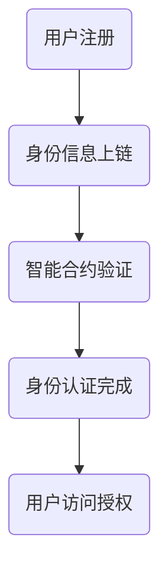

                 

关键词：区块链、数字身份验证、去中心化、智能合约、安全、隐私

> 摘要：本文探讨了区块链技术在数字身份验证中的应用，通过介绍其核心概念和原理，分析了区块链在身份验证领域的优势与挑战，并提出了未来发展的方向。

## 1. 背景介绍

### 区块链的起源与发展

区块链技术起源于2008年，由一位化名为中本聪（Satoshi Nakamoto）的匿名人物提出。作为一种分布式账本技术，区块链通过去中心化的方式实现了数据的安全存储和可靠传输。随着比特币的成功，区块链技术逐渐引起了广泛关注，并在金融、供应链管理、物联网等多个领域得到了应用。

### 数字身份验证的挑战

数字身份验证是指在网络环境中对用户的身份进行认证的过程。然而，传统的身份验证方式面临着诸多挑战，包括安全性、隐私性和可靠性等方面。传统的身份验证系统通常依赖于中心化的服务器，容易受到单点故障、数据泄露和网络攻击的影响。此外，用户需要在不同平台上重复提供身份信息，造成了不便和隐私泄露的风险。

### 区块链与数字身份验证的结合

区块链技术的去中心化、安全性和不可篡改性特点为解决数字身份验证的挑战提供了新的思路。通过将身份信息存储在区块链上，可以确保数据的可靠性和安全性。同时，区块链的智能合约功能可以自动执行身份验证流程，提高效率并减少欺诈行为。

## 2. 核心概念与联系

### 区块链基本概念

- **区块链**：一种分布式账本，由多个按时间顺序排列的区块组成。
- **区块**：包含一定数量交易记录的数据结构，通过密码学算法链接在一起。
- **节点**：参与区块链网络的计算机，负责存储、验证和传播区块链数据。

### 数字身份验证核心概念

- **身份信息**：用户在系统中注册的身份相关信息，包括用户名、密码、地址等。
- **身份验证**：通过检查用户提供的身份信息来确认其真实性的过程。
- **隐私保护**：在身份验证过程中，保护用户隐私信息不被泄露和滥用的措施。

### Mermaid 流程图



### 核心概念联系

区块链技术在数字身份验证中的应用主要体现在以下几个方面：

1. **去中心化身份信息存储**：将用户身份信息存储在区块链上，实现数据的分布式存储，提高数据安全性。
2. **智能合约自动执行**：利用智能合约自动执行身份验证流程，减少人工干预，提高效率。
3. **隐私保护机制**：通过加密技术和隐私保护算法，确保用户身份信息在验证过程中的安全性和隐私性。

## 3. 核心算法原理 & 具体操作步骤

### 3.1 算法原理概述

区块链在数字身份验证中的应用主要基于以下原理：

1. **去中心化存储**：将用户身份信息存储在区块链上的多个节点上，确保数据的安全性和可靠性。
2. **密码学算法**：使用加密技术对用户身份信息进行加密，确保数据在传输和存储过程中的安全性。
3. **智能合约**：利用智能合约实现身份验证的自动化执行，减少人工干预，提高效率。

### 3.2 算法步骤详解

1. **用户注册**：用户在区块链平台上注册账号，并提供身份信息（如姓名、身份证号码等）。
2. **身份信息上链**：平台将用户身份信息加密后存储在区块链上，并通过多个节点进行分布式存储。
3. **身份验证请求**：当用户需要访问受保护的资源时，向区块链平台发送身份验证请求。
4. **智能合约验证**：区块链平台通过智能合约自动执行身份验证流程，包括身份信息的验证、权限的检查等。
5. **身份认证完成**：验证通过后，用户获得访问授权，可以访问受保护的资源。

### 3.3 算法优缺点

**优点**：

1. **安全性高**：去中心化存储和加密技术确保了用户身份信息的安全。
2. **效率高**：智能合约自动执行身份验证流程，减少人工干预，提高效率。
3. **隐私保护**：通过加密技术和隐私保护算法，确保用户身份信息在验证过程中的安全性和隐私性。

**缺点**：

1. **存储容量有限**：区块链的存储容量有限，可能无法满足大规模身份信息存储的需求。
2. **交易速度较慢**：区块链的交易速度相对较慢，可能影响身份验证的效率。

### 3.4 算法应用领域

区块链在数字身份验证中的应用范围广泛，包括但不限于以下几个方面：

1. **金融领域**：用于银行、证券、保险等金融机构的客户身份验证。
2. **政府领域**：用于公民身份信息管理和公共服务提供。
3. **互联网领域**：用于电商平台、社交媒体等互联网应用的用户身份验证。

## 4. 数学模型和公式 & 详细讲解 & 举例说明

### 4.1 数学模型构建

区块链在数字身份验证中的数学模型主要涉及以下几个方面：

1. **密码学算法**：包括加密算法和签名算法，用于保护用户身份信息的安全。
2. **共识算法**：用于实现区块链的去中心化，确保多个节点之间的数据一致性。
3. **智能合约**：用于实现身份验证的自动化执行，确保流程的准确性和可靠性。

### 4.2 公式推导过程

1. **加密算法**：

   - **加密函数**：$C = E(K, P)$，其中$C$表示加密后的密文，$K$表示加密密钥，$P$表示明文。
   - **解密函数**：$P = D(K, C)$，其中$P$表示解密后的明文，$K$表示解密密钥，$C$表示密文。

2. **签名算法**：

   - **签名函数**：$S = Sign(K, M)$，其中$S$表示签名，$K$表示签名密钥，$M$表示消息。
   - **验证函数**：$Verify(K, M, S)$，用于验证签名是否有效。

3. **共识算法**：

   - **工作量证明（PoW）**：$Hash(N, T) \leq C$，其中$Hash$表示哈希函数，$N$表示区块，$T$表示交易，$C$表示难度阈值。

### 4.3 案例分析与讲解

**案例**：某电商平台采用区块链技术实现用户身份验证。

1. **用户注册**：用户在电商平台上注册账号，并提供身份信息（如姓名、身份证号码等）。
2. **身份信息加密**：平台使用加密算法对用户身份信息进行加密，生成密文。
3. **身份信息上链**：平台将加密后的身份信息上传至区块链，并通过多个节点进行分布式存储。
4. **用户身份验证**：当用户需要访问受保护的资源时，向区块链平台发送身份验证请求。
5. **智能合约验证**：区块链平台通过智能合约自动执行身份验证流程，包括身份信息的验证、权限的检查等。
6. **身份认证完成**：验证通过后，用户获得访问授权，可以访问受保护的资源。

通过上述案例，我们可以看到区块链技术在数字身份验证中的应用过程和数学模型的具体实现。

## 5. 项目实践：代码实例和详细解释说明

### 5.1 开发环境搭建

1. **安装Go语言环境**：从官方网站下载并安装Go语言环境。
2. **安装区块链框架**：使用Go语言安装并配置区块链框架，如Ethereum或Hyperledger Fabric。
3. **创建智能合约**：使用区块链框架提供的开发工具创建智能合约，编写身份验证相关代码。

### 5.2 源代码详细实现

以下是一个简单的Go语言智能合约示例，用于实现用户身份验证：

```go
// SPDX-License-Identifier: MIT
pragma solidity ^0.8.0;

contract IdentityVerification {
    mapping(address => bool) public identities;

    function register(address _user) public {
        require(!identities[_user], "User already registered");
        identities[_user] = true;
    }

    function verify(address _user) public view returns (bool) {
        return identities[_user];
    }
}
```

### 5.3 代码解读与分析

1. **合约结构**：合约使用Solidity语言编写，定义了一个名为`IdentityVerification`的智能合约。
2. **变量定义**：合约定义了一个映射变量`identities`，用于存储用户的身份信息。
3. **函数实现**：
   - `register`函数：用于用户注册，将用户的地址与身份信息关联。
   - `verify`函数：用于身份验证，返回用户身份状态。

### 5.4 运行结果展示

1. **部署智能合约**：在区块链平台上部署上述智能合约。
2. **用户注册**：用户通过调用`register`函数注册身份。
3. **身份验证**：调用`verify`函数验证用户身份。

通过上述代码实例，我们可以看到区块链在数字身份验证中的具体实现过程，以及智能合约在身份验证中的重要作用。

## 6. 实际应用场景

### 6.1 金融领域

区块链技术在金融领域的身份验证应用包括银行、证券、保险等金融机构。通过区块链技术，金融机构可以实现快速、安全的客户身份验证，减少欺诈行为，提高业务效率。

### 6.2 政府领域

区块链技术在政府领域的身份验证应用包括公民身份信息管理、公共服务提供等。通过区块链技术，政府可以实现去中心化的身份信息存储和验证，提高数据安全性和可靠性，减少隐私泄露风险。

### 6.3 互联网领域

区块链技术在互联网领域的身份验证应用包括电商平台、社交媒体等。通过区块链技术，互联网应用可以实现高效、安全的用户身份验证，提高用户体验，减少欺诈行为。

## 7. 工具和资源推荐

### 7.1 学习资源推荐

- 《区块链技术指南》
- 《智能合约开发实战》
- 《区块链开发从零开始》

### 7.2 开发工具推荐

- Ethereum Development Tools
- Hyperledger Composer
- IBM Blockchain Platform

### 7.3 相关论文推荐

- "Blockchain and Digital Identity Verification: A Survey"
- "Secure and Efficient Identity Management using Blockchain"
- "Smart Contracts for Digital Identity Management"

## 8. 总结：未来发展趋势与挑战

### 8.1 研究成果总结

区块链技术在数字身份验证领域取得了显著成果，通过去中心化存储、智能合约和加密技术，实现了身份信息的可靠性和安全性。

### 8.2 未来发展趋势

随着区块链技术的不断发展和完善，数字身份验证的应用场景将越来越广泛，包括金融、政府、互联网等多个领域。

### 8.3 面临的挑战

1. **存储容量有限**：区块链的存储容量有限，可能无法满足大规模身份信息存储的需求。
2. **交易速度较慢**：区块链的交易速度相对较慢，可能影响身份验证的效率。
3. **隐私保护**：如何在确保身份信息安全的同时，保护用户隐私成为一个挑战。

### 8.4 研究展望

未来，研究人员将致力于解决区块链技术在数字身份验证领域面临的挑战，通过技术创新和优化，实现更高效、更安全的数字身份验证系统。

## 9. 附录：常见问题与解答

### Q1. 区块链技术在数字身份验证中的优势是什么？

A1. 区块链技术在数字身份验证中的优势主要包括：

1. **安全性高**：通过加密技术和分布式存储，确保身份信息的安全性和可靠性。
2. **隐私保护**：通过隐私保护算法，确保用户隐私在验证过程中的安全性和隐私性。
3. **去中心化**：去中心化的身份验证机制，减少单点故障和网络攻击的风险。

### Q2. 区块链技术在数字身份验证中可能面临哪些挑战？

A2. 区块链技术在数字身份验证中可能面临以下挑战：

1. **存储容量有限**：区块链的存储容量有限，可能无法满足大规模身份信息存储的需求。
2. **交易速度较慢**：区块链的交易速度相对较慢，可能影响身份验证的效率。
3. **隐私保护**：如何在确保身份信息安全的同时，保护用户隐私成为一个挑战。

### Q3. 如何实现区块链技术在数字身份验证中的应用？

A3. 实现区块链技术在数字身份验证中的应用主要包括以下步骤：

1. **用户注册**：用户在区块链平台上注册账号，并提供身份信息。
2. **身份信息加密**：使用加密算法对用户身份信息进行加密。
3. **身份信息上链**：将加密后的身份信息存储在区块链上，并通过多个节点进行分布式存储。
4. **身份验证请求**：用户向区块链平台发送身份验证请求。
5. **智能合约验证**：区块链平台通过智能合约自动执行身份验证流程。
6. **身份认证完成**：验证通过后，用户获得访问授权，可以访问受保护的资源。

---

本文探讨了区块链技术在数字身份验证中的应用，通过介绍其核心概念、算法原理和实际应用案例，分析了区块链在身份验证领域的优势与挑战，并提出了未来发展的方向。随着区块链技术的不断发展和完善，数字身份验证的应用前景将更加广阔。作者：禅与计算机程序设计艺术 / Zen and the Art of Computer Programming。

