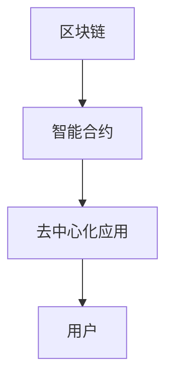

                 

关键词：区块链、智能合约、去中心化应用、以太坊、智能合约开发、应用场景

> 摘要：本文深入探讨了区块链智能合约的基本概念、核心原理、开发步骤以及其在去中心化应用中的重要地位。通过详细的算法原理解析、数学模型讲解、代码实例展示，分析了智能合约在金融、供应链、版权等领域的实际应用，并展望了其未来的发展趋势与挑战。

## 1. 背景介绍

### 区块链的兴起

区块链技术起源于2008年，由一位化名为“中本聪”（Satoshi Nakamoto）的人首次提出。作为比特币的底层技术，区块链旨在通过去中心化的方式实现价值传输，解决了传统金融体系中的信任问题。随着比特币的火爆，区块链技术逐渐被广泛关注，并引发了去中心化应用（DApps）的兴起。

### 去中心化应用的发展

去中心化应用，即DApps，是运行在区块链网络上的应用，通过智能合约实现去中心化的功能。与传统应用不同，DApps无需依赖于中心化的服务提供商，用户可以直接参与和应用互动。这种去中心化的特性，使得DApps在金融、供应链、版权等领域具有广泛的应用前景。

### 智能合约的崛起

智能合约是一种运行在区块链网络上的自执行合同，其代码被公开且无法篡改。智能合约的出现，使得去中心化应用成为可能，为区块链技术的广泛应用奠定了基础。

## 2. 核心概念与联系

### 智能合约的定义

智能合约是一种基于区块链技术的计算机程序，它能够在满足特定条件时自动执行。智能合约的核心在于其执行过程是透明的、不可篡改的，且无需信任第三方。

### 智能合约与区块链的关系

智能合约运行在区块链网络之上，利用区块链的去中心化和安全性特性，实现自执行和可信的合约执行。区块链为智能合约提供了一个不可篡改的账本，确保了合约的执行过程公正、透明。

### 智能合约与去中心化应用的关系

智能合约是去中心化应用的核心组成部分，它为DApps提供了自主执行功能的机制。通过智能合约，用户可以直接参与和应用互动，无需依赖中心化的服务提供商。

### Mermaid 流程图

下面是一个简单的智能合约与区块链的关系图，使用了Mermaid语法：



## 3. 核心算法原理 & 具体操作步骤

### 3.1 算法原理概述

智能合约的核心算法是基于密码学和安全计算的方法，确保合约的执行过程是透明的、不可篡改的。智能合约的执行过程通常包括以下步骤：

1. 条件判断：智能合约根据输入参数，判断是否满足执行条件。
2. 自动执行：如果条件满足，智能合约自动执行预定义的操作。
3. 结果记录：智能合约将执行结果记录在区块链上，确保透明性和不可篡改性。

### 3.2 算法步骤详解

1. **部署智能合约**

   在智能合约开发过程中，首先需要将智能合约代码编译为字节码，并将其部署到区块链上。部署智能合约的过程通常包括以下步骤：

   - 编写智能合约代码
   - 使用编译器将智能合约代码编译为字节码
   - 使用部署工具将字节码部署到区块链上

2. **调用智能合约**

   用户可以通过区块链网络调用智能合约，执行预定义的操作。调用智能合约的过程通常包括以下步骤：

   - 发送交易：用户通过区块链网络发送交易，调用智能合约。
   - 智能合约执行：智能合约根据交易内容执行预定义的操作。
   - 结果记录：智能合约将执行结果记录在区块链上。

### 3.3 算法优缺点

**优点：**

- 去中心化：智能合约运行在区块链网络之上，无需依赖中心化的服务提供商。
- 透明性：智能合约的执行过程是公开透明的，所有参与者均可查看。
- 不可篡改：智能合约的执行结果一旦记录在区块链上，即永久不可篡改。

**缺点：**

- 安全性风险：智能合约代码一旦发布，即无法修改。如果代码存在漏洞，可能导致合约资金被盗。
- 执行效率：智能合约的执行过程依赖于区块链网络的性能，可能存在一定的延迟。

### 3.4 算法应用领域

智能合约在金融、供应链、版权等领域具有广泛的应用前景。以下是一些具体的应用案例：

- **金融领域：** 智能合约可以用于实现去中心化的金融产品，如去中心化交易所、去中心化借贷平台等。
- **供应链领域：** 智能合约可以用于确保供应链的透明性和可信性，如追踪商品来源、验证产品质量等。
- **版权领域：** 智能合约可以用于实现数字版权管理，确保版权持有者的权益得到保护。

## 4. 数学模型和公式 & 详细讲解 & 举例说明

### 4.1 数学模型构建

智能合约的执行过程涉及到多个数学模型，包括密码学模型、图灵机模型等。以下是一个简单的数学模型构建示例：

设\( P \)为智能合约的输入参数，\( C \)为智能合约的代码，\( E \)为智能合约的执行环境。智能合约的执行过程可以表示为：

$$
P \rightarrow C(E)
$$

其中，\( C(E) \)表示智能合约在执行环境\( E \)下的执行结果。

### 4.2 公式推导过程

在智能合约执行过程中，需要计算多个参数，包括输入参数、执行结果等。以下是一个简单的公式推导过程：

设\( P \)为智能合约的输入参数，\( R \)为智能合约的执行结果。智能合约的执行结果\( R \)可以表示为：

$$
R = f(P)
$$

其中，\( f \)为智能合约的执行函数。

### 4.3 案例分析与讲解

以下是一个简单的智能合约案例，用于实现一个简单的投票系统。

```solidity
pragma solidity ^0.8.0;

contract Voting {
    mapping(address => bool) public voted;
    uint256 public totalVotes;
    string public candidate;

    function vote(string memory _candidate) public {
        require(!voted[msg.sender], "你已经投票了");
        voted[msg.sender] = true;
        candidate = _candidate;
        totalVotes++;
    }
}
```

在这个案例中，智能合约实现了以下功能：

- 记录用户的投票状态
- 记录总投票数
- 确定候选人的名字

通过这个案例，我们可以看到智能合约是如何通过数学模型和公式实现具体功能的。

## 5. 项目实践：代码实例和详细解释说明

### 5.1 开发环境搭建

要在区块链上开发智能合约，首先需要搭建开发环境。以下是搭建以太坊开发环境的基本步骤：

1. 安装Node.js和npm
2. 安装Truffle框架：`npm install -g truffle`
3. 初始化Truffle项目：`truffle init`
4. 安装Ganache：`npm install -g ganache-cli`
5. 启动本地以太坊节点：`ganache-cli`

### 5.2 源代码详细实现

以下是一个简单的智能合约示例，用于实现一个投票系统。

```solidity
pragma solidity ^0.8.0;

contract Voting {
    mapping(address => bool) public voted;
    uint256 public totalVotes;
    string public candidate;

    function vote(string memory _candidate) public {
        require(!voted[msg.sender], "你已经投票了");
        voted[msg.sender] = true;
        candidate = _candidate;
        totalVotes++;
    }
}
```

在这个示例中，我们定义了一个名为`Voting`的智能合约，包括以下属性和方法：

- `voted`：记录用户的投票状态
- `totalVotes`：记录总投票数
- `candidate`：记录候选人的名字
- `vote`：用于用户投票的方法

### 5.3 代码解读与分析

在这个示例中，智能合约的主要功能是通过`vote`方法实现用户的投票操作。以下是对代码的详细解读：

1. **pragma声明**：指定智能合约的编译版本
2. **mapping声明**：定义了三个映射变量，用于记录用户的投票状态、总投票数和候选人的名字
3. **vote函数**：用于用户投票，包括以下关键部分：
   - `require(!voted[msg.sender], "你已经投票了")`：检查用户是否已经投票，如果已经投票，则抛出错误信息
   - `voted[msg.sender] = true`：记录用户的投票状态为已投票
   - `candidate = _candidate`：更新候选人的名字
   - `totalVotes++`：增加总投票数

### 5.4 运行结果展示

在本地以太坊节点上部署并运行这个智能合约，用户可以通过调用`vote`方法实现投票操作。运行结果将记录在区块链上，确保投票结果的真实性和不可篡改性。

## 6. 实际应用场景

### 金融领域

在金融领域，智能合约可以用于实现去中心化的金融产品，如去中心化交易所、去中心化借贷平台等。通过智能合约，用户可以安全、便捷地进行金融交易，无需依赖中心化的服务提供商。

### 供应链领域

在供应链领域，智能合约可以用于确保供应链的透明性和可信性。通过智能合约，企业可以追踪商品来源、验证产品质量，提高供应链的效率和可信度。

### 版权领域

在版权领域，智能合约可以用于实现数字版权管理。通过智能合约，版权持有者可以方便地授权、转让和交易版权，确保版权权益得到保护。

## 7. 工具和资源推荐

### 7.1 学习资源推荐

1. 《区块链革命》
2. 《智能合约开发指南》
3. Ethereum官方文档

### 7.2 开发工具推荐

1. Truffle
2. Ganache
3. Remix

### 7.3 相关论文推荐

1. "Bitcoin: A Peer-to-Peer Electronic Cash System"
2. "The Ethereum Blockchain: A Technical Introduction"

## 8. 总结：未来发展趋势与挑战

### 8.1 研究成果总结

智能合约作为区块链技术的核心组成部分，已经取得了显著的成果。在金融、供应链、版权等领域，智能合约的应用案例不断涌现，为去中心化应用的发展提供了有力支持。

### 8.2 未来发展趋势

随着区块链技术的不断发展，智能合约将在更多领域得到应用。未来，智能合约的性能和安全性将进一步提高，成为区块链技术的重要组成部分。

### 8.3 面临的挑战

智能合约的发展仍面临一些挑战，包括：

- 安全性问题：智能合约代码一旦发布，即无法修改。如果代码存在漏洞，可能导致合约资金被盗。
- 执行效率：智能合约的执行过程依赖于区块链网络的性能，可能存在一定的延迟。

### 8.4 研究展望

针对面临的挑战，未来研究可以从以下几个方面展开：

- 提高智能合约的安全性，降低漏洞风险。
- 提高智能合约的执行效率，缩短执行时间。

## 9. 附录：常见问题与解答

### Q：什么是智能合约？
A：智能合约是一种运行在区块链网络上的计算机程序，能够在满足特定条件时自动执行。智能合约的核心在于其执行过程是透明的、不可篡改的，且无需信任第三方。

### Q：智能合约有哪些应用场景？
A：智能合约在金融、供应链、版权等领域具有广泛的应用前景。具体应用包括去中心化金融产品、供应链透明性保障、数字版权管理等。

### Q：如何开发智能合约？
A：开发智能合约需要掌握区块链技术、智能合约开发框架（如Truffle）和相关编程语言（如Solidity）。开发过程主要包括编写智能合约代码、编译、部署等步骤。

作者：禅与计算机程序设计艺术 / Zen and the Art of Computer Programming
----------------------------------------------------------------


