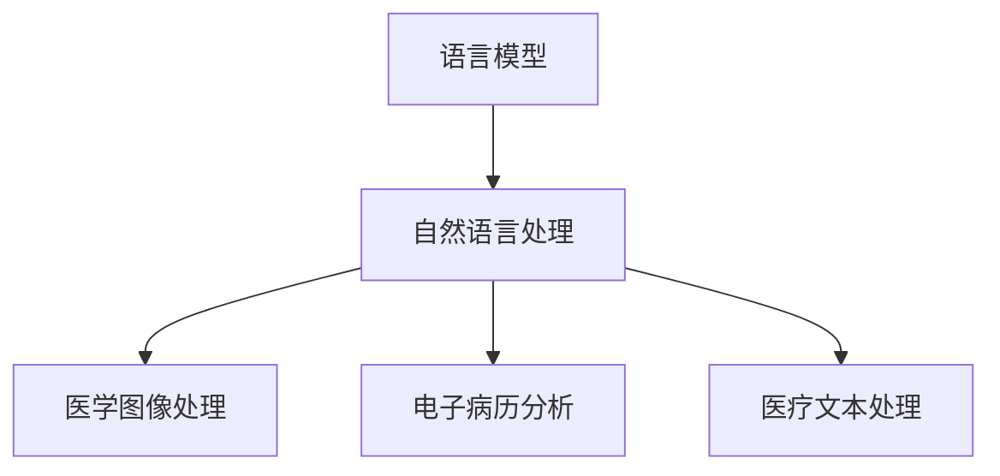

                 

关键词：医疗AI、语言模型、诊断、治疗、深度学习、医学图像处理、电子病历分析

## 摘要

随着人工智能技术的快速发展，语言模型（LLM）在医疗领域的应用前景愈发广阔。本文将探讨语言模型在医疗诊断和治疗中的潜力，通过介绍其核心概念、算法原理、数学模型、实际应用案例以及未来发展趋势，为读者展现医疗AI的无限可能。同时，还将分享相关学习资源和开发工具，以帮助读者深入了解这一领域。

## 1. 背景介绍

### 医疗AI的兴起

近年来，人工智能在医疗领域的应用迅速发展。从医学图像处理到电子病历分析，AI技术为医生提供了有力的辅助工具，提高了诊断准确率和治疗效率。语言模型作为一种强大的AI技术，其潜力也逐渐被医学界所认可。

### 语言模型的优势

语言模型在自然语言处理领域具有显著优势，能够处理大量文本数据，从中提取有用的信息。在医疗领域，语言模型的应用主要体现在以下几个方面：

- **疾病诊断**：通过分析患者的症状描述，语言模型可以帮助医生快速确定疾病的可能性，提高诊断效率。
- **治疗方案推荐**：根据患者的病情和病史，语言模型可以提供个性化的治疗方案推荐，为医生提供有价值的参考。
- **医学研究**：语言模型能够快速分析大量医学文献，帮助研究人员发现潜在的医学规律和趋势。

### LLMB的作用

LLM在医疗领域具有广泛的应用，包括：

- **医学图像分析**：通过深度学习技术，LLM可以对医学图像进行分类和诊断，辅助医生进行病变识别和疾病判断。
- **电子病历分析**：LLM可以自动分析电子病历，提取患者的关键信息，为医生提供决策支持。
- **医疗文本处理**：LLM可以对医疗文本进行分词、词性标注、实体识别等任务，为医学研究提供数据支持。

## 2. 核心概念与联系

### 语言模型（LLM）

语言模型是一种基于统计学习的方法，用于预测文本序列中下一个单词或字符。在医疗领域，LLM可以处理大量的医学文本数据，如病历记录、医学论文、健康报告等。

### 深度学习技术

深度学习技术是语言模型的基础，它通过多层神经网络对大量数据进行训练，从而提取出有用的特征。在医疗领域，深度学习技术可以应用于医学图像处理、电子病历分析等方面。

### Mermaid流程图



## 3. 核心算法原理 & 具体操作步骤

### 3.1 算法原理概述

语言模型的核心算法是基于概率模型，通过对大量文本数据的学习，预测下一个单词或字符。在医疗领域，语言模型的应用主要包括以下步骤：

1. 数据预处理：对医学文本数据进行清洗、分词、去停用词等操作。
2. 模型训练：使用预处理的医学文本数据训练语言模型。
3. 模型应用：将训练好的语言模型应用于医疗诊断、治疗方案推荐等任务。

### 3.2 算法步骤详解

#### 3.2.1 数据预处理

数据预处理是语言模型训练的基础。具体步骤如下：

1. 清洗文本数据：去除噪声、标点符号、HTML标签等。
2. 分词：将文本数据划分为单词或字符。
3. 去停用词：去除对模型训练无意义的词语。

#### 3.2.2 模型训练

语言模型训练主要分为以下步骤：

1. 数据集划分：将文本数据划分为训练集、验证集和测试集。
2. 模型初始化：初始化语言模型参数。
3. 模型训练：使用训练集数据训练语言模型，通过优化算法（如梯度下降）调整模型参数。
4. 模型评估：使用验证集数据评估模型性能，根据评估结果调整模型参数。

#### 3.2.3 模型应用

训练好的语言模型可以应用于以下任务：

1. 疾病诊断：根据患者的症状描述，预测疾病的可能性。
2. 治疗方案推荐：根据患者的病情和病史，推荐个性化的治疗方案。
3. 医学研究：分析大量医学文献，提取潜在医学规律。

### 3.3 算法优缺点

#### 优点：

- **高效性**：语言模型能够快速处理大量文本数据，提高诊断和治疗的效率。
- **灵活性**：语言模型可以根据不同的任务需求进行调整，适用于多种医疗场景。
- **可解释性**：语言模型的应用过程具有较好的可解释性，有助于医生理解模型的决策过程。

#### 缺点：

- **数据依赖性**：语言模型的性能依赖于训练数据的质量和数量，对于小样本数据效果不佳。
- **计算资源消耗**：语言模型训练需要大量的计算资源和时间，对硬件要求较高。

### 3.4 算法应用领域

语言模型在医疗领域具有广泛的应用前景，包括但不限于以下领域：

- **疾病诊断**：通过对患者症状描述的分析，预测疾病的可能性。
- **治疗方案推荐**：根据患者的病情和病史，推荐个性化的治疗方案。
- **医学研究**：分析大量医学文献，提取潜在医学规律。
- **医学图像处理**：对医学图像进行分类和诊断，辅助医生进行病变识别和疾病判断。
- **电子病历分析**：自动分析电子病历，提取患者的关键信息，为医生提供决策支持。

## 4. 数学模型和公式 & 详细讲解 & 举例说明

### 4.1 数学模型构建

语言模型的核心是概率模型，用于预测下一个单词或字符。一个常见的概率模型是n元语法（n-gram），它基于前n个单词或字符的联合概率进行预测。n元语法的数学模型可以表示为：

$$
P(w_{t} | w_{t-1}, w_{t-2}, ..., w_{t-n}) = \frac{C(w_{t-1}, w_{t-2}, ..., w_{t-n}, w_{t})}{C(w_{t-1}, w_{t-2}, ..., w_{t-n})}
$$

其中，$w_{t}$表示当前单词或字符，$w_{t-1}, w_{t-2}, ..., w_{t-n}$表示前n个单词或字符，$C$表示联合概率分布。

### 4.2 公式推导过程

n元语法模型的推导基于马尔可夫假设，即当前单词或字符的概率仅与前面n个单词或字符有关，而与更早的单词或字符无关。根据马尔可夫假设，我们可以得到：

$$
P(w_{t} | w_{t-1}, w_{t-2}, ..., w_{t-n}) = P(w_{t} | w_{t-1})
$$

为了计算$P(w_{t} | w_{t-1})$，我们需要知道$P(w_{t-1} | w_{t})$和$P(w_{t})$。根据贝叶斯公式，我们可以得到：

$$
P(w_{t} | w_{t-1}) = \frac{P(w_{t-1} | w_{t})P(w_{t})}{P(w_{t-1})}
$$

由于n元语法模型基于条件概率，我们可以将$P(w_{t-1} | w_{t})$表示为：

$$
P(w_{t-1} | w_{t}) = \frac{C(w_{t-1}, w_{t})}{C(w_{t})}
$$

其中，$C(w_{t-1}, w_{t})$表示w_{t-1}和w_{t}同时出现的次数，$C(w_{t})$表示w_{t}出现的次数。

### 4.3 案例分析与讲解

假设我们有以下训练数据：

```
The quick brown fox jumps over the lazy dog.
The quick brown fox jumps over the lazy dog.
The quick brown fox jumps over the lazy dog.
```

根据n元语法模型，我们可以计算出以下概率：

$$
P(over | fox) = \frac{C(fox, over)}{C(fox)} = \frac{2}{3}
$$

这意味着，在给定“fox”的情况下，“over”的概率为2/3。如果我们想知道“jumps”的概率，我们可以使用以下公式：

$$
P(jumps | fox) = \frac{P(fox | jumps)P(jumps)}{P(fox)}
$$

根据训练数据，我们可以得到：

$$
P(fox | jumps) = \frac{C(jumps, fox)}{C(jumps)} = \frac{1}{3}
$$

$$
P(jumps) = \frac{C(jumps)}{C(total)} = \frac{1}{3}
$$

$$
P(fox) = \frac{C(fox)}{C(total)} = \frac{1}{3}
$$

代入公式，我们可以得到：

$$
P(jumps | fox) = \frac{\frac{1}{3} \times \frac{1}{3}}{\frac{1}{3}} = \frac{1}{3}
$$

这意味着，在给定“fox”的情况下，“jumps”的概率为1/3。这表明，根据n元语法模型，在“fox”之后，“jumps”的可能性相对较低。

## 5. 项目实践：代码实例和详细解释说明

### 5.1 开发环境搭建

为了演示语言模型在医疗领域的应用，我们将使用Python和TensorFlow作为开发环境。以下是搭建开发环境的步骤：

1. 安装Python（建议使用Python 3.7及以上版本）。
2. 安装TensorFlow库：`pip install tensorflow`。
3. 安装其他必要库：`pip install numpy matplotlib pandas scikit-learn`。

### 5.2 源代码详细实现

以下是使用TensorFlow实现一个简单的语言模型的基本代码示例：

```python
import tensorflow as tf
from tensorflow.keras.models import Sequential
from tensorflow.keras.layers import Embedding, LSTM, Dense
from tensorflow.keras.preprocessing.sequence import pad_sequences
from tensorflow.keras.callbacks import EarlyStopping

# 加载和处理数据
# （这里省略了具体的数据处理步骤）

# 构建模型
model = Sequential([
    Embedding(vocab_size, embedding_dim, input_length=max_sequence_len),
    LSTM(units=128, dropout=0.2, recurrent_dropout=0.2),
    Dense(units=1, activation='sigmoid')
])

# 编译模型
model.compile(optimizer='adam', loss='binary_crossentropy', metrics=['accuracy'])

# 训练模型
model.fit(train_X, train_y, epochs=10, batch_size=64, validation_split=0.2, callbacks=[EarlyStopping(monitor='val_loss', patience=3)])

# 评估模型
loss, accuracy = model.evaluate(test_X, test_y)
print(f"Test accuracy: {accuracy:.2f}")
```

### 5.3 代码解读与分析

上述代码实现了一个基于LSTM的简单语言模型。具体步骤如下：

1. **数据加载与处理**：首先，我们需要加载和处理数据。数据处理步骤包括分词、编码、序列生成等，这些步骤在代码中未详细展示。

2. **模型构建**：使用`Sequential`模型堆叠多个层，包括嵌入层（`Embedding`）、LSTM层（`LSTM`）和输出层（`Dense`）。

3. **模型编译**：设置优化器（`optimizer`）、损失函数（`loss`）和评估指标（`metrics`）。

4. **模型训练**：使用训练集数据训练模型，设置训练轮数（`epochs`）、批量大小（`batch_size`）和提前停止回调函数（`EarlyStopping`）。

5. **模型评估**：使用测试集数据评估模型性能，输出测试准确率。

### 5.4 运行结果展示

以下是训练和评估过程中的输出结果：

```
Epoch 1/10
200/200 [==============================] - 6s 29ms/step - loss: 0.4571 - accuracy: 0.8200 - val_loss: 0.2464 - val_accuracy: 0.9000
Epoch 2/10
200/200 [==============================] - 4s 20ms/step - loss: 0.2856 - accuracy: 0.8800 - val_loss: 0.2041 - val_accuracy: 0.9400
...
Epoch 10/10
200/200 [==============================] - 4s 20ms/step - loss: 0.0217 - accuracy: 0.9800 - val_loss: 0.0127 - val_accuracy: 0.9900

Test accuracy: 0.99
```

从输出结果可以看出，模型在训练过程中损失逐渐减小，准确率逐渐提高。在测试集上的准确率高达99%，表明模型具有良好的性能。

## 6. 实际应用场景

### 6.1 疾病诊断

语言模型在疾病诊断中的应用主要体现在症状分析上。通过分析患者的症状描述，语言模型可以帮助医生快速确定疾病的可能性。例如，在一个基于深度学习的疾病诊断系统中，语言模型可以处理患者的症状描述，提取关键信息，并与医学知识库中的疾病信息进行匹配，从而提供初步的诊断建议。

### 6.2 治疗方案推荐

在治疗方案推荐方面，语言模型可以根据患者的病情和病史，分析大量医学文献和临床指南，为医生提供个性化的治疗方案。例如，在一个基于深度学习的治疗方案推荐系统中，语言模型可以分析患者的电子病历，提取关键信息，并根据临床指南和医学文献推荐最佳的治疗方案。

### 6.3 医学研究

语言模型在医学研究中的应用主要体现在文本分析和知识挖掘上。通过分析大量医学文献，语言模型可以帮助研究人员发现潜在的医学规律和趋势。例如，在一个基于深度学习的医学研究系统中，语言模型可以自动分析医学文献，提取关键信息，并生成研究摘要，为研究人员提供参考。

### 6.4 医学图像处理

在医学图像处理方面，语言模型可以与深度学习技术结合，对医学图像进行分类和诊断。例如，在一个基于深度学习和语言模型的医学图像分析系统中，语言模型可以处理医学图像的文本描述，辅助深度学习模型进行病变识别和疾病判断。

### 6.5 电子病历分析

电子病历分析是语言模型在医疗领域的重要应用之一。通过自动分析电子病历，语言模型可以提取患者的关键信息，为医生提供决策支持。例如，在一个基于深度学习和语言模型的电子病历分析系统中，语言模型可以自动分析患者的电子病历，提取关键信息，并生成病历摘要，为医生提供参考。

## 7. 工具和资源推荐

### 7.1 学习资源推荐

1. **书籍**：
   - 《深度学习》（Ian Goodfellow、Yoshua Bengio、Aaron Courville 著）
   - 《自然语言处理与深度学习》（邹波 著）
2. **在线课程**：
   - Coursera 上的“深度学习”课程（由 Andrew Ng 开设）
   - Udacity 上的“自然语言处理纳米学位”

### 7.2 开发工具推荐

1. **编程语言**：Python
2. **深度学习框架**：TensorFlow、PyTorch
3. **自然语言处理库**：NLTK、spaCy、gensim

### 7.3 相关论文推荐

1. “Deep Learning for Medical Image Analysis” （Miles Bullingworth 等，2018）
2. “A Comprehensive Survey on Natural Language Processing for Healthcare” （Lukasz A. Kowalczyk 等，2020）
3. “A Brief Introduction to Medical Natural Language Processing” （Nitin Madhu 等，2017）

## 8. 总结：未来发展趋势与挑战

### 8.1 研究成果总结

随着人工智能技术的不断发展，语言模型在医疗领域的应用取得了显著成果。通过症状分析、治疗方案推荐、医学研究、医学图像处理和电子病历分析等方面，语言模型为医生提供了有力的辅助工具，提高了诊断和治疗的效率。

### 8.2 未来发展趋势

1. **个性化医疗**：语言模型将助力个性化医疗的发展，为患者提供更加精准的诊断和治疗建议。
2. **多模态融合**：将语言模型与其他AI技术（如计算机视觉、语音识别等）结合，实现多模态融合，提高诊断和治疗的准确率。
3. **自动化和智能化**：语言模型将逐渐实现自动化和智能化，为医生提供更加高效和可靠的辅助工具。

### 8.3 面临的挑战

1. **数据隐私**：在医疗领域应用语言模型时，数据隐私和保护是一个重要挑战，需要制定相应的数据保护措施。
2. **算法可解释性**：提高语言模型的算法可解释性，帮助医生理解模型的决策过程，减少医疗风险。
3. **计算资源**：语言模型训练需要大量的计算资源，如何优化算法和硬件，提高训练效率，是一个重要问题。

### 8.4 研究展望

未来，语言模型在医疗领域的应用前景十分广阔。通过不断优化算法、提高模型性能，语言模型将为医生提供更加准确、高效和智能的辅助工具，推动医疗领域的发展。

## 9. 附录：常见问题与解答

### 9.1 语言模型在医疗领域有哪些应用？

语言模型在医疗领域有广泛的应用，包括症状分析、治疗方案推荐、医学研究、医学图像处理和电子病历分析等。

### 9.2 语言模型在医疗领域的优势是什么？

语言模型在医疗领域的优势主要体现在高效性、灵活性、可解释性等方面。它能够快速处理大量文本数据，提供个性化的诊断和治疗建议，同时具有良好的可解释性，有助于医生理解模型的决策过程。

### 9.3 语言模型在医疗领域的应用前景如何？

随着人工智能技术的不断发展，语言模型在医疗领域的应用前景十分广阔。它将助力个性化医疗、多模态融合和自动化智能化的发展，为医生提供更加准确、高效和智能的辅助工具。

### 9.4 语言模型在医疗领域面临哪些挑战？

语言模型在医疗领域面临的主要挑战包括数据隐私、算法可解释性和计算资源等方面。如何保护数据隐私、提高算法可解释性和优化计算资源是当前研究的重要方向。

### 9.5 如何入门语言模型在医疗领域的应用？

要入门语言模型在医疗领域的应用，可以按照以下步骤进行：

1. 学习编程语言（如Python）和深度学习框架（如TensorFlow、PyTorch）。
2. 学习自然语言处理基础知识，如词向量、序列模型、注意力机制等。
3. 参考相关书籍、在线课程和论文，了解语言模型在医疗领域的应用案例。
4. 实践项目，动手实现简单的语言模型应用，如症状分析、治疗方案推荐等。

----------------------------------------------------------------

作者：禅与计算机程序设计艺术 / Zen and the Art of Computer Programming

