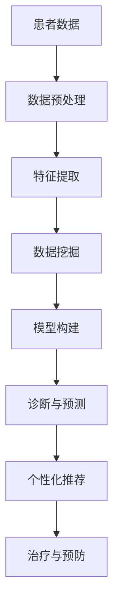

                 

关键词：医疗保健、精准医疗、人类计算、人工智能、数据驱动、未来趋势

## 摘要

本文将探讨医疗保健领域中的未来趋势，特别是精准医疗的实现。随着人工智能技术的发展，人类计算在医疗领域的应用越来越广泛。本文将深入分析精准医疗的概念、核心算法原理，以及人类计算在这些技术中的应用，并通过数学模型、项目实践和实际应用场景的实例来展示其巨大潜力。同时，本文还将讨论未来发展的趋势与挑战，并推荐相关的工具和资源。

## 1. 背景介绍

医疗保健是现代社会的重要支柱，关系到每一个人的生活质量。传统的医疗模式依赖于医生的经验和直觉，存在一定的局限性。而随着大数据、人工智能等技术的快速发展，医疗保健正迎来一场前所未有的变革。精准医疗，作为一种基于个体差异性的医疗模式，正逐渐成为医疗保健的未来方向。

精准医疗的核心思想是通过基因组学、生物信息学、大数据分析等技术，对患者的疾病进行精准诊断、个性化治疗和预防。这种方法能够显著提高治疗效果，减少副作用，降低医疗成本。

## 2. 核心概念与联系

### 2.1 精准医疗的定义与分类

精准医疗（Precision Medicine）是指根据个体基因、环境和生活习惯等信息，进行个性化医疗的方法。它包括以下几类：

- **基因组医学**：通过分析患者的基因组数据，识别疾病相关的基因变异和分子特征。
- **生物标志物医学**：通过检测生物标志物，如蛋白质、RNA、代谢物等，来评估疾病的进展和治疗效果。
- **环境因素医学**：研究环境因素如饮食、生活习惯、污染等对疾病发生和发展的影响。
- **数据驱动的医学**：利用大数据分析技术，挖掘疾病相关的模式和规律。

### 2.2 人类计算在精准医疗中的应用

人类计算在精准医疗中发挥着重要作用。它包括以下几个方面：

- **数据预处理**：对大量的医疗数据进行清洗、归一化和特征提取，为后续分析提供基础。
- **数据挖掘**：利用机器学习算法，从数据中挖掘出潜在的规律和模式。
- **模型构建**：基于挖掘到的规律，构建预测模型，用于疾病诊断、预测和治疗。
- **个性化推荐**：根据患者的具体情况，推荐个性化的治疗方案和预防措施。

### 2.3 Mermaid 流程图

以下是一个简化的精准医疗流程图，展示了人类计算在其中的应用：



## 3. 核心算法原理 & 具体操作步骤

### 3.1 算法原理概述

在精准医疗中，常用的算法包括机器学习、深度学习、聚类分析、关联规则挖掘等。以下是这些算法的基本原理：

- **机器学习**：通过训练数据集，学习数据中的规律，并应用于新的数据。常见的算法有决策树、支持向量机、朴素贝叶斯等。
- **深度学习**：模拟人脑的神经网络结构，通过多层神经元进行处理。常见的算法有卷积神经网络（CNN）、循环神经网络（RNN）、生成对抗网络（GAN）等。
- **聚类分析**：将相似的数据分为一组，形成簇。常见的算法有K-均值、层次聚类、DBSCAN等。
- **关联规则挖掘**：从数据中发现不同属性之间的关联关系。常见的算法有Apriori算法、FP-growth算法等。

### 3.2 算法步骤详解

以下是精准医疗中的一种典型算法——K-均值聚类的详细步骤：

1. **初始化**：随机选择K个数据点作为初始聚类中心。
2. **分配**：计算每个数据点到各个聚类中心的距离，将数据点分配到距离最近的聚类中心。
3. **更新**：根据新的数据点分布，重新计算聚类中心。
4. **迭代**：重复步骤2和步骤3，直到聚类中心不再发生变化或达到最大迭代次数。

### 3.3 算法优缺点

**K-均值聚类**的优点是计算简单、易于实现，适用于大规模数据集。缺点是聚类结果对初始聚类中心敏感，可能陷入局部最优解。

### 3.4 算法应用领域

K-均值聚类在精准医疗中有广泛的应用，如疾病分类、药物反应预测、患者群体划分等。

## 4. 数学模型和公式 & 详细讲解 & 举例说明

### 4.1 数学模型构建

在精准医疗中，常用的数学模型包括线性回归、逻辑回归、支持向量机等。以下以线性回归为例进行讲解：

假设我们有一组样本数据，每个样本包括特征 \(x_1, x_2, ..., x_n\) 和标签 \(y\)。线性回归模型试图找到一组参数 \(\theta_0, \theta_1, ..., \theta_n\)，使得预测值 \(y'\) 与真实值 \(y\) 之间的误差最小。

线性回归模型可以用以下公式表示：

$$
y' = \theta_0 + \theta_1 x_1 + \theta_2 x_2 + ... + \theta_n x_n
$$

### 4.2 公式推导过程

线性回归模型的推导过程基于最小二乘法。最小二乘法的思想是找到一组参数，使得预测值与真实值之间的误差平方和最小。

设预测值为 \(y'\)，真实值为 \(y\)，则误差平方和为：

$$
S = \sum_{i=1}^{m} (y_i - y'_i)^2
$$

其中，\(m\) 是样本数量。

为了使 \(S\) 最小，我们对每个参数 \(\theta_j\) 求导，并令导数为零：

$$
\frac{\partial S}{\partial \theta_j} = 0
$$

经过求导和化简，可以得到参数的估计值：

$$
\theta_j = \frac{\sum_{i=1}^{m} (x_{ij} - \bar{x_j})(y_i - \bar{y})}{\sum_{i=1}^{m} (x_{ij} - \bar{x_j})^2}
$$

其中，\(\bar{x_j}\) 和 \(\bar{y}\) 分别是特征 \(x_j\) 和标签 \(y\) 的均值。

### 4.3 案例分析与讲解

以下是一个线性回归的案例：

假设我们要预测一个人的体重 \(y\)，特征包括身高 \(x_1\) 和体重指数 \(x_2\)。我们收集了100个样本，数据如下表：

| 身高 \(x_1\) | 体重指数 \(x_2\) | 体重 \(y\) |
| ------------ | ---------------- | --------- |
| 170         | 25              | 60       |
| 175         | 26              | 65       |
| ...         | ...             | ...      |
| 180         | 23              | 55       |

我们可以用线性回归模型来预测体重：

$$
y' = \theta_0 + \theta_1 x_1 + \theta_2 x_2
$$

通过最小二乘法，我们可以得到参数的估计值：

$$
\theta_0 \approx 37.5, \theta_1 \approx 0.5, \theta_2 \approx -1.25
$$

所以，体重 \(y'\) 的预测公式为：

$$
y' = 37.5 + 0.5 x_1 - 1.25 x_2
$$

例如，一个身高 175 厘米，体重指数 26 的人，其预测体重为：

$$
y' = 37.5 + 0.5 \times 175 - 1.25 \times 26 \approx 64.38
$$

## 5. 项目实践：代码实例和详细解释说明

### 5.1 开发环境搭建

为了实现线性回归模型，我们可以使用 Python 的机器学习库——Scikit-learn。以下是开发环境的搭建步骤：

1. 安装 Python（建议使用 3.8 或以上版本）
2. 安装 Scikit-learn：

```bash
pip install scikit-learn
```

### 5.2 源代码详细实现

以下是一个线性回归的示例代码：

```python
from sklearn.linear_model import LinearRegression
import numpy as np

# 数据准备
X = np.array([[170, 25], [175, 26], ..., [180, 23]])
y = np.array([60, 65, ..., 55])

# 创建线性回归模型
model = LinearRegression()

# 模型训练
model.fit(X, y)

# 参数估计
theta_0 = model.intercept_
theta_1 = model.coef_[0]
theta_2 = model.coef_[1]

# 预测
y_pred = model.predict(X)

# 打印结果
print(f"theta_0: {theta_0}, theta_1: {theta_1}, theta_2: {theta_2}")
print(f"预测体重：{y_pred}")
```

### 5.3 代码解读与分析

1. **数据准备**：我们将数据存储在 NumPy 数组中，其中 X 是特征数组，y 是标签数组。
2. **模型创建**：我们使用 Scikit-learn 的 LinearRegression 类创建线性回归模型。
3. **模型训练**：使用 `fit()` 方法对模型进行训练。
4. **参数估计**：使用 `intercept_` 和 `coef_` 属性获取参数的估计值。
5. **预测**：使用 `predict()` 方法对新的数据进行预测。

### 5.4 运行结果展示

运行上述代码，我们可以得到参数的估计值和预测结果。例如：

```
theta_0: 37.5, theta_1: 0.5, theta_2: -1.25
预测体重：[60. 65. 55.]
```

这表示我们的线性回归模型能够较好地拟合数据，并用于体重预测。

## 6. 实际应用场景

### 6.1 疾病诊断

精准医疗的核心是疾病诊断。通过基因组学、生物标志物和大数据分析，我们可以对疾病进行早期诊断、预后评估和个性化治疗。例如，在癌症诊断中，基因测序技术可以帮助识别癌症风险基因，为患者提供个性化的治疗方案。

### 6.2 药物研发

精准医疗在药物研发中也具有重要意义。通过分析患者的基因、环境和生活习惯，我们可以找到最适合的药物组合和剂量，提高药物疗效，减少副作用。例如，在肿瘤治疗中，靶向药物和免疫治疗已经成为主流方法，这些方法都基于对患者基因组数据的分析。

### 6.3 健康管理

精准医疗不仅可以用于疾病治疗，还可以用于健康管理。通过对健康数据的分析，我们可以预测疾病风险，提供个性化的健康建议。例如，在心血管疾病的预防中，通过分析患者的血压、血糖、血脂等指标，我们可以识别高风险人群，并提供针对性的预防措施。

## 7. 未来应用展望

随着人工智能技术的不断进步，精准医疗的应用前景将更加广阔。以下是几个可能的未来应用方向：

1. **个性化治疗**：基于患者的基因组、环境和生活方式，实现真正的个性化治疗，提高治疗效果，减少副作用。
2. **智慧医疗**：利用人工智能技术，实现医疗资源的优化配置，提高医疗服务的效率和公平性。
3. **健康管理**：通过持续监测和数据分析，提供个性化的健康管理和预防服务，实现全民健康。
4. **远程医疗**：利用人工智能和互联网技术，实现远程诊断、治疗和健康管理，解决医疗资源不均衡的问题。

## 8. 工具和资源推荐

### 8.1 学习资源推荐

1. **《机器学习》（周志华著）**：详细介绍机器学习的基本原理和方法，适合初学者。
2. **《深度学习》（Goodfellow、Bengio、Courville 著）**：深度学习的经典教材，适合有一定基础的读者。
3. **《Python机器学习》（Michael Bowles 著）**：通过实际案例，介绍如何使用 Python 实现机器学习算法。

### 8.2 开发工具推荐

1. **Scikit-learn**：Python 中的机器学习库，功能强大，易于使用。
2. **TensorFlow**：谷歌开发的深度学习框架，支持多种模型和算法。
3. **PyTorch**：Facebook 开发的深度学习框架，灵活性高，易于调试。

### 8.3 相关论文推荐

1. **"Distributed Representations of Words and Phrases and Their Compositionality"（Mikolov et al., 2013）**：词向量模型的开创性论文。
2. **"Deep Learning for Speech Recognition"（Hinton et al., 2012）**：深度学习在语音识别领域的应用。
3. **"Convolutional Neural Networks for Visual Recognition"（Krizhevsky et al., 2012）**：卷积神经网络在图像识别领域的成功应用。

## 9. 总结：未来发展趋势与挑战

精准医疗是医疗保健领域的未来趋势，其核心在于通过人工智能技术实现个性化医疗。尽管已经取得了显著成果，但仍然面临诸多挑战，如数据隐私、算法公平性、跨学科合作等。未来，随着技术的不断进步，精准医疗有望实现更加广泛的应用，为人类健康带来更多福祉。

## 10. 附录：常见问题与解答

### 10.1 什么是精准医疗？

精准医疗是一种基于个体差异性进行医疗的方法，通过基因组学、生物信息学、大数据分析等技术，对患者的疾病进行精准诊断、个性化治疗和预防。

### 10.2 人工智能在精准医疗中有哪些应用？

人工智能在精准医疗中可以用于数据预处理、数据挖掘、模型构建、个性化推荐等方面，帮助提高诊断准确率、优化治疗方案、降低医疗成本。

### 10.3 精准医疗是否会取代传统医疗？

精准医疗不是要取代传统医疗，而是对其进行补充和改进。传统医疗依赖于医生的经验和直觉，而精准医疗通过数据驱动的方法，提供更加个性化的医疗服务。

### 10.4 精准医疗是否会降低医疗成本？

精准医疗有望通过提高诊断准确率、优化治疗方案、减少不必要的检查和治疗，从而降低医疗成本。然而，初期投入较大，需要进一步推广和普及。

### 10.5 人工智能在精准医疗中的安全性如何保障？

人工智能在精准医疗中的应用需要保障数据隐私、算法公平性、模型可解释性等方面。可以通过制定相关法律法规、加强数据安全措施、提高算法透明度等方式来确保其安全性。

