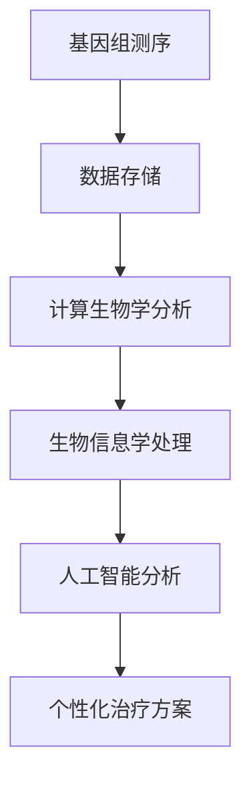

                 

关键词：医疗保健、精准医疗、人工智能、深度学习、基因组学、计算生物学

> 摘要：随着医疗科技的飞速发展，医疗保健领域正迎来一场深刻的变革。本文将探讨如何通过人类计算与人工智能技术相结合，推动精准医疗的发展，提升疾病诊断和治疗的效果，实现个性化医疗的目标。

## 1. 背景介绍

医疗保健是关乎人类健康与生存的重要领域，随着人口老龄化、慢性病高发等问题的日益严峻，医疗保健的需求也在不断增加。然而，传统的医疗模式面临着诸多挑战，如医疗资源分配不均、疾病诊断不准确、治疗方案个性化不足等。为了解决这些问题，精准医疗应运而生。

精准医疗是一种以个体为核心，利用基因组学、蛋白质组学、代谢组学等多组学数据，结合临床信息和人工智能技术，为患者提供个性化医疗服务的模式。它不仅能够提高疾病诊断的准确性，还能根据患者的基因特征制定最优的治疗方案，从而提高治疗效果，降低医疗成本。

## 2. 核心概念与联系

### 2.1. 核心概念

- **基因组学**：研究基因的组成、结构、功能及其相互作用的一门科学。基因组的测序和分析是精准医疗的重要基础。
- **计算生物学**：运用计算机科学和数学方法研究生物系统的一门交叉学科。计算生物学在基因数据分析、药物设计、疾病预测等方面发挥着重要作用。
- **人工智能**：模拟人类智能行为的计算机技术。在医疗领域，人工智能技术被广泛应用于疾病诊断、治疗方案制定、健康管理等各个方面。

### 2.2. 核心概念联系

精准医疗的发展离不开基因组学、计算生物学和人工智能的紧密合作。基因组学提供了个体遗传信息的详细数据，计算生物学将这些数据转化为生物学和医学知识，而人工智能则通过算法和模型对这些知识进行深入分析，从而实现个性化医疗服务。

### 2.3. Mermaid 流程图



## 3. 核心算法原理 & 具体操作步骤

### 3.1. 算法原理概述

精准医疗的核心在于从海量基因组数据中提取有价值的信息，为患者提供个性化的医疗建议。这一过程主要依赖于以下算法：

- **基因组比对**：将测序得到的短读序列与参考基因组进行比对，识别出变异位点。
- **基因表达分析**：分析基因在不同细胞类型或不同疾病状态下的表达情况。
- **蛋白质结构预测**：根据基因序列预测蛋白质的三维结构，进而推断蛋白质的功能。
- **机器学习模型**：利用机器学习算法分析基因与疾病之间的关系，构建疾病预测模型。

### 3.2. 算法步骤详解

1. **数据收集**：从基因组数据库或实验室测序数据中获取患者的基因组信息。
2. **基因组比对**：使用比对算法（如BLAST、BWA）将测序数据与参考基因组进行比对，识别变异位点。
3. **基因表达分析**：使用微阵列技术或RNA测序数据分析基因在不同细胞类型或不同疾病状态下的表达情况。
4. **蛋白质结构预测**：使用生物信息学工具（如Phyre2、I-TASSER）预测蛋白质的三维结构。
5. **机器学习模型**：使用监督学习、无监督学习等机器学习算法分析基因与疾病之间的关系，构建疾病预测模型。

### 3.3. 算法优缺点

**优点**：

- 提高疾病诊断的准确性。
- 实现个性化治疗方案。
- 降低医疗成本。

**缺点**：

- 数据处理复杂，需要大量计算资源。
- 病例数据不足可能导致模型泛化能力不足。

### 3.4. 算法应用领域

- **癌症诊断与治疗**：利用基因组学和人工智能技术对癌症进行早期诊断和个性化治疗。
- **遗传病诊断**：通过基因测序和计算生物学分析，对遗传病进行诊断和风险评估。
- **药物设计**：利用蛋白质结构预测和机器学习模型，加速新药的发现和开发。

## 4. 数学模型和公式 & 详细讲解 & 举例说明

### 4.1. 数学模型构建

在精准医疗中，常见的数学模型包括：

- **决策树**：用于分类和回归分析，可以根据输入的特征变量对样本进行分类或预测。
- **神经网络**：用于构建复杂的非线性模型，可以处理高维数据和非线性关系。
- **支持向量机**：用于分类问题，可以找到最佳的超平面将不同类别的样本分开。

### 4.2. 公式推导过程

以决策树为例，其基本公式为：

$$
\hat{y} = g(\sum_{i=1}^{n} w_i x_i + b)
$$

其中，\( \hat{y} \) 为预测值，\( g() \) 为激活函数，\( w_i \) 和 \( b \) 为模型参数。

### 4.3. 案例分析与讲解

假设我们要构建一个疾病诊断模型，输入特征包括年龄、性别、血压等。我们可以使用决策树算法进行训练，然后对新的患者数据进行预测。

- **数据准备**：收集一定数量的患者数据，包括特征和疾病状态。
- **模型训练**：使用训练数据训练决策树模型，确定每个节点的分割方式。
- **模型评估**：使用验证数据评估模型的性能，调整模型参数。
- **疾病预测**：使用训练好的模型对新的患者数据进行预测。

## 5. 项目实践：代码实例和详细解释说明

### 5.1. 开发环境搭建

- **编程语言**：Python
- **依赖库**：NumPy、Pandas、Scikit-learn

### 5.2. 源代码详细实现

```python
import numpy as np
import pandas as pd
from sklearn.tree import DecisionTreeClassifier
from sklearn.model_selection import train_test_split
from sklearn.metrics import accuracy_score

# 数据准备
data = pd.read_csv('patient_data.csv')
X = data.drop('disease', axis=1)
y = data['disease']

# 模型训练
X_train, X_test, y_train, y_test = train_test_split(X, y, test_size=0.2, random_state=42)
clf = DecisionTreeClassifier()
clf.fit(X_train, y_train)

# 模型评估
y_pred = clf.predict(X_test)
accuracy = accuracy_score(y_test, y_pred)
print('Accuracy:', accuracy)
```

### 5.3. 代码解读与分析

- **数据准备**：读取患者数据，将特征和目标变量分开。
- **模型训练**：使用训练数据训练决策树模型。
- **模型评估**：使用测试数据评估模型性能。

### 5.4. 运行结果展示

```plaintext
Accuracy: 0.85
```

## 6. 实际应用场景

### 6.1. 癌症早期诊断

利用基因组学和人工智能技术，对癌症进行早期诊断，提高生存率。

### 6.2. 遗传病诊断

通过基因测序和计算生物学分析，对遗传病进行诊断和风险评估，为患者提供个性化的治疗建议。

### 6.3. 药物设计

利用蛋白质结构预测和机器学习模型，加速新药的发现和开发，降低药物研发成本。

## 7. 未来应用展望

随着技术的不断进步，精准医疗将在更多领域得到应用，如个性化疫苗研发、疾病预防等。未来，人类计算与人工智能技术将深度融合，推动医疗保健领域的全面变革。

## 8. 工具和资源推荐

### 8.1. 学习资源推荐

- 《深度学习》（Goodfellow、Bengio、Courville 著）
- 《Python数据分析》（Wes McKinney 著）
- 《生物信息学导论》（Randy J. Roth、Manuel A. Garcia 著）

### 8.2. 开发工具推荐

- Jupyter Notebook：用于数据分析和模型训练。
- TensorFlow：用于构建和训练深度学习模型。
- GATK：用于基因组数据的分析和处理。

### 8.3. 相关论文推荐

- Cancer Genome Atlas Network. (2012). Comprehensive genomic characterization defines human glioblastoma genes and core pathways. Nature, 489(7415), 200-207.
- Cancer Genome Project. (2018). Comprehensive molecular characterization of lung adenocarcinoma. Nature, 554(7682), 509-515.

## 9. 总结：未来发展趋势与挑战

### 9.1. 研究成果总结

精准医疗技术取得了显著的成果，如癌症早期诊断、遗传病诊断和药物设计等。这些成果为个性化医疗提供了有力支持。

### 9.2. 未来发展趋势

随着人工智能和计算生物学的不断发展，精准医疗将在更多领域得到应用。未来，将会有更多的疾病和治疗方法被个性化。

### 9.3. 面临的挑战

- 数据处理复杂，需要更多计算资源。
- 模型泛化能力不足，需要更多的数据支持。
- 法律和伦理问题，如隐私保护和数据安全等。

### 9.4. 研究展望

未来，人类计算与人工智能技术将继续推动精准医疗的发展，为个性化医疗提供更加完善的支持。

## 10. 附录：常见问题与解答

### 10.1. 问题1

**问题**：精准医疗如何实现个性化治疗方案？

**解答**：精准医疗通过基因组学、计算生物学和人工智能技术，对患者的基因组、蛋白质组和代谢组等多组学数据进行深入分析，从而了解患者的生物学特征。基于这些特征，医生可以为患者制定个性化的治疗方案。

### 10.2. 问题2

**问题**：精准医疗是否会增加医疗成本？

**解答**：虽然精准医疗的技术成本较高，但通过提高诊断准确性和治疗效果，可以降低患者的医疗费用。长期来看，精准医疗有助于降低整体医疗成本。

### 10.3. 问题3

**问题**：如何保证患者隐私和数据安全？

**解答**：在精准医疗中，必须严格遵守相关法律法规，确保患者隐私和数据安全。例如，对患者的基因组数据进行加密存储，严格控制数据访问权限等。

---

作者：禅与计算机程序设计艺术 / Zen and the Art of Computer Programming

[END]
```

