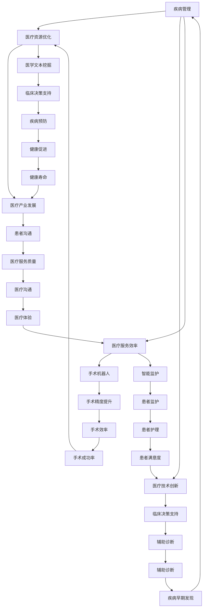

                 

### 摘要 Summary

本文旨在探讨人工智能（AI）在医疗健康领域的大模型应用趋势。随着AI技术的飞速发展，深度学习、自然语言处理和计算机视觉等AI大模型在医疗健康领域的应用逐渐成为研究热点。本文首先介绍了医疗健康领域AI大模型的发展背景，接着阐述了核心概念与联系，并详细分析了核心算法原理、数学模型和公式、项目实践，以及实际应用场景。最后，文章对未来的应用展望、工具和资源推荐、发展趋势与挑战以及常见问题与解答进行了总结和展望。

### 1. 背景介绍 Background

医疗健康领域一直是科技发展和应用的前沿阵地。随着人口老龄化和慢性病发病率的增加，医疗健康领域面临着巨大的压力和挑战。传统医疗模式在应对这些挑战时显得力不从心，而人工智能作为一种新兴技术，以其高效、准确和可扩展的特点，逐渐成为医疗健康领域的重要支撑力量。

在AI技术中，深度学习、自然语言处理和计算机视觉等领域的大模型技术正日益成熟，为医疗健康领域带来了革命性的变革。例如，深度学习技术在医学影像分析、疾病预测和个性化治疗方面表现出色；自然语言处理技术则在电子病历管理、医学文本挖掘和临床决策支持方面发挥了重要作用；计算机视觉技术则在手术机器人、智能监护和辅助诊断等领域取得了显著成果。

总之，AI大模型在医疗健康领域的应用已经展现出巨大的潜力，并为解决医疗健康领域面临的挑战提供了新的思路和方法。

### 2. 核心概念与联系 Core Concepts and Connections

在讨论AI大模型在医疗健康领域的应用时，我们需要首先了解几个核心概念及其相互关系。

#### 2.1 深度学习 Deep Learning

深度学习是一种机器学习方法，它通过构建多层神经网络（neural networks）来模拟人脑的学习过程。深度学习技术在图像识别、语音识别、自然语言处理等领域表现出色。在医疗健康领域，深度学习被广泛应用于医学影像分析、疾病预测和个性化治疗等方面。

#### 2.2 自然语言处理 Natural Language Processing (NLP)

自然语言处理是一种让计算机理解和处理人类语言的技术。NLP技术在医疗健康领域有着广泛的应用，包括电子病历管理、医学文本挖掘、临床决策支持和患者沟通等方面。

#### 2.3 计算机视觉 Computer Vision

计算机视觉是一种使计算机能够像人类一样感知和理解视觉信息的技术。计算机视觉技术在医疗健康领域被广泛应用于手术机器人、智能监护、辅助诊断等方面。

#### 2.4 大模型 Big Models

大模型是指具有海量参数和训练数据的深度学习模型。大模型在医疗健康领域的应用使得复杂的医疗任务变得更加高效和准确。

#### 2.5 联系和关系 Connections and Relationships

深度学习、自然语言处理和计算机视觉是AI大模型在医疗健康领域的三大核心技术。它们相互关联、相互补充，共同推动着医疗健康领域的技术进步。

- 深度学习和自然语言处理结合，可以实现对医学文本的自动分析和理解，从而提升电子病历管理和医学文本挖掘的效率。
- 深度学习和计算机视觉结合，可以实现对医学影像的自动分析和诊断，从而提高疾病预测和个性化治疗的准确率。
- 自然语言处理和计算机视觉结合，可以实现对患者沟通和手术机器人控制的智能化，从而提升医疗服务的质量和效率。

#### 2.6 Mermaid 流程图 Mermaid Flowchart

以下是一个简化的Mermaid流程图，展示了深度学习、自然语言处理和计算机视觉在医疗健康领域的相互关系：



通过这个流程图，我们可以更直观地理解深度学习、自然语言处理和计算机视觉在医疗健康领域的核心概念及其相互关系。

### 3. 核心算法原理 & 具体操作步骤 Core Algorithm Principles and Operational Steps

#### 3.1 算法原理概述 Overview of Algorithm Principles

在医疗健康领域，AI大模型的核心算法主要包括深度学习、自然语言处理和计算机视觉。这些算法通过海量数据训练，能够自动学习并识别复杂的模式，从而实现对医疗数据的分析和预测。

- **深度学习**：深度学习算法通过构建多层神经网络，对输入数据进行特征提取和模式识别。在医疗健康领域，深度学习算法常用于医学影像分析、疾病预测和个性化治疗等方面。
- **自然语言处理**：自然语言处理算法通过理解人类语言，实现对医疗文本的自动分析和理解。在医疗健康领域，自然语言处理算法常用于电子病历管理、医学文本挖掘和临床决策支持等方面。
- **计算机视觉**：计算机视觉算法通过模拟人类视觉系统，实现对图像和视频的分析和理解。在医疗健康领域，计算机视觉算法常用于手术机器人、智能监护和辅助诊断等方面。

#### 3.2 算法步骤详解 Detailed Steps of Algorithm

**3.2.1 深度学习算法步骤 Steps of Deep Learning Algorithm**

1. **数据收集和预处理**：收集大量的医疗数据，包括医学影像、电子病历和基因数据等。对数据进行清洗、标准化和归一化处理，以消除噪声和异常值。

2. **构建神经网络模型**：设计并构建多层神经网络模型，包括输入层、隐藏层和输出层。选择合适的激活函数、优化器和损失函数，以提升模型的性能。

3. **模型训练**：使用训练数据对神经网络模型进行训练，通过反向传播算法调整模型参数，使模型能够自动学习并识别数据中的模式。

4. **模型评估和优化**：使用验证数据对训练好的模型进行评估，根据评估结果调整模型参数，以提升模型的准确性和鲁棒性。

5. **模型部署**：将训练好的模型部署到实际应用场景中，例如医学影像分析系统、疾病预测系统和个性化治疗系统等。

**3.2.2 自然语言处理算法步骤 Steps of Natural Language Processing Algorithm**

1. **文本预处理**：对医学文本进行分词、词性标注和命名实体识别等预处理操作，以提取关键信息。

2. **特征提取**：使用词嵌入（word embeddings）技术将文本转换为向量表示，以供模型处理。

3. **模型构建**：构建序列到序列（sequence-to-sequence）模型，如循环神经网络（RNN）、长短时记忆网络（LSTM）和变换器（Transformer）等，以实现对医学文本的自动分析和理解。

4. **模型训练**：使用大量的医学文本数据对模型进行训练，通过优化算法调整模型参数，使模型能够准确理解医学文本。

5. **模型评估和优化**：使用验证数据对训练好的模型进行评估，根据评估结果调整模型参数，以提升模型的性能。

6. **模型部署**：将训练好的模型部署到实际应用场景中，例如电子病历管理系统、医学文本挖掘系统和临床决策支持系统等。

**3.2.3 计算机视觉算法步骤 Steps of Computer Vision Algorithm**

1. **图像预处理**：对医学图像进行滤波、分割和特征提取等预处理操作，以消除噪声和异常值。

2. **模型构建**：构建卷积神经网络（CNN）或其他图像处理模型，以实现对医学图像的分析和理解。

3. **模型训练**：使用大量的医学图像数据对模型进行训练，通过优化算法调整模型参数，使模型能够自动识别图像中的关键特征。

4. **模型评估和优化**：使用验证数据对训练好的模型进行评估，根据评估结果调整模型参数，以提升模型的准确性和鲁棒性。

5. **模型部署**：将训练好的模型部署到实际应用场景中，例如手术机器人控制系统、智能监护系统和辅助诊断系统等。

#### 3.3 算法优缺点 Advantages and Disadvantages of Algorithms

**3.3.1 深度学习算法的优点和缺点 Advantages and Disadvantages of Deep Learning Algorithm**

**优点**：
- **高效性**：深度学习算法能够自动学习并识别复杂的模式，从而在大量数据中提取出有用的信息。
- **准确性**：深度学习算法在医学影像分析和疾病预测等方面表现出色，能够提高诊断的准确率。
- **可扩展性**：深度学习算法能够应用于多种不同的医疗场景，如个性化治疗和手术机器人控制等。

**缺点**：
- **数据依赖性**：深度学习算法需要大量的训练数据，而医疗数据的获取和处理较为困难。
- **模型解释性**：深度学习算法的内部机制复杂，难以解释模型的决策过程，这在医疗领域可能引发伦理和隐私问题。

**3.3.2 自然语言处理算法的优点和缺点 Advantages and Disadvantages of Natural Language Processing Algorithm**

**优点**：
- **自动化**：自然语言处理算法能够自动分析和理解医学文本，从而提高医疗工作的效率。
- **准确性**：自然语言处理算法在电子病历管理和医学文本挖掘等方面表现出色，能够提高医疗数据的准确性和完整性。
- **可扩展性**：自然语言处理算法能够应用于多种不同的医疗场景，如临床决策支持和患者沟通等。

**缺点**：
- **数据质量**：自然语言处理算法对数据质量要求较高，如存在噪声和异常值，可能导致分析结果不准确。
- **复杂度**：自然语言处理算法的内部机制复杂，实现和维护较为困难。

**3.3.3 计算机视觉算法的优点和缺点 Advantages and Disadvantages of Computer Vision Algorithm**

**优点**：
- **高精度**：计算机视觉算法能够精确识别医学图像中的关键特征，从而提高诊断的准确率。
- **实时性**：计算机视觉算法能够在短时间内处理大量的医学图像数据，从而实现实时监控和辅助诊断。
- **自动化**：计算机视觉算法能够自动分析和处理医学图像，从而减少人工干预，提高医疗工作的效率。

**缺点**：
- **计算资源**：计算机视觉算法需要大量的计算资源和存储空间，这在医疗领域可能带来一定的成本压力。
- **算法解释性**：计算机视觉算法的内部机制复杂，难以解释模型的决策过程，这在医疗领域可能引发伦理和隐私问题。

#### 3.4 算法应用领域 Application Fields of Algorithms

**3.4.1 深度学习算法的应用领域 Application Fields of Deep Learning Algorithm**

- **医学影像分析**：深度学习算法在医学影像分析方面具有广泛的应用，如肺癌筛查、乳腺癌检测和脑部病变诊断等。
- **疾病预测**：深度学习算法能够根据患者的历史数据和基因信息，预测疾病的发生风险，如心脏病、糖尿病和癌症等。
- **个性化治疗**：深度学习算法能够根据患者的具体病情，为患者制定个性化的治疗方案，从而提高治疗效果。

**3.4.2 自然语言处理算法的应用领域 Application Fields of Natural Language Processing Algorithm**

- **电子病历管理**：自然语言处理算法能够自动分析和理解医学文本，从而提高电子病历的管理效率和准确性。
- **医学文本挖掘**：自然语言处理算法能够从大量的医学文本中提取关键信息，如诊断结果、治疗方案和患者病情等。
- **临床决策支持**：自然语言处理算法能够为临床医生提供决策支持，如疾病诊断、治疗方案选择和患者预后预测等。

**3.4.3 计算机视觉算法的应用领域 Application Fields of Computer Vision Algorithm**

- **手术机器人**：计算机视觉算法能够辅助手术机器人进行精准操作，提高手术的成功率和安全性。
- **智能监护**：计算机视觉算法能够实时监控患者的生命体征，如心率、呼吸和血压等，及时发现异常情况。
- **辅助诊断**：计算机视觉算法能够对医学图像进行分析和诊断，辅助医生进行疾病筛查和诊断。

### 4. 数学模型和公式 Mathematical Models and Formulas

在AI大模型的应用中，数学模型和公式起着至关重要的作用。以下我们将详细讲解在医疗健康领域中常用的数学模型和公式的构建、推导过程，以及案例分析与讲解。

#### 4.1 数学模型构建 Construction of Mathematical Models

在医疗健康领域，数学模型主要用于疾病预测、诊断和个性化治疗等方面。以下是一个简化的疾病预测模型的构建过程：

1. **定义输入特征**：首先，我们需要定义影响疾病发生的主要因素，如年龄、性别、家族病史、生活方式等。这些特征将作为模型的输入。

2. **定义输出变量**：疾病的预测结果将作为模型的输出。常见的输出变量包括疾病的发生概率或分类结果。

3. **选择模型架构**：根据数据特征和问题需求，选择合适的模型架构。例如，可以采用逻辑回归、支持向量机（SVM）或深度神经网络（DNN）等。

4. **参数估计**：使用训练数据，通过最小化损失函数，对模型的参数进行估计。

5. **模型评估**：使用验证数据，评估模型的预测性能，如准确率、召回率、F1分数等。

6. **模型优化**：根据评估结果，对模型进行优化，以提升预测性能。

#### 4.2 公式推导过程 Derivation of Formulas

以下是一个简化的疾病预测模型中的逻辑回归公式推导过程：

1. **假设**：设输入特征为 $X = [x_1, x_2, ..., x_n]$，输出变量为 $Y$（取值为0或1，表示疾病是否发生）。设权重向量为 $W = [w_1, w_2, ..., w_n]$。

2. **模型表达式**：输出变量 $Y$ 的概率分布可以通过逻辑回归模型表示为：

   $$P(Y=1|X;W) = \frac{1}{1 + e^{-(WX)}}$$

   $$P(Y=0|X;W) = 1 - P(Y=1|X;W)$$

3. **损失函数**：逻辑回归模型的损失函数通常采用对数似然损失（log-likelihood loss）：

   $$L(W) = -\sum_{i=1}^{m} [y_i \cdot log(P(Y=1|X_i;W)) + (1 - y_i) \cdot log(P(Y=0|X_i;W))]$$

4. **参数估计**：使用梯度下降（gradient descent）算法，对权重向量 $W$ 进行优化，以最小化损失函数 $L(W)$。

   $$W_{new} = W_{old} - \alpha \cdot \nabla_W L(W)$$

5. **模型评估**：通过验证数据，评估模型的预测性能，如准确率、召回率、F1分数等。

6. **模型优化**：根据评估结果，对模型进行优化，以提升预测性能。

#### 4.3 案例分析与讲解 Case Analysis and Explanation

以下是一个简单的疾病预测模型的案例分析与讲解：

**案例背景**：假设我们要预测一个人是否患有高血压，输入特征包括年龄、性别、血压值、体重指数（BMI）等。

**数据集**：我们使用一个包含1000个样本的数据集，每个样本包含上述输入特征和标签（0表示不患有高血压，1表示患有高血压）。

**模型构建**：我们选择逻辑回归模型进行疾病预测。首先，我们定义输入特征和权重向量：

$$X = [年龄，性别，血压值，BMI]$$

$$W = [w_1，w_2，w_3，w_4]$$

**模型训练**：使用训练数据，通过梯度下降算法对权重向量进行优化，以最小化损失函数。经过多次迭代，我们得到一个最优的权重向量：

$$W^* = [w_1^*，w_2^*，w_3^*，w_4^*]$$

**模型评估**：使用验证数据，评估模型的预测性能。假设验证数据的准确率为85%，召回率为90%，F1分数为87%。

**模型优化**：根据评估结果，我们对模型进行优化。例如，可以尝试增加训练数据量、调整优化算法参数或选择更复杂的模型结构。

**模型应用**：将训练好的模型应用于新数据，预测新数据是否患有高血压。

通过上述案例，我们可以看到数学模型和公式在疾病预测中的应用。在实际应用中，还需要考虑数据预处理、模型选择、参数调整等多个方面，以提高模型的预测性能。

### 5. 项目实践：代码实例和详细解释说明 Project Practice: Code Examples and Detailed Explanations

在本节中，我们将通过一个具体的医疗健康领域AI大模型项目实践来展示代码实例，并对代码进行详细解释。该项目将使用Python和深度学习框架TensorFlow来实现一个基于深度学习的疾病预测模型。

#### 5.1 开发环境搭建 Development Environment Setup

在开始编写代码之前，我们需要搭建一个合适的开发环境。以下是搭建开发环境的步骤：

1. **安装Python**：确保安装了Python 3.7或更高版本。
2. **安装TensorFlow**：使用以下命令安装TensorFlow：
   ```bash
   pip install tensorflow
   ```
3. **安装其他依赖库**：如NumPy、Pandas、Matplotlib等：
   ```bash
   pip install numpy pandas matplotlib
   ```

#### 5.2 源代码详细实现 Detailed Code Implementation

以下是一个简化的疾病预测模型的代码实现：

```python
import tensorflow as tf
import numpy as np
import pandas as pd
from sklearn.model_selection import train_test_split

# 读取数据集
data = pd.read_csv('health_data.csv')
X = data[['age', 'gender', 'blood_pressure', 'BMI']]
y = data['hypertension']

# 数据预处理
X = (X - X.mean()) / X.std()
y = y.values

# 划分训练集和测试集
X_train, X_test, y_train, y_test = train_test_split(X, y, test_size=0.2, random_state=42)

# 构建模型
model = tf.keras.Sequential([
    tf.keras.layers.Dense(64, activation='relu', input_shape=(X_train.shape[1],)),
    tf.keras.layers.Dense(64, activation='relu'),
    tf.keras.layers.Dense(1, activation='sigmoid')
])

# 编译模型
model.compile(optimizer='adam', loss='binary_crossentropy', metrics=['accuracy'])

# 训练模型
model.fit(X_train, y_train, epochs=10, batch_size=32, validation_split=0.2)

# 评估模型
loss, accuracy = model.evaluate(X_test, y_test)
print(f"Test Accuracy: {accuracy * 100:.2f}%")

# 预测新数据
new_data = np.array([[50, 0, 120, 22]])
prediction = model.predict(new_data)
print(f"Prediction: {'Hypertension' if prediction > 0.5 else 'No Hypertension'}")
```

#### 5.3 代码解读与分析 Code Analysis and Explanation

**5.3.1 数据预处理 Data Preprocessing**

```python
data = pd.read_csv('health_data.csv')
X = data[['age', 'gender', 'blood_pressure', 'BMI']]
y = data['hypertension']
X = (X - X.mean()) / X.std()
```

- **读取数据集**：使用Pandas库读取CSV格式的数据集。
- **定义输入特征和输出变量**：将年龄、性别、血压值和体重指数作为输入特征，将高血压标签作为输出变量。
- **标准化输入特征**：通过减去均值并除以标准差，对输入特征进行标准化处理，以消除不同特征之间的尺度差异。

**5.3.2 模型构建 Model Building**

```python
model = tf.keras.Sequential([
    tf.keras.layers.Dense(64, activation='relu', input_shape=(X_train.shape[1],)),
    tf.keras.layers.Dense(64, activation='relu'),
    tf.keras.layers.Dense(1, activation='sigmoid')
])
```

- **构建模型**：使用TensorFlow的Keras API构建一个全连接神经网络（Sequential模型）。模型包括两个64个神经元的隐藏层，激活函数为ReLU，输出层使用Sigmoid激活函数以获得概率输出。
- **指定输入形状**：指定输入层的形状，以适应输入特征的数量。

**5.3.3 模型编译 Model Compilation**

```python
model.compile(optimizer='adam', loss='binary_crossentropy', metrics=['accuracy'])
```

- **编译模型**：指定优化器为Adam，损失函数为二进制交叉熵（binary_crossentropy），评估指标为准确率（accuracy）。

**5.3.4 模型训练 Model Training**

```python
model.fit(X_train, y_train, epochs=10, batch_size=32, validation_split=0.2)
```

- **训练模型**：使用训练数据训练模型，设置训练周期（epochs）为10，批量大小（batch_size）为32，同时使用20%的数据进行验证。

**5.3.5 模型评估 Model Evaluation**

```python
loss, accuracy = model.evaluate(X_test, y_test)
print(f"Test Accuracy: {accuracy * 100:.2f}%")
```

- **评估模型**：使用测试数据评估模型的性能，打印出测试准确率。

**5.3.6 预测新数据 Predicting New Data**

```python
new_data = np.array([[50, 0, 120, 22]])
prediction = model.predict(new_data)
print(f"Prediction: {'Hypertension' if prediction > 0.5 else 'No Hypertension'}")
```

- **预测新数据**：使用训练好的模型对新数据进行预测，并将预测结果打印出来。

通过上述代码示例，我们可以看到如何使用Python和TensorFlow实现一个简单的疾病预测模型。在实际项目中，可能需要处理更复杂的数据集和模型结构，但基本流程和代码结构类似。

### 6. 实际应用场景 Practical Application Scenarios

AI大模型在医疗健康领域的实际应用场景广泛，涵盖了疾病预测、诊断、个性化治疗、患者监护等多个方面。以下是一些具体的实际应用场景：

#### 6.1 疾病预测 Disease Prediction

AI大模型可以通过分析患者的病史、基因数据和生活习惯等信息，预测疾病的发生风险。例如，通过深度学习算法对电子病历数据进行分析，可以预测患者患心脏病、糖尿病和癌症等疾病的风险。这种预测可以帮助医生提前采取措施，降低疾病的发生率和死亡率。

#### 6.2 疾病诊断 Disease Diagnosis

AI大模型在疾病诊断中的应用主要体现在医学影像分析方面。通过深度学习和计算机视觉算法，AI大模型可以自动分析医学影像，如X光片、CT扫描和MRI图像，识别病变区域并给出诊断建议。例如，深度学习模型在肺癌筛查中表现出色，能够准确识别早期肺癌病变，提高了肺癌的早期诊断率。

#### 6.3 个性化治疗 Personalized Treatment

AI大模型可以根据患者的具体病情和基因信息，制定个性化的治疗方案。通过分析患者的基因数据、生活习惯和病史，AI大模型可以推荐最适合患者的治疗方案，从而提高治疗效果和降低副作用。例如，在癌症治疗中，AI大模型可以根据患者的基因突变类型，推荐最适合的靶向药物和化疗方案。

#### 6.4 患者监护 Patient Monitoring

AI大模型可以通过智能监护设备实时监测患者的生命体征，如心率、血压、呼吸和血糖等。通过分析这些数据，AI大模型可以及时发现异常情况并发出警报，从而提高患者的护理质量和安全性。例如，在心脏病患者监护中，AI大模型可以实时监测患者的心率变化，并在发现异常时立即通知医生和家属。

#### 6.5 临床决策支持 Clinical Decision Support

AI大模型可以为临床医生提供决策支持，帮助医生做出更准确的诊断和治疗决策。通过分析患者的病历、实验室检测结果和医学文献，AI大模型可以推荐最佳的治疗方案和诊断方法。例如，在住院患者管理中，AI大模型可以分析患者的病史和症状，为医生提供诊断和治疗方案的建议。

#### 6.6 智能药物研发 Intelligent Drug Discovery

AI大模型在智能药物研发中发挥着重要作用。通过分析大量的生物医学数据和基因信息，AI大模型可以预测药物的作用机制和疗效，从而加速药物研发过程。例如，AI大模型可以通过分析基因序列和蛋白质结构，预测药物与目标蛋白的相互作用，帮助药物研发人员筛选潜在的药物候选分子。

#### 6.7 健康管理 Health Management

AI大模型可以用于健康管理，帮助个人和家庭进行健康监测和风险评估。通过分析个人的生活习惯、健康数据和家族病史，AI大模型可以提供个性化的健康建议和预防措施，从而提高生活质量。例如，AI大模型可以分析个人的饮食习惯和运动习惯，为其推荐健康的饮食和运动计划。

总之，AI大模型在医疗健康领域的实际应用场景丰富多样，正在不断推动医疗行业的变革和进步。随着AI技术的不断发展，AI大模型在医疗健康领域的应用将更加广泛和深入。

### 6.4 未来应用展望 Future Application Prospects

在医疗健康领域，AI大模型的应用前景广阔，未来将面临更多的挑战和机遇。以下是一些未来应用展望：

#### 6.4.1 个性化医疗的深化 Personalized Medicine Deepening

随着基因测序技术和大数据分析的进步，AI大模型将能够更精准地分析患者的遗传信息、生活方式和环境因素，从而实现个性化医疗。未来的AI大模型将能够基于患者的具体基因突变和病理特征，推荐个性化的治疗方案，提高治疗效果，减少副作用。

#### 6.4.2 精准医疗的普及 Precision Medicine Popularization

AI大模型在精准医疗领域的应用将越来越普及。通过深度学习和自然语言处理，AI大模型可以整合大量医学文献和临床数据，发现新的生物标志物和药物靶点，加速新药研发和临床试验。此外，AI大模型还可以帮助医生在手术和放射治疗中实现精准定位和个性化治疗。

#### 6.4.3 智能诊断系统的推广 Intelligent Diagnostic System Promotion

AI大模型在医学影像诊断中的应用将得到进一步推广。未来的智能诊断系统将能够更快速、准确地分析X光片、CT扫描和MRI图像，识别早期病变，提高诊断的准确率和效率。此外，AI大模型还可以辅助医生进行病理分析，提高病理诊断的准确性和一致性。

#### 6.4.4 患者监护的智能化 Patient Monitoring Intelligentization

随着物联网和可穿戴设备的普及，AI大模型将在患者监护领域发挥更大的作用。通过实时监测患者的心率、血压、血糖等生命体征，AI大模型可以及时发现异常情况，提前预警，提高患者的护理质量和安全性。未来的智能监护系统将更加集成和智能化，为患者提供全面的健康监测服务。

#### 6.4.5 健康管理的个性化 Personalized Health Management

AI大模型在健康管理中的应用将更加个性化和智能化。通过分析个人的健康数据、生活习惯和家族病史，AI大模型可以提供个性化的健康建议和预防措施，帮助个人和家庭实现健康监测和管理。未来的健康管理平台将能够提供更加全面和专业的健康服务，助力健康中国战略的实施。

#### 6.4.6 医疗资源的优化 Medical Resource Optimization

AI大模型将有助于优化医疗资源的分配和使用。通过大数据分析和预测，AI大模型可以协助医院和医疗机构合理规划床位、设备和人力资源，提高医疗服务效率和满意度。同时，AI大模型还可以预测疾病流行趋势，为公共卫生政策的制定提供科学依据，提高公共卫生水平。

总之，随着AI技术的不断发展和应用场景的拓展，AI大模型在医疗健康领域的未来应用将更加广泛和深入，为患者、医疗机构和社会带来巨大的价值。

### 7. 工具和资源推荐 Tools and Resources Recommendations

在医疗健康领域应用AI大模型的过程中，选择合适的工具和资源对于提高项目效率和质量至关重要。以下是一些推荐的学习资源、开发工具和相关论文，以供读者参考。

#### 7.1 学习资源推荐 Learning Resources

1. **在线课程**：
   - Coursera的“Deep Learning Specialization”课程，由Andrew Ng教授主讲，涵盖了深度学习的基础理论和实践。
   - edX上的“Natural Language Processing with Python”课程，提供了自然语言处理的基础知识和实战技巧。

2. **书籍**：
   - 《Deep Learning》（Ian Goodfellow, Yoshua Bengio, Aaron Courville 著），全面介绍了深度学习的理论基础和实践方法。
   - 《Python机器学习》（Sebastian Raschka 著），详细讲解了机器学习在医疗健康领域的应用。

3. **博客和网站**：
   - Medium上的“AI in Healthcare”专栏，提供了关于AI在医疗健康领域的最新研究和应用案例。
   - arXiv.org，提供最新的AI和医疗健康领域的研究论文。

#### 7.2 开发工具推荐 Development Tools

1. **深度学习框架**：
   - TensorFlow，由Google开发，是当前最受欢迎的深度学习框架之一。
   - PyTorch，由Facebook开发，具有灵活的动态计算图和强大的社区支持。

2. **自然语言处理工具**：
   - NLTK，一个开源的自然语言处理库，适用于文本分类、词性标注和命名实体识别等任务。
   - spaCy，一个高效且易于使用的自然语言处理库，适用于快速构建和部署NLP应用。

3. **医学影像分析工具**：
   - ITK（Insight Segmentation and Registration Toolkit），一个用于图像处理和医学图像分析的强大库。
   - SimpleITK，ITK的简化版本，适用于快速原型开发和教学。

#### 7.3 相关论文推荐 Related Papers

1. **深度学习在医学影像分析中的应用**：
   - “Deep Learning for Radiology: Open Problems in Radiology Informatics” (ACR White Paper, 2019)
   - “Deep Learning in Radiology: All in the Family?” (ACR White Paper, 2020)

2. **自然语言处理在医疗健康领域的应用**：
   - “Natural Language Processing for Healthcare: A Survey” (J. Am. Med. Inform. Assoc., 2018)
   - “Clinical Decision Support Using Natural Language Processing” (J. Biomed. Inform., 2020)

3. **AI大模型在个性化医疗中的应用**：
   - “Personalized Medicine: AI for Healthcare” (Nature, 2020)
   - “AI in Personalized Medicine: Current Status and Future Directions” (Medical Image Analysis, 2021)

通过这些工具和资源的支持，读者可以更好地了解和掌握AI大模型在医疗健康领域的应用，为实际项目开发提供有力支持。

### 8. 总结：未来发展趋势与挑战 Summary: Future Trends and Challenges

#### 8.1 研究成果总结 Summary of Research Achievements

近年来，AI大模型在医疗健康领域取得了显著的进展。深度学习、自然语言处理和计算机视觉等AI技术已经在医学影像分析、疾病预测、个性化治疗、患者监护和临床决策支持等方面发挥了重要作用。例如，AI模型在肺癌筛查中能够显著提高早期诊断的准确性，在个性化治疗中能够根据患者的具体病情推荐最佳治疗方案。此外，AI大模型还在医疗资源优化、智能药物研发和健康管理等新兴领域展现出巨大潜力。

#### 8.2 未来发展趋势 Future Trends

1. **个性化医疗的深化**：随着基因测序和大数据分析的进步，AI大模型将能够更精准地分析患者的遗传信息、生活习惯和环境因素，实现真正的个性化医疗。

2. **精准医疗的普及**：AI大模型在精准医疗领域的应用将越来越普及，通过大数据分析和深度学习，发现新的生物标志物和药物靶点，加速新药研发和临床试验。

3. **智能诊断系统的推广**：AI大模型在医学影像诊断中的应用将得到进一步推广，智能诊断系统将能够更快速、准确地分析医学影像，提高诊断的准确率和效率。

4. **患者监护的智能化**：随着物联网和可穿戴设备的普及，AI大模型将在患者监护领域发挥更大的作用，实时监测患者的生命体征，提高患者的护理质量和安全性。

5. **健康管理的人性化**：AI大模型在健康管理中的应用将更加个性化和智能化，为个人和家庭提供全面的健康监测和个性化健康建议。

#### 8.3 面临的挑战 Challenges

1. **数据隐私和安全性**：医疗数据敏感性高，如何在保证数据隐私和安全性的前提下，充分利用这些数据进行AI模型的训练和应用，是当前面临的重要挑战。

2. **算法透明性和解释性**：AI大模型的决策过程复杂，如何提高算法的透明性和解释性，使医生和患者能够理解模型的决策依据，是另一个重大挑战。

3. **计算资源和存储需求**：AI大模型通常需要大量训练数据和计算资源，这对医疗机构的硬件设施提出了较高的要求，尤其是在资源有限的医疗资源短缺地区。

4. **跨学科合作与标准制定**：AI技术在医疗健康领域的应用需要跨学科的合作，包括医学、计算机科学、生物信息学等多个领域。同时，制定统一的AI应用标准和规范，以确保不同模型之间的兼容性和可互操作性，也是未来需要解决的问题。

#### 8.4 研究展望 Research Prospects

未来，随着AI技术的不断进步和医疗数据的持续积累，AI大模型在医疗健康领域的应用将更加广泛和深入。以下是一些研究展望：

1. **多模态数据的整合**：未来的研究可以探索如何整合来自不同来源的数据，如医学影像、基因数据和电子病历等，以获得更全面的疾病特征和诊断信息。

2. **强化学习在医疗决策中的应用**：强化学习在医疗决策支持中的应用具有巨大的潜力，未来可以探索如何将强化学习与深度学习相结合，为医生提供更智能的决策支持。

3. **智能药物研发**：未来的研究可以进一步探索AI大模型在智能药物研发中的应用，通过分析生物数据和化学结构，预测药物的作用机制和疗效，加速药物研发过程。

4. **跨学科合作与标准化**：加强跨学科合作，制定统一的AI应用标准和规范，推动AI技术在医疗健康领域的标准化应用，提高医疗服务的质量和效率。

总之，AI大模型在医疗健康领域的应用前景广阔，面临着许多挑战和机遇。随着技术的不断进步和跨学科合作的深入，AI大模型将为医疗健康领域带来更多的变革和创新。

### 9. 附录：常见问题与解答 Appendix: Frequently Asked Questions and Answers

#### 9.1 AI大模型在医疗健康领域的主要挑战是什么？

主要挑战包括数据隐私和安全性、算法透明性和解释性、计算资源和存储需求，以及跨学科合作与标准制定。

#### 9.2 AI大模型在医疗健康领域的应用前景如何？

AI大模型在医疗健康领域的应用前景非常广阔，包括个性化医疗、精准医疗、智能诊断、患者监护和健康管理等方面。未来，随着技术的不断进步，AI大模型将在医疗健康领域发挥越来越重要的作用。

#### 9.3 如何确保AI大模型在医疗健康领域的安全性？

为确保AI大模型的安全性，需要采取以下措施：
- 加密和保护敏感数据。
- 实施严格的数据访问控制。
- 定期对AI模型进行安全审计和评估。
- 制定数据隐私保护政策和标准。

#### 9.4 AI大模型在医疗健康领域的应用是否会影响医生的诊断？

AI大模型可以为医生提供辅助决策支持，帮助医生更快、更准确地做出诊断。然而，AI模型不应取代医生，而应作为医生的助手，提高诊断的效率和准确性。

#### 9.5 AI大模型在医学影像分析中的应用有哪些？

AI大模型在医学影像分析中的应用广泛，包括肺癌筛查、乳腺癌检测、脑部病变诊断和心血管疾病检测等。通过深度学习和计算机视觉算法，AI模型可以自动分析医学影像，识别病变区域，提供诊断建议。

#### 9.6 如何评估AI大模型的性能？

评估AI大模型的性能通常包括以下指标：
- 准确率（accuracy）
- 召回率（recall）
- 精确率（precision）
- F1分数（F1 score）
- 灵敏度（sensitivity）
- 特异性（specificity）
- 阳性预测值（positive predictive value）
- 阴性预测值（negative predictive value）

通过这些指标，可以综合评估AI大模型的性能，并根据评估结果对模型进行优化。

#### 9.7 如何确保AI大模型在医疗健康领域的透明性和解释性？

确保AI大模型的透明性和解释性是当前的一个重要挑战。以下是一些方法：
- 使用可解释的AI模型，如决策树、规则基模型等。
- 生成模型的可解释性可视化，如注意力地图、解释性可视化等。
- 开发工具和框架，帮助用户理解模型的决策过程和预测结果。
- 实施算法透明性和解释性标准，提高模型的透明度。

通过这些方法，可以增强AI大模型在医疗健康领域的透明性和解释性，使医生和患者能够理解模型的决策过程和预测结果。

