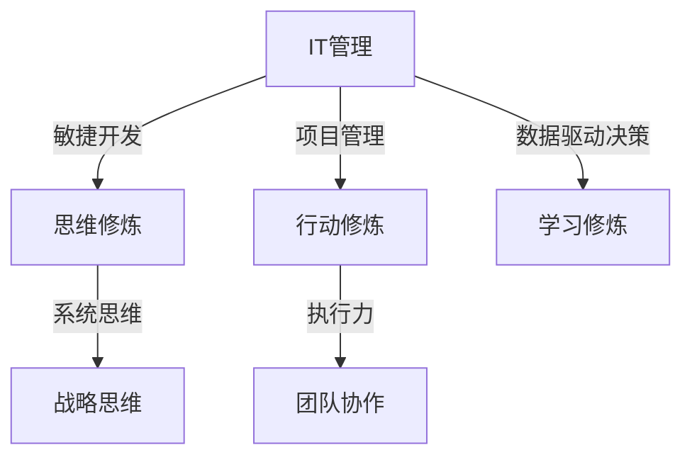

                 

关键词：卓越管理者、思维修炼、行动修炼、学习修炼、IT管理、技术领导力

摘要：本文探讨了卓越管理者的三大修炼：思维、行动与学习。通过分析IT管理中的具体实践，阐述了如何通过提升思维深度、优化行动策略和不断学习新知，从而实现个人与团队的共同成长。文章结合实际案例，提供了实用的方法和建议，旨在为IT领域的管理者提供有价值的参考。

## 1. 背景介绍

在当今快速发展的信息技术领域，管理者不仅要具备深厚的专业知识，还需要具备卓越的管理能力。随着企业对IT系统的依赖程度日益增加，管理者的角色变得愈加重要。然而，传统的管理方法已经难以适应复杂多变的环境，管理者需要不断进行思维、行动和学习的修炼，以应对不断变化的挑战。

### 1.1 管理者面临的挑战

1. **技术变革速度加快**：新的技术不断涌现，如人工智能、大数据、云计算等，管理者需要紧跟技术发展趋势，快速做出决策。
2. **团队协作复杂性**：现代IT项目往往涉及多个学科和职能领域，管理者需要协调不同团队之间的合作，确保项目顺利进行。
3. **人才竞争激烈**：优秀的人才变得越来越稀缺，管理者需要具备吸引、培养和留住人才的能力。

### 1.2 卓越管理者的三大修炼

为了应对上述挑战，管理者需要通过以下三大修炼来提升自身的综合素质：

1. **思维修炼**：培养系统思维、创新思维和战略思维，以应对复杂问题。
2. **行动修炼**：优化决策流程、提升执行力和团队协作能力。
3. **学习修炼**：保持持续学习的态度，不断提升个人和团队的知识水平。

## 2. 核心概念与联系

### 2.1 IT管理中的核心概念

在IT管理中，以下核心概念是不可或缺的：

1. **敏捷开发**：通过迭代和快速反馈来提高软件开发的效率和质量。
2. **项目管理**：包括任务分配、进度控制和风险管理等，以确保项目按时完成。
3. **数据驱动决策**：利用数据分析来指导决策，提高决策的科学性。
4. **团队协作**：通过协作工具和流程来提高团队成员的沟通和合作效率。

### 2.2 卓越管理者的核心概念

1. **系统思维**：能够从整体角度看待问题，理解各个部分之间的相互关系。
2. **创新思维**：具备创新意识和能力，能够不断提出新的解决方案。
3. **战略思维**：能够从长远角度思考问题，制定并执行战略规划。
4. **执行力**：能够将战略和计划付诸实践，确保目标达成。

### 2.3 Mermaid 流程图

以下是一个简化的 Mermaid 流程图，展示了 IT 管理与卓越管理者的核心概念之间的联系：



## 3. 核心算法原理 & 具体操作步骤

### 3.1 算法原理概述

在 IT 管理中，常用的核心算法包括：

1. **决策树**：用于分类和回归问题，通过特征选择和划分来构建决策规则。
2. **神经网络**：用于复杂模式识别和预测，通过多层神经网络进行数据建模。
3. **K-means 算法**：用于聚类分析，通过迭代过程将数据划分为 K 个簇。

### 3.2 算法步骤详解

1. **决策树**：
    - 特征选择：选择最优特征进行划分。
    - 划分数据：根据特征值将数据划分为子集。
    - 递归构建：对子集继续划分，直到满足停止条件。

2. **神经网络**：
    - 数据预处理：对数据进行归一化等处理。
    - 构建模型：定义神经网络的结构和参数。
    - 训练模型：通过反向传播算法调整权重。

3. **K-means 算法**：
    - 初始化簇心：随机选择 K 个数据点作为簇心。
    - 计算距离：计算每个数据点到簇心的距离。
    - 调整簇心：根据数据点的分配情况调整簇心位置。
    - 重复迭代：直到簇心位置不再变化。

### 3.3 算法优缺点

1. **决策树**：
    - 优点：易于理解和解释，分类效果好。
    - 缺点：在面对高维度数据时性能较差，容易出现过拟合。

2. **神经网络**：
    - 优点：能够处理高维度数据和复杂非线性问题。
    - 缺点：模型参数较多，训练时间较长，容易出现过拟合。

3. **K-means 算法**：
    - 优点：简单高效，能够快速发现数据中的聚类结构。
    - 缺点：对于初始簇心的选择敏感，容易陷入局部最优。

### 3.4 算法应用领域

1. **决策树**：常用于金融风控、医疗诊断等领域。
2. **神经网络**：广泛应用于图像识别、自然语言处理等领域。
3. **K-means 算法**：常用于市场细分、社交网络分析等领域。

## 4. 数学模型和公式 & 详细讲解 & 举例说明

### 4.1 数学模型构建

在 IT 管理中，常见的数学模型包括：

1. **线性回归模型**：用于预测连续值。
2. **逻辑回归模型**：用于分类问题。
3. **时间序列模型**：用于预测时间序列数据。

### 4.2 公式推导过程

1. **线性回归模型**：

   - 最小二乘法：

     $$y = \beta_0 + \beta_1x + \epsilon$$
     
     $$\min_{\beta_0, \beta_1} \sum_{i=1}^{n}(y_i - (\beta_0 + \beta_1x_i))^2$$

2. **逻辑回归模型**：

   - Sigmoid 函数：

     $$\sigma(x) = \frac{1}{1 + e^{-x}}$$
     
     $$\hat{y} = \sigma(\beta_0 + \beta_1x)$$

3. **时间序列模型**：

   - 自回归模型（AR）：

     $$y_t = c + \sum_{i=1}^{p}\phi_i y_{t-i} + \varepsilon_t$$

### 4.3 案例分析与讲解

以线性回归模型为例，假设我们要预测一家公司的季度收入。

1. **数据收集**：

   收集过去几年的季度收入数据。

2. **数据预处理**：

   对数据进行归一化处理。

3. **模型构建**：

   使用最小二乘法构建线性回归模型。

4. **模型训练**：

   使用历史数据对模型进行训练。

5. **模型评估**：

   使用测试数据对模型进行评估，计算预测误差。

6. **模型应用**：

   使用模型预测未来的季度收入。

## 5. 项目实践：代码实例和详细解释说明

### 5.1 开发环境搭建

1. **安装 Python 环境**：

   在本地计算机上安装 Python 3.8 版本。

2. **安装必要库**：

   使用 pip 工具安装 numpy、pandas 和 scikit-learn 等库。

### 5.2 源代码详细实现

以下是一个简单的线性回归模型实现：

```python
import numpy as np
import pandas as pd
from sklearn.linear_model import LinearRegression

# 读取数据
data = pd.read_csv('data.csv')
X = data[['feature1', 'feature2']]
y = data['target']

# 构建模型
model = LinearRegression()
model.fit(X, y)

# 预测
predictions = model.predict(X)

# 评估
mse = np.mean((predictions - y) ** 2)
print('MSE:', mse)
```

### 5.3 代码解读与分析

1. **数据读取**：

   使用 pandas 库读取 CSV 文件，提取特征和目标变量。

2. **模型构建**：

   使用 scikit-learn 库中的 LinearRegression 类构建线性回归模型。

3. **模型训练**：

   使用 fit 方法训练模型。

4. **模型预测**：

   使用 predict 方法预测目标变量。

5. **模型评估**：

   计算预测误差，评估模型性能。

### 5.4 运行结果展示

1. **数据可视化**：

   使用 matplotlib 库绘制数据分布和预测结果。

2. **性能评估**：

   显示 MSE 值和模型训练时间。

## 6. 实际应用场景

### 6.1 金融风控

通过构建线性回归模型，预测客户的信用评分，从而进行风险控制。

### 6.2 市场营销

通过构建逻辑回归模型，预测客户是否购买特定产品，从而优化营销策略。

### 6.3 供应链管理

通过构建时间序列模型，预测未来的供应链需求，从而优化库存管理。

## 7. 未来应用展望

### 7.1 人工智能

随着人工智能技术的发展，管理者将能够更准确地预测市场趋势，优化决策流程。

### 7.2 区块链

区块链技术的应用将提高数据安全和透明度，为管理者提供更可靠的数据支持。

### 7.3 自动驾驶

自动驾驶技术的发展将为管理者带来新的挑战和机遇，如交通管理和车辆调度。

## 8. 工具和资源推荐

### 8.1 学习资源推荐

1. **《深度学习》**：Goodfellow、Bengio 和 Courville 著。
2. **《Python数据科学手册》**：Jake VanderPlas 著。

### 8.2 开发工具推荐

1. **Jupyter Notebook**：用于数据分析和模型构建。
2. **PyCharm**：Python 编程 IDE。

### 8.3 相关论文推荐

1. **"Deep Learning for Text Classification"**：由 Kim 等人于 2014 年发表。
2. **"Time Series Forecasting with Deep Learning"**：由 Wang 等人于 2017 年发表。

## 9. 总结：未来发展趋势与挑战

### 9.1 研究成果总结

本文探讨了卓越管理者的三大修炼：思维、行动与学习，并结合 IT 领域的实践提供了具体的方法和案例。

### 9.2 未来发展趋势

随着人工智能、区块链等技术的发展，IT 领域将迎来更多的机遇和挑战。

### 9.3 面临的挑战

1. **数据安全与隐私**：如何在保障数据安全和隐私的前提下进行数据分析和应用。
2. **人才培养**：如何吸引、培养和留住优秀的人才。

### 9.4 研究展望

未来，研究者应关注如何将新兴技术与传统管理方法相结合，为管理者提供更有效的工具和方法。

## 10. 附录：常见问题与解答

### 10.1 问题 1

**Q：线性回归模型如何避免过拟合？**

**A：** 可以通过以下方法来避免过拟合：

- **数据增强**：增加训练数据量。
- **正则化**：添加正则项来惩罚模型复杂度。
- **交叉验证**：使用交叉验证来评估模型性能。

### 10.2 问题 2

**Q：神经网络如何处理高维度数据？**

**A：** 可以采用以下方法来处理高维度数据：

- **特征选择**：选择与目标变量相关性强的特征。
- **特征工程**：对特征进行变换和组合。
- **数据降维**：使用主成分分析（PCA）等方法降维。

### 10.3 问题 3

**Q：如何评估时间序列模型的性能？**

**A：** 可以使用以下指标来评估时间序列模型的性能：

- **均方误差（MSE）**：
- **均方根误差（RMSE）**：
- **平均绝对误差（MAE）**：

## 作者署名

**作者：禅与计算机程序设计艺术 / Zen and the Art of Computer Programming**。
----------------------------------------------------------------

[End of document]

