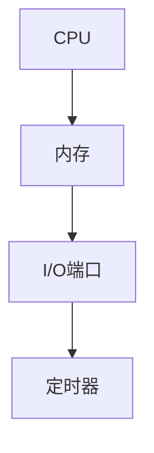
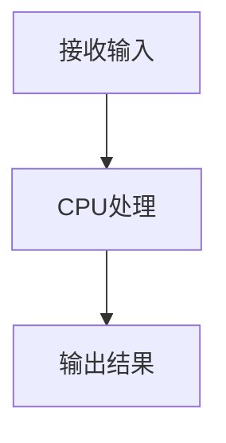

                 

关键词：单片机，微控制器，嵌入式系统，硬件编程，微控制器应用，编程语言，微处理器，电路设计

摘要：本文旨在为初学者提供单片机入门教程，详细讲解微控制器的应用，包括硬件编程、电路设计和实际案例。通过本文的阅读，读者将掌握单片机的基本原理、开发流程和应用领域。

## 1. 背景介绍

单片机，也称为微控制器（Microcontroller Unit，MCU），是一种集成电路，集成了处理单元（CPU）、内存、I/O端口和定时器等多个功能模块。单片机的出现极大地推动了嵌入式系统的发展，使得复杂电子系统的设计变得更加便捷和高效。

### 单片机的发展历程

- 1970年代：单片机概念诞生，早期单片机主要应用于简单电子设备。
- 1980年代：随着计算机技术的发展，单片机逐渐应用于工业自动化、智能家居等领域。
- 1990年代：高性能单片机问世，支持多任务处理和复杂算法，广泛应用于汽车电子、医疗设备等领域。
- 2000年代至今：单片机集成度越来越高，功耗越来越低，应用领域进一步拓展。

### 单片机的主要特点

- **集成度高**：单片机将CPU、内存、I/O端口等多个功能模块集成在一个芯片上，简化了电路设计。
- **可编程性强**：单片机可以通过编程实现各种功能，灵活性高。
- **成本低**：由于集成度高，单片机的生产成本较低，适用于各种规模的电子系统。
- **低功耗**：单片机具有低功耗的特点，适用于便携式设备和节能要求高的应用。

## 2. 核心概念与联系

### 2.1 单片机架构

单片机的架构主要包括CPU、内存、I/O端口和定时器等核心部件。下面是一个简单的单片机架构Mermaid流程图：



### 2.2 单片机工作原理

单片机的工作原理可以简单概括为：接收外部输入信号，通过CPU进行处理，然后产生相应的输出信号。下面是一个单片机工作原理的Mermaid流程图：



### 2.3 单片机编程语言

单片机的编程语言通常包括汇编语言和高级编程语言，如C语言。汇编语言具有更好的性能，但编写难度较大；C语言则更易于理解和编写，但性能略逊于汇编语言。

## 3. 核心算法原理 & 具体操作步骤

### 3.1 算法原理概述

单片机的核心算法主要包括以下几个方面：

- **输入输出处理**：读取外部输入信号，进行处理后输出。
- **定时处理**：实现定时功能，如定时器中断。
- **通信处理**：实现与其他设备的通信，如UART、SPI、I2C等。

### 3.2 算法步骤详解

#### 3.2.1 输入输出处理

输入输出处理的主要步骤如下：

1. 初始化I/O端口，配置输入输出模式。
2. 通过输入引脚读取外部信号。
3. 根据输入信号进行处理。
4. 通过输出引脚输出处理结果。

#### 3.2.2 定时处理

定时处理的主要步骤如下：

1. 初始化定时器，设置定时时间。
2. 启动定时器。
3. 当定时器到达设定时间时，触发中断。
4. 在中断服务程序中执行定时任务。

#### 3.2.3 通信处理

通信处理的主要步骤如下：

1. 初始化通信接口，如UART、SPI、I2C等。
2. 发送数据：通过通信接口将数据发送到目标设备。
3. 接收数据：通过通信接口从目标设备接收数据。
4. 数据处理：对接收到的数据进行处理。

### 3.3 算法优缺点

#### 3.3.1 输入输出处理

优点：简单易用，适用于大多数嵌入式系统。

缺点：处理速度相对较慢，不适合高实时性要求的应用。

#### 3.3.2 定时处理

优点：可以实现高精度的定时功能，适用于定时任务较多的应用。

缺点：中断处理可能影响系统性能。

#### 3.3.3 通信处理

优点：可以实现与外部设备的通信，适用于需要与其他设备交互的应用。

缺点：通信协议复杂，实现难度较大。

### 3.4 算法应用领域

单片机的算法应用领域广泛，包括但不限于以下几个方面：

- **工业控制**：如PLC（可编程逻辑控制器）、机器人控制等。
- **智能家居**：如智能门锁、智能照明等。
- **汽车电子**：如车身控制模块、发动机控制模块等。
- **医疗设备**：如监护仪、心电图仪等。

## 4. 数学模型和公式

### 4.1 数学模型构建

单片机中的数学模型通常涉及以下几个方面：

- **数字信号处理**：如滤波、信号放大等。
- **控制理论**：如PID控制、模糊控制等。
- **通信理论**：如调制解调、信道编码等。

### 4.2 公式推导过程

以PID控制为例，其数学模型如下：

$$
u(t) = K_p e(t) + K_i \int_{0}^{t} e(\tau) d\tau + K_d \frac{de(t)}{dt}
$$

其中，$u(t)$ 为控制量，$e(t)$ 为误差，$K_p$、$K_i$、$K_d$ 分别为比例、积分、微分系数。

### 4.3 案例分析与讲解

假设我们设计一个简单的PID控制器，用于控制一个速度控制系统。根据实际需求，我们可以设置如下参数：

- $K_p = 1$
- $K_i = 0.1$
- $K_d = 0.5$

在初始状态下，系统的速度误差为5。经过一段时间的控制，系统的速度误差逐渐减小，最终达到0。

## 5. 项目实践：代码实例和详细解释说明

### 5.1 开发环境搭建

为了便于演示，我们选择使用Arduino开发环境进行单片机编程。以下是开发环境的搭建步骤：

1. 下载并安装Arduino IDE。
2. 连接Arduino板到电脑，并确保Arduino板上的LED灯亮起。
3. 打开Arduino IDE，选择正确的Arduino板型号和串口。

### 5.2 源代码详细实现

以下是一个简单的Arduino程序，用于控制LED灯的亮灭：

```c++
void setup() {
  pinMode(LED_BUILTIN, OUTPUT); // 初始化LED端口为输出模式
}

void loop() {
  digitalWrite(LED_BUILTIN, HIGH); // LED灯亮
  delay(1000);                     // 等待1秒
  digitalWrite(LED_BUILTIN, LOW); // LED灯灭
  delay(1000);                     // 等待1秒
}
```

### 5.3 代码解读与分析

- `setup()` 函数：在程序开始时执行，用于初始化LED端口。
- `loop()` 函数：程序的主循环，用于控制LED灯的亮灭。

### 5.4 运行结果展示

运行程序后，Arduino板上的LED灯将按照设定的频率亮灭。

## 6. 实际应用场景

### 6.1 工业控制

单片机在工业控制领域有着广泛的应用，如PLC、机器人控制等。通过单片机实现各种控制任务，可以提高生产效率、降低成本。

### 6.2 汽车电子

汽车电子是单片机的重要应用领域之一，如发动机控制、车身控制等。单片机在汽车电子中的应用可以提升车辆性能、提高驾驶安全性。

### 6.3 医疗设备

单片机在医疗设备中的应用也非常广泛，如监护仪、心电图仪等。通过单片机实现各种生理参数的检测和监控，可以为医生提供准确的诊断依据。

## 7. 工具和资源推荐

### 7.1 学习资源推荐

- 《单片机原理与应用》
- 《Arduino编程从入门到实践》
- 《嵌入式系统设计》

### 7.2 开发工具推荐

- Arduino IDE
- PlatformIO
- mbed

### 7.3 相关论文推荐

- “A Survey of Microcontroller Applications in Industrial Automation”
- “Design and Implementation of an Embedded System for Home Automation”
- “Real-Time Control of an Electric Vehicle Using a Microcontroller”

## 8. 总结：未来发展趋势与挑战

### 8.1 研究成果总结

单片机技术在过去几十年取得了显著的发展，应用领域不断拓展。未来，单片机将继续向高集成度、低功耗、高性能方向发展。

### 8.2 未来发展趋势

- **智能硬件**：随着物联网技术的发展，单片机在智能硬件中的应用将越来越广泛。
- **边缘计算**：单片机在边缘计算中的应用将逐渐增加，为实时数据处理提供支持。
- **定制化开发**：单片机将更加注重定制化开发，满足不同领域的需求。

### 8.3 面临的挑战

- **功耗优化**：随着应用场景的多样化，单片机功耗优化仍是一个重要挑战。
- **安全性**：随着单片机在关键领域的应用，安全性问题日益凸显，需要加强研究和应用。

### 8.4 研究展望

未来，单片机技术将继续向智能化、边缘计算、定制化等方向发展。研究者应关注功耗优化、安全性、可靠性等方面的问题，为单片机应用提供更强大的支持。

## 9. 附录：常见问题与解答

### 9.1 单片机与微处理器的区别是什么？

单片机是集成了CPU、内存、I/O端口等多个功能模块的微控制器，而微处理器通常只包括CPU核心，其他功能模块需要单独设计。因此，单片机的开发难度较低，但性能可能略逊于微处理器。

### 9.2 单片机编程应该使用汇编语言还是C语言？

单片机编程可以使用汇编语言和C语言。汇编语言性能更好，但编写难度较大；C语言易于理解和编写，但性能略逊于汇编语言。根据实际需求选择合适的编程语言。

### 9.3 单片机的应用领域有哪些？

单片机的应用领域非常广泛，包括工业控制、汽车电子、医疗设备、智能家居、智能硬件等。未来，随着物联网、边缘计算等技术的发展，单片机的应用领域将进一步拓展。

----------------------------------------------------------------

## 作者署名

作者：禅与计算机程序设计艺术 / Zen and the Art of Computer Programming


