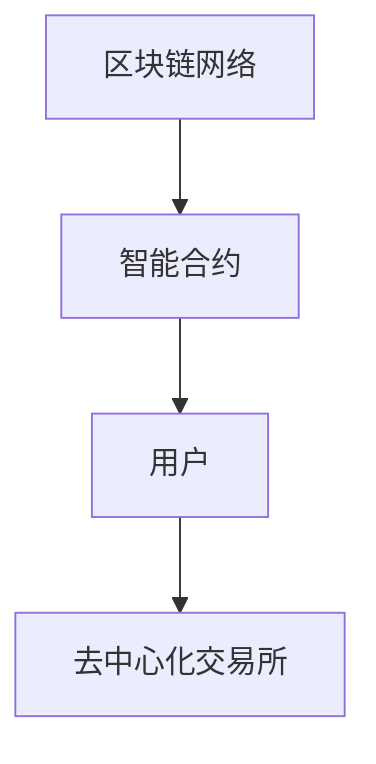

                 

在当今技术飞速发展的时代，去中心化金融（Decentralized Finance，简称DeFi）正逐渐成为金融行业的变革力量。去中心化金融创业，不仅仅是一种新的商业模式，更是一种全新的金融服务范式。本文将深入探讨去中心化金融的背景、核心概念、算法原理、数学模型、实际应用以及未来展望。

## 关键词

- 去中心化金融（DeFi）
- 区块链技术
- 智能合约
- 金融服务创新
- 分布式账本
- 安全性
- 可扩展性

## 摘要

本文将围绕去中心化金融这一主题，从背景介绍、核心概念、算法原理、数学模型、项目实践、实际应用展望等多个角度进行详细探讨。通过分析去中心化金融的优势与挑战，旨在为创业者、投资者和金融从业者提供有价值的参考。

## 1. 背景介绍

### 1.1 区块链技术的发展

区块链技术自2009年比特币问世以来，经历了快速的发展和演变。区块链的去中心化特性、不可篡改性以及透明性，使得其在金融领域具有广泛的应用前景。去中心化金融（DeFi）正是基于区块链技术的一种新型金融服务模式。

### 1.2 金融行业的痛点

传统的金融体系存在诸多痛点，如信息不对称、中介成本高、交易效率低、金融排斥等。这些问题导致了金融服务的公平性和效率受到限制。去中心化金融通过消除中介、降低成本、提高透明度，有望解决这些问题。

### 1.3 去中心化金融的兴起

随着区块链技术的不断成熟，越来越多的创业者开始探索去中心化金融领域。DeFi项目的兴起，标志着金融服务正逐步从传统的中心化模式向去中心化模式转变。

## 2. 核心概念与联系

### 2.1 去中心化金融（DeFi）

去中心化金融（DeFi）是基于区块链技术构建的金融服务体系，通过智能合约实现金融功能的自动化、透明化和去中心化。DeFi的核心概念包括：

- **智能合约**：智能合约是一种自执行的合同，条件满足时自动执行。在DeFi中，智能合约用于实现各种金融功能，如借贷、交易、投资等。
- **分布式账本**：分布式账本记录所有交易数据，所有参与者都可以查看和验证。这保证了DeFi系统的透明性和安全性。
- **去中心化**：去中心化金融消除了传统金融体系中的中介机构，使得金融服务更加公平、高效。

### 2.2 去中心化金融的架构

去中心化金融的架构主要包括以下几个部分：

- **区块链网络**：区块链网络是DeFi的基础设施，用于记录交易数据和管理智能合约。
- **智能合约**：智能合约实现各种金融功能，如借贷、交易、投资等。
- **用户**：用户通过去中心化金融平台进行各种金融操作，如存款、借款、投资等。
- **去中心化交易所（DEX）**：去中心化交易所是实现DeFi交易的核心组件，用户可以在DEX上交换加密货币。

### 2.3 去中心化金融的优势与挑战

去中心化金融的优势包括：

- **去中心化**：去中心化消除了中介机构，降低了成本，提高了透明度和效率。
- **安全性**：分布式账本和智能合约保证了交易数据的不可篡改性和安全性。
- **灵活性**：用户可以自由选择金融产品和服务，无需受到地域和机构的限制。

然而，去中心化金融也面临一些挑战：

- **可扩展性**：区块链网络的性能和可扩展性仍需进一步提升，以满足大规模金融交易的需求。
- **用户体验**：去中心化金融平台的用户体验仍需优化，以吸引更多用户。
- **法律监管**：去中心化金融的法律监管尚不明确，可能导致一定的法律风险。

### 2.4 Mermaid 流程图

以下是一个简单的去中心化金融架构的Mermaid流程图：



## 3. 核心算法原理 & 具体操作步骤

### 3.1 算法原理概述

去中心化金融的核心算法原理主要涉及智能合约的实现和分布式账本的管理。智能合约用于实现各种金融功能，如借贷、交易、投资等。分布式账本记录所有交易数据，保证交易的透明性和安全性。

### 3.2 算法步骤详解

去中心化金融的操作步骤主要包括以下几个部分：

1. **用户注册**：用户通过去中心化金融平台进行注册，生成加密货币钱包地址。
2. **账户充值**：用户将加密货币充值到去中心化金融平台的账户中。
3. **交易执行**：用户通过智能合约执行各种金融操作，如借贷、交易、投资等。
4. **交易记录**：所有交易数据记录在分布式账本中，确保交易的透明性和安全性。
5. **结果反馈**：去中心化金融平台根据交易结果向用户反馈。

### 3.3 算法优缺点

去中心化金融算法的优点包括：

- **去中心化**：去中心化金融消除了中介机构，降低了成本，提高了透明度和效率。
- **安全性**：分布式账本和智能合约保证了交易数据的不可篡改性和安全性。

然而，去中心化金融算法也存在一些缺点：

- **可扩展性**：区块链网络的性能和可扩展性仍需进一步提升，以满足大规模金融交易的需求。
- **用户体验**：去中心化金融平台的用户体验仍需优化，以吸引更多用户。

### 3.4 算法应用领域

去中心化金融算法主要应用于以下领域：

- **借贷**：去中心化借贷平台通过智能合约实现借贷功能，用户可以自由借贷。
- **交易**：去中心化交易所通过智能合约实现加密货币的交易。
- **投资**：去中心化投资平台通过智能合约实现投资功能，用户可以自由投资。

## 4. 数学模型和公式 & 详细讲解 & 举例说明

### 4.1 数学模型构建

去中心化金融的数学模型主要包括以下部分：

- **借贷模型**：用于计算借贷金额、利率、还款期限等参数。
- **交易模型**：用于计算交易金额、手续费等参数。
- **投资模型**：用于计算投资回报、风险等参数。

### 4.2 公式推导过程

以下是借贷模型的一个简例：

假设用户A向用户B借贷金额为`X`，利率为`R`，还款期限为`T`。则用户B需要支付的本息总额为：

$$ 本息总额 = X \times (1 + R \times T) $$

### 4.3 案例分析与讲解

以下是一个简单的借贷案例：

假设用户A向用户B借贷1000美元，年利率为5%，还款期限为1年。根据借贷模型，用户B需要支付的本息总额为：

$$ 本息总额 = 1000 \times (1 + 0.05 \times 1) = 1050美元 $$

## 5. 项目实践：代码实例和详细解释说明

### 5.1 开发环境搭建

在搭建去中心化金融项目的开发环境时，您需要安装以下工具和软件：

- **Node.js**：用于编写智能合约的编程语言。
- **Truffle**：用于智能合约的开发、测试和部署。
- **Ganache**：用于本地区块链网络的搭建。

### 5.2 源代码详细实现

以下是一个简单的智能合约示例：

```solidity
// SPDX-License-Identifier: MIT
pragma solidity ^0.8.0;

contract DeFiLoan {
    mapping(address => uint256) public loanBalance;

    function borrow(uint256 amount) public {
        loanBalance[msg.sender] += amount;
    }

    function repay(uint256 amount) public {
        loanBalance[msg.sender] -= amount;
    }

    function calculateInterest() public {
        for (uint256 i = 0; i < addresses.length; i++) {
            address borrower = addresses[i];
            uint256 balance = loanBalance[borrower];
            uint256 interest = balance * 0.05; // 年利率5%
            loanBalance[borrower] += interest;
        }
    }
}
```

### 5.3 代码解读与分析

上述智能合约实现了一个去中心化借贷平台的基本功能，包括借款、还款和计算利息。以下是代码的详细解读：

- **borrow函数**：用户通过调用此函数可以借款。
- **repay函数**：用户通过调用此函数可以还款。
- **calculateInterest函数**：系统每隔一段时间调用此函数，计算并收取用户的利息。

### 5.4 运行结果展示

在部署并运行上述智能合约后，用户可以通过调用相应函数实现借贷操作，并计算出利息。

## 6. 实际应用场景

### 6.1 借贷平台

去中心化借贷平台允许用户在无需中介的情况下进行借贷。用户可以通过智能合约实现借款和还款，同时系统会自动计算并收取利息。

### 6.2 交易所

去中心化交易所使得用户可以自由交易加密货币，无需通过中心化交易所。交易所通过智能合约实现交易功能，确保交易的透明性和安全性。

### 6.3 投资平台

去中心化投资平台允许用户在无需信任第三方的情况下进行投资。用户可以通过智能合约购买和管理投资产品，实现资产的增值。

## 7. 工具和资源推荐

### 7.1 学习资源推荐

- **区块链技术：从入门到精通**：一本全面介绍区块链技术的入门书籍。
- **智能合约开发与测试**：一本深入讲解智能合约开发与测试的书籍。

### 7.2 开发工具推荐

- **Truffle**：用于智能合约的开发、测试和部署。
- **Ganache**：用于本地区块链网络的搭建。

### 7.3 相关论文推荐

- **区块链技术在金融领域的应用**：一篇探讨区块链技术在金融领域应用的论文。
- **去中心化金融的挑战与机遇**：一篇讨论去中心化金融面临的挑战与机遇的论文。

## 8. 总结：未来发展趋势与挑战

### 8.1 研究成果总结

去中心化金融作为金融行业的新范式，已经展现出巨大的潜力和市场前景。通过智能合约和分布式账本，去中心化金融实现了金融服务的去中心化、透明化和高效化。

### 8.2 未来发展趋势

随着区块链技术的不断成熟，去中心化金融将逐渐成为金融行业的主流。未来，去中心化金融将在借贷、交易、投资等各个领域得到广泛应用。

### 8.3 面临的挑战

去中心化金融在发展过程中也面临一些挑战，如可扩展性、用户体验和法律监管等。这些问题需要通过技术进步和政策完善来逐步解决。

### 8.4 研究展望

未来，去中心化金融的研究将重点关注以下几个方面：

- **可扩展性**：提高区块链网络的性能和可扩展性，满足大规模金融交易的需求。
- **用户体验**：优化去中心化金融平台的用户体验，提高用户粘性。
- **法律监管**：明确去中心化金融的法律地位，制定合理的监管政策。

## 9. 附录：常见问题与解答

### Q：什么是去中心化金融（DeFi）？

A：去中心化金融（DeFi）是一种基于区块链技术的金融服务体系，通过智能合约实现金融功能的自动化、透明化和去中心化。

### Q：去中心化金融有哪些优势？

A：去中心化金融的优势包括去中心化、安全性、灵活性等。去中心化消除了中介机构，降低了成本，提高了透明度和效率。安全性由分布式账本和智能合约保证。灵活性使得用户可以自由选择金融产品和服务。

### Q：去中心化金融有哪些挑战？

A：去中心化金融面临的挑战包括可扩展性、用户体验和法律监管等。区块链网络的性能和可扩展性仍需提升，用户体验需要优化，法律监管尚不明确。

### Q：去中心化金融的未来发展趋势是什么？

A：随着区块链技术的不断成熟，去中心化金融将逐渐成为金融行业的主流。未来，去中心化金融将在借贷、交易、投资等各个领域得到广泛应用。

### 作者署名

作者：禅与计算机程序设计艺术 / Zen and the Art of Computer Programming
----------------------------------------------------------------

以上就是《去中心化金融创业：金融服务的新范式》的完整文章内容。文章从背景介绍、核心概念、算法原理、数学模型、项目实践、实际应用展望等多个角度，深入探讨了去中心化金融的各个方面。希望本文能为读者在去中心化金融领域提供有价值的参考。

