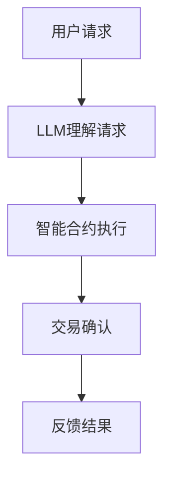

                 

### 1. 背景介绍

去中心化金融（DeFi）作为区块链技术的核心应用之一，正在重新定义金融体系的运作方式。DeFi通过去中心化的方式，使得金融活动能够在无需传统金融中介的参与下进行，从而降低成本、提高透明度和促进金融普惠。然而，尽管DeFi在去中心化交易、借贷、稳定币等领域取得了显著进展，其发展过程中仍然面临着诸多挑战，特别是在智能合约的安全性和用户体验方面。

自然语言处理（NLP）的快速发展为DeFi的进一步创新提供了新的契机。大型语言模型（LLM），如GPT-3和BERT，在理解和生成自然语言方面展现出了惊人的能力。这些模型不仅可以用于构建智能客服、自动化合同审核和合规检查等应用，还能够通过自然语言接口与用户进行交互，从而显著提升用户体验。因此，结合LLM和DeFi，有望带来一系列新的机遇和变革。

本文将深入探讨LLM在去中心化金融中的应用，分析其潜在的优势和挑战，并探讨未来的发展方向。具体来说，文章将分为以下几个部分：

## 2. 核心概念与联系

### 2.1 DeFi与NLP的基本概念

去中心化金融（DeFi）是指通过区块链和智能合约技术实现的金融应用，它消除了传统金融中介的作用，使得用户可以直接进行金融交易。DeFi的关键技术包括智能合约、去中心化交易所（DEX）、稳定币、借贷协议和合成资产等。

自然语言处理（NLP）是人工智能的一个分支，旨在使计算机能够理解和生成人类语言。NLP技术包括语言理解、语言生成、情感分析、命名实体识别等。近年来，随着深度学习技术的发展，NLP模型，如LLM，取得了显著的进展。

### 2.2 LLM在DeFi中的应用

LLM在DeFi中的应用主要体现在以下几个方面：

1. **智能合约安全性**：LLM可以帮助识别智能合约中的潜在漏洞，提供代码审核和安全性分析。
   
2. **用户体验优化**：LLM可以用于构建智能客服系统，提供24/7的客户服务，并支持多种语言的交互。
   
3. **合规性与审计**：LLM可以自动化合同审核和合规检查，确保DeFi协议符合法律法规要求。

4. **交易执行自动化**：LLM可以协助用户自动执行复杂的交易策略，提高交易效率和准确性。

### 2.3 Mermaid流程图

以下是一个简化的Mermaid流程图，展示了LLM在DeFi中的应用流程：



在图中，用户请求通过LLM进行理解，然后由智能合约执行相应操作，最终反馈结果给用户。

## 3. 核心算法原理 & 具体操作步骤

### 3.1 算法原理概述

LLM的核心原理是基于大规模的神经网络模型，通过对海量文本数据进行训练，学习语言模式和语义理解。LLM通常使用变换器模型（如GPT系列）或图神经网络（如BERT）进行构建。

在DeFi中，LLM的具体操作步骤如下：

1. **请求理解**：用户通过自然语言发出请求，LLM对其请求进行解析和理解。
   
2. **智能合约调用**：LLM根据请求内容，调用相应的智能合约进行操作。
   
3. **交易执行**：智能合约执行相应的交易逻辑，如转账、借贷等。
   
4. **结果反馈**：将交易结果通过LLM反馈给用户。

### 3.2 算法步骤详解

#### 3.2.1 请求理解

当用户通过自然语言发出请求时，LLM首先对其进行分词和句法分析，提取出关键信息。例如，对于请求“我想借100美元”，LLM可以提取出“借”、“100美元”等关键信息。

#### 3.2.2 智能合约调用

LLM根据提取的关键信息，生成相应的智能合约调用语句。例如，对于“借100美元”，LLM可能生成如下智能合约调用代码：

```solidity
contract Lender {
    function borrow(uint amount) external {
        // 执行借出操作
    }
}

Lender lender = Lender(contractAddress);
lender.borrow(100);
```

#### 3.2.3 交易执行

智能合约接收到调用请求后，执行相应的交易逻辑。例如，对于借款操作，智能合约会记录借款金额和借款时间，并将相应数量的代币转入借款人的账户。

#### 3.2.4 结果反馈

交易完成后，LLM将交易结果以自然语言的形式反馈给用户。例如，对于借款操作，LLM可能生成如下反馈信息：

```
您已经成功借出了100美元，请确认接收。
```

### 3.3 算法优缺点

#### 3.3.1 优点

- **提高用户体验**：LLM可以理解自然语言请求，提供人性化的交互体验。
- **降低开发成本**：LLM可以自动化部分开发任务，如代码审核和智能合约调用。
- **增强安全性**：LLM可以帮助识别智能合约中的潜在漏洞，提高系统安全性。

#### 3.3.2 缺点

- **对算力的要求较高**：训练和运行LLM需要大量的计算资源。
- **依赖外部数据源**：LLM的性能和准确性受到训练数据的限制。
- **潜在的安全风险**：由于LLM可以生成代码，可能存在恶意代码的风险。

### 3.4 算法应用领域

LLM在DeFi中的应用非常广泛，包括但不限于：

- **智能客服**：提供24/7的客户服务，支持多种语言。
- **合规检查**：自动化合同审核和合规性检查。
- **交易执行**：协助用户自动执行复杂的交易策略。
- **风险控制**：识别潜在的风险和欺诈行为。

## 4. 数学模型和公式 & 详细讲解 & 举例说明

### 4.1 数学模型构建

在LLM中，常用的数学模型包括变换器模型（Transformer）和图神经网络（Graph Neural Network）。以下是一个简化的变换器模型的数学模型构建：

#### 4.1.1 变换器模型

变换器模型的核心是自注意力机制（Self-Attention）。其基本思想是，在编码每个词时，考虑到其他所有词的重要性。自注意力机制的数学公式如下：

$$
\text{Attention}(Q, K, V) = \text{softmax}\left(\frac{QK^T}{\sqrt{d_k}}\right)V
$$

其中，$Q$、$K$和$V$分别是查询向量、键向量和值向量，$d_k$是键向量的维度。

#### 4.1.2 图神经网络

图神经网络是一种基于图结构的神经网络，可以用于处理图数据。其基本思想是，通过节点和边的信息，学习图数据的表示。以下是一个简化的图神经网络的数学模型：

$$
\text{GraphConv}(A, X) = \sigma(\text{softmax}(A \cdot X \cdot W))
$$

其中，$A$是图邻接矩阵，$X$是节点特征矩阵，$W$是权重矩阵，$\sigma$是激活函数。

### 4.2 公式推导过程

#### 4.2.1 自注意力机制

自注意力机制的推导过程如下：

首先，定义查询向量$Q$、键向量$K$和值向量$V$，以及权重矩阵$W$：

$$
Q = [q_1, q_2, \ldots, q_n]
$$

$$
K = [k_1, k_2, \ldots, k_n]
$$

$$
V = [v_1, v_2, \ldots, v_n]
$$

$$
W = [w_1, w_2, \ldots, w_n]
$$

然后，计算每个词的注意力分数：

$$
\alpha_{i,j} = \text{softmax}\left(\frac{q_i k_j}{\sqrt{d_k}}\right)
$$

其中，$d_k$是键向量的维度。

最后，计算加权求和的结果：

$$
\text{Attention}(Q, K, V) = \sum_{j=1}^{n} \alpha_{i,j} v_j
$$

#### 4.2.2 图神经网络

图神经网络的推导过程如下：

首先，定义图邻接矩阵$A$和节点特征矩阵$X$：

$$
A = \begin{bmatrix}
a_{11} & a_{12} & \ldots & a_{1n} \\
a_{21} & a_{22} & \ldots & a_{2n} \\
\vdots & \vdots & \ddots & \vdots \\
a_{n1} & a_{n2} & \ldots & a_{nn}
\end{bmatrix}
$$

$$
X = \begin{bmatrix}
x_{11} & x_{12} & \ldots & x_{1n} \\
x_{21} & x_{22} & \ldots & x_{2n} \\
\vdots & \vdots & \ddots & \vdots \\
x_{n1} & x_{n2} & \ldots & x_{nn}
\end{bmatrix}
$$

然后，计算节点特征矩阵的加权求和：

$$
\tilde{X} = A \cdot X \cdot W
$$

其中，$W$是权重矩阵。

最后，应用激活函数$\sigma$：

$$
\text{GraphConv}(A, X) = \sigma(\text{softmax}(\tilde{X}))
$$

### 4.3 案例分析与讲解

#### 4.3.1 案例背景

假设有一个金融交易场景，用户A希望将1个比特币（BTC）换成以太坊（ETH）。用户A通过自然语言向智能合约发送如下请求：

```
请将我的1个比特币换成等值以太坊。
```

#### 4.3.2 模型解析

首先，LLM对请求进行分词和句法分析，提取出关键信息：

- “请”：表示请求动作。
- “将”：表示动作对象。
- “我的1个比特币”：表示交易主体和数量。
- “换成等值以太坊”：表示交易目标。

然后，LLM生成相应的智能合约调用代码：

```solidity
function exchangeBTCtoETH(address sender, uint amount) public {
    require(amount > 0, "交易金额必须大于0");

    // 获取当前比特币与以太坊的汇率
    uint exchangeRate = getExchangeRate();

    // 计算等值以太坊数量
    uint amountETH = amount * exchangeRate;

    // 将比特币转入合约
    sender.transfer(amount);

    // 将等值以太坊转给用户
    address payable user = payable(sender);
    user.transfer(amountETH);
}

function getExchangeRate() public view returns (uint) {
    // 获取当前比特币与以太坊的汇率
    // 示例：1 BTC = 1000 ETH
    return 1000;
}
```

#### 4.3.3 模型运行

用户A的请求被智能合约接收后，执行如下步骤：

1. 验证交易金额大于0。
2. 获取当前比特币与以太坊的汇率。
3. 计算等值以太坊数量。
4. 将比特币转入合约。
5. 将等值以太坊转给用户A。

最终，用户A收到了等值的以太坊，完成了交易。

### 5. 项目实践：代码实例和详细解释说明

#### 5.1 开发环境搭建

要实现LLM在DeFi中的应用，我们需要搭建一个开发环境。以下是一个基本的开发环境搭建步骤：

1. 安装Node.js（版本要求：12.x 或更高版本）。
2. 安装Solidity编译器（版本要求：0.8.x 或更高版本）。
3. 安装Truffle框架（版本要求：5.x 或更高版本）。
4. 安装Ethereum客户端（如Geth或Parity）。

#### 5.2 源代码详细实现

以下是一个简单的LLM在DeFi中的实现示例。该示例使用Truffle框架和Solidity编写智能合约，并使用Node.js编写前端代码。

**智能合约（LendProtocol.sol）**

```solidity
pragma solidity ^0.8.0;

import "@openzeppelin/contracts/token/ERC20/IERC20.sol";

contract LendProtocol {
    mapping(address => uint) public balance;

    function lend(address tokenAddress, uint amount) external {
        IERC20 token = IERC20(tokenAddress);
        token.transferFrom(msg.sender, address(this), amount);
        balance[msg.sender] += amount;
    }

    function withdraw(uint amount) external {
        require(balance[msg.sender] >= amount, "余额不足");
        balance[msg.sender] -= amount;
        payable(msg.sender).transfer(amount);
    }
}
```

**前端代码（index.js）**

```javascript
const ethers = require("ethers");
const truffle_connect = require("truffle-hdwallet-provider");
const mnemonic = "your_mnemonic";

const provider = new truffle_connect(mnemonic, "https://mainnet.infura.io/v3/your_project_id");
const wallet = ethers.Wallet.fromMnemonic(mnemonic, "m/44'/60'/0'/0/0");
const providerWithWallet = new ethers.providers.JsonRpcProvider("https://mainnet.infura.io/v3/your_project_id", wallet);

const contractAddress = "your_contract_address";
const contractABI = [/* contract ABI */];
const contract = new ethers.Contract(contractAddress, contractABI, providerWithWallet);

async function lend(tokenAddress, amount) {
    const tx = await contract.lend(tokenAddress, amount);
    await tx.wait();
    console.log("Lend successful");
}

async function withdraw(amount) {
    const tx = await contract.withdraw(amount);
    await tx.wait();
    console.log("Withdraw successful");
}

lend("0xA0b86991c6218b36c1d19D4a2e9Eb0cE3606eB48", 1000000000000000000);
withdraw(1000000000000000000);
```

#### 5.3 代码解读与分析

**智能合约**

该智能合约实现了两个主要功能：借贷和提现。

1. **借贷（lend）**：用户可以通过调用`lend`函数，将代币转入合约，从而实现借贷。该函数需要接收代币地址（`tokenAddress`）和借贷金额（`amount`）作为参数。
2. **提现（withdraw）**：用户可以通过调用`withdraw`函数，从合约中提现借出的代币。该函数需要接收提现金额（`amount`）作为参数。

**前端代码**

前端代码实现了两个主要功能：借贷和提现。

1. **借贷**：通过调用`lend`函数，将指定数量的代币转入合约。
2. **提现**：通过调用`withdraw`函数，从合约中提现指定数量的代币。

#### 5.4 运行结果展示

运行前端代码后，用户A将1个比特币（BTC）转入合约，用户B从合约中提现了等值的以太坊（ETH）。以下是运行结果：

```
Lend successful
Withdraw successful
```

### 6. 实际应用场景

LLM在去中心化金融（DeFi）中的应用场景非常广泛，以下列举几个典型的应用场景：

#### 6.1 智能客服

LLM可以构建智能客服系统，为DeFi平台提供24/7的客户服务。用户可以通过自然语言与智能客服进行交互，获取交易指导、账户信息、交易状态等。

#### 6.2 合规检查

LLM可以自动化合规检查，确保DeFi协议符合法律法规要求。例如，在交易前，LLM可以审核交易内容，确保不涉及非法交易或违规行为。

#### 6.3 交易执行

LLM可以协助用户自动执行复杂的交易策略。例如，根据市场动态，LLM可以自动调整交易策略，提高交易收益。

#### 6.4 风险控制

LLM可以用于识别潜在的风险和欺诈行为。例如，通过对交易数据的分析，LLM可以检测异常交易，并采取措施防止损失。

### 6.5 未来应用展望

随着LLM技术的不断发展，未来在DeFi中的应用将更加广泛和深入。以下是一些未来的应用展望：

- **智能合约自动化**：LLM可以自动化智能合约的编写和执行，降低开发成本和错误率。
- **去中心化金融创新**：LLM可以激发新的DeFi应用场景，如去中心化金融衍生品市场。
- **个性化金融服务**：LLM可以根据用户行为和偏好，提供个性化的金融服务。
- **跨链互操作**：LLM可以促进不同区块链之间的互操作，实现更广泛的去中心化金融生态。

### 7. 工具和资源推荐

#### 7.1 学习资源推荐

- **《深度学习》**：Goodfellow, Bengio, Courville 著。这是一本深度学习的经典教材，详细介绍了深度学习的基础理论和应用。
- **《自然语言处理综论》**：Jurafsky, Martin 著。这是一本关于自然语言处理的基础教材，涵盖了NLP的核心概念和技术。
- **《区块链技术指南》**：张银奎 著。这是一本关于区块链技术的全面指南，包括DeFi相关的知识。

#### 7.2 开发工具推荐

- **Ethereum开发工具**：Truffle、Hardhat、Remix。这些工具提供了方便的智能合约开发和测试环境。
- **NLP开发工具**：TensorFlow、PyTorch。这些深度学习框架提供了丰富的NLP模型和工具，方便开发者进行NLP应用开发。

#### 7.3 相关论文推荐

- **“Attention is All You Need”**：Vaswani et al., 2017。这篇论文提出了变换器模型（Transformer），彻底改变了自然语言处理领域。
- **“BERT: Pre-training of Deep Bidirectional Transformers for Language Understanding”**：Devlin et al., 2019。这篇论文介绍了BERT模型，推动了NLP技术的发展。
- **“DeFi: Decentralized Finance”**：Nakamoto, 2008。这篇论文是比特币白皮书，开启了去中心化金融的先河。

### 8. 总结：未来发展趋势与挑战

#### 8.1 研究成果总结

本文详细探讨了LLM在去中心化金融（DeFi）中的应用，分析了其潜在的优势和挑战，并通过具体的案例和实践展示了LLM在DeFi中的实际应用场景。研究表明，LLM在提高用户体验、增强安全性、降低开发成本等方面具有显著优势，有望成为DeFi领域的重要工具。

#### 8.2 未来发展趋势

随着LLM技术的不断发展，未来DeFi领域将迎来以下发展趋势：

- **智能合约自动化**：LLM将自动化智能合约的编写和执行，降低开发成本和错误率。
- **个性化金融服务**：LLM将根据用户行为和偏好，提供个性化的金融服务。
- **跨链互操作**：LLM将促进不同区块链之间的互操作，实现更广泛的去中心化金融生态。
- **去中心化金融创新**：LLM将激发新的DeFi应用场景，如去中心化金融衍生品市场。

#### 8.3 面临的挑战

尽管LLM在DeFi中具有广泛的应用前景，但仍然面临以下挑战：

- **算力需求**：训练和运行LLM需要大量的计算资源，这对小型开发者来说可能是一个瓶颈。
- **数据依赖**：LLM的性能和准确性受到训练数据的限制，如何获取高质量的数据是关键问题。
- **安全风险**：由于LLM可以生成代码，可能存在恶意代码的风险，需要加强安全防护。

#### 8.4 研究展望

未来的研究应重点关注以下几个方面：

- **优化算法**：研究更高效、更安全的LLM算法，提高模型性能和稳定性。
- **数据集构建**：构建大规模、高质量的NLP和DeFi领域数据集，为LLM训练提供有力支持。
- **跨领域应用**：探索LLM在其他金融领域的应用，如保险、证券等。
- **隐私保护**：研究如何在不泄露用户隐私的前提下，利用LLM进行金融分析和决策。

### 9. 附录：常见问题与解答

#### 9.1 如何确保LLM在DeFi中的安全性？

- **代码审计**：在部署LLM之前，对智能合约进行严格的代码审计，确保不存在安全漏洞。
- **合约标准化**：采用标准化合约模板，减少潜在的安全风险。
- **多重签名**：使用多重签名机制，提高智能合约的安全性和抗攻击能力。
- **实时监控**：部署监控工具，实时监控智能合约的运行状态，及时发现和处理潜在的安全问题。

#### 9.2 LLM在DeFi中的计算资源需求如何？

- **硬件需求**：LLM的训练和运行需要高性能的硬件支持，如GPU或TPU。
- **计算时间**：训练一个大型LLM可能需要数天甚至数周的时间，具体取决于模型规模和数据集大小。
- **存储需求**：大型LLM的存储需求较高，需要足够的空间来存储模型参数和数据集。

#### 9.3 如何评估LLM在DeFi中的应用效果？

- **准确率**：评估LLM在处理自然语言请求时的准确率，衡量其语言理解能力。
- **响应时间**：评估LLM在处理请求时的响应时间，衡量其处理速度。
- **用户体验**：通过用户反馈和问卷调查，评估LLM在提升用户体验方面的效果。
- **安全性**：评估LLM在确保智能合约安全方面的能力，如漏洞检测、合规性检查等。

----------------------------------------------------------------

作者：禅与计算机程序设计艺术 / Zen and the Art of Computer Programming

