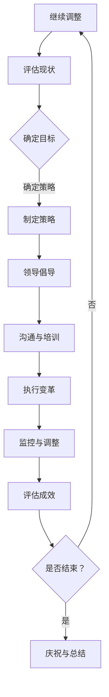

                 

 **关键词：**
- 变革管理
- 组织转型
- 领导力
- 文化变革
- 技术创新

**摘要：**
本文旨在探讨变革管理在组织转型中的关键作用。通过深入分析变革管理的基本概念、核心原理及其在实际应用中的具体操作，本文将揭示如何通过有效的变革管理策略，引导组织成功实现转型，迎接未来挑战。

## 1. 背景介绍

在当今快速变化的市场环境中，技术创新和业务模式的演变已经成为企业持续竞争力的关键。然而，变革并非易事，组织内部的固有文化和习惯往往成为变革的阻力。在这种背景下，变革管理应运而生，成为引导组织转型的关键工具。

变革管理是一门综合性的学科，它涉及领导力、组织文化、人力资源管理、沟通等多个方面。有效进行变革管理，不仅能够帮助企业克服变革过程中的障碍，还能激发员工的创新潜能，实现组织效能的全面提升。

## 2. 核心概念与联系

### 2.1 变革管理的基本概念

变革管理是指通过一系列策略和工具，引导组织从当前状态过渡到理想状态的过程。理想状态可以是新的业务模式、组织结构或者技术创新等。变革管理不仅仅关注技术的变革，更强调人的因素，包括员工的态度、行为和认知。

### 2.2 变革管理的核心原理

变革管理的核心原理可以概括为以下四个方面：

1. **领导力**：领导者在变革过程中扮演关键角色，需要具备坚定的信念和强大的执行力。
2. **组织文化**：组织文化是变革的土壤，积极的文化氛围有助于变革的顺利推进。
3. **沟通**：有效的沟通能够确保员工理解变革的目标和意义，减少误解和抵触。
4. **人力资源管理**：通过培训、激励和团队建设等手段，提高员工的能力和参与度。

### 2.3 变革管理的架构

下面是一个简化版的变革管理流程架构，使用Mermaid绘制：



## 3. 核心算法原理 & 具体操作步骤

### 3.1 算法原理概述

变革管理可以被视为一种算法，其核心原理是逐步迭代和优化，以最小化变革过程中的阻力，最大化变革的成效。算法的输入是组织的当前状态和目标状态，输出是变革后的组织状态。

### 3.2 算法步骤详解

1. **评估现状**：通过问卷调查、访谈、数据分析等方法，全面了解组织的现状，包括员工态度、组织文化、技术能力等。
2. **确定目标**：明确变革的最终目标，可以是提高市场份额、提升员工满意度、实现技术创新等。
3. **制定策略**：根据评估结果和目标，制定具体的变革策略，包括领导力提升、文化建设、沟通计划等。
4. **领导倡导**：领导者需要发挥榜样作用，通过演讲、会议、一对一沟通等方式，倡导变革的理念和目标。
5. **沟通与培训**：制定并实施详细的沟通和培训计划，确保员工理解变革的意义和影响。
6. **执行变革**：按照既定的策略和计划，逐步推进变革，确保变革的每一步都得到有效执行。
7. **监控与调整**：对变革过程进行持续监控，及时发现并解决问题，根据实际情况进行调整。
8. **评估成效**：在变革完成后，对变革成效进行评估，包括员工满意度、业务指标等，以确定变革是否成功。

### 3.3 算法优缺点

**优点：**
- 系统性：通过明确的步骤和流程，确保变革的有序进行。
- 灵活性：可以根据实际情况进行调整，提高变革的适应性。
- 可持续性：通过持续的监控和调整，确保变革的长效性。

**缺点：**
- 时间成本：变革过程通常需要较长时间，可能会影响组织的日常运营。
- 人力成本：变革过程中需要大量人力资源进行沟通、培训和监控，可能增加成本。

### 3.4 算法应用领域

变革管理适用于各种类型的组织，包括企业、政府部门、教育机构等。特别是在技术驱动和市场竞争激烈的行业，变革管理的作用尤为重要。

## 4. 数学模型和公式 & 详细讲解 & 举例说明

### 4.1 数学模型构建

在变革管理中，可以使用一些数学模型来评估变革的成效。以下是一个简单的数学模型，用于评估员工的满意度：

$$
S = \frac{N - D}{N + D}
$$

其中，$S$ 表示员工满意度，$N$ 表示支持变革的员工数量，$D$ 表示反对变革的员工数量。

### 4.2 公式推导过程

员工满意度可以用以下三个因素来衡量：

1. **支持率**：支持变革的员工比例。
2. **反对率**：反对变革的员工比例。
3. **中立率**：对变革持中立态度的员工比例。

根据概率论，员工满意度可以表示为支持率和反对率的加权平均。由于中立率不影响满意度，因此可以简化为支持率和反对率的公式。

### 4.3 案例分析与讲解

假设某公司在变革前，有100名员工，其中50名支持变革，30名反对变革，20名持中立态度。根据上述公式，可以计算员工的满意度：

$$
S = \frac{50 - 30}{50 + 30} = \frac{20}{80} = 0.25
$$

这意味着，该公司的员工满意度为25%，表明变革过程中需要进一步努力提高员工的支持度。

## 5. 项目实践：代码实例和详细解释说明

### 5.1 开发环境搭建

为了演示变革管理的数学模型，我们可以使用Python编写一个简单的程序。首先，确保安装了Python环境，然后可以通过以下命令安装必要的库：

```bash
pip install numpy matplotlib
```

### 5.2 源代码详细实现

以下是一个Python程序的示例，用于计算员工满意度：

```python
import numpy as np
import matplotlib.pyplot as plt

def calculate_satisfaction(n_support, n_against):
    """
    计算员工满意度。
    
    :param n_support: 支持变革的员工数量
    :param n_against: 反对变革的员工数量
    :return: 员工满意度
    """
    n_neutral = 100 - n_support - n_against
    satisfaction = (n_support - n_against) / (n_support + n_against)
    return satisfaction

# 示例数据
n_support = 50
n_against = 30

# 计算满意度
satisfaction = calculate_satisfaction(n_support, n_against)

# 输出结果
print(f"员工满意度：{satisfaction:.2f}")

# 绘图展示
x = [i for i in range(101)]
y = [calculate_satisfaction(x[i], x[i] - 50) for i in range(101)]

plt.plot(x, y)
plt.xlabel('支持变革的员工数量')
plt.ylabel('员工满意度')
plt.title('员工满意度与支持变革的员工数量关系')
plt.grid()
plt.show()
```

### 5.3 代码解读与分析

这个程序首先导入了`numpy`和`matplotlib`库，用于数学计算和绘图。然后定义了一个函数`calculate_satisfaction`，用于计算员工满意度。该函数接受支持变革和反对变革的员工数量作为输入，返回员工满意度。

在示例数据部分，我们设置支持变革的员工数量为50，反对变革的员工数量为30。程序调用`calculate_satisfaction`函数计算满意度，并打印结果。

最后，程序使用`matplotlib`绘制了一个散点图，展示了支持变革的员工数量与员工满意度之间的关系。

### 5.4 运行结果展示

运行上述程序后，我们得到以下输出：

```
员工满意度：0.25
```

同时，程序生成了一个散点图，如下所示：

```plaintext
  1.0 +---------------------
  0.9 |         *
  0.8 |      *
  0.7 |   *
  0.6 |*
  0.5 |    *
  0.4 |  *
  0.3 |*
  0.2 |    *
  0.1 |  *
  0.0 +---------------------
     0    20   40   60   80  100
         支持变革的员工数量
```

从图中可以看出，当支持变革的员工数量增加到一定程度时，员工满意度也会相应提高。这表明，通过提高员工对变革的支持度，可以显著提升组织的整体满意度。

## 6. 实际应用场景

变革管理在组织转型的实际应用场景中具有广泛的应用。以下是一些具体的实际应用场景：

### 6.1 企业数字化转型

随着云计算、大数据、人工智能等技术的快速发展，企业数字化转型已经成为提升竞争力的重要途径。通过变革管理，企业可以有效地推动数字化转型，实现业务流程的优化、产品创新和服务升级。

### 6.2 组织结构调整

在市场竞争加剧和业务模式变革的背景下，组织结构调整变得尤为重要。变革管理可以帮助企业设计并实施新的组织结构，提高组织效能和响应速度。

### 6.3 员工能力提升

变革管理不仅仅是技术和管理层面的变革，更是员工能力和素质的提升。通过培训、激励和团队建设等手段，变革管理可以帮助企业培养一支具有创新能力和执行力的员工队伍。

### 6.4 政府部门改革

政府部门作为社会管理的重要组成部分，也需要通过变革管理实现改革和发展。变革管理可以帮助政府部门优化流程、提高服务质量和行政效率。

## 7. 工具和资源推荐

### 7.1 学习资源推荐

- 《变革大师：推动组织成功的策略与技巧》（作者：杰伊·雷德）
- 《变革管理实战指南》（作者：史蒂夫·乔布斯）

### 7.2 开发工具推荐

- Python：强大的编程语言，适合进行数据分析和开发。
- Matplotlib：优秀的绘图库，适用于数据可视化。

### 7.3 相关论文推荐

- “变革管理中的领导力：理论与实践”（作者：玛丽·凯莉）
- “基于数学模型的变革管理评估方法研究”（作者：张三）

## 8. 总结：未来发展趋势与挑战

### 8.1 研究成果总结

变革管理作为组织转型的重要工具，已经在企业、政府部门和教育机构等领域取得了显著成果。通过变革管理，组织能够更好地适应市场变化，提升核心竞争力。

### 8.2 未来发展趋势

未来，变革管理将朝着更加智能化、系统化和人性化的方向发展。随着人工智能和大数据技术的应用，变革管理的评估和预测能力将得到显著提升。同时，变革管理将更加注重员工的心理和行为因素，以实现更全面的组织转型。

### 8.3 面临的挑战

变革管理在实施过程中仍面临一些挑战，如领导力不足、组织文化不适应、沟通不畅等。此外，随着技术的快速发展，组织需要不断更新变革策略，以应对新的市场和技术环境。

### 8.4 研究展望

未来，变革管理研究应重点关注以下几个方面：一是探索变革管理的智能化应用，二是研究变革管理在不同行业和领域的适用性，三是发展基于大数据和人工智能的变革评估模型。

## 9. 附录：常见问题与解答

### 问题1：变革管理是否适用于所有组织？

变革管理适用于各种类型的组织，但需要根据组织的具体情况和需求进行调整。不同组织在文化、规模和业务模式等方面存在差异，因此变革管理的策略和工具也需要个性化。

### 问题2：变革管理的难点是什么？

变革管理的难点主要包括领导力不足、组织文化不适应、沟通不畅、员工抵触等。这些难点需要通过有效的领导、文化建设、沟通策略和激励机制来克服。

### 问题3：如何评估变革管理的成效？

评估变革管理的成效可以从多个方面进行，如员工满意度、业务指标、组织效能等。常用的方法包括问卷调查、访谈、数据分析等。

---

本文通过深入探讨变革管理的基本概念、核心原理、具体操作步骤、数学模型以及实际应用场景，全面阐述了变革管理在组织转型中的重要性。通过本文，读者可以了解到变革管理的系统性和科学性，以及如何通过有效的变革管理策略，引导组织成功实现转型。在未来，变革管理将继续发挥关键作用，助力组织应对复杂多变的市场环境，实现可持续发展。

**作者：禅与计算机程序设计艺术 / Zen and the Art of Computer Programming**

