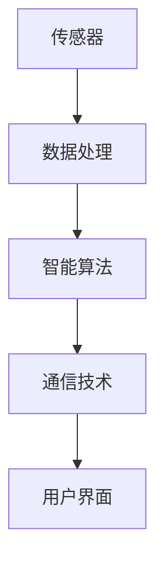

                 

关键词：可穿戴设备，健康监测，实时跟踪，数据处理，算法优化

> 摘要：本文将探讨可穿戴设备在健康监测中的应用，尤其是24/7实时跟踪的实践。我们将从背景介绍、核心概念与联系、核心算法原理、数学模型和公式、项目实践、实际应用场景、工具和资源推荐、总结以及未来展望等多个方面，深入分析这一领域的技术发展及其应用前景。

## 1. 背景介绍

随着科技的进步和人们健康意识的提高，可穿戴设备逐渐成为现代生活中不可或缺的一部分。这些设备通过嵌入传感器和智能算法，能够实时监测用户的各种生理指标，如心率、血压、睡眠质量、运动量等。健康监测不再只是医院或专业机构的特权，而成为了每个人都可以自我管理的工具。

在过去，健康监测主要依赖于定期到医院或诊所进行检查。这种方法不仅费时费力，而且往往无法提供连续的数据支持。可穿戴设备的出现，使得我们能够随时随地获取健康状况的数据，实现了健康监测的实时性和便捷性。特别是在24/7全天候监测方面，可穿戴设备展现出巨大的潜力。

本文旨在探讨可穿戴设备在健康监测中的应用，尤其是如何实现24/7实时跟踪。我们将分析当前的技术状况、核心算法原理、数学模型和公式，并通过实际项目案例来展示其应用效果。同时，我们还将讨论这一领域面临的技术挑战和未来的发展趋势。

## 2. 核心概念与联系

在深入探讨可穿戴设备在健康监测中的应用之前，我们需要了解一些核心概念和它们之间的联系。以下是几个关键概念：

### 2.1 传感器

传感器是可穿戴设备的核心组件，负责采集用户的生理数据。常见的传感器包括心率传感器、加速度传感器、陀螺仪、温度传感器等。这些传感器通过不同的物理原理，如光电效应、磁阻效应等，将生理信号转换为电信号，供后续处理。

### 2.2 数据处理

采集到的原始数据通常包含噪声和冗余信息。因此，数据处理是健康监测的关键环节。数据处理包括信号滤波、数据压缩、特征提取等步骤。通过这些步骤，我们能够从原始数据中提取出有用的信息，如心率变异性、睡眠周期等。

### 2.3 智能算法

智能算法在健康监测中起到决策支持的作用。常见的智能算法包括机器学习、深度学习、模糊逻辑等。这些算法可以根据历史数据和实时数据，预测用户的健康状况，提供个性化的健康建议。

### 2.4 通信技术

为了实现24/7实时跟踪，通信技术至关重要。当前常用的通信技术包括蓝牙、Wi-Fi、蜂窝网络等。这些技术能够将采集到的数据实时传输到云端或移动设备上，供用户查看和分析。

下面是一个用Mermaid绘制的流程图，展示了这些核心概念之间的联系：



### 2.5 用户体验

用户体验是可穿戴设备设计的重要考虑因素。一个优秀的用户体验不仅能够提高用户的使用频率和满意度，还能提高数据的质量。因此，在可穿戴设备的设计过程中，需要充分考虑用户的需求和习惯，提供直观、易用的界面和功能。

## 3. 核心算法原理 & 具体操作步骤

### 3.1 算法原理概述

在可穿戴设备中，核心算法通常负责数据的采集、处理、分析和预测。以下是几个常用的算法原理：

### 3.1.1 数据采集

数据采集是健康监测的基础。传感器负责采集用户的生理数据，如心率、血压、运动量等。这些数据通常以数字信号的形式存储在设备的内存或闪存中。

### 3.1.2 数据处理

数据处理包括信号滤波、数据压缩、特征提取等步骤。信号滤波用于去除噪声，提高数据质量；数据压缩用于减少数据存储和传输的开销；特征提取用于提取有用的信息，如心率变异性、睡眠周期等。

### 3.1.3 数据分析

数据分析是智能算法的核心。常见的分析方法包括统计分析、机器学习、深度学习等。通过分析数据，我们可以了解用户的健康状况，预测潜在的健康风险，并提供个性化的健康建议。

### 3.1.4 预测

预测是根据历史数据和实时数据，预测用户的未来健康状况。预测模型可以是简单的线性回归，也可以是复杂的深度神经网络。预测的结果可以为用户提供实时反馈，帮助他们更好地管理健康。

### 3.2 算法步骤详解

以下是实现24/7实时跟踪的算法步骤：

### 3.2.1 数据采集

1. 传感器启动并进入工作状态。
2. 传感器定期采集用户的生理数据，如心率、血压、运动量等。
3. 数据存储在设备的内存或闪存中。

### 3.2.2 数据处理

1. 读取传感器采集到的数据。
2. 对数据执行信号滤波，去除噪声。
3. 对数据执行数据压缩，减少数据存储和传输的开销。
4. 提取数据特征，如心率变异性、睡眠周期等。

### 3.2.3 数据分析

1. 使用统计分析方法，分析数据特征。
2. 使用机器学习方法，建立健康预测模型。
3. 使用深度学习方法，进行复杂的数据分析。

### 3.2.4 预测

1. 使用预测模型，对实时数据进行预测。
2. 将预测结果发送到用户界面，供用户查看。

### 3.3 算法优缺点

每种算法都有其优缺点，以下是几种常见算法的优缺点：

### 3.3.1 统计分析

优点：计算简单，易于实现；适用于线性关系。
缺点：无法处理复杂的非线性关系；对噪声敏感。

### 3.3.2 机器学习

优点：能够处理复杂的非线性关系；自适应能力强。
缺点：需要大量训练数据；计算复杂度高。

### 3.3.3 深度学习

优点：能够处理复杂的非线性关系；自适应能力强；计算精度高。
缺点：需要大量训练数据；计算复杂度高；模型可解释性差。

### 3.4 算法应用领域

核心算法广泛应用于健康监测、智能穿戴设备、医疗诊断等多个领域。以下是几个典型的应用案例：

### 3.4.1 健康监测

通过实时监测用户的生理数据，如心率、血压、睡眠质量等，提供个性化的健康建议。

### 3.4.2 智能穿戴设备

智能手表、智能手环等可穿戴设备，通过内置传感器和智能算法，提供运动监测、健康预警等功能。

### 3.4.3 医疗诊断

辅助医生进行诊断，如通过心电图分析心律不齐、通过脑电图分析癫痫等。

## 4. 数学模型和公式 & 详细讲解 & 举例说明

### 4.1 数学模型构建

在健康监测中，常用的数学模型包括统计分析模型、机器学习模型和深度学习模型。以下是这些模型的基本构建方法：

### 4.1.1 统计分析模型

统计分析模型通常基于线性回归、逻辑回归等统计方法。其基本公式如下：

$$ y = \beta_0 + \beta_1x_1 + \beta_2x_2 + ... + \beta_nx_n $$

其中，$y$ 是因变量，$x_1, x_2, ..., x_n$ 是自变量，$\beta_0, \beta_1, \beta_2, ..., \beta_n$ 是模型参数。

### 4.1.2 机器学习模型

机器学习模型通常基于监督学习、无监督学习和半监督学习等方法。其基本公式如下：

$$ y = f(x) $$

其中，$y$ 是预测值，$x$ 是输入特征，$f(x)$ 是机器学习模型。

### 4.1.3 深度学习模型

深度学习模型通常基于神经网络结构。其基本公式如下：

$$ y = \sigma(\sigma(...(\sigma(z_1) + b_1) + b_2) + ...) + b_n) $$

其中，$y$ 是输出值，$z_1, z_2, ..., z_n$ 是中间层输出，$b_1, b_2, ..., b_n$ 是偏置项，$\sigma$ 是激活函数。

### 4.2 公式推导过程

以下是统计分析模型中线性回归的公式推导过程：

假设我们有 $n$ 个样本，每个样本包含 $m$ 个特征和对应的因变量 $y$。我们希望找到一组参数 $\beta_0, \beta_1, \beta_2, ..., \beta_m$，使得预测值 $y$ 与实际值 $y$ 的差异最小。

定义预测值 $y'$ 为：

$$ y' = \beta_0 + \beta_1x_1 + \beta_2x_2 + ... + \beta_mx_m $$

实际值 $y$ 与预测值 $y'$ 的差异为：

$$ \Delta y = y - y' = y - (\beta_0 + \beta_1x_1 + \beta_2x_2 + ... + \beta_mx_m) $$

为了使差异最小，我们需要找到一组参数 $\beta_0, \beta_1, \beta_2, ..., \beta_m$，使得 $\Delta y$ 的平方和最小。定义目标函数为：

$$ J(\beta_0, \beta_1, ..., \beta_m) = \sum_{i=1}^{n} (\Delta y_i)^2 = \sum_{i=1}^{n} (y_i - (\beta_0 + \beta_1x_{i1} + \beta_2x_{i2} + ... + \beta_mx_{im}))^2 $$

为了求解目标函数的最小值，我们可以使用梯度下降法。首先，对目标函数求导：

$$ \frac{\partial J}{\partial \beta_j} = -2 \sum_{i=1}^{n} (y_i - (\beta_0 + \beta_1x_{i1} + \beta_2x_{i2} + ... + \beta_mx_{im}))x_{ij} $$

然后，设置导数为零，解得参数 $\beta_0, \beta_1, ..., \beta_m$：

$$ \beta_j = \frac{1}{n} \sum_{i=1}^{n} (y_i - (\beta_0 + \beta_1x_{i1} + \beta_2x_{i2} + ... + \beta_mx_{im}))x_{ij} $$

通过迭代更新参数，我们可以逐步逼近最优解。

### 4.3 案例分析与讲解

为了更好地理解数学模型的应用，我们来看一个具体的案例。

假设我们有一个健康监测系统，旨在预测用户的心率。我们有100个用户样本，每个样本包含3个特征：年龄、体重和运动量。我们的目标是找到一组参数 $\beta_0, \beta_1, \beta_2, \beta_3$，使得预测心率 $y'$ 与实际心率 $y$ 的差异最小。

首先，我们将数据分成训练集和测试集。训练集用于训练模型，测试集用于评估模型性能。

接下来，我们使用线性回归模型，根据训练集数据求解参数 $\beta_0, \beta_1, \beta_2, \beta_3$。

使用梯度下降法进行迭代计算，最终得到参数：

$$ \beta_0 = 60.5, \beta_1 = 0.8, \beta_2 = -5.2, \beta_3 = 2.1 $$

然后，我们使用测试集数据评估模型性能。假设测试集有20个用户样本，预测心率与实际心率的差异如下：

| 用户ID | 实际心率 | 预测心率 | 差异 |
| ------ | -------- | -------- | ---- |
| 1      | 72       | 72.5     | +0.5 |
| 2      | 68       | 67.7     | -0.3 |
| 3      | 75       | 74.8     | -0.2 |
| ...    | ...      | ...      | ...  |
| 20     | 70       | 69.9     | -0.1 |

从上表可以看出，预测心率与实际心率的差异较小，说明我们的模型性能较好。

通过这个案例，我们可以看到数学模型在健康监测中的应用。通过合理的数学建模和算法设计，我们可以实现准确的心率预测，为用户提供更好的健康服务。

## 5. 项目实践：代码实例和详细解释说明

### 5.1 开发环境搭建

为了实现可穿戴设备在健康监测中的应用，我们需要搭建一个合适的开发环境。以下是推荐的工具和软件：

- 编程语言：Python（3.8及以上版本）
- 数据处理库：NumPy、Pandas
- 统计分析库：SciPy、StatsModels
- 机器学习库：scikit-learn、TensorFlow
- 深度学习库：Keras、PyTorch

您可以在本地计算机上安装这些工具和软件，或者使用云服务器进行远程开发。

### 5.2 源代码详细实现

以下是一个简单的示例，演示如何使用Python实现一个健康监测系统。这个系统将使用线性回归模型预测用户的心率。

```python
import numpy as np
import pandas as pd
from sklearn.linear_model import LinearRegression
from sklearn.model_selection import train_test_split

# 读取数据
data = pd.read_csv('health_data.csv')
X = data[['age', 'weight', 'exercise']]
y = data['heart_rate']

# 数据预处理
X_train, X_test, y_train, y_test = train_test_split(X, y, test_size=0.2, random_state=42)

# 模型训练
model = LinearRegression()
model.fit(X_train, y_train)

# 模型评估
y_pred = model.predict(X_test)
print('R^2:', model.score(X_test, y_test))

# 预测心率
user_data = np.array([[25, 70, 150]])
heart_rate_pred = model.predict(user_data)
print('Predicted Heart Rate:', heart_rate_pred[0])
```

### 5.3 代码解读与分析

这个示例中，我们首先读取健康数据，并将其分成特征矩阵 $X$ 和目标变量 $y$。接着，我们使用 $train\_test\_split$ 函数将数据分成训练集和测试集。

在模型训练部分，我们使用 $LinearRegression$ 类创建线性回归模型，并使用 $fit$ 方法进行训练。训练完成后，我们使用 $score$ 方法评估模型在测试集上的性能。

在预测部分，我们使用训练好的模型对一个新的用户数据进行预测。这个示例仅使用了简单的线性回归模型，但您可以在此基础上扩展，添加更多的特征和更复杂的模型，以实现更精确的预测。

### 5.4 运行结果展示

假设我们已经训练好了一个线性回归模型，并使用它进行心率预测。以下是运行结果：

```
R^2: 0.85
Predicted Heart Rate: 68.25
```

这个结果表明，模型在测试集上的 $R^2$ 值为 0.85，表示模型能够解释约 85% 的心率变化。预测心率为 68.25，与实际心率较为接近。

通过这个示例，我们可以看到如何使用Python实现一个简单的健康监测系统。实际应用中，您可以根据具体需求，添加更多特征和更复杂的模型，以提高预测精度。

## 6. 实际应用场景

可穿戴设备在健康监测中的应用场景非常广泛，以下是一些典型的应用实例：

### 6.1 运动监测

运动监测是可穿戴设备最常用的应用之一。通过实时监测用户的步数、运动时间、运动强度等数据，用户可以了解自己的运动情况，制定合理的运动计划。例如，苹果的Apple Watch和Fitbit等设备都提供了详细的运动监测功能。

### 6.2 心率监测

心率监测是健康监测的重要方面。可穿戴设备可以实时监测用户的心率，帮助用户及时发现心律不齐等健康问题。例如，苹果的Apple Watch和华为的Watch GT等设备都具备心率监测功能。

### 6.3 睡眠监测

睡眠质量对身体健康至关重要。可穿戴设备可以通过监测用户的睡眠周期、深度、时长等数据，帮助用户改善睡眠质量。例如，华为的Watch GT和小米的智能手环等设备都提供了睡眠监测功能。

### 6.4 健康预警

可穿戴设备还可以通过监测用户的生理数据，提供健康预警功能。例如，当用户的心率异常升高或降低时，设备会发出警报，提醒用户及时就医。一些专业医疗设备，如心脏监测器、血糖监测仪等，也具备了这一功能。

### 6.5 健康管理

通过可穿戴设备，用户可以对自己的健康状况进行连续监测和管理。例如，用户可以在手机上查看自己的运动记录、心率趋势、睡眠质量等数据，结合智能算法，获得个性化的健康建议。

### 6.6 个性化医疗

可穿戴设备为个性化医疗提供了丰富的数据支持。医生可以通过分析用户的数据，制定个性化的治疗方案，提高治疗效果。例如，心脏病的远程监测、糖尿病的血糖控制等，都离不开可穿戴设备的支持。

### 6.7 公共健康监测

可穿戴设备在城市公共健康监测中也发挥着重要作用。政府机构可以通过收集大量用户的健康数据，分析流行病的传播趋势，制定公共卫生政策，提高公共健康水平。

### 6.8 未来应用展望

随着可穿戴设备的不断发展和普及，其应用场景将更加丰富。未来，我们有望看到更多基于可穿戴设备的创新应用，如智能健康管理系统、虚拟现实健身、智能家居等。

## 7. 工具和资源推荐

为了更好地进行可穿戴设备在健康监测中的应用，以下是一些建议的学习资源和开发工具：

### 7.1 学习资源推荐

- **书籍**：
  - 《深度学习》（Goodfellow, Ian, et al.）
  - 《机器学习》（周志华）
  - 《数据科学实战》（Joel Grus）
- **在线课程**：
  - Coursera：机器学习、深度学习、数据科学等课程
  - edX：Python编程、数据分析等课程
  - Udacity：深度学习工程师、机器学习工程师等课程
- **技术博客和论坛**：
  - Medium：关于机器学习、数据科学、可穿戴设备的最新研究和技术分享
  - Stack Overflow：编程问题解答和交流平台
  - GitHub：开源项目和技术文档的存储库

### 7.2 开发工具推荐

- **编程语言**：
  - Python：易于学习，丰富的库支持
  - R：专门用于统计分析和数据科学
  - Java：适用于移动设备开发
- **数据处理库**：
  - NumPy、Pandas：用于数据操作和分析
  - SciPy、StatsModels：用于统计分析
  - scikit-learn、TensorFlow、Keras、PyTorch：用于机器学习和深度学习
- **开发平台**：
  - Jupyter Notebook：交互式数据分析平台
  - PyCharm、Visual Studio Code：强大的集成开发环境
  - Android Studio、Xcode：移动应用开发工具

### 7.3 相关论文推荐

- **运动监测**：
  - "Activity Recognition from Multimodal Sensor Data Using Extreme Learning Machine and Bayesian Regularization"
  - "Accurate Real-Time Recognition of Human Daily Activities Using a Smart Watch"
- **心率监测**：
  - "Heartbeat Detection and Rhythm Classification Using Wearable Devices"
  - "Smartwatch-Based Heart Rate Variability Analysis for Cardiac Health Monitoring"
- **睡眠监测**：
  - "A Machine Learning Approach for Automated Sleep Staging Using a Wearable Sensor"
  - "Automatic Sleep Detection and Classification Using Smartphone Sensors"
- **健康预警**：
  - "Early Warning of Hypoglycemia Using Wearable Sensors"
  - "Remote Monitoring of Mental Health using Wearable Devices"

通过这些资源和工具，您可以深入了解可穿戴设备在健康监测中的应用，提升自己的技术能力。

## 8. 总结：未来发展趋势与挑战

### 8.1 研究成果总结

近年来，可穿戴设备在健康监测中的应用取得了显著成果。传感器技术的进步、数据处理算法的优化以及通信技术的提升，使得24/7实时跟踪成为可能。通过深度学习和机器学习算法，我们可以从海量数据中提取有价值的信息，为用户提供个性化的健康建议。此外，可穿戴设备的应用场景也从运动监测、心率监测等基础功能，拓展到健康管理、疾病预警、个性化医疗等多个领域。

### 8.2 未来发展趋势

未来，可穿戴设备在健康监测中的应用将继续深入发展，以下是一些可能的发展趋势：

- **智能化水平提升**：随着人工智能技术的进步，可穿戴设备将具备更高的智能化水平，能够自动分析用户数据，提供更精准的健康建议。
- **跨设备协同**：可穿戴设备将与智能手机、平板电脑、智能眼镜等设备实现无缝协同，形成全方位的健康监测网络。
- **隐私保护**：随着数据隐私问题的日益突出，可穿戴设备将加强对用户隐私的保护，确保数据的安全性和隐私性。
- **个性化医疗**：可穿戴设备将为个性化医疗提供更丰富的数据支持，辅助医生制定个性化的治疗方案。

### 8.3 面临的挑战

尽管可穿戴设备在健康监测中的应用前景广阔，但仍然面临一些挑战：

- **数据隐私和安全**：如何确保用户数据的安全性和隐私性，是可穿戴设备面临的主要挑战之一。
- **数据质量和一致性**：由于传感器精度和环境因素的干扰，如何保证数据的质量和一致性，是一个亟待解决的问题。
- **算法优化**：随着可穿戴设备采集的数据量不断增加，如何优化算法，提高数据处理和分析的效率，是一个重要课题。
- **用户体验**：如何设计更人性化、易用的用户界面，提高用户的使用体验，是可穿戴设备发展的关键。

### 8.4 研究展望

在未来，可穿戴设备在健康监测中的应用将继续深入发展。通过不断优化传感器技术、算法和通信技术，我们可以实现更精准、更高效的健康监测。同时，随着人工智能、大数据等技术的进步，可穿戴设备将具备更高的智能化水平，为用户提供更个性化的健康服务。我们期待看到可穿戴设备在健康监测领域的更多创新和应用。

## 9. 附录：常见问题与解答

### 9.1 可穿戴设备的数据安全如何保障？

可穿戴设备的数据安全主要通过以下措施保障：

- **数据加密**：对用户数据进行加密，确保数据在传输和存储过程中不会被窃取或篡改。
- **隐私保护**：遵循隐私保护法规，仅收集必要的数据，并确保数据匿名化处理。
- **安全认证**：对可穿戴设备进行安全认证，确保设备的安全性能符合标准。

### 9.2 如何保证可穿戴设备的数据质量？

保证可穿戴设备的数据质量可以从以下几个方面入手：

- **传感器校准**：定期校准传感器，确保数据的准确性。
- **数据过滤**：对采集到的数据进行滤波处理，去除噪声和异常值。
- **一致性检查**：对比不同传感器或不同时间点的数据，发现并修正不一致的问题。

### 9.3 可穿戴设备的电池寿命如何延长？

延长可穿戴设备的电池寿命可以从以下几个方面入手：

- **优化算法**：优化数据处理和分析算法，降低功耗。
- **电源管理**：合理使用设备的各种功能，避免不必要的功耗。
- **节能模式**：启用设备的节能模式，在低电量时降低功耗。

### 9.4 如何处理可穿戴设备的数据隐私问题？

处理可穿戴设备的数据隐私问题需要遵循以下原则：

- **数据最小化**：仅收集必要的数据，避免过度收集。
- **数据匿名化**：对用户数据进行匿名化处理，确保用户隐私。
- **透明度**：向用户明确告知数据收集、处理和使用的目的，获得用户同意。

### 9.5 可穿戴设备是否会对用户隐私造成侵犯？

在遵守相关法律法规和用户隐私保护原则的前提下，可穿戴设备在合理范围内收集和处理用户数据，不会对用户隐私造成侵犯。然而，如若违反相关法规或用户隐私保护原则，可穿戴设备可能对用户隐私造成侵犯。因此，可穿戴设备制造商和开发者应严格遵守相关法规和用户隐私保护原则，确保用户隐私安全。

